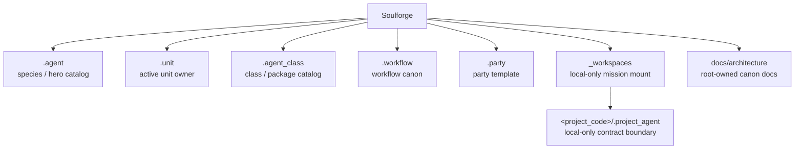

# 저장소 목적

## 목적

- Soulforge를 새 정본 vNext 6축을 고정하는 설계 저장소로 유지한다.
- 구현보다 owner 경계, 구조, derive/validate 계약, public/private tracking 원칙을 먼저 닫는다.

## 정본 6축

- `.agent` = species / hero catalog
- `.unit` = active agent unit owner
- `.agent_class` = class / package catalog
- `.workflow` = workflow canon + curated learning history
- `.party` = reusable party template + template-level stats
- `_workspaces` = reserved / local-only mission site mount point

## 구조 개요도

## 포함 대상

- foundation / workspace / UI canon 문서
- owner-local skeleton 과 template 메타
- validator / fixture / derived state 기준선
- local-only smoke 경계와 public repo tracking 정책

## 제외 대상

- 실제 `_workspaces/<project_code>/` 운영 데이터
- raw run, analytics, nightly healing, reports, artifacts
- 대규모 runtime 이전
- 외부 private mount path 자체의 materialization 전략

## 이 저장소가 하는 일

- 정본 6축의 owner 경계를 문서와 skeleton 으로 고정한다.
- UI가 정본을 대체하지 않고, 6축 정본에서 파생된 소비층임을 고정한다.
- `_workspaces` 를 public tracked data root 가 아니라 local-only mission site mount point 로 고정한다.
- validator 와 fixture 가 synthetic/public-safe 기준에서도 깨지지 않게 기준선을 유지한다.

## 중요한 경계

- `.agent` 는 single active body root 가 아니라 species / hero catalog owner 다.
- `.unit` 이 active binding 과 owner surface 를 가진다.
- `.agent_class` 는 reusable class / package catalog owner 다.
- `.workflow` 와 `.party` 는 class 하위가 아니라 독립 root 다.
- `_workspaces/<project_code>/` actual content 는 public repo 정본이 아니다.
- `.run/` 루트는 새 정본에 포함하지 않는다.

## 자주 찾는 문서

- `README.md`
- `AGENTS.md`
- `docs/architecture/foundation/TARGET_TREE.md`
- `docs/architecture/foundation/DOCUMENT_OWNERSHIP.md`
- `docs/architecture/workspace/WORKSPACE_PROJECT_MODEL.md`
- `docs/architecture/workspace/PROJECT_AGENT_MINIMUM_SCHEMA.md`
- `docs/architecture/workspace/PROJECT_AGENT_RESOLVE_CONTRACT.md`
- `docs/architecture/ui/UI_SOURCE_MAP.md`
- `docs/architecture/ui/UI_SYNC_CONTRACT.md`
- `docs/architecture/ui/UI_CONTROL_CENTER_MODEL.md`

## 이식 관점

- 기존 저장소는 참고용이다.
- 과거 body/loadout/company/personal vocabulary 는 archive 나 migration history 에만 남긴다.
- live 문서와 live consumer 는 vNext 6축 vocabulary 를 정본으로 사용한다.
