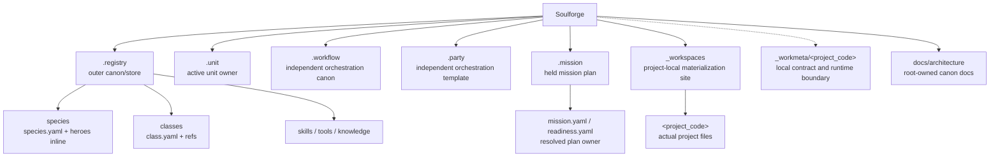

# 저장소 목적

## 목적

- Soulforge를 canonical root 와 project-local worksite 경계를 고정하는 설계 저장소로 유지한다.
- 구현보다 owner 경계, 구조, derive/validate 계약, public/private tracking 원칙을 먼저 닫는다.

## 정본 6축

- `.registry` = outer canon/store
- `.unit` = active agent unit owner
- `.workflow` = independent orchestration canon
- `.party` = independent orchestration template
- `.mission` = held mission plan owner
- `_workspaces` = project-local materialization site

## 구조 개요도

## 포함 대상

- foundation / workspace / UI canon 문서
- owner-local skeleton 과 template 메타
- validator / fixture / derived state 기준선
- local-only smoke 경계와 public repo tracking 정책

## 제외 대상

- 실제 `_workspaces/<project_code>/` 운영 데이터
- raw run, analytics, nightly healing, reports, artifacts
- 대규모 runtime 이전
- 외부 private mount path 자체의 materialization 전략

## 이 저장소가 하는 일

- canonical roots 의 owner 경계를 문서와 skeleton 으로 고정한다.
- UI가 canonical roots 에서 파생된 소비층임을 고정한다.
- `.mission` 을 held mission plan owner 로 고정한다.
- `_workspaces` 를 public tracked data root 가 아니라 local-only project materialization mount point 로 고정한다.
- validator 와 fixture 가 synthetic/public-safe 기준에서도 깨지지 않게 기준선을 유지한다.

## 중요한 경계

- `.registry` 는 outer canon/store owner 다.
- `.unit` 이 active binding 과 owner surface 를 가진다.
- `.workflow` 와 `.party` 는 `.registry` 하위가 아니라 독립 root 다.
- `.mission` 은 workflow/party/unit resolve 결과를 소유하는 독립 root 다.
- species/hero canon 은 `.registry/species/<species_id>/species.yaml` 와 inline `heroes:` 에 둔다.
- `_workspaces/<project_code>/` actual content 는 local-only project materialization content 로 관리한다.
- assigned execution plan 과 mission-level 배정 owner 는 `.mission` 이 소유한다.
- `.run/` 루트는 새 정본에 포함하지 않는다.

## 자주 찾는 문서

- `README.md`
- `AGENTS.md`
- `docs/architecture/foundation/VISION_AND_GOALS.md`
- `.registry/README.md`
- `docs/architecture/foundation/TARGET_TREE.md`
- `docs/architecture/foundation/DOCUMENT_OWNERSHIP.md`
- `docs/architecture/workspace/WORKSPACE_PROJECT_MODEL.md`
- `docs/architecture/workspace/WORKMETA_MINIMUM_SCHEMA.md`
- `docs/architecture/workspace/WORKMETA_RESOLVE_CONTRACT.md`
- `docs/architecture/ui/UI_SOURCE_MAP.md`
- `docs/architecture/ui/UI_SYNC_CONTRACT.md`
- `docs/architecture/ui/UI_CONTROL_CENTER_MODEL.md`
