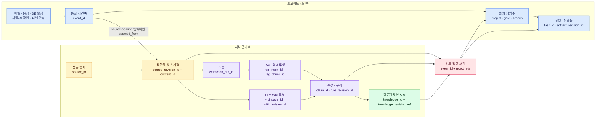

# Temporal Knowledge Ontology v0

- 상태: public-safe 통합 계약, writer/ERP/graph migration 은 후속 activation gate
- 범위: 프로젝트 시간축, source revision, RAG, LLM Wiki, 지식 정본,
  SE 일정·산출물 규칙의 공통 식별·관계 기준
- 기존 정본 유지:
  - 사건축/생명수: [`ENGINE-12-CONTEXT-LIFE-TREE.md`](../../../ui-workspace/apps/dev-erp/docs/slices/ENGINE-12-CONTEXT-LIFE-TREE.md)
  - 파일 개정: [`PROJECT_FILE_ACTIVITY_REVISION_V0.md`](../workspace/PROJECT_FILE_ACTIVITY_REVISION_V0.md)
  - RAG: [`RAG_THREE_STAGE_OPERATING_MODEL_V0.md`](../guild_hall/RAG_THREE_STAGE_OPERATING_MODEL_V0.md)
  - 지식/Wiki: [`KNOWLEDGE_WIKI_WORLDVIEW_V0.md`](../guild_hall/KNOWLEDGE_WIKI_WORLDVIEW_V0.md)
  - SE 산출물: [`SE_ASSISTANT_OPERATING_MODEL_V0.md`](../workspace/SE_ASSISTANT_OPERATING_MODEL_V0.md)

## 1. 목적

메일·음성·SE 일정·사람/AI 작업·파일 이력으로 만든 프로젝트 시간축과,
가이드북·표준·사내 규칙·LLM Wiki·RAG·정본 지식을 같은 시점의 근거로 연결한다.

새 거대 저장소나 새 top-level ontology root 를 만들지 않는다. 이미 존재하는 owner
surface 를 유지하고, 그 사이를 `source_revision_id` 중심의 얇은 공통 식별 계층으로
잇는다.

## 2. ASSUMPTIONS

- 기존 `source_handle`, `source_id`, `source_ref_id`와 파일·사건 ID는 폐기하지 않는다.
  동일한 논리 source임이 검증된 값만 canonical `source_id` alias로 연결한다.
  index/sidecar/packet/bundle을 가리키는 generic `source_ref_id`는 alias로 합치지 않고
  typed reference 또는 source collection 관계로 보존한다.
- 현재 legacy 자료는 자동으로 승인·재분류하지 않는다. exact revision/evidence가 없는
  행은 `legacy_unbound` 또는 `review_required`로 남긴다.
- 이 문서는 ID와 관계 계약을 고정한다. live writer, private data migration, ERP evidence
  retrieval, Neo4j projection 활성화는 각각 별도 검증을 통과해야 한다.

## 3. 한 문장 모델

> 프로젝트에서는 사건이 시간축을 만들고, 지식에서는 정확한 원본 개정이 근거축을
> 만들며, 실제 업무 적용 사건이 두 축을 연결한다.



## 4. 정본과 파생층

`정본 RAG`라는 단일 층은 두지 않는다. RAG는 언제든 다시 만들 수 있는 검색
투영이다. 정본은 출처와 지식에 각각 존재한다.

| 층 | 역할 | authority |
| --- | --- | --- |
| 정본 출처 | owner-held 원본과 승인된 source packet/revision | 사실 근거 |
| RAG | exact source revision에서 페이지·문단·표를 찾는 index | 파생 검색 |
| LLM Wiki | 출처를 반복해서 읽기 쉬운 sourcebound projection | 파생 설명 |
| 정본 지식 | 검토된 재사용 지식·규칙·공개 또는 비공개 canon | 승인된 재사용 |
| 프로젝트 적용 | 어떤 과제·관문·가지·할일·산출물이 무엇을 사용했는지 기록 | 업무 사실 |
| Neo4j/Obsidian/UI | 위 owner surface를 읽어 보여주는 view | 조회 전용 |

RAG 검색 결과나 Wiki 문장이 source truth를 덮어쓰지 않는다. NotebookLM 답변,
LLM 요약, Neo4j edge, 사용 빈도도 자동 승인이나 canon 승격 근거가 아니다.

## 5. ID 원칙

### 5.1 하나의 개체에는 하나의 자기 ID

파일이나 행 하나에 모든 ID를 억지로 넣지 않는다.

- 원본 개정 record는 `source_revision_id`를 자기 ID로 가진다.
- RAG chunk는 `rag_chunk_id`를 자기 ID로 갖고 `source_revision_id`를 참조한다.
- Wiki revision은 `wiki_revision_id`를 자기 ID로 갖고 source/claim refs를 참조한다.
- 프로젝트 적용은 `event_id` 또는 persisted relation의 `binding_id`를 자기 ID로 갖고
  project/gate/branch/task/artifact/knowledge refs를 참조한다. 하나의 적용 packet 안에서
  두 ID를 동시에 자기 ID로 쓰지 않는다.

즉 `자기 ID 1개 + 필요한 관계 ref 0..N개`다. 파일명은 표시·운영 편의를 위한
locator일 뿐 identity가 아니다.

### 5.2 공통 ID 목록

| ID | 의미 | 현재/신규 |
| --- | --- | --- |
| `project_id` | 과제 정체성; cross-system 값은 `project_code`, DB 정수는 owner-local alias | 기존 유지 |
| `gate_id` | 과제의 PDR/CDR 등 관문 마디 | 기존 stage/gate를 exact mapping |
| `branch_id` | 끝을 가질 수 있는 과제 업무 맥락 가지 | 기존 `branch:<project>:<key>` 유지 |
| `event_id` | 발생·관측·상태변경·예정 사건 | 기존 유지 |
| `task_id` | 할일 정체성 | 기존 ERP/task ID 유지 |
| `logical_file_id` | 이름·경로와 독립적인 파일 계보 | 기존 유지 |
| `revision_id` | logical file 안의 내용 변경 occurrence | 기존 유지 |
| `content_id` | `sha256:<full digest>` byte identity | 기존 유지 |
| `observation_id` | 특정 node가 특정 scan에서 본 불변 관측 | 기존 유지 |
| `source_id` | 문서·가이드·표준·메일·음성 등 논리 source 정체성 | 공통 의미 고정 |
| `source_revision_id` | 정확한 판/개정/스냅샷 | **새 중앙 연결키** |
| `source_collection_id` | bundle/index가 가리키는 source 묶음 | 신규 |
| `evidence_locator_id` | source revision 안의 page/section/table/record 위치 | 신규 |
| `extraction_run_id` | parser/tool/version이 고정된 추출 실행 | 기존 run ID와 mapping |
| `rag_index_id` | 특정 source revision 묶음으로 만든 index | 기존 index ID 강화 |
| `rag_chunk_id` | exact revision+추출 profile+locator/content로 만든 chunk | 기존 ID 강화 |
| `wiki_page_id` | 하나의 Wiki 논리 페이지 | 신규 |
| `wiki_revision_id` | 그 페이지의 sourcebound 개정 | 신규 |
| `claim_id` | 출처로 검증할 수 있는 원자 주장 | 공통 의미 고정 |
| `rule_id` | 일정·산출물·검토·준수 규칙의 논리 정체성 | 기존 값 유지 |
| `rule_revision_id` | 특정 시점의 정확한 규칙 내용 | 신규 |
| `knowledge_id` | 검토된 재사용 지식 canon entry | 기존 유지 |
| `knowledge_revision_ref` | 당시 사용한 정본 지식의 exact commit/hash/package revision | 신규 |
| `artifact_type_id` | 산출물 종류 | 기존 type 값을 exact mapping |
| `artifact_id` | 논리 산출물 | 기존 유지 |
| `artifact_revision_id` | 정확한 산출물 개정 | 신규 공통 연결키 |
| `artifact_version` | 사람이 읽는 산출물 version label | 기존 유지 |
| `binding_id` | lifecycle/evidence를 가진 persisted N:M 관계 record | 필요할 때만 신규 |

`relation_id`/`binding_id`는 모든 단순 ref에 의무가 아니다. 관계 자체가 승인 상태,
발생 시각, supersession, 근거를 가져야 할 때만 만든다.
tracked 예시의 프로젝트 적용 packet은 `event_id`만 자기 ID로 사용한다. 별도
`binding_id`가 필요한 경우에는 그 관계 record를 별도 파일/행으로 만든다.

### 5.3 canonical entity ref

bare 문자열 하나를 전역 고유 ID로 해석하지 않는다. DAPA 항목처럼 `knowledge_id`와
`source_id`가 같은 문자열일 수 있기 때문이다. 모든 관계 endpoint의 canonical ref는
다음 3-tuple이다.

```yaml
entity_type: source_revision
owner_surface: system_knowledge_metadata
entity_id: example_guidebook__2026_01__a1b2c3d4e5f6
```

즉 전역 식별 범위는 `{entity_type, owner_surface, entity_id}`다. `project_id` 필드에는
cross-system `project_code`를 쓰고, dev-ERP의 `core_project.id` 같은 정수는
`owner_surface: dev_erp` 아래 local alias로 exact mapping한다. 기존 graph의
`node_type + node_ref`는 이 tuple로 무손실 변환한다.

정본 지식은 logical entry와 exact revision을 분리한다.

```yaml
knowledge_revision_ref:
  entity_ref:
    entity_type: knowledge_revision
    owner_surface: public_registry
    entity_id: "example_knowledge@git:<full_commit>"
  logical_knowledge_ref:
    entity_type: knowledge
    owner_surface: public_registry
    entity_id: example_knowledge
  revision_kind: git_commit_and_content_hash
  revision_value: "<full_commit>"
  content_id: sha256:<full_digest>
```

`uses` 관계의 target은 위 `knowledge_revision_ref.entity_ref`와 byte-for-byte 같아야 한다.
public registry revision의 `entity_id`는 exact commit/package revision을, private canon은
exact `wiki_revision_id + content hash + owner decision`에 묶인 opaque immutable ref를
사용한다. `logical_knowledge_ref has_revision entity_ref`와
`entity_ref consolidates claim/rule_revision` 관계를 함께 남긴다.
`logical_knowledge_ref`는 탐색/그룹용이고 과거 사용 근거를 대신하지 않는다.

### 5.4 `source_revision_id` 생성 기준

다음 중 하나가 바뀌면 새 source revision이다.

- 원본 byte 또는 구조화 record 내용
- 공식 판/개정/발행 상태
- 법령·규칙의 적용 효력 범위
- 같은 byte라도 별도 발행 occurrence로 관리해야 하는 source semantics

다른 PC·Drive·NAS에 같은 byte가 복사되거나 경로·파일명만 바뀐 경우에는 새 source
revision이 아니다. 새 `observation_id`/storage binding만 추가한다.

`source_revision_id`는 불변 opaque ID다. 날짜+짧은 hash는 권장 표시 형식일 뿐 ID를
재계산하는 유일한 공식이 아니다. 같은 byte가 별도로 발행된 occurrence라면
`issuance_occurrence_id`가 달라 서로 다른 revision을 만들 수 있다.

binary와 구조화 record의 hash 기준도 분리한다.

- `content_basis: raw_bytes`: 보관된 raw byte의 SHA-256을 `content_id`로 쓴다.
- `content_basis: canonical_record`: 명시한 `canonicalization_profile_id`로 key 순서,
  timestamp, line ending 등을 결정적으로 직렬화한 byte를 hash한다. raw payload는 별도
  workspace source로 보존한다.
- 메일·음성·SE 일정의 provider/native ID는 identity를 보조하는
  `issuance_occurrence_id` 또는 typed native ref이며, hash를 대체하지 않는다.

최소 immutable identity record:

```yaml
source_id: example_guidebook
source_revision_id: example_guidebook__2026_01__a1b2c3d4e5f6
content_id: sha256:<full_digest>
content_basis: raw_bytes
canonicalization_profile_id: null
issuance_occurrence_id: official_publication_2026_01
revision_label: "2026-01"
published_at: null
effective_from: null
effective_to: null
observed_at: "2026-07-13T00:00:00Z"
ingested_at: "2026-07-13T00:01:00Z"
supersedes_source_revision_id: null
source_card_ref: _workspaces/knowledge/source_cards/example_guidebook.source_card.json
```

ID의 짧은 hash 부분은 사람이 다루기 위한 collision-resistant suffix다. byte proof는
항상 별도 `content_id`의 full SHA-256이 맡는다. 승인, hash 검증 완료 여부, claim
ceiling은 이 immutable record를 고치지 않고 append-only 상태 사건으로 추가한다.

### 5.5 legacy alias와 typed ref crosswalk

기존 값을 대량 rename하지 않는다.

```yaml
source_id: example_guidebook
aliases:
  - alias_type: source_handle
    alias_value: example_guidebook_legacy_handle
    resolution_status: verified_same_source
legacy_refs:
  - ref_kind: source_index
    owner_surface: legacy_knowledge_ingest
    ref_value: legacy_source_ref_001
```

alias는 locator가 아니며 canonical source를 하나로 resolve하기 위한 metadata다.
하나의 alias가 여러 `source_id`로 resolve되면 자동 합치지 않고 conflict로 둔다.
`source_ref_id`가 실제로 동일한 논리 source를 가리킨다는 검증이 있을 때만 alias가 될
수 있다. index, sidecar, resolver packet은 typed ref로 남기고, bundle이면
`SourceCollection contains Source`로 매핑한다.

### 5.6 프로젝트 파일 개정과의 연결

파일 이력의 기존 계보를 source 모델로 대체하지 않는다.

```text
logical_file_id
  -> revision_id
     -> content_id

source_id
  -> source_revision_id
     -> materialized_as revision_id
     -> same full content_id when the raw bytes are identical
```

한 source revision이 여러 PC·Drive·NAS의 여러 file revision/observation으로 보일 수
있다. 경로·파일명·mtime은 materialization/observation evidence이고 source identity가
아니다. 반대로 업무 파일이 RAG/Wiki 지식 source가 되는 순간에만
`source_revision_id -> revision_id` 관계를 만든다. 모든 일반 파일을 지식 source로
자동 승격하지 않는다.

산출물도 같은 원칙을 쓴다. `artifact_version`은 사람이 읽는 label,
`artifact_revision_id`는 불변 변경 occurrence, `revision_id`는 실제 파일 revision이다.
산출물이 파일로 저장되면 `artifact_revision materialized_as file_revision` 관계로 잇는다.

### 5.7 입력별 native occurrence와 사건 연결

시간축 사건과 RAG/Wiki가 같은 원문을 보게 하려면 source-bearing 입력 사건이 exact
revision을 직접 참조해야 한다.

| 입력 | native occurrence ref | exact source revision | 사건 관계 |
| --- | --- | --- | --- |
| 메일 | provider message/thread ref | raw message 또는 결정적 body snapshot | `event sourced_from source_revision` |
| 음성 | recording/file occurrence | audio revision; transcript는 별도 derived source revision | recording/transcription event가 각 exact revision을 `sourced_from` |
| SE 일정 | schedule row/version/snapshot ref | 결정적으로 직렬화한 일정 record revision | `event sourced_from source_revision` |
| 기타 요청·ERP·Codex 지시 | request/command packet ref | exact request packet revision | `event sourced_from source_revision` |
| 파일 관측 | scan + node + path binding | 기존 `file_revision` | `event observes file_revision` |

한 source-bearing event는 필요하면 1..N개의 exact revision을 `sourced_from`할 수 있다.
음성은 recording event가 audio source revision을, transcription event가 transcript
source revision을 가리키고 `transcript source_revision derived_from audio
source_revision` 계보를 남긴다. transcript RAG/Wiki는 transcription event가 가리킨
동일 transcript revision에서 출발하므로 시간축과 원문이 갈라지지 않는다.

메일 provider ID 같은 보호 식별자는 private metadata에만 둔다. status transition처럼
source payload가 없는 사건에는 `source_revision_id`를 억지로 만들지 않는다. 반대로
RAG/Wiki로 읽는 메일 본문·음성 transcript·SE 일정 record는 반드시 해당 source-bearing
event가 가리킨 동일 `source_revision_id`에서 파생한다.

## 6. 시간 계약

원본과 파생물의 시각을 하나의 `created_at`으로 뭉치지 않는다.

| 시간 | 의미 |
| --- | --- |
| `published_at` | source 발행 시각 |
| `effective_from/to` | 규칙·법령·문서의 효력 구간 |
| `occurred_at` | 메일·음성·업무 사건 실제 발생 시각 |
| `observed_at` | collector가 source/file 상태를 본 시각 |
| `recorded_at` | 원천 시스템이 기록한 시각 |
| `ingested_at` | Soulforge가 받아들인 시각 |
| `extracted_at` | parser 추출 시각 |
| `indexed_at` | RAG index 생성 시각 |
| `project_applied_at` | 지식·규칙을 실제 과제에 적용한 시각 |

과거 시점 조회는 단일 `as_of`를 쓰지 않고 두 시점을 함께 받는다.

| query time | 질문 | 필수 판단 |
| --- | --- | --- |
| `valid_at` | 현실/업무상 그때 무엇이 발생·유효했는가 | `occurred_at`, `effective_from/to`, `project_applied_at` |
| `known_at` | 그 시점까지 시스템이 무엇을 알고 있었는가 | `recorded_at`, `ingested_at`, append-only status event |

`valid_at`과 `known_at`은 query cutoff다. persisted event에는 실제 사실 시각인
`occurred_at`/`effective_from/to`/`project_applied_at`과 인지 시각인
`recorded_at`/`ingested_at`을 저장한다. `application_state: suggested`이면
`project_applied_at: null`이며, 실제 적용은 별도 applied event 또는 상태 사건으로
남긴다.

`as_of`는 의미가 모호한 legacy alias로만 읽고 신규 writer/UI/ML에서는 금지한다. 예를
들어 6월 문서를 7월에 뒤늦게 수집했다면 `valid_at=6월`, `known_at=6월` 조회에는
포함하지 않는다. 과거 조회는 두 cutoff를 만족하는 당시의 `source_revision_id`,
`rule_revision_id`, `knowledge_revision_ref`, RAG/Wiki revision과 project application
event만 사용한다. 현재 최신 문서를 과거 판단에 조용히 끼워 넣지 않는다.

상태 축도 시간을 대신하지 않는다.

- `entity_lifecycle`: `draft | candidate | active | blocked | superseded | retired | unknown`
- `relation_state`: `candidate | review_required | confirmed | weak | conflict | blocked |
  rejected | unknown`
- `relation_lifecycle`: `active | superseded | retired`
- `claim_ceiling`: `observed | source_supported | validated_private | canon_candidate |
  canon_entry | rejected_or_blocked | unknown`
- `application_state`: `suggested | approved | applied | rejected | superseded`

예를 들어 `relation_state: confirmed`가 곧 `claim_ceiling: canon_entry`라는 뜻은 아니다.
각 상태 변화는 append-only event와 `recorded_at`을 가진다.

## 7. 관계 계약

기존 `uses`, `supports`, `derived_from`, `conflicts_with`, `belongs_to`, `produces`,
`consumes`를 재사용하고 아래 관계를 추가한다.

| 관계 | source -> target | 의미 |
| --- | --- | --- |
| `contains` | source_collection -> source | bundle/index가 포함하는 개별 source |
| `has_revision` | source -> source_revision | 논리 source의 정확한 개정 |
| `has_revision` | knowledge -> knowledge_revision | 논리 지식 항목의 정확한 정본 개정 |
| `materialized_as` | source_revision -> file revision/content | 원본 개정의 실제 byte 표현 |
| `materialized_as` | artifact_revision -> file_revision | 산출물 개정의 실제 파일 표현 |
| `sourced_from` | source-bearing event -> source_revision | 입력 사건과 exact raw/body/record 연결 |
| `observes` | file observation event -> file_revision | 특정 scan에서 본 파일 상태 |
| `derived_from` | transcript/normalized source_revision -> parent source_revision | audio→transcript 등 source 파생 계보 |
| `derived_from` | extraction/RAG/Wiki -> source_revision | 파생 계보 |
| `locates` | evidence_locator -> source_revision | page/section/table 위치 |
| `traces_to` | rag_chunk -> evidence_locator | 검색 chunk의 exact 위치 |
| `supports` | evidence_locator/source_revision -> claim | 주장 근거 |
| `presents` | wiki_revision -> claim | Wiki가 설명하는 sourcebound claim |
| `derived_from` | rule_revision -> claim | 규칙의 근거 주장 |
| `consolidates` | knowledge_revision -> claim/rule_revision | exact 정본 지식 개정의 구성 근거 |
| `supersedes` | newer revision -> older revision | 개정 대체 |
| `conflicts_with` | claim/rule <-> claim/rule | 상충 관계 |
| `applies_to` | rule_revision -> gate/artifact_type/project | 적용 범위 |
| `uses` | event/task/artifact_revision -> knowledge revision/rule/source revision | 실제 업무 사용 |
| `generated_from` | task/event/artifact_revision -> rule_revision | 일정·할일·산출물 생성 근거 |
| `on_branch` | event/task/artifact_revision -> branch | 가지 귀속 |
| `at_gate` | event/task/artifact_revision -> gate | 관문 귀속 |

관계 endpoint는 모두 `{entity_type, owner_surface, entity_id}`를 사용한다. 후보 edge는
`relation_state`와 `relation_lifecycle`을 보존하고 실선 정본 관계처럼 표시하지 않는다.
`claim_ceiling`, entity lifecycle, project application state는 관계 상태와 별도 필드다.

## 8. 저장 파일과 owner 경계

```text
실제 원본·메일/음성/문서·추출본문·RAG payload·Wiki 본문
└─ _workspaces/** 또는 owner-approved worksite

공통 source/revision/alias/hash/provenance/승인/관계/이력 metadata
└─ _workmeta/system/**

과제 source/revision/적용/관계/이력 metadata
└─ _workmeta/<project_code>/**

검토된 공개 재사용 지식
└─ .registry/knowledge/**

owner가 명시적으로 선언한 비공개 정본 지식 본문
└─ _workspaces/knowledge/**/wiki/** 또는
   _workspaces/<project>/reference_payloads/knowledge_extract/**/wiki/**

local/replaceable runtime 사건
└─ guild_hall/state/**

durable protected cross-project continuity
└─ private-state/**

Neo4j·Obsidian·HTML·ERP read model
└─ 위 정본을 읽어 다시 만드는 generated view
```

`.registry/knowledge/**`의 `source_identity`는 공식 공개 source의 public-safe accepted
mirror다. operational revision record는 `_workmeta`가 소유하고, 양쪽의 exact
`source_revision_id`와 full hash가 일치해야 한다. 이 public `source_identity` block에는
private path, provider ID, approval note를 넣지 않는다. 다른 registry source ref도 기존
public/private boundary 계약을 그대로 따른다.

private Wiki projection은 기본적으로 파생 작업물이다. owner-declared private canon으로
쓸 때만 본문 frontmatter에 `claim_ceiling: canon_entry`,
`canon_surface: private_workspace_canon`, `owner_declared_canon: true`,
`public_registry_excluded: true`, exact `wiki_revision_id`, content hash,
`owner_decision_ref`를 모두 둔다. 결정/검토/경로 포인터는 `_workmeta`에 metadata-only로
남긴다. `_workspaces` 전체가 canon이 되는 것은 아니다.

긴 과제에서도 하나의 거대 파일을 계속 키우지 않는다.

| logical record | target shape | partition |
| --- | --- | --- |
| source identity catalog | 기존 `<set_id>_metadata_source_ledger.yaml` + alias crosswalk | source set별 |
| 공통 exact source revision | `_workmeta/system/knowledge/source_revision_records/<source_revision_id>.yaml` | revision별 immutable |
| 과제 exact source revision | `_workmeta/<project>/knowledge/source_revision_records/<source_revision_id>.yaml` | 과제·revision별 immutable |
| 공통/과제 source 상태 사건 | 위 owner의 `knowledge/source_revision_events/<YYYY-MM>.jsonl` | 월별 append-only |
| 프로젝트 지식 적용 사건 | `_workmeta/<project>/ontology/knowledge_bindings/events/<YYYY-MM>.jsonl` | 과제·월별 |
| 현재 그래프/UI | source event에서 재생성한 projection | replaceable/bounded |

위 신규 target shape는 writer migration 전까지 contract/example이다. legacy ledger를
자동 이동하거나 private root를 임의 생성하지 않는다.

tracked public-safe 예시는
`docs/architecture/workspace/examples/temporal_knowledge_binding/`에만 둔다.

## 9. SE 일정·산출물 규칙 연결

가이드북 이름이나 `방사청 가이드북 4` 같은 사람이 읽는 표지만으로
`source_supported`를 확정하지 않는다. 일정/산출물 규칙의 exact crosswalk는 다음
순서로 이어져야 한다.

```text
guidebook / standard / company rule
  -> source_id
  -> source_revision_id + content_id
  -> evidence_locator_id / rag_chunk_id
  -> claim_id
  -> rule_id + rule_revision_id
  -> gate_id / task_id / artifact_id
  -> generated event or artifact_revision_id
```

규칙 최소 필드:

```yaml
rule_id: example_schedule_rule
rule_revision_id: example_schedule_rule__r1__20260713
rule_kind: schedule
authority_kind: official_guidance
normative_force: should
applies_to:
  gate_ids: [gate:EXAMPLE:TRR_DT]
  artifact_type_ids: [development_test_plan]
evidence:
  source_revision_ids: [example_guidebook__2026_01__a1b2c3d4e5f6]
  evidence_locator_ids: [example_guidebook__page_120]
  claim_ids: [claim_example_schedule_offset]
effective_from: null
effective_to: null
applicability:
  project_id: EXAMPLE
  state: review_required
  decision_ref: null
  auto_apply: false
supersedes_rule_revision_id: null
```

`authority_kind`는 `law | contract | official_guidance | company_policy |
owner_decision | reference`, `normative_force`는 `must | should | may |
informational` 중 하나다. exact locator는 “문서에 그렇게 적혀 있음”을 증명할 뿐,
현재 과제에 대한 의무성·적용성을 자동 승인하지 않는다. 적용 상태는
`review_required | approved | not_applicable | superseded`로 별도 관리한다.

exact locator나 applicability approval이 없으면 규칙을 삭제하지 않고
`review_required`로 둔다. 일정 엔진은 그 규칙으로 자동 확정 일정을 만들지 않고 사람
확인 후보만 낼 수 있다.

SE 산출물은 아래 version 축을 합치지 않는다.

```text
form_revision
template_snapshot_id/version
input_bundle_version
artifact_version
artifact_revision_id
file revision_id
workflow_version
rule_revision_id
source_revision_id
```

예를 들어 양식이 같아도 적용 규칙이나 source revision이 바뀌면 근거 계보는 새로
남아야 한다. `artifact_version`은 사람이 읽는 label이고 `artifact_revision_id`는 불변
변경 occurrence다. 실제 파일은 `artifact_revision materialized_as file_revision`으로
이어진다.

PDR/CDR은 시간 기둥 위의 `gate_id` 관문 마디다. 실제 일이 끝나는 단위는
`branch_id` 가지이며, 다른 가지 참조는 `uses`/`supports` edge로 연결한다. 참조 edge가
있다고 두 가지를 하나로 합치지는 않는다.

## 10. RAG·Wiki 동기 규칙

RAG와 Wiki는 둘 다 반드시 exact source revision에서 출발한다.

```text
source_revision_id
  ├─ evidence_locator_id <- rag_chunk_id <- rag_index_id <- extraction_run_id
  └─ extraction/claim refs -> wiki_page_id -> wiki_revision_id
```

- source revision이 바뀌면 기존 RAG/Wiki를 덮어쓰지 않고 새 lineage를 만든다.
- parser나 chunking profile이 바뀌어도 새 `extraction_run_id`/`rag_index_id`를 만든다.
- `rag_chunk_id`는 source revision, extraction profile/version, stable locator 또는
  chunk content hash를 함께 사용한다.
- RAG chunk는 `traces_to evidence_locator`, Wiki revision은 `presents claim` 관계를
  가져야 source→locator→claim을 양쪽 projection에서 재생할 수 있다.
- Wiki revision은 source refs, claim refs, claim ceiling, 생성 시각을 가진다.
- legacy `compiled_projection`/`projection` ref는 새 축으로 복제하지 않는다.
  `wiki_page_id`는 verified `source_id + stable projection page key`, `wiki_revision_id`는
  `wiki_page_id + source_revision suffix + wiki body hash suffix`로 결정적으로 mapping하고
  legacy 값은 typed ref로 보존한다.
- bare `knowledge_id`는 논리 항목 lookup일 뿐 과거 근거가 아니다. 업무에 사용하면
  public registry는 exact git commit/content hash, private canon은 exact
  `wiki_revision_id + content hash + owner_decision_ref`를
  `knowledge_revision_ref`로 함께 고정한다.
- `.registry/knowledge/<knowledge_id>` 승격은 별도 review 결과다.

## 11. Neo4j와 UI가 보여주는 범위

Neo4j는 이 관계를 탐색하는 선택 가능한 graph projection이다. 설치 여부와 무관하게
같은 ID/관계 계약을 JSON/SQLite/다른 viewer에서도 쓸 수 있다.

아래는 **목표 화면**이다. 현재 `KNOWLEDGE_GRAPH_VIEW_MODEL_V0`의 허용 node/relation
목록과 ERP reader가 이 전체 확장을 이미 구현했다는 뜻이 아니다. migration gate에서
adapter와 evidence reader를 추가한 뒤 활성화한다.

권장 화면은 세 개를 연결한다.

1. `프로젝트 생명수`: 시간 기둥, 관문 마디, 끝나는 업무 가지, 사건, 할일, 산출물
2. `지식 계보`: source revision -> RAG/Wiki -> claim/rule -> knowledge
3. `근거 패널`: 선택한 할일·산출물이 사용한 exact revision/page/chunk와 위험 표시

필수 필터:

- `valid_at` 유효/발생 시점
- `known_at` 당시 시스템 인지 시점
- project/gate/branch
- source revision
- claim ceiling/relation/application/applicability state
- authority kind/normative force
- candidate edge 포함 여부

Graph/ERP는 원본 payload를 복사하지 않는다. 권한 있는 원본·근거 viewer로 bounded
ref를 넘긴다. generated graph를 수정해도 owner ledger/canon은 바뀌지 않는다.

## 12. 현재 migration gate

1. 동일 source로 검증된 `source_handle`/legacy 값만 canonical `source_id` alias로 잇고,
   나머지 `source_ref_id`는 typed ref 또는 `SourceCollection` mapping으로 보존
2. source card/index/chunk/Wiki에 `source_revision_id`와 deterministic revision mapping을
   전파하는 writer
3. 메일·음성·SE 일정 입력 event에 exact `sourced_from source_revision`을 기록하는 writer
4. SE guide task/rule의 coarse source label을 exact revision/page/chunk와 applicability
   decision으로 교체
5. 프로젝트 적용 event와 `_workmeta/<project>/ontology` relation writer
6. ERP evidence-chunk reader와 usage capture, `valid_at + known_at` 조회
7. sourcebound Wiki payload의 `_workmeta` legacy binding을 `_workspaces` payload +
   `_workmeta` metadata-only refs로 이전
8. graph exporter에 확장 node/relation adapter 추가

이 gate가 닫히기 전에는 기존 자료를 삭제·대량 rename하지 않고, exact evidence가
없는 `source_supported` 표기를 새 자동 결정의 근거로 사용하지 않는다.

## 13. 첫 vertical pilot

첫 검증 대상은 이미 공개 정본 지식으로 등록된
`dapa_weapon_system_test_eval_guidebook`으로 한다.

1. 등록 source의 `source_id`, 공개 PDF hash, 발행 label로 첫
   `source_revision_id`를 고정한다.
2. SE 일정 규칙 1개와 산출물 규칙 1개만 exact page/chunk에 연결한다.
3. 한 project/gate/branch에서 규칙 적용 event와 artifact revision을 만든다.
4. 생명수에서 해당 사건을 열어 exact 근거 패널로 왕복한다.
5. 당시 source/rule/knowledge revision을 사용한 `valid_at + known_at` 재생을 검증한다.

이 pilot이 통과한 뒤 다른 방사청 가이드, 법령, 사내 품질 규칙, 템플릿으로 넓힌다.

## 14. 향후 머신러닝에 열리는 모델

point-in-time snapshot과 exact provenance가 쌓이면 다음 모델을 안전하게 검토할 수 있다.

- 현재 gate/branch에 필요한 일정·산출물 규칙 추천
- source-backed 할일 후보와 담당/기한 제안
- 산출물 누락·준수·gate readiness gap 탐지
- 규칙 supersession/conflict 탐지
- 과거 프로젝트에서 유사 branch와 해결 경로 검색
- 어떤 지식/근거가 실제 결과 개선에 기여했는지 학습

학습 label에는 반드시 `valid_at`, `known_at`, source/rule/knowledge/artifact revision,
사람 승인 여부, 결과 시각을 포함한다. 현재 최신 상태나 뒤늦게 들어온 자료로 과거
데이터를 덮어쓴 표는 학습 정본으로 쓰지 않는다.

## 15. 관련 문서

- [`ONTOLOGY_MODEL_V0.md`](ONTOLOGY_MODEL_V0.md)
- [`ONTOLOGY_RELATION_MATRIX_V1.md`](ONTOLOGY_RELATION_MATRIX_V1.md)
- [`../workspace/PROJECT_FILE_ACTIVITY_REVISION_V0.md`](../workspace/PROJECT_FILE_ACTIVITY_REVISION_V0.md)
- [`../workspace/PROJECT_CONTEXT_GRAPH_MODEL_V0.md`](../workspace/PROJECT_CONTEXT_GRAPH_MODEL_V0.md)
- [`../workspace/PROJECT_KNOWLEDGE_EXTRACTION_STORAGE_V0.md`](../workspace/PROJECT_KNOWLEDGE_EXTRACTION_STORAGE_V0.md)
- [`../workspace/SE_ASSISTANT_OPERATING_MODEL_V0.md`](../workspace/SE_ASSISTANT_OPERATING_MODEL_V0.md)
- [`../guild_hall/RAG_THREE_STAGE_OPERATING_MODEL_V0.md`](../guild_hall/RAG_THREE_STAGE_OPERATING_MODEL_V0.md)
- [`../guild_hall/KNOWLEDGE_WIKI_WORLDVIEW_V0.md`](../guild_hall/KNOWLEDGE_WIKI_WORLDVIEW_V0.md)
- [`../guild_hall/KNOWLEDGE_GRAPH_VIEW_MODEL_V0.md`](../guild_hall/KNOWLEDGE_GRAPH_VIEW_MODEL_V0.md)
