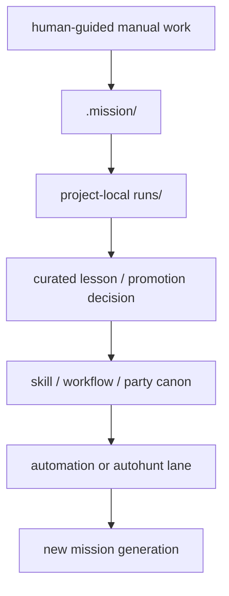

# Vision And Goals

## 목적

- 이 문서는 Soulforge가 왜 존재하는지, 무엇을 향해 구조를 쌓는지, 어느 상태를 성공으로 볼지를 명시한다.
- `REPOSITORY_PURPOSE.md` 가 owner 경계와 저장소 범위를 고정한다면, 이 문서는 운영 관점의 북극성을 고정한다.

## 한 줄 비전

- Soulforge는 사람이 한 번 수동으로 해낸 일을 reusable canon, held mission, local run truth 로 분해해 다시 자동화 가능한 운영 자산으로 바꾸는 저장소다.

## 무엇을 만들고 있는가

Soulforge는 단순한 agent catalog 나 workflow 예시 묶음이 아니다. 목표는 아래 세 층이 같은 언어로 이어지는 구조를 만드는 것이다.

1. reusable canon
2. held mission
3. project-local run truth

즉:

- reusable behavior 는 `.registry/skills/`, `.workflow/`, `.party/` 에 남기고
- 지금 들고 있는 실제 실행 계획은 `.mission/` 이 소유하고
- 실제 현장 실행 흔적은 `_workmeta/<project_code>/runs/<run_id>/` 아래에 남기는 구조를 목표로 한다.

## 왜 이 구조가 필요한가

- 수동으로 잘 된 작업이 나중에 자동화 후보가 되어야 한다.
- 자동화가 실패하면 다시 사람이 회수하고, 그 기록을 다시 canon promotion 재료로 써야 한다.
- public repo 에 올려도 되는 구조/문서/정본과 local runtime truth 를 섞지 않아야 한다.
- UI 는 이 정본에서 파생되어야 하고, 정본을 대신하면 안 된다.

## 목표 상태

## 현재 핵심 목표

### 1. owner 경계 고정

- `.registry`, `.unit`, `.workflow`, `.party`, `.mission`, `_workspaces` 가 무엇을 소유하는지 흔들리지 않게 한다.

### 2. 수동 절차를 mission 으로 승격

- 사람이 직접 수행한 건도 `mission` 으로 보고, readiness 와 run truth 를 분리해서 남긴다.

### 3. reusable skill / workflow / party 축 강화

- 반복되는 행동은 skill 로
- 반복되는 절차는 workflow 로
- 반복되는 workflow 조합과 실행 묶음은 party 로 올린다.

### 4. 길마 lane 확립

- guild master / 총관(`administrator`) lane 이 request review, mission readiness review, authoring lane, promotion 판단을 맡는 운영 기본선을 만든다.

### 5. 자동화는 mission 위에 올린다

- autohunt, nightly sweep, runner preflight 같은 자동 운영은 mission 을 생성·검사·실행하는 상위 운영층으로 둔다.

## SE assistant 북극성

Soulforge의 SE assistant 북극성은 폴더를 만드는 agent가 아니라, 성용님이 핵심 설계 판단, 실험, 의사결정, 회의에 집중할 수 있도록 체계공학 기반 설계 보조 참모로 동작하는 운영 동료다. owner가 제공한 설계 목적, 제약, 근거, 결정 이력을 `.mission` 실행 계획과 `_workmeta` run truth 로 안전하게 묶고, 반복 가능한 절차를 `.workflow` 로 승격할 수 있게 돕는다.

`se_foldertree_generate` 는 이 북극성의 출발점 중 하나일 뿐이며, 역할은 선언된 spec 으로 SE 프로젝트 폴더와 plan tracking scaffold 를 만드는 데 머문다. 설계 내용, 요구사항, 검토 결론, 누락 source 는 skill 이 추론하지 않고 owner 에게 질문하거나 blocker/open question 으로 남긴다.

SE assistant가 다루는 산출물은 문서 파일에 한정하지 않는다. 다음을 포함한 설계지원 산출물 전체를 본다.

- formal documents
- diagrams
- traceability matrices
- analysis packets
- review evidence
- owner decision records
- open question registers
- verification planning artifacts

AI의 역할은 준비, 정리, 도식화, 추적성 정리, 누락 탐지, 질문 생성이다. 반대로 최종 설계 판단, 성능값 확정, 인터페이스 결정, 리스크 수용, 시험 판정, review 승인 같은 authority 는 owner 에게 남긴다.

proactive orchestration 은 `se_foldertree_generate` 안에 넣지 않는다. mission 후보 생성, readiness 확인, 반복 workflow 실행, overnight advisory 는 `.workflow`, `.mission`, `_workmeta`, `guild_hall/night_watch` 가 나누어 맡는다.

## 성공 조건

아래가 반복 가능해지면 Soulforge는 목표에 가까워진다.

1. 사람이 수동으로 작업한다.
2. 그 작업을 mission + run truth 로 남긴다.
3. reusable 부분을 skill/workflow/party 로 승격한다.
4. 같은 종류의 요청을 mission 으로 다시 생성한다.
5. `mission_check` 같은 readiness gate 를 통과한다.
6. runner/autohunt 가 자동으로 재실행한다.

## 비목표

- 모든 runtime 구현을 지금 당장 옮기는 것
- `_workspaces` 를 public tracked data root 로 만드는 것
- UI 를 정본보다 먼저 완성하는 것
- 한번의 사례만으로 universal standard 를 성급하게 고정하는 것

## 현재 phase 감각

- `.workflow` 는 reusable procedure canon 이다.
- `.mission` 은 실제로 들고 있는 실행 계획이다.
- `run` 은 project-local execution attempt 다.
- 수동 절차도 mission 이고, 자동 절차도 mission 이다.
- 자동화는 mission 위에서 돌고, mission 을 대신하는 새 owner 가 아니다.

## 다음에 계속 채워야 하는 것

- 어떤 mission 이 default operating lane 이 되는지
- 어떤 조건이면 manual mission 을 autohunt 대상으로 올리는지
- guild master lane 이 current default 인지 universal standard 인지
- `mission_check` 와 future nightly sweep 의 owner 경계
