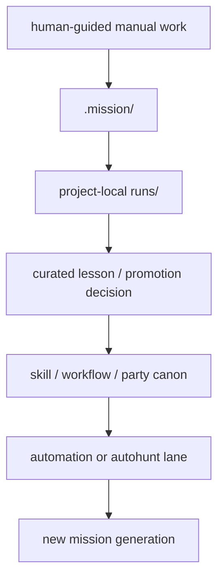

# Vision And Goals

## 목적

- 이 문서는 Soulforge가 왜 존재하는지, 무엇을 향해 구조를 쌓는지, 어느 상태를 성공으로 볼지를 명시한다.
- `REPOSITORY_PURPOSE.md` 가 owner 경계와 저장소 범위를 고정한다면, 이 문서는 운영 관점의 북극성을 고정한다.

## 한 줄 비전

- Soulforge는 사람이 한 번 수동으로 해낸 일을 reusable canon, held mission, local run truth 로 분해해 다시 자동화 가능한 운영 자산으로 바꾸는 저장소다.
- 제품 관점의 권고 이름은 `Soulforge Engineering OS`이며, `Soulforge ERP`,
  `Soulforge Engineering Engine`, `Soulforge Agent Platform` 세 제품군으로 나누는
  Owner 결정 초안은 [`SOULFORGE_ENGINEERING_OS_PRODUCT_FAMILY_REBASELINE_V0.md`](SOULFORGE_ENGINEERING_OS_PRODUCT_FAMILY_REBASELINE_V0.md)가 소유한다.

## 제품군·명명 재기준 상태

- 현재 재기준 문서는 `OWNER_DECISION_DRAFT`다.
- 전체 이름과 제품·Module 계층을 먼저 정하고, 실제 `dev-erp` path, package, DB,
  TASK, route, runtime rename은 caller·pointer·backup·restore dry-run과 별도 Owner
  승인 뒤에만 수행한다.
- `Soulforge Engineering ERP`는 전체 이름으로 고정하지 않는다. ERP는 전체
  Engineering OS 안의 핵심 제품이며 Engineering Engine과 Agent Platform의 상위 owner가 아니다.

## AX Context-to-Execution 운영 북극성

Soulforge의 장기 제품 방향은 단순 통합검색이나 특정 AI provider 자동화가 아니다. 회사와
프로젝트에서 일어나는 관찰을 출처·시간·revision·권한과 함께 맥락 세계수로 연결하고,
공통 체계공학 지식과 project context를 결합해 다음 업무 후보를 판단하며, 승인된 업무를
권한 있는 사람·agent가 수행한 뒤 결과·증거·검토를 다시 업무 상태와 맥락에 환류하는
Engineering OS를 지향한다.

```text
관찰(source systems·communication·files·work/run history)
  -> Context/세계수(identity·event·decision·evidence·time·ACL)
  -> 공통 SE 지식 + 격리된 project knowledge
  -> AX·SE 판단(expected vs observed, gap·risk·mission·role candidate)
  -> 사람 또는 exact policy 승인 → Task Engine의 공식 업무·배정
  -> 권한 있는 사람·agent의 local workspace 실행
  -> result·artifact revision·evidence 제출
  -> 독립 검증·분야 수락·authorized promotion
  -> Task state·Context·knowledge candidate feedback
```

Plugin/App은 외부 source와 action의 adapter, MCP는 query·control·result/evidence·receipt
interface, 외부 agent·workbench·document-production 도구는 교체 가능한 실행 surface다. 이들은 source truth,
Context, AX·SE 판단, Task state, authorization, verification과 공식 완료 owner를 대체하지
않는다. 특정 Plugin이나 runtime을 제거해도 Task·source/revision refs·identity·provenance·
authorization·execution receipt가 남고 provider 접근과 편의 UX만 사라지는 구조를 유지한다.

## 무엇을 만들고 있는가

Soulforge는 단순한 agent catalog 나 workflow 예시 묶음이 아니다. 목표는 아래 세 층이 같은 언어로 이어지는 구조를 만드는 것이다.

1. reusable canon
2. held mission
3. project-local run truth

즉:

- reusable behavior 는 `.registry/skills/`, `.workflow/`, `.party/` 에 남기고
- 지금 들고 있는 실제 실행 계획은 `.mission/` 이 소유하고
- 실제 현장 실행 파일은 workspace/worksite에 남기고, `_workmeta/<project_code>/runs/<run_id>/`에는 compact metadata receipt만 남기는 구조를 목표로 한다.

## 왜 이 구조가 필요한가

- 수동으로 잘 된 작업이 나중에 자동화 후보가 되어야 한다.
- 자동화가 실패하면 다시 사람이 회수하고, 그 기록을 다시 canon promotion 재료로 써야 한다.
- public repo 에 올려도 되는 구조/문서/정본과 local runtime truth 를 섞지 않아야 한다.
- UI 는 이 정본에서 파생되어야 하고, 정본을 대신하면 안 된다.

## 목표 상태


```mermaid
flowchart TD
  H["human-guided manual work"] --> M[".mission/<mission_id>"]
  M --> R["project-local runs/<run_id>"]
  R --> L["curated lesson / promotion decision"]
  L --> C["skill / workflow / party canon"]
  C --> A["automation or autohunt lane"]
  A --> M2["new mission generation"]
```

## 현재 핵심 목표

### 1. owner 경계 고정

- `.registry`, `.unit`, `.workflow`, `.party`, `.mission`, `_workspaces` 가 무엇을 소유하는지 흔들리지 않게 한다.

### 2. 수동 절차를 mission 으로 승격

- 사람이 직접 수행한 건도 `mission` 으로 보고, readiness 와 run truth 를 분리해서 남긴다.

### 3. reusable skill / workflow / party 축 강화

- 반복되는 행동은 skill 로
- 반복되는 절차는 workflow 로
- 반복되는 workflow 조합과 실행 묶음은 party 로 올린다.

### 4. 길마 lane 확립

- guild master / 총관(`administrator`) lane 이 request review, mission readiness review, authoring lane, promotion 판단을 맡는 운영 기본선을 만든다.

### 5. 자동화는 mission 위에 올린다

- autohunt, nightly sweep, runner preflight 같은 자동 운영은 mission 을 생성·검사·실행하는 상위 운영층으로 둔다.

## SE assistant 북극성

Soulforge의 SE assistant 북극성은 폴더를 만드는 agent가 아니라, 성용님이 핵심 설계 판단, 실험, 의사결정, 회의에 집중할 수 있도록 체계공학 기반 설계 보조 참모로 동작하는 운영 동료다. owner가 제공한 설계 목적, 제약, 근거, 결정 이력을 `.mission` 실행 계획과 `_workmeta` run truth 로 안전하게 묶고, 반복 가능한 절차를 `.workflow` 로 승격할 수 있게 돕는다.

`se_foldertree_generate` 는 이 북극성의 출발점 중 하나일 뿐이며, 역할은 선언된 spec 으로 SE 프로젝트 폴더와 plan tracking scaffold 를 만드는 데 머문다. 설계 내용, 요구사항, 검토 결론, 누락 source 는 skill 이 추론하지 않고 owner 에게 질문하거나 blocker/open question 으로 남긴다.

SE assistant가 다루는 산출물은 문서 파일에 한정하지 않는다. 다음을 포함한 설계지원 산출물 전체를 본다.

- formal documents
- diagrams
- traceability matrices
- analysis packets
- review evidence
- owner decision records
- open question registers
- verification planning artifacts

AI의 역할은 준비, 정리, 도식화, 추적성 정리, 누락 탐지, 질문 생성이다. 반대로 최종 설계 판단, 성능값 확정, 인터페이스 결정, 리스크 수용, 시험 판정, review 승인 같은 authority 는 owner 에게 남긴다.

proactive orchestration 은 `se_foldertree_generate` 안에 넣지 않는다. mission 후보 생성, readiness 확인, 반복 workflow 실행, overnight advisory 는 `.workflow`, `.mission`, `_workmeta`, `guild_hall/night_watch` 가 나누어 맡는다.

## 성공 조건

아래가 반복 가능해지면 Soulforge는 목표에 가까워진다.

1. 사람이 수동으로 작업한다.
2. 그 작업을 mission + run truth 로 남긴다.
3. reusable 부분을 skill/workflow/party 로 승격한다.
4. 같은 종류의 요청을 mission 으로 다시 생성한다.
5. `mission_check` 같은 readiness gate 를 통과한다.
6. runner/autohunt 가 자동으로 재실행한다.

## 비목표

- 모든 runtime 구현을 지금 당장 옮기는 것
- `_workspaces` 를 public tracked data root 로 만드는 것
- UI 를 정본보다 먼저 완성하는 것
- 한번의 사례만으로 universal standard 를 성급하게 고정하는 것

## 현재 phase 감각

- `.workflow` 는 reusable procedure canon 이다.
- `.mission` 은 실제로 들고 있는 실행 계획이다.
- `run` 은 project-local execution attempt 다.
- 수동 절차도 mission 이고, 자동 절차도 mission 이다.
- 자동화는 mission 위에서 돌고, mission 을 대신하는 새 owner 가 아니다.

## 다음에 계속 채워야 하는 것

- 어떤 mission 이 default operating lane 이 되는지
- 어떤 조건이면 manual mission 을 autohunt 대상으로 올리는지
- guild master lane 이 current default 인지 universal standard 인지
- `mission_check` 와 future nightly sweep 의 owner 경계
