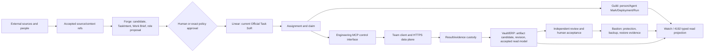
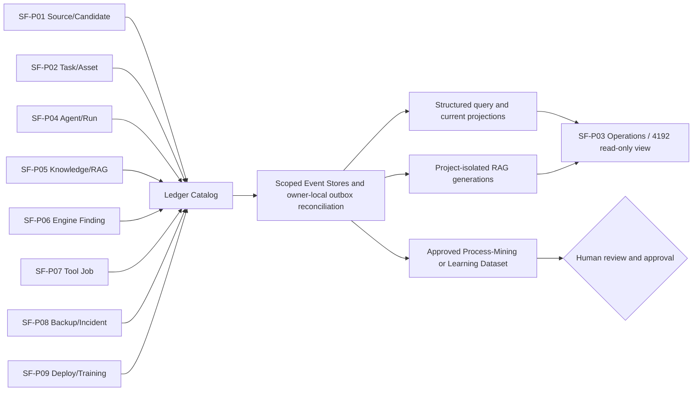

# System Context, Product Family, and World-Bible Crosswalk

## Status

`OWNER_REVIEW_DRAFT`. Names in this document are logical owner labels. Existing physical names and routes remain unchanged.

## Layer rule: these are not peers

The main source of naming drift is treating a product, a module, a physical package, a runtime instance, a deployment pack, an external system, and a fantasy label as the same kind of thing. They must be read in this order:

| Layer | Meaning | Examples in this draft | Must not be treated as |
| --- | --- | --- | --- |
| Brand / worldview | The long-lived company and explanatory world | Soulforge; fantasy vocabulary | A runtime or source of record |
| Logical product owner | Responsibility boundary and release planning unit | Vault, Forge, Guild, Watch; Bastion common layer | A required folder rename |
| Shared module | A deep capability behind a small interface | custody, task/decision, context, connector, recovery | An independent task writer |
| Physical package / document | Current implementation location | `guild_hall/**`, `ui-workspace/apps/**`, `docs/**` | Proof that a target capability is live |
| Runtime / deployment | A concrete installed process or host | HPP service, local client, workshop PC | A public canon owner |
| Deployment pack | What a person/site receives and updates | Server, Team Client, Workshop, Project AI pack | A new logical product owner |
| External system | Its own service and source-local authority | Linear, Buzz, Gmail, Slack, Drive, Git, NAS | A hidden ERP submodule |
| Fantasy label | Optional presentation lens | Vault, Forge, Guild Hall, Watchtower, Bastion | A second truth or state machine |

## Crosswalk to existing Owner documents

| Existing owner surface | Stable contribution to this plan | Guard retained |
| --- | --- | --- |
| `VISION_AND_GOALS.md` | Source → candidate → approval → task/assignment → local execution → artifact/evidence → independent review/human acceptance → feedback loop | Delivery, acknowledgement, review, acceptance, and Official Done stay separate. |
| `SOULFORGE_WORLD_BIBLE_V0.md` | Fantasy is an alternate lens over the same Task/Asset/Agent/Event data; project AI teams stay isolated. | It is an Owner worldview draft; no terminology makes a route or writer. |
| `SOULFORGE_ENGINEERING_OS_PRODUCT_FAMILY_REBASELINE_V0.md` | ERP, Engineering Engine, and Agent Platform are peers; Asset/Custody, Task/Decision, Digital Workforce, Connector/Ingress, and Recovery are deep modules. | The document's product naming is an Owner decision draft; paths stay compatible. |
| `TARGET_TREE.md` and `DOCUMENT_OWNERSHIP.md` | Cross-root contracts live under `docs/architecture/foundation`; project payload and compact metadata remain distinct. | This suite does not add a canonical root. |
| `DEVELOPMENT_ROADMAP_V0.md` | The active slice remains read-only AX/SE assessment. | This plan is a non-active candidate and does not reorder the active slice. |

## Logical system context



The arrows indicate references and explicitly approved calls, not an automatic pipeline. The data plane returns a custody receipt before any project ArtifactRevision candidate exists. Watch may show that receipt but cannot promote it.

## Logical product seams

| Seam | Owns | May read / emit | Does not own |
| --- | --- | --- | --- |
| Forge | Accepted-fact and engineering-knowledge interpretation; Work Candidate, TaskIntent, Work Brief, role proposal | Approved source/context/revision refs; candidate and reason records | Original bytes, Official Task state, artifact acceptance, baseline, final technical judgment |
| Vault / ERP | Asset catalog, logical artifact relations, revision and acceptance read models, accepted result relationships | Custody/revision/review refs, sanctioned projections | Engineering judgment, current Linear writer, direct team-PC storage access |
| Linear (current) | Official Task identity, state, priority, assignee until separately migrated | Task refs and history through an explicit adapter | Engineering inference, revision acceptance, binary custody |
| Guild / AI Workforce | Agent family, Mark, Deployment, Run, skill/tool allowlists, worker and workshop capacity | Accepted assignment and bounded result receipts | Task completion, ArtifactRevision acceptance, cross-project context by default |
| Engineering MCP | Provider-neutral query, request, ticket, receipt, and status interface | Typed metadata and opaque IDs | Queue truth, binary storage, approval, runtime orchestration |
| Watch / 4192 | Typed read projection and approval requests | Aggregate health and safe deep-link pointers | Deep Bot record duplication, task writer, restart/restore writer |
| Bastion | Identity, transfer guard, custody policy, backup, restore/recovery evidence | Approved policy/binding refs and operational receipts | Product-domain acceptance and hidden external action |

## Cross-cutting Ledger and analytics plane

Ledger is not another product box. Every product keeps its own meaning and
writer while a shared mechanical contract makes events joinable over time.



The Catalog is central; Event Stores are partitioned by project, organization,
ACL, retention and legal-hold boundary. Source Truth, Ledger Event, RAG
Projection, Dataset and Accepted Knowledge remain distinct. Failing RAG or
analytics cannot roll back a source commit, mutate Linear, accept an artifact,
promote knowledge, or score a person.

## End-to-end state boundaries

```text
source/event
  -> accepted context (not merely observed source)
  -> Forge Work Candidate
  -> human approval
  -> Linear Official Task
  -> assignment / claim
  -> exact input bundle
  -> local work and WorkSession
  -> checkpoint or blocker
  -> result/evidence submission
  -> custody receipt and quarantine classification
  -> ArtifactRevision candidate
  -> independent review
  -> human acceptance
  -> accepted ArtifactRevision
  -> Task/result/context feedback
```

At every arrow, the previous result is insufficient by itself to infer the next state. In particular: a candidate is not a task, a task is not an assignment, an upload is not custody promotion, a closeout is not Official Done, and a review is not human acceptance.

## User journeys

### Team member — bounded engineering work

1. The member authenticates with an account, device, and optional agent identity.
2. The client shows one explicit assignment and its exact Work Brief; ambiguity produces `HOLD`, not a guessed task.
3. The client downloads only the accepted input-bundle manifest/revisions permitted to that assignment.
4. The member works in a local authoring directory and records bounded checkpoints or blockers.
5. The member submits result files and evidence through a prepared ticket, then sees custody and later review status separately.
6. The member proposes completion; only the authorized Official Task writer can apply a resulting task status after the required acceptance chain.

### Reviewer / acceptor

1. The reviewer receives a revision candidate with parent/head, manifest, evidence, policy, and assignment provenance.
2. The reviewer returns `ACCEPT`, `REVISE`, or `HOLD` as a review record without silently changing a task or baseline.
3. The human acceptance authority alone accepts a specific revision or rejects/returns it.

### Operator

1. The operator sees coarse health and a safe pointer to the owning system.
2. A restart, isolation, restore, or rollback request is separately approved and executed by Bastion under a named runbook.

## Non-goals

- A universal source migration, Linear writer migration, automatic Done, or canonical knowledge promotion.
- A broad ERP rewrite or path/package rename.
- A new global agent, combined project manager memory, or a shared raw context cache.
- Binary content over MCP JSON, direct SMB/UNC/SQLite/queue access from a client, or a client that edits canonical storage in place.
- Treating an installer, a green dashboard, or an AI self-report as pilot acceptance.

## Related plans

- [Current implementation and gaps](02_CURRENT_INVENTORY_AND_GAPS.md)
- [Forge](04_FORGE_AX_SE_WORK_AND_ENGINE.md)
- [MCP and client](05_ENGINEERING_MCP_CLIENT_DATA_PLANE.md)
- [Folder compatibility](15_FOLDER_COMPATIBILITY_MIGRATION.md)
