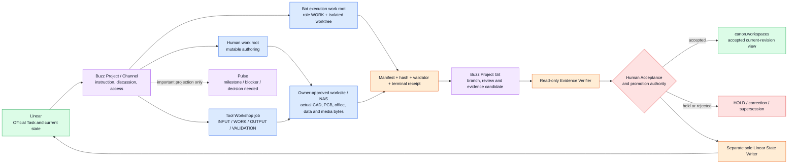

# Buzz / Hermes Collaboration and Scheduled-Operation Model

> Status: `OWNER_REVIEW_DRAFT` — suite state, owner decisions, and claim rules are governed by [00_MASTER_INDEX_AND_DECISIONS.md](00_MASTER_INDEX_AND_DECISIONS.md).

## Boundary

Buzz is the source-local human-agent collaboration surface. Hermes is a bounded gateway/profile/runtime adapter. Neither one is an Official Task SoR, an ArtifactRevision authority, a Vault byte store, or a substitute for Guild's approved deployment/run identity.

4192 may show coarse collaboration/gateway health and a safe exact pointer into Buzz. It must not duplicate deep Bot chat, memory, session, tool output, or private status records.

## Collaboration objects and ownership

| Object | Source-local owner | Vault/ERP catalog role | Forge/Guild role | Watch role |
| --- | --- | --- | --- | --- |
| Buzz message/attachment/thread | Buzz relay/service | Link, classification, backup/recovery status, promotion receipt only | Optional bounded source/assignment/deployment relation | Coarse health plus exact safe pointer |
| Hermes profile/session | Hermes runtime | Deployment/runtime binding and recovery refs | Gateway availability and approved Run binding | Aggregate availability only |
| Chat-created candidate | Chat/source ledger until captured | Immutable capture generation and accepted projection only | Forge may consume accepted record | Candidate count/freshness only |
| Scheduled operation | Scheduler/source-local operation | Cataloged definition/run, provenance, result/backup status | Candidate/no-action interpretation within grants | Health/freshness and held incidents |

## Chat-created ledgers and scheduled operations as assets

The 1-hour intake, 3-hour source organization, 3-hour priority/order management, and any later Chat ledger are first-class assets. A sheet, chat history, or scheduled job is not automatically ERP truth.

Every capture generation must bind:

- source system and exact schedule/operation/run identity;
- collection window, cursor/replay/dedupe key, freshness and reconciliation state;
- row/candidate creation reason, source refs, decision/no-action/duplicate/correction/supersession relation;
- reviewer and acceptance state, task/artifact relation when one exists, and external owner policy;
- manifest and hash of the immutable capture generation; and
- a redacted metadata-only receipt rather than raw chat or credential content.

The later accepted projection into Vault/ERP or a Linear reconciliation is a separate state. It must preserve source references and immutable generation identity, make no hidden row deletion, and record whether reconciliation is complete, partial, rejected, or held. Scheduled operation success cannot create Official Done, a baseline, or a human acceptance.

## Operating flow

```text
source-local Chat / ledger / scheduler run
  -> immutable capture generation
  -> source/ACL/provenance validation
  -> candidate, no-action, correction, or hold
  -> optional Forge review / human decision
  -> accepted Vault/ERP projection and typed Linear reconciliation
  -> separate task/assignment/result lifecycle if approved
```

## Buzz operating surfaces

Buzz surfaces have different authority and must not be treated as interchangeable
ledgers.

| Surface | Intended use | Authority ceiling |
| --- | --- | --- |
| Channel / thread / DM | Human-Agent instruction, discussion, clarification, and source-local collaboration | Conversation source only; not Official Task, accepted Evidence, or Human Acceptance |
| Pulse | Bounded important-status, milestone, blocker, or decision-needed projection | Broadcast/read projection only; a Pulse note cannot transition task or artifact state |
| Project | Project-scoped collaboration and repository-access boundary | Scope and access relation only; Project existence is not project acceptance or physical folder materialization |
| Project Git | Source-local Agent output, terminal receipt, manifest, validator, and reproducible revision submission surface | Evidence candidate source only; not Linear state, ArtifactRevision acceptance, accepted context, or Official Done |

Creating a Buzz Project publishes Project/repository metadata and access-channel
binding. It does not automatically turn an existing Hermes profile, Bot work
folder, human project folder, ERP record, or `_workspaces` payload tree into a
Git checkout. A local checkout or approved `Repos Directory` binding is a
separate physical action and remains subject to the Path Registry and project
workspace owner.

## Project Git Evidence Intake contract

Project Git may expose an explicit terminal receipt for later read-only intake.
Ordinary commits, chat messages, Agent self-reports, and intermediate checkpoints
must not create completion candidates.

```text
Project Git commit
  -> explicit terminal receipt present?
       -> no: NO_ACTION
       -> yes: read-only Evidence Intake candidate
  -> exact Task / Assignment / AgentRun / Work Brief revision binding
  -> artifact manifest, content hash, validator receipt, and blocker review
  -> VERIFIED_COMPLETION_CANDIDATE at most
  -> separate Human Acceptance and sole Linear State Writer gates
```

The minimum candidate binds `project_git_ref`, approved branch/ref, commit SHA,
terminal-receipt digest, Task/Assignment/AgentRun refs, Work Brief revision,
artifact-manifest and validator refs, blocker refs, producer Agent Mark and
Deployment refs, observed time, replay identity, and reconciliation cursor.
Force-push/history rewrite, foreign-project refs, stale Work Briefs, divergent
replay, missed-cursor coverage, raw private path, source body, or secret-bearing
content fail closed.

The following statements remain distinct:

```text
AgentRun succeeded != terminal receipt accepted
terminal receipt accepted != Evidence verified
Evidence verified != ArtifactRevision accepted
ArtifactRevision accepted != Human Acceptance
Human Acceptance != Official Task Done unless the approved sole writer applies it
```

The Evidence Verifier is read-only toward Linear and verifies commit ancestry,
artifact manifest/hash, validators, Work Brief revision, blockers, independent
review, and acceptance requirements. A later Linear State Writer is a separate
sole writer that accepts only an approved transition packet with expected current
state, authority, idempotency, writer epoch, before/after readback, and conflict
receipt. That writer is currently `HOLD`.

## Storage and ledger separation

- Hermes profile, session, memory, local continuity ledger, credentials, cache,
  and process state remain under the Hermes/runtime owner and are never committed
  wholesale to Project Git.
- Actual CAD, PCB, ERP, NAS, mail, voice, large media, and human project payloads
  remain in `_workspaces/<project_code>/**` or an owner-approved worksite. Project
  Git stores only approved lightweight files and references/manifests/hashes.
- Linear remains the Official Task current-state owner. Linear backup is a
  separate recovery lane and is not copied into each Project Git repository.
- AgentRun, Project Decision Ledger, source-capture ledger, Linear backup,
  Artifact/Evidence acceptance, and Project Git intake retain separate owners,
  writer epochs, replay keys, retention, and restore evidence.
- One shared Markdown activity file is not a multi-Agent ledger. Concurrent
  Agents write unique Task/Run receipt paths or isolated branches/worktrees; a
  deterministic projection may later render a human-readable timeline.

## Owner-facing integrated Project and version-control model

The operating rule is: **Buzz is the collaboration entrance, Project Git is the
lightweight work-evidence ledger, an owner-approved worksite such as NAS owns
large payload bytes, `_workspaces` exposes the accepted current revision, and
Linear remains the Official Task current-state owner.** These surfaces complement
one another; none may silently replace another.



Color and label meanings are: blue = input/work bytes, orange = processing or
automation, purple = collaboration view, green = authoritative state, and red =
approval/stop boundary. The diagram is an authority map, not proof that every
adapter or physical path is already active.

### Physical and logical folder relationship

Public documents keep logical root names. Exact drive letters, credentials,
share names, ACLs, and writer bindings stay in their private owner surfaces.

```text
<project_work_root>/                         mutable Bot work; never ERP canon
├─ COMMON/
├─ MFG/
├─ PJT/<year>/<project>/
│  ├─ <role>/WORK/<task-or-worktree>/        isolated Agent work
│  └─ SHARED/PROJECT_GIT/<project-repo>/     proposed coordinator clone
└─ TOOL/<tool>/JOBS/<job-id>/                proposed Tool Workshop job
   ├─ INPUT/
   ├─ WORK/
   ├─ OUTPUT/
   ├─ VALIDATION/
   └─ RECEIPT/

<human_work_root>/<project>/                 mutable human authoring

<owner_approved_worksite>/<project>/         actual large/source payload bytes
└─ candidate and/or accepted revisions       NAS is allowed when policy-gated

<data_root>/_workspaces/<project_code>/       stable accepted-revision view
```

The proposed central Project Git clone has one coordinator/integrator writer.
Agents use separate branches or worktrees under their role `WORK` folders and
submit reviewed changes to the coordinator clone. A Tool Bot produces and
validates bytes inside its job folder; it does not need to operate Git. A
Project Ledger Bot or integrator records the resulting manifest and terminal
receipt in Project Git.

No checkout, worktree, Tool job tree, or NAS binding is created merely by this
document. Exact physical bindings remain project-private and require Path
Registry, ACL, backup, rollback, and writer approval.

### What is stored where

| Content class | Primary location | Project Git content | Default rule |
| --- | --- | --- | --- |
| Source code owned by a code repository | Its approved code repository | Commit/ref or a small integration receipt when needed | Keep code history in its native repo; do not duplicate the whole repo into the project ledger |
| Small Markdown, YAML, scripts and public-safe project automation | Project Git when approved | File itself | Branch/review/commit are appropriate |
| Terminal receipt, artifact manifest, digest, validator result and decision record | Project Git | File itself | Use unique Task/Run paths; do not make one shared append-only Markdown file the concurrent ledger |
| CAD, PCB, DXF, STEP, office files, test data, media and other large/generated payload | Owner-approved worksite or NAS | Logical artifact ref, immutable content hash, size/type, producer/run, validator and revision/supersession refs | Bytes stay outside Project Git by default, even when a format is technically text |
| Mail, voice, ERP export, raw customer/project source or protected dataset | Source owner, `_workspaces`, or another approved worksite | Sanitized metadata pointer only when authorized | Raw/private payload must not enter the repository |
| Hermes profile, memory, session, credentials, cache and process state | Hermes/runtime and secret owners | Stable public identity/runtime refs only | Never commit the profile wholesale |
| Accepted current project revision | Backing approved worksite, exposed through `_workspaces/<project_code>` | Acceptance/promotion receipt or hash pointer only | `_workspaces` is not a Bot worktree and is not a Git clone destination |

A practical Project Git repository may use this lightweight shape:

```text
README.md
project.yaml
ledger/runs/<task-ref>/<run-ref>/
├─ terminal-receipt.yaml
├─ outputs.yaml
└─ validation.yaml
manifests/<logical-artifact-ref>.yaml
decisions/<decision-ref>.md
automation/
```

The names are an operating example, not a newly registered schema. The exact
terminal-receipt schema, required fields, writer, and validator remain part of
the bounded Project Git pilot gate.

### NAS and large-file version control

A mounted network drive or a RAID array alone is **storage**, not confirmed
version control. NAS-hosted project bytes are treated as version-controlled only
after all of the following are evidenced:

1. the exact shared folder and project boundary are registered;
2. per-file version history and/or scheduled point-in-time snapshots are enabled;
3. retention, immutability where supported, capacity alarms, and restore roles
   are defined;
4. a separate backup target protects against loss of the NAS or source volume;
5. an isolated restore test proves a selected file/revision can be recovered;
6. Project Git manifests bind the selected payload revision to its content hash,
   validator, producer/run, supersession, and acceptance state.

For a Synology worksite, Snapshot Replication can protect supported shared
folders with scheduled point-in-time snapshots and retention, while Hyper Backup
provides a distinct multi-version backup lane. A snapshot stored on the source
volume is not by itself a disaster-recovery copy. Exact schedules and retention
values are project/storage-owner decisions, not defaults inferred by Buzz.

Official references:

- [Synology Snapshot Replication — snapshots](https://kb.synology.com/en-us/DSM/help/SnapshotReplication/snapshots?version=7)
- [Synology Hyper Backup](https://kb.synology.com/en-global/DSM/help/HyperBackup/BackupApp_desc)

### Multi-user and multi-Agent operating roles

| Role | May do | Must not infer or do |
| --- | --- | --- |
| Human Owner / delegated project approver | Choose scope, approve revision, accept/reject/HOLD and authorize promotion | Acceptance must not be inferred from a chat reaction, process exit or file presence |
| Project lead / integration coordinator | Maintain the central clone, review branches, resolve integration order and publish approved lightweight receipts | Must not silently accept large payloads or mark Linear Done |
| Human or work Agent | Work in its assigned mutable folder/branch/worktree and submit a bounded result | Must not write directly to another role worktree or accepted `_workspaces` view |
| Tool Bot / Workshop | Produce output, validator evidence and custody receipt within one fenced job | Tool success is not artifact acceptance; it need not commit Git |
| Project Ledger Bot | Convert an explicit completed job packet into a small manifest/terminal receipt commit | Must not copy raw payload, accept its own output or process every intermediate commit as completion |
| Evidence Verifier | Read commit ancestry, hashes, manifests, validators, Work Brief, blockers and review evidence | Read-only toward Linear, NAS payload owner and acceptance state |
| Authorized promoter | Move/copy or materialize the specifically accepted revision into the approved backing worksite | Must not promote an unverified candidate or overwrite divergent current state |
| Linear State Writer | Apply one approved idempotent transition with expected-state and readback checks | Separate sole writer; currently `HOLD` |
| Backup/restore operator | Prove snapshot/backup membership and isolated recovery | Backup success does not accept project content or complete a task |

### Everyday use of Buzz Project

1. Create or select one Buzz Project and its exact private access channel.
2. Use Channel/thread/DM for instructions, questions, review discussion and file
   references. Use Pulse only for important milestone, blocker or decision-needed
   projection.
3. Keep the Official Task and its current state in Linear. Do not create a second
   competing task truth in the Buzz Tasks view.
4. Human and Agents work in their separate mutable roots. Tool jobs produce large
   bytes and validation outside Git.
5. Store actual large payload in an approved worksite/NAS revision location and
   calculate a content hash. Do not treat a path or filename as immutable identity.
6. Commit the small manifest, validator result and explicit terminal receipt to
   the Agent branch/worktree; review and integrate it through Project Git.
7. The read-only Verifier checks ancestry, receipt binding, payload hash,
   validator, Work Brief, blockers and independent review.
8. Human Acceptance selects the actual artifact revision. Only the authorized
   promoter may materialize that accepted revision into the backing worksite and
   `_workspaces` view.
9. Only the separate sole Linear State Writer may apply the approved Official
   Task transition. Until that writer is activated, a person updates Linear.

### Practical Tool Bot example

```text
Linear task: produce a reviewed DXF revision
  -> Buzz thread: exact instruction and clarifications
  -> Tool job: immutable input + bounded CAD run
  -> Tool output: candidate.dxf + validation result
  -> approved NAS/worksite: candidate payload revision
  -> Project Git: path/ref + SHA-256 + tool/version + run + validator receipt
  -> independent review
  -> Human Acceptance
  -> accepted backing worksite / _workspaces view
  -> separate Linear transition
```

The DXF does not have to be committed to Git. NAS history/snapshot protects the
payload revision; Project Git preserves the reviewable engineering ledger that
explains which exact bytes were produced, verified, superseded, and accepted.

### Current state and stop lines

| Item | Current claim |
| --- | --- |
| Buzz Project / repository container | One bounded pilot container has been physically observed; exact identity and binding remain project-private |
| Repository contents and local checkout | Empty/no push and no approved physical clone were observed for the pilot; no local clone or role worktree is claimed |
| Bot project work root and human work root | Their distinct owner concepts are confirmed; exact physical bindings and writer enforcement remain private/held |
| Tool Workshop folders/runtime | Target shape only; no physical Workshop job/lease runtime is claimed |
| NAS connection | An owner worksite may be NAS-backed, but version history, snapshot policy, backup target and restore test must be verified per exact share |
| Project Git Evidence Intake | Contract and bounded pilot plan exist; no webhook, persistent intake coordinator or automatic completion is active |
| Human Acceptance / promoter | Required and separate; no automatic promotion is active |
| Linear State Writer | `HOLD`; Project Git, Buzz message, Pulse and Agent self-report cannot mark Official Done |

The smallest next pilot is: verify one exact NAS/share protection policy, approve
one private Project Git clone binding and coordinator, submit one low-risk
terminal receipt that points to one hash-verified payload, perform read-only
verification and Human review, then stop before automation or Linear mutation.

## Bounded Project Git pilot

The first physical pilot is one Owner-approved project, one exact private access
channel, one repository/ref, and one or a few low-risk terminal receipts. Public
documents use `<project_code>` only; the actual binding and receipt stay in the
project-private `_workmeta` owner.

Pilot sequence:

1. freeze a public-safe terminal-receipt envelope and owner/authority map;
2. prove read-only intake, replay/dedupe, stale revision, foreign-project, and
   history-rewrite rejection on synthetic Git fixtures;
3. read one actual low-risk Project Git terminal receipt without webhook and
   without Linear mutation;
4. verify commit, artifact pointer/hash, validator, Work Brief, blockers, and
   independent review, then request human review;
5. stop before persistent coordinator, webhook, Pulse automation, Linear writer,
   automatic Done, Artifact acceptance, or accepted-context promotion.

Entry requires exact project/access-channel/repository/ref/Agent bindings and
rollback. Exit requires one non-secret metadata-only readback, no cross-project
or raw-payload copy, duplicate effect zero, and Human Owner review. Any ambiguity,
missing receipt, stale Work Brief, unresolved blocker, or authority drift is a
branch-local `HOLD`.

## Hermes and Buzz resilience boundaries

- Runtime availability is a coarse state: available, unavailable, stale, degraded, unknown, or held. It does not reveal a session body.
- A collaboration recovery requires a source-local backup generation, manifest/hash, isolated restore, and human acceptance before it is called recoverable.
- Deployment bindings use stable public identity/runtime refs and `secret_ref`; key material stays in the OS/secret owner.
- Bot identity/session history must be handed off through explicit binding/supersession/receipt, not inferred from a title or idle process.

## Current status and later build slices

Current public documents and code provide selected adapter/runtime evidence, but this plan does not re-observe a live Buzz or Hermes stack. Treat all deep collaboration data and physical availability as `VERIFY_PHYSICAL`.

Public contract progress (2026-08-31): Backup Controller now has pure,
effect-inert readiness contracts for Buzz and Hermes. Buzz names Postgres,
media, Git, Redis classification, restore, audit, identity recovery and human
backup acceptance separately. Hermes names Agent Mark/Deployment, runtime,
SOUL/capability/session/memory/schedule custody, explicit Bot Chat↔Buzz
crosswalk, backup membership and restore/rollback. These are metadata contract
checks only; they do not re-observe the live stack, create a backup generation,
verify a private key, activate a Bot or make the system recoverable.

The first build order is: (1) define capture-generation schema and source-local backup manifest, (2) prove no-action/dedupe/correction replay on synthetic data, (3) map approved capture to a read-only Vault/ERP projection, (4) connect a single approved Guild deployment in a one-seat test, and only then (5) request a bounded physical pilot.

## OPEN_GRILL — Project Git local placement

The Buzz Project Git integration clone and per-Agent worktrees need one exact
physical class and binding owner. The current recommendation is one project
shared integration clone plus role-scoped isolated worktrees under the registered
Bot execution root. They must not be placed in ERP `_workspaces` or a human
authoring root. No clone, relocation or binding change occurs before the Grill
decision and Path Registry/private-binding gate.

## Related plans

- [Guild runtime](06_GUILD_AGENT_MARK_AND_RUNTIME.md)
- [Watch / 4192](08_WATCH_4192_OPERATIONS.md)
- [External connector backup](10_EXTERNAL_CONNECTORS_AND_BACKUP.md)
- [Operations manuals](16_OPERATIONS_RUNBOOK_CATALOG.md)
