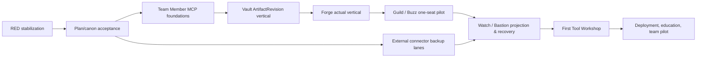

# Implementation Roadmap, Gate Register, and Dependency DAG

> Status: `OWNER_REVIEW_DRAFT` — suite state, owner decisions, and claim rules are governed by [00_MASTER_INDEX_AND_DECISIONS.md](00_MASTER_INDEX_AND_DECISIONS.md).

## Priority and dependency DAG

The active repository roadmap is not changed by this suite. These are implementation candidates after Owner review; no row authorizes execution by itself.



External connector lanes may run beside MCP/Vault only when source scope, credential, byte-store, deployment target, and external effects are disjoint. They cannot share an unapproved writer or claim a common restore result.

RED stabilization semantics: RED-01 is the serial row-0 leaf. RED-02 (topology-oracle contract), RED-03 (renderer writer guard), RED-04 (Workflow Runner Windows E2E evidence), and RED-05 (path-policy tracked debt) are parallel stabilization leaves — each blocks only the later work that depends on its surface (Watch oracle work for RED-02, any protected-writer capability for RED-03, workflow-runner-backed release lanes for RED-04, root done-check promotion for RED-05) and none of them serializes unrelated leaves.

| Order | Candidate leaf | Entry gate | Deliverable / exit test |
| --- | --- | --- | --- |
| 0 | RED-01 life-tree scope-before-cap repair | Current failing test and scoped owner | Test first; owned row survives foreign-row cap; fresh review |
| 1 | Plan/canon rebaseline | Owner review of this suite | Accepted draft decision and trace matrix; no runtime change |
| 2 | Engineering MCP contract/schemas | D27–D29 design decisions | Schema/tool compatibility and adversarial synthetic suite |
| 3 | Vault ArtifactRevision vertical | D27/D29 + exact custody policy | One artifact candidate/review/acceptance synthetic vertical |
| 4 | Forge actual vertical | D27/D28/D29 closed plus accepted context and task-writer agreement | One TaskIntent/Work Brief/assignment default-off vertical (not the later physical field pilot) |
| 5 | Guild/Buzz one-seat | D28/D35 plus project isolation | One approved deployment and bounded collaboration/capture path |
| 6 | Watch/Bastion | Coarse projection contract and recovery policy | No-writer Watch plus action/restore receipt path |
| 7 | First Tool Workshop | Core work/bundle/revision proof | One capacity-one tool, lease/fence/validator vertical |
| 8 | Deployment/education | Pack release evidence and support ownership | One-seat → repeated 3–5 → team pilot evidence |

## Gate register

| Gate | Required decision/evidence | Prohibits until passed |
| --- | --- | --- |
| Plan/review start gate | Owner acceptance of this suite as the working plan, recorded as a dated answer in the 00 decision register together with the independent completeness-review evidence ref | Every implementation leaf except the already-scoped RED stabilization row 0; activation of the OD-09 standing delegation |
| D27 | Custody, promoter, reference/copy/move/derive, source-kind scan/ACL/retention/backup/delete policy | Physical promotion, byte move/delete, project store binding |
| D28 | WorkSession cardinality, actor/node/thread binding, outbox/ack/SLA, handoff, completion approver | Team client WorkSession, auto completion, raw thread storage |
| D29 | Accepted generation, ACL/no-fallback, exact revision download, team candidate authority | Canonical input bundle, accepted-history query/write |
| D35 | Client/plugin package, trust, hook, active binding, provisioning, local state | Per-PC client install/hook/MCP activation |
| D36 | Context writer, generation projection/read-model owner | Persistent context feedback writer and direct MCP/plugin write |
| Physical canary | Exact site, seat, device, certificate/token, firewall, project/work item, expiry, rollback | Network listener, actual client/connector effect |
| Human acceptance | Reviewer/acceptor and artifact/task relation | Artifact/baseline acceptance and Official Task completion update |
| Restore | Actual capture, isolated restore, reconciliation, human restore acceptance | Recovery/rollout claim |

## Standing execution delegation

After Owner approval of the plan/review start gate, this roadmap authorizes the later build loop to continue every safe in-scope leaf without intermediate confirmation. The loop uses current canon, existing interfaces, and the most conservative compatible resolution for reversible detail. It may create bounded public-safe code/docs/tests/manifests/schemas/adapters/fixtures/validators/manuals; run local/synthetic/integration/E2E tests; use isolated/default-OFF services; build/install/smoke/upgrade/rollback isolated packs; use approved `secret_ref` without reading it; run existing-binding read-only collectors, backup capture, isolated restore, and reconciliation; and execute previously gated one-seat/one-project low-risk canaries. It may commit and non-force push clean accepted public leaves when the particular leaf's normal review and release evidence passes.

The standing defaults are: Linear remains Official Task SoR; paths remain reference-in-place; fallback is never implicit; LLM output is proposal-only; new runtime behavior remains default-OFF/canary-first; and 4192 remains a read/approval-request surface. It does not authorize secret inspection, purchase/contracts/external commitments, non-canary outbound messaging, destructive/reset/force operations, automatic Official Done/baseline/final technical acceptance/public release, cross-project private/raw copying, or an unavailable credential/hardware bypass.

### Branch-block protocol

```text
safe branch with passed prerequisites -> continue
excluded-authority/credential/physical blocker -> branch-only BLOCKED + exact unblock packet
other disjoint safe branches -> continue
all remaining branches blocked OR field-pilot acceptance gates pass -> stop program and report
```

An exact unblock packet contains `leaf_id`, `blocked_gate`, missing authority/state, observed evidence, forbidden workaround, minimal Owner action requested, scope/rollback impact, and eligible disjoint next leaves. It never turns a blocked branch into a reason to pause unrelated safe work.

## Research integration status

Direct primary-source research was compared as architectural input, not adopted as a schema or canon by itself. NotebookLM CLI Deep Research is `BLOCKED` because interactive login is required; no NotebookLM corroboration is claimed. Detailed source comparison and architectural limitations live in [03](03_VAULT_ERP_ASSET_REVISIONS.md).

| Direct source group | Mapped plan sections | Bounded inference |
| --- | --- | --- |
| [W3C PROV-O](https://www.w3.org/TR/prov-o/), [PROV constraints](https://www.w3.org/TR/prov-constraints/), [CloudEvents](https://github.com/cloudevents/spec/blob/main/cloudevents/spec.md) | 03, 04, 07, 10 | Typed provenance/activity/event identity and deterministic replay candidates, not a mandated event-store product. |
| [NIST digital thread](https://www.nist.gov/publications/testing-digital-thread-support-model-based-manufacturing-and-inspection), [NASA verification matrix](https://www.nasa.gov/reference/appendix-d-requirements-verification-matrix/), [SysML v2](https://www.omg.org/sysml/SysML-2.htm) | 03, 04, 13 | Traceability and tool-interoperable semantics inform the pilot, but do not certify a project or select a modeling tool. |
| [OCI descriptors](https://github.com/opencontainers/image-spec/blob/main/descriptor.md), [Semantic Versioning](https://semver.org/), [OSGi Core](https://docs.osgi.org/download/r8/osgi.core-8.0.0.pdf) | 05, 12, 15 | Content descriptors, semantic interface compatibility, capability/dependency/lifecycle checks; exact module system remains an implementation decision. |
| [SPDX 3.0.1](https://spdx.github.io/spdx-spec/v3.0.1/scope/), [NIST SSDF](https://csrc.nist.gov/Projects/ssdf) | 12, 13, 15 | SBOM/provenance/release trace fields and secure-release discipline; no automatic compliance claim. |
| [TUF](https://theupdateframework.github.io/specification/), [NIST contingency planning](https://csrc.nist.gov/pubs/sp/800/34/r1/upd1/final) | 09, 12, 13, 15 | Signed-update/recovery and isolated restore evidence; security rollback and product rollback are separate. |
| [OpenTelemetry](https://opentelemetry.io/docs/specs/otel/), [NIST AI RMF](https://www.nist.gov/publications/artificial-intelligence-risk-management-framework-ai-rmf-10) | 08, 13 | Correlated observation and risk lifecycle disciplines; neither is durable business provenance nor LLM authorization. |

| Research pattern | Plan mapping | Claim ceiling / tradeoff |
| --- | --- | --- |
| Provenance Entity/Activity/Agent, revision/bundle/plan | 03, 04, 05, 06 | Source-supported reference vocabulary; domain schema must remain narrow and testable. |
| Digital thread / requirements verification | 03, 04, 13 | Supports typed traceability; does not accept an engineering result. |
| Event `source + id`, immutable capture | 04, 07, 10 | Candidate event envelope/dedupe basis; event sourcing needs privacy/schema-evolution pilots. |
| Content-addressed descriptors/manifests | 03, 05, 12, 15 | Hash proves byte identity, not trust or correctness. |
| SemVer/capability-resolution/lifecycle | 12, 15 | Interface compatibility requires contract tests; avoid a dependency cycle. |
| SBOM/provenance/release evidence | 12, 13, 15 | Release requires build/test/install/rollback evidence, not manifest existence. |
| Update/recovery/observability guidance | 08, 09, 12, 13 | Security rollback, operational rollback, and telemetry are distinct. |
| AI risk lifecycle | 04, 06, 13 | LLM remains a proposal/advisory producer, never sole state/identity/promotion authority. |

This received research delta is consumed by mapping source-supported deltas to a plan section or recording `REJECT/HOLD`. Any later delta follows the same route. Neither can create a new workflow, Drive registration, canon promotion, or default route inside this program plan.

## Fable5 staged finish-work packet

The following is the copy-ready master packet for a later Owner-approved program builder. It is an instruction template, not permission to start now.

```text
Objective: Implement exactly one approved leaf from the Team Member Engineering Program plan suite.

Before work:
1. Read 00 master index, the leaf owner document, 13 acceptance plan, 14 gate register, 15 compatibility map, current AGENTS/Execution Contract, and the relevant module README.
2. Freeze current HEAD/status/index lock and identify dirty-change ownership. Preserve unrelated changes.
3. Resolve every required Owner decision, source ref, exact input/output, allowed write paths, validator, stop condition, and claim ceiling. Reuse the standing decision ledger and do not ask again for a frozen direction. If an excluded authority/state is truly missing, write a branch-only unblock packet and continue disjoint safe leaves.
4. Select one leaf only. Do not broaden into another product, external connector, client install, or runtime activation.

Implementation loop:
1. Create or update the owner-local module manifest, interface/schema, fixture, and validator first; default all new runtime effects OFF.
2. Preserve an already failing RED test; when no failure exists, write one first. Then make the smallest GREEN change without weakening the stated safety/property assertion.
3. Preserve compatibility callers/paths with an adapter. Do not copy legacy code until caller/dependency evidence needs it.
4. Run unit, schema, dependency-cycle, startup/preflight, integration, upgrade/rollback, and relevant restore tests.
5. Update CURRENT/roadmap/changelog only for facts actually changed or measured by this leaf.
6. Request a fresh non-authoring reviewer. Fable self-review is not independent review. Resolve findings or leave a truthful HOLD.
7. Produce a trace record: builder identity and requested/observed model/effort; objective; source refs; changed files; tests/results; reviewer; findings/fixes; commit/release ref; blocker; next leaf.
8. If validation/review/authority is incomplete, report BLOCKED/REVISE for that branch and continue eligible disjoint work. Do not call docs/file existence, idle process, self-check, or an installer a completion signal.

Integration and handoff:
- Integrate only when the leaf's compatibility and acceptance tests pass.
- Use a compact handoff/rollover only when unresolved state would otherwise be lost; never copy raw transcript, secret, or private payload.
- Do not create external accounts, issue credentials, make excluded external effects, or mutate Official Task status without an exact later Owner gate. Existing-binding read-only collection, backup/reconciliation, isolated/default-OFF service/package work, and previously gated canaries proceed under the standing delegation.
```

## Executed-leaf ledger (rebaselined 2026-08-30 · main@8b02724c)

Maturity states are DISJOINT claims and nothing above a proven state is implied:
`synthetic` = in-memory contract/core over caller-asserted facts; `package-install` = isolated pack build/install/smoke evidence; `actual-provider` = real store/writer/probe/feed wiring; `physical-pilot` = real seats/devices under Owner gates. Historical per-leaf detail is durable in each commit message and the dated CHANGELOG entries; this ledger is the current-truth index.

### Lane × maturity

| Lane | synthetic | package-install | actual-provider | physical-pilot |
| --- | --- | --- | --- | --- |
| Engineering MCP (contract·crosswalk·read facade) | DONE `L-MCP-CONTRACT`,`L-MCP-FACADE` | — | GATED (D27/D28/D29 + OD-08) | GATED |
| Vault revision (state machine·bundle·redaction·external gate) | DONE `L-VAULT-CORE`,`L-VAULT-C1` (plan-03 criterion 1 합성 범위 완결) | — | GATED (D27/D29, promoter·persistence·실수락) | GATED |
| Forge intent (core·brief draft) | DONE `L-FORGE-CORE`,`L-FORGE-DRAFT` | — | GATED (row-4-actual: 실 task-writer + accepted context) | GATED |
| Watch/Bastion contract | DONE `L-WATCH-BASTION` | — | GATED (실 executor) | GATED |
| Board/4192 watch vertical | DONE `L-BOARD-VIEWMODEL`,`L-BOARD-PAGE` (기본 OFF `?watch=1`) | n/a (vite 앱) | PARTIAL — 실 read-only 공급자 3/9 domain (`L-WATCH-SUP-1`,`L-WATCH-SUP-2`); watchtower binding 등 잔여 6은 환경 gate | GATED |
| Tool workshop | DONE `L-WORKSHOP-CORE` | DONE `L-PACK-BUILDER` (4-file pack, install+smoke green) | GATED (물리 Tool PC·runner) | GATED |
| Deployment pack (contract·builder·spec 3종) | DONE `L-PACK-CONTRACT` | DONE `L-PACK-BUILDER`,`L-HPP-PACK`,`L-DEP-DELIVERY`,`L-GITFREE-ATTEST`,`L-LIFECYCLE` + start/stop 증명 + Team Client spec (hpp **941파일**: 실 unit gate·양방향 install 검증·**전 suite 91/91 smoke green·제외 0**·**initial gate 7다리 전부 receipt**(install/start/stop/smoke/upgrade/rollback/restore — 실규모 생애주기 체인은 939-세대 digest 왕복 backup→restore→upgrade→rollback→boot로 실증, 941-세대는 install/smoke/start-stop 재실증) — worker와 server 양쪽이 동봉 pack manifest 검증 후 **재계산** pack_digest를 소스 신원으로 attest(health 라이브 확인); 무서명 manifest의 잔여 신뢰는 외부 pin·전달 채널 소관; gate 자체는 무주장. team_client **211파일 소스 pack**: 실 unit gate(Board 723 tests)·양방향 install 검증·**전 suite 77파일 smoke green·제외 0**(UI 빌드는 npm install 요구 — package/sbom gate 소관 무주장)) | — (ring 승격·서비스 상시 기동 없음) | GATED (물리 ring) |
| Module operability gate (manifest·의존·cycle·preflight) | DONE `L-MODOP-GATE` + risk-based 등재 (check-only; manifest **25종** 등재 = 프로그램 9 + hpp/team_client pack 폐포 직접 의존 legacy 16 — 최소권한 manifest(provided/required 공란·runtime 무부여·실테스트 validator)·cycle 0/1,152파일; 잔여 24 dir는 Owner 지시로 의도적 유보) | n/a (게이트 자체는 pack 대상 아님) | — | — |
| Cross-module integration (plan-13 module-integration rung) | DONE `L-DOGFOOD-INT` | — | — | — |
| dev-ERP host gates | DONE `L-DEVERP-HOST-RED` + PATH 실행파일 전면 고정 (합성 아님 — 실 host 스위트 green; whoami에 이어 git(부팅 buildSeq 포함)·where·taskkill·cmd·python까지 System32 절대경로/`DEV_ERP_GIT_EXE`·`DEV_ERP_PYTHON` pin/resolver로 고정, where 자체 cwd도 System32로 중립화 — **server·worker·bridge 프로세스의 PATH 해석 잔존 0**; 예외 장부=dev CLI 유틸(doctor·verify-gate·probe·se-report·release-audit·payload-backup)과 ops 런처 ps1의 node 해석(서버 프로세스 밖, CHANGELOG에 명시); 이 lane만 이 칸을 host-gate 증거로 사용) | (hpp pack로 포장됨) | 기존 운영면(본 프로그램 범위 밖) | — |

### Per-leaf durable trace

| Leaf | Commit | Lane | One-line deliverable |
| --- | --- | --- | --- |
| `L-RED-01` | `595471eb` | dev-ERP | life-tree fixture 시간불변화 + scope-before-cap 고정클록 회귀 |
| `L-RED-02` | `0d0c9f61` | Watch | 단일 topology oracle pin(`federated_topology.v1.contract.json`) + classic lens 정직화 |
| `L-RED-03` | `4710fa7f` | Renderer | control-center write route의 보호 plane 거부 정책 |
| `L-RED-04` | `a24e9299` | Workflow runner | E2E fixture 호스트-레이아웃 독립화 (36/36) |
| `L-PLAN-FREEZE` | `259d0050` | Plan | 프로그램 계획 suite v0 freeze (docs 00–16) |
| `L-MCP-CONTRACT` | `f806da8e` | MCP | v0 계약 데이터(10 ns·33 tools·ceilings)+17-tool crosswalk+구조 validator |
| `L-VAULT-CORE` | `2f6fd24d` | Vault | 5-owner ArtifactRevision 상태기계 in-memory 합성 수직 |
| `L-FORGE-CORE` | `92a2c8cf` | Forge | candidate→intent digest→승인→writer PORT→assignment→brief core |
| `L-WATCH-BASTION` | `9b283278` | Watch | coarse panel 계약 + 승인행동 gate(무건강 receipt 인터록) |
| `L-WORKSHOP-CORE` | `2e48cd9d` | Workshop | capacity-1 lease·fencing·validator-retry job shop |
| `L-PACK-CONTRACT` | `13086c4c`+`0947f903` | Deployment | pack 5종·gate 15단·ring 8단·runbook 13종 계약(+probe 정정) |
| `L-MCP-FACADE` | `b3d65a73` | MCP | 기본 OFF read-only dispatch facade(균일 거부 4-outcome) |
| `L-VAULT-C1` | `2a34a9dd` | Vault | accepted-only bundle·redaction lineage·external gate |
| `L-FORGE-DRAFT` | `fd66baa9` | Forge | Work Brief draft 체인(누락 가시화·authority-first 발행) |
| `L-BOARD-VIEWMODEL` | `fbf2bfb7` | Board | 9-domain full-coverage watch strip view-model |
| `L-PACK-BUILDER` | `8bed69c8` | Deployment | validate-before-write pack builder + tool_workshop 실빌드 증거 |
| `L-BOARD-PAGE` | `257c10a9` | Board | `?watch=1` lazy 페이지 배선 = 4192 채택(기본 경로 무부하) |
| `L-WATCH-SUP-1` | `6d77a345` | Board | 실공급자 2종(connector_freshness·hpp_host, source-asserted only) |
| `L-DOGFOOD-INT` | `7300e042` | Integration | forge→vault→forge→workshop 체인 + facade 실서빙 교차 증명 |
| `L-WATCH-SUP-2` | `a46ce965` | Board | hermes_runtime 공급자(clock-less hold 생존, 첫 라이브 실신호) |
| `L-DEVERP-HOST-RED` | `e27d5c6d` | dev-ERP | worker 신원 바이너리 System32 절대경로 고정(보안 강화) |
| `L-HPP-PACK` | `8b02724c` | Deployment | dev-ERP 267파일 pack(모듈+데이터 폐포·scan pin 60·smoke 파티션 78+11) |
| `L-PLAN-TRUTH` | `22c05384` | Program docs | 이 원장 자체(레인×성숙도·trace·register)와 drift 수정 + `validate:plan-truth` |
| `L-MODOP-GATE` | `a4a330cb` | Operability | manifest 26필드 스키마·선언 의존·import-cycle validator + preflight + pcb cycle 절단(pin 253/852) |
| `L-DEP-DELIVERY` | `729b43e3` | Deployment | vendored npm 폐포 6패키지(byte pin 656)·smoke 제외 11→2·`test_concurrency` spec화 |
| `L-GITFREE-ATTEST` | `47e7e8a7` | Deployment | git-free pack-manifest attestation(재계산 digest·`.git` 우선·selfPath)·smoke 제외 0·adversarial 검토 6건 반영 |
| `L-START-STOP` | `53059a1f` | Deployment | 격리 start/stop 증명(env 중화·health digest 결속·post-stop 재결속·payload byte-clean) |
| `L-LIFECYCLE` | `0ce4b835` | Deployment | pack 생애주기 backup/upgrade/rollback/restore(관측된 검증만 기록·1세대 보존·traversal 거부) — initial gate 7다리 완결 |
| `L-PATH-PIN` | `9e9f81b6` | dev-ERP | PATH 실행파일 전면 고정(git 부팅 rung 포함·where cwd 중립화·python) — server·worker·bridge PATH 해석 0 |

### Current validator register (rebaselined 2026-08-30)

| Validator | Count | Covers |
| --- | --- | --- |
| `validate:engineering-mcp` | 20 | 계약 10 + facade 10 |
| `validate:vault-revision` | 16 | 상태기계 + bundle/redaction/external |
| `validate:forge-intent` | 13 | core + draft 상태 |
| `validate:watch-bastion` | 8 | panel 계약 + bastion gate + 인터록 |
| `validate:tool-workshop` | 8 | lease/fencing/retry/custody |
| `validate:deployment-pack` | 35 | 계약 7 + builder 15(파티션·pin·builder↔reader 라운드트립·hpp/team_client 실spec E2E 포함) + start/stop 증명 가드 4(env 중화·identity 결속·post-stop 재결속·pre-boot 거부) + 생애주기 9(backup/upgrade/rollback/restore·영수증 정직성·half-state coded 거부·traversal 거부·digest recipe pin; reader측 traversal 회귀는 dev-erp identity suite에 별도) + spec drift `--check` ×2 |
| `validate:watch-panel-board` | 10 | strip view-model 6 + 공급자 4 |
| `validate:integration-dogfood` | 4 | cross-module 체인·facade·denial 동일성 |
| `validate:module-operability` | 8 | manifest 스키마·의존·cycle-0 고정·hermes coarse 경계 + preflight receipt |
| `validate:plan-truth` | check | 이 원장 자체의 정합 — trace 해시가 git에 실재, 등재 validator가 npm script로 실재, lane 참조 ID가 trace로 해소 |

### Remaining branches

Externally gated only — row 4-actual (task-writer binding + accepted context supply), row 5 (D28/D35 activation), row X-actual (connector credentials), physical canaries (OD-08), RED-05 (Owner-held 2026-08-18), and the field pilot (real seats) — plus recorded follow-on leaves: remaining dev-erp PATH-resolution sites, isolated server start/stop proof, the three remaining pack specs, remaining watch domain suppliers (watchtower topology where its binding exists), MCP real-provider wiring, physical workshop binding, and the plan-13 ladder rungs above module integration.

### Historical: RED-01 leaf contract (executed)

`RED-01` was executed on 2026-08-30 and closed GREEN (14/14) with a root-cause correction: production scope-before-cap filtering was already correct, and the failing evidence was fixture time-rot; the fixture is now time-invariant and a deterministic fixed-clock regression pins the property (see 02/13).

| Field | Fixed leaf boundary |
| --- | --- |
| Allowed implementation paths | `ui-workspace/apps/dev-erp/src/store.mjs`; `ui-workspace/apps/dev-erp/src/context_life_tree.mjs` only if the narrow source-selection boundary requires it; the existing test file for regression additions only |
| Existing RED | Preserve the failing assertion that an authorized mailbox row survives more than 500 newer foreign rows. Do not reduce the fixture, cap, scope assertion, or expected visibility to make it pass. |
| Acceptance command | `node --test ui-workspace/apps/dev-erp/test/context_life_tree.test.mjs` must pass in full. |
| Sibling regression scope | Non-admin mailbox, item, event, Codex, artifact, upload, file-activity, lane-cap, and total-cap boundaries in the same test surface must retain their security/withholding assertions. |
| Stop conditions | Stop if the repair needs schema migration, live runtime toggle, ACL model rewrite, source ingestion change, external connection, or a path outside this bounded set. |

It has no external dependency, credential/runtime activation, or product-authority change. Passing it does not begin the larger program.

## Related plans

- [Requirements trace](00_MASTER_INDEX_AND_DECISIONS.md)
- [Test plan](13_TEST_DOGFOOD_ACCEPTANCE.md)
- [Folder compatibility](15_FOLDER_COMPATIBILITY_MIGRATION.md)
