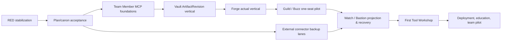

# Implementation Roadmap, Gate Register, and Dependency DAG

> Status: `OWNER_REVIEW_DRAFT` — suite state, owner decisions, and claim rules are governed by [00_MASTER_INDEX_AND_DECISIONS.md](00_MASTER_INDEX_AND_DECISIONS.md).

## Priority and dependency DAG

The active repository roadmap is not changed by this suite. These are implementation candidates after Owner review; no row authorizes execution by itself.



External connector lanes may run beside MCP/Vault only when source scope, credential, byte-store, deployment target, and external effects are disjoint. They cannot share an unapproved writer or claim a common restore result.

RED stabilization semantics: RED-01 is the serial row-0 leaf. RED-02 (topology-oracle contract), RED-03 (renderer writer guard), RED-04 (Workflow Runner Windows E2E evidence), and RED-05 (path-policy tracked debt) are parallel stabilization leaves — each blocks only the later work that depends on its surface (Watch oracle work for RED-02, any protected-writer capability for RED-03, workflow-runner-backed release lanes for RED-04, root done-check promotion for RED-05) and none of them serializes unrelated leaves.

| Order | Candidate leaf | Entry gate | Deliverable / exit test |
| --- | --- | --- | --- |
| 0 | RED-01 life-tree scope-before-cap repair | Current failing test and scoped owner | Test first; owned row survives foreign-row cap; fresh review |
| 1 | Plan/canon rebaseline | Owner review of this suite | Accepted draft decision and trace matrix; no runtime change |
| 2 | Engineering MCP contract/schemas | D27–D29 design decisions | Schema/tool compatibility and adversarial synthetic suite |
| 3 | Vault ArtifactRevision vertical | D27/D29 + exact custody policy | One artifact candidate/review/acceptance synthetic vertical |
| 4 | Forge actual vertical | D27/D28/D29 closed plus accepted context and task-writer agreement | One TaskIntent/Work Brief/assignment default-off vertical (not the later physical field pilot) |
| 5 | Guild/Buzz one-seat | D28/D35 plus project isolation | One approved deployment and bounded collaboration/capture path |
| 6 | Watch/Bastion | Coarse projection contract and recovery policy | No-writer Watch plus action/restore receipt path |
| 7 | First Tool Workshop | Core work/bundle/revision proof | One capacity-one tool, lease/fence/validator vertical |
| 8 | Deployment/education | Pack release evidence and support ownership | One-seat → repeated 3–5 → team pilot evidence |

## Gate register

| Gate | Required decision/evidence | Prohibits until passed |
| --- | --- | --- |
| Plan/review start gate | Owner acceptance of this suite as the working plan, recorded as a dated answer in the 00 decision register together with the independent completeness-review evidence ref | Every implementation leaf except the already-scoped RED stabilization row 0; activation of the OD-09 standing delegation |
| D27 | Custody, promoter, reference/copy/move/derive, source-kind scan/ACL/retention/backup/delete policy | Physical promotion, byte move/delete, project store binding |
| D28 | WorkSession cardinality, actor/node/thread binding, outbox/ack/SLA, handoff, completion approver | Team client WorkSession, auto completion, raw thread storage |
| D29 | Accepted generation, ACL/no-fallback, exact revision download, team candidate authority | Canonical input bundle, accepted-history query/write |
| D35 | Client/plugin package, trust, hook, active binding, provisioning, local state | Per-PC client install/hook/MCP activation |
| D36 | Context writer, generation projection/read-model owner | Persistent context feedback writer and direct MCP/plugin write |
| Physical canary | Exact site, seat, device, certificate/token, firewall, project/work item, expiry, rollback | Network listener, actual client/connector effect |
| Human acceptance | Reviewer/acceptor and artifact/task relation | Artifact/baseline acceptance and Official Task completion update |
| Restore | Actual capture, isolated restore, reconciliation, human restore acceptance | Recovery/rollout claim |

## Standing execution delegation

After Owner approval of the plan/review start gate, this roadmap authorizes the later build loop to continue every safe in-scope leaf without intermediate confirmation. The loop uses current canon, existing interfaces, and the most conservative compatible resolution for reversible detail. It may create bounded public-safe code/docs/tests/manifests/schemas/adapters/fixtures/validators/manuals; run local/synthetic/integration/E2E tests; use isolated/default-OFF services; build/install/smoke/upgrade/rollback isolated packs; use approved `secret_ref` without reading it; run existing-binding read-only collectors, backup capture, isolated restore, and reconciliation; and execute previously gated one-seat/one-project low-risk canaries. It may commit and non-force push clean accepted public leaves when the particular leaf's normal review and release evidence passes.

The standing defaults are: Linear remains Official Task SoR; paths remain reference-in-place; fallback is never implicit; LLM output is proposal-only; new runtime behavior remains default-OFF/canary-first; and 4192 remains a read/approval-request surface. It does not authorize secret inspection, purchase/contracts/external commitments, non-canary outbound messaging, destructive/reset/force operations, automatic Official Done/baseline/final technical acceptance/public release, cross-project private/raw copying, or an unavailable credential/hardware bypass.

### Branch-block protocol

```text
safe branch with passed prerequisites -> continue
excluded-authority/credential/physical blocker -> branch-only BLOCKED + exact unblock packet
other disjoint safe branches -> continue
all remaining branches blocked OR field-pilot acceptance gates pass -> stop program and report
```

An exact unblock packet contains `leaf_id`, `blocked_gate`, missing authority/state, observed evidence, forbidden workaround, minimal Owner action requested, scope/rollback impact, and eligible disjoint next leaves. It never turns a blocked branch into a reason to pause unrelated safe work.

## Research integration status

Direct primary-source research was compared as architectural input, not adopted as a schema or canon by itself. NotebookLM CLI Deep Research is `BLOCKED` because interactive login is required; no NotebookLM corroboration is claimed. Detailed source comparison and architectural limitations live in [03](03_VAULT_ERP_ASSET_REVISIONS.md).

| Direct source group | Mapped plan sections | Bounded inference |
| --- | --- | --- |
| [W3C PROV-O](https://www.w3.org/TR/prov-o/), [PROV constraints](https://www.w3.org/TR/prov-constraints/), [CloudEvents](https://github.com/cloudevents/spec/blob/main/cloudevents/spec.md) | 03, 04, 07, 10 | Typed provenance/activity/event identity and deterministic replay candidates, not a mandated event-store product. |
| [NIST digital thread](https://www.nist.gov/publications/testing-digital-thread-support-model-based-manufacturing-and-inspection), [NASA verification matrix](https://www.nasa.gov/reference/appendix-d-requirements-verification-matrix/), [SysML v2](https://www.omg.org/sysml/SysML-2.htm) | 03, 04, 13 | Traceability and tool-interoperable semantics inform the pilot, but do not certify a project or select a modeling tool. |
| [OCI descriptors](https://github.com/opencontainers/image-spec/blob/main/descriptor.md), [Semantic Versioning](https://semver.org/), [OSGi Core](https://docs.osgi.org/download/r8/osgi.core-8.0.0.pdf) | 05, 12, 15 | Content descriptors, semantic interface compatibility, capability/dependency/lifecycle checks; exact module system remains an implementation decision. |
| [SPDX 3.0.1](https://spdx.github.io/spdx-spec/v3.0.1/scope/), [NIST SSDF](https://csrc.nist.gov/Projects/ssdf) | 12, 13, 15 | SBOM/provenance/release trace fields and secure-release discipline; no automatic compliance claim. |
| [TUF](https://theupdateframework.github.io/specification/), [NIST contingency planning](https://csrc.nist.gov/pubs/sp/800/34/r1/upd1/final) | 09, 12, 13, 15 | Signed-update/recovery and isolated restore evidence; security rollback and product rollback are separate. |
| [OpenTelemetry](https://opentelemetry.io/docs/specs/otel/), [NIST AI RMF](https://www.nist.gov/publications/artificial-intelligence-risk-management-framework-ai-rmf-10) | 08, 13 | Correlated observation and risk lifecycle disciplines; neither is durable business provenance nor LLM authorization. |

| Research pattern | Plan mapping | Claim ceiling / tradeoff |
| --- | --- | --- |
| Provenance Entity/Activity/Agent, revision/bundle/plan | 03, 04, 05, 06 | Source-supported reference vocabulary; domain schema must remain narrow and testable. |
| Digital thread / requirements verification | 03, 04, 13 | Supports typed traceability; does not accept an engineering result. |
| Event `source + id`, immutable capture | 04, 07, 10 | Candidate event envelope/dedupe basis; event sourcing needs privacy/schema-evolution pilots. |
| Content-addressed descriptors/manifests | 03, 05, 12, 15 | Hash proves byte identity, not trust or correctness. |
| SemVer/capability-resolution/lifecycle | 12, 15 | Interface compatibility requires contract tests; avoid a dependency cycle. |
| SBOM/provenance/release evidence | 12, 13, 15 | Release requires build/test/install/rollback evidence, not manifest existence. |
| Update/recovery/observability guidance | 08, 09, 12, 13 | Security rollback, operational rollback, and telemetry are distinct. |
| AI risk lifecycle | 04, 06, 13 | LLM remains a proposal/advisory producer, never sole state/identity/promotion authority. |

This received research delta is consumed by mapping source-supported deltas to a plan section or recording `REJECT/HOLD`. Any later delta follows the same route. Neither can create a new workflow, Drive registration, canon promotion, or default route inside this program plan.

## Fable5 staged finish-work packet

The following is the copy-ready master packet for a later Owner-approved program builder. It is an instruction template, not permission to start now.

```text
Objective: Implement exactly one approved leaf from the Team Member Engineering Program plan suite.

Before work:
1. Read 00 master index, the leaf owner document, 13 acceptance plan, 14 gate register, 15 compatibility map, current AGENTS/Execution Contract, and the relevant module README.
2. Freeze current HEAD/status/index lock and identify dirty-change ownership. Preserve unrelated changes.
3. Resolve every required Owner decision, source ref, exact input/output, allowed write paths, validator, stop condition, and claim ceiling. Reuse the standing decision ledger and do not ask again for a frozen direction. If an excluded authority/state is truly missing, write a branch-only unblock packet and continue disjoint safe leaves.
4. Select one leaf only. Do not broaden into another product, external connector, client install, or runtime activation.

Implementation loop:
1. Create or update the owner-local module manifest, interface/schema, fixture, and validator first; default all new runtime effects OFF.
2. Preserve an already failing RED test; when no failure exists, write one first. Then make the smallest GREEN change without weakening the stated safety/property assertion.
3. Preserve compatibility callers/paths with an adapter. Do not copy legacy code until caller/dependency evidence needs it.
4. Run unit, schema, dependency-cycle, startup/preflight, integration, upgrade/rollback, and relevant restore tests.
5. Update CURRENT/roadmap/changelog only for facts actually changed or measured by this leaf.
6. Request a fresh non-authoring reviewer. Fable self-review is not independent review. Resolve findings or leave a truthful HOLD.
7. Produce a trace record: builder identity and requested/observed model/effort; objective; source refs; changed files; tests/results; reviewer; findings/fixes; commit/release ref; blocker; next leaf.
8. If validation/review/authority is incomplete, report BLOCKED/REVISE for that branch and continue eligible disjoint work. Do not call docs/file existence, idle process, self-check, or an installer a completion signal.

Integration and handoff:
- Integrate only when the leaf's compatibility and acceptance tests pass.
- Use a compact handoff/rollover only when unresolved state would otherwise be lost; never copy raw transcript, secret, or private payload.
- Do not create external accounts, issue credentials, make excluded external effects, or mutate Official Task status without an exact later Owner gate. Existing-binding read-only collection, backup/reconciliation, isolated/default-OFF service/package work, and previously gated canaries proceed under the standing delegation.
```

## Safe next implementation leaf

`RED-01` was executed on 2026-08-30 and closed GREEN (14/14) with a root-cause correction: production scope-before-cap filtering was already correct, and the failing evidence was fixture time-rot; the fixture is now time-invariant and a deterministic fixed-clock regression pins the property (see 02/13). `RED-02` was executed the same day and closed GREEN: the versioned contract pin `guild_hall/watchtower/topology/federated_topology.v1.contract.json` is now the single topology oracle for producer and Board tests, with tracked-artifact drift rejected against both the fresh emit and the pin. `RED-03` was executed the same day: the control-center write route now denies the protected planes and unsafe path shapes through a pure, negative-tested policy regardless of token, and the renderer README states the real capability; activation authority is unchanged. `RED-04` was executed the same day: the E2E fixture now dereferences the copied `node_modules`, and `validate:workflow-runner` passes 36/36 with the full disposable-repo CLI flow. The leaf contract below is retained as executed history. `RED-05` (path-policy tracked debt) stays an Owner-held branch: the Owner deferred the tracked path-policy cleanup on 2026-08-18 and that hold has not been lifted. With RED-01..04 closed, row 2 (Engineering MCP contract/schemas) was executed on 2026-08-30 under the ledger's D27/D28/D29 design-level defaults: `guild_hall/engineering_mcp/` now pins the shared v0 contract as data (10 namespaces, 33 minimum tools, authority ceilings, idempotency/receipt rules, uniform denial envelope), the crosswalk of the 15 current `dev-erp-mcp` tools, a computed non-rotting gap register, and an adversarial structural validator suite (`npm run validate:engineering-mcp`, 9/9). No server, socket, state, or authority was created; serving any contract tool is a later facade leaf behind D27/D28/D29 activation and OD-08 physical tuples. Row 3 (Vault ArtifactRevision synthetic vertical) was executed the same day under the same design defaults: `guild_hall/vault_revision/` pins the plan-03 artifact state machine as a pure in-memory core — five-owner separation, custody/scan gating, parent/head candidate checks, idempotent replay vs key-digest quarantine, uniform foreign/absent denial, submitter-independence for review, exact-acceptance-owner head advance, and a frozen deterministic append-only event log (`npm run validate:vault-revision`, 8/8). Every event is a caller-asserted synthetic fact: no bytes, persistence, promoter writer, or real acceptance exist, covering plan-03 criterion 1's candidate schema/hash/ACL/parent-head checks (the synthetic-bundle and redaction-lineage parts of criterion 1, and criteria 2–6 — physical file, real binding, fresh reviewer surface, human acceptance, backup/restore proof — remain later gated leaves). Row 4's default-OFF prerequisite seam was then executed the same day: `guild_hall/forge_intent/` pins the plan-04 work-generation state machine (candidate → immutable-digest TaskIntent → approval record → official-task registration through an injected writer PORT → assignment → critical-binding-complete Work Brief) as a pure in-memory core with synthetic writer adapters only (`npm run validate:forge-intent`, 8/8). The remaining row-4 substance — a real accepted-context supply and the current task-writer agreement/binding — stays gated: the writer port has no real adapter here, and binding one is an external-effect leaf requiring its own Owner gate. Row 6 was executed on 2026-08-30: `guild_hall/watch_panel_contract/` pins the plan-08 coarse projection (six-state panel enum with missing-evidence-is-unknown/stale-degrades freshness semantics, nine coarse domains, deep-record/secret vocabulary structurally excluded, safe pointers, request-filing as Watch's only mutation, and a structural no-writer proof), and `guild_hall/bastion_action/` pins the plan-09 gate (approval/policy/target/expiry/maintenance-lease validation, recovery actions demanding an exact backup generation with an isolated-restore proof ref, terminal idempotent receipts that carry no health vocabulary, caller-injected executor with synthetic adapters only) — `npm run validate:watch-bastion`, 7/7 including the interlock proof that a receipt can never impersonate fresh health evidence. Wiring 4192/Board onto this contract and binding a real executor stay later gated leaves. Row 7 was executed on 2026-08-30: `guild_hall/tool_workshop/` pins the plan-11 capacity-one job shop — exclusive lease per resource (busy acquires wait; idle UIs never release), a monotonic fencing token whose expiry takeover kills the stale lease and rejects the zombie writer, priority-then-order queueing, validator-fail retry/terminal semantics with zero custody on failure, and a done_candidate custody receipt (`workshop_output_candidate_only`) with no acceptance/promotion/completion surface (`npm run validate:tool-workshop`, 7/7). The first profile is the Document workshop; physical Tool PC/runner binding stays an Owner-gated leaf whose runner MUST treat a stale fencing token as a hard stop. The row-8 groundwork was executed the same day: `guild_hall/deployment_pack/` pins the plan-12/16 release discipline as a contract — the five-pack catalog with contains/must-not-contain boundaries, the monotonic 15-gate release ladder (`released` demands the full ladder through acceptance; a folder existing proves nothing), the strictly ordered eight-ring rollout with per-promotion decision/evidence/support/rollback requirements, and the 13-runbook catalog with mandatory owner/precondition/action/evidence/rollback fields and a secret-material ban (`npm run validate:deployment-pack`, 7/7). Actual pack builds, installs, ring promotions, and runbook publication remain later leaves (physical rings Owner-gated). The first safe deepening candidate — the MCP facade behind flags — was executed on 2026-08-30: `guild_hall/engineering_mcp/src/facade.mjs` is a pure in-memory read-only dispatch facade over the v0 contract, OFF unless constructed with `enabled: true` exactly, with exactly four client-visible outcomes (ok / `facade_disabled` / `request_shape_invalid` / uniform `not_available` covering unknown tools, mutate tools, missing providers, provider exceptions, out-of-scope `project_ref`, and egress violations indistinguishably), precise causes only in an append-only `{seq, at, tool, outcome}` log with sanitized bounded tool labels, JSON-copy deep-frozen egress scanned for undeclared and forbidden fields, shape-then-scope-then-provider ordering, and frozen args/actor-context delivery (`npm run validate:engineering-mcp`, 20/20; an independent REVISE review's four findings — in-band sentinel escape, unbounded log strings, untested actor-context claim, non-finite numbers — were fixed with pinned regressions before commit). Wiring real providers stays behind D27/D28/D29 activation and OD-08 physical tuples. The vault bundle/redaction-lineage candidate was executed the same day, completing plan-03 criterion 1's synthetic scope: `guild_hall/vault_revision/` now also pins accepted-only input bundles (deep-frozen manifests, codepoint-sorted order/locale-independent digests, purpose-covering idempotency), redaction derivatives (accepted source only, ancestry-artifact landing ban, different-bytes proof, deep-frozen lineage, full custody/scan/review/acceptance path), and the external gate (only accepted redaction derivatives registrable; raw originals structurally refused; chain-complete lineage entries naming immediate source and raw origin; destination-covering idempotency; registration only, no transmission port) — `npm run validate:vault-revision` 16/16 after a REVISE review fixed deep-freeze and locale-sort MAJORs plus five smaller findings. Criteria 2–6 (physical custody, D27 promoter, persistence, real acceptance, restore proof) stay gated. The forge brief-draft candidate was executed the same day: `guild_hall/forge_intent/` now prepares Work Briefs through an immutable draft revision chain (open bindings visible as sorted data, present fields validated at draft time by the single shared validator, authority-first issuance of only the latest complete draft, `source_draft_ref` stamped, one-brief-per-assignment closing both paths) — `npm run validate:forge-intent` 13/13 after a REVISE review's six findings (including a direct-path digest-coercion hole the unification closed) were fixed with pinned regressions. The last recorded safe deepening candidate — Board adoption of the watch panel contract — was executed the same day: `ui-workspace/apps/team-ops-board/src/core/watch-panel-view.mjs` consumes `guild_hall/watch_panel_contract` as its single source and renders the full-coverage nine-domain strip view-model (unsupplied domains are `unknown` rows, never absence; display severity pinned; the only mutation is the contract's request-filing surface; browser-safe pure ESM) — `npm run validate:watch-panel-board` 6/6 after a REVISE review's six findings were applied. Vite page wiring (fs.allow check) and 4192 adoption remain separate leaves. The first deployment-pack build was then executed the same day under the standing delegation's isolated/default-OFF package scope: `guild_hall/deployment_pack/tools/build_pack.mjs` + the tracked `packs/tool_workshop_pack.spec.json` build the real pack into untracked `dist/` (validate-before-write incl. secret content scan and unit gate; timestamp-free byte-deterministic manifest; candidate claims `contract` gate only), with isolated install (two-way digest verification, no residue on failure) and installed-copy smoke recorded as out-of-ladder receipts — live CLI evidence digest 34e0e367…, 4 files verified, smoke green; `npm run validate:deployment-pack` 15/15 after a REVISE review's six findings (stale-orphan rebuild MEDIUM among them) were fixed with pinned regressions. Remaining program branches are now the externally gated ones only — row 4-actual (task-writer binding + accepted context supply), row 5 (D28/D35 activation), row X-actual (connector credentials), physical canaries (OD-08), RED-05 (Owner-held), and the field pilot (real seats) — plus the recorded follow-on leaves that need environment verification or Owner gates (Board page wiring, 4192 adoption, MCP real-provider wiring, remaining pack specs and their ladder gates, physical workshop binding).

| Field | Fixed leaf boundary |
| --- | --- |
| Allowed implementation paths | `ui-workspace/apps/dev-erp/src/store.mjs`; `ui-workspace/apps/dev-erp/src/context_life_tree.mjs` only if the narrow source-selection boundary requires it; the existing test file for regression additions only |
| Existing RED | Preserve the failing assertion that an authorized mailbox row survives more than 500 newer foreign rows. Do not reduce the fixture, cap, scope assertion, or expected visibility to make it pass. |
| Acceptance command | `node --test ui-workspace/apps/dev-erp/test/context_life_tree.test.mjs` must pass in full. |
| Sibling regression scope | Non-admin mailbox, item, event, Codex, artifact, upload, file-activity, lane-cap, and total-cap boundaries in the same test surface must retain their security/withholding assertions. |
| Stop conditions | Stop if the repair needs schema migration, live runtime toggle, ACL model rewrite, source ingestion change, external connection, or a path outside this bounded set. |

It has no external dependency, credential/runtime activation, or product-authority change. Passing it does not begin the larger program.

## Related plans

- [Requirements trace](00_MASTER_INDEX_AND_DECISIONS.md)
- [Test plan](13_TEST_DOGFOOD_ACCEPTANCE.md)
- [Folder compatibility](15_FOLDER_COMPATIBILITY_MIGRATION.md)
