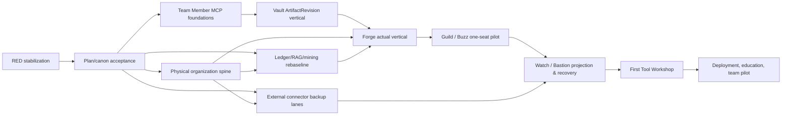

# Implementation Roadmap, Gate Register, and Dependency DAG

> Status: `OWNER_REVIEW_DRAFT` — suite state, owner decisions, and claim rules are governed by [00_MASTER_INDEX_AND_DECISIONS.md](00_MASTER_INDEX_AND_DECISIONS.md).

## Priority and dependency DAG

The active read-only AX/SE slice is not replaced by this suite. The Owner's
2026-08-30 physical-organization clarification does change the adjacent program
priority: R0–R3 gate every new path/storage/writer and actual-provider/physical
expansion leaf, while already-completed pure synthetic contracts remain valid.
No row authorizes execution by itself.



External connector lanes may run beside MCP/Vault only when source scope, credential, byte-store, deployment target, and external effects are disjoint. They cannot share an unapproved writer or claim a common restore result.

RED stabilization semantics: RED-01 is the serial row-0 leaf. RED-02 (topology-oracle contract), RED-03 (renderer writer guard), RED-04 (Workflow Runner Windows E2E evidence), and RED-05 (path-policy tracked debt) are parallel stabilization leaves — each blocks only the later work that depends on its surface (Watch oracle work for RED-02, any protected-writer capability for RED-03, workflow-runner-backed release lanes for RED-04, root done-check promotion for RED-05) and none of them serializes unrelated leaves.

| Order | Candidate leaf | Entry gate | Deliverable / exit test |
| --- | --- | --- | --- |
| 0 | RED-01 life-tree scope-before-cap repair | Current failing test and scoped owner | Test first; owned row survives foreign-row cap; fresh review |
| 1 | Plan/canon rebaseline | Owner review of this suite | Accepted draft decision and trace matrix; no runtime change |
| 1A (next adjacent; non-retroactive) | Physical organization spine | Plan 17 Owner/fresh review, metadata-only inventory, OD-10 owner decisions | Root/Path Registry contract, target materializer, write guard, and 4192 Storage Map; existing payload move 0 |
| 1B (adjacent plan/review lane) | Ledger Catalog + Event Spine + RAG/mining contract | Existing product/portfolio/physical maps, exhaustive metadata-only ledger/RAG inventory, integrated Ultra/Fable5 findings and fresh corrected-document review | LR0A/LR0B frozen; LR1 may create Catalog contract/rows/validator only; no runtime DB or migration yet |
| 1C (adjacent productization lane; `CONTRACT_VALIDATED`) | Product Composition & Source Ownership Map | Product-family decision, current 31-manifest/4-spec audit, caller graph and no-overlap writer scope | Three no-move `product.manifest` contracts plus 8 Product-owned/23 Shared exact classification; source copy/new top-level root 0, release HOLD |
| 1D (Owner decision lane; `OD11_V0_CONFIRMED`) | Owner Master Map + Fresh Grill | `SOULFORGE_OWNER_MASTER_ARCHITECTURE_AND_RELEASE_MAP_V1.md`, fixed decisions, exact Grill frontier | Twelve Grill answers plus OD-11 conservative R0–R4/EV1–EV3 v0 recorded; live policy writer/runtime/Console integration 0 |
| 1E (post-Grill candidate lanes) | Master Map A–F | 1D decision closure, owner/writer map and each lane's remaining evidence Gate | Product composition, SE workspace/metadata, connector/backup, authority/operations UI and manual/internal release may proceed only where prerequisites and write ownership are disjoint; naming remains Owner-deferred |
| 2 | Engineering MCP contract/schemas | D27–D29 design decisions | Schema/tool compatibility and adversarial synthetic suite |
| 3 | Vault ArtifactRevision vertical | D27/D29 + exact custody policy | One artifact candidate/review/acceptance synthetic vertical |
| 4 | Forge actual vertical | D27/D28/D29 closed plus accepted context and task-writer agreement | One TaskIntent/Work Brief/assignment default-off vertical (not the later physical field pilot) |
| 5 | Guild/Buzz one-seat | D28/D35 plus project isolation | One approved deployment and bounded collaboration/capture path |
| 5A | Buzz Project Git Evidence Intake pilot | Plan 07 contract, exact project/access channel/repo/ref/Agent bindings, synthetic intake/Verifier gates, and project-private receipt owner | One actual low-risk terminal receipt read and verified with Linear writes, webhook, automatic Done, artifact acceptance, and raw payload copy all 0 |
| 6 | Watch/Bastion | Coarse projection contract and recovery policy | No-writer Watch plus action/restore receipt path |
| 7 | First Tool Workshop | Core work/bundle/revision proof | One capacity-one tool, lease/fence/validator vertical |
| 8 | Deployment/education | Pack release evidence and support ownership | One-seat → repeated 3–5 → team pilot evidence |

## Gate register

| Gate | Required decision/evidence | Prohibits until passed |
| --- | --- | --- |
| Plan/review start gate | Owner acceptance of this suite as the working plan, recorded as a dated answer in the 00 decision register together with the independent completeness-review evidence ref | Every implementation leaf except the already-scoped RED stabilization row 0; activation of the OD-09 standing delegation |
| D27 | Custody, promoter, reference/copy/move/derive, source-kind scan/ACL/retention/backup/delete policy | Physical promotion, byte move/delete, project store binding |
| D28 | WorkSession cardinality, actor/node/thread binding, outbox/ack/SLA, handoff, completion approver | Team client WorkSession, auto completion, raw thread storage |
| D29 | Accepted generation, ACL/no-fallback, exact revision download, team candidate authority | Canonical input bundle, accepted-history query/write |
| D35 | Client/plugin package, trust, hook, active binding, provisioning, local state | Per-PC client install/hook/MCP activation |
| D36 | Context writer, generation projection/read-model owner | Persistent context feedback writer and direct MCP/plugin write |
| Physical canary | Exact site, seat, device, certificate/token, firewall, project/work item, expiry, rollback | Network listener, actual client/connector effect |
| Human acceptance | Reviewer/acceptor and artifact/task relation | Artifact/baseline acceptance and Official Task completion update |
| Restore | Actual capture, isolated restore, reconciliation, human restore acceptance | Recovery/rollout claim |
| Physical organization | Registered owner/SoR/root class, current/target binding, no-writer-conflict, backup/restore and rollback evidence | Unregistered write, big-bang move, silent fallback, false storage/backup readiness |
| Ledger/RAG/mining contract | Complete Ledger Catalog taxonomy and inventory; producer/logical/infrastructure/consumer owner roles; case/activity issuer; assignment/run/object refs; collection+effective clocks; typed causal relations; owner-local outbox/reconciliation; scoped storage; raw/body boundary; project/common RAG ACL/index/invalidation; Dataset consent/leakage/duplicate/bias/label/approval gates; fresh Ultra+Fable5 review | New generic ledger writer, operational DB migration, automatic RAG indexing/promotion, training-data export or people-performance inference |
| Buzz Project Git Evidence pilot | Exact private project/access-channel/repository/ref/Agent binding; public-safe terminal-receipt contract; synthetic replay, stale-revision, foreign-project and history-rewrite rejection; one-shot read-only intake; artifact/validator/Work Brief/blocker verification; Human Owner review and rollback | All-commit triggers, webhook/runtime activation, persistent coordinator, Pulse state writer, Linear mutation/Done, Artifact/Evidence acceptance, accepted-context promotion, raw project payload copy, or project-wide rollout |
| Product composition/source ownership | Every source Module has one logical owner and Interface; product-specific vs shared classification; three product dependency closures; product tests/Packs/release/rollback refs; fresh review | New top-level `products`/`shared` root, source move/copy, duplicate Implementation, compatibility removal, product release claim |
| Owner Master Map / Grill | Deterministic validators, exact stable input, continuity review, Human Owner decisions, decision-register sync, shared-understanding confirmation and explicit Grill exit | Re-asking settled or Owner-deferred decisions before their trigger, implementation during Grill, implicit naming/root/authority/release approval |

Post-Grill lane mapping: `A→Naming/World Skin`, `B→Product Composition`,
`C→SE Workspace/Metadata`, `D→Connector/Backup`, `E→Authority/Operations UI`,
`F→Manual/Internal Release`. The twelve Grill answers and OD-11 v0 are closed at
contract level. These remain candidate lanes and do not supersede the active
Roadmap slice. Lane A stays Owner-deferred until the naming/Game UX re-entry
trigger; Lane E still cannot activate a writer/runtime without its separate Gates.

## Ledger/RAG/Process-Mining lane — target sequence

```text
LR0A exhaustive ledger/receipt/cursor/state/projection/backup inventory + owner/writer conflicts
 → LR0B case/activity/time/relation + privacy/ACL/storage partition contract
 → LR1  Ledger Catalog contract + complete rows + validators
 → LR2A shared envelope/outbox/reconciliation conformance + payload-free golden trace
 → LR2B one scoped single-project Event Store pilot + backup/restore fixture
 → LR3  Linear/Slack/Mail/Voice/PC adapters + reconciliation
 → LR4  Candidate/Task/Assignment/Run/Waiting/Handoff/Artifact/Review/Acceptance adapters
 → LR5  RAG generation/invalidation contract + common/project ACL gates
 → LR6  one isolated project RAG exact-or-equivalent rebuild/restore
 → LR7  process-mining dataset v0 + post-project analysis fixture
 → LR8  approved learning/evaluation dataset v0 (no automatic training)
 → LR9  full 4192 read-only coverage/lag/quality/cost projection
 → LR10 repeated project closeout pilot and owner decision
```

Current state is `LR0_CORRECTION_REVIEW_ACCEPTED / OWNER_REVIEW_DRAFT`: the
metadata audit, Fable 5 `ACCEPT_WITH_REVISIONS`, Sol Ultra `REVISE`, integrated
corrections and a fresh non-authoring Level-2 `ACCEPT` all exist. The correction
closes the documented LR0A/LR0B gaps in product rebaseline §27, plan 00, 02, 14,
15, 17 and the shared glossary. LR1 still requires the Human Owner to treat this
draft as the working plan. No central Ledger Catalog, Event Store, RAG Outbox,
mining dataset or training export is created. Existing persistent, source-local,
project-local and in-memory ledgers remain under their current owners.

### LR0 entry, LR1 deliverable, and LR1 exit are separate gates

| Boundary | Required evidence | Not required yet |
| --- | --- | --- |
| LR1 entry after LR0 | inventory scope frozen; owner-role model, case/activity issuer, clocks/relations, storage partition, RAG/Dataset privacy rules and glossary defined; fresh document review passes | runtime DB, all adapters, actual source payload, golden operational data |
| LR1 deliverable | every inventory surface has one Catalog row with owner/SoR/writer/schema/scope/storage/backup/projection/review and deny-by-default eligibility; conflicts and gaps stay explicit | physical persistence for rows that are currently in-memory/HOLD |
| LR1 exit | Catalog validator passes; wire/display IDs reconcile; payload-free golden trace reconstructs source→candidate→task→assignment→wait/resume→run→result→review→acceptance→backup/restore; fresh independent review passes | production store, automatic indexing, people analytics, external mutation |

The golden trace is an LR1 exit/conformance fixture, not a circular prerequisite
for writing the Catalog contract. LR2A deepens the same trace through the shared
envelope/outbox/reconciliation port. SQLite persistence first appears only in
LR2B and is bounded to one project pilot.

4192 may receive incremental read-only coverage/lag projections from LR3 onward;
LR9 closes full product coverage. LR5/LR6 depend on LR2 and exact source revision
contracts and may proceed beside later LR4 adapters when owner/store scopes are
disjoint. LR6 is the implementation path for the existing M2-1 project-local RAG
route, not a competing lane.

## Product-composition lane — target sequence

```text
PC0  current source/Module/Pack audit
 → PC1  three no-move product.manifest contracts
 → PC2  Product-owned vs Shared Module map + dependency/Interface closure
 → PC3  product-level integration validators and release/Pack composition
 → PC4  confirm exact root spelling/location within the Owner-approved product-home+Shared principle
 → PC5  move one Module with compatibility Adapter + rollback proof
 → PC6  repeated migration; retire prior path only after caller/readback acceptance
```

Current state is `PC1_COMPLETE / PC2_COMPLETE_ENROLLED_31 /
PC3_CONTRACT_VALIDATED_RELEASE_HOLD / PC4_HOLD`. Three manifests and the dynamic
catalog classify 8 Product-owned and 23 Shared Modules, with no source move/copy
and no product release. The Owner confirmed the long-range product-home+Shared
principle but not an immediate physical path or migration. PC4 is the earliest
point where a new top-level root spelling/location may be approved.

## Standing execution delegation

After Owner approval of the plan/review start gate, this roadmap authorizes the later build loop to continue every safe in-scope leaf without intermediate confirmation. The loop uses current canon, existing interfaces, and the most conservative compatible resolution for reversible detail. It may create bounded public-safe code/docs/tests/manifests/schemas/adapters/fixtures/validators/manuals; run local/synthetic/integration/E2E tests; use isolated/default-OFF services; build/install/smoke/upgrade/rollback isolated packs; use approved `secret_ref` without reading it; run existing-binding read-only collectors, backup capture, isolated restore, and reconciliation; and execute previously gated one-seat/one-project low-risk canaries. It may commit and non-force push clean accepted public leaves when the particular leaf's normal review and release evidence passes.

The standing defaults are: Linear remains Official Task SoR; paths remain reference-in-place; fallback is never implicit; LLM output is proposal-only; new runtime behavior remains default-OFF/canary-first; and 4192 remains a read/approval-request surface. It does not authorize secret inspection, purchase/contracts/external commitments, non-canary outbound messaging, destructive/reset/force operations, automatic Official Done/baseline/final technical acceptance/public release, cross-project private/raw copying, or an unavailable credential/hardware bypass.

### Branch-block protocol

```text
safe branch with passed prerequisites -> continue
excluded-authority/credential/physical blocker -> branch-only BLOCKED + exact unblock packet
other disjoint safe branches -> continue
all remaining branches blocked OR field-pilot acceptance gates pass -> stop program and report
```

An exact unblock packet contains `leaf_id`, `blocked_gate`, missing authority/state, observed evidence, forbidden workaround, minimal Owner action requested, scope/rollback impact, and eligible disjoint next leaves. It never turns a blocked branch into a reason to pause unrelated safe work.

## Research integration status

Direct primary-source research was compared as architectural input, not adopted as a schema or canon by itself. NotebookLM CLI Deep Research is `BLOCKED` because interactive login is required; no NotebookLM corroboration is claimed. Detailed source comparison and architectural limitations live in [03](03_VAULT_ERP_ASSET_REVISIONS.md).

| Direct source group | Mapped plan sections | Bounded inference |
| --- | --- | --- |
| [W3C PROV-O](https://www.w3.org/TR/prov-o/), [PROV constraints](https://www.w3.org/TR/prov-constraints/), [CloudEvents](https://github.com/cloudevents/spec/blob/main/cloudevents/spec.md) | 03, 04, 07, 10 | Typed provenance/activity/event identity and deterministic replay candidates, not a mandated event-store product. |
| [NIST digital thread](https://www.nist.gov/publications/testing-digital-thread-support-model-based-manufacturing-and-inspection), [NASA verification matrix](https://www.nasa.gov/reference/appendix-d-requirements-verification-matrix/), [SysML v2](https://www.omg.org/sysml/SysML-2.htm) | 03, 04, 13 | Traceability and tool-interoperable semantics inform the pilot, but do not certify a project or select a modeling tool. |
| [OCI descriptors](https://github.com/opencontainers/image-spec/blob/main/descriptor.md), [Semantic Versioning](https://semver.org/), [OSGi Core](https://docs.osgi.org/download/r8/osgi.core-8.0.0.pdf) | 05, 12, 15 | Content descriptors, semantic interface compatibility, capability/dependency/lifecycle checks; exact module system remains an implementation decision. |
| [SPDX 3.0.1](https://spdx.github.io/spdx-spec/v3.0.1/scope/), [NIST SSDF](https://csrc.nist.gov/Projects/ssdf) | 12, 13, 15 | SBOM/provenance/release trace fields and secure-release discipline; no automatic compliance claim. |
| [TUF](https://theupdateframework.github.io/specification/), [NIST contingency planning](https://csrc.nist.gov/pubs/sp/800/34/r1/upd1/final) | 09, 12, 13, 15 | Signed-update/recovery and isolated restore evidence; security rollback and product rollback are separate. |
| [OpenTelemetry](https://opentelemetry.io/docs/specs/otel/), [NIST AI RMF](https://www.nist.gov/publications/artificial-intelligence-risk-management-framework-ai-rmf-10) | 08, 13 | Correlated observation and risk lifecycle disciplines; neither is durable business provenance nor LLM authorization. |

| Research pattern | Plan mapping | Claim ceiling / tradeoff |
| --- | --- | --- |
| Provenance Entity/Activity/Agent, revision/bundle/plan | 03, 04, 05, 06 | Source-supported reference vocabulary; domain schema must remain narrow and testable. |
| Digital thread / requirements verification | 03, 04, 13 | Supports typed traceability; does not accept an engineering result. |
| Event `source + id`, immutable capture | 04, 07, 10 | Candidate event envelope/dedupe basis; event sourcing needs privacy/schema-evolution pilots. |
| Content-addressed descriptors/manifests | 03, 05, 12, 15 | Hash proves byte identity, not trust or correctness. |
| SemVer/capability-resolution/lifecycle | 12, 15 | Interface compatibility requires contract tests; avoid a dependency cycle. |
| SBOM/provenance/release evidence | 12, 13, 15 | Release requires build/test/install/rollback evidence, not manifest existence. |
| Update/recovery/observability guidance | 08, 09, 12, 13 | Security rollback, operational rollback, and telemetry are distinct. |
| AI risk lifecycle | 04, 06, 13 | LLM remains a proposal/advisory producer, never sole state/identity/promotion authority. |

This received research delta is consumed by mapping source-supported deltas to a plan section or recording `REJECT/HOLD`. Any later delta follows the same route. Neither can create a new workflow, Drive registration, canon promotion, or default route inside this program plan.

## Fable5 staged finish-work packet

The following is the copy-ready master packet for a later Owner-approved program builder. It is an instruction template, not permission to start now.

```text
Objective: Implement exactly one approved leaf from the Team Member Engineering Program plan suite.

Before work:
1. Read 00 master index, the leaf owner document, 13 acceptance plan, 14 gate register, 15 compatibility map, current AGENTS/Execution Contract, and the relevant module README.
2. Freeze current HEAD/status/index lock and identify dirty-change ownership. Preserve unrelated changes.
3. Resolve every required Owner decision, source ref, exact input/output, allowed write paths, validator, stop condition, and claim ceiling. Reuse the standing decision ledger and do not ask again for a frozen direction. If an excluded authority/state is truly missing, write a branch-only unblock packet and continue disjoint safe leaves.
4. Select one leaf only. Do not broaden into another product, external connector, client install, or runtime activation.

Implementation loop:
1. Create or update the owner-local module manifest, interface/schema, fixture, and validator first; default all new runtime effects OFF.
2. Preserve an already failing RED test; when no failure exists, write one first. Then make the smallest GREEN change without weakening the stated safety/property assertion.
3. Preserve compatibility callers/paths with an adapter. Do not copy legacy code until caller/dependency evidence needs it.
4. Run unit, schema, dependency-cycle, startup/preflight, integration, upgrade/rollback, and relevant restore tests.
5. Update CURRENT/roadmap/changelog only for facts actually changed or measured by this leaf.
6. Request a fresh non-authoring reviewer. Fable self-review is not independent review. Resolve findings or leave a truthful HOLD.
7. Produce a trace record: builder identity and requested/observed model/effort; objective; source refs; changed files; tests/results; reviewer; findings/fixes; commit/release ref; blocker; next leaf.
8. If validation/review/authority is incomplete, report BLOCKED/REVISE for that branch and continue eligible disjoint work. Do not call docs/file existence, idle process, self-check, or an installer a completion signal.

Integration and handoff:
- Integrate only when the leaf's compatibility and acceptance tests pass.
- Use a compact handoff/rollover only when unresolved state would otherwise be lost; never copy raw transcript, secret, or private payload.
- Do not create external accounts, issue credentials, make excluded external effects, or mutate Official Task status without an exact later Owner gate. Existing-binding read-only collection, backup/reconciliation, isolated/default-OFF service/package work, and previously gated canaries proceed under the standing delegation.
```

## Executed-leaf ledger (rebaselined 2026-08-30 · main@8b02724c)

Maturity states are DISJOINT claims and nothing above a proven state is implied:
`synthetic` = in-memory contract/core over caller-asserted facts; `package-install` = isolated pack build/install/smoke evidence; `actual-provider` = real store/writer/probe/feed wiring; `physical-pilot` = real seats/devices under Owner gates. Historical per-leaf detail is durable in each commit message and the dated CHANGELOG entries; this ledger is the current-truth index.

### Lane × maturity

| Lane | synthetic | package-install | actual-provider | physical-pilot |
| --- | --- | --- | --- | --- |
| Engineering MCP (contract·crosswalk·read facade·stdio seam) | DONE `L-MCP-CONTRACT`,`L-MCP-FACADE`,`L-MCP-STDIO` | — | GATED (real provider/client binding, D27/D28/D29 + OD-08) | GATED |
| Vault revision (state machine·bundle·redaction·external/Hermes custody admission) | DONE `L-VAULT-CORE`,`L-VAULT-C1`,`L-HERMES-VAULT-ADMISSION` | — | GATED (D27/D29, promoter·persistence·실수락) | GATED |
| Forge intent / Linear packet admission | DONE `L-FORGE-CORE`,`L-FORGE-DRAFT`,`L-FORGE-LINEAR-ADMISSION` | — | GATED (실 task-writer + accepted context) | GATED |
| Watch/Bastion contract | DONE `L-WATCH-BASTION` | — | GATED (실 executor) | GATED |
| Board/4192 watch vertical | DONE `L-BOARD-VIEWMODEL`,`L-BOARD-PAGE`,`L-STORAGE-MAP-SERVER` (기본 OFF `?watch=1`) + `L-WATCH-SUP-3` | n/a (vite 앱) | PARTIAL — 실 read-only 공급자 3/9 domain; storage-map GET server seam은 binding+binding SHA+snapshot SHA+registry digest pin의 기본-OFF 코드까지 완료, 실제 private binding/snapshot은 미주입; watchtower binding 등 잔여 5는 환경 gate | GATED |
| Mail/Slack/Voice/PC-activity source-lane capture adapters | DONE `L-MAIL-SOURCE-LANE`,`L-SLACK-SOURCE-LANE`,`L-VOICE-SOURCE-LANE`,`L-PC-ACTIVITY-SOURCE` | — | GATED (실 receipt caller·private record store; Cloud/Git/NAS native receipt 없음) | GATED |
| Source/Buzz/Hermes backup-generation contracts | DONE `L-BACKUP-GEN-CONTRACTS` (generic Source acceptance separation + Buzz multi-store digest + Hermes Agent custody manifest; effects 0) | Backup-Recovery current closure에 포함 | GATED (actual bytes/quiesce/restore/human authority) | GATED |
| Linear whole-workspace backup + project classification | DONE `L-LINEAR-PROJECT-INDEX` (every catalog project + unassigned index; bodies remain single-copy; exact-digest backfill tool) | Backup-Recovery **72/24/pin19** | PARTIAL — connected read-only recheck 12 projects/1 team/72 issues; retained generation+isolated restore index backfill PASS+replay NO_OP, 47 project-bound/25 unassigned/11 non-empty/1 zero-issue; history/deletion/attachment-byte/cutoff/freshness gaps | GATED (fresh recurring run + human restore acceptance) |
| Agent workforce lineage | DONE `L-AGENT-MARK-CONTRACT`,`L-AGENT-REVISION-CATALOG`,`L-AGENT-AUTH-VERIFY` | GATED (`project_ai_team_pack`) | GATED (verified receipt durable writer·deployment activation) | GATED |
| Project AI Team Pack admission | DONE `L-PROJECT-AI-TEAM-ADMISSION` (Project Mark authority + four role classes + verified Agent bindings; refs-only future input) | GATED (actual approved inputs; no tracked spec) | GATED | GATED |
| Candidate execution authority admission | DONE `L-CANDIDATE-AUTH-ADMISSION` (coordinator-native packets + current Agent/assignment/tool/slot binding; execute/claim 0) | — | GATED (durable ledger + actual KVDS binding/runtime) | GATED |
| Tool workshop | DONE `L-WORKSHOP-CORE` | DONE `L-PACK-BUILDER` (4-file pack, install+smoke green) | GATED (물리 Tool PC·runner) | GATED |
| Deployment pack (contract·builder·spec 4종/5종 중 project_ai_team만 외부 gate) | DONE `L-PACK-CONTRACT` | current Backup-Recovery **72/24/pin19**, hpp **1,018/93/pin72**, Universal Client source Pack **19/5/pin3**; project_ai_team spec은 actual approved input 전 absent | source-Pack isolated copy/smoke/restore + bundled transport import PASS; external endpoint/credential 0 | GATED |
| Module operability gate (manifest·의존·cycle·preflight) | DONE `L-MODOP-GATE` (current **31 manifest**, Universal Client 포함, import cycle 0; 잔여 legacy dir은 별도 분류) | n/a | — | — |
| Product composition PC1–PC3 | DONE (3 manifests·8 owned/23 Shared·unresolved 0·no-move) | n/a | GATED (release digest·external physical rollout) | GATED |
| OD-11 authority taxonomy | DONE (pure/default-OFF R0–R4·EV1–EV3, R3/R4 grant 0) | n/a | GATED (ERP writer·Bastion runtime·Console action) | GATED |
| Manual release/projection | PARTIAL (16 candidate/current; deterministic HTML renderer; exercise 0) | HPP/Team/Backup refs resolve to candidate/HOLD | GATED (exercise·last-verified·build_pack integration) | GATED |
| Synthetic recovery + Internal RC preflight | DONE contract (technical restore + separate acceptance seam + HOLD/READY binder) | Backup-Recovery closure | GATED (actual Human pin·device/project/credential binding) | GATED |
| Cross-module integration (plan-13 module-integration rung) | DONE `L-DOGFOOD-INT`,`L-KVDS-FULL-CONTRACT` (public-safe synthetic, actual effects 0) | — | GATED (actual accepted KVDS context·Linear writer·Hermes runtime·artifact custody·human acceptance) | GATED |
| Physical spine (plan-17 R1–R5 contracts) | DONE `L-PHYS-SPINE`,`L-PHYS-SPINE-HARDEN`,`L-SOURCE-LANE-LEDGER`,`L-ASSET-CLASS-LEDGER` + source adapters (seed 41행; ERP `_workspaces`/Bot work root 분리) | — | GATED (private binding/record writer·canary readback·enforcement·actual backup/restore) | GATED |
| dev-ERP host gates | DONE `L-DEVERP-HOST-RED` + PATH 실행파일 전면 고정 (합성 아님 — 실 host 스위트 green; whoami에 이어 git(부팅 buildSeq 포함)·where·taskkill·cmd·python까지 System32 절대경로/`DEV_ERP_GIT_EXE`·`DEV_ERP_PYTHON` pin/resolver로 고정, where 자체 cwd도 System32로 중립화 — **server·worker·bridge 프로세스의 PATH 해석 잔존 0**; 예외 장부=dev CLI 유틸(doctor·verify-gate·probe·se-report·release-audit·payload-backup)과 ops 런처 ps1의 node 해석(서버 프로세스 밖, CHANGELOG에 명시); 이 lane만 이 칸을 host-gate 증거로 사용) | (hpp pack로 포장됨) | 기존 운영면(본 프로그램 범위 밖) | — |

### Per-leaf durable trace

| Leaf | Commit | Lane | One-line deliverable |
| --- | --- | --- | --- |
| `L-RED-01` | `595471eb` | dev-ERP | life-tree fixture 시간불변화 + scope-before-cap 고정클록 회귀 |
| `L-RED-02` | `0d0c9f61` | Watch | 단일 topology oracle pin(`federated_topology.v1.contract.json`) + classic lens 정직화 |
| `L-RED-03` | `4710fa7f` | Renderer | control-center write route의 보호 plane 거부 정책 |
| `L-RED-04` | `a24e9299` | Workflow runner | E2E fixture 호스트-레이아웃 독립화 (36/36) |
| `L-PLAN-FREEZE` | `259d0050` | Plan | 프로그램 계획 suite v0 freeze (docs 00–16) |
| `L-MCP-CONTRACT` | `f806da8e` | MCP | v0 계약 데이터(10 ns·33 tools·ceilings)+17-tool crosswalk+구조 validator |
| `L-VAULT-CORE` | `2f6fd24d` | Vault | 5-owner ArtifactRevision 상태기계 in-memory 합성 수직 |
| `L-FORGE-CORE` | `92a2c8cf` | Forge | candidate→intent digest→승인→writer PORT→assignment→brief core |
| `L-WATCH-BASTION` | `9b283278` | Watch | coarse panel 계약 + 승인행동 gate(무건강 receipt 인터록) |
| `L-WORKSHOP-CORE` | `2e48cd9d` | Workshop | capacity-1 lease·fencing·validator-retry job shop |
| `L-PACK-CONTRACT` | `13086c4c`+`0947f903` | Deployment | pack 5종·gate 15단·ring 8단·runbook 13종 계약(+probe 정정) |
| `L-MCP-FACADE` | `b3d65a73` | MCP | 기본 OFF read-only dispatch facade(균일 거부 4-outcome) |
| `L-VAULT-C1` | `2a34a9dd` | Vault | accepted-only bundle·redaction lineage·external gate |
| `L-FORGE-DRAFT` | `fd66baa9` | Forge | Work Brief draft 체인(누락 가시화·authority-first 발행) |
| `L-BOARD-VIEWMODEL` | `fbf2bfb7` | Board | 9-domain full-coverage watch strip view-model |
| `L-PACK-BUILDER` | `8bed69c8` | Deployment | validate-before-write pack builder + tool_workshop 실빌드 증거 |
| `L-BOARD-PAGE` | `257c10a9` | Board | `?watch=1` lazy 페이지 배선 = 4192 채택(기본 경로 무부하) |
| `L-WATCH-SUP-1` | `6d77a345` | Board | 실공급자 2종(connector_freshness·hpp_host, source-asserted only) |
| `L-DOGFOOD-INT` | `7300e042` | Integration | forge→vault→forge→workshop 체인 + facade 실서빙 교차 증명 |
| `L-WATCH-SUP-2` | `a46ce965` | Board | hermes_runtime 공급자(clock-less hold 생존, 첫 라이브 실신호) |
| `L-WATCH-SUP-3` | `f2259887` | Board | backup_restore_readiness 공급자: R3 storage-map overlay 집계 verbatim 번역(위조/비인식 payload는 무공급·hold는 clock-less 생존), 4번째 read-only GET 배선 — endpoint 자체는 private gate |
| `L-SOURCE-INDEX` | `c62ab68d` | Physical spine | source-lane index 계약: refs-only 레코드 4종 + 결정론 evidence 어셈블러(digest 사슬 파손=조작으로 HOLD·빠진 고리는 부재·no_evidence·타 source/fork 거부) — R3 evidence의 공급 계약 완성 |
| `L-MAIL-SOURCE-LANE` | `e097218f` | Physical spine / Mail | accepted continuous/store receipt를 capture-only source-lane generation으로 변환; R3 degraded·error detail redaction |
| `L-AGENT-MARK-CONTRACT` | `e097218f` | Guild / Agent assets | Family→Mark→Deployment→Run→Memory Generation 순수 lineage 계약; persistence/runtime/authority effect 0 |
| `L-SLACK-SOURCE-LANE` | `f70b8a36` | Physical spine / Slack | coverage·cursor·one-receipt/one-event custody를 capture-only source lane으로 결속 |
| `L-VOICE-SOURCE-LANE` | `f70b8a36` | Physical spine / Voice | plaud_import_ready·copy-only custody를 exact source/session/recording capture로 결속; legacy authority HOLD |
| `L-STORAGE-MAP-SERVER` | `f70b8a36` | Board / 4192 | binding/snapshot/digest pinned loopback GET-only server seam; default-OFF·writer 0 |
| `L-SOURCE-LANE-LEDGER` | `646bfa35` | Physical spine / R5 | refs-only record append ledger·NO_OP/conflict·capture→backup→restore evidence completeness |
| `L-AGENT-REVISION-CATALOG` | `646bfa35` | Guild / Agent assets | candidate·unverified approval claim revision catalog; active Agent projection 0 |
| `L-MCP-STDIO` | `646bfa35` | MCP | branded facade only·21 read tools·bounded newline stdio·mutate/provider wiring 0 |
| `L-BACKUP-GEN-CONTRACTS` | `1a9f41bc` | Backup / R5 | Source trusted acceptance pin·Buzz multi-store digest·Hermes Agent backup manifest 계약; actual effects 0 |
| `L-ASSET-CLASS-LEDGER` | `f76df21e` | ERP assets / R5 | 9-class revision·five-owner·acceptance/backup/restore evidence overlay; authority neutral |
| `L-AGENT-AUTH-VERIFY` | `f76df21e` | Guild / Agent authority | approval claim + trusted pin + current-authority-state exact verification; runtime/task effect 0 |
| `L-PC-ACTIVITY-SOURCE` | `f76df21e` | Physical spine / PC activity | native project-bound file-activity coverage→capture-only source lane; Cloud/Git/NAS HOLD |
| `L-PROJECT-AI-TEAM-ADMISSION` | `849a594f` | Deployment / Guild | independently approved Project Mark + four role classes/current Agent bindings→future pack input; spec/runtime 0 |
| `L-CANDIDATE-AUTH-ADMISSION` | `849a594f` | Task execution | coordinator-native packets + verified Agent/current assignment/tool/slot admission; execute/claim/Linear 0 |
| `L-FORGE-LINEAR-ADMISSION` | `21379b37` | Forge / Task execution | exact Official Task·Assignment·issued Brief→structured coordinator packet; read/write/claim 0 |
| `L-HERMES-VAULT-ADMISSION` | `21379b37` | Vault / Artifact custody | Hermes result + authenticated data-plane custody→PROPOSED submission input; revision/head 0 |
| `L-KVDS-FULL-CONTRACT` | `397bfd05` | Integration | KVDS-shaped accepted context→Forge/Linear→Agent/Team authority→MCP→Hermes exact-one→custody→review→human acceptance synthetic canary |
| `L-LINEAR-PROJECT-INDEX` | `71d731d5` | Backup / R4 | whole-workspace generation→all catalog projects+unassigned index, create-only source/restore backfill and exact replay; actual 12/72 partition, human acceptance 0 |
| `L-DEVERP-HOST-RED` | `e27d5c6d` | dev-ERP | worker 신원 바이너리 System32 절대경로 고정(보안 강화) |
| `L-HPP-PACK` | `8b02724c` | Deployment | dev-ERP 267파일 pack(모듈+데이터 폐포·scan pin 60·smoke 파티션 78+11) |
| `L-PLAN-TRUTH` | `22c05384` | Program docs | 이 원장 자체(레인×성숙도·trace·register)와 drift 수정 + `validate:plan-truth` |
| `L-MODOP-GATE` | `a4a330cb` | Operability | manifest 26필드 스키마·선언 의존·import-cycle validator + preflight + pcb cycle 절단(pin 253/852) |
| `L-DEP-DELIVERY` | `729b43e3` | Deployment | vendored npm 폐포 6패키지(byte pin 656)·smoke 제외 11→2·`test_concurrency` spec화 |
| `L-GITFREE-ATTEST` | `47e7e8a7` | Deployment | git-free pack-manifest attestation(재계산 digest·`.git` 우선·selfPath)·smoke 제외 0·adversarial 검토 6건 반영 |
| `L-START-STOP` | `53059a1f` | Deployment | 격리 start/stop 증명(env 중화·health digest 결속·post-stop 재결속·payload byte-clean) |
| `L-LIFECYCLE` | `0ce4b835` | Deployment | pack 생애주기 backup/upgrade/rollback/restore(관측된 검증만 기록·1세대 보존·traversal 거부) — initial gate 7다리 완결 |
| `L-PATH-PIN` | `9e9f81b6` | dev-ERP | PATH 실행파일 전면 고정(git 부팅 rung 포함·where cwd 중립화·python) — server·worker·bridge PATH 해석 0 |
| `L-TEAM-CLIENT` | `9a2f5191` | Deployment | Team Client 소스 pack 211파일(전 suite 77/723 smoke green·제외 0)·closure lib 추출(byte-동일 증명) |
| `L-RISK-ENROLL` | `ed40a5a1` | Operability | pack 폐포 직접 의존 legacy 16모듈 최소주장 manifest 등재(9→25, 잔여 24 의도적 유보) |
| `L-BACKUP-REC` | `18c3f65a` | Deployment | Backup-Recovery pack 49파일(14/14 smoke·커버리지 가드) + project_ai_team BLOCKED packet |
| `L-ACCEPT-LANE` | `600db1ea` | Validate | root acceptance lane +3(고아 모듈 suite 등재·양 모드 대칭 pin) |
| `L-GRACEFUL-CONTRACT` | `7bb3ad07` | Deployment | posix graceful-stop 계약(SIGTERM→exit 0 assert)·win32 무회귀·실행은 BLOCKED_ENVIRONMENT packet |
| `L-PLAN13-FACTS` | `ac5030f5` | Program docs | plan-13 사실표 재기준(57/58/57 정직 스토리)·L-RED-03 probe 리터럴 근본 수정 |
| `L-PHYS-SPINE` | `8ddba7cf`+`dafc4fc3` | Physical spine | plan-17 R1–R3 계약 수직: no-fallback resolver·operation-aware write guard(delete/move 전역 gate)·빈 디렉터리 전용 materializer·registry-driven storage map — OD-10 sentinel로 mutating 전부 fails-closed; Owner 정정 반영: R3는 기존 4192 topology 신원 재사용 overlay(중복 source 신원 표현 불가) |
| `L-PHYS-SPINE-HARDEN` | `e57c4576` | Physical spine + Linear backup | 독립 통합검토 REVISE 7건 폐쇄: R2 authenticated operation receipt·partial-apply recovery, R3 OD-10 HOLD·digest/safe-ref, semantic clock, Linear network UNKNOWN·legacy v2 compatibility, actual-reader Pack/validator enrollment(51파일·15 smoke) |

### Current validator register (rebaselined 2026-08-30)

| Validator | Count | Covers |
| --- | --- | --- |
| `validate:engineering-mcp` | 31 | 계약 10 + facade 10 + default-OFF branded stdio seam 11 |
| `validate:vault-revision` | 16 | 상태기계 + bundle/redaction/external |
| `validate:forge-intent` | 13 | core + draft 상태 |
| `validate:watch-bastion` | 8 | panel 계약 + bastion gate + 인터록 |
| `validate:tool-workshop` | 8 | lease/fencing/retry/custody |
| `validate:deployment-pack` | 38 | 계약 7 + builder 17(파티션·pin·builder↔reader 라운드트립·hpp/team_client/backup_recovery 실spec E2E·actual-reader closure·전 Pack no-reboot guard 포함) + start/stop 증명 가드 5(env 중화·identity 결속·post-stop 재결속·platform-honest stop·pre-boot 거부) + 생애주기 9(backup/upgrade/rollback/restore·영수증 정직성·half-state coded 거부·traversal 거부·digest recipe pin; reader측 traversal 회귀는 dev-ERP identity suite에 별도) + spec drift `--check` ×3 |
| `validate:watch-panel-board` | 11 | strip view-model 6 + 공급자 5(storage-map overlay 포함, 실 R3 계약 출력에 결속) |
| `validate:integration-dogfood` | 5 | 기존 cross-module 체인 4 + KVDS-shaped 전체 계약 canary 1 |
| `validate:module-operability` | 8 | manifest 스키마·의존·cycle-0 고정·hermes coarse 경계 + preflight receipt |
| `validate:product-composition` | 4 + preflight | 3 products·31 Modules exact set·8 owned/23 Shared·not-released |
| `validate:main-node-deployment` | 13 | 7-Cell target·R7 receipt chain·Doctor exact evidence·reboot/multi-root/digest/rollback HOLD |
| `validate:universal-client` | 19 | same-binary capability menu·3-seat isolation/revoke·bundled transport·durable ordered ACK outbox·no-reboot update/rollback |
| `validate:authority-taxonomy` | 34 | A/JM/R/EV 분리·R3/R4 거부·scope/evidence/rate/expiry/replay/STOP |
| `validate:manual-release` | 12 | 16 candidate exact catalog·resolver·missing/stale/digest/version/exercise HOLD |
| `validate:manual-projection` | 5 | deterministic accessible self-contained HTML·no raw/remote/local unsafe content·all tracked candidates renderable |
| `validate:internal-rc-prephysical` | 5 | current public HOLD·synthetic READY gate·exact evidence/freshness/no-I/O |
| `validate:synthetic-recovery-canary` | 17 | temp-only backup/readback/restore·parity/gap·distinct Human acceptance seam |
| `validate:path-registry` | 17 | R1 계약: multi-axis 스키마·seed 41행(source 12 + asset class 9 + Bot work root 1 포함)·ERP `_workspaces`/Bot work root 분리·absolute-path 거부·resolver HOLD 전종·write-guard 매트릭스·updateRecord gate·sub-second/impossible clock 거부·topology 신원 중복·OD-10 fails-closed |
| `validate:target-materializer` | 10 | R2: canary 승인 gate(HOLD)·registry-driven source lane·dry-run/apply·멱등 replay·foreign payload/hostile root 거부·authenticated plan/receipt·partial-apply recovery·rollback은 빈 self-created 디렉터리만 |
| `validate:watch-storage-map` | 11 | R3: 기존-노드 backup-readiness overlay·snapshot digest 재계산·safe evidence ref·OD-10 sentinel 전행 HOLD·전행 커버리지·상태 우선순위·N/A·writer/raw/path 금지·drift HOLD |
| `validate:source-lane-index` | 8 | lane 레코드 4종 refs-only 검증·digest 사슬 조작 HOLD·부재-정직 어셈블리·실 R3 계약 end-to-end(healthy)·scope/fork 거부·legacy note 무영향 |
| `validate:mail-source-lane-adapter` | 7 | mail continuous/store receipt exact binding·capture-only generation·R3 degraded·raw/path/secret/scope/digest/time 거부·caller key/value error redaction |
| `validate:slack-source-lane-adapter` | 9 | Slack coverage/cursor/custody exact binding·one-receipt/one-event·zero-event capture·R3 degraded·scope/digest/order/raw/path/secret 거부 |
| `validate:voice-source-lane-adapter` | 8 | PLAUD import/copy-only custody exact binding·legacy authority HOLD·R3 degraded·scope/session/digest/count/time/raw/path/secret 거부 |
| `validate:source-lane-ledger` | 11 | WeakMap append-only ledger·NO_OP/conflict·generation/ref/time/digest chain·unknown/degraded/evidence_complete projection |
| `validate:asset-class-ledger` | 14 | 9 asset classes·five-owner·revision/supersession·exact UTC·acceptance/backup/restore evidence·scope isolation |
| `validate:pc-activity-source-lane-adapter` | 5 | native file-activity project coverage·source/project/count/window/digest 결속·R3 degraded |
| `validate:file-activity-history-contract` | 10 | PC-activity adapter가 소비하는 native project/source coverage receipt owner 계약 |
| `validate:backup-generation-contracts` | 33 | generic Source 9 + Buzz 15 + Hermes 9; independent acceptance pin·multi-store generation digest·Task/Agent/context 경계 분리 |
| `validate:linear-lb1-project-index` | 8 | entire-workspace project coverage·zero-issue project·unassigned·stable storage key·no body duplication + exact-digest create-or-verify backfill/restore |
| `validate:agent-observation` | 332 | 기존 observation/usage/result/job-shop + lineage 12 + revision catalog 16 + trusted-pin/current-authority verifier 9 |
| `validate:project-ai-team-pack-admission` | 9 | Project Mark 별도 authority + manager/responsibility/specialist/common current Agent bindings·중복/교차scope/만료 거부 |
| `validate:candidate-execution-authority-adapter` | 6 | candidate/task/assignment/match + verified Agent/current assignment·slot·tool/model binding; 실행 전 admission only |
| `validate:forge-linear-execution-packet-admission` | 4 | actual Forge+Linear Todo+issued Brief→structured coordinator packet; stale/draft/digest/scope pre-HOLD |
| `validate:hermes-vault-submission-admission` | 6 | result-only 금지·authenticated custody/trusted uploader→Vault PROPOSED input; revision/head effect 0 |
| `validate:plan-truth` | check | 이 원장 자체의 정합 — trace 해시가 git에 실재, 등재 validator가 npm script로 실재, lane 참조 ID가 trace로 해소 |

### Remaining branches

Externally gated only — row 4-actual (task-writer binding + accepted context supply), row 5 (D28/D35 activation), row X-actual (connector credentials), physical canaries (OD-08), RED-05 (Owner-held 2026-08-18), the field pilot (real seats), and **project_ai_team_pack** (`branch_status: BLOCKED_EXTERNAL_AUTHORITY` — its contents are "approved_project_mark_deployment_bindings", which exist NOWHERE as public-safe tracked artifacts; `required_owner_action`: 첫 프로젝트의 approved project mark/deployment binding 계약과 public-safe 표현 승인; `resume_leaf`: emit_project_ai_team_spec — 합성 조작으로 대체하지 않음). Recorded follow-on leaves: remaining watch domain suppliers (watchtower topology where its binding exists), MCP real-provider wiring, physical workshop binding, the posix graceful-stop RUN (`branch_status: BLOCKED_ENVIRONMENT` — the prover의 posix 경로/assert/수신증거 계약은 코드·테스트로 완성(37/37), 이 호스트(win32)에는 WSL 포함 Linux node 런타임이 없음(측정: default·BuzzServer distro 모두 node 부재, node docker 이미지 로컬 부재); required_owner_action: Linux node 확보 승인 — 예: `docker pull node:24-slim` 1회 또는 WSL에 **node 24+** 설치(서버가 `node:sqlite` builtin을 쓰므로 구버전 배포판 node는 boot에서 안전 실패); verification_after_action: WSL에서 `node guild_hall/deployment_pack/tools/prove_start_stop.mjs --target <설치본>` 실행 시 receipt가 `sigterm_graceful`/`exit_code: 0`; resume_leaf: posix start/stop evidence run), and the plan-13 ladder rungs above module integration. **physical-spine-activation** (`branch_status: BLOCKED_EXTERNAL_AUTHORITY` — leaf_id: physical-spine-activation; R0 수락과 OD-10 owner 4종·4192 projection owner는 2026-08-31 기록 완료; remaining authority/state: private binding bytes/sole writer, `pathref:recovery.physical_spine_canary`의 writer-exclusive ACL·empty-root/readback, write-guard enforcement binding, actual registry binding, private runtime의 `/storage-map.snapshot.json` 방출 — 방출 시 serving envelope에 top-level `observed_at`(ISO-Z) 필수, projection 원본 그대로면 non-hold 상태가 영구 unknown(클라이언트 공급자·strip 배선은 `L-WATCH-SUP-3`로 공개 완료); observed evidence: tracked public seed sentinel 때문에 mutating authorization은 계속 `authority_unresolved_od10` fails-closed·`registryReadiness` HOLD; forbidden workaround: sentinel 제거, 합성 private binding, payload 이동, ACL 우회 금지; minimal next action: private activation packet과 canary preflight를 승인된 owner가 결속; scope/rollback impact: 실제 apply 전 rollback은 git revert뿐; resume_leaf: private R1 binding → R2 canary apply/readback → private runtime이 R3 snapshot 방출(4192 클라이언트는 준비 완료)).

### Historical: RED-01 leaf contract (executed)

`RED-01` was executed on 2026-08-30 and closed GREEN (14/14) with a root-cause correction: production scope-before-cap filtering was already correct, and the failing evidence was fixture time-rot; the fixture is now time-invariant and a deterministic fixed-clock regression pins the property (see 02/13).

| Field | Fixed leaf boundary |
| --- | --- |
| Allowed implementation paths | `ui-workspace/apps/dev-erp/src/store.mjs`; `ui-workspace/apps/dev-erp/src/context_life_tree.mjs` only if the narrow source-selection boundary requires it; the existing test file for regression additions only |
| Existing RED | Preserve the failing assertion that an authorized mailbox row survives more than 500 newer foreign rows. Do not reduce the fixture, cap, scope assertion, or expected visibility to make it pass. |
| Acceptance command | `node --test ui-workspace/apps/dev-erp/test/context_life_tree.test.mjs` must pass in full. |
| Sibling regression scope | Non-admin mailbox, item, event, Codex, artifact, upload, file-activity, lane-cap, and total-cap boundaries in the same test surface must retain their security/withholding assertions. |
| Stop conditions | Stop if the repair needs schema migration, live runtime toggle, ACL model rewrite, source ingestion change, external connection, or a path outside this bounded set. |

It has no external dependency, credential/runtime activation, or product-authority change. Passing it does not begin the larger program.

## Related plans

- [Requirements trace](00_MASTER_INDEX_AND_DECISIONS.md)
- [Test plan](13_TEST_DOGFOOD_ACCEPTANCE.md)
- [Folder compatibility](15_FOLDER_COMPATIBILITY_MIGRATION.md)
