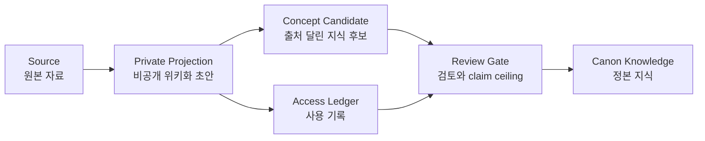
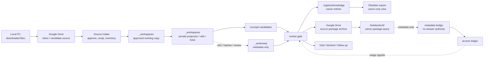

# Knowledge Wiki Worldview v0

## 한 줄 요약

Soulforge의 wiki는 "파일을 그냥 저장하는 창고"가 아니라, 출처가 확인된 자료를 private 작업장에서 읽고 정리한 뒤, 검토를 통과한 지식만 정본으로 승격하는 지식 운영 체계다.

## 왜 만들었나

팀원이 자료를 많이 모아도, 나중에 LLM이나 사람이 다시 쓰려면 세 가지 문제가 생긴다.

1. 원본 파일이 어디서 왔는지 모르면 믿을 수 없다.
2. PDF나 ZIP을 그대로 쌓아두면 매번 다시 열어야 해서 느리고 비싸다.
3. LLM이 요약한 내용을 바로 정본으로 믿으면 틀린 지식이 퍼질 수 있다.

그래서 Soulforge wiki는 원본, 해석, 후보, 정본을 분리한다.

## 세계관

### Source

원본 자료다. PDF, 표준 문서, 공식 문서, 사용자가 승인한 로컬 파일, 압축을 푼 ZIP 내용물 등이 여기에 해당한다.

원칙은 단순하다.

- ZIP 파일 자체를 지식으로 보관하지 않는다.
- ZIP은 풀어서 파일 목록과 해제본을 사용한다.
- 원본의 진실성은 source packet이나 owner-held source가 가진다.

### Private Projection

카파시식 wiki화의 핵심이다.

PDF 안의 내용을 LLM이 바로 정본으로 박아 넣는 것이 아니라, private 작업장에 "출처 기반 투영물"을 만든다. 여기에는 보통 이런 산출물이 생긴다.

- source별 projection markdown
- 전체 index
- 작업 log
- 질문별 흡수 노트
- contradiction/gap lint

이 단계의 목적은 토큰을 아끼고, 반복해서 찾기 쉽게 만들고, 다음 검토가 가능한 형태로 바꾸는 것이다.

### Concept Candidate

projection에서 바로 지식을 확정하지 않는다. 대신 "이건 지식 후보로 볼 수 있다"는 작은 단위로 나눈다.

좋은 후보는 최소한 다음을 가진다.

- 어떤 source에서 왔는지
- 어떤 범위에서만 맞는지
- 아직 부족한 근거가 무엇인지
- public으로 올려도 되는지

### Review Gate

검토 단계다. 여기서 claim ceiling을 정한다.

claim ceiling은 "이 지식이 지금 어디까지 말할 수 있는가"를 뜻한다.

| 상태 | 의미 |
| --- | --- |
| `observed` | 발견은 했지만 아직 후보 수준 |
| `source_supported` | 승인된 source가 특정 범위의 주장을 뒷받침 |
| `validated_private` | private workflow나 review를 통과 |
| `canon_candidate` | 정본 승격 후보 |
| `canon_entry` | 정본 등록 완료 |
| `rejected_or_blocked` | 근거, 경계, owner 판단이 부족 |

### Canon Knowledge

진짜 정본 지식이다. 여기 들어간 항목만 반복 사용 가능한 공유 지식으로 본다.

현재 공개 정본 지식은 `.registry/knowledge/**` 아래에 있고, PDF 위키화 실험 결과는 아직 여기에 들어가지 않았다.

### Access Ledger

어떤 지식이나 문서가 실제 작업에 쓰였는지 남기는 metadata-only 기록이다.

이 기록은 중요하지만, 그 자체가 지식의 진실성을 증명하지는 않는다. "많이 쓰였다"는 신호일 뿐, 맞다는 증거는 아니다.

## 공간 지도

Soulforge wiki는 하나의 폴더나 하나의 앱에만 있지 않다. 역할이 다른 여러 공간을 연결해서 쓴다.

| 공간 | 무엇이 쌓이나 | 어떻게 활용하나 | 주의점 |
| --- | --- | --- | --- |
| 로컬 PC / Desktop / Downloads | 사용자가 받은 원본 파일, 임시 다운로드, 압축 파일 | source intake의 출발점. 필요한 파일만 승인된 작업장으로 가져간다. | 여기는 정본 저장소가 아니다. ZIP은 풀어서 inventory와 해제본으로 넘긴다. |
| OneDrive / owner-approved shared worksite | 여러 PC가 함께 편집하는 active project 파일과 산출물 | 현재 문서, 사진, 영상, 측정 로그, 편집 가능한 deliverable을 공유한다. | 지식 source warehouse나 정본 owner가 아니다. sync 또는 읽기 성공은 승인 근거가 아니다. |
| 회사 NAS | 회사 owner가 보유한 외부 원본 | 승인된 작업에서 필요한 원본을 읽는 외부 source surface다. | Soulforge 기본 자세는 read-only다. 접근 가능하다는 사실만으로 수정, 자동 ingest, Drive 업로드, source 승인, 정본 승격 권한이 생기지 않는다. |
| Soulforge `_workspaces/**` | 승인된 working copy, extracted text, private projection/wiki 본문, RAG payload, generated view | 실제 카파시식 데이터 작업장. source를 읽고 projection, lint, candidate payload를 만든다. | 작업·파생 runtime surface다. 여기에 있다는 이유만으로 승인 지식이나 정본이 되지 않는다. |
| Soulforge `_workmeta/**` | ref, hash, provenance, approval/review, binding, claim ceiling, ontology candidate | source와 `_workspaces` 산출물의 metadata-only 장서목록과 판단 증거를 남긴다. | source, extracted text, chunk, projection/wiki 본문, generated answer payload를 저장하지 않는다. metadata 기록 자체도 승인이 아니다. |
| Soulforge `.workflow/**` | 반복 가능한 workflow 규칙, 템플릿, claim boundary | "어떻게 처리할지"를 저장한다. PDF 내용 자체가 아니라 실행 절차를 가진다. | workflow는 원문 지식을 담는 곳이 아니다. |
| Soulforge `.party/**` | 여러 workflow를 묶은 실행 체인 | `knowledge_wiki_cell`처럼 "이 순서대로 처리해"라는 상위 호출 단위다. | 모델/강도/직업/종족/unit 최적화는 각 workflow가 가진다. |
| Soulforge `.registry/knowledge/**` | 검토를 통과한 정본 지식 | 반복 사용 가능한 공유 지식. 팀원이 믿고 참조할 수 있는 최종 지식 표면이다. | private projection이나 LLM 요약이 자동으로 들어오지 않는다. |
| Google Drive | 처음 받은 지식화 후보, owner-held source, source package, 보관본 | durable source warehouse이자 cross-PC source archive다. "이 자료 지식화해줘"라고 들어오면 Drive inbox/candidate 영역에 맡겨두고 다시 찾을 수 있게 한다. | 폴더 위치, `CANON` 라벨, connector 표시/읽기 성공은 source 승인, source truth, 정본을 뜻하지 않는다. `_workmeta`의 승인·검토 근거가 따로 필요하다. |
| NotebookLM | 승인 근거가 기록된 source package를 올려 질문하는 source-grounded 질의 공간 | 승인된 source set을 먼저 물어보는 주 사용 인터페이스로 쓴다. 업로드 자료를 내려받을 수 있어도 주 역할은 보관소가 아니라 질의/호출면이다. | NotebookLM은 백업 저장소, 정본 승인자, source truth가 아니다. |
| Obsidian vault/export | 정본 wiki entry만 모은 읽기 전용 markdown view | 사람이 지식만 훑어보는 로컬 viewer로 쓴다. 후보나 raw evidence는 보이지 않게 한다. | Obsidian vault가 canon owner가 되면 안 된다. canon에서 생성된 view/export여야 한다. |
| knowledge access ledger | 어떤 ref를 읽고 썼는지에 대한 metadata-only 기록 | 많이 쓰이는 지식, 다시 볼 후보, 연결 강도를 나중에 분석한다. | 내용 복사 금지. 사용 기록은 진실성 증명이 아니다. |

Google Drive는 durable source warehouse와 cross-PC source archive로 쓴다. 후보와 승인된 source를 함께 보관할 수 있으므로 `inbox`, `candidate_source`, `reviewed_source`, `source_package`, `obsolete_or_blocked` 같은 폴더, 라벨, manifest로 상태를 나눈다. 이런 placement 표시는 분류 편의일 뿐 승인이나 정본 권한이 아니다.

사용자가 "이 자료를 지식화해줘"라고 주면 첫 보관 위치는 Drive의 `inbox` 또는 `candidate_source`가 된다. 그다음 승인된 파일만 `_workspaces` 또는 owner-approved shared worksite에서 읽고 카파시식 projection을 만든다. `_workmeta`에는 source와 산출물의 ref, hash, 승인·검토 상태, binding만 남긴다.

Obsidian은 별도 폴더가 있는 편이 좋다. 다만 이 폴더는 원본 작업장이 아니라 `.registry/knowledge`나 승인된 canon package에서 생성된 읽기 전용 export여야 한다. 이름은 예를 들어 `obsidian_export`나 `knowledge_view`가 좋고, top-level 정본 root로 만들지는 않는다.

## Obsidian 적용 결정 v0

이번 기준에서 Obsidian은 "정본 wiki를 훑어보는 generated read-only view"로 고정한다.

- 기본 vault 위치는 path-identity controlled system view 아래 `_workspaces/system/knowledge_view/obsidian_export/` 로 둔다.
- 이 위치는 repo 안에 있지만 `_workspaces` 이므로 runtime output surface다. public canon root나 tracked top-level owner surface로 승격하지 않는다. PC-local vault 실험은 `_workspaces/_local/<node_id>/system/knowledge_view/obsidian_export/` 로 분리한다.
- Drive-synced 폴더를 기본 vault 위치로 두지 않는다. Drive는 owner-held source warehouse이고, Obsidian vault가 Drive에 직접 붙으면 Drive가 사실상의 owner처럼 보일 위험이 있다.
- Obsidian note의 소스는 `.registry/knowledge/**` 와 owner가 승인한 canon package metadata로 제한한다.
- 후보 packet, raw source, private projection payload, NotebookLM answer, owner-only review note는 vault 본문에 보이지 않게 한다.

보여도 되는 것과 보이면 안 되는 것을 나누면 다음과 같다.

- 보여도 되는 것: `knowledge_id`, title, summary, canon source ref, claim ceiling, canon package/Drive/NotebookLM/workmeta의 metadata-only ref, canon-to-canon wikilink
- 보이면 안 되는 것: raw PDF/HWP/HWPX text, private projection 문단, private/local payload 경로, NotebookLM 답변 전문, candidate_source/working_packet 본문, 미승격 owner decision 메모

노트 생성 규칙은 아래처럼 둔다.

- 파일명: `<knowledge_id>.md`
- 기본 링크 형식: `[[<knowledge_id>]]`
- 사람 수동 편집: 허용하지 않는다. regenerate-only read view로 둔다.
- frontmatter 필수 필드: `knowledge_id`, `title`, `generated: true`, `read_only: true`, `canon_source_refs`, `claim_ceiling`, `owner_surface`, `generated_at`
- Drive ref / NotebookLM ref / workmeta ref는 본문 authority가 아니라 metadata 섹션에서만 짧게 연결한다.

검증 규칙도 같이 둔다.

- Obsidian export는 `.registry/knowledge` 또는 승인된 canon package 없이 생성하지 않는다.
- generated note body는 canon entry에서만 파생되어야 하며 `_workmeta` metadata ref를 따라 private payload를 읽어 채우면 안 된다.
- Obsidian export가 최신 정본보다 앞서 수정되었거나 사람이 손으로 바뀌었다면 canon owner가 아니라 drift/regen-needed 상태로 본다.
- export 존재만으로 canon, source truth, owner approval, NotebookLM truth를 주장하지 않는다.

## 공간 흐름

쉽게 말하면, active 편집 파일은 OneDrive 같은 shared worksite가, 회사 외부 원본은 기본 read-only NAS가, durable source 보관은 Google Drive가 맡는다. 실제 카파시식 payload 작업은 `_workspaces`에서 하고 `_workmeta`에는 metadata-only 근거만 남긴다. NotebookLM/RAG/Obsidian/graph는 advisory 또는 derived view이며, 정본 지식은 `.registry/knowledge`만 소유한다.

## 운영 방식

지식 작업은 보통 다음 순서로 간다.

1. 자료를 모은다.
2. 원본 파일을 Google Drive `inbox`나 `candidate_source`에 먼저 보관한다.
3. 원본과 출처 상태를 확인한다.
4. ZIP은 압축을 풀고 inventory를 만든다.
5. 승인된 파일만 `_workspaces` 또는 owner-approved shared worksite에서 읽어 private projection을 만들고, `_workmeta`에는 ref/hash/승인·검토 metadata만 기록한다.
6. projection에서 concept candidate를 뽑는다.
7. contradiction, gap, claim ceiling을 검토한다.
8. 승인된 source package를 Google Drive source warehouse에 보관한다.
9. 필요한 것만 정본 후보로 올린다.
10. owner나 review gate가 승인하면 정본에 등록한다.

등록 시점 규칙도 같이 적용한다.

- 후보 기준을 통과하면 후보, 메타데이터, sourcebound 검토, follow-up, owner-decision 표면에 같은 작업 안에서 등록한다.
- 정본 기준을 통과하면 `.registry/knowledge/**` 또는 해당 owner의 canon/package 표면에 같은 작업 안에서 등록한다.
- 통과한 기준이 있는데도 막연히 "나중에"로 미루지 않는다. 보류하려면 owner hold, owner surface 불명확, validator 차단, public/private 경계 위험 같은 구체적인 이유를 남긴다.
- 5문항 지식 트리거 통과는 후보 등록 기준이지, 그 자체로 공개 정본 등록 기준은 아니다.

## 지금 만들어진 호출 경로

현재 caller-facing 지식 ingest, audit, wiki/RAG 등록은 설치된 Codex launcher
`$soulforge-knowledge-ingest-cell-launcher`에서 시작하고, 기본 composite는
`knowledge_ingest_pipeline_v0`이다. 요청 범위에 따라 audit, wiki/RAG 준비,
owner-decision, review 지원 route를 붙인다.

기존 `knowledge_wiki_cell` 체인은 아래 workflow를 연결하는 optional/narrow
wiki route로 남는다. 기본 caller route나 별도 authority owner가 아니다.
현재 sourcebound draft binding은 projection payload를 `_workmeta` 아래에 두는
구형 계약이므로, `_workspaces` payload + `_workmeta` metadata-only refs로
이행되기 전에는 payload-producing 실행을 중단한다.

| 순서 | Workflow | 역할 |
| --- | --- | --- |
| 1 | `official_source_packet_collect_v0` | 자료와 출처 상태 확인 |
| 2 | `sourcebound_knowledge_packet_operating_loop_v0` | 카파시식 private projection과 후보화 |
| 3 | `knowledge_access_event_capture_v0` | 지식 사용 기록과 연결 신호 정리 |
| 4 | `post_development_review_gate_v0` | 경계, claim ceiling, 승격 가능성 검토 |

중요한 운영 규칙은 하나다.

2026-06-18 route update: caller-facing knowledge ingest, audit, wiki/RAG
registration now starts from the installed Codex launcher
`$soulforge-knowledge-ingest-cell-launcher`, which defaults to the registered
`knowledge_ingest_pipeline_v0` composite. The older
LLM/wiki workflows (`workflow_knowledge_preflight_v0`,
`monster_knowledge_preflight_v0`, `knowledge_candidate_triage_v0`,
`wiki_curation_maintenance_v0`, `llm_wiki_builder_v0`) and the RAG source-text
support workflows (`rag_source_text_quality_review_v0`,
`rag_work_card_router_v0`) are optional compatibility/narrow routes. They do not
grant source truth, answer authority, owner approval, public canon promotion,
default-route authority, or production-ready status.

각 route의 실행 전략과 모델 선택은 해당 workflow/party 계약이 가진다. 어떤 실행 전략도 source truth, 승인, 정본 승격 권한을 추가하지 않는다.

Drive 보관은 별도 정본 승인 단계가 아니라 이 체인을 둘러싼 파일 수명주기다. 처음 받은 후보/source는 intake 쪽 archive manifest에, 승인된 source package는 sourcebound/pipeline 쪽 archive manifest에 기록한다. archive policy가 `codex_skill_auto_sync`이면 승인된 Codex skill이나 Google Drive connector가 정해진 보관 범위에서 동기화할 수 있다. 그래도 connector 표시, 읽기, 복사, 동기화 권한은 source 승인, 정본 승인, secret/private 경계 우회 권한이 아니다.

## 지금 어디까지 개발되었나

완료된 것:

- 지식 운영 모델 문서가 있다.
- metadata-only knowledge access ledger helper가 있다.
- sourcebound knowledge packet workflow가 있다.
- knowledge access event capture workflow가 있다.
- post-development review gate가 있다.
- `$soulforge-knowledge-ingest-cell-launcher`가 `knowledge_ingest_pipeline_v0` 기본 route를 제공한다.
- `knowledge_wiki_cell` party가 등록되었다.
- `knowledge_wiki_cell`은 subagent 기반 smoke run을 통과했다.
- 이전 PDF 샘플들은 private sourcebound sandbox로 만들어진 적이 있다.

아직 아닌 것:

- PDF 내용이 자동으로 정본 지식이 되는 것은 아니다.
- SE 자료 전체가 아직 실제 wiki projection으로 완성된 것은 아니다.
- private projection이 public wiki나 `.registry/knowledge`에 승격된 것은 아니다.
- NotebookLM이나 LLM 답변은 정본 승인 권한이 아니다.
- access ledger의 사용 횟수는 지식의 진실성을 보장하지 않는다.

## 현재 지식 등록 상태

현재 공개 정본 지식은 소수의 기본 지식만 들어 있다.

- `boundary_governance`
- `escort_etiquette`
- `frontline_doctrine`
- `lineage_method`
- `source_criticism`

PDF에서 나온 projection은 private sandbox 상태다. 즉, "읽고 정리한 비공개 작업물"이지, "공유 정본 지식"은 아니다.

## 앞으로 할 일

다음 단계는 SE 자료를 `$soulforge-knowledge-ingest-cell-launcher`의 기본
`knowledge_ingest_pipeline_v0` route로 돌리고, 필요한 경우에만 기존
`knowledge_wiki_cell` narrow route를 붙이는 것이다.

목표는 다음과 같다.

1. SE 자료 source packet을 정리한다.
2. PDF 내부 내용을 private projection으로 만든다.
3. projection에서 page/source-cited concept candidate를 뽑는다.
4. figure, table, formula처럼 LLM 텍스트 추출만으로 약한 부분을 gap으로 표시한다.
5. review gate에서 claim ceiling을 정한다.
6. 팀원이 같이 볼 수 있는 public-safe 요약과 private wiki 본문을 분리한다.
7. 반복해서 쓸 가치가 있는 것은 정본 후보로 올리고, 정본 기준까지 통과하면 같은 작업에서 정본 등록까지 닫는다.

## 팀원이 기억하면 되는 것

- 파일 보관이 목적이 아니다. 다시 쓸 수 있는 지식으로 바꾸는 것이 목적이다.
- LLM 요약은 정본이 아니다. source와 review를 거쳐야 한다.
- private projection은 작업용 지도다. canon knowledge는 검토된 공유 지식이다.
- ZIP은 풀어서 쓴다. 압축파일 자체를 지식 단위로 삼지 않는다.
- 지식 ingest는 `$soulforge-knowledge-ingest-cell-launcher`에서 시작하고, `knowledge_wiki_cell`은 필요한 경우에만 쓰는 좁은 호환 route다.
