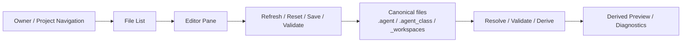

# UI Control Center Model

## 목적

- 이 문서는 Soulforge UI를 file-based control center 로 확장할 때의 구조 기준을 고정한다.
- 목표는 read-only renderer 를 버리는 것이 아니라, 정본 파일을 직접 탐색하고 수정하고 저장할 수 있는 상위 control center 를 정의하는 것이다.
- 이 문서는 스킨이나 시각 스타일이 아니라 정보 구조, 편집 경계, 저장 규칙, 파일 분류를 다룬다.

## 왜 필요한가

- 현재 renderer v1 은 `derive-ui-state --json` 또는 fixture 를 읽는 read-only consumer 다.
- 실제 운영에서는 `.agent`, `.agent_class`, `_workspaces` 아래의 정본 파일을 사람이 읽고 수정하고 다시 저장하는 흐름이 필요하다.
- Soulforge 의 UI 는 상태판을 넘어서 "정본 파일 control center" 로 올라가야 한다.
- 글이 잘 보이는 넓은 편집 영역, 명시적인 `Refresh`, `Reset`, `Save`, `Validate` 액션, owner/file 단위 탐색 구조가 필요하다.

## 핵심 원칙

1. UI는 여전히 정본 자체가 아니라 정본 파일의 편집 surface 다.
2. 파생 파일과 정본 파일을 같은 급의 editable file 로 취급하지 않는다.
3. owner 경계인 `.agent`, `.agent_class`, `_workspaces` 를 좌측 탐색 구조에서 그대로 드러낸다.
4. 파일 수정은 명시적 `Save` 액션으로만 반영한다.
5. 저장 전후 상태와 검증 결과를 UI 안에서 바로 확인할 수 있어야 한다.
6. 큰 텍스트를 읽고 수정하는 흐름이 우선이며, 카드형 요약보다 에디터 가독성이 앞선다.

## 구조 개요도

## 화면 구조

### 1. 좌측 owner 탐색

최상위 선택은 최소한 아래 네 묶음을 가진다.

- `Body` = `.agent`
- `Class` = `.agent_class`
- `Workspaces` = `_workspaces`
- `Docs / Diagnostics` = root 문서와 검증 결과

이 영역은 "무슨 축을 보고 있는가"를 고정한다.
현재 Soulforge 의 정본 경계를 그대로 UI navigation 에 반영한다.

### 2. 파일 목록 영역

owner 를 선택하면 그 아래 실제 편집 가능한 파일 후보를 나열한다.

예시:

- `.agent`
  - `body.yaml`
  - `identity/hero_imprint.yaml`
  - `identity/identity_manifest.yaml`
  - `registry/active_class_binding.yaml`
- `.agent_class`
  - `class.yaml`
  - `loadout.yaml`
  - `profiles/*.yaml`
  - `**/module.yaml`
- `_workspaces/<project>/.project_agent`
  - `contract.yaml`
  - `capsule_bindings.yaml`
  - `workflow_bindings.yaml`
  - `local_state_map.yaml`

파일 목록은 "편집 가능한 정본"과 "읽기 전용 보조 파일"을 구분해 보여야 한다.

### 3. 우측 편집 영역

- 가장 넓은 영역은 실제 파일 내용을 읽고 수정하는 텍스트 에디터다.
- 현재 선택한 파일의 경로, 소유 owner, dirty 상태, 마지막 반영 상태를 헤더에 표시한다.
- 가독성이 우선이므로 요약 카드보다 텍스트 공간을 넓게 둔다.
- markdown, yaml, json 같은 문서/메타 파일을 우선 지원한다.

## 액션 모델

### `Refresh`

- 디스크 기준으로 현재 파일과 파일 목록을 다시 읽는다.
- 외부에서 변경된 내용을 UI 버퍼에 반영한다.
- dirty 상태가 있으면 바로 덮어쓰지 않고 사용자의 확인을 요구할 수 있다.

### `Reset`

- 현재 에디터 버퍼를 버리고 마지막 디스크 상태로 되돌린다.
- 저장되지 않은 수정만 취소한다.
- 파생 상태를 되감는 기능이 아니라 현재 파일 버퍼 재설정 기능이다.

### `Save`

- 현재 선택한 파일만 저장한다.
- 저장은 명시적 액션이며 자동 저장을 기본값으로 두지 않는다.
- 저장 성공 후 해당 owner 또는 project 범위의 validate / derive 후속 액션을 제안할 수 있다.

### `Validate`

- 저장 후 관련 검증 명령을 실행해 결과를 diagnostics surface 에 반영한다.
- 예시:
  - `.agent` 관련 변경 후 `sync-body-state --check`
  - `.agent_class` 또는 `_workspaces` 변경 후 `validate`
  - 필요 시 `derive-ui-state --json`

### `Preview`

- preview 는 편집 그 자체가 아니라 저장 후 결과를 확인하는 보조 surface 다.
- read-only renderer 는 control center 아래의 preview tab 또는 split pane 으로 재배치할 수 있다.

## 파일 분류 규칙

### 편집 가능

- 사람이 소유하고 의미를 직접 결정하는 canonical source 파일
- 예시:
  - `.agent/body.yaml`
  - `.agent/identity/*.yaml`
  - `.agent/registry/*.yaml`
  - `.agent_class/class.yaml`
  - `.agent_class/loadout.yaml`
  - `.agent_class/**/module.yaml`
  - `_workspaces/**/.project_agent/*.yaml`

### 기본 읽기 전용

- 구조와 메타에서 재생성 가능한 파일
- 파생 결과
- 회귀 검증 fixture
- archive 문서

예시:

- `.agent/body_state.yaml`
- `derive-ui-state --json` 결과물
- `ui-workspace/fixtures/**`
- `docs/architecture/archive/**`

### 읽기 전용 + 별도 액션

- 일부 파일은 직접 편집보다 regenerate 가 더 자연스럽다.
- 예시:
  - `.agent/body_state.yaml`
  - generated diagnostics snapshot

이 경우 UI는 `Save` 대신 `Regenerate` 또는 `Rebuild` 액션을 제공할 수 있다.

## read-only renderer 와의 관계

현재 renderer v1 의 위치는 유지하되 역할은 바뀐다.

- 현재:
  - renderer = read-only main surface
- 목표:
  - control center = 상위 shell
  - renderer = 저장 후 결과를 확인하는 preview surface

즉, `ui-workspace/docs/UI_RENDERER_MODEL.md` 의 read-only renderer 는 폐기 대상이 아니라 control center 아래의 preview 하위계층으로 내려간다.

## owner 경계와 권한

- `.agent` 편집은 body owner 관점에서 보여준다.
- `.agent_class` 편집은 class owner 관점에서 보여준다.
- `_workspaces` 편집은 project owner 관점에서 보여준다.
- 서로 다른 owner 의 파일을 한 화면에서 비교할 수는 있어도, 저장은 항상 "현재 파일 1개" 기준으로 처리한다.

이 규칙은 UI 가 owner 경계를 흐리지 않게 한다.

## manual 친화성 요구

- 파일명이 먼저 보이고, 실제 경로가 함께 보여야 한다.
- 큰 문서를 읽을 수 있도록 우측 편집 영역을 넓게 유지한다.
- 탭이나 카드보다 파일 자체의 본문이 중심이 된다.
- markdown 문서는 미리보기보다 source 읽기가 우선이다.
- yaml/json 은 구조가 망가지지 않도록 monospace 와 라인 기준 탐색이 가능해야 한다.

## non-goals

- 자동으로 정본을 고쳐 주는 hidden mutation
- 파생 파일을 정본처럼 직접 수정하는 흐름
- workflow 실행 control-plane 과 runtime orchestration 통합
- 스킨/테마 구현 세부를 이 문서에서 먼저 결정하는 일

## 단계 제안

1. file tree / editor / action bar 구조를 먼저 고정한다.
2. editable vs read-only 파일 분류를 owner 문서와 맞춘다.
3. 저장 후 validate / derive 연결을 붙인다.
4. 마지막에 preview surface 와 visual skin 을 결합한다.

## 관련 문서

- [`UI_SOURCE_MAP.md`](./UI_SOURCE_MAP.md)
- [`UI_SYNC_CONTRACT.md`](./UI_SYNC_CONTRACT.md)
- [`UI_DERIVED_STATE_CONTRACT.md`](./UI_DERIVED_STATE_CONTRACT.md)
- [`../../../ui-workspace/docs/UI_RENDERER_MODEL.md`](../../../ui-workspace/docs/UI_RENDERER_MODEL.md)
