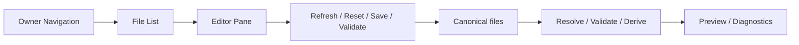

# UI Control Center Model

## 목적

- 이 문서는 Soulforge UI를 file-based control center 로 확장할 때의 구조 기준을 고정한다.
- control center 는 정본 파일을 owner 경계별로 탐색하고 읽고 저장하고 검증하는 상위 shell 이다.

## 핵심 원칙

1. UI는 정본 파일의 편집 surface 다.
2. derived preview 는 보조 surface 다.
3. owner 경계는 `.registry`, `.unit`, `.workflow`, `.party`, `_workspaces` 기준을 따른다.
4. 저장은 파일 단위 명시 액션으로만 수행한다.
5. local-only `_workspaces/<project_code>` 는 opt-in surface 로만 다룬다.

## 구조 개요도

## owner navigation

control center 는 아래 네 묶음으로 owner 파일을 탐색한다.

- `Identity / Unit` = `.registry/species` + `.unit`
- `Catalogs` = `.registry/classes` + `.workflow` + `.party`
- `Workspaces` = `_workspaces`
- `Docs / Diagnostics` = root 문서와 검증 결과

이 grouping 은 탐색 편의를 위한 navigation 구성이고 source owner 자체를 바꾸지 않는다.

## 파일 목록 기준

- `Identity / Unit`
  - `.registry/README.md`
  - `.registry/index.yaml`
  - `.registry/species/**`
  - `.unit/README.md`
  - `.unit/**/unit.yaml`
- `Catalogs`
  - `.registry/classes/README.md`
  - `.registry/classes/**`
  - `.workflow/README.md`
  - `.workflow/**`
  - `.party/README.md`
  - `.party/**`
- `Workspaces`
  - `_workspaces/README.md`
  - opt-in local-only `_workspaces/<project_code>/.project_agent/**`

## 파일 분류 규칙

### 편집 가능

- owner 의미를 직접 결정하는 canonical source 파일
- 예:
  - `.registry/index.yaml`
  - `.unit/**/unit.yaml`
  - `.registry/classes/**/class.yaml`
  - `.workflow/**/workflow.yaml`
  - `.party/**/party.yaml`
  - `_workspaces/<project_code>/.project_agent/contract.yaml`

### 기본 읽기 전용

- archive 문서
- fixture
- derived payload
- local-only reserved dirs

## validate / preview 연결

- owner root 변경 후 `validate`
- 필요 시 `derive-ui-state --json`
- local-only workspace 확인이 필요할 때만 `--local-workspaces`

## non-goals

- hidden auto-mutation
- local-only run truth 를 public UI fixture 에 노출
