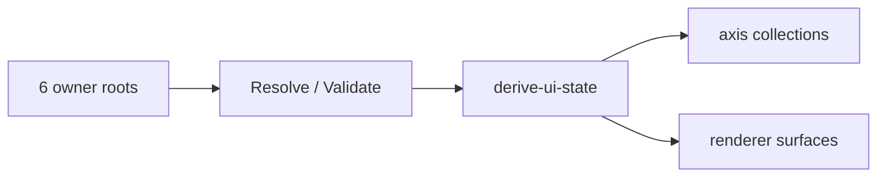

# UI 파생 상태 계약

## 목적

이 문서는 `derive-ui-state --json` 이 생성하는 파생 상태 JSON 구조를 저장소 전체 관점에서 고정한다.
이 계약은 6축 source 요약과 renderer surface 를 함께 포함하는 출력 구조를 정의한다.

## 관계도

## 1. 공통 원칙

- derived state 는 `UI_SOURCE_MAP.md`, `UI_SYNC_CONTRACT.md`, 각 owner 계약 문서를 따른다.
- derived state 는 renderer 와 control center 가 읽는 소비층 입력이다.
- derive 단계는 tracked file 을 새로 쓰지 않는다.
- derive 단계는 resolve 가 성공한 범위 안에서 partial output 을 반환할 수 있다.
- validate FAIL 이 있어도 `derive-ui-state --json` 은 가능한 범위의 partial output 을 반환할 수 있다.
- `invalid` 는 diagnostics 의 error 로 남는다.
- `unbound` 는 정상 상태 분류 결과이며 error 가 아니다.
- local workspace scan 은 opt-in 이다.

## 2. 최상위 derived state 구조

`derive-ui-state --json` 은 아래 top-level 키를 고정한다.

| 키 | 의미 |
| --- | --- |
| `schema_version` | 출력 계약 버전 |
| `generated_at` | payload 생성 시각 |
| `source` | producer / mode / adapter 메타 |
| `species` | `.registry/species` axis collection |
| `units` | `.unit` axis collection |
| `classes` | `.registry/classes` axis collection |
| `workflows` | `.workflow` axis collection |
| `parties` | `.party` axis collection |
| `workspaces` | `_workspaces` mount summary |
| `diagnostics` | warnings / errors |
| `ui_hints` | theme / layout / icon 힌트 |
| `overview` | renderer overview surface |
| `body` | renderer body surface |
| `class_view` | renderer class/workflow surface |
| `catalogs` | renderer read-only candidate surface |

`overview`, `body`, `class_view`, `catalogs` 는 renderer surface 로 함께 제공한다.

## 3. `source`

최소 필드:

- `producer`
- `mode`
- `adapter`
- `fixture_name`
- `notes`

`mode` 는 `fixture`, `integration`, `url` 중 하나를 사용한다.

## 4. axis collection

`species`, `units`, `classes`, `workflows`, `parties` 는 공통 구조를 따른다.

최소 필드:

- `root`
- `owner`
- `items`

각 `items[*]` 최소 필드:

- `id`
- `display_name`
- `summary`
- `source_ref`
- `status`

`species` axis 는 필요 시 `heroes` 목록을 추가로 포함할 수 있다.

## 5. `workspaces`

최소 필드:

- `root`
- `owner`
- `mode`
- `mount_status`
- `local_scan_enabled`
- `projects`
- `notes`

`projects[*]` 는 direct `<project_code>` detection 결과를 담는다.
추가 메타로 `project_code`, `project_name`, `project_path`, `state`, `workmeta_present`, binding count 등을 포함할 수 있다.

## 6. `diagnostics`

최소 필드:

- `summary.warnings`
- `summary.errors`
- `summary.highest_severity`
- `warnings[]`
- `errors[]`

각 diagnostics item 최소 필드:

- `code`
- `message`
- `severity`
- `location_hint`

`severity` 는 `warning` 또는 `error` 를 사용한다.

## 7. `ui_hints`

최소 필드:

- `theme`
- `phase`
- `default_tab`
- `layout.left_ratio`
- `layout.right_ratio`
- `layout.gutter_ratio`
- `material_hints`
- `icon_hints`

## 8. renderer surface

### `overview`

active species / hero / class / workspace counts 를 요약하는 surface 다.

최소 필드:

- `body_id`
- `class_id`
- `active_profile`
- `active_species`
- `active_hero`
- `sections_present.present`
- `sections_present.total`
- `installed_counts`
- `equipped_counts`
- `workspace_counts`
- `warnings`
- `errors`
- `overall_status`

### `body`

`.registry/species` 와 `.unit` owner 정보를 함께 읽는 unit-centric surface 다.

최소 필드:

- `meta`
- `active_species`
- `active_hero`
- `section_presence`
- `section_summaries`
- `current_bindings`

### `class_view`

`.registry/classes`, `.workflow`, `.party` 관계를 읽는 renderer surface 다.

최소 필드:

- `class_id`
- `class_name`
- `class_version`
- `active_profile`
- `rows.skills`
- `rows.tools`
- `rows.knowledge`
- `rows.workflows`

각 row item 최소 필드:

- `id`
- `display_name`
- `summary`
- `installed`
- `equipped`
- `active`
- `required`
- `preferred`
- `dependency_status`
- `family`
- `category`
- `source_ref`
- `source_hint`
- `catalog_ref`
- `selectable_candidate`

### `catalogs`

read-only candidate 목록을 담는 surface 다.

최소 필드:

- `identity.species_candidates`
- `identity.hero_candidates`
- `class.profiles_catalog`
- `class.skills_catalog`
- `class.tools_catalog`
- `class.knowledge_catalog`
- `class.workflows_catalog`

## 9. 상태/진단 규칙

- derived state 는 validate 결과를 반영해야 한다.
- `warnings` 와 `errors` 는 diagnostics summary 와 함께 유지한다.
- renderer 는 diagnostics summary 와 item 목록을 함께 사용한다.
- error 가 있어도 partial output 은 허용한다.

## 10. 확장 규칙

- 새 top-level key 를 추가할 때는 먼저 이 문서를 갱신한다.
- renderer 전용 시각 장식 값은 `ui_hints` 와 ui-workspace 문서에서 다룬다.
- project runtime readiness, scheduling, 실행 정책은 이 문서 범위가 아니다.
- 구현은 minimum field 를 깨지 않는 범위에서 추가 메타를 보존할 수 있다.
