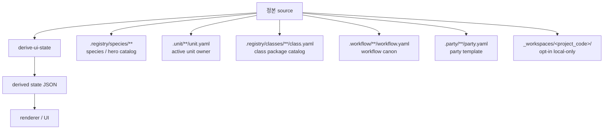

# UI source map

## 목적

- 이 문서는 Soulforge UI가 어떤 정본 root 에서 어떤 파생 상태를 얻는지 고정한다.
- renderer 와 control center 는 source map 을 참고하되, 실제 read surface 는 `derive-ui-state` 결과다.

## 핵심 원칙

- source 는 6축 정본 root 다.
- derived state 는 source 를 읽은 뒤 producer 가 계산한 결과다.
- renderer 는 source 를 직접 스캔하지 않는다.
- local-only workspace scan 은 opt-in 이며 public fixture 는 synthetic 만 사용한다.

## 구조 개요도

## source 와 derived state 구분

- source 는 owner root 와 local-only mount policy 에 있다.
- derived state 는 `derive-ui-state` 가 source 를 정리한 소비층 입력이다.
- renderer 는 6축 top-level payload 와 renderer surface 를 함께 소비한다.

## axis source map

| axis | 정본 source | 설명 |
| --- | --- | --- |
| `species` | `.registry/index.yaml`, `.registry/species/**` | species / hero catalog |
| `units` | `.unit/**/unit.yaml`, `.unit/**/{policy,protocols,runtime,memory,sessions,autonomic,artifacts}` | active unit owner surface |
| `classes` | `.registry/index.yaml`, `.registry/classes/**/class.yaml`, refs | reusable class / package catalog |
| `workflows` | `.workflow/index.yaml`, `.workflow/**/workflow.yaml`, related canon files | workflow canon + curated history |
| `parties` | `.party/index.yaml`, `.party/**/party.yaml`, related template files | reusable party template |
| `workspaces` | `_workspaces/README.md`, opt-in local-only `_workspaces/<project_code>/.project_agent/**` | local-only mission site mount view |

## renderer surface

- `overview` = active species/hero/class/workspace 요약 surface
- `body` = `.registry/species` 와 `.unit` 를 함께 읽는 unit-centric surface
- `class_view` = `.registry/classes`, `.workflow`, `.party` 를 함께 읽는 class/workflow surface
- `catalogs` = read-only candidate surface
- `workspaces` = local-only mount summary

renderer 탭은 이 surface 를 소비하고, source owner 의미는 6축 root 에서 직접 읽는다.

## 표현 기준

- `Installed / Equipped` 표시는 class / workflow surface 에서 계산한다.
- `Species / Hero` 표시는 `.registry/species` axis 에서 온다.
- `Workspace` 카드는 direct `<project_code>` detection 결과만 보여준다.
