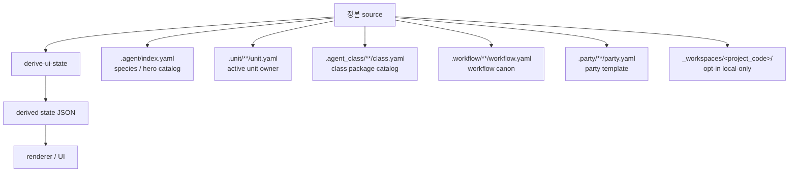

# UI source map

## 목적

- 이 문서는 Soulforge UI가 어떤 정본 root 에서 어떤 파생 상태를 얻는지 고정한다.
- renderer 와 control center 는 source map 을 참고하되, 실제 read surface 는 `derive-ui-state` 결과다.

## 핵심 원칙

- source 는 6축 정본 root 다.
- derived state 는 source 를 읽은 뒤 producer 가 계산한 결과다.
- renderer 는 source 를 직접 스캔하지 않는다.
- local-only workspace scan 은 opt-in 이며 public fixture 는 synthetic 만 사용한다.

## 구조 개요도

## source 와 derived state 구분

- source 는 owner root 와 local-only mount policy 에 있다.
- derived state 는 `derive-ui-state` 가 source 를 정리한 소비층 입력이다.
- current renderer 는 6축 top-level payload 와 compatibility projection 을 함께 소비한다.

## axis source map

| axis | 정본 source | 설명 |
| --- | --- | --- |
| `species` | `.agent/index.yaml`, `.agent/species/**` | species / hero catalog |
| `units` | `.unit/**/unit.yaml`, `.unit/**/{policy,protocols,runtime,memory,sessions,autonomic,artifacts}` | active unit owner surface |
| `classes` | `.agent_class/index.yaml`, `.agent_class/**/class.yaml`, refs, profiles, manifests | reusable class / package catalog |
| `workflows` | `.workflow/index.yaml`, `.workflow/**/workflow.yaml`, related canon files | workflow canon + curated history |
| `parties` | `.party/index.yaml`, `.party/**/party.yaml`, related template files | reusable party template |
| `workspaces` | `_workspaces/README.md`, opt-in local-only `_workspaces/<project_code>/.project_agent/**` | local-only mission site mount view |

## compatibility projection

- `overview` = 6축 요약 projection
- `body` = species / unit compatibility projection
- `class_view` = class / workflow compatibility projection
- `workspaces` = local-only mount summary

현재 renderer 탭은 이 compatibility projection 을 소비하지만, 정본 source 는 이미 6축으로 옮겨져 있다.

## 표현 기준

- `Installed / Equipped` 표시는 class / workflow compatibility projection 이다.
- `Species / Hero` 표시는 `.agent` axis 에서 온다.
- `Workspace` 카드는 direct `<project_code>` detection 결과만 보여준다.
- `company / personal` grouping 은 정본이 아니라 legacy bridge 였으며 더 이상 source map 에 포함하지 않는다.
