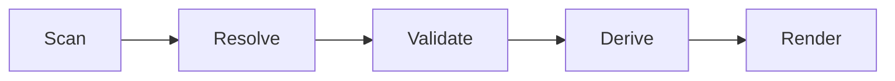

# UI 동기화 계약

## 목적

- 이 문서는 Soulforge UI가 어떤 정본을 어떤 순서로 읽고 파생해야 하는지 고정한다.
- current renderer 와 control center 는 모두 정본의 소비층이며, 정본을 대체하지 않는다.

## 기본 원칙

1. UI는 정본이 아니다.
2. 정본 owner root 는 `.agent`, `.unit`, `.agent_class`, `.workflow`, `.party`, `_workspaces` 다.
3. `derive-ui-state` 는 6축 top-level payload 를 우선하고, 현재 소비층을 위해 `overview`, `body`, `class_view` compatibility projection 을 함께 낸다.
4. `_workspaces/<project_code>/` 실자료 스캔은 기본 동작이 아니라 opt-in local smoke 다.

## 정본 계층

- `.agent/index.yaml`
- `.agent/species/**`
- `.unit/**/unit.yaml`
- `.agent_class/index.yaml`
- `.agent_class/**/class.yaml`
- `.workflow/index.yaml`
- `.workflow/**/workflow.yaml`
- `.party/index.yaml`
- `.party/**/party.yaml`
- `_workspaces/README.md`
- opt-in local-only `_workspaces/<project_code>/.project_agent/**`

## 생성 순서

- `Scan` = owner roots 와 local-only mount policy 를 읽는다.
- `Resolve` = catalog ref, unit binding, workflow/party compatibility 를 해석한다.
- `Validate` = owner root 최소 파일 세트와 cross-ref 를 검사한다.
- `Derive` = 6축 top-level payload 와 compatibility projection 을 계산한다.
- `Render` = derived state 를 소비한다.

## 현재 구현 범위

- `sync-body-state` = compatibility no-op
- `resolve-loadout` = compatibility alias
- `resolve-workspaces` = local-only mount inspector
- `validate` = 6축 owner root 최소 검증
- `derive-ui-state` = 6축 payload + compatibility projection
- renderer = `derive-ui-state --json` 소비자

## local-only workspace 규칙

- public repo 기본 모드는 `_workspaces/README.md` 만 기대한다.
- 실제 `_workspaces/<project_code>/` scan 은 `--local-workspaces` 가 있을 때만 수행한다.
- `--workspace-root` 또는 `SOULFORGE_LOCAL_WORKSPACE_ROOT` 로 private mount root 를 바꿀 수 있다.
- repo 내부 `_workspaces/` 를 scan 하면 legacy `company`, `personal` bridge 는 warning 후 skip 한다.

## 검증 규칙

1. `.agent/body.yaml`, `.agent/body_state.yaml`, `.agent_class/loadout.yaml`, `.agent_class/workflows` 는 더 이상 canonical requirement 가 아니다.
2. `.unit` 는 active binding owner surface 로 검사한다.
3. `.workflow/history` 는 curated summary only 여야 한다.
4. `.party/stats` 는 template-level observation only 여야 한다.
5. public fixture 는 actual project id, run id, analytics, reports, artifacts 를 포함하지 않는다.
6. `resolve-workspaces` 는 public-safe mode 에서 local-only project contract 깊이 검증을 강제하지 않는다.

## derive 규칙

1. `derive-ui-state` 는 `species`, `units`, `classes`, `workflows`, `parties`, `workspaces` top-level axis 를 낸다.
2. `overview`, `body`, `class_view` 는 renderer v1 compatibility projection 이다.
3. `workspaces.projects` 는 direct `<project_code>` detection 결과만 가진다.
4. `workspaces.local_scan_enabled = false` 인 fixture 는 synthetic public-safe baseline 이어야 한다.

## 트리거

- catalog root 변경
- unit owner 변경
- workflow / party canon 변경
- `_workspaces` local-only 정책 변경
- local smoke harness 변경

## 커밋 규칙

1. 정본 구조를 바꾸면 관련 UI contract 문서와 derive consumer 를 같은 변경 안에서 맞춘다.
2. 정본 owner vocabulary 와 UI consumer vocabulary 가 어긋난 상태로 두지 않는다.
3. local-only 정책을 바꾸면 `.gitignore`, `_workspaces/README.md`, guardrail check 를 같이 맞춘다.
