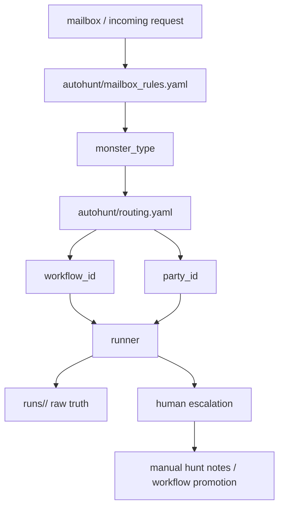

# Autohunt Model

## 목적

- 이 문서는 `.project_agent/autohunt/` 가 자동사냥 운영 계층으로 무엇을 소유하는지 고정한다.
- workflow, party, runner, mailbox routing 의 책임을 섞지 않는다.

## 한 줄 정의

- `autohunt/` 는 mail 또는 dispatch source 를 monster 로 분해하고, 그 monster 를 어떤 workflow 와 party 로 자동 처리할지 정하는 local operating policy surface 다.

## 관계도

## 책임

- `workflow` 는 절차와 step 순서를 소유한다.
- `party` 는 slot 과 unit composition 을 소유한다.
- `autohunt` 는 어떤 monster 를 어떤 workflow / party 로 자동 보낼지 소유한다.
- `runner` 는 workflow 와 party 를 읽어 실제 sub-agent execution 을 수행한다.
- raw truth 는 언제나 `runs/<run_id>/` 아래에 남긴다.

## 최소 파일

- `policy.yaml`
  - auto mode, retry, escalation, manual hunt capture policy
- `routing.yaml`
  - `monster_type -> workflow_id + party_id`
- `mailbox_rules.yaml`
  - mailbox input 을 어떤 monster type 으로 읽을지

## 초기 운영값

- `mode: supervised`
- known monster 는 자동 실행
- unknown monster 는 바로 human escalation
- 실패는 1회만 재시도
- manual hunt 기록은 남기되 자동 승격은 하지 않음

## tracked mirror 와 local runtime

- tracked sample 은 `docs/architecture/workspace/examples/<project_code>/.project_agent/autohunt/` 아래에 둔다.
- actual operating state, queue, pending monster, retry counter, local override 는 `_workspaces/<project_code>/.project_agent/autohunt/` 아래에만 둔다.

## 경계

- `autohunt/` 는 top-level canonical root 가 아니다.
- `autohunt/` 는 local operating layer 이며, tracked repo 에는 public-safe sample 과 문서만 둔다.
- host-local mailbox endpoint, secrets, queue snapshot, actual run dump 는 tracked sample 에 두지 않는다.
