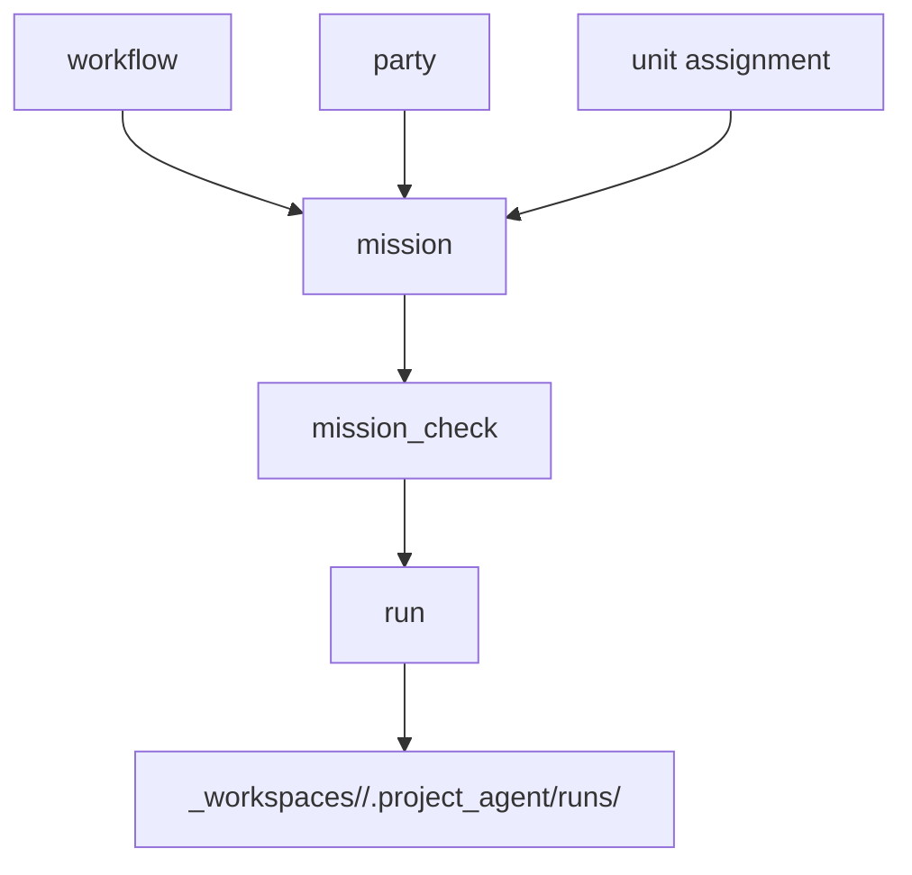

# Mission Manual Draft

## 목적

- 이 문서는 mission 을 사람이 어떻게 만들고, 검사하고, 실행하거나 자동 항목으로 올릴지에 대한 러프 매뉴얼 초안이다.
- 아직 draft 이며, current default lane 기준으로 적는다.

## mission 이란 무엇인가

- mission 은 이번 건을 실제로 어떻게 수행할지 정한 held execution plan 이다.
- workflow, party, unit assignment, readiness 상태를 함께 가진다.
- raw logs 나 private input dump 는 mission 이 아니라 project-local run truth 다.

## 핵심 구분

- `workflow` = reusable procedure canon
- `mission` = 이번 실행 계획
- `run` = 실제 실행 시도 기록

## current default lane

- workflow: [`author_skill_package`](/Users/seabotmoon-air/Workspace/Soulforge/.workflow/author_skill_package/workflow.yaml)
- party: [`guild_master_cell`](/Users/seabotmoon-air/Workspace/Soulforge/.party/guild_master_cell/party.yaml)
- unit: [`guild_master`](/Users/seabotmoon-air/Workspace/Soulforge/.unit/guild_master/unit.yaml)
- class: [`administrator`](/Users/seabotmoon-air/Workspace/Soulforge/.registry/classes/administrator/class.yaml)
- readiness skill: [`mission_check`](/Users/seabotmoon-air/Workspace/Soulforge/.registry/skills/mission_check/skill.yaml)

## 수동 mission 절차

1. 요청을 받는다.
2. 어떤 workflow 를 쓸지 정한다.
3. 어떤 party 와 unit assignment 를 쓸지 정한다.
4. `.mission/<mission_id>/` 아래에 held plan 을 만든다.
5. `mission_check` 로 readiness 를 본다.
6. `ready` 면 실행하거나 다음 운영층으로 넘긴다.
7. `blocked` 면 blocker owner 를 기준으로 보정한다.
8. 실제 실행 흔적은 `_workspaces/<project_code>/.project_agent/runs/<run_id>/` 아래에 남긴다.

## 자동 mission 절차

1. autohunt 또는 future nightly sweep 이 mission 후보를 만든다.
2. 길마 lane 이 `mission_check` 를 돌린다.
3. `ready` 면 runner/autohunt 가 실행한다.
4. `blocked` 면 길마에게 남기거나 다음 sweep 까지 보류한다.

## mission terminal / mission_close

- `skill` 종료와 `mission` 종료는 같은 뜻이 아니다.
- mission 내부 여러 skill 과 workflow step 이 끝나도, mission 전체 terminal 조건이 맞기 전에는 mission 을 닫지 않는다.
- current-default v0 에서 `mission terminal` 은 `required workflow steps done + mission-level battle_event persisted + no open blocker` 로 본다.
- mission 전체가 terminal 일 때만 mission-level `battle_event` 를 1건 persist 하고, 그 다음 `mission_close` 가 1회 호출된다.

## readiness 상태 해석

- `draft`
  - 아직 구성 중
- `blocked`
  - 현재 기준으로 보정 없이는 다음 단계로 넘기지 않음
- `ready`
  - 실행 직전 preflight 만 남음
- `running`
  - 하나 이상의 run 이 진행 중
- `completed`
  - release-ready or mission-closed 상태
- `failed`
  - run 결과상 실패, 혹은 보정 없이 닫힌 실패

## blocked 를 다루는 법

- blocker 가 mission surface 에 있으면 `.mission/<mission_id>/` 를 고친다.
- blocker 가 canon 에 있으면 `.workflow`, `.party`, `.unit`, `.registry` owner 에서 고친다.
- blocker 가 local runtime 에 있으면 `_workspaces/.../.project_agent/` owner 에서 고친다.
- blocker 가 historical sample mismatch 라면 notes 와 review report 로 남긴다.

## sample mission 읽는 법

### completed sample

- [`author_pptx_autofill_conversion_001`](/Users/seabotmoon-air/Workspace/Soulforge/.mission/author_pptx_autofill_conversion_001/mission.yaml)
- 현재 lane 기준 artifact split 을 갖춘 completed sample 이다.

### blocked sample

- [`author_hwpx_document_001`](/Users/seabotmoon-air/Workspace/Soulforge/.mission/author_hwpx_document_001/mission.yaml)
- 실제 smoke-backed success 는 있었지만, 최신 mission artifact split 기준이 부족한 historical blocked sample 이다.

## 앞으로 정식 매뉴얼로 승격할 후보

- mission 생성 템플릿
- mission readiness checker 규칙
- autohunt/nightly sweep 과 mission 의 연결 규약
- blocked mission 보정 플레이북
