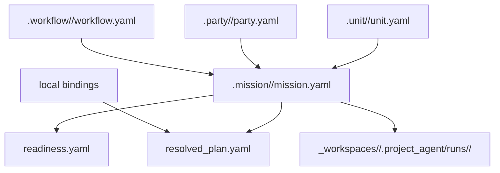

# Mission Model

## 목적

- `.mission/` 과 `_workspaces/` 의 owner 경계를 분리한다.
- workflow 절차 canon, party template, held mission plan, project-local run truth 의 관계를 고정한다.

## 구조 개요도



## 핵심 구분

- `workflow` = reusable 절차 canon
- `party` = reusable 팀 조합 template
- `mission` = 현재 들고 있는 실제 실행 계획
- `run` = project-local worksite 에 남는 실제 실행 시도 기록

## `.mission/` 최소 shape

```text
.mission/
├── index.yaml
└── <mission_id>/
    ├── mission.yaml
    ├── readiness.yaml
    ├── dispatch_request.yaml
    ├── resolved_plan.yaml
    ├── reports/
    └── artifacts/
```

## sample mission

```text
.mission/
└── author_pptx_autofill_conversion_001/
    ├── mission.yaml
    ├── readiness.yaml
    ├── dispatch_request.yaml
    ├── resolved_plan.yaml
    ├── reports/
    └── artifacts/
```

## owner 규칙

- `.mission/<mission_id>/mission.yaml` 은 `workflow_id`, `party_id`, `project_code`, `unit_assignments` 같은 held mission metadata 를 소유한다.
- `.mission/<mission_id>/mission.yaml` 은 mission-scoped `notifications.telegram.*` toggle 도 함께 소유할 수 있다.
- `.mission/<mission_id>/readiness.yaml` 은 `draft`, `blocked`, `ready`, `running`, `completed`, `failed` 같은 현재 준비 상태와 blocking reason 을 소유한다.
- current-default v0 에서 `.mission/<mission_id>/readiness.yaml` 은 `terminal_provenance` pointer 로 `closed_via`, `closed_at`, `terminal_result`, `run_id`, `battle_event_id` 를 함께 둘 수 있다.
- `.mission/<mission_id>/resolved_plan.yaml` 은 current execution plan 의 public-safe resolved view 다.
- raw execution truth 는 `.mission/` 에 두지 않고 `_workspaces/<project_code>/.project_agent/runs/<run_id>/` 아래에 둔다.
- current-default v0 에서 `mission terminal` 은 `required workflow steps done + mission-level battle_event persisted + no open blocker` 로 해석한다.
- current-default v0 mail handoff 에서는 first tracked mission draft 를 먼저 만들 수 있으며, 이때 `workflow_id: null` 은 `readiness.yaml` 이 `blocked` 인 동안에만 허용한다.

## readiness 판단 예시

- `workflow_id` 존재 여부
- `party_id` 존재 여부
- required `actor_slot` 충족 여부
- 실제 `unit_id` assignment 존재 여부
- 필요한 runtime binding resolve 여부
- project-local input 준비 여부

## 최소 필드 예시

### `mission.yaml`

- `mission_id`
- `kind`
- `status`
- `title`
- `summary`
- `project_code`
- `workflow_id`
- `party_id`
- `request_mode`
- `monster_type`
- `target_skill_id` 또는 equivalent target
- `unit_assignments`
- `input_refs`
- `run_refs`
- `notifications.telegram.mission_blocked`
- `notifications.telegram.mission_ready`
- `notifications.telegram.mission_closed`
- `notifications.telegram.mission_failed`

### `readiness.yaml`

- `mission_id`
- `kind`
- `status`
- `summary`
- `checks`
- `blockers`
- `latest_run_id`
- `terminal_provenance.closed_via`
- `terminal_provenance.closed_at`
- `terminal_provenance.terminal_result`
- `terminal_provenance.run_id`
- `terminal_provenance.battle_event_id`

### `resolved_plan.yaml`

- `mission_id`
- `kind`
- `status`
- `workflow`
- `party`
- `unit_assignments`
- `step_outputs`
- `run_refs`

## 현재 상태

- 이 문서는 `.mission/` 도입 phase 의 baseline 이다.
- 기존 prototype run 은 계속 `_workspaces/<project_code>/.project_agent/runs/` 아래에 남긴다.
- 현재는 `mission_check` 와 completed / blocked sample mission entry 가 함께 존재한다.
- owner-local 운영 초안은 `.mission/DECISION_LOG.md`, `.mission/OPS_NOTES.md` 에서 누적하고, 절차형 매뉴얼 초안은 `docs/architecture/workspace/MISSION_MANUAL_DRAFT.md` 에 둔다.
