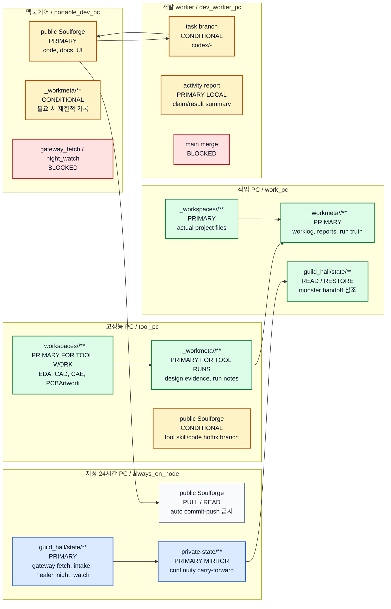

# MULTI_PC_DEVELOPMENT_V0

## 목적

- 이 문서는 Soulforge 를 다른 PC 에서 `clone -> local runtime materialize -> 다시 push` 하는 최소 절차를 잠근다.
- public tracked tree 와 local-only `guild_hall/state/**` / `_workspaces/<project_code>/**` runtime 을 섞지 않고, 여러 PC 에서 같은 정본을 이어서 개발하는 방법을 고정한다.

## 한 줄 정의

- Soulforge 의 정본 코드와 문서는 GitHub 로 동기화하고, owner-only `_workmeta/**` tracked metadata 도 별도 private GitHub repo 로 동기화한다. active `guild_hall/state/**` 와 `_workspaces/<project_code>/**` runtime 상태는 각 PC 의 local-only data 로 유지한다.
- 필요한 경우 owner-only `private-state/` repo 에서 mailbox continuity subset, fetch/intake 기록, 전체 활동 recent-context 를 mirror/restore 할 수 있다.

## 프로필 기준

- 프로필이 명시되지 않으면 다른 PC clone 기본값은 `public-only` 다.
- `public-only` 는 public `Soulforge` 만 clone 한다.
- `operator` 는 public `Soulforge` 만 clone 하지만 local operator env 를 만든다.
- `owner-with-state` 만 Soulforge root 아래 owner-only `_workmeta/`, `private-state/` repo 를 clone 하고 필요한 기록을 복원한다.
- 팀원/공유 대상에게는 `_workmeta/`, `private-state/` 같은 private repo URL 을 주지 않는다.
- AI 에게 bootstrap 을 맡길 때도 먼저 어떤 프로필인지 명시한다.

## node role model

이 문서는 여러 PC 가 같은 Git repo 를 clone 하더라도 각 PC 가 서로 다른 역할을 수행하는 기준도 함께 소유한다.
역할 이름은 public-safe generic name 으로 적고, 실제 장비명, 사용자명, 절대경로, 설치 tool path 는 local-only node identity 에 둔다.

| node role | 주 용도 | 기본 프로필 | 주 write surface | 기본 허용 작업 |
| --- | --- | --- | --- | --- |
| `work_pc` | 실제 업무 파일, 문서 작업, HDD/SSD/cloud project worksite 조작 | `owner-with-state` | `_workspaces/<project_code>/`, `_workmeta/` | project work, workmeta update, bounded evidence capture |
| `tool_pc` | 특정 전문 tool 이 설치된 설계/분석 작업, tool 관련 skill/automation 제작 | `owner-with-state` | `_workspaces/<project_code>/`, `_workmeta/<project_code>/`, 필요 시 public skill/code | circuit/PCB/tool-bound design work, tool skill draft, heavy local validation, tool-run evidence capture |
| `portable_dev_pc` | Soulforge 기능, UI, 문서, 설계 고민과 public repo 개발 | `owner-with-state` 또는 `public-only` | public `Soulforge`, 필요 시 `_workmeta/` | UI/dev docs, architecture review, code changes |
| `dev_worker_pc` | 명시적 task packet 을 받아 bounded branch 를 만드는 자동 개발 worker | `owner-with-state` 또는 public task 만 처리하는 `public-only` | task branch, `guild_hall/state/operations/**`, 필요 시 `_workmeta/` | claim one approved ready task, create `codex/<node>-<task>` branch, validate, push branch for review |
| `always_on_node` | 24시간 감시, snapshot, reminder, gateway, healer, night watch, lightweight automation | `operator` 또는 `owner-with-state` | `guild_hall/state/**`, `private-state/` mirror | gateway fetch, snapshot check, activity sync, healer run, morning report candidate, reminder, night watch |

## PC별 primary writer map

아래 그림은 같은 `Soulforge` repo 를 여러 PC 가 clone 하더라도, 각 PC 가 primary 로 쓰는 영역이 겹치지 않게 하는 기준이다.
색상이 보이지 않는 환경에서도 `PRIMARY`, `MIRROR`, `BLOCKED` 라벨을 기준으로 읽는다.



| 저장소/영역 | primary writer | Git 저장 기준 |
| --- | --- | --- |
| public `Soulforge/.git` | owner-designated public dev lane (`portable_dev_pc`, 승인된 `tool_pc`, 또는 현재 Codex 작업 host) | 코드, 구조 문서, public-safe sample 만 commit/push 한다. 운영용 `always_on_node` clone 은 public repo 자동 commit/push primary 가 아니다. |
| public task branch | `dev_worker_pc` 또는 승인된 `tool_pc` lane | 명시적 task packet 범위에서 `codex/<node>-<task>` branch 만 push 한다. `main` merge 는 reviewer 가 수행한다. |
| `_workmeta/<project_code>/dev_worker_candidate_queue/**` | `portable_dev_pc`, `always_on_node`, 또는 승인된 reviewer agent | agent 가 발견한 후보 작업을 `proposed` 로 남긴다. worker 는 이 큐를 직접 실행하지 않는다. |
| `_workmeta/<project_code>/dev_worker_queue/**` | `portable_dev_pc`, owner-approved promotion helper, 또는 auto-policy promotion helper | owner-approved 또는 auto-policy-approved ready task packet 만 둔다. `dev_worker_pc` 는 이 큐를 claim 할 수 있다. |
| `guild_hall/state/**` | `always_on_node` | local runtime 이며 public Git 에 올리지 않는다. 필요한 연속성만 `private-state/` 로 mirror 한다. |
| `private-state/**` | `always_on_node` | owner-only private repo 에 selected continuity subset 과 activity sync 결과만 commit/push 한다. secret 값은 넣지 않는다. |
| `_workspaces/<project_code>/**` | `work_pc`, tool-bound 범위에서는 `tool_pc` | 실제 logical project worksite/body이자 project payload/artifact owner이며 public Git 에 올리지 않는다. 여러 PC 공유 payload는 owner-approved shared worksite/OneDrive를 physical link target으로 둔다. |
| `_workmeta/<project_code>/**` | `work_pc`, tool-bound run 범위에서는 `tool_pc` | owner-only private shared metadata plane 이며 project metadata, worklog, run truth, log, analytics, selected artifact metadata 를 commit/push 한다. actual project files 와 machine-local temp/cache 는 `_workspaces` 또는 local runtime 에 둔다. |
| `node_identity.yaml` | 각 PC 자신 | `guild_hall/state/local/` 아래 local-only binding 이며 어떤 Git 에도 올리지 않는다. |

## current owner device split

현재 owner 장비 운용은 아래처럼 해석한다. 실제 장비명, 계정명, 절대경로, cloud provider 의 개인 경로는 계속 `guild_hall/state/local/node_identity.yaml` 또는 project-local `_workmeta/<project_code>/bindings/**` 에만 둔다.

| 실제 운용면 | node role | 기본 쓰기 surface | 사용 방식 |
| --- | --- | --- | --- |
| 회사 작업용 PC | `work_pc` | `_workspaces/<project_code>/`, `_workmeta/<project_code>/` | 회사 자리의 로컬 업무 PC 로 본다. 문서, 메일, 실제 업무 자료와 project worksite 조작을 담당하며, 기본 `gateway_fetch_primary` 나 `night_watch_active` 는 아니다. |
| 고성능 PC Soulforge 실행면 | `tool_pc`; owner 가 지정하면 별도 clone/identity 의 `always_on_node` | `tool_pc`: `_workspaces/<project_code>/`, `_workmeta/<project_code>/`; `always_on_node`: `guild_hall/state/**`, `private-state/**` mirror | DB/tools 와 장시간 Soulforge 실행 중심 PC 로 볼 수 있다. tool-bound 작업과 24시간 운영을 같은 물리 PC 에서 하더라도 local `node_identity.yaml` 또는 clone/worktree 로 역할을 분리한다. |
| Mac 상시 서버면 | `always_on_node` | `guild_hall/state/**`, `private-state/**` mirror | 24시간 감시, gateway, healer, reminder, snapshot 같은 경량 운영을 맡는다. NAS 직접 접근이 없어도 이 node role은 유지되며, NAS ingest 권한이 생기지는 않는다. 실제 identity와 primary job binding은 local-only state가 소유한다. |
| 맥북에어 이동/수집/개발면 | `portable_dev_pc` | public `Soulforge`, 필요 시 `_workmeta/**` | 이동 중 macOS 개발, 음성 녹음, YouTube/source link 수집, 앞으로 개발할 항목 기록을 담당한다. `gateway_fetch_primary` 와 `night_watch_active` 는 기본 blocked 다. |
| OneDrive 등 cloud project worksite | `work_pc` / project worksite binding | `_workspaces/<project_code>/` link target 또는 owner-approved external project path | 여러 PC 에서 함께 편집하는 active project 파일, 사진, 영상, 측정 로그, 산출물을 둔다. public repo, `_workmeta`, `private-state`, `guild_hall/state/**` runtime, secret/env/session 은 cloud sync 대상이 아니다. |
| 회사 NAS | external owner-held source surface | 기본 read-only access | 회사 owner가 보유한 원본을 필요한 bounded 작업에서 읽는다. mount 또는 read 성공은 수정, 자동 ingest, Drive 업로드, source 승인, 정본 승격 권한이 아니다. |
| Google Drive source warehouse | approved connector/browser/manual access lane | durable source warehouse | durable source/domain logic으로 후보와 승인된 source를 보관한다. folder placement, `CANON` label, connector visibility/read는 승인이나 canon이 아니다. |

고성능 PC 나 맥미니가 운영과 개발을 모두 맡더라도 역할은 한 clone 안에서 섞지 않는다. 운영용 clone 은 `always_on_node` identity 를 갖고, tool/dev 작업면은 별도의 local `node_identity.yaml` 로 `tool_pc`, `portable_dev_pc`, 또는 `dev_worker_pc` 성격을 선언한다.

### Access mechanism과 authority 분리

이 문서는 device role과 각 장치의 access mechanism을 소유한다. 저장소별
지식 authority는
[`KNOWLEDGE_WAREHOUSE_BOOKSHELF_RULES_V0.md`](../guild_hall/KNOWLEDGE_WAREHOUSE_BOOKSHELF_RULES_V0.md#storage-and-knowledge-authority-matrix)의
matrix를 따른다. mount, sync, connector, browser, junction/symlink, clone은
bytes나 metadata를 읽고 쓰는 방법일 뿐 승인 권한이 아니다.

| Access mechanism | Device-role use | Authority boundary |
| --- | --- | --- |
| OneDrive/shared-worksite sync + `_workspaces/<project_code>/` link | `work_pc` 또는 bounded `tool_pc`가 active editable files를 작업한다. | Working-file access only; source approval, source truth, knowledge canon을 만들지 않는다. |
| NAS mount/share read | 필요한 owner-authorized node가 회사 owner-held external original을 읽는다. | Default read-only; automatic ingest, mutation, Drive upload, approval, canon promotion은 별도 authority 없이는 금지한다. |
| Google Drive connector/browser/manual copy | 승인된 node가 durable source warehouse를 조회하거나 명시된 보관 작업을 수행한다. | Folder/label/connector/read state는 placement/access fact일 뿐이다. Approval/review evidence는 `_workmeta`, accepted reusable knowledge는 `.registry/knowledge`가 소유한다. |
| `_workmeta` private Git sync | `owner-with-state` node가 refs, hashes, approvals, reviews, bindings, ontology candidates를 공유한다. | Metadata-only plane이다. Source, projection, wiki, RAG body를 운반하거나 metadata row만으로 대상을 승인하지 않는다. |

### Voice payload delivery evidence

`_workspaces/system/voice_capture`의 공유 link 또는 cloud sync 상태만으로 다른
PC 도착을 주장하지 않는다. producer가
`delivery/producer_receipts/<session_id>.json`에 `ready`를 쓴 뒤, consumer가
같은 상대 ref의 exact size와 streaming SHA-256을 자기 PC에서 재계산해
`delivery/consumer_acknowledgements/<consumer_node>/<session_id>.json`을 써야
`delivered`다. 현재 receipt의 ID 또는 receipt 파일 SHA와 ack가 다르면
`stale`이며 재검증한다. receipt/ack는 metadata-only이고 title/body/absolute
path/URL/secret을 포함하지 않는다. 실제 node identity나 local secret을 자동
탐색하지 않고 CLI의 public-safe node label만 사용한다. 이 label은 암호학적
identity가 아닌 운영 assertion이므로 producer와 같은 label의 self-ack를
차단해도 권한 있는 운영자가 실제 다른 consumer PC에서 실행해야 한다.
ack file row는 실제 관찰 size/hash를 남기고 receipt 기대값과 다시 대조한다.
missing은 `null/null`이며 status-only 수정이나 file row 누락/추가는 stale이다.
producer/consumer clock을 동기화해야 하며 ack 시각이 receipt 생성 시각보다
이르면 ack/latest 쓰기 전에 중단한다. forged/legacy clock-inverted ack는
status에서 stale이다. 이 metadata 검사는 signature가 아니므로 payload와 metadata
양쪽을 쓸 수 있는 주체의 위조까지 막는 cryptographic identity는 아니다.
`<session_id>.json`은 latest-stage pointer이며 `local_asr_ready`가
`plaud_import_ready`를 덮어써 기존 ack를 stale로 만든다. immutable stage
history archive는 별도로 만들지 않는다. `_workspaces/system` symlink는 public
repo 밖의 shared target만 허용하고 repo 내부 subtree를 가리키면 쓰기 전에
중단한다. 일반 repo 내부 디렉터리로 materialize된 `_workspaces/system`도
delivery prepare/ack/write 대상이 아니다.

Public 문서에는 role과 generic capability만 적는다. 실제 node id, 계정, mount
상태, 절대경로, NAS/Drive binding은 local-only identity 또는 private binding이
소유한다.

각 PC는 같은 읽기 전용 capability 명령으로 자신의 access mechanism만
보고할 수 있다.

```bash
npm run guild-hall:doctor -- --device-capabilities --json
```

Codex 위임 실행에서는 established profile을 명시해 `--profile public-only|operator|owner-with-state`를 함께 넘긴다. `public-only`와 `operator` probe는 `_workmeta` junction binding 및 local NAS/receipt capability 설정을 읽지 않는다.

이 모드는 bootstrap readiness나 authority를 판정하지 않고 doctor status도
쓰지 않는다. node role, workspace link 집계, cloud app 설치·실행, Git 상태,
Ollama와 명시된 local-only NAS/receipt probe의 상태만 경로·계정·파일명 없이
보고한다. 결과의 `installed`, `running`, `reachable`은 access fact일 뿐 sync
완료, source 승인, source truth, primary writer 승격을 뜻하지 않는다.

OneDrive 같은 cloud path 를 `_workspaces` 로 쓰려면 실제 파일은 cloud/shared project worksite 에 두고 `_workspaces/<project_code>/` 는 link 로 둔다. project 별 binding 에만 target 을 기록하고, public tracked tree 에 machine-local 절대경로를 넣지 않는다. symlink/junction 생성은 사용자가 `project_code` 와 대상 path 를 명시했을 때만 수행한다.

cloud/shared worksite 의 상위 root 전체를 `_workspaces/company` 같은 direct child 로 materialize 하지 않는다. 다른 PC 에서 pull 한 뒤 이전 작업 흔적으로 `_workspaces/company` 또는 `_workspaces/personal` 정션이 남아 있으면, target 이 shared worksite root 인지 확인한 뒤 junction pointer 만 제거하고 원본 shared worksite 는 보존한다. 이후 `_workspaces` 아래에는 registered project code, reserved `system`, reserved `_local`, reserved `_local_hold`, owner-approved non-project alias 만 다시 materialize 한다.

같은 `_workspaces/<name>` 경로는 PC마다 다른 실제 폴더를 뜻하면 안 된다. 공유 대상이면 junction/symlink view 로 맞추고, PC별 scratch/cache/local tool state 는 `_workspaces/_local/<node_id>/` 아래에 둔다. 기존 local 폴더를 shared view 로 바꾸는 중간 보존본은 `_workspaces/_local_hold/<workspace_alias>/` 아래에 둔다.

Git push/pull 로 전파되는 것은 public-safe 규칙과 owner-only `_workmeta` binding intent 뿐이다. 각 PC 의 실제 junction, symlink, local absolute path, cloud sync 상태는 Git 이 자동으로 고치지 않으므로 해당 PC 에서 bootstrap/repair 단계를 한 번 수행해야 한다.

### HPP Task Engine/MCP program topology freeze

이 program에서는 HPP·회사 업무 PC·MacBook Air·Mac mini의 동일 logical
`_workspaces/<project_code>`와 기존 OneDrive junction이 owner-confirmed baseline이다. 위 일반 bootstrap
규칙을 근거로 rename/rematerialize/repair하지 않으며 topology delta는 `0`이어야 한다. Exact target와
sync health는 private `VERIFY_HP`다.

`_workspaces/<project_code>`는 actual logical project worksite/body이자 project payload/artifact owner이고
OneDrive junction은 physical materialization/shared-sync mechanism이다. Active DB/WAL/SHM, accepted central
ingress RAW/quarantine, central queue/outbox/checkpoint와 active runtime truth만 sync에서 제외한다. 별도 HPP
private RAW/ERP/runtime custody는 `TARGET`일 뿐 live binding이 아니며 exact physical binding/service health/
activation은 private `VERIFY_HP`다. 다른 PC는 strict private office LAN의 MCP/API로만 submit/query하고
HPP drive/UNC/SMB/SQLite/central queue를 직접 열지 않는다. VPN/Tailscale/remote lane은 `OFF/DEFER`다.
HPP outage는 durable local outbox/HOLD 또는
last-accepted read-only이며 remote mount/split writer가 아니다. 자세한 plan gate는
[`TASK_ENGINE_AX_WORKSPACE_BUILD_MASTER_PLAN_V0.md`](../../../ui-workspace/apps/dev-erp/docs/TASK_ENGINE_AX_WORKSPACE_BUILD_MASTER_PLAN_V0.md)의
§0·§5·§7·§11·A8-SYNTH/A8-CANARY를 따른다.

중복 방지 규칙:

1. `gateway_fetch_primary` 와 `night_watch_active` 는 current-default 에서 owner 가 지정한 `always_on_node` 한 대만 가진다. 현재 지정 장비는 고성능 PC 일 수 있고, 맥미니는 owner 지정이 없으면 fallback/mirror 로 본다.
2. 일반 project 파일과 project-local 업무 기록은 `work_pc` 가 primary 로 쓴다.
3. 회로설계, PCBArtwork, CAD/CAE/EDA 처럼 특정 tool 이 필요한 project 작업은 `tool_pc` 가 해당 task 의 `_workspaces` / `_workmeta` primary writer 가 된다.
4. public docs/code/UI 변경은 owner-designated public dev lane 이 primary 로 쓴다. 기본 예시는 `portable_dev_pc` 이지만, 현재 Codex 작업 host 나 승인된 `tool_pc` 가 맡을 수 있다.
5. `dev_worker_pc` 는 public `main` primary 가 아니라 task branch producer 다. reviewer 가 merge 하기 전까지 정본 승격으로 보지 않는다.
6. 다른 PC 는 primary 영역을 읽거나 복원할 수 있지만, primary writer 로 승격하려면 `node_identity.yaml` 의 `primary_writer` 를 먼저 바꾼다.
7. `work_pc` 와 `tool_pc` 가 같은 `_workmeta/<project_code>/` 를 쓸 수는 있지만, 같은 task/run 파일을 동시에 쓰지 않는다. task owner 는 run 시작 전에 하나로 정한다.

## node employee model

여러 PC 는 한 owner 의 장비지만, 운영 관점에서는 각 PC 를 작은 업무를 맡는 직원처럼 다룰 수 있다.
핵심은 "어느 PC 가 수정했는가" 보다 "운영 clone 을 깨끗하게 유지하고, 맡은 범위가 겹치지 않는가" 다.

```mermaid
flowchart LR
  subgraph N["한 PC 안의 두 작업면"]
    O["운영용 clone<br/>clean main<br/>pull + run only"]
    D["수정용 worktree/clone<br/>codex/<node>-<task><br/>bounded patch"]
  end

  D --> T["test / validate"]
  T --> P["commit + push"]
  P --> O

  O x-- "직접 코드 수정 금지" D

  classDef ops fill:#dbeafe,stroke:#1d4ed8,stroke-width:2px,color:#0f172a;
  classDef dev fill:#fef3c7,stroke:#b45309,stroke-width:2px,color:#0f172a;
  classDef done fill:#dcfce7,stroke:#15803d,stroke-width:2px,color:#0f172a;
  class O ops;
  class D,T dev;
  class P done;
```

허용 모델:

| 작업 종류 | 권장 실행 위치 | 조건 |
| --- | --- | --- |
| 운영 fetch/intake/healer/night_watch 실행 | `always_on_node` 운영용 clone | clean `main`, local env 준비, public repo 수정 없음 |
| local env/secret 경로 설정 | 해당 PC 의 local state | Git commit 금지, secret 값 출력 금지 |
| 작은 문서/스크립트 hotfix | 해당 PC 의 수정용 worktree/clone | `codex/<node>-<task>` branch, scoped diff, 관련 test |
| 기능 개발/큰 구조 변경 | 주 개발 PC 또는 별도 feature branch | 넓은 validate, 문서/CHANGELOG 동기화 |
| task packet 기반 자동 개발 | `dev_worker_pc` 또는 승인된 `tool_pc` lane | ready task packet, clean `main`, branch-only push, reviewer merge |
| project worksite 실제 작업 | `work_pc` | `_workspaces/<project_code>/`, `_workmeta/<project_code>/` 경계 유지 |
| tool-bound project 설계 작업 | `tool_pc` | `owner-with-state`, `_workspaces/<project_code>/` tool 산출물, `_workmeta/<project_code>/` tool run/evidence 기록 |

운영용 clone 규칙:

1. `always_on_node` 의 운영용 `Soulforge` clone 은 `main` + clean worktree 를 기본 상태로 둔다.
2. 운영용 clone 에서는 `git pull --ff-only`, `doctor`, `gateway:fetch`, `gateway:intake`, `guild-hall:healer:run`, healthcheck 같은 실행 명령만 수행한다.
3. 운영 중 발견한 작은 수정은 운영용 clone 에 직접 편집하지 않고, 같은 PC 의 별도 worktree 또는 별도 clone 에서 처리한다.
4. 수정이 push 된 뒤 운영용 clone 은 다시 `git pull --ff-only origin main` 으로 배포본을 받는다.

수정용 worktree 예시:

```bash
git fetch origin
git worktree add -b codex/<node-id>-<short-task> ../Soulforge-hotfix origin/main
cd ../Soulforge-hotfix
```

작업 완료 뒤:

```bash
npm run validate
git status --short
git add <changed-files>
git commit -m "<scope>: <short summary>"
git push origin codex/<node-id>-<short-task>
```

간단 수정이라도 아래는 금지한다.

- 운영용 clone 의 dirty `main` 상태로 자동화 계속 실행
- `guild_hall/state/**`, `_workspaces/**`, `_workmeta/**`, `private-state/**`, raw mail body, attachment binary, secret 파일을 public commit 에 포함
- public repo primary 가 아닌 node 에서 `AGENTS.md`, root `README.md`, `docs/architecture/foundation/**`, `docs/architecture/bootstrap/**`, `MULTI_PC_DEVELOPMENT_V0.md` 같은 protected public contract 문서를 직접 승격 변경
- 같은 파일/기능을 여러 PC 가 동시에 수정하면서 조율 없이 push
- 검증 없이 24시간 운영 node 에 바로 반영
- 같은 project 의 같은 tool run 을 `work_pc` 와 `tool_pc` 가 동시에 기록
- `dev_worker_pc` 가 task packet 없이 스스로 backlog 를 발굴해 branch 를 push
- `dev_worker_pc` 가 `main` 에 직접 push 하거나 auto-merge 수행

role-boundary guard:

- `npm run validate` 와 `npm run done:check` 는 먼저 `npm run validate:role-boundary` 를 실행한다.
- 이 guard 는 local-only `guild_hall/state/local/node_identity.yaml` 의 `primary_writer.public_repo` 를 확인한다.
- `primary_writer.public_repo` 가 `true` 가 아닌 node 에서 protected public contract 문서 diff 가 있으면 실패한다.
- owner 가 명시적으로 예외를 승인한 경우에만 `SOULFORGE_ALLOW_PUBLIC_CONTRACT_EDIT=1` 로 일회성 override 한다. override 는 보호 장치 해제 기록이므로 최종 보고에 남긴다.

작업 배정 원칙:

1. 한 PC 는 한 번에 하나의 bounded task 를 맡는다.
2. 맡은 task 는 파일/모듈/문서 범위를 먼저 좁힌다.
3. 다른 PC 가 이미 수정 중인 파일을 만지려면 먼저 최신 상태를 pull 하고 충돌 가능성을 확인한다.
4. 결과는 commit message, changelog, 또는 private worklog 에 "무엇을 바꿨고 어떤 검증을 했는지" 남긴다.

## local node identity

각 clone 은 같은 tracked tree 를 받지만, 자신이 어느 설치 PC 인지는 local-only identity 로 기억한다.
권장 위치는 public Git 에 올라가지 않는 `guild_hall/state/local/node_identity.yaml` 이다.

예시:

```yaml
schema_version: soulforge.local_node.v0
node_id: example_always_on_01
node_role: always_on_node
bootstrap_profile: owner-with-state

allowed_jobs:
  - snapshot_check
  - gateway_fetch
  - healer_run
  - reminder
  - night_watch

primary_writer:
  public_repo: false
  workmeta: false
  private_state: true
  gateway_fetch: true

local_paths:
  soulforge_root: "<local Soulforge root>"
  workmeta_root: "<local _workmeta root>"
  private_state_root: "<local private-state root>"
```

고성능 tool PC 예시:

```yaml
schema_version: soulforge.local_node.v0
node_id: high_perf_tool_01
node_role: tool_pc
bootstrap_profile: owner-with-state

description: Local-only identity for the high-performance tool PC.

allowed_jobs:
  - tool_bound_design_work
  - circuit_design
  - pcb_artwork
  - cad_or_eda_validation
  - project_metadata_read
  - project_metadata_write
  - workmeta_update
  - tool_skill_authoring
  - heavy_local_validation

blocked_jobs:
  - always_on_scheduler
  - night_watch_active
  - gateway_fetch_primary
  - public_repo_auto_commit
  - public_repo_auto_push

primary_writer:
  public_repo: conditional
  workspaces: tool_bound
  workmeta: true
  private_state: false
  gateway_fetch: false
  night_watch: false

local_paths:
  soulforge_root: "<local Soulforge root>"
  workspaces_root: "<local Soulforge root>/_workspaces"
  workmeta_root: "<local Soulforge root>/_workmeta"
  private_state_root: "<local Soulforge root>/private-state"
  local_runtime_root: "<local Soulforge root>/guild_hall/state"
```

같은 물리 고성능 PC 가 현재 24시간 Soulforge DB/tools primary 도 맡는다면, 위 `tool_pc` identity 의 `blocked_jobs` 를 풀지 않는다. 운영용 clone 또는 별도 worktree 에 `node_role: always_on_node` 와 예: `node_id: high_perf_always_on_01` 같은 local-only identity 를 따로 만들고, `gateway_fetch_primary` / `night_watch_active` 는 그 identity 에만 둔다.

규칙:

- `node_identity.yaml` 은 tracked canon 이 아니라 local runtime binding 이다.
- 실제 PC 이름, 회사/집 구분, 계정명, cloud path, tool install path 는 tracked 문서에 쓰지 않는다.
- 자동화는 가능하면 이 identity 를 읽어 자신이 실행해도 되는 job 만 수행해야 한다.
- current-default 에서 `gateway_fetch` primary writer 와 `night_watch` ACTIVE node 는 각각 1개로 둔다.
- `always_on_node` 는 자동 커밋/푸시를 기본값으로 갖지 않는다. repo sync 는 preflight 의 `pull --ff-only` 같은 안전한 최신화까지만 둔다.
- `tool_pc` 가 실제 설계 작업을 수행하려면 `public-only` 가 아니라 `owner-with-state` 로 bootstrap 해야 한다. skill 제작만 하는 공개 테스트 PC 일 때만 `public-only` 를 허용한다.
- `tool_pc` 는 project metadata 를 읽고 쓸 수 있지만, raw mailbox, secret, credential, unrelated private state 는 읽지 않는다.
- `dev_worker_pc` 는 `guild_hall/dev_worker` task claim helper 로 한 번에 task packet 하나만 선택한다.
- `dev_worker_pc` 는 task packet 의 `allowed_write_paths`, `acceptance_checks`, `stop_conditions` 를 실행 경계로 본다.
- `dev_worker_pc` 는 후보 작업을 직접 실행하지 않고, owner-approved 또는 auto-policy-approved promotion helper 가 만든 ready packet 만 claim 한다.
- `dev_worker_pc` 가 protected public contract 문서를 수정해야 하면 owner 승인과 `SOULFORGE_ALLOW_PUBLIC_CONTRACT_EDIT=1` 사용 여부를 최종 보고에 남긴다.

## Git 으로 따라오는 것

- `.mission/`
- `guild_hall/`
- `docs/architecture/`
- `.registry/`, `.unit/`, `.workflow/`, `.party/`
- `scripts/`
- `package.json`, `package-lock.json`
- `docs/architecture/workspace/examples/**`
- owner 본인만 접근하는 `_workmeta/**` tracked metadata subset

## Git 으로 따라오지 않는 것

- `_workspaces/<project_code>/` 실제 프로젝트 payload 또는 shared worksite link target
- `guild_hall/state/gateway/` 실제 mailbox, intake inbox, event log
- `guild_hall/state/town_crier/` 실제 queue, send log, telegram env
- `guild_hall/state/operations/` active total-activity context
- `_workmeta/<project_code>/runs/`, `battle_log/`, `morning_report/` 같은 local runtime truth
- host-local skill install, local binding, private mailbox dump
- local NotebookLM auth/session
- local Telegram bot token/chat id

## 다른 PC 첫 세팅

Codex가 설치된 owner PC에서는 사용자가 아래 명령을 직접 실행할 필요가 없다. Soulforge 폴더를 Codex로 연 뒤 다음처럼 말한다.

> Soulforge 최신화하고 이 PC에서 할 수 있는 일을 점검해서 준비해줘. Git과 skill 동기화, 읽기 전용 장치 진단은 네가 실행하고, 내가 해야 하는 권한·로그인·설치만 따로 알려줘.

역할을 이미 아는 경우에는 한 문장을 덧붙인다.

- 회사 작업 PC: `이 PC는 work_pc, owner-with-state로 준비해줘.`
- 고성능 설계 PC: `이 PC는 tool_pc, owner-with-state로 준비해줘.`
- 맥 상시 운영 primary: `이 PC는 always_on_node, owner-with-state이며 현재 24시간 운영 primary로 준비해줘. NAS 권한은 추정하지 마.`
- 개발 노트북: `이 PC는 portable_dev_pc, public-only로 준비해줘.`

이 자연어 요청은 `github_down` skill로 route한다. Codex는 안전한 Git fetch/pull, tracked skill sync, workspace junction report-only audit, `guild-hall:doctor -- --device-capabilities --json`, role별 허용·차단 작업 보고를 직접 수행한다. role/profile이 확정되지 않았거나 companion 폴더만 존재하면 `public-only`로 진단한다. `always_on_node` writer bootstrap은 profile과 현재 operational-primary 지정이 모두 명시된 경우에만 실행한다. secret 입력·interactive login·새 private repo 권한·프로그램 설치·junction repair·NAS/Drive mutation처럼 owner 행동이 필요한 지점에서만 멈춘다.

1. `git`, `gh`, `node`, `npm`, `python3`, `uv` 가 설치돼 있는지 확인한다.
2. 필요하면 `gh auth login` 으로 GitHub CLI 인증을 먼저 끝낸다.
3. 저장소를 clone 한다.
4. `owner-with-state` 프로필이면 Soulforge root 아래 owner-only `_workmeta/` repo 를 clone 한다.
5. cross-project continuity 기록도 이어서 쓸 필요가 있으면 Soulforge root 아래 `private-state/` repo 를 clone 한다.
6. repo root 에서 `npm install` 을 1회 실행한다.
7. UI 를 만질 예정이면 `npm run ui:workspace:install` 을 1회 실행한다.
8. sync 가능한 Soulforge Codex skill 전체를 local Codex 에 sync 한다.
9. 필요하면 NotebookLM MCP 를 [`NOTEBOOKLM_MCP_SETUP_V0.md`](../../../docs/architecture/workspace/NOTEBOOKLM_MCP_SETUP_V0.md) 기준으로 대상 PC 에 재설치한다.
10. 실제 runtime 을 만들기 전에 [`examples/guild_hall/state/gateway/README.md`](../../../docs/architecture/workspace/examples/guild_hall/state/gateway/README.md) 를 먼저 읽어 fetch/intake 흐름을 확인한다.
11. `operator` 또는 `owner-with-state` 프로필이면 `guild_hall/gateway/mail_fetch/email_fetch.env.example` 를 참고해 local env file 을 만든다.
12. `operator` 또는 `owner-with-state` 프로필이고 outbound mail 을 바로 쓸 계획이 있으면 `guild_hall/gateway/mail_send/mail_send.env.example` 를 참고해 local outbound mail env file 을 만든다.
13. `operator` 또는 `owner-with-state` 프로필이면 `docs/architecture/workspace/examples/guild_hall/state/gateway/bindings/notify_policy.yaml` 를 local `guild_hall/state/gateway/bindings/notify_policy.yaml` 로 복사하거나, `guild-hall:notify:gateway` 명령으로 첫 policy file 을 만든다.
14. `owner-with-state` 프로필이라면 `_workmeta/` clone 으로 project metadata 를 먼저 받고, 필요하면 [`PRIVATE_STATE_REPO_V0.md`](../../../docs/architecture/workspace/PRIVATE_STATE_REPO_V0.md) 기준으로 `private-state/` continuity subset 을 추가 복원한다.
    - 고성능 `tool_pc` 가 회로설계, PCBArtwork, CAD/CAE/EDA 같은 실제 project tool 작업을 맡으면 반드시 이 `owner-with-state` 단계까지 완료한다.
15. recent context 가 필요하면 `guild_hall/state/operations/soulforge_activity/latest_context.json` 을 먼저 읽고, 더 필요할 때만 현재 월 `events/*.jsonl` 마지막 몇 건을 추가로 본다.
16. `npm run guild-hall:doctor` 로 bootstrap readiness 를 먼저 확인한다.
17. 첫 `guild-hall:gateway:fetch` 또는 `guild-hall:gateway:intake` 실행 시 `guild_hall/state/gateway/**` local runtime 폴더는 스크립트가 자동으로 만든다.
18. 실제 프로젝트별 `_workspaces/<project_code>/` 와 폴더 트리는 그 PC 의 현장 구조에 맞춰 따로 만든다. 여러 PC 에서 같은 실자료를 봐야 하면 shared worksite 를 먼저 만들고 `_workspaces/<project_code>/` 는 junction/symlink 로 연결한다.

## 다른 PC skill 세팅

1. canonical `skill_id` 는 저장소가 들고 간다.
2. 실제 Codex installed skill 은 각 PC 에서 따로 materialize 해야 한다.
3. baseline sync 문서는 [`SKILL_INSTALL_SYNC.md`](../../../.registry/docs/operations/SKILL_INSTALL_SYNC.md) 다.
4. repo root 에서 아래처럼 sync 한다.

```bash
npm run skills:sync -- --all
```

Windows PowerShell:

```powershell
npm.cmd run skills:sync -- --all
```

5. `.registry/skills/*/codex/SKILL.md` 가 있는 skill 은 bootstrap 필수 sync 대상이고, `guild-hall:doctor` 도 이 기준으로 readiness 를 판단한다.
6. `codex/SKILL.md` 가 없는 registry entry 는 test/canon-only package 로 보고 sync 대상에 넣지 않는다.
7. local runtime binding 은 각 PC 의 `_workmeta/<project_code>/bindings/skill_execution_binding.yaml` 이 `skill_id -> installed Codex skill name` 을 resolve 한다.

예:

```yaml
skill_bindings:
  - skill_id: shield_wall
    codex_skill_name: soulforge-shield-wall
  - skill_id: record_stitch
    codex_skill_name: soulforge-record-stitch
```

## 다른 PC 에서 이어서 개발하는 방법

1. PC A 에서 코드나 문서를 바꾼다.
2. owner 전용 project metadata 를 바꿨으면 `_workmeta/` private repo 에도 commit/push 한다.
3. 필요한 변경만 각 GitHub repo 에 push 한다.
4. PC B 에서 public `Soulforge` 와 owner 전용 `_workmeta/` 를 `git pull --rebase origin main` 으로 최신화한다.
5. continuity data 도 이어서 봐야 하면 `private-state/` 도 `git pull --rebase origin main` 으로 최신화한다.
6. PC B 의 local `_workspaces/**` 는 그대로 두고, tracked code/doc 와 private metadata 만 업데이트한다.
7. PC B 에서 다시 작업한 뒤 필요한 repo 에만 commit/push 한다.

## AI 위임 규칙

- 사용자가 Codex에게 PC 준비를 맡기면 AI는 실행 가능한 안전 명령을 직접 수행하고, 터미널 명령 목록만 사용자에게 되돌려주지 않는다.
- 팀원/공유 PC 에서는 AI 에게 `public-only` 로 bootstrap 하라고 지시한다.
- local operator env 까지 다루는 PC 에서는 AI 에게 `operator` 로 bootstrap 하라고 지시한다.
- Windows PowerShell 에서 `npm.ps1` execution policy 로 막히면 bootstrap/update 문서의 `npm run ...` 명령을 `npm.cmd run ...` 형태로 바꿔 실행한다.
- owner 개인 PC 에서는 AI 에게 `owner-with-state` 로 bootstrap 하라고 지시한다.
- AI 는 프로필이 없으면 `public-only` 로 가정해야 한다.
- AI 는 `_workmeta/` 또는 `private-state/` 폴더 존재만으로 profile을 추론하거나 private sync scope를 넓히지 않는다.
- AI 는 owner 전용 `_workmeta/`, `private-state/` clone/restore 를 자동으로 시도하지 않고, owner 프로필과 repo 접근이 명시될 때만 수행한다.
- AI 는 먼저 `npm run guild-hall:doctor -- --profile <profile>` 를 수행하고, 필요할 때만 `--remote`, local env 가 채워진 뒤에만 `--live` 를 수행한다.
- AI 는 profile doctor 전에 `npm run guild-hall:doctor -- --profile <profile> --device-capabilities --json` 으로 profile-scoped aggregate capability를 읽고, 결과를 node role별 현재 가능 작업·차단 작업·owner-only 다음 행동으로 번역한다.
- AI 는 recent context 가 필요하면 `guild_hall/state/operations/soulforge_activity/latest_context.json` 을 먼저 읽고, 부족할 때만 현재 월 `events/*.jsonl` 마지막 몇 건을 추가로 읽는다.

## 중요한 운영 규칙

1. `guild_hall/state/**` 와 `_workspaces/**` 는 공유 저장소가 아니라 각 PC 의 local runtime 이다.
2. 다른 PC 로 옮길 때 project metadata 는 owner-only `_workmeta/` private repo 로 옮기고, 현재 intake 상태 같은 cross-project continuity 는 `private-state/` 로 옮긴다. `guild_hall/state/**` 와 `_workspaces/**` 전체를 public Git 으로 올리지는 않는다.
3. Soulforge 전체 활동 recent-context 는 project `_workmeta` 가 아니라 `guild_hall/state/operations/soulforge_activity/**` 를 active owner 로 두고, owner-only `private-state/` 로만 mirror 한다.
4. canonical 구조, 계약 문서, public-safe sample 은 Git 으로 옮긴다.
5. project 실자료는 GitHub 에 올리지 않는다. mailbox 원문/event/raw/attachment 는 public GitHub 에 올리지 않고, 필요할 때 owner-only `private-state/` mirror 로만 옮긴다.
6. 사진, 영상, 측정 로그처럼 여러 PC 에서 읽어야 하는 실자료는 owner-approved shared worksite 에 두고, 각 PC 의 `_workspaces/<project_code>/` 는 junction/symlink 로 연결한다.
7. 다른 PC 의 경로가 달라도 `docs/architecture/workspace/examples/**` 와 contract 문서만으로 같은 구조를 재현할 수 있어야 한다.
8. 같은 job 을 여러 PC 가 동시에 처리하지 않도록, current-default 에서는 PC 역할과 primary writer 를 사람이 먼저 정하고 자동화는 그 범위를 넘지 않는다.
9. tool 이 특정 PC 에만 설치된 작업은 해당 `tool_pc` 가 처리하고, 다른 node 는 dispatch 준비, 초안, 검증 요청까지만 수행한다.
10. 나중에 autohunt 가 여러 node 로 확장되더라도 `node role -> capability -> claim -> run truth` 순서로 연결하고, local runtime identity 를 public tracked canon 으로 승격하지 않는다.

## 기본 실행 예시

```bash
git clone <repo-url>
cd Soulforge
npm install
npm run guild-hall:gateway:intake -- --payload-file docs/architecture/workspace/examples/guild_hall/state/gateway/requests/mail_intake_request_created_only.json
```

메일 intake 기본 예시:

```bash
npm run guild-hall:gateway:intake -- --payload-file docs/architecture/workspace/examples/guild_hall/state/gateway/requests/mail_intake_request_created_only.json
```

메일 fetch 기본 예시:

```bash
npm run guild-hall:gateway:fetch -- --once --json
npm run guild-hall:gateway:fetch:healthcheck -- --json
```

## 스크립트 기준

- `guild-hall:gateway:fetch` 는 `guild_hall/state/gateway/mailbox/**` 와 `log/mail_fetch/**` 를 자동 생성한다.
- `guild-hall:doctor` 는 필수 도구, local env, safe smoke test 를 확인하고 `guild_hall/state/doctor/status.json` 을 남긴다.
- `guild-hall:gateway:fetch:healthcheck` 는 `log/mail_fetch/logs/last_run_summary.json` 기반 이상 감지를 수행한다.
- `guild-hall:gateway:intake` 는 `guild_hall/state/gateway/intake_inbox/**` 와 `log/monster_events/**` 를 자동 생성한다.
- `guild-hall:town-crier:send` 는 local env file 기준으로 단발 Telegram 알림을 전송한다.
- `guild-hall:notify:gateway` 는 local gateway notify policy 에서 event on/off 를 바꾼다.
- `guild-hall:notify:mission` 은 tracked `.mission/<mission_id>/mission.yaml` 안의 notify toggle 을 바꾼다.
- `guild-hall:notify:emit` 은 enabled 상태일 때만 scope/event 기준으로 `town_crier` queue 에 notify request 를 적재한다.
- `guild-hall:gateway:update` 는 이미 생긴 inbox/monster record 를 갱신한다.
- `skills:sync` 는 tracked `.registry/skills/<skill_id>/codex/**` bridge 를 local `~/.codex/skills/soulforge-<skill-id>/` 로 materialize 한다.
- 실제 프로젝트 쪽 `_workspaces/<project_code>/` materialization 과 shared worksite link 생성은 별도 assignment/execution 단계가 맡는다.

## 권장 Git 운용

- 혼자 두 PC 를 번갈아 쓸 때는 `main` 만 써도 된다.
- 두 PC 에서 동시에 다른 작업을 오래 끌면 짧은 feature branch 를 만들고, 마무리 전에 `main` 에 합치는 쪽이 안전하다.
- 다른 PC 로 넘어가기 전에는 최소한 commit 까지는 남기고 이동한다.

## 연결 문서

- [`README.md`](../../../README.md)
- [`INSTALLATION_MANUAL_V0.md`](../../../docs/architecture/workspace/INSTALLATION_MANUAL_V0.md)
- [`../bootstrap/BOOTSTRAP_PROFILES_V0.md`](../../../docs/architecture/bootstrap/BOOTSTRAP_PROFILES_V0.md)
- [`_workspaces/README.md`](../../../_workspaces/README.md)
- [`MAIL_INTAKE_REQUEST_V0.md`](../../../docs/architecture/workspace/MAIL_INTAKE_REQUEST_V0.md)
- [`WORKSPACE_INTAKE_INBOX_V0.md`](../../../docs/architecture/workspace/WORKSPACE_INTAKE_INBOX_V0.md)
- [`GATEWAY_MAIL_FETCH_V0.md`](../../../docs/architecture/workspace/GATEWAY_MAIL_FETCH_V0.md)
- [`MAIL_SEND_V0.md`](../../../docs/architecture/workspace/MAIL_SEND_V0.md)
- [`GATEWAY_NOTIFY_V0.md`](../../../docs/architecture/workspace/GATEWAY_NOTIFY_V0.md)
- [`PRIVATE_STATE_REPO_V0.md`](../../../docs/architecture/workspace/PRIVATE_STATE_REPO_V0.md)
- [`../bootstrap/README.md`](../../../docs/architecture/bootstrap/README.md)
- [`../bootstrap/BOOTSTRAP_DOCTOR_V0.md`](../../../docs/architecture/bootstrap/BOOTSTRAP_DOCTOR_V0.md)
- [`NOTEBOOKLM_MCP_SETUP_V0.md`](../../../docs/architecture/workspace/NOTEBOOKLM_MCP_SETUP_V0.md)
- [`examples/guild_hall/state/gateway/README.md`](../../../docs/architecture/workspace/examples/guild_hall/state/gateway/README.md)
- [`guild_hall/README.md`](../../../guild_hall/README.md)
- [`../guild_hall/SOULFORGE_ACTIVITY_LOG_V0.md`](../../../docs/architecture/guild_hall/SOULFORGE_ACTIVITY_LOG_V0.md)
- [`SKILL_INSTALL_SYNC.md`](../../../.registry/docs/operations/SKILL_INSTALL_SYNC.md)

## ASSUMPTIONS

- canonical tracked tree 는 계속 GitHub 로 sync 하고, `guild_hall/state/**` 와 `_workspaces/**` 는 public Git 에 올리지 않는 runtime 원칙을 유지한다고 본다. 다만 `_workspaces/<name>` 의 path identity 는 [`WORKSPACE_PATH_IDENTITY_POLICY_V0.md`](WORKSPACE_PATH_IDENTITY_POLICY_V0.md) 에 따라 shared view 와 PC-local namespace 를 명확히 나눈다.
