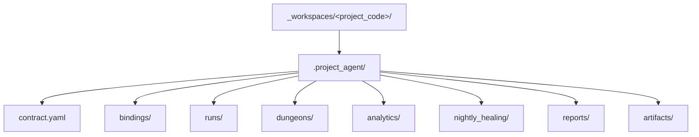

# `.project_agent` 최소 스키마

## 목적

- 이 문서는 `_workspaces/<project_code>/` 가 local environment 에 materialize 될 때 둘 수 있는 `.project_agent/` 의 최소 shape 를 정리한다.
- public repo 기본 모드에서는 이 내용을 강제하지 않고, local-only contract 안내로만 유지한다.

## 구조 개요도



## 최소 shape

```text
.project_agent/
├── contract.yaml
├── bindings/
├── runs/
├── dungeons/
├── analytics/
├── nightly_healing/
├── reports/
└── artifacts/
```

현재 local smoke 는 `.project_agent/` 존재 여부까지만 사용한다.
`contract.yaml` 과 reserved dir 의미는 future local harness 와 운영 contract 를 위해 이 문서에 고정한다.

## 파일 / 디렉터리 역할

| 경로 | 역할 |
| --- | --- |
| `contract.yaml` | project 와 unit/class/workflow/party binding 을 설명하는 local-only contract |
| `bindings/` | project-specific binding notes 또는 split contract 파일 |
| `runs/` | raw execution truth |
| `dungeons/` | local-only mission dungeon data |
| `analytics/` | local-only analytics |
| `nightly_healing/` | local-only healing output |
| `reports/` | local-only reports |
| `artifacts/` | local-only artifacts |

## `contract.yaml` 최소 필드

- `project_code`
- `display_name`
- `status`
- `unit_ref`
- `class_package_refs`
- `workflow_refs`
- `party_template_refs`

## 예시

```yaml
project_code: P00-000
display_name: Local Smoke Sample
status: local_smoke_template
unit_ref: .unit/example_unit/unit.yaml
class_package_refs:
  - .agent_class/example_class/class.yaml
workflow_refs:
  - .workflow/example_workflow/workflow.yaml
party_template_refs:
  - .party/example_party/party.yaml
```

## 규칙

1. `.project_agent/` 는 local-only owner surface 다.
2. public repo 에는 actual `.project_agent/` content 를 추적하지 않는다.
3. `runs/`, `analytics/`, `nightly_healing/`, `reports/`, `artifacts/` 는 모두 public fixture 입력이 아니다.
4. detailed file schema 는 future local smoke harness 에서 확장할 수 있다.
