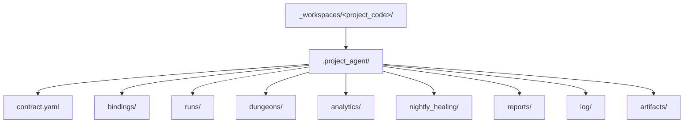

# `.project_agent` 최소 스키마

## 목적

- 이 문서는 `_workspaces/<project_code>/` 가 local environment 에 materialize 될 때 둘 수 있는 `.project_agent/` 의 최소 shape 를 정리한다.
- public repo 기본 모드에서는 이 내용을 강제하지 않고, local-only contract 안내와 tracked example anchor 로 유지한다.
- `.project_agent/` 는 local contract, binding, raw run truth surface 를 다루며 mission assignment owner 를 뜻하지 않는다.
- held mission plan 과 readiness owner 는 `.mission/` 이고, `.project_agent/` 는 그 mission 이 참조하는 project-local worksite contract 를 다룬다.

## 구조 개요도



## 최소 shape

```text
.project_agent/
├── contract.yaml
├── bindings/
├── runs/
├── dungeons/
├── analytics/
├── nightly_healing/
├── reports/
│   └── morning_report/
├── log/
│   ├── nightly_sweep/
│   └── battle_log/
└── artifacts/
```

현재 public-safe validator 는 `.project_agent/` 존재 여부까지만 확인한다.
`contract.yaml` 과 reserved dir 의미는 local-only contract baseline 으로 이 문서에 고정하고, tracked example 은 `docs/architecture/workspace/examples/` 아래에 둔다.
tracked example 에 보이는 `runner/` packet sample 은 설명용 mirror 이며, local runtime 의 required directory 는 아니다.
held mission plan 과 readiness 는 `.mission/<mission_id>/` 쪽에서 다루고, `.project_agent/` 는 그 mission 이 참조하는 project-local worksite contract 와 run truth 만 다룬다.

## 파일 / 디렉터리 역할

| 경로 | 역할 |
| --- | --- |
| `contract.yaml` | project 와 unit/class/workflow/party binding 을 설명하는 local-only contract |
| `bindings/` | project-specific split binding 파일 |
| `runs/` | raw execution truth |
| `dungeons/` | local-only dungeon/scenario data |
| `analytics/` | local-only analytics |
| `nightly_healing/` | local-only healing output |
| `reports/` | local-only owner-facing documents and briefings |
| `log/` | local-only time-ordered operational logs |
| `artifacts/` | local-only artifacts |

## `contract.yaml` 최소 필드

- `project_code`
- `kind`
- `display_name`
- `status`
- `unit_ref`
- `bindings.workflow`
- `bindings.party`
- `bindings.appserver`
- `bindings.mailbox`
- `bindings.execution_profiles` (optional)
- `bindings.skill_execution` (optional)
- `runtime_truth_root`

## 예시

```yaml
project_code: demo_project
kind: project_agent_contract
status: active
display_name: Demo Project
unit_ref: ../../../../../../.unit/vanguard_01/unit.yaml
bindings:
  workflow: bindings/workflow_binding.yaml
  party: bindings/party_binding.yaml
  appserver: bindings/appserver_binding.yaml
  mailbox: bindings/mailbox_binding.yaml
  execution_profiles: bindings/execution_profile_binding.yaml
  skill_execution: bindings/skill_execution_binding.yaml
runtime_truth_root: runs/
```

## 규칙

1. `.project_agent/` 는 local-only contract and runtime surface 다.
2. public repo 에는 actual `.project_agent/` content 를 추적하지 않는다.
3. tracked example contract 와 binding set 은 `_workspaces/` 아래가 아니라 `docs/architecture/workspace/examples/` 아래에 둔다.
4. `bindings.*` 는 contract 기준 상대 경로 파일 포인터다.
5. `bindings.execution_profiles` 와 `bindings.skill_execution` 은 optional runtime binding 이며 model, attached skill, MCP/tool preference 를 local execution layer 에서 resolve 한다.
6. `runtime_truth_root` 는 `runs/` 를 사용하고 raw truth 는 항상 `runs/<run_id>/` 아래에 둔다.
7. `runs/`, `analytics/`, `nightly_healing/`, `reports/`, `log/`, `artifacts/` 는 모두 public fixture 입력이 아니다.
8. runner 역할은 예시적으로 local `.project_agent/tools/` 아래 prototype script 로 구현될 수 있지만, 이 경로는 설명용 구현 위치일 뿐 고정 규칙이 아니다. `runner/` folder materialization 은 필수 규칙이 아니다.
