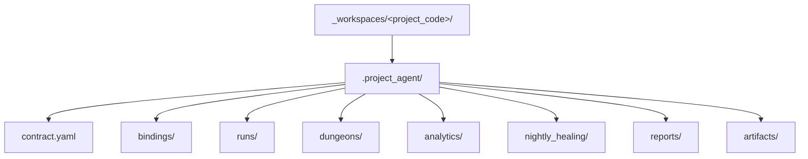

# `.project_agent` 최소 스키마

## 목적

- 이 문서는 `_workspaces/<project_code>/` 가 local environment 에 materialize 될 때 둘 수 있는 `.project_agent/` 의 최소 shape 를 정리한다.
- public repo 기본 모드에서는 이 내용을 강제하지 않고, local-only contract 안내와 tracked example anchor 로 유지한다.

## 구조 개요도



## 최소 shape

```text
.project_agent/
├── contract.yaml
├── bindings/
├── runs/
├── dungeons/
├── analytics/
├── nightly_healing/
├── reports/
└── artifacts/
```

현재 public-safe validator 는 `.project_agent/` 존재 여부까지만 확인한다.
`contract.yaml` 과 reserved dir 의미는 local-only contract baseline 으로 이 문서에 고정하고, tracked example 은 `docs/architecture/workspace/examples/` 아래에 둔다.

## 파일 / 디렉터리 역할

| 경로 | 역할 |
| --- | --- |
| `contract.yaml` | project 와 unit/class/workflow/party binding 을 설명하는 local-only contract |
| `bindings/` | project-specific split binding 파일 |
| `runs/` | raw execution truth |
| `dungeons/` | local-only mission dungeon data |
| `analytics/` | local-only analytics |
| `nightly_healing/` | local-only healing output |
| `reports/` | local-only reports |
| `artifacts/` | local-only artifacts |

## `contract.yaml` 최소 필드

- `project_code`
- `kind`
- `display_name`
- `status`
- `unit_ref`
- `bindings.workflow`
- `bindings.party`
- `bindings.appserver`
- `bindings.mailbox`
- `runtime_truth_root`

## 예시

```yaml
project_code: demo_project
kind: project_agent_contract
status: active
display_name: Demo Project
unit_ref: ../../../../../../.unit/vanguard_01/unit.yaml
bindings:
  workflow: bindings/workflow_binding.yaml
  party: bindings/party_binding.yaml
  appserver: bindings/appserver_binding.yaml
  mailbox: bindings/mailbox_binding.yaml
runtime_truth_root: runs/
```

## 규칙

1. `.project_agent/` 는 local-only owner surface 다.
2. public repo 에는 actual `.project_agent/` content 를 추적하지 않는다.
3. tracked example contract 와 binding set 은 `_workspaces/` 아래가 아니라 `docs/architecture/workspace/examples/` 아래에 둔다.
4. `bindings.*` 는 contract 기준 상대 경로 파일 포인터다.
5. `runtime_truth_root` 는 `runs/` 를 사용하고 raw truth 는 항상 `runs/<run_id>/` 아래에 둔다.
6. `runs/`, `analytics/`, `nightly_healing/`, `reports/`, `artifacts/` 는 모두 public fixture 입력이 아니다.
