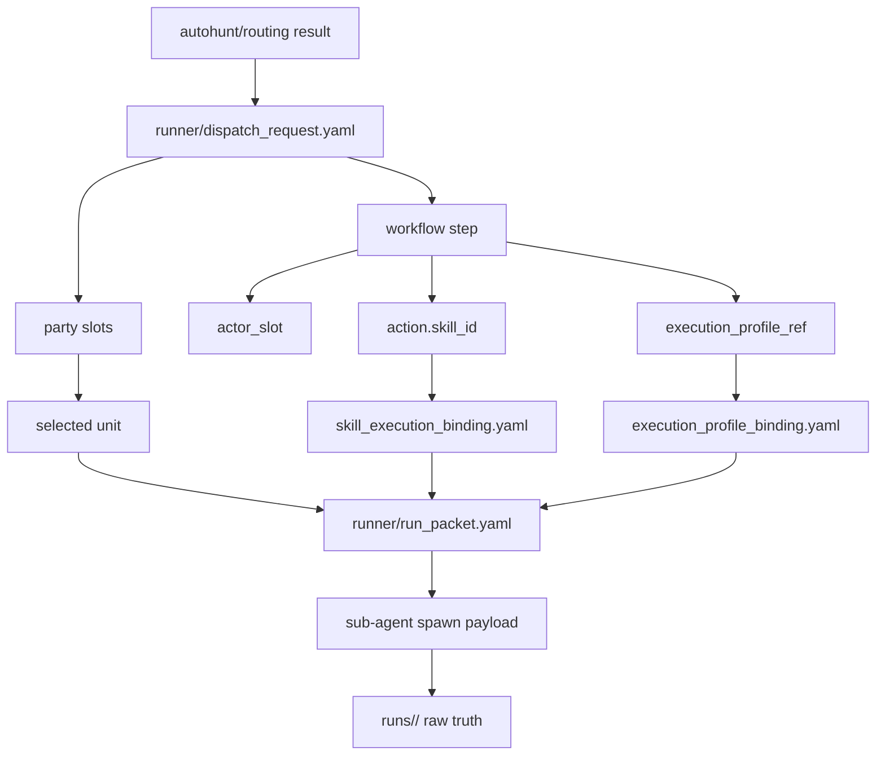
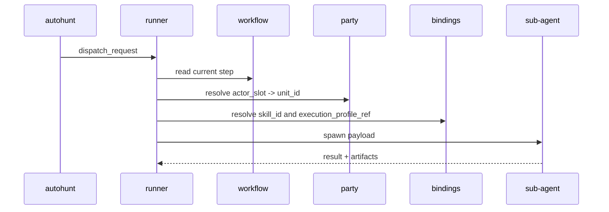

# Runner Execution Model

## 목적

- 이 문서는 runner 가 `autohunt -> party -> workflow -> sub-agent execution` 을 어떻게 잇는지 고정한다.
- workflow, party, autohunt, binding, raw truth owner 의 책임을 섞지 않는다.

## 한 줄 정의

- runner 는 autohunt 가 선택한 `workflow_id` 와 `party_id` 를 받아, 현재 step 에 필요한 unit, skill, execution profile 을 resolve 하고 실제 sub-agent execution payload 를 만드는 local execution orchestrator 다.

## 관계도

## 시퀀스

## runner 가 소유하는 것

- dispatch 입력을 현재 execution packet 으로 해석하는 절차
- 현재 step 의 `actor_slot -> selected_unit_id` resolve 결과
- `skill_id -> codex skill name` resolve 결과
- `execution_profile_ref -> model / reasoning / attached skill / MCP/tool hint` resolve 결과
- 다음 step handoff 를 위한 current run packet

## runner 가 소유하지 않는 것

- workflow canon
- party canon
- unit canon
- mailbox queue 와 retry policy
- raw truth 자체

## 최소 tracked sample

- `runner/dispatch_request.yaml`
  - autohunt 가 runner 에 넘기는 public-safe dispatch example
- `runner/run_packet.yaml`
  - runner 가 current step 기준으로 resolve 한 public-safe execution packet example

## resolve 순서

1. autohunt 가 `monster_type` 를 `workflow_id + party_id` 로 routing 한다.
2. runner 가 `dispatch_request.yaml` 에서 `workflow_id`, `party_id`, `entry_step_id`, input ref 를 읽는다.
3. workflow step 에서 `actor_slot`, `action.skill_id`, `execution_profile_ref` 를 읽는다.
4. party 의 `member_slots.yaml` 에서 `actor_slot -> unit_id` 를 찾는다.
5. unit 의 `class_ids` 와 class-local `skill_refs.yaml` 을 따라 current skill eligibility 를 확인한다.
6. `skill_execution_binding.yaml` 이 `skill_id -> codex skill name` 을 resolve 한다.
7. `execution_profile_binding.yaml` 이 model, reasoning, attached skill names, MCP/tool hint 를 resolve 한다.
8. runner 는 이 결과를 `run_packet.yaml` 형태로 묶고 sub-agent spawn payload 를 생성한다.
9. actual execution truth 와 artifacts 는 `runs/<run_id>/` 아래에만 남긴다.

## tracked mirror 와 local runtime

- tracked repo 는 `dispatch_request.yaml` 과 `run_packet.yaml` 같은 public-safe packet example 만 둔다.
- actual queue state, actual spawn payload, transcripts, intermediate artifact 는 `_workspaces/<project_code>/.project_agent/runs/<run_id>/` 아래에만 둔다.
- runner 는 execution role 이지 top-level canonical root 나 required local folder 이름이 아니다.

## 경계

- runner 는 workflow 와 party 를 합치는 역할을 하지만, 둘의 정본 owner 는 아니다.
- dispatch packet 은 autohunt 의 routing 결과이며 raw truth 가 아니다.
- run packet 은 runner 의 resolved execution metadata 이며 raw truth 가 아니다.
