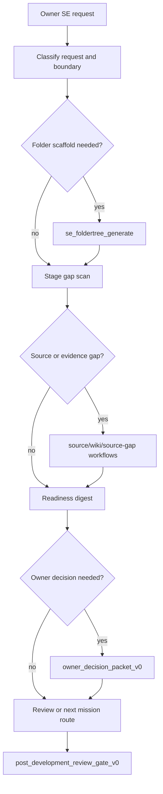

# SE Assistant Operating Model v0

## Purpose

This document fixes the public-safe operating boundary for the Soulforge
systems-engineering assistant. The assistant is not a folder generator and not
a design authority. It is an orchestration aide that helps the owner turn
project intent, source evidence, stage gaps, artifact needs, review evidence,
and owner decisions into repeatable Soulforge mission/workflow packets.

## Current Building Blocks

The assistant lane already has these reusable parts:

| Surface | Role |
| --- | --- |
| `.registry/skills/se_foldertree_generate/` | Creates SE project folder scaffolds and plan-tracking files from a declared supported spec. |
| `docs/architecture/workspace/SE_DUNGEON_STAGE_MODEL_V0.md` | Maps project, stage, artifact, monster, and boss-clear concepts into the Soulforge dungeon model. |
| `.workflow/se_stage_artifact_gap_scan_v0/` | Scans one stage for expected artifacts, current evidence, gaps, owner questions, blockers, and downstream routes. |
| `.workflow/se_knowledge_wiki_pipeline_v0/` | Routes SE knowledge/wikiization requests through source intake, sourcebound projection, metadata capture, and closeout review. |
| `.workflow/project_readiness_digest_v0/` | Produces owner-readable status, blocker, backlog, and next-action summaries from bounded refs. |
| `.workflow/owner_decision_packet_v0/` | Records scoped owner decisions and downstream effects without becoming source truth. |
| `.workflow/review_gate_evidence_pack_v0/` | Packages review-readiness evidence without approving gates. |
| `.workflow/post_development_review_gate_v0/` | Closes bounded development work with validator, boundary, and claim-ceiling checks. |

## Structural Gaps Closed By This Slice

Before this slice, the repo had strong individual SE workflows but no single
assistant-facing operating loop that could receive an owner request and route it
across folder setup, stage scanning, source intake, readiness reporting, owner
decision capture, and review closeout.

The missing structural conditions were:

- A request-level workflow that explains what the SE assistant owns.
- A party/loadout that can be selected for SE assistant work without copying
  each lower workflow into the prompt.
- Explicit non-claims so the assistant does not become design authority,
  source authority, review approval, or verification acceptance.
- A public-safe project-start path that separates scaffold generation from
  evidence-backed engineering support.
- A clear rule for missing engineering truth: record owner input, source gap,
  blocker, or downstream route; do not infer the missing fact.

## Assistant Authority Boundary

The SE assistant may:

- classify a bounded SE request and choose a safe route;
- run or request `se_foldertree_generate` when the required scaffold inputs are
  present;
- call a stage gap scan for one or more lifecycle stages;
- route source-heavy work to source intake, sourcebound knowledge packet, or
  wiki pipeline workflows;
- prepare owner questions, source-gap rows, blocker registers, draftable
  artifact queues, diagram needs, and readiness digests;
- prepare review evidence packets and post-development review packets;
- record metadata-only usage and procedure-capture evidence.

The SE assistant must not:

- invent requirements, design values, interface decisions, test results, source
  facts, or review approvals;
- read or copy secrets, credentials, mail bodies, raw private payloads, or
  project-local source documents into public canon;
- mutate `_workspaces/<project_code>/` or upstream project artifacts unless a
  mission binding or owner instruction grants that scoped action;
- treat Google Drive, NotebookLM, Obsidian, `_workmeta`, or advisory model
  output as source truth or canon authority by itself;
- claim SRR, SFR, PDR, CDR, TRR, FCA/OT, PCA, or LL readiness unless an owning
  review/evidence workflow and owner decision support that claim.

## Request Flow

## Project Use Path

For a real project, start in this order:

1. Create or confirm the project code and private metadata root under
   `_workmeta/<project_code>/`.
2. If the physical folder scaffold is missing, run `se_foldertree_generate`
   with a supported business type, contractor, quality grade, start date,
   project name, profile, output root, and layout mode.
3. Bind the first mission under `.mission/<mission_id>/` or the project-local
   private mission surface, depending on the public/private boundary.
4. Run stage gap scans for the active stage only. Do not scan the whole
   lifecycle unless a digest or governance task needs a cross-stage view.
5. For each gap, choose one route: owner input, source packet, source-gap
   follow-up, draftable artifact queue, review evidence packet, or blocker.
6. Produce a readiness digest for the owner. The digest is a status view, not
   source truth.
7. Promote only repeated, source-safe patterns into `.workflow`, `.registry`, or
   `.party` after review.

## Completion Criteria For v0

The v0 structure is complete enough when:

- an SE request can be routed through a named workflow and party;
- scaffold generation stays separate from design-support reasoning;
- missing truth has explicit owner/source/blocker routes;
- stage readiness and review approval remain outside the assistant's authority;
- public canon contains only portable procedure and sanitized templates;
- private run truth and project evidence remain under `_workmeta/<project_code>/`.

## Non-Goals

- No production-ready unattended SE agent claim.
- No automatic project artifact authoring as a default route.
- No universal SE standard claim from one project.
- No automatic public canon promotion from private evidence.
- No source, design, or review authority transfer from the owner to the agent.
