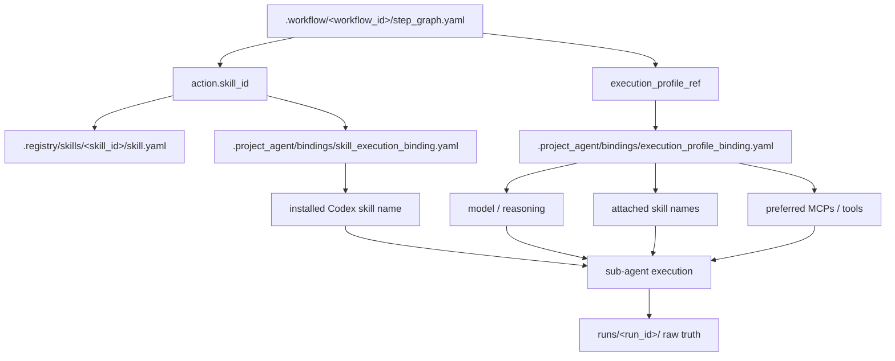

# Workflow Execution Binding Model

## 목적

- 이 문서는 `.workflow/<workflow_id>/step_graph.yaml` 의 step 정보가 local `.project_agent/` runtime binding 을 통해 실제 sub-agent execution 으로 이어지는 경로를 고정한다.
- canonical workflow, canonical skill, local runtime binding, raw truth owner 의 책임을 섞지 않는다.

## 관계도

## 공통 원칙

- workflow step 는 `action.skill_id` 와 `execution_profile_ref` 같은 추상 ref 만 가진다.
- canonical skill behavior 와 `execution_requirements` 는 `.registry/skills/<skill_id>/skill.yaml` 이 소유한다.
- local runtime binding 은 model, reasoning, attached skill package, MCP/tool preference 를 소유한다.
- installed Codex skill name 과 host-local path resolve 는 local runtime concern 이며 canonical root 가 아니다.
- raw execution truth 는 언제나 `_workspaces/<project_code>/.project_agent/runs/<run_id>/` 아래에 남긴다.

## resolve 순서

1. workflow runner 가 `workflow_id` 와 `entry_step_id` 를 읽는다.
2. `step_graph.yaml` 에서 `action.skill_id` 와 `execution_profile_ref` 를 읽는다.
3. unit selection 이 필요하면 candidate unit 의 `class_ids` 와 class-local `skill_refs.yaml` 을 따라 required skill eligibility 를 먼저 본다.
4. `skill_execution_binding.yaml` 이 canonical `skill_id` 를 installed Codex skill name 으로 resolve 한다.
5. `execution_profile_binding.yaml` 이 `execution_profile_ref` 를 model, reasoning, attached skill name, preferred MCP/tool set 으로 resolve 한다.
6. sub-agent spawn payload 는 workflow step, resolved unit, resolved Codex skill name, execution profile, input file set 을 합쳐 생성한다.
7. 실행 결과와 intermediate truth 는 `runs/<run_id>/` 아래에 남긴다.

## tracked example 과 local materialization

- tracked example 은 `docs/architecture/workspace/examples/<project_code>/.project_agent/` 아래에 public-safe mirror 만 둔다.
- tracked example binding 은 installed skill **name** 과 MCP/tool **name** 만 보여준다.
- host-local skill path, local MCP endpoint, actual source file dump, run artifact 는 tracked example 에 넣지 않는다.

## sample binding pair

- `bindings/execution_profile_binding.yaml`
  - `analysis_heavy -> gpt-5.1-codex-mini`
  - `pdf_evidence_review -> gpt-5.4 + pdf skill + pdftoppm/pdfplumber`
- `bindings/skill_execution_binding.yaml`
  - `shield_wall -> soulforge-shield-wall`

## 해석 경계

- class data 만으로 installed Codex skill 이 자동 attach 되는 것은 아니다.
- workflow step 이 required skill 을 말하고, runtime binding 이 그 skill 을 실제 execution package 로 연결할 때만 자동 attach 가 일어난다.
- hero bias, class capability, unit profile 은 selection 과 prompt lens 에 영향을 주지만, 실제 모델과 MCP/tool 장착은 runtime binding 이 확정한다.
