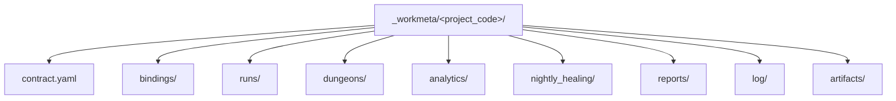

# `_workmeta` 최소 스키마

## 목적

- 이 문서는 companion private root `_workmeta/<project_code>/` 에 둘 metadata 최소 shape 를 정리한다.
- public repo 기본 모드에서는 이 내용을 강제하지 않고, local-only contract 안내와 tracked example anchor 로 유지한다.
- `_workmeta/<project_code>/` 는 owner-only shared metadata plane 으로서 contract, binding, handoff note, run truth metadata 를 다루며 mission assignment owner 를 뜻하지 않는다.
- HWP/HWPX, Word, Excel, PowerPoint, PDF, 압축파일, 메일 원문/첨부 같은 실제 원문 파일은 `_workmeta` 에 저장하지 않고 `_workspaces` 또는 owner-approved shared worksite 에 둔다.
- HWP 본문 분석은 HWP 원문이 아니라 HWPX 정규화 파생본을 대상으로 하며, `_workmeta` 는 변환 큐와 상태 메타데이터만 저장한다.
- held mission plan 과 readiness owner 는 `.mission/` 이고, `_workmeta/<project_code>/` 는 그 mission 이 참조하는 project metadata contract 를 다룬다.
- reserved `_workmeta/system/` 은 project-agnostic reusable workflow lab evidence 와 procedure capture 를 두는 별도 support lane 이다.

## 구조 개요도



## 최소 shape

```text
_workmeta/<project_code>/
├── contract.yaml
├── bindings/
├── runs/
├── dungeons/
├── analytics/
├── nightly_healing/
├── reports/
│   └── morning_report/
├── log/
│   ├── events/
│   ├── nightly_sweep/
│   └── battle_log/
└── artifacts/
```

현재 public-safe validator 는 companion `_workmeta/<project_code>/` 존재 여부까지만 확인한다.
`contract.yaml` 과 reserved dir 의미는 owner-only shared metadata baseline 으로 이 문서에 고정하고, tracked example 은 `docs/architecture/workspace/examples/` 아래에 둔다.
tracked example 에 보이는 `runner/` packet sample 은 설명용 mirror 이며, local runtime 의 required directory 는 아니다.
held mission plan 과 readiness 는 `.mission/<mission_id>/` 쪽에서 다루고, `_workmeta/<project_code>/` 는 그 mission 이 참조하는 project metadata contract 와 run truth 만 다룬다.

## reserved `system` lane

```text
_workmeta/system/
├── runs/
│   └── <run_id>/
└── reports/
    └── procedure_capture/
```

- `_workmeta/system/` 은 customer project contract root 가 아니라 reusable workflow lab/support lane 이다.
- `runs/` 는 project-agnostic pilot, replay, registration gate evidence 를 두는 shared metadata surface 다. 실제 원문 파일 사본을 두는 곳이 아니다.
- `reports/procedure_capture/` 는 reusable workflow discovery, maturity alignment, promotion reasoning 을 둔다.
- `_workmeta/system/` 은 local project list 에 올리지 않으며 `_workmeta/<project_code>/` contract 를 대체하지 않는다.

## 파일 / 디렉터리 역할

| 경로 | 역할 |
| --- | --- |
| `contract.yaml` | project 와 unit/class/workflow/party binding 을 설명하는 owner-only shared contract |
| `bindings/` | project-specific split binding 파일 |
| `runs/` | 실행 기록 메타데이터와 검증 기록; source/reference 원문 파일 사본 없음 |
| `dungeons/` | owner-only shared dungeon/scenario metadata |
| `analytics/` | owner-only shared analytics metadata |
| `nightly_healing/` | owner-only shared healing metadata |
| `reports/` | owner-only shared documents and briefings, including onboarding notes |
| `log/` | owner-only shared operational logs, including event streams and human-readable battle summaries |
| `artifacts/` | owner-only shared artifacts and evidence/export metadata |

Reserved `system` lane 은 위 표의 `<project_code>` contract 를 대체하지 않는다. 필요한 경우 `runs/` 와 `reports/procedure_capture/` 만 사용하는 support surface 로 읽는다.

## shared metadata plane vs non-metadata local state

current-default 에서는 `_workmeta` 를 `owner-only shared metadata plane across PCs` 로 본다.
즉 owner PC 들이 서로 pull/push 해서 같이 알아야 하는 metadata 는 `_workmeta` 아래에 남기고, actual project files 와 machine-local temp/cache 는 `_workspaces`, owner-approved shared worksite, 또는 local runtime 에 남기는 쪽을 기본안으로 둔다.

### shared metadata checklist

다른 PC 가 pull 해서 이어받아야 하는 아래 항목은 `_workmeta` tracked shared surface 에 남긴다.

1. `contract / binding`
   - `contract.yaml`, `bindings/**`
2. `rules / mapping`
   - project-local 판단 규칙, routing rule, handoff mapping, workflow note
3. `reports`
   - onboarding note, procedure capture, promotion candidate, owner-facing summary, morning report 같은 metadata 문서
4. `run truth metadata`
   - `runs/<run_id>/` 아래의 run packet, transcript, machine-checked evidence, replay note, validation 기록
   - 실제 원문 파일이 필요하면 workspace/shared worksite 경로 포인터, 크기, 해시, 출처 메모로만 연결
5. `log / analytics / healing / artifact metadata`
   - 다른 PC 가 이어받아야 하는 battle log, event log, analytics snapshot, nightly healing output, selected artifact metadata
6. `decision summary`
   - 다음 PC 가 그대로 이어받을 수 있게 남긴 판단 이유, blocker, next action

### non-metadata local state

아래는 `_workmeta` shared history 기본 대상이 아니다.

- `_workspaces/**` actual project files
- HWP/HWPX, Word, Excel, PowerPoint, PDF, 압축파일, 메일 원문/첨부 같은 실제 원문 파일
- machine-local temp/cache
- secret, token, credential 값
- raw mail body, attachment binary 원문

### tool_pc lane choice

- delivery project 에 직접 속한 작업이면 `_workmeta/<project_code>/` 아래 shared metadata 를 남긴다.
- project-agnostic workflow lab, tool bootstrap, reusable extraction pilot, system-level smoke 면 `_workmeta/system/` 아래 shared metadata 를 남긴다.
- `_workspaces/**` 실파일 전체를 `_workmeta` 로 복사하는 것은 기본안이 아니다.
- 실행 기록이 메타데이터인 한 `_workmeta` shared surface 에 남긴다. 실제 원문 파일과 machine-local non-metadata temp/cache 는 tracked history 밖에 둔다.

### 24-hour PC aggregation expectation

- `always_on_node` 가 `owner-with-state` 로 동작할 때는 `_workmeta/main` 을 주기적으로 pull 해서 shared metadata plane 최신 상태를 유지할 수 있다.
- 24시간 PC 에서 새 metadata 가 생기면 clean/main 조건이 맞는 동안 `_workmeta` 에 commit/push 할 수 있다.
- 이 동작은 `_workspaces/**` 실파일이나 원문 파일을 취합하는 것이 아니라 `_workmeta` metadata plane 을 취합하는 것이다.
- 24시간 PC 는 `_workmeta/main` fast-forward sync 만 자동 처리한다. 오래된 작업 브랜치나 PC별 브랜치 전체를 `main` 에 자동 merge 하지 않는다.
- 다른 PC 의 bounded metadata 가 필요하면 먼저 `_workmeta/main` 을 최신화한 뒤 해당 commit 또는 파일 범위만 cherry-pick, rebase, manual port 로 승격한다.
- `README.md`, `CHANGELOG.md`, `reports/**worklog.md`, `promotion_candidate_register.md` 같은 shared policy/log surface 충돌은 `main` 의 최신 공용 규칙을 기준으로 보존하고, 새 기록은 append 로 병합한다.
- PC/node 이름이 서로 다르다는 사실만으로는 충돌이 아니다. 별도 경로의 node metadata 는 공존할 수 있고, 같은 파일의 같은 영역을 동시에 바꾼 경우만 merge conflict 로 본다.
- shared policy/log surface 충돌을 자동으로 판단할 수 없으면 commit/push 하지 말고 blocked 상태와 충돌 파일만 보고한다.

## `contract.yaml` 최소 필드

- `project_code`
- `kind`
- `display_name`
- `status`
- `unit_ref`
- `bindings.workflow`
- `bindings.party`
- `bindings.appserver`
- `bindings.mailbox`
- `bindings.execution_profiles` (optional)
- `bindings.skill_execution` (optional)
- `runtime_truth_root`

## 예시

```yaml
project_code: demo_project
kind: workmeta_contract
status: active
display_name: Demo Project
unit_ref: ../../../../../../.unit/guild_master/unit.yaml
bindings:
  workflow: bindings/workflow_binding.yaml
  party: bindings/party_binding.yaml
  appserver: bindings/appserver_binding.yaml
  mailbox: bindings/mailbox_binding.yaml
  execution_profiles: bindings/execution_profile_binding.yaml
  skill_execution: bindings/skill_execution_binding.yaml
runtime_truth_root: runs/
```

## 규칙

1. `_workmeta/<project_code>/` 는 owner-only shared metadata plane 이다.
2. public repo 에는 actual `_workmeta/<project_code>/` content 를 추적하지 않는다.
3. tracked example contract 와 binding set 은 `_workspaces/` 아래가 아니라 `docs/architecture/workspace/examples/` 아래에 둔다.
4. `bindings.*` 는 contract 기준 상대 경로 파일 포인터다.
5. `bindings.execution_profiles` 와 `bindings.skill_execution` 은 optional runtime binding 이며 model, attached skill, MCP/tool preference 를 local execution layer 에서 resolve 한다.
6. `runtime_truth_root` 는 `runs/` 를 사용하고 실행 기록 메타데이터는 항상 `runs/<run_id>/` 아래에 둔다.
7. `runs/`, `analytics/`, `nightly_healing/`, `reports/`, `log/`, `artifacts/` 는 모두 public fixture 입력은 아니지만, private `_workmeta` shared metadata plane 에서는 tracked shared surface 로 둘 수 있다.
8. runner 역할은 예시적으로 local `_workmeta/<project_code>/tools/` 아래 prototype script 로 구현될 수 있지만, 이 경로는 설명용 구현 위치일 뿐 고정 규칙이 아니다. `runner/` folder materialization 은 필수 규칙이 아니다.
9. 첫 실제 프로젝트 온보딩 중 사람이 읽는 working note 는 `reports/onboarding/`, 근거 artifact 는 `artifacts/onboarding/` 아래에 두는 것을 기본안으로 본다.
10. 사람과 Codex 가 같이 진행하는 시작 단계 기록은 `reports/onboarding/project_start_worklog.md` 에 append 하는 것을 기본안으로 본다.
11. 새 시작 행위의 실제 작업 순서와 절차 초안도 `reports/onboarding/project_start_worklog.md` 또는 같은 경로의 topic note 로 함께 저장하는 것을 기본안으로 본다.
12. `_workmeta` 에 실제 원문 파일을 저장하지 않는다. 대표적으로 `.hwp`, `.hwpx`, `.docx`, `.xlsx`, `.xlsm`, `.xls`, `.pptx`, `.ppt`, `.pdf`, `.zip`, `.7z`, `.rar`, `.egg`, `.msg`, `.eml`, `.pst`, `.ost`, `.mbox` 파일은 `_workspaces` 또는 owner-approved shared worksite 에 두고 `_workmeta` 에는 포인터 메타데이터만 남긴다.
13. `.hwp` 파일은 `HWP_NORMALIZATION_V0.md` 의 정규화 큐를 거친다. `_workmeta` 에는 `inventory.yaml`, `conversion_queue.yaml`, `export_manifest.yaml`, `extraction_status.yaml`, `comparison_summary.yaml` 같은 메타데이터만 두고, HWPX/PDF/text export 원문은 workspace/shared worksite 에 둔다.
