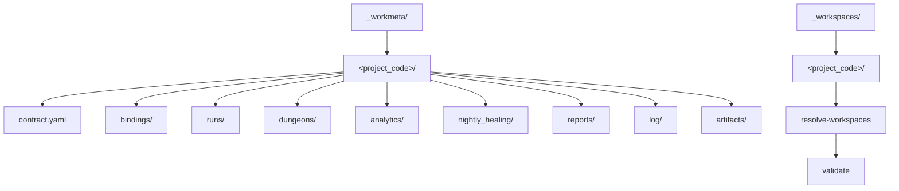

# `_workmeta` resolve 계약

## 목적

- 이 문서는 local-only `_workspaces/<project_code>/` detection 과 companion `_workmeta/<project_code>/` 존재 여부를 현재 validator 가 어떻게 해석하는지 고정한다.
- public-safe mode 와 opt-in local smoke 의 경계를 문서로 분리한다.

## 관계도

## 공통 원칙

- canonical project root 는 `_workspaces/<project_code>/` 직행 구조다.
- companion metadata root 는 `_workmeta/<project_code>/` 구조다.
- 기본 colocated 경로는 Soulforge root 아래 nested private repo `_workmeta/<project_code>/` 다.
- public repo 기본 동작은 `_workspaces/README.md` 만 전제한다.
- local workspace scan 은 `--local-workspaces` 또는 explicit workspace root 가 있을 때만 수행한다.
- project 후보는 workspace root 의 direct child directory 로만 읽는다.
- `company/`, `personal/` 는 project 후보가 아닌 보조 디렉터리로 취급한다.

## 현재 resolve 규칙

### public-safe mode

- `_workspaces/<project_code>/` actual content 를 기대하지 않는다.
- `resolve-workspaces` 는 empty project list 도 정상 결과로 취급한다.
- fixture 와 renderer 는 synthetic workspace summary 로 동작해야 한다.

### opt-in local smoke

- workspace root 의 direct child directory 를 project 후보로 읽는다.
- hidden dir 는 건너뛴다.
- repo `_workspaces/` 를 scan 할 경우 `company`, `personal` 디렉터리는 warning 후 skip 한다.
- companion `_workmeta/<project_code>/` 가 있으면 `state = workmeta_present` 로 기록한다.
- companion `_workmeta/<project_code>/` 가 없으면 `state = local_detected` 로 기록한다.

## 현재 validate 범위

- `_workmeta/<project_code>/` deep schema validation 은 public-safe validator 의 기본 책임이 아니다.
- validator 는 owner roots, cross-ref, local mount summary 위주로 동작한다.
- local-only `_workmeta` contract depth validation 은 별도 local harness 문서가 다룬다.
- local runtime harness 는 필요하면 `bindings/execution_profile_binding.yaml` 과 `bindings/skill_execution_binding.yaml` 을 추가로 resolve 할 수 있다.

## 확장 순서

local-only harness 문서를 확장할 때 아래 순서를 따른다.

1. `_workspaces/<project_code>/` direct child 구조 확인
2. companion `_workmeta/<project_code>/` 존재 확인
3. `contract.yaml` 최소 필드 확인
4. optional runtime binding (`execution_profile_binding.yaml`, `skill_execution_binding.yaml`) 존재 여부 확인
5. reserved dir existence 또는 policy presence 확인
6. raw/private data 는 요약 수치로만 보고하고 본문은 출력하지 않음

## 금지

- `_workspaces/company/<project>/`, `_workspaces/personal/<project>/` 를 project root 로 문서화하는 것
- public fixture 에 actual `_workmeta/<project_code>/runs`, analytics, reports, log, artifacts 를 포함하는 것
- public validator 가 private workspace content 를 기본 입력으로 요구하는 것
