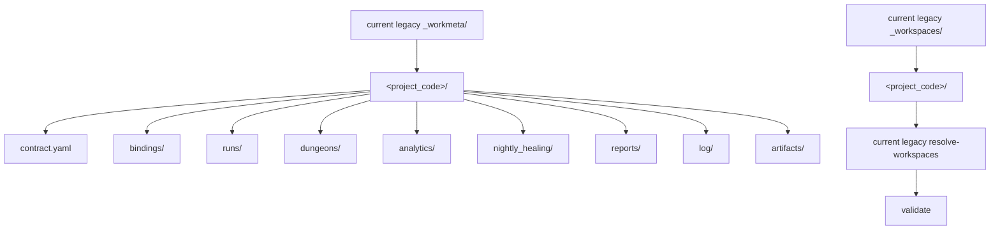

# `_workmeta` resolve 계약

## 목적

- 이 문서는 current legacy local-only `_workspaces/<project_code>/` detection 과 companion `_workmeta/<project_code>/` 존재 여부를 현재 validator 가 어떻게 해석하는지 고정한다.
- public-safe mode 와 opt-in local smoke 의 경계를 문서로 분리한다.
- current resolver는 future target canonical stores를 찾거나 만들거나 admission하지 않는다.

## 관계도

```mermaid
flowchart TD
  W["current legacy _workspaces/"] --> P["&lt;project_code&gt;/"]
  WM["current legacy _workmeta/"] --> PA["&lt;project_code&gt;/"]
  PA --> C["contract.yaml"]
  PA --> B["bindings/"]
  PA --> R["runs/"]
  PA --> D["dungeons/"]
  PA --> A["analytics/"]
  PA --> N["nightly_healing/"]
  PA --> RP["reports/"]
  PA --> LOG["log/"]
  PA --> AR["artifacts/"]
  P --> RW["current legacy resolve-workspaces"]
  RW --> VD["validate"]
```

## 공통 원칙

- current legacy project root 는 `_workspaces/<project_code>/` direct-child 구조다.
- current legacy companion metadata root 는 `_workmeta/<project_code>/` 구조다.
- current legacy colocated 경로는 Soulforge root 아래 nested private repo `_workmeta/<project_code>/` 다.
- reserved `_workmeta/system/` 은 project-agnostic reusable workflow lab metadata root 다.
- public repo 기본 동작은 `_workspaces/README.md` 만 전제한다.
- local workspace scan 은 `--local-workspaces` 또는 explicit workspace root 가 있을 때만 수행한다.
- project 후보는 workspace root 의 direct child directory 로만 읽는다.
- `company/`, `personal/` 는 project 후보가 아닌 보조 디렉터리로 취급한다.
- `_workmeta/system/` 은 current legacy reusable workflow lab evidence, node/system smoke, procedure capture 같은 private support surface 이며 project 후보가 아니다.
- future target `_workspaces` accepts only authority-accepted exact canonical bytes, and future target `_workmeta` accepts only their canonical byte-lineage. W-AUTH, Canonical Empty-State Genesis, and applicable Legacy Freeze are currently `HOLD / not created`; this resolver neither reads nor writes a target binding.

## Current legacy resolve rules

### public-safe mode

- current legacy `_workspaces/<project_code>/` actual content 를 기대하지 않는다.
- `resolve-workspaces` 는 empty project list 도 정상 결과로 취급한다.
- fixture 와 renderer 는 synthetic workspace summary 로 동작해야 한다.

### opt-in local smoke

- current legacy workspace root 의 direct child directory 를 project 후보로 읽는다.
- hidden dir 는 건너뛴다.
- repo `_workspaces/` 를 scan 할 경우 `company`, `personal` 디렉터리는 warning 후 skip 한다.
- current legacy companion `_workmeta/<project_code>/` 가 있으면 `state = workmeta_present` 로 기록한다.
- companion `_workmeta/<project_code>/` 가 없으면 `state = local_detected` 로 기록한다.
- `_workmeta/system/**` 같은 non-project support surface 는 local project list 에 넣지 않는다.

## Current legacy validate 범위

- current legacy `_workmeta/<project_code>/` deep schema validation 은 public-safe validator 의 기본 책임이 아니다.
- validator 는 owner roots, cross-ref, local mount summary 위주로 동작한다.
- local-only `_workmeta` contract depth validation 은 별도 local harness 문서가 다룬다.
- local runtime harness 는 필요하면 current legacy `bindings/execution_profile_binding.yaml` 과 `bindings/skill_execution_binding.yaml` 을 추가로 resolve 할 수 있다.
- `_workmeta/system/` 은 project deep validation 대상이 아니라 reserved lab/support surface 로만 확인한다.

## Future target non-authority boundary

- `resolve-workspaces`, local smoke, and any current validator are historical observation tools. A `workmeta_present` result is not W-AUTH, target binding, target ACL, Genesis, Freeze, or authority acceptance.
- Noncanonical project/task/file-observation/decision/worklog/collector history belongs to future Event Timeline/Analytics routes only after those writers are separately accepted. Until then the current legacy source remains authoritative reference-in-place.
- AI Workforce projection requires exact Agent Mark, Deployment, Run, session, and tool evidence. A folder name, task title, time proximity, host, profile label, Bot root, or service account is not a substitute.
- No resolver/scanner/collector/scheduler may create a target `_workmeta` run/worklog/report/log tree or bind/write either workspace target store (`_workspaces`/`_workmeta`). An unaccepted candidate revision/content digest remains outside target and is distinct from its accepted input source revision/digest. Only `post_publish_closure` by a named sole publisher may atomically publish accepted bytes and canonical byte-lineage after independent review and Human/project-authority acceptance.

## Current legacy harness extension order

local-only harness 문서를 확장할 때 아래 순서를 따른다.

1. current legacy `_workspaces/<project_code>/` direct child 구조 확인
2. current legacy companion `_workmeta/<project_code>/` 존재 확인
3. `contract.yaml` 최소 필드 확인
4. optional runtime binding (`execution_profile_binding.yaml`, `skill_execution_binding.yaml`) 존재 여부 확인
5. reserved dir existence 또는 policy presence 확인
6. raw/private data 는 요약 수치로만 보고하고 본문은 출력하지 않음

## 금지

- `_workspaces/company/<project>/`, `_workspaces/personal/<project>/` 를 project root 로 문서화하는 것
- public fixture 에 actual `_workmeta/<project_code>/runs`, analytics, reports, log, artifacts 를 포함하는 것
- public validator 가 private workspace content 를 기본 입력으로 요구하는 것
- current resolver output을 future target canonical admission, target writer authority, or Legacy Freeze evidence로 해석하는 것
- target `_workmeta`에 current legacy `runs`, `reports`, `analytics`, `log`, `artifacts`, `dungeons`, `autohunt`, or binding/runtime tree를 만드는 것
