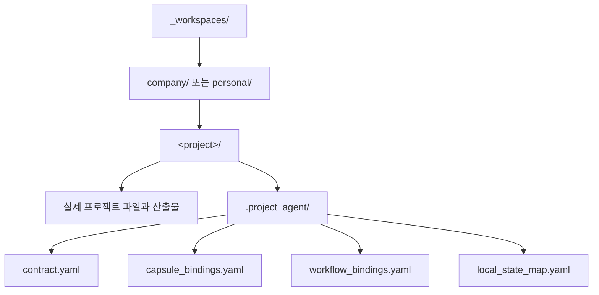

# 워크스페이스 프로젝트 모델

## 목적

워크스페이스는 Soulforge의 실제 운영 현장이다.

워크스페이스에는 추상적인 역량 정의가 아니라 실제 프로젝트 파일, 산출물, 프로젝트별 상태가 들어간다.

## 구조 개요도



## 워크스페이스 구조

```text
_workspaces/
├── company/
└── personal/
```

각 프로젝트 폴더에는 `.project_agent(프로젝트 연결 규약)` 디렉터리가 포함될 수 있다.
즉, `.project_agent/` 가 없는 프로젝트도 실제 워크스페이스 프로젝트로 존재할 수 있다.

최소 파일 세트는 아래 네 개를 기준으로 한다.

- `contract.yaml`
- `capsule_bindings.yaml`
- `workflow_bindings.yaml`
- `local_state_map.yaml`

`workflow_bindings.yaml` 는 workflow 연결뿐 아니라 선택적 mutation scope 도 담을 수 있다.
세부 역할과 최소 필드는 `docs/architecture/workspace/PROJECT_AGENT_MINIMUM_SCHEMA.md` 를 기준으로 본다.
공통 resolve/validate 규칙과 상태 분류는 `docs/architecture/workspace/PROJECT_AGENT_RESOLVE_CONTRACT.md` 를 기준으로 본다.

## 프로젝트 상태 분류

| 상태 | 의미 |
| --- | --- |
| `bound` | `.project_agent/` 가 있고 최소 파일 세트와 핵심 참조가 resolve 된다 |
| `unbound` | 프로젝트 폴더는 있으나 `.project_agent/` 가 없다 |
| `invalid` | `.project_agent/` 는 있으나 계약이나 참조가 깨진다 |

`unbound` 는 허용되는 실제 상태다.
`invalid` 는 contract resolve 실패 상태다.
`bound` project 는 `.project_agent/` resolve 결과를 바탕으로 이후 UI 파생 상태를 만들 수 있다.

## 설계 규칙

프로젝트 파일은 프로젝트 현장 안에 남아 있어야 한다.
본체와 클래스 계층은 워크스페이스를 참조해야 하며, 이를 흡수해서는 안 된다.
프로젝트 전용 계획과 로그는 각 프로젝트의 `.project_agent/` 아래에서 소유한다.
워크스페이스 탭의 상태판은 폴더 존재만이 아니라 `bound`, `unbound`, `invalid` 분류 결과에서 파생한다.
