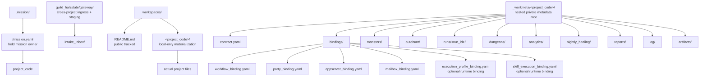

# 워크스페이스 프로젝트 모델

## 목적

- `_workspaces/<project_code>/` 직행 구조를 고정한다.
- public repo 와 local/private project worksite 의 경계를 명확히 한다.
- `_workmeta/<project_code>/` 가 소유하는 운영 계약, binding, 실행 기록 메타데이터의 위치를 고정한다.
- 실제 HWP/HWPX, Excel, PDF, PPT, 압축파일, 메일 파일 같은 원문 파일은 `_workmeta` 가 아니라 `_workspaces` 또는 owner-approved shared worksite 에 둔다는 경계를 고정한다.
- HWP 원문은 먼저 HWPX 로 정규화하고, 본문 분석은 HWPX 파생본을 대상으로 한다는 전사 처리 순서를 고정한다.
- held mission plan owner 는 `.mission/` 이고, `_workspaces/` 는 project-local worksite owner, `_workmeta/` 는 companion private metadata owner 임을 고정한다.
- cross-project ingress/staging 은 `_workspaces/` 가 아니라 `guild_hall/state/gateway/**` 가 맡는다는 기준을 같이 잠근다.

## 구조 개요도



## public repo 구조

```text
_workspaces/
└── README.md
```

## local/private materialization

```text
_workspaces/
├── system/
│   └── <run_family_or_pilot_id>/
│       └── ... reusable workflow lab outputs ...
└── <project_code>/
    └── ... actual project files ...

_workmeta/
├── system/
│   ├── runs/
│   │   └── <run_id>/
│   └── reports/
│       └── procedure_capture/
└── <project_code>/
    ├── contract.yaml
    ├── bindings/
    ├── monsters/
    ├── autohunt/
    ├── runs/
    │   └── <run_id>/
    ├── dungeons/
    ├── analytics/
    ├── nightly_healing/
    ├── reports/
    │   └── morning_report/
    ├── log/
    │   ├── nightly_sweep/
    │   └── battle_log/
    └── artifacts/
```

## 정본 규칙

- `_workspaces/<project_code>/` 가 실제 과제 현장 materialization root 다.
- `_workspaces/system/` 은 특정 delivery project 가 아닌 reusable workflow lab pilot output 과 fixture materialization 을 두는 reserved local-only root 다.
- 실제 프로젝트가 다른 경로에 이미 있으면 `_workspaces/<project_code>/` direct child 로 보이도록 local-only directory link 를 둘 수 있다.
- 다른 owner PC 에서도 같은 실자료를 읽어야 하는 프로젝트는 실제 파일을 owner-approved shared worksite 에 두고, `_workspaces/<project_code>/` 는 그 위치를 가리키는 link view 로 둔다.
- owner-approved shared worksite 의 상위 cloud/company root 는 link target 을 해석하기 위한 외부 루트일 수는 있지만 `_workspaces/company` 같은 direct child 로 materialize 하지 않는다.
- `_workspaces` direct child 는 `<project_code>/`, reserved `system/`, 또는 owner-approved non-project alias 로 제한한다.
- `_workmeta/<project_code>/` 는 Soulforge root 아래 nested private metadata repo 다.
- `_workmeta/system/` 은 project-agnostic reusable workflow evolution run evidence 와 procedure capture 를 두는 reserved lab metadata root 다.
- `guild_hall/state/gateway/` 가 mail fetch 와 project assignment 전 intake staging 을 함께 담는 cross-project ingress root 다.
- held mission plan 과 readiness owner 는 루트 `.mission/` 이다.
- project 후보는 `_workspaces/<project_code>/` direct child 구조를 사용한다.
- project 가 없는 reusable workflow 실험은 reserved `system/` owner 아래에서 관리할 수 있다.
- `project_code` 는 경로와 식별에 쓰는 짧고 안정적인 id 로 두고, 사람용 full title 은 `contract.yaml` 의 `display_name` 에 둔다.
- `_workmeta/<project_code>/` 는 분리된 registry 가 아니라 companion private root 안의 shared metadata plane 이며 contract, binding, 실행 기록 메타데이터, owner-handoff metadata 보관 위치다.
- `_workmeta` 의 실행 기록은 원문 파일 보관을 뜻하지 않는다. HWP/HWPX, Word, Excel, PowerPoint, PDF, 압축파일, 메일 원문/첨부 같은 실제 원문 파일은 `_workspaces/<project_code>/...`, `_workspaces/system/...`, 또는 owner-approved shared worksite 에 둔다.
- `_workmeta` 에는 실제 원문 파일 대신 workspace/shared worksite 경로, 크기, 해시, 출처, 사용 상태, 차단 사유 같은 포인터 메타데이터만 남긴다.
- HWP 는 원문 자체를 본문 분석 대상으로 삼지 않는다. 모든 HWP 는 [`HWP_NORMALIZATION_V0.md`](HWP_NORMALIZATION_V0.md) 에 따라 workspace/shared worksite 작업본에서 HWPX 로 저장/export 한 뒤, HWPX 파생본만 읽는다.
- `_workmeta/<project_code>/monsters/` 는 project-side monster current state owner 다.
- assigned execution plan 과 mission-level 배정 owner 는 `_workmeta/` 가 아니라 `.mission/` 이 소유한다.
- `_workmeta/<project_code>/autohunt/` 는 mailbox routing, party workflow-chain 또는 단일 workflow selection, retry-escalation 같은 자동사냥 운영 정책을 두는 local operating surface 다.
- runner 는 `_workmeta/<project_code>/` contract, binding, workflow, party 를 읽어 current workflow-chain execution packet 을 만드는 execution role 이며 별도 canonical root 나 required local folder 가 아니다.
- runner prototype 는 한 예시로 `_workmeta/<project_code>/tools/` 아래 script 형태로 materialize 할 수 있지만, 이 경로 자체를 현행 표준 구현 위치로 고정하지는 않는다.
- `contract.yaml` 은 `.unit/<unit_id>/unit.yaml` 을 `unit_ref` 로 가리키고, binding file 은 `.workflow/<workflow_id>/workflow.yaml` 과 `.party/<party_id>/party.yaml` 을 id 기준으로 연결한다.
- binding set 은 `workflow_binding.yaml`, `party_binding.yaml`, `appserver_binding.yaml`, `mailbox_binding.yaml` 을 기본으로 두고, 필요하면 `execution_profile_binding.yaml` 과 `skill_execution_binding.yaml` 을 추가해 local runtime execution 을 설명한다.
- 실행 기록 메타데이터의 정본 owner 는 `_workmeta/<project_code>/runs/<run_id>/` 다.
- `.mission/<mission_id>/mission.yaml` 은 workflow, party workflow-chain, runtime assignment 를 묶은 held execution plan owner 다.
- binding file 과 appserver/mailbox/execution operating metadata 는 orchestration contract 이며 실행 기록 owner 가 아니다.
- `autohunt/` 는 run queue 와 routing policy 를 다루지만 실행 기록 owner 가 아니다.
- `dungeons/`, `analytics/`, `nightly_healing/`, `reports/`, `log/`, `artifacts/` 는 모두 owner-only private metadata 영역이며, current-default 에서는 `_workmeta` shared plane 을 통해 다른 owner PC 와 공유할 수 있다.
- tracked contract example 은 `docs/architecture/workspace/examples/<project_code>/_workmeta/` 아래에만 둔다.

## owner 경계

- 프로젝트 실자료와 산출물은 `_workspaces/<project_code>/` view 안에서 접근 가능해야 한다.
- 여러 PC 공유가 필요한 실자료는 `_workspaces` 내부 사본이 아니라 owner-approved shared worksite 원본에 두고, `_workspaces/<project_code>/` 는 local-only link 로 연결한다.
- shared worksite root 전체를 `_workspaces` 아래에 정션으로 걸지 않는다. 필요한 project 또는 승인된 non-project alias 만 direct child 로 둔다.
- 특정 프로젝트 owner 가 없는 reusable workflow pilot 출력은 `_workspaces/system/` 안에 남긴다.
- `gateway` inbox / mailbox / monster event staging 은 `guild_hall/state/gateway/` 안에 남긴다.
- held mission metadata 와 readiness 는 `.mission/<mission_id>/` 아래에 남긴다.
- `.registry`, `.unit`, `.workflow`, `.party`, `guild_hall` 은 project binding 대상 또는 운영 owner 일 뿐, per-project 실자료 owner 가 아니다.
- `.mission` 은 workflow/party-chain/runtime assignment resolve 결과를 project-local run truth 와 분리해 소유한다.
- `_workmeta/` 도 local execution surface 일 뿐 mission assignment owner 는 아니다.
- `_workmeta/system/` 은 project onboarding root 가 아니라 reusable workflow lab owner 다.
- 첫 실제 프로젝트 온보딩은 read-only structure review 후 bounded first run/use 를 수행하고, 그 다음 `_workmeta` local rule 을 보정하는 순서를 기본안으로 본다.
- tracked example contract 와 binding YAML 은 local `_workmeta/<project_code>/` shape 를 public-safe 하게 보여주는 mirror 일 뿐, runtime owner 가 아니다.
- tracked example 의 `runner/` packet sample 은 설명용 mirror 이며, local runtime 의 required directory 를 뜻하지 않는다.
- `execution_profile_binding.yaml` 은 workflow step 의 `execution_profile_ref` 를 model, reasoning, attached skill name, MCP/tool preference 로 resolve 하는 local runtime metadata 다.
- `skill_execution_binding.yaml` 은 canonical `skill_id` 를 installed Codex skill name 으로 resolve 하는 local runtime metadata 다.
- `autohunt/policy.yaml`, `routing.yaml`, `mailbox_rules.yaml` 은 monster routing 과 party/workflow-chain 자동사냥 운영 정책을 설명하는 local operating metadata 다.
- `.workflow/history` 와 `.party/stats` 에 public repo 로 올라올 수 있는 것은 curated summary 뿐이다.
- 실행 기록 메타데이터를 public repo 루트로 재배치하는 `.run/` 모델은 사용하지 않는다.

## 보안과 추적 정책

- public repo 에서는 `_workspaces/README.md` 만 추적한다.
- 실제 `<project_code>` 와 그 하위 파일은 local environment 에서만 materialize 한다.
- shared worksite target 의 실제 host-local path 는 public tracked 문서에 남기지 않고 owner-only binding 또는 workmeta note 로만 기록한다.
- `company/`, `personal/`, cloud root mirror 같은 historical branch shape 는 정본이 아니며, scanner 는 warning 후 skip 하고 repair 는 root junction pointer 만 제거한다.
- canonical 문서에는 실제 project code, 실제 과제명, 외부 로컬 경로, private workspace 경로 예시를 적지 않는다.
- tracked 정본 문서와 public-safe example 에서는 실제 과제 식별자 대신 `demo_project`, `example_project`, `Example Project` 같은 generic placeholder 만 쓴다.
- project assignment 규칙을 정본으로 승격할 때는 비밀 project code, 내부 관리번호, 외부에 닫힌 식별자를 직접 판정 키로 적지 않는다.
- 여러 과제에 겹칠 수 있는 약어, 제품군명, 일반 사업유형은 단독 project hint 로 확정하지 않고 보조 힌트로만 다룬다.
- owner-provided recurring PJT ledger 는 project identity/status 를 갱신하는 private source input 으로만 쓰고, workbook 원본이나 실제 row 목록은 public repo 에 두지 않는다.
- recurring ledger update 절차는 [`PROJECT_LEDGER_UPDATE_V0.md`](PROJECT_LEDGER_UPDATE_V0.md) 를 따른다.
- 실제 프로젝트 첫 온보딩 절차는 [`PROJECT_ONBOARDING_V0.md`](PROJECT_ONBOARDING_V0.md) 를 따른다.
- first run/use 중 생기는 실제 프로젝트별 working note 와 evidence 는 `_workmeta/<project_code>/reports/onboarding/`, `_workmeta/<project_code>/artifacts/onboarding/` 같은 owner-only shared metadata 경로에 둔다.
- 이 evidence 는 원문 파일 사본이 아니라 설명, 포인터, 해시, 검증 결과, 판단 이유 같은 metadata 여야 한다. 실제 참조/입력/산출 파일은 `_workspaces` 또는 owner-approved shared worksite 에 둔다.
- `_workmeta` 에 저장하지 않는 대표 원문 파일은 `.hwp`, `.hwpx`, `.docx`, `.xlsx`, `.xlsm`, `.xls`, `.pptx`, `.ppt`, `.pdf`, `.zip`, `.7z`, `.rar`, `.egg`, `.msg`, `.eml`, `.pst`, `.ost`, `.mbox` 다.
- `.hwp` 는 별도 전처리 대상이다. HWP 파일을 발견하면 먼저 HWPX 정규화 큐에 올리고, HWPX export 가 생기기 전에는 본문/양식/항목 추출 근거로 쓰지 않는다.
- 새 시작 행위의 대화 순서와 실제 작업 순서는 사용자가 따로 요청하지 않아도 `_workmeta/<project_code>/reports/onboarding/project_start_worklog.md` 같은 shared workflow record 로 남기는 것을 기본안으로 본다.
- validator 는 public-safe mode 와 opt-in local scan 을 구분해 동작한다.
