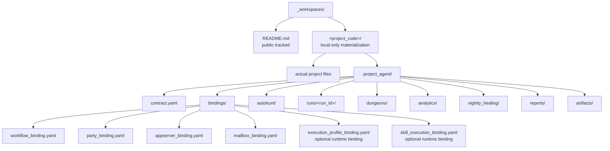

# 워크스페이스 프로젝트 모델

## 목적

- `_workspaces/<project_code>/` 직행 구조를 고정한다.
- public repo 와 local/private mission site 의 경계를 명확히 한다.
- `.project_agent/` 가 소유하는 운영 계약과 raw execution truth 의 위치를 고정한다.

## 구조 개요도



## public repo 구조

```text
_workspaces/
└── README.md
```

## local/private materialization

```text
_workspaces/
└── <project_code>/
    ├── ... actual project files ...
    └── .project_agent/
        ├── contract.yaml
        ├── bindings/
        ├── autohunt/
        ├── runs/
        │   └── <run_id>/
        ├── dungeons/
        ├── analytics/
        ├── nightly_healing/
        ├── reports/
        └── artifacts/
```

## 정본 규칙

- `_workspaces/<project_code>/` 가 실제 과제 현장 루트다.
- project 후보는 `_workspaces/<project_code>/` direct child 구조를 사용한다.
- `.project_agent/` 는 분리된 registry 가 아니라 현장 안의 운영 계약과 실행 truth 보관 위치다.
- `.project_agent/autohunt/` 는 mailbox routing, workflow-party selection, retry-escalation 같은 자동사냥 운영 정책을 두는 local operating surface 다.
- runner 는 `.project_agent/` contract, binding, workflow, party 를 읽어 current step execution packet 을 만드는 execution role 이며 별도 canonical root 나 required local folder 가 아니다.
- current local prototype 는 필요하면 `.project_agent/tools/` 아래 script 형태로 runner 역할 일부를 materialize 할 수 있다.
- `contract.yaml` 은 `.unit/<unit_id>/unit.yaml` 을 `unit_ref` 로 가리키고, binding file 은 `.workflow/<workflow_id>/workflow.yaml` 과 `.party/<party_id>/party.yaml` 을 id 기준으로 연결한다.
- binding set 은 `workflow_binding.yaml`, `party_binding.yaml`, `appserver_binding.yaml`, `mailbox_binding.yaml` 을 기본으로 두고, 필요하면 `execution_profile_binding.yaml` 과 `skill_execution_binding.yaml` 을 추가해 local runtime execution 을 설명한다.
- raw run 의 정본 owner 는 `_workspaces/<project_code>/.project_agent/runs/<run_id>/` 다.
- binding file 과 appserver/mailbox/execution operating metadata 는 orchestration contract 이며 raw truth owner 가 아니다.
- `autohunt/` 는 run queue 와 routing policy 를 다루지만 raw truth owner 가 아니다.
- `dungeons/`, `analytics/`, `nightly_healing/`, `reports/`, `artifacts/` 는 모두 local/private owner 영역이다.
- tracked contract example 은 `docs/architecture/workspace/examples/<project_code>/.project_agent/` 아래에만 둔다.

## owner 경계

- 프로젝트 실자료와 산출물은 `_workspaces/<project_code>/` 안에 남긴다.
- `.registry`, `.unit`, `.workflow`, `.party` 는 project binding 대상일 뿐, per-project 실자료 owner 가 아니다.
- tracked example contract 와 binding YAML 은 local `.project_agent/` shape 를 public-safe 하게 보여주는 mirror 일 뿐, runtime owner 가 아니다.
- tracked example 의 `runner/` packet sample 은 설명용 mirror 이며, local runtime 의 required directory 를 뜻하지 않는다.
- `execution_profile_binding.yaml` 은 workflow step 의 `execution_profile_ref` 를 model, reasoning, attached skill name, MCP/tool preference 로 resolve 하는 local runtime metadata 다.
- `skill_execution_binding.yaml` 은 canonical `skill_id` 를 installed Codex skill name 으로 resolve 하는 local runtime metadata 다.
- `autohunt/policy.yaml`, `routing.yaml`, `mailbox_rules.yaml` 은 monster routing 과 자동사냥 운영 정책을 설명하는 local operating metadata 다.
- `.workflow/history` 와 `.party/stats` 에 public repo 로 올라올 수 있는 것은 curated summary 뿐이다.
- raw execution truth 를 public repo 루트로 재배치하는 `.run/` 모델은 사용하지 않는다.

## 보안과 추적 정책

- public repo 에서는 `_workspaces/README.md` 만 추적한다.
- 실제 `<project_code>` 와 그 하위 파일은 local environment 에서만 materialize 한다.
- canonical 문서에는 실제 project code, 외부 로컬 경로, private workspace 경로 예시를 적지 않는다.
- validator 는 public-safe mode 와 opt-in local scan 을 구분해 동작한다.
