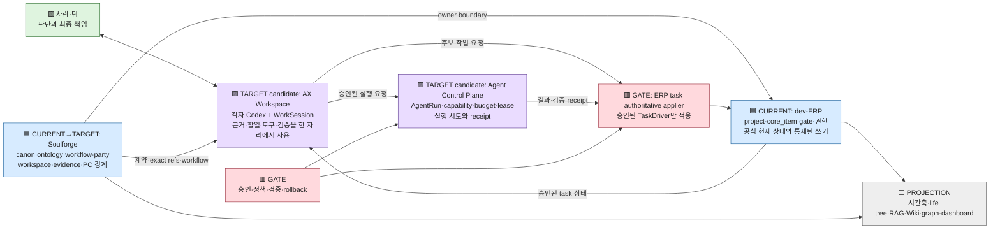
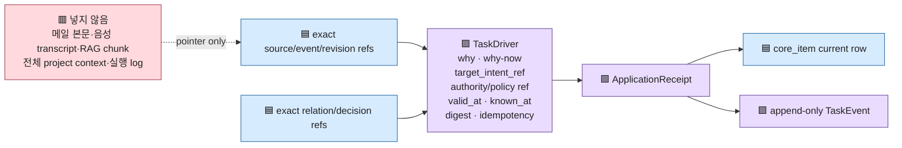
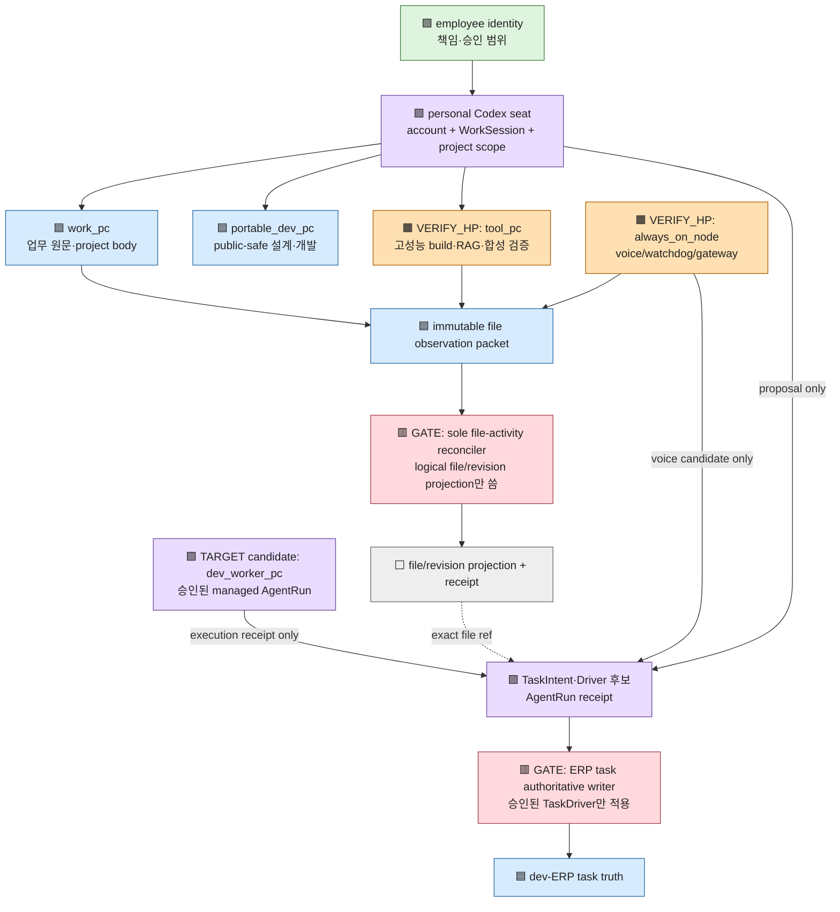

# AX Workspace × 할일 엔진 통합 비교·검증 계획 V0

- 상태: `comparison_candidate`
- 작성 기준일: `2026-07-14`
- 목적: 최초 dev-ERP 설계, 맥미니에서 만든 할일 엔진 계획, 현재 `main`, 고성능 PC 구현 branch를 **수정하지 않고** 대조한다.
- authority: 이 문서는 비교 지도와 검증 계획이다. 기존 계획을 대체하거나 runtime·DB·운영 권한을 만들지 않는다.
- 중단선: 구현, 데이터 변경, branch 통합, live DB pilot, writer/scanner/scheduler/network 활성화는 별도 owner 승인 전 수행하지 않는다.

## 0. 가장 중요한 결론

1. 최초 설계의 중심인 **진실 1개, 파생 view, 사건 이력, 파일 포인터, AI 제안과 사람 승인**은 큰 방향에서 유지됐다.
2. 기능이 늘며 `core_item`, `store.mjs`, `server.mjs`에 인입·판단·근거·동기화 책임이 몰렸다. 현재 `main`의 `event_log`만으로는 원자적 적용과 완전 replay를 보장하지 못한다.
3. 맥미니 계획의 TaskDriver 재설계는 최초 설계를 버리는 새 방향이 아니라, 비대해진 할일 엔진을 **얇은 현재 상태 + 명시적 인과·승인·사건 기록**으로 복구·확장하는 방향이다.
4. 고성능 PC branch에는 exact ID, project-local RAG, TaskDriver, 두 상태축, replay, opt-in SQLite adapter의 합성 구현이 있다. 그러나 최신 `main`과 아직 합쳐지지 않았고 live TaskDriver DB·멀티 PC 운영은 검증되지 않았다.
5. 이 문서는 AX Workspace를 ERP 대체물이 아니라 **사람과 각자의 Codex가 같은 근거로 일하는 proposed target**으로 둔다. ERP의 공식 상태·통제된 쓰기와 Soulforge의 계약·관계·오케스트레이션 경계를 유지하는 설계 가설이며, owner 승인 전 canon 명칭이나 확정 구조가 아니다.

## 1. 불변 비교 기준선

이 문서가 잘 만들어졌는지는 아래 기존 자료와 비교해 판단한다. 이 자료들은 이 문서 작성 과정에서 편집하지 않는다.

| 기준선 | exact ref | 이 문서에서의 용도 |
| --- | --- | --- |
| 최초 dev-ERP 설계 | commit `2ab4a28149ee03c5f889923581c7c6eebe2fbd37`; [`DESIGN.md`](DESIGN.md) 최초판 | 최초 철학과 데이터 최소형 |
| 현재 dev-ERP 설계 | 현재 [`DESIGN.md`](DESIGN.md) | 이후 확장과 현재 owner 경계 |
| root lifecycle | [`PROJECT_TASK_ENGINE_LIFECYCLE_V0.md`](../../../../docs/architecture/workspace/PROJECT_TASK_ENGINE_LIFECYCLE_V0.md) | 상위 task lifecycle authority |
| 맥미니 할일 엔진 계획 | commit `6eb2409d5a543bf06b2f544bfa72c3ba5bf28e49`; [`task_engine_redesign/README.md`](task_engine_redesign/README.md)와 `01`~`10` | 불변 계획 oracle |
| 실행 packet | [`ENGINE-13`](slices/ENGINE-13-TASK-DRIVER-CLOSED-LOOP.md) | 구현·검증 acceptance |
| 기존 개인/중앙 Codex 작업면 | [`CODEX_TEAM_WORKSPACE.md`](CODEX_TEAM_WORKSPACE.md), [`ERP-MCP-V0`](slices/ERP-MCP-V0.md), [`dev-erp-mcp README`](../../dev-erp-mcp/README.md) | AX target이 대체하지 말아야 할 현행 surface |
| 개발 예정 저장 authority | [`DEVELOPMENT_ROADMAP_V0.md`](../../../../docs/architecture/foundation/DEVELOPMENT_ROADMAP_V0.md) | owner 승인 전 candidate의 위치·우선순위 |
| 현재 public code snapshot | `main` commit `27ea53198fd01a283558c8b809184b82d3f002a2` | 현행 구현 비교점 |
| 고성능 PC 구현 snapshot | `origin/codex/task-engine-rag-v1` commit `927b3fb045ebf749077951417463c47f12a549bd` | 합성 구현 및 pilot 보고 비교점 |

기준선 무변경 확인 명령은 다음과 같다. 현재 `main`에서는 exit `0`을 확인했다. 고성능 PC
구현 branch는 기존 `README`, `08`, `ENGINE-13`을 수정하고 `11`을 추가했으므로 현재는 이
관문을 통과하지 않는다. 이는 구현 실패가 아니라 **새 owner 지시 기준의 문서 drift**다. branch
통합 결과에서는 구현 상태를 이 문서 같은 별도 후속 문서로 옮기고 아래 명령이 다시 exit `0`이
되어야 한다.

```bash
git diff --exit-code 6eb2409d5a543bf06b2f544bfa72c3ba5bf28e49..HEAD -- \
  docs/architecture/workspace/PROJECT_TASK_ENGINE_LIFECYCLE_V0.md \
  ui-workspace/apps/dev-erp/docs/slices/ENGINE-13-TASK-DRIVER-CLOSED-LOOP.md \
  ui-workspace/apps/dev-erp/docs/task_engine_redesign
```

기준선에 보완이 필요해도 원문을 고치지 않는다. 별도 후속 문서와 새 commit으로 차이를 기록한다.

최초판 자체는 다음처럼 exact commit에서 읽는다. 현재 working tree의 `DESIGN.md` 링크를 최초판으로 오해하지 않는다.

```bash
git show 2ab4a28149ee03c5f889923581c7c6eebe2fbd37:ui-workspace/apps/dev-erp/docs/DESIGN.md
```

고성능 PC에서는 먼저 drift를 숨기지 말고 다음 명령으로 이름만 기록한다.

```bash
git diff --name-status 6eb2409d5a543bf06b2f544bfa72c3ba5bf28e49..origin/codex/task-engine-rag-v1 -- \
  docs/architecture/workspace/PROJECT_TASK_ENGINE_LIFECYCLE_V0.md \
  ui-workspace/apps/dev-erp/docs/slices/ENGINE-13-TASK-DRIVER-CLOSED-LOOP.md \
  ui-workspace/apps/dev-erp/docs/task_engine_redesign
```

## 2. 색과 판정 언어

| 표식 | 판정 | 의미 |
| --- | --- | --- |
| 🟦 `CURRENT` | 확인된 현행 | tracked 문서·코드에서 직접 확인 |
| 🟪 `TARGET` | 목표 | 승인 후 도달하려는 계약·구조 |
| 🟧 `VERIFY_HP` | 현장 확인 | 고성능 PC의 실제 checkout·DB·binding·운영 상태 필요 |
| 🟥 `GATE` | 중단 | owner 승인이나 선행 검증 전 쓰기·활성화 금지 |
| 🟩 `PRESERVED` | 최초 의도 보존 | 최초 설계가 현재 구조에도 살아 있음 |
| ⬜ `PROJECTION` | 읽기 전용 view | 원장을 소유하지 않는 검색·표시·분석층 |

색은 보조 수단이다. 모든 표와 노드에 상태 글자도 함께 적는다.

### ASSUMPTIONS

- `AX Workspace`는 두 영상에서 얻은 문제의식을 설명하기 위한 **작업명**이다. 현재 public canon 명칭이 아니다.
- 현행 source-supported surface는 `CODEX_TEAM_WORKSPACE`, `ERP-MCP-V0`, `dev-erp-mcp`, 중앙 worker와 workflow job이다. AX target은 이를 폐기하지 않고 관계를 명확히 하는 후속 후보로 본다.
- `AgentRun`, `Agent Control Plane`, Engineering IQ loop는 owner-approved public contract가 아직 없는 TARGET candidate다. 이 문서는 구현 승인이나 roadmap 승격을 만들지 않는다.
- Enterprise IQ 영상은 formal schema나 인과 검증이 아니고, AI-native-company 영상도 self-reported case study다. 두 영상은 pressure test와 후보 아이디어로만 사용한다.

## 3. ERP, proposed AX Workspace, Soulforge의 배치 가설



### 3.1 한 줄 책임

- **ERP**: 공식 project/task/gate/current state를 소유하고 승인된 mutation만 적용한다.
- **AX Workspace candidate**: 팀원이 자기 자리의 Codex와 함께 맥락을 찾고, 계획하고, 실행하고, 검증 결과를 제출하게 하려는 후속 업무면 가설이다.
- **Soulforge**: source truth 경계, stable ID·relation, ontology, workflow, evidence, PC 역할을 공통 계약으로 묶는다.
- **TaskDriver**: 어떤 task나 전이를 **왜, 왜 지금, 어떤 근거와 권한으로** 적용하는지 남기는 얇은 인과 backbone이다.
- **AgentRun candidate**: 누가 어떤 도구·모델·권한·예산으로 실제 실행을 시도했고 무엇을 검증했는지 남기려는 별도 실행 record다. public contract 승인 전 TaskDriver에 합치지 않는다.

이 자료들을 대조한 본 문서의 working hypothesis는 다음이다. owner가 확정한 doctrine이 아니다.

> 의미·지식·판단 기준은 별도 Engineering IQ 층에 있고, TaskDriver와 task/event loop는 그 판단을 업무로 적용하고 결과를 되돌려 주는 인과·실행·피드백 backbone이다.

### 3.2 영상의 문제의식과 현재 Soulforge의 대응

| 영상에서 얻은 가설 | source-supported CURRENT | 이 문서의 TARGET candidate | claim ceiling |
| --- | --- | --- | --- |
| 팀원마다 자기 AI 작업 자리가 필요 | 개인 Codex ERP MCP와 중앙 Codex worker가 이미 분리돼 있음 | 두 surface를 AX Workspace라는 사용자 경험으로 연결 | 설계 가설 |
| 조직 공통 맥락을 AI가 찾아야 함 | project workspace, RAG, Wiki, ontology, ERP current state | exact revision·relation·authority를 함께 전달 | 일부 target |
| agent 실행을 중앙에서 통제해야 함 | workflow job, worker permission probe, WorkSession receipt가 domain별로 존재 | 별도 Agent Control Plane과 AgentRun 계약 | future candidate |
| 실행 결과가 다음 판단으로 돌아와야 함 | completion/event/review surface가 분산돼 있음 | TaskDriver→task→verification→outcome→correction loop | ENGINE-13 이후 |
| 영상의 생산성·보안 주장이 사실임 | 독립 검증 자료 없음 | Soulforge pilot에서 자체 측정 | `UNKNOWN` |

## 4. 최초 설계 보존 감사

| 최초 의도 | `main`에서 관찰한 현재 | 고성능 PC branch | 판정 | VERIFY_HP |
| --- | --- | --- | --- | --- |
| 진실 1개, 업무/게임은 다른 view | `core_item.id`가 안정된 task identity이고 game 상태는 파생 | 기존 `core_item.id`를 projection target으로 유지 | 🟩 `PRESERVED` | 실제 중복 task truth·별도 장부 ID 충돌 |
| 모든 변화의 사건 이력 | `event_log`, `completion_log`, work event가 있음 | append-only Driver ledger와 replay 구현 | 🟨 부분 보존 | event 없는 writer·reopen 표본·replay parity |
| mutation과 event의 일관성 | status update와 event append가 별도 호출인 경로가 있음 | adapter는 transaction 적용을 합성 검증 | 🟪 보완 구현 | live DB에서 원자성·rollback·restore |
| 파일은 본문이 아니라 pointer/hash | `_workspaces` body, DB·metadata pointer 중심 | project-local RAG owner root와 path guard | 🟩 대체로 보존 | runtime DB의 본문 예외·raw 경계 |
| AI는 제안, 사람 승인 후 반영 | `ai_proposal`이 있으나 mail `--auto-open` 경로도 존재 | explicit authority/policy/idempotency 구현 | 🟨 계약 충돌 가능 | 실제 auto-open 활성값과 owner decision ref |
| project가 산출물 container | `project_id`, project hub, `_workspaces/<project>` | project-bound RAG와 typed ref | 🟩 `PRESERVED` | 실제 project/common 혼합·orphan |
| SE 절차와 gate가 작업 순서를 만듦 | stage/gate/deliverable/schedule surface 확장 | exact rule/event revision을 Driver 근거로 받을 수 있음 | 🟩 확장 | 실제 schedule adapter와 rule revision coverage |
| owner 단독→팀 read-only→쓰기 개방 | 문서상 단계적 활성화와 별도 gate 유지 | live writer는 의도적으로 미활성 | 🟩 정책 보존 | 실제 서비스·환경·계정 권한 |
| 고성능 PC는 검증 뒤 사용 | 별도 Plan-mode runbook 존재 | 합성 구현과 단일 RAG pilot 보고 | 🟨 진행 중 | 최신 main 통합·live TaskDriver·운영 primary |

### 4.1 구조가 커지며 생긴 부채

폴더 owner 배치는 대체로 맞다. 문제는 app 내부 책임 집중이다.

```text
🟦 CURRENT
core_item
  = 현재 작업 상태
  + SE 단계·완료 기준
  + 인입 출처·검토·라우팅 후보
  + 담당/역량 제안
  + lineage·generation·CSV sync·schedule anchor·parent

store.mjs
  = schema + migration + 여러 domain store

server.mjs
  = HTTP routing + 여러 domain application flow
```

파일 수가 많아서가 아니라, **현재 상태·판단 과정·근거·동기화 상태가 같은 행과 큰 모듈에 섞인 것**이 핵심 부채다.

TARGET 구현 시 새 top-level을 임의로 만들기보다 app 안에서 아래 책임을 분리하는 방향을 검토한다.

```text
task/        current store · transition · event · completion
intake/      mail · voice · schedule · file adapters · apply policy
agent/       WorkSession · AgentRun · managed worker · workflow job
projection/  life tree · calendar · graph · dashboard
```

이 폴더안은 구현 승인이 아니라 구조 검토안이다.

## 5. 할일 엔진 데이터 구조: CURRENT → 구현 branch → TARGET

| 책임 | 🟦 현재 `main` | 🟨 고성능 PC branch | 🟪 최종 TARGET |
| --- | --- | --- | --- |
| task current row | `core_item` 단일 상태축 | `core_item` compatibility projection | 얇은 current row + revision guard |
| task 이력 | `event_log`, `completion_log` | Driver/event append ledger + replay | 삭제 없는 `TaskEvent`와 결정적 replay |
| 후보 | `ai_proposal` 및 domain별 candidate | `TaskIntent` | 모든 input adapter가 `TaskIntent` 후보만 생성 |
| 인과·왜 지금 | 필드와 여러 이력에 분산 | `TaskDriver` 구현 | exact source/revision/relation/decision ref를 갖는 얇은 Driver |
| 판단/적용 상태 | task status와 섞이거나 domain별 | 별도 decision/application state | `candidate/review_required/approved/applied/rejected/superseded` |
| 실제 작업 상태 | `unclassified/open/doing/waiting/blocked/done/archived` | 별도 work-state validator와 legacy projection | `not_started/in_progress/waiting/blocked/done/cancelled/merged/archived`; legacy 의미는 owner 결정 |
| 적용 증거 | domain별 event/receipt | policy·digest·idempotency·SQLite adapter | `ApplicationReceipt` + atomic task mutation/event |
| 실행 시도 | workflow job, MCP WorkSession 등 분리 | TaskDriver와 아직 미통합 | owner 승인 뒤 별도 `AgentRun`, `CapabilityGrantRevision`, `VerificationReceipt` 후보 |
| 산출물 revision | `core_artifact`, deliverable, MCP artifact 등 분산 | RAG source/content revision 강화 | logical artifact와 immutable `ArtifactRevision` |
| 결과 학습 | 완료·event·review surface 분산 | follow-up candidate contract 합성 | expected→run→verify→actual→review→correction loop |

### 5.1 TaskDriver는 무엇을 담고, 무엇을 담지 않는가



TaskDriver가 모든 지식과 맥락을 복제하는 거대한 객체가 되면 revision drift, private payload 복제, 중복 truth가 생긴다. Driver는 immutable exact ref와 적용 근거만 보존하고 본문은 원 owner에서 읽는다.

### 5.2 두 상태축은 합치지 않는다

```text
TARGET 판단·적용 축:
candidate → review_required → approved → applied
    ├──────────────────────────────→ rejected
    └──────────────────────────────→ superseded

TARGET 실제 작업 축:
active = not_started | in_progress | waiting | blocked
active → done | cancelled | merged
done | cancelled | merged → archived

별도 policy/authority 유효성:
valid_from · expires_at · revocation event
  # expired/revoked는 decision_application_state 값이 아니다.

CURRENT ERP compatibility enum:
unclassified | open | doing | waiting | blocked | done | archived
  # target 두 축으로 옮길 때 정본 crosswalk와 owner 결정을 적용한다.
```

`approved`는 `doing`이 아니고, `applied`는 `done`이 아니다. 재오픈은 과거 completion occurrence를 지우지 않고 reversal/reopen event로 남기는 것이 TARGET이다.

## 6. 입력·시간·지식·실행의 전체 폐쇄루프

```mermaid
flowchart LR
  IN["🟦/🟧 입력<br/>메일·음성·SE 일정·지시·파일 관측"]
  REV["🟪 source occurrence/revision<br/>stable ID · valid_at · known_at"]
  KW["🟪 지식층<br/>Ontology · project/common RAG · Wiki"]
  INT["🟪 TaskIntent 후보"]
  DRV["🟪 TaskDriver 인과·권한"]
  APP["🟥 GATE<br/>사람 승인 또는 bounded policy"]
  TASK["🟦 ERP task current + append event"]
  RUN["🟪 TARGET candidate: AgentRun/사람 실행"]
  OUT["🟪 artifact revision + verification receipt"]
  FB["🟪 actual outcome + review + correction candidate"]
  VIEW["⬜ 시간축·life tree·graph·dashboard"]

  IN --> REV
  REV --> KW
  REV --> INT
  KW --> INT
  INT --> DRV
  DRV --> APP
  APP --> TASK
  TASK --> RUN
  RUN --> OUT
  OUT --> FB
  FB --> INT
  REV --> VIEW
  TASK --> VIEW
  OUT --> VIEW

  classDef current fill:#d7ebff,stroke:#2468a2,color:#222
  classDef target fill:#eadcff,stroke:#67459a,color:#222
  classDef verify fill:#ffe0b2,stroke:#a85b00,color:#222
  classDef gate fill:#ffd9dd,stroke:#a23b49,color:#222
  classDef view fill:#eeeeee,stroke:#666,color:#222
  class IN current
  class REV,KW,INT,DRV,RUN,OUT,FB target
  class APP gate
  class TASK current
  class VIEW view
```



### 6.1 각 지식 도구가 맡을 일

| 도구 | 맡을 일 | 맡으면 안 되는 일 |
| --- | --- | --- |
| RAG | exact source revision의 관련 구간 검색과 locator 반환 | source truth, 승인, task state 대체 |
| Wiki | 사람이 읽는 개념·결정·절차의 source-bound 설명 | 근거 없는 공통 상식으로 canon 덮기 |
| Ontology | 요구사항·기능·인터페이스·위험·검증·결정 관계 | 원문이나 업무 current row 복제 |
| Workflow | gate·적용 조건·stop condition·반복 절차 | owner authority 없이 자동 적용 |
| TaskDriver | 근거·판단·권한과 task mutation의 인과 연결 | 본문·전체 context·AgentRun log 저장 |
| ERP | 승인된 current state와 task mutation | 모든 지식·모델 학습 저장소가 되기 |
| Agent Control Plane candidate | owner 승인 뒤 모델·도구·권한·budget·execution receipt | task의 왜와 task truth 소유 |

RAG만으로 “체계공학을 학습했다”고 말할 수 없다. RAG는 검색 가능한 기억이다. Engineering IQ에 가까워지려면 의미 관계, authority, 적용 조건, 대안과 기각 사유, expected→actual→correction loop가 함께 있어야 한다.

### 6.2 머신러닝은 첫 관문이 아니다

1. **지금 필요한 핵심**: stable ID, exact revision, relation, rule/gate, TaskDriver, receipt, replay, review candidate.
2. **그 다음 운영 학습**: 사람이 승인한 판단과 outcome으로 rule·workflow·Wiki·ontology 후보를 개선한다.
3. **나중의 모델 학습 후보**: 충분한 품질의 outcome label과 명확한 예측 목표가 있을 때 ranking/classification/fine-tuning을 검토한다.

즉 Engineering IQ의 초기 형태는 “큰 모델을 새로 학습”하는 것이 아니라, 조직의 판단을 근거와 결과까지 재생 가능한 harness로 만드는 것이다. 모델 학습은 이 데이터가 쌓인 뒤 특정 성능 문제가 확인될 때만 채택한다.

### 6.3 아홉 영역을 한눈에 보는 CURRENT / TARGET / VERIFY_HP

| 영역 | 🟦 CURRENT | 🟪 TARGET | 🟧 VERIFY_HP |
| --- | --- | --- | --- |
| 메일 | `core_mail`, 수집 이력, review/auto-intake surface가 있으나 causal ref가 분산됨 | exact message occurrence와 revision에서 TaskIntent 후보 생성 | mailbox coverage, 누락 구간, 실제 auto-open caller·policy |
| 음성 | capture/transcript provenance와 후보 surface가 별도 흐름으로 존재 | recording→transcript revision→발화 locator를 잇고 후보만 전달 | Mac mini primary, speaker/project binding, 중복·누락·시간 정렬 |
| SE 일정 | stage/gate/schedule/rule 계약은 있으나 통합 causal loop가 없음 | exact rule/event revision을 `why-now` 근거로 사용 | 실제 일정 owner, rule revision, gate가 만든 task와 event parity |
| 파일 이력 | workspace file, artifact, deliverable, MCP artifact가 여러 surface에 나뉨 | logical file/artifact와 immutable revision, content ID, observation 분리 | PC별 관측 중복, 삭제 authority, sole reconciler, orphan revision |
| 시간축 | ENGINE-12와 여러 source-local timestamp가 read model 기반을 가짐 | `valid_at`/`known_at` cut으로 source·Driver·task·outcome 재생 | ledger gap, clock regression, timezone·source capability |
| RAG·Wiki | common-root legacy와 project별 자료가 혼재하며 main에는 V1 branch가 없음 | project/common owner 분리, exact revision locator, source-bound Wiki | legacy consumer map, derived-text V1, query/ref parity, ACL |
| ID·관계 | `core_*` ID와 domain ref는 있으나 source/RAG/task exact chain이 분산됨 | typed stable ID로 source→revision→relation→Driver→task→outcome 연결 | legacy occurrence·ERP ID crosswalk, collision·fuzzy join 비율 |
| TaskDriver | 현재 `main`에는 통합 Driver/two-axis runtime이 없음 | 얇은 causal record, authority, atomic apply, event, replay | branch 통합, live schema, 상태 의미, writer identity, 1~3 task pilot |
| PC 역할 | 문서상 역할과 personal MCP가 있으나 실제 primary/binding은 local state | 사람·seat·node·worker·reconciler ID를 분리하고 writer 하나만 허용 | `tool_pc`, `always_on_node`, operational-primary, sole reconciler 증거 |

## 7. 파일·저장소 구조

```text
🟦 public Git: Soulforge/
├─ AGENTS.md                                  # 현재 최상위 agent 지침
├─ docs/architecture/foundation/              # ID·ontology·roadmap·실행 계약
├─ docs/architecture/workspace/               # workspace·task lifecycle authority
├─ .registry/ · .unit/                        # species/class와 active subject canon
├─ .workflow/ · .party/ · .mission/           # 실행 계약·재사용 orchestration·held plan
├─ guild_hall/                                # cross-project public contract·runner·RAG 도구
└─ ui-workspace/apps/
   ├─ dev-erp/                                # ERP current state·task plane·UI
   │  ├─ src/ · server.mjs · tools/ · test/
   │  └─ docs/
   │     ├─ task_engine_redesign/             # 🔒 맥미니 불변 계획 기준선
   │     ├─ slices/ENGINE-13...                # 🔒 실행 acceptance 기준선
   │     └─ AX_WORKSPACE...V0.md               # 이 별도 비교·검증 계획
   └─ dev-erp-mcp/                            # 개인 Codex WorkSession pilot

🟨 local/private payload: _workspaces/<project_code>/
├─ 실제 원문·첨부·transcript·파생 본문
├─ 프로젝트 산출물과 immutable revision body
└─ reference_payloads/rag/                    # project-local RAG target

🟦 private metadata: _workmeta/<project_code>/
├─ metadata-only contract·source/file revision metadata
├─ pointer·digest·count·relation·owner decision·receipt
└─ redacted validation log·review·worklog·procedure evidence  # raw/source body 금지

🟦 system evidence: _workmeta/system/runs/<run_id>/
└─ Git baseline·schema/writer inventory·validator exit·review pointer

🟥 local-only cross-project runtime: guild_hall/state/**
└─ active ingress·operations·local binding; public Git 금지

🟥 cross-PC protected mirror: private-state/
└─ 승인된 continuity subset만 mirror·sync; active runtime truth로 임의 사용 금지
```

### 7.1 저장 규칙

- public Git: 안정된 계약, 구현 코드, 합성 fixture/test, 식별정보를 제거한 상태 문서만 저장한다.
- `_workspaces`: 실제 업무 본문과 파일 body를 저장한다.
- `_workmeta`: metadata-only contract, pointer, digest, count, relation, decision, receipt와 redacted validator/review/worklog evidence를 저장한다. raw/source body는 저장하지 않는다.
- `guild_hall/state`: 이 PC의 local-only cross-project runtime state를 저장한다.
- `private-state`: 다른 PC로 넘길 승인된 protected continuity subset을 mirror한다.
- RAG index/chunk도 project payload이면 `_workspaces/<project_code>` owner 아래 둔다.
- 실제 project code/name, 메일 제목·주소·본문, transcript, 파일명·절대경로, hostname/IP/account, credential은 이 public 문서나 public 검증 로그에 쓰지 않는다.

## 8. PC와 개인 Codex 자리

물리 PC, 사람, Codex 계정, runtime role은 같은 ID가 아니다.



### 8.1 권장 역할

| 역할 | 권장 책임 | 금지 또는 gate |
| --- | --- | --- |
| 직원 자리의 Codex | 검색, 계획, draft, candidate, 선택된 task 실행, verification 제출 | owner authority 없는 task apply·공식 산출물 승격 |
| work_pc | 업무 원문과 project body의 사람 작업 | 다른 project/private body 무단 수집 |
| portable_dev_pc | public-safe 문서·합성 코드·리뷰 | private binding 추정, live writer 활성화 |
| 고성능 `tool_pc` | 최신 main 통합 검증, RAG build, 합성 replay, bounded pilot 준비 | operational-primary를 hostname으로 추정 |
| Mac mini `always_on_node` 후보 | voice capture/watchdog/gateway, source-local event | 직접 ERP task 생성, file reconciler나 task writer 자임 |
| managed worker | 승인된 AgentRun candidate와 receipt | TaskDriver/ERP와 별도 task truth 생성, direct task write |
| sole file-activity reconciler | node observation에서 logical-file/revision current state, projection, receipt만 씀 | `core_item`, TaskDriver, mail/source truth write |
| ERP task authoritative writer/TaskDriver applier | 승인된 Driver를 atomic task mutation+event로 적용 | file reconciler 권한을 빌리거나 둘 이상의 task writer 허용 |

한 물리 고성능 PC가 `tool_pc`와 `always_on_node`를 겸할 수는 있지만 clone, identity, writer authority를 논리적으로 분리하고 실제 primary는 VERIFY_HP에서 증명해야 한다. file-activity reconciler가 같은 PC에 있어도 ERP task write 권한이 자동으로 생기지 않는다.

## 9. 고성능 PC 구현 snapshot 평가

2026-07-14 읽기 전용 Git 대조 기준으로 구현 branch는 `main`보다 `17` commits 뒤, `2` commits 앞이다. `CHANGELOG.md`에는 통합 충돌 가능성이 관찰됐다. 따라서 branch를 곧바로 live checkout에 합치지 않는다.

### 9.1 확인된 public 구현

- `ID_CONTRACT_V1`과 canonical JSON·typed ref·deterministic ID helper
- project-local RAG path guard, legacy migration dry-run, pilot bundle, exclusive writer, readback, rollback
- TaskIntent, TaskDriver, authority/policy, 두 상태축, idempotency, deterministic replay
- 명시적으로 설치해야 하는 SQLite persistence adapter
- append-only Driver table과 `core_item` projection의 transaction 적용
- source cutoff와 current-row drift 검증

### 9.2 보고됐지만 live TaskDriver 완료 증거는 아닌 것

- focused validator `91 passed, 0 failed`는 private review packet의 보고값이다.
- 단일 승인 project의 RAG apply→rollback→reapply→no-op 통과는 RAG pilot claim이다.
- 실제 dev-ERP live TaskDriver DB write, scheduler, scanner, multi-PC transport, alert는 수행·활성화되지 않았다.

### 9.3 통합 전 반드시 해결할 차이

| 차이 | 현재 관찰 | 필요한 결정·검증 |
| --- | --- | --- |
| 불변 계획 drift | branch가 기존 `README`, `08`, `ENGINE-13`을 수정하고 `11` 상태 문서를 같은 계획 폴더에 추가 | 구현 code와 상태 보고를 분리하고, integration 결과의 기존 계획 tree는 `6eb2409d`와 byte-identical하게 유지 |
| legacy terminal state | branch projection은 `cancelled`, `merged`, `archived`를 모두 `core_item.status=archived`로 접음 | UI에서 Driver state를 따로 보일지, 적용을 막을지, enum을 확장할지 owner 결정 |
| `unclassified` | persistence mapping에서 fail-closed | 기존 row migration/적용 의미 결정 |
| `field_patch` | intent는 있으나 apply 미지원 | V0 제외 또는 bounded patch 계약 |
| RAG reader switch | derived-text V1 target이 없어 hold | query/ref parity와 rollback 뒤 별도 승인 |
| 최신 main 기능 | 개인 ERP MCP와 report workflow가 branch 이후 main에 추가 | WorkSession/workflow job과 Driver/AgentRun 통합 회귀 |
| event 원자성 | main status mutation과 event append가 분리된 경로 | adapter 경유 단일 transaction·fail closed |
| reopen evidence | 최신 completion occurrence를 삭제하는 경로 | immutable completion + reopen/reversal event |
| AI candidate-only | 문서 불변 가드와 mail `--auto-open` 경로가 병존 | 실제 policy authority·expiry·revocation·활성값 확인 |
| PC 개발 규칙 | 일부 이전 문서와 현재 root `AGENTS.md`의 branch/main 규칙이 다름 | 현재 최상위 authority 기준으로 별도 문서 drift 정리 |

## 10. 고성능 PC 검증 matrix

결과는 public 문서에 실제 업무값을 복사하지 말고 private metadata evidence에 기록한다.

```text
claim_id | claim | baseline_ref | command_or_query | exit
observed_count_or_shape | expected | PASS/FAIL/BLOCKED/UNKNOWN
claim_ceiling | rollback_point | evidence_ref | owner_decision_ref
```

Git topology와 validator는 command-family가 아니라 다음 exact command로 기록한다.

```bash
git rev-parse main origin/main origin/codex/task-engine-rag-v1
git merge-base origin/main origin/codex/task-engine-rag-v1
git rev-list --left-right --count origin/main...origin/codex/task-engine-rag-v1

# integration 후보에서만 존재해야 하며 모두 exit 0이 acceptance다.
npm run validate:task-engine-rag-v1
npm run ui:docs:check
npm run ui:done:check
npm run done:check
```

이 문서 작성 snapshot의 기대값은 local `main`과 `origin/main`이 `27ea53198fd01a283558c8b809184b82d3f002a2`, branch가 `927b3fb045ebf749077951417463c47f12a549bd`, merge-base가 `15e988b4cdbd5db7a34eb580f754db7c3aa508cc`, count가 `17 2`다. `validate:task-engine-rag-v1`은 현재 `main`에 아직 없으므로 integration 전 `MISSING`이 정상이고, integration 후보에서는 command 존재와 exit `0`이 필수다.

| ID | 질문 | 현재 기대 | read-only 또는 synthetic evidence | 현재 판정 |
| --- | --- | --- | --- | --- |
| HP-01 | exact main/branch/merge-base가 무엇인가 | baseline ref와 observed ref를 모두 고정 | 위 세 exact Git 명령과 exit·stdout hash/count | 🟧 `VERIFY_HP` |
| HP-02 | 기존 맥미니 계획이 한 byte도 바뀌지 않았나 | integration 결과에서 기준선 diff exit `0` | §1 두 명령 | 🟩 현재 `main` PASS; 🟥 HP branch drift 확인 |
| HP-03 | isolated clean worktree와 index lock가 안전한가 | dirty·overlap·lock 없음 | status/worktree/lock inventory | 🟧 `VERIFY_HP` |
| HP-04 | 실제 checkout·service·DB path가 같은 revision인가 | runtime identity exact match | process/config pointer만, secret 금지 | 🟧 `VERIFY_HP` |
| HP-05 | 실제 `core_item`/event/completion schema는 무엇인가 | public schema와 crosswalk 가능 | SQLite read-only/query-only schema; `openStore()` 금지 | 🟧 `VERIFY_HP` |
| HP-06 | task truth writer가 정확히 하나인가 | sole writer | 모든 `setItemStatus`, insert, `--auto-open`, ledger writer caller | 🟥 `GATE` |
| HP-07 | status 의미와 count가 유효한가 | unknown/invalid 없음 | status별 count만; title/body 출력 금지 | 🟧 `VERIFY_HP` |
| HP-08 | event 없이 바뀐 task가 있는가 | mutation/event parity | done/reopen/re-done와 writer별 aggregate | 🟧 `VERIFY_HP` |
| HP-09 | LLM/규칙 auto-open이 실제 켜졌나 | candidate-only 또는 exact bounded policy | env는 값 노출 없이 on/off, authority ref·expiry·revocation | 🟥 `GATE` |
| HP-10 | 메일·음성·SE 일정·파일 occurrence가 exact revision을 갖나 | source별 stable typed ref | coverage·누락·중복 count | 🟧 `VERIFY_HP` |
| HP-11 | `valid_at`/`known_at`이 분리되고 clock regression이 없나 | 재생 가능한 time cut | null/regression/ordering count | 🟧 `VERIFY_HP` |
| HP-12 | legacy RAG가 project/common으로 분류되나 | unresolved/collision 없음 | migration dry-run·consumer map | 🟧 `VERIFY_HP` |
| HP-13 | RAG apply/readback/rollback/reapply가 안전한가 | 동일 bundle no-op | approved synthetic + one-project evidence | 🟨 RAG pilot reported |
| HP-14 | 최신 main에서 TaskDriver validator가 통과하나 | `npm run validate:task-engine-rag-v1` exit `0` | integration 전 script 부재, 후보에서 command/exit 고정 | 🟧 `VERIFY_HP` |
| HP-15 | live DB 설치 전 backup/restore가 검증됐나 | hash pointer·restore drill pass | metadata-only receipt | 🟥 `GATE` |
| HP-16 | 1~3개 task가 closed loop를 통과하나 | candidate→approve→apply→start→done→follow-up candidate | owner-approved bounded pilot | 🟥 별도 승인 |
| HP-17 | replay 결과와 current row가 같은가 | deterministic parity | ledger replay vs aggregate/digest | 🟥 pilot acceptance |
| HP-18 | 개인 MCP WorkSession이 직접 task를 쓰나 | candidate/receipt only | API/DB writer trace | 🟧 `VERIFY_HP` |
| HP-19 | AgentRun과 TaskDriver가 분리됐나 | owner 승인 뒤 separate IDs/authority/receipts | schema/API relation crosswalk | 🟪 `TARGET candidate` |
| HP-20 | `tool_pc`/`always_on_node`/sole file-activity reconciler가 명시됐나 | logical identity와 file projection writer 하나 | node profile·binding pointer; task write 권한 없음 확인 | 🟥 `GATE` |
| HP-20B | ERP task authoritative writer/TaskDriver applier가 별도로 하나인가 | atomic task writer 하나, file reconciler와 권한 분리 | process/API/DB writer inventory와 authority ref | 🟥 `GATE` |
| HP-21 | full dev-ERP/root/docs 검증이 통과하나 | 위 네 npm command exit `0` | exact stdout/exit·timeout·skipped reason 포함 | 🟧 `VERIFY_HP` |
| HP-22 | rollback 후 owner state가 원상 복구되나 | DB·RAG·writer state 불변 | restore/readback·fresh review | 🟥 activation gate |

## 11. 연속 개발 순서


### G0 — 기준선 동결

- 이 문서와 기존 계획의 commit/blob ref를 기록한다.
- 기존 계획 경로에는 통합 결과나 HP 실측값을 덮어쓰지 않는다.

### G1 — branch 통합 계획

- 최신 `main` 기준 isolated worktree에서 merge/rebase 후보를 만든다.
- `CHANGELOG`, 개인 MCP, report workflow, root docs의 충돌을 수동 crosswalk한다.
- branch의 구현 code/test는 검토하되 기존 계획 파일 수정은 가져오지 않는다. 구현 상태·resume 정보는 이 문서 또는 별도 신규 상태 문서로 분리한다.
- 통합 후보에서 §1 기준선 diff가 exit `0`인지 다시 확인한다.
- 이 단계는 코드 통합 승인 뒤에만 수행한다.

### G2 — public synthetic 재검증

- ID collision/canonicalization, path traversal/project isolation, Driver state, authority, idempotency, replay, stale revision을 검증한다.
- 전체 dev-ERP/root/docs regression과 fresh non-implementer review를 함께 닫는다.

### G3 — private read-only inventory

- 실제 DB는 read-only/query-only로 열고 table/column/index/count만 본다.
- 모든 task writer, auto-open caller, source revision coverage, RAG consumer, PC role을 inventory한다.

### G4 — owner 결정

- `cancelled/merged/archived`, `unclassified`, auto-apply scope, policy expiry/revocation, sole file-activity reconciler와 별도 ERP task authoritative writer를 결정한다.
- project/raw/hash/path ACL과 pilot 범위를 승인한다.

### G5 — 한 project의 작은 live pilot

- backup→schema install dry-run→1~3 task→replay→restore를 한 묶음으로 검증한다.
- scanner, scheduler, external upload, broad migration은 포함하지 않는다.

### G6 — AX Workspace candidate pilot

- owner가 public contract와 명칭을 승인한 뒤 팀원 1~2명의 personal Codex seat에 project scope와 WorkSession을 연결한다.
- Codex는 candidate와 AgentRun 후보 receipt를 만들고 ERP 쓰기는 승인된 task authoritative writer 한 경로만 사용한다.

### G7 — Engineering IQ candidate 확장

- requirement→function→interface→risk→decision→baseline→verification→outcome→correction exact trace를 추가한다.
- 대안과 기각 사유, expected/actual 차이, review correction을 procedure learning candidate로 남긴다.
- 충분한 labeled outcome이 쌓이기 전 model fine-tuning을 기본 전제로 두지 않는다.

### G8 — 운영 활성화

- multi-PC transport, always-on writer, scheduler, notification, 팀 쓰기 권한은 별도 운영 승인으로 연다.

## 12. owner가 이해하고 결정할 다섯 가지

1. **AX Workspace candidate 채택 여부**: 이 작업명을 canon으로 채택할지, 기존 ERP Codex 팀 작업실의 확장명으로만 둘지, ERP 화면과 personal Codex sidecar 중 어느 쪽을 주 작업면으로 둘지.
2. **상태 의미**: `cancelled`, `merged`, `archived`, `unclassified`를 UI와 DB에서 어떻게 구분할지.
3. **쓰기 권한**: 사람 승인만 허용할지, 어느 bounded deterministic policy까지 auto-apply할지.
4. **PC 역할**: Mac mini voice primary, 고성능 tool engine, always-on operational primary, sole file-activity reconciler와 별도 ERP task authoritative writer를 어떤 logical identity로 둘지.
5. **첫 pilot**: 어떤 한 project와 1~3개 합성 또는 owner-approved task로 closed loop를 증명할지.

이 다섯 결정 전에도 G0~G3의 읽기 전용·합성 조사는 가능하다. G4 이후 mutation과 운영 활성화는 별도 승인이 필요하다.

## 13. 증거 강도와 UNKNOWN

### source-supported

- 최초 설계의 one truth/view/event/pointer/proposal 원칙
- 현재 `main`의 core task/event/proposal/MCP/workflow surface
- 고성능 PC branch의 ID/RAG/TaskDriver source code와 commit topology
- 맥미니 계획의 cold-start, dry-run, pilot, approval stop 순서

### reported, not independently re-run here

- focused validator `91 passed, 0 failed`
- 한 project RAG apply→rollback→reapply→no-op pilot 통과

### contradicted or drifted

- AI candidate-only 불변 문구와 `--auto-open` 적용 경로
- completion 이력 내구성 문구와 reopen 시 latest completion 삭제 경로
- 일부 이전 PC 개발 규칙과 현재 root `AGENTS.md`의 main 작업 규칙

### UNKNOWN / VERIFY_HP

- 실제 high-performance checkout·service·DB와 branch의 일치
- 실제 task writer 수, auto-open 활성값, source coverage, live status 의미
- operational-primary, sole file-activity reconciler, ERP task authoritative writer, actual private binding
- live TaskDriver atomicity/replay/restore와 personal MCP 통합

가장 약한 핵심 증거가 live runtime에서 `UNKNOWN`이므로, 전체 claim ceiling은 `comparison_candidate`다. 이 문서만으로 production-ready, Engineering IQ 완성, 팀 AX 활성화를 주장하지 않는다.

## 14. 승인 전 멈춤 조건

다음 중 하나라도 해당하면 조사·계획까지만 하고 멈춘다.

- 기존 계획 파일을 수정해야 한다.
- dirty/divergent worktree, overlapping edit, index lock, unknown runtime revision이 있다.
- private binding·raw payload·secret을 읽거나 public 위치로 복사해야 한다.
- task truth writer가 둘 이상이거나 ERP task authoritative writer가 불명확하다.
- sole file-activity reconciler가 둘 이상이거나 task/source truth write 권한과 섞여 있다.
- backup/rollback/replay가 없는데 DB schema나 row를 변경해야 한다.
- exact source revision, Driver authority, policy expiry/revocation, idempotency가 없다.
- owner가 정하지 않은 상태 의미를 migration에서 임의로 합쳐야 한다.
- RAG collision/unresolved consumer/path escape가 남아 있다.
- scanner, scheduler, network, alert, broad corpus migration을 켜야 한다.
- 합성 또는 한 project acceptance가 실패한다.

이 문서의 다음 행동은 고성능 PC에서 §1과 §10을 읽기 전용으로 채우는 것이다. 구현·데이터 변경·운영 활성화는 그 결과를 owner가 검토하고 승인한 뒤 별도 slice로 시작한다.
