# Task Engine + AX Workspace 구축 마스터플랜 V0

| 항목 | 값 |
| --- | --- |
| 문서 상태 | `PILOT_EXECUTED_PRODUCTION_HOLD` |
| 기준일 | 2026-07-15 |
| 기준 public ref | `main@9df7e57765d818be65f6250da8435826d0a2eea2` (계획 보정 최초 관찰 당시 `origin/main`과 동일; 현재 HEAD 주장 아님) |
| P1 readiness 재검토 ref | `main@16190bff6c1dd9e101c11a078b97e84f1c1c43ea` (후속 관찰 당시 `origin/main`과 동일; 현재 HEAD 주장 아님); H00 candidate와 H02~H05 public 코드·계약만 후속 대조 |
| 비교 candidate ref | `codex/task-engine-rag-v1@927b3fb045ebf749077951417463c47f12a549bd` |
| correction input | owner-designated untracked 원본 SHA-256 `BC574E07249B4B4E73DB3BED3879CCC04A3445E63CEAB823771287BEBE0787BC`; 기존 내용을 유지한 순차 단일-writer diff의 기준 |
| correction goal | `TASK-ENGINE-PLAN-CORRECTION-V1`을 보존하고 `TASK-ENGINE-INGRESS-TEAM-KNOWLEDGE-PLAN-CORRECTION-V1`에서 ingress·personal WorkSession·team query/knowledge를 최소 diff로 후속 보정 |
| HPP MCP/storage/access correction | owner-confirmed logical topology freeze와 HPP private custody, brokered MCP control/authenticated HTTPS binary plane, artifact/revision/action ACL을 기존 P0→P10에 non-unlocking addendum으로 통합 |
| 2026-07-18 owner role correction | HPP를 central ingress/custody·voice processing·Task Engine/AX 정상 operational-primary TARGET으로, 맥미니를 temporary failover/fallback으로 지정; live binding·writer cutover는 여전히 `VERIFY_HP/G01` |
| [2026-07-19 five-lane bounded pilot execution](TASK_ENGINE_HPP_FIVE_LANE_INGRESS_PILOT_V1_RESULT.md) | actual mail·voice·PC work·file·run/log 1건씩을 HPP 격리 custody에 수집하고 `P26-016` actual Shadow 5 event/5 coverage, copied ERP, tracked CSV/XLSX projector·query-only verifier, temporary localhost MCP query/download, explicit project/common metadata-only RAG preview까지 feature-OFF로 실행·검증; P0·H00·H01~H06·P1 owner acceptance, accepted/current pointer, production writer/migration/live activation은 계속 `HOLD` |
| 2026-07-23 communication-history correction | 팀원·owner의 받은메일과 보낸메일을 한 logical mail occurrence+계정별 mailbox observation으로 결합하고, owner-approved Slack `channel_id→project_code` binding을 project-context 입력으로 추가하는 plan-only addendum. 팀원 보낸편지함 수집원·Slack app/token/channel allowlist는 `UNKNOWN/VERIFY_HP`; collector·DB·Slack app·live writer 활성화 `0` |
| 2026-07-23 cross-input label correction | mail·voice·Slack·structured PC work·file·run/log가 제각각 project/time/person/action label을 만들지 않도록 공통 사실 envelope와 별도 semantic annotation event를 고정하는 plan-only addendum. 기존 source-native field와 ID는 보존하고, 중앙 context labeler만 shared vocabulary를 사용한다. schema·DB·collector·labeler·TaskDriver live 변경 `0` |
| 2026-07-23 all-source data foundation execution | H01C mail occurrence/observation, H02 approved-window strong ASR, H03A personal WorkSession, H03B synthetic schedule, H04 file adapter, H05 exact run receipt, H07 Slack revision/cursor의 public-safe feature-OFF 기반을 구현했다. 상태는 `source_foundation_exists_acceptance_hold`; actual private source binding, 공통 label runtime, H00/H01~H07/P1 acceptance, DB migration, collector·writer·service 활성화 `0` |
| 2026-07-23 live-source interpretation | owner-stated 7-source split은 `2 LIVE_UNACCEPTED / 5 UNCONNECTED`: 받은메일·PLAUD 음성은 owner-supported operational source지만 formal H acceptance와 private exact binding/freshness/coverage는 미증명이고, 보낸메일·Slack·Codex 작업로그·파일변경·PC업무는 continuous source connection이 없다. 새 normalized H→P5 project classification/shared semantic label과 P7 TaskDriver path는 모든 source에서 `OFF`; legacy source-local mail routing·auto-intake는 `VERIFY_HP`이며 P5/P7 acceptance 증거가 아님 |
| 2026-07-23 owner Outlook Sent query-only canary | 이미 실행 중인 Outlook의 기본 보낸편지함에서 명시적 24시간 window와 bounded item limit로 시각·건수 aggregate만 조회하는 strict query-only surface를 구현하고 실제 조회했다. Inbox·제목·본문·첨부·recipient address·item ID 접근, Send/Receive, repository/`_workmeta`/temp write는 `0`; source availability만 증명하므로 보낸메일 상태는 계속 `UNCONNECTED`, continuous collector·project classification·H01C/HP-LIVE acceptance는 `OFF` |
| 2026-07-23 Slack query-only source canary | 연결된 Slack의 authenticated-user visible-channel inventory와 프로젝트 채널 1개의 bounded history scope를 metadata-only로 확인하고, public sanitizer는 stable ID를 fingerprint/count로만 반환한다. 채널명·메시지 본문·파일·사용자 주소·secret·literal ID 공개/저장 `0`; source availability만 증명하므로 Slack 상태는 계속 `UNCONNECTED`, exact D34 authority·persistent collector·H07A/H07B·HP-LIVE acceptance는 `OFF` |
| 2026-07-23 owner Outlook Sent bounded raw-custody pilot | 기존 team mailbox capsule 안에 active-Outlook attach-only `outlook_sent` provider를 추가하고, 격리된 HPP private D: custody에서 owner 기본 보낸편지함의 실제 bounded window를 `.msg` immutable raw object+H01C observation으로 수집했다. 최초 2건 저장 후 강제 overlap replay는 신규 object `0`, duplicate `2`, gap/truncation `0`; Outlook `SaveAs` byte nondeterminism은 source-local native observation이 처음 확정한 custody ref를 재사용하고 기존 SHA-256/file identity를 매회 검증하도록 보정했다. KST `12:00-14:00`·`20:00-23:00` 각 시간대 성공 1회 gate도 actual canary에서 첫 수집 뒤 같은 slot 재호출 `already_collected_in_slot`으로 확인했다. 이후 HPP private register와 기존 continuous supervisor에 owner Outlook Sent 1개를 연결했고 mail lane 6/6·error 0을 확인했다. project classification·ERP/TaskDriver·team sent coverage·H01C/HP-LIVE 전체 acceptance는 여전히 `OFF` |
| 2026-07-23 Slack feature-OFF continuous harness | exact joined public project channel 1개 단위 private binding schema, writer lease/epoch, content-addressed raw event custody, restart-safe cursor/dedupe, edit/delete/reply revision, DM/common/unmapped/Slack Connect/file-bearing event HOLD를 synthetic 25/25로 구현·검증했다. 연결된 workspace의 프로젝트 채널 9개를 stable-ID 기반 private feature-OFF binding으로 materialize했으며 token ref와 custody directory는 생성하지 않았다. reusable background app/token transport가 없어 live collector·event subscription·backfill·H07A/H07B/HP-LIVE acceptance는 `OFF` |
| 2026-07-23 local activity three-source query-only inventory | H03A PC 업무는 dev-ERP `erp_mcp_work_session`, H04 파일변경은 exact `reports/file_activity` metadata root, H05 실행이력은 exact `report_authoring_v0` receipt 목록으로 각각 분리한 stdin-only source inventory를 구현했다. 실제 HPP canary는 WorkSession DB sidecar 때문에 open 전 차단, file-activity owner root 미생성, run receipt descriptor 미제공을 정직하게 보고했으며 전후 metadata fingerprint는 동일했다. whole Codex log·업무 파일 본문·`runs/**` discovery·collector/writer/scheduler/classification/TaskDriver 활성화 `0` |
| HPP correction review state | bounded pilot는 `PILOT_EXECUTED`; formal master-plan authority와 production readiness는 계속 `READY_FOR_OWNER_REVIEW/HOLD`; accepted history·accepted knowledge·live readiness claim `0` |
| bounded pilot 실행 authority | owner task envelope `TASK-ENGINE-HPP-FIVE-LANE-INGRESS-PILOT-V1` 및 `TASK-ENGINE-OPERATIONAL-DATA-KNOWLEDGE-E2E-V1`; execution baseline `main@1110c8ca5e8370271799a9f266a4c17b72188f62`; feature-OFF·standalone-copy·localhost·metadata-only 범위 |
| 문서 성격 | 계획 정본과 실제 bounded pilot receipt를 함께 유지하는 living master plan; 생산 운영 전환은 별도 owner gate |
| 공개 안전성 | 실제 프로젝트명, 원문, 제목·본문, 장비명, 절대경로, secret을 포함하지 않음 |
| 이번 실행 결과 | 기존 topology와 owner를 유지한 채 실제 5-lane bounded custody, P26-016 Shadow, standalone ERP-copy projection, DB/CSV/XLSX parity, localhost read-only MCP, project/common metadata knowledge preview를 구현·실행; production DB·writer·scheduler·LAN·Drive/NotebookLM·accepted pointer 변경 `0` |

## 0. 목적·authority·이번 단계 중단선

이 문서는 기존 비교 문서를 다시 요약하는 문서가 아니다. 현재 `main`, 별도 candidate branch,
읽기 전용 runtime/schema 관찰, 저장 owner 계약을 한 기준선으로 묶고, 다음 개발자가 승인된 phase를
exact bounded child packet으로 내릴 수 있게 만드는 **구축 마스터플랜**이다. 이 문서의 phase card
자체는 file-write 권한이 아니다.

Authority는 다음 순서로 적용한다.

1. 저장소 루트 `AGENTS.md`
2. `AGENT_EXECUTION_CONTRACT_V0.md`
3. `DEVELOPMENT_ROADMAP_V0.md`
4. owner가 이번 실행을 위해 지정한
   `HIGH_PERFORMANCE_PC_TASK_ENGINE_BUILD_MASTER_PLAN_PROMPT_V0.md`
5. `TASK_ENGINE_CONTEXT_FOUNDATION_CROSS_VALIDATION_V0.md`의 CV-01~CV-09와
   owner-fixed P0~P10 선행 불변식: 자동 정답이 아니라 public evidence로 독립 판정할 검증 packet
6. 기존 lifecycle·redesign·ENGINE-12/13·통합 검증 문서: 변경 대상이 아니라 비교 oracle

2026-07-18 장비 역할 보정은 현재 target device assignment만 대체한다.
`task_engine_redesign/**`와 통합 검증 문서의 과거 Mac-primary 문구는 byte-stable 비교 oracle로
그대로 보존하며, 현재 runtime 지시나 HPP cutover 증거로 사용하지 않는다.

초기 계획 보정 단계의 허용 범위는 이 문서와 `CHANGELOG.md`의 작성·검증·공개 Git publish뿐이었다.
그 제한은 위 표의 owner task envelope가 별도 승인한 2026-07-19 bounded 구현 slice로 대체되었다.
이번 slice는 public 코드·테스트, private metadata receipt, 실제 원천 5건의 격리 custody,
standalone ERP copy, CSV/XLSX, temporary localhost MCP, held knowledge/RAG preview까지만 허용했다.

다음 행위는 bounded pilot이 끝난 뒤에도 별도 production activation 승인 전까지 중단한다.

- 운영 ERP DB schema/data migration, backfill, accepted/current pointer 변경
- 기존 TaskDriver 또는 mail/voice/file writer 중지·교체, scheduler·alert·network service 활성화
- 운영 clone 갱신, HPP sole-writer cutover, Mac mini failover/failback 승격
- workspace/OneDrive/junction rename·이동·삭제·repair
- private 원문·업무 payload의 public 복사, Drive/NotebookLM publication, live RAG ingestion
- LAN listener, firewall, team credential·mTLS 발급 또는 production download 권한 활성화

### ASSUMPTIONS

- owner가 말한 “범위가 넓어졌다”는 core TaskDriver만이 아니라 저장 경계, 지식 계층, PC 역할,
  AX Workspace, AgentRun, Engineering IQ까지 **계획에 포함**하라는 뜻으로 해석한다.
- AX Workspace·AgentRun·Engineering IQ·ML은 core TaskDriver의 선행조건이 아니다. 각각 후속 phase와
  별도 owner gate를 갖는다.
- 관찰하지 못한 사실은 추정하지 않는다. `UNKNOWN`은 반드시 `DEFER` 또는 gate로 연결한다.
- 이 보정은 public `main`의 코드·계약만 다시 대조했다. 아래의 과거 runtime/DB aggregate와
  host/profile 관찰은 `HISTORICAL_REPORTED`이며 이번 보정에서 fresh 재관찰한 CURRENT가 아니다.
- `ui-workspace`는 canon/orchestration root가 아니라 root contract를 소비하는 **derived UI consumer**다.
- 통합 시간축·context·생명수는 하나의 거대 원장이 아니라 source-local append-only 이력들을
  project-qualified exact typed ref로 함께 읽는 rebuildable projection이다.
- ingress의 안전 기본값은 pointer/hash/reference다. 다만 MCP upload처럼 중앙 서비스가 bytes를 직접
  수령한 경우 그 service inbox가 source custody를 가지며, project 승격·copy/move/derive는 별도
  promoter authority와 receipt 없이는 일어나지 않는다.
- personal WorkSession의 계획 기본 cardinality는 `{task assignment epoch, account}`당 active primary
  하나다. checkpoint는 여러 개일 수 있지만 closeout은 완료 제안일 뿐 ERP 공식 완료가 아니다.
  exact local outbox path·암호화·보존·missing SLA는 `VERIFY_HP`다.
- ERP UI/MCP를 accepted derived data의 주 사용자 조회면으로 설계한다. CSV/ICS/XLSX는 감사·오프라인
  snapshot이며, knowledge query는 `project|common` scope를 명시하고 implicit fallback을 허용하지 않는다.
- 현재 Hiworks POP3 계정 수집은 받은편지함만을 보장하며 팀원별 보낸편지함 전체를 보장한다고
  가정하지 않는다. owner Outlook reconcile의 local Sent Items, Soulforge SMTP outbound log, 향후
  owner-approved team sent source는 서로 다른 관측원이며 exact message identity가 없으면 자동 병합하지 않는다.
- owner-approved Slack project channel의 stable `workspace_id+channel_id` binding은 해당 채널 메시지의
  authoritative default project scope다. 채널명은 표시값일 뿐 identity가 아니며, DM·일반·공용·미매핑
  채널은 project로 추정하지 않는다. Slack 메시지에서 발견한 업무는 항상 candidate이고 공식 완료가 아니다.
- HPP·회사 업무 PC·MacBook Air·Mac mini의 동일한 logical `_workspaces/<project>` topology와 기존
  OneDrive junction은 owner-confirmed baseline으로 **동결**한다. 이 계획은 rename, rematerialize,
  bootstrap, repair 또는 topology delta를 만들지 않는다. Exact junction target과 sync/runtime health는
  private `VERIFY_HP`이며 public 문서에서 추정하지 않는다.
- `_workspaces/<project>`는 Soulforge의 실제 logical project worksite/body이며 actual project
  payload·artifact owner다. 기존 OneDrive junction은 그 body의 physical materialization/shared-sync
  mechanism이다. 제외 범위는 active DB/WAL/SHM, accepted central ingress RAW/quarantine, central
  queue/outbox/checkpoint와 active runtime truth로 좁힌다.
- HPP는 private physical central RAW/ERP/runtime custody plane을 소유한다. Public 계약은 logical storage
  class와 authority만 이름 붙이며 exact drive path, IP/domain, CA/certificate roster와 live binding은
  private `VERIFY_HP`로 남긴다. 다른 PC는 HPP disk/UNC/SMB/SQLite/central queue를 직접 열거나 쓰지 않고
  approved MCP/API로 submit/query한다.

## 1. 주인이 먼저 읽는 쉬운 전체 구축 그림

현재 ERP에는 할 일 행과 여러 입력·조회 기능이 있다. 그러나 “왜 이 할 일이 생겼는지”, “누가
적용을 허용했는지”, “같은 요청을 다시 받아도 같은 결과인지”, “과거 시점에 무엇이 유효했고
무엇을 알고 있었는지”를 source-local append-only 이력과 exact ref로 재생하는 중심 계약은 아직
완성되지 않았다.

목표는 입력을 곧바로 할 일로 쓰지 않고, 먼저 안전한 제안으로 만든 뒤 권한과 중복을 검사하고,
오직 하나의 ERP writer만 적용하게 하는 것이다. 완료 뒤에는 검증과 후속 후보가 생기지만,
RAG·Wiki·생명나무 같은 조회면은 원본 할 일을 직접 고치지 않는다.

```mermaid
flowchart LR
  P0["P0 C00A 공개 preflight → C00Q 합성 도구 → C00B 승인 조회"] --> P1["P1 입력별 append-only history + coverage"]
  P1 --> P2["P2 stable ID·typed ref·여러 clock"]
  P2 --> P3["P3 immutable source/file revision lineage"]
  P3 --> P4["P4 exact revision-bound RAG·Wiki"]
  P3 --> H7["H07 Slack message/revision Shadow"]
  P4 --> P5["P5 validated context + context_acceptance_gate"]
  H7 --> P5
  P5 --> P6["P6 candidate-only task discovery"]
  P6 --> P7["P7 TaskDriver 판단·authority·idempotency"]
  P7 --> P8["P8 sole ERP writer + mail outbox"]
  P8 --> P9["P9 one-project pilot·feedback·read-only life trees"]
  P9 --> P10["P10 separately approved activation·failover·AX/AgentRun/ML"]
```

P0 내부에서도 `C00A→C00Q→C00B`를 건너뛰지 않는다. C00A의 retained `BLOCKED` receipt는 P1을
열지 않으며, C00Q의 retained formal receipt도 public/synthetic 도구 기반만 증명한다. C00B는 다시 별도 승인된
query-only live metadata만 읽는다. Hard gate는 세 가지다. P5의 deterministic acceptance receipt 전에는 P6를 시작하지 않고,
P6 acceptance 전에는 P7을, P7 acceptance 전에는 P8 schema/writer를 시작하지 않는다. P9 pilot
승인은 P10 activation 승인이 아니다.

세 후속 보정은 이 critical path를 다시 만들지 않고 옆에서 같은 phase receipt를 소비한다.

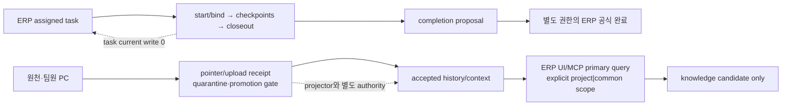

한눈에 보는 판정은 다음과 같다.

| 구분 | 쉬운 뜻 | 현재 판정 |
| --- | --- | --- |
| `CURRENT` | 지금 코드·schema·검증에서 실제로 확인한 것. inventory에 보이거나 feature-OFF 기반이 있다는 사실만으로 live binding 또는 continuous connection이 되지는 않음 | 입력별 기능, ERP current row, 파일 활동, B9/ENGINE-12 읽기 투영은 부분 구현 |
| `TARGET` | owner 승인 뒤 만들어야 할 최종 구조 | TaskIntent/TaskDriver/receipt, 단일 writer, typed relation/revision/time ledger, 안전한 closed loop |
| `VERIFY_HP` | 고성능 PC 또는 승인된 pilot에서 다시 증명할 것 | live writer, 실제 consumer, replay, backup/restore, one-project migration, PC binding |

### 1.1 2026-07-23 source connection status — owner-stated 2/5 split

- `LIVE_UNACCEPTED`: owner가 해당 source의 operational live 사용을 지지하지만
  `H00 + applicable H slice(s) + P1` formal acceptance가 닫히지 않은 상태다. Public plan은 private exact authority/binding, window별 freshness,
  coverage, cursor, replay 또는 sole-writer cutover를 확인했다고 주장하지 않는다.
- `UNCONNECTED`: public feature-OFF foundation, historical receipt 또는 one-shot canary evidence는 있을 수
  있지만 현재 continuous source binding은 없다. `CURRENT` inventory와 foundation 존재를 live로
  승격하지 않는다.

| source | foundation | live binding | continuous | new normalized H→P5 project classification | new P5 shared semantic label | new P7 TaskDriver |
| --- | --- | --- | --- | --- | --- | --- |
| 받은메일 | H01C feature-OFF evidence input | `LIVE_UNACCEPTED` | formal continuous acceptance 없음; private `N`-window/restart/cursor/replay/freshness 미증명 | `OFF`; legacy source-local routing/classification은 `VERIFY_HP` | `OFF` | `OFF`; legacy mail-to-task auto-intake는 `VERIFY_HP` |
| 보낸메일 | H01C feature-OFF evidence input + owner Outlook query-only canary + isolated private raw-custody/replay pilot | `UNCONNECTED`; actual bounded source/custody는 확인했지만 production private register·continuous task binding 없음 | `OFF`; 동일 observation replay에서 첫 custody ref 재사용·기존 hash 검증까지 PASS | `OFF` | `OFF` | `OFF` |
| PLAUD 음성 | H02 feature-OFF evidence input | `LIVE_UNACCEPTED` | formal continuous acceptance 없음; private `N`-window/restart/cursor/replay/freshness 미증명 | `OFF`; legacy/source-local route는 `VERIFY_HP` | `OFF` | `OFF` |
| Slack | H07 feature-OFF evidence input + connected-source query-only canary + feature-OFF continuous custody/lease harness | `UNCONNECTED`; stable-ID project-channel mapping 후보와 synthetic runtime은 확인했지만 owner-managed background app/token transport·persistent binding 없음 | `OFF` | `OFF`; exact ID mapping은 private candidate이며 live D34 authority/transport 미승인 | `OFF` | `OFF` |
| Codex 작업로그 | H03A/H05 mapping은 D26 blocker; whole conversation/log inventory 없음 | `UNCONNECTED`; exact source schema·authority·single-lane mapping 없음 | `OFF` | `OFF` | `OFF` | `OFF` |
| 파일변경 | H04 feature-OFF evidence input + exact metadata-root stat-only query canary | `UNCONNECTED`; actual owner root `not_materialized`, persistent binding 없음 | `OFF` | `OFF` | `OFF` | `OFF` |
| PC업무 | H03A feature-OFF evidence input + strict WorkSession SQLite query-only canary | `UNCONNECTED`; actual DB는 WAL/SHM 때문에 open 전 차단, persistent binding 없음 | `OFF` | `OFF` | `OFF` | `OFF` |

H01C/H02/H03A/H03B/H04/H05/H07 feature-OFF 모듈과 기존 five-lane one-shot canary는 formal gate의
evidence input일 뿐 H00, H01~H07, P1 또는 source별 live acceptance를 닫지 않는다. 각 source는
§14.6D의 `HP-LIVE-01..06`을 독립적으로 통과해야 하며, 한 source의 통과가 다른 source를 unlock하지 않는다.

2026-07-23 local activity canary는 “실제로 무엇이 준비됐는가”만 분리했다.
PC 업무의 exact DB locator는 기존 runtime task metadata에서 얻었지만 WAL/SHM이 존재해 DB row를
읽지 않았다. 파일변경은 승인된 project-local `file_activity` metadata root가 아직 없고, 실행이력은
run root가 있어도 승인된 exact `workflow_receipt.json` 목록이 없어 디렉터리를 탐색하지 않았다.
따라서 세 source 모두 continuous 연결은 아니며, 다음 단계는 D19/D25/D26와 source별 binding을
확정한 뒤 각 source의 persistent capture를 별도 활성화하는 것이다.

## 2. exact Git/runtime 기준선과 증거 강도

### 2.1 Git과 candidate branch

| 항목 | 관찰 결과 | 강도 |
| --- | --- | --- |
| public `main` | 계획 보정 최초 관찰 시 `9df7e57765d818be65f6250da8435826d0a2eea2`; 당시 `origin/main`과 동일 | `HISTORICAL_REPORTED` |
| candidate branch | 최초 관찰 시 `codex/task-engine-rag-v1@927b3fb045ebf749077951417463c47f12a549bd`; merge-base `15e988b4cdbd5db7a34eb580f754db7c3aa508cc`; `main...candidate=25/2` | `HISTORICAL_REPORTED` |
| candidate delta | 과거 파일/line 통계는 새 main에서 재계산하지 않음; bounded file-by-file reimplementation 원칙만 유지 | `UNKNOWN/VERIFY_HP` |
| immutable oracle | `main`에서 lifecycle, ENGINE-13, `task_engine_redesign/**` 기준 blob diff `0` | `OBSERVED` |
| candidate oracle drift | candidate가 ENGINE-13과 redesign 문서를 수정함 | `OBSERVED`; 통합 때 해당 문서 변경은 제거 대상 |
| worktree 안정성 | 계획 보정 시작 시 target은 owner-designated untracked file, `index.lock` 없음 | `OBSERVED`; 구현 직전 clean/overlap 재확인 필요 |

위 SHA·merge-base·divergence 수치는 명시된 계획 관찰 시점의 snapshot이며 현재 Git 상태를 뜻하지
않는다. C00A/C00Q/C00B는 각 owner 승인 시점의 exact HEAD/origin을 별도로 다시 pin하고 불일치하면 중단한다.

Candidate branch는 통째로 merge/cherry-pick하지 않는다. 최신 `main`에서 파일별로 다시 검토하고,
불변 oracle 변경은 버린 뒤 bounded slice로 재구현한다.

### 2.2 과거 runtime·DB read-only 관찰 — 이번 보정에서 fresh 재관찰하지 않음

| 항목 | 관찰 결과 | 제한 |
| --- | --- | --- |
| ERP health | 과거 loopback health HTTP `200`, schema label `dev_erp.v1` | `HISTORICAL_REPORTED`; live completeness `UNKNOWN/VERIFY_HP` |
| runtime revision | 과거 runtime checkout은 당시 public 기준선보다 오래된 revision | `HISTORICAL_REPORTED`; 현재 `main`과 live 동작을 동일시 금지 |
| DB guard | 과거 Node SQLite `readOnly:true` + `PRAGMA query_only=ON` 관찰 | `HISTORICAL_REPORTED`; fresh query-only receipt 필요 |
| 핵심 table | 과거 `core_item`, `event_log`, `completion_log` 관찰과 TaskDriver 계열 table 부재 보고 | `HISTORICAL_REPORTED`; accepted C00Q tool 뒤 P0/C00B에서 재확인 |
| aggregate | 과거 aggregate 수치는 stale snapshot이므로 CURRENT 근거에서 제외 | `HISTORICAL_REPORTED`; public 문서에서 live count 재주장 금지 |
| 상태 aggregate | 과거 상태 count는 stale snapshot이므로 CURRENT 근거에서 제외 | `HISTORICAL_REPORTED`; P0/C00B next proof |
| zero-mutation guard | 과거 size·mtime 불변 보고, full hash 미확인 | `HISTORICAL_REPORTED`; fresh equivalent zero-mutation evidence 필요 |

### 2.3 과거 PC 역할·로컬 준비 상태 — live binding은 추론하지 않음

| 항목 | 관찰 결과 | 판정 |
| --- | --- | --- |
| 과거 logical role/profile | `tool_pc`, `owner-with-state`로 보고됨 | `HISTORICAL_REPORTED`; 현재 live binding으로 재사용 금지 |
| operational primary | 2026-07-18 owner가 HPP를 central ingress/custody·voice processing·Task Engine/AX 정상 TARGET으로 지정 | `source_supported` target only; exact live binding/cutover는 `UNKNOWN/VERIFY_HP`, 운영 활성화 `DEFER` |
| Mac voice role | HPP unavailable/cutover 전 existing collector의 temporary failover, 이후 source-local HOLD/outbox·fallback/mirror | `source_supported`; 동시 shared writer, HPP central custody, mail/project-history 권한으로 확장 금지 |
| readiness/skill/junction/companion | 과거 실행 결과만 존재 | `HISTORICAL_REPORTED`; 이번 보정의 CURRENT 근거 아님 |
| established `_workspaces/<project>` topology | owner-confirmed identical actual logical project worksite/body와 OneDrive junction materialization baseline | `source_supported` logical-owner baseline only; exact targets·sync health·HPP TARGET physical binding은 private `VERIFY_HP`, topology 변경 `0` |

### 2.4 증거 등급

- `OBSERVED`: 명시된 관찰 시점/ref에서 exact ref, 코드 symbol, read-only schema/aggregate, validator
  결과로 확인. 같은 ref에서 다시 확인하지 않은 값은 현재값으로 확장하지 않는다.
- `HISTORICAL_REPORTED`: 이전 plan 작성 때의 관찰로 기록됐으나 이번 보정에서 fresh 재관찰하지 않음.
- `source_supported`: public owner/source 계약이 bounded claim을 직접 뒷받침함. live binding, runtime
  구현 또는 activation 증거로 확장하지 않는다.
- `REPORTED`: 기존 문서나 candidate branch가 주장하지만 이번 기준선에서 재실행하지 않음.
- `UNKNOWN`: 안전한 읽기 전용 증명이 없거나 runtime revision이 달라 단정할 수 없음.
- `TARGET`: owner 승인 뒤 구현할 계약.
- `VERIFY_HP`: 고성능 PC의 clean worktree, synthetic fixture 또는 별도 승인된 pilot에서 증명.

### 2.5 이전 plan 조사 명령과 이번 보정 증거의 분리

아래 표는 **이전 plan 작성 당시 기록을 보존한 historical log**다. 이번 correction 실행 기록으로
재주장하지 않는다. 경로·hostname·업무 payload를 공개하지 않도록 runtime/private 위치는 logical label로만 적는다.
이 절과 §6.5의 `node tools/...` 명령 및 `docs/contracts/...` schema 경로는
`ui-workspace/apps/dev-erp`를 cwd로 삼은 app-relative 표기다. Repo root에서 실행하거나 찾을 때는
각각 `node ui-workspace/apps/dev-erp/tools/...`,
`ui-workspace/apps/dev-erp/docs/contracts/...`로 해석한다.

| 명령/검사 | exit | 결과 요약 |
| --- | ---: | --- |
| `git fetch --prune origin` + `git rev-list --left-right --count HEAD...origin/main` | 0 | public main `0/0` |
| `git status --porcelain=v2 --branch` | 0 | public main clean; runtime checkout도 별도 clean |
| `git merge-base`, `git rev-list main...candidate`, `git cherry` | 0 | 당시 drift 수치는 현재 권위가 아님; 원본 correction 관찰 기준은 §2.1의 `25/2`, candidate 고유 commit 2개 |
| immutable paths `git diff --exit-code <oracle>...HEAD -- <paths>` | 0 | 당시 main oracle 변화 없음 |
| `npm.cmd run skills:sync -- --all` | 0 | tracked skills materialized |
| `npm.cmd run guild-hall:doctor -- --profile owner-with-state --device-capabilities --json` | 0 | advisory capability probe |
| `npm.cmd run guild-hall:doctor -- --profile owner-with-state` | 1 | 48/51; hardening skill/Stop hooks 3개 gap |
| `npm.cmd run guild-hall:workspace-junction:audit` | 1 | single-root, extra alias 5개; repair 안 함 |
| companion repos `git fetch` + `git pull --ff-only` | 0 | clean behind-only를 각각 fast-forward, 최종 `0/0` |
| `node tools/runtime_ops.mjs health --json` | 0 | HTTP 200, schema label 확인 |
| `node --input-type=module <SQLite readOnly/query_only probe>` | 0 | query_only 1, integrity ok, FK violation 0, aggregate만 조회 |
| live DB/WAL `Get-FileHash` | nonzero | file lock; hash 증거로 사용하지 않음 |
| `npm.cmd run validate:file-activity` | 0 | synthetic 36/36 |
| `npm.cmd run validate:rag` | 0 | common RAG v0 28/28 |
| context/life-tree focused `node --test` | 1 | 15/17 pass, endpoint 2건 `server not ready` |
| `node tools/runtime_release_audit.mjs --core-only-release --require-live --json` | 1 | release blockers 6종; activation 불가 |
| plan file `git add -N` 후 scoped `git diff --check -- <plan>` | 0 | untracked 신규 문서 내용까지 포함해 whitespace error 없음 |

### 2.6 CV-01~CV-09 correction matrix

아래 `CONFIRMED`는 public `main@9df7e577...`의 계약·코드 또는 이번 read-only 명령이 해당 판정을
직접 뒷받침한다는 뜻이다. `UNKNOWN_BLOCKED`는 계약 의도는 확인했지만 current writer/default-root의
완전한 inventory가 없어 합격을 주장하지 않는다는 뜻이다. Live completeness나 구현 완료를 뜻하지
않는다. 특히 CV-06과 CV-07은 **gap의 존재가 CONFIRMED**된 것이며 gap이 구현으로 닫혔다는 뜻이 아니다.

| ID | verdict | exact public evidence | corrected plan consequence | next proof |
| --- | --- | --- | --- | --- |
| CV-01 | `CONFIRMED` | root `AGENTS.md`의 public-tracking 금지; 이번 `git ls-files -- '_workspaces/**'` 결과는 boundary 문서 `_workspaces/README.md` 1개뿐이고 changed-scope path validator violation `0` | public plan·fixture에는 payload/body/chunk를 두지 않음 | 각 구현 slice의 변경 scope에서 tracked payload/body/chunk sentinel `0` 재확인 |
| CV-02 | `UNKNOWN_BLOCKED` | `task_engine_redesign/02_OWNER_BOUNDARIES_AND_STORAGE.md` LOCKED 표는 project payload=`_workspaces/<project>/...`, common payload=`_workspaces/knowledge/**`, metadata=`_workmeta/**`를 고정하지만 current writer/default-root 전체 inventory는 이번 public-only correction에서 실행하지 않음 | project/common/system owner를 합치거나 fallback하지 않고 P0/C00B 합격을 차단 | accepted C00Q tool 뒤 P0/C00B asset-kind별 current writer/default-root/consumer inventory |
| CV-03 | `CONFIRMED` | `PROJECT_CONTEXT_GRAPH_MODEL_V0.md`의 `project_context/**`·`reports/context_graph/**`; `PROJECT_FILE_ACTIVITY_REVISION_V0.md`의 `reports/file_activity/{observations,events,checkpoints,projections}/**` | §7 owner tree에 두 owner를 명시하고 proposed history views와 구분 | P0/C00B physical owner/path inventory |
| CV-04 | `CONFIRMED` | context `sources.csv`는 `source_id/content_hash/occurred_at/ingested_at`, `edges.csv`는 node IDs만 보유; `TEMPORAL_KNOWLEDGE_ONTOLOGY_V0.md` §5~6은 `source_revision_id`, `content_id`, typed ref, `valid_at/known_at`을 요구 | P2/P3에서 lossless schema/crosswalk receipt 전 P4/P5 금지 | HP-HISTORY exact-ref/orphan/cutoff tests |
| CV-05 | `CONFIRMED` | 이전 WBS가 C01 TaskDriver-first였고 cross-validation packet은 P0→P10을 owner-fixed로 고정 | §1·§12·§15를 P0→P10으로 교정; P5→P6→P7→P8 hard gate | 각 phase acceptance receipt와 dependency lint |
| CV-06 | `CONFIRMED` | `src/erp_mcp_service.mjs`의 `erp_mcp_work_session` table과 idempotent `publishWorkSession()`·replay test는 존재; dev-ERP 밖 whole-conversation/OS capture owner는 public contract에 없음 | structured WorkSession receipt는 CURRENT로 재사용하고 whole conversation/OS surveillance는 기본 `OFF/DEFER`; AgentRun은 P1 선행조건 아님 | H03 coverage + direct-writer audit; D19 capture boundary 결정 |
| CV-07 | `CONFIRMED` | dev-ERP `Store.applyTemplate`/anchor mutation은 있으나 `TEMPORAL_KNOWLEDGE_ONTOLOGY_V0.md` §5.7이 요구하는 external schedule occurrence→exact record revision의 standalone owner/path/writer는 미정 | schedule history는 P1 gap; D20 결정과 exact revision/event writer 전 P5 acceptance 금지 | H03/SE fixture에서 current+append-only event, stale revision, replay 검증 |
| CV-08 | `CONFIRMED` | `task_engine_redesign/03_INPUT_AND_TEMPORAL_MODEL.md` §source-local first와 월별 partition 규칙 | “같은/하나의 원장”을 source-local ledgers + exact-ref projection으로 교정 | H06 five-lane replay/export parity |
| CV-09 | `CONFIRMED` | root `AGENTS.md` 정본 구조는 `.registry/.unit/.workflow/.party/.mission/guild_hall/_workspaces`; `ui-workspace`는 derived UI consumer | §0·§5·§7에서 canon owner와 derived UI를 분리 | path/owner lint와 UI write-authority test |

2026-07-15 owner 기본안의 `CV-F10 ingress`, `CV-F11 personal session`, `CV-F12 query/knowledge`는
CV-01~CV-09를 재번호화하거나 P0~P10을 바꾸지 않는 후속 finding이다. 각각 §3.5·D27·HP-INGRESS,
§6.2A/§10·D28·HP-SESSION, §6.5A/§9.3·D29·HP-QUERY로 닫는다. 이 plan mapping은 구현 또는
live acceptance 증거가 아니다.

## 3. 고성능 PC `CURRENT / TARGET / VERIFY_HP` read-only inventory

### 3.1 입력과 현재 ERP

| 영역 | `CURRENT` | `TARGET` | `VERIFY_HP` |
| --- | --- | --- | --- |
| 메일 | JS `project_mail_history_writer.mjs`, Python `ProjectMailHistoryWriter`, Outlook `outlook_mail_reconcile.mjs`가 project history를 쓴다. Outlook reconcile은 local 기본 보낸편지함과 받은편지함 metadata를 읽지만 current PowerShell row는 sent item의 exact Internet Message-ID·수신자 주소 snapshot을 보장하지 않는다. 팀 account collector는 Hiworks POP3 기반 받은편지함 중심이고, Soulforge SMTP outbound log는 그 sender를 거친 발송만 안다. assignment/event와 CSV/XLSX publish도 하나의 atomic generation이 아니다. | project-independent `mail_occurrence_id` 하나에 source/account/folder별 `mailbox_observation`을 여러 개 연결하고 sender/to/cc/bcc role을 별도 relation으로 보존한다. HPP sole normal collector/projector가 exact identity 우선으로 received/sent copy를 합치고 same-generation CSV/ICS/XLSX를 만든다. | owner+팀원별 received/sent expected-source coverage, exact Message-ID 취득 가능성, Hiworks sent source 선택, Outlook/Soulforge SMTP/provider copy dedupe, CC/BCC semantics, writer caller/lock/epoch, DB↔CSV↔XLSX parity |
| Slack 협업 | public 코드에는 project-channel message collector가 없다. 기존 plan의 Slack 언급은 Hermes형 gateway의 사람 channel session/알림 후보일 뿐 project history source가 아니다. | `workspace_id+channel_id`를 owner-approved project binding으로 사용하고 message/thread/edit/delete를 source-local append-only occurrence/revision으로 보존한다. HPP가 allowlisted channel의 sole normal collector이며 project `협업_이력`은 rebuildable redacted projection이다. | exact workspace/app/token authority, bot membership과 최소 scope, public/private channel allowlist, channel rename/archive, retry/backfill/cursor, edit/delete/thread, Slack Connect, user→ERP account mapping, retention/legal hold, attachment custody |
| 음성 | 승인된 route의 consumer 존재; raw audio/transcript를 직접 읽지 않는 경계 | 승인된 transcript revision에서 후보 생성, 사람 matcher/authority 분리 | 실제 route coverage, 누락·중복·revision exact join |
| SE 일정 | template spawn, anchor date 이동, 1-hop due 재계산은 있으나 external master schedule의 append-only revision/event owner·path·writer는 미정 | external schedule current row와 immutable revision/event를 분리한 뒤 exact revision→context 연결 | D20 owner/path/writer, stale revision, replay parity |
| 파일 이력 | five-ID, hash/revision, rename/copy/conflict, reconciler, strict projection 구현 | SourceRevision·task·artifact relation 연결, authenticated packet/tail replay | `HISTORICAL_REPORTED`: `validate:file-activity` 36/36은 당시 synthetic만 증명; live transport와 4-PC binding은 별도 gate |
| 사람/Codex | `erp_mcp_work_session`은 `(account_id,idempotency_key)` replay/conflict를 가진 **서로 독립된 bounded structured result record**다. start/bind, assignment epoch, ordered checkpoint, closeout, durable client outbox/ack는 없다 | 기존 one-shot record는 compatibility 입력으로 보존하고, 별도 personal WorkSession start/bind→checkpoint→closeout→completion proposal lifecycle을 feature-OFF로 설계; whole conversation/OS surveillance는 `OFF/DEFER` | stable opaque thread ref 가능성, node binding, local outbox path/암호화/보존, missing SLA, one-active-primary cardinality |
| payload ingress | mail/voice/file source owner, chat attachment inbox와 MCP artifact inbox가 각각 존재한다. 업로드는 service-owned byte copy를 만들지만 공통 promotion receipt·promoter authority는 없다 | pointer/hash/reference 기본; 중앙 service custody 또는 explicit 승인 때만 copy/move/derive. source writer·promoter·history projector·TaskEngine coordinator를 분리 | mail raw/attachment custody 경계, quarantine/scan/ACL/retention/backup owner, per-source promotion destination |
| ERP current row | `core_item`, `createItem()`, `setItemStatus()`, `itm_*` allocator | event replay의 materialized current projection; 기존 ID 유지 | actual sole writer, transaction/event parity, duplicate reservation |
| ERP event/history | generic `event_log`; completion 별도, status mutation과 event append가 분리 | typed append-only `task_event`; compatibility mirror는 한시 유지 | reopen/re-done/reanchor adversarial replay |
| 완료 | `completion_log`; 현재 reopen은 마지막 완료 행을 `DELETE` | completion/reversal은 append-only; artifact/decision/verification/outcome exact ref | legacy row crosswalk와 free-text-only count |
| 업무 상태 | `unclassified/open/doing/waiting/blocked/done/archived` | 일 상태와 Driver 판단 상태를 두 축으로 분리 | archived/cancelled/merged crosswalk owner 결정 |

### 3.2 ID·시간축·지식·조회면

| 영역 | `CURRENT` | `TARGET` | `VERIFY_HP` |
| --- | --- | --- | --- |
| typed ID/ref | 문서 계약과 일부 adapter는 있으나 ID namespace가 분산 | `{entity_type, owner_surface, entity_id}`와 project-qualified exact ref 강제 | bare/fuzzy join, collision, orphan, alias count |
| source/file revision | file activity revision은 강함; 공통 SourceRevision 운영 원장은 없음 | logical source→immutable revision→node observation lineage | source별 revision 누락·중복과 HWP→HWPX receipt |
| 시간축 | occurrence 관련 field가 일부 존재 | `valid_at`와 `known_at`을 분리한 point-in-time replay | null/regression/ordering과 두 번 replay digest |
| relation ledger | ontology 어휘·relation matrix 계약은 존재 | append/supersede RelationEvent와 exact endpoint | multi-parent, stale alias, fuzzy-confirmed `0` |
| project context | gate/skeleton/work/history branch와 B9a~c 읽기 모델 | owner relation ledger에서 B9d knowledge backlink까지 투영 | gate→branch→event→task→fruit coverage |
| RAG | 공용 `_workspaces/knowledge/rag` 기본 경로가 여러 consumer에 고정 | project/common/system resolver, exact source revision, consumer 전환 | 모든 asset/consumer inventory, foreign-project/orphan/collision `0` |
| Wiki | 제한된 Markdown reader와 metadata shell | immutable WikiRevision writer, claim/source relation, project ACL | writer owner, cross-project isolation, body 저장 경계 |
| ERP UI/MCP query | personal MCP는 agenda/task/mail/artifact와 one-shot WorkSession 등 8개 도구를 제공하지만 project-history/RAG/Wiki accepted-generation query는 없다. 인증 과정의 token `last_used_at` audit touch는 발생할 수 있다 | accepted project-history/context/knowledge의 primary user query surface. `scope=project|common` 필수, implicit fallback 없음, exact generation/revision/locator/claim ceiling 반환 | explicit ACL과 existence-leak 정책, API↔CSV/XLSX parity, generation pinning/cursor, feature binding/team pilot |
| ENGINE-12 | 인증 GET, project 접근 검사, mail/ERP/SE/voice/Codex/file adapter와 일일 렌즈 | TaskDriver/task_event/typed ref/bitemporal adapter | `HISTORICAL_REPORTED`: 당시 17 test 중 15 pass; `server not ready` 2건 원인 재현 |
| B9 | 장기 생명나무 B9a~c 구현, B9d 미완료 | 지식 backlink와 exact completion/outcome fruit | projection이 owner row를 쓰지 않는지 전후 digest |
| AX Workspace | 완성된 AX 정본/UI는 없고 ERP MCP에는 idempotent one-shot structured result persistence/API만 부분 구현 | one-shot facade는 보존하고 별도 assignment-bound personal lifecycle·accepted query client를 AX-G1 이후 feature-OFF로 구축 | P9 core 뒤 D28/D29와 별도 owner gate; thread/node/outbox capability·whole-conversation capture 없음 |
| AgentRun | mission/workflow/party는 존재하나 run control plane은 분리 미완료 | AgentRun/capability/receipt를 TaskDriver와 별도 owner로 구축 | ID/authority/receipt crosswalk |
| Engineering IQ/ML | canonical trace와 verified label pool 없음 | trace 먼저, 충분한 검증 label 뒤 ranking/ML 후보 | label 품질·수량·편향 기준 owner 결정 |

### 3.3 지금까지 한 것과 남은 것

이미 한 것:

- mail/voice/SE/file/Codex 관련 입력과 ERP read/write 기능을 각각 부분 구현
- ERP current row, generic event, completion log, task ledger/autosync를 운영
- file activity synthetic 검증, B9 장기 view, ENGINE-12 일일 view와 UI를 구축
- 공용 RAG v0와 knowledge projection을 구축
- candidate branch에서 TaskDriver/temporal ID/project RAG의 초기 구현 가능성을 시험

남은 핵심:

- 모든 입력을 candidate-only로 모으는 TaskIntent와 TaskDriver 판단 원장
- 단일 ERP writer, task ID reservation, atomic event/current/receipt transaction
- 삭제 없는 completion/reopen, 두 상태축, deterministic replay
- 공통 SourceRevision/RelationEvent와 `valid_at/known_at`
- project/common/system RAG·Wiki·ontology owner 전환
- B9/ENGINE-12를 source-local histories의 exact-ref read-only projection으로 연결
- immutable multi-PC packet, sole reconciler, 별도 ERP writer, backup/restore/failover
- core pilot 뒤 AX Workspace/AgentRun/Engineering IQ/ML을 별도 phase로 진행

### 3.4 P1 five-lane history foundation

Task discovery보다 먼저 다음 다섯 lane의 append-only history와 coverage를 닫는다. 기술 source
owner는 그대로 유지하며, 사용자용 CSV/XLSX는 source truth가 아닌 `TARGET proposed derived view`다.

| lane | `CURRENT` (public evidence) | `TARGET` | `VERIFY_HP` |
| --- | --- | --- | --- |
| mail | gateway 월별 collector event/dedupe state와 현재 `soulforge.project_mail_history.private.v1` CSV/XLSX/ICS projection; JS/Python/Outlook 세 writer, Outlook CSV-only, `scan_mail_ledger.mjs` consumer | project-independent occurrence + append-only classification/reclassification event + atomic outbox; existing CSV/ICS/XLSX 경로는 같은 generation의 rebuildable projection | caller zero/allowlist, DB↔CSV↔XLSX parity, lock/lease/epoch, partial Mac gap, failover/failback |
| voice | `_workspaces/system/voice_capture/**` payload/source owner와 `_workmeta/<project>/reports/voice_source_events/**` metadata event owner; 현재 맥미니 temporary failover, TARGET HPP voice processing primary | 기존 technical event를 common envelope로 export하고 **proposed** `reports/음성_이력` 사용자 view 생성; raw audio/transcript는 source owner에 유지 | exact writer lease/epoch와 cutover/failback receipt, session/bundle/revision coverage, consumer ack, partial/failed capture gap, supersession replay |
| structured PC work | dev-ERP의 unordered one-shot `erp_mcp_work_session` result record + metadata-only daily ledger; start/bind/ordered closeout·durable client ack는 없고 전체 대화/OS 감시는 구현·승인되지 않음 | 승인된 bounded record만 H03 occurrence로 연결하고, personal lifecycle은 P9 이후 AX side-card로 분리한다. daily ledger/context/execution receipt는 원 source나 H05 run을 가리키는 relation·projection·coverage ref로만 사용해 **proposed** `reports/PC_업무_이력` view 생성 | H03 direct writer `0`; AX에서 capture scope/consent, node/thread binding, outbox/ack, missing-closeout; whole conversation/OS surveillance `OFF/DEFER` |
| file | `guild_hall/file_activity/**`와 `_workmeta/<project>/reports/file_activity/{observations,events,checkpoints,projections}/**`; complete/partial/failed scan과 exact file revision | 기존 observation/event/revision owner를 보존하고 **proposed** `reports/파일_이력` view만 파생 | authenticated producer, complete-scan coverage, conflict/revision replay, live reconciler binding |
| run/log | `_workmeta/<project>/runs/<run_id>/**` 실행 metadata·판단·검증 log와 five-field/daily-ledger refs; raw artifact는 worksite owner | run/validator/receipt typed refs를 envelope로 연결하고 **proposed** `reports/실행_이력` view 생성 | run completeness, validator receipt/ref integrity, raw exclusion; `AgentRun`은 P1 prerequisite가 아님 |

#### 3.4.1 Common history envelope (`TARGET`, H00)

모든 lane adapter는 자기 source-local record를 복사하지 않는다. Event envelope와 coverage receipt는
서로 독립된 record이며, zero-event window를 표현하려고 가짜 event를 만들지 않는다.

```yaml
schema_version: soulforge.project_history_envelope.v1
occurrence_id: <stable-project-independent-id>
lane: mail|voice|structured_pc_work|file|run_log
source_owner_ref: <typed-owner-ref>
native_occurrence_ref: <typed-native-ref>
event_ref: <exact-append-only-event-ref>
source_revision_ref: <exact-revision-ref-or-null>
content_ref: <content-id-or-null>
project_ref: <classification-target-or-null>
event_at: <strict-utc-or-declared-unknown>
valid_at: <strict-utc-or-declared-unknown>
observed_at: <strict-utc-or-null>
known_at: <strict-utc>
recorded_at: <strict-utc>
classification_before: <typed-state-or-null>
classification_after: <typed-state-or-null>
supersedes_event_ref: <exact-ref-or-null>
metadata_digest: sha256:<64hex>
raw_payload_copied: false
```

```yaml
schema_version: soulforge.project_history_coverage_receipt.v1
lane: mail|voice|structured_pc_work|file|run_log
source_owner_ref: <typed-owner-ref>
project_ref: <classification-target-or-null>
window_start: <strict-utc>
window_end: <strict-utc>
state: complete_with_events|complete_no_events|partial|failed|not_collected|not_applicable
event_count: <integer-or-null>
gap_codes: []
applicability_ref: <approved-rule-ref-or-null>
ordered_event_digest: sha256:<64hex>
metadata_digest: sha256:<64hex>
raw_payload_copied: false
```

`complete_with_events`는 실제 수집과 `event_count >= 1`, `complete_no_events`는 실제 수집과
`event_count: 0`을 뜻한다. `partial`은 정확한 `event_count >= 0`과 non-empty gap을 함께 가진다.
`failed`와 `not_collected`는 `event_count: null`과 non-empty gap을 가지며 사건 없음으로 해석하지
않는다. `not_applicable`은 `event_count: null`, empty gap, owner-approved `rule_revision` applicability
ref가 모두 있을 때만 허용한다. 이 상태들을 같은 0으로 표현하지 않는다. Join은 occurrence/event/revision/
content의 project-qualified typed ref만 허용하고 제목, 시간 근접, filename, LLM similarity 같은 fuzzy
join은 review candidate까지만 허용한다.

#### 3.4.2 Proposed user-facing derived views (`TARGET`, source truth 아님)

| lane | metadata CSV | human XLSX | technical source owner preserved |
| --- | --- | --- | --- |
| mail | 기존 `_workmeta/<project>/reports/메일_이력/메일_이력.csv` | 기존 `_workspaces/<project>/reports/메일_이력/메일_이력.xlsx` | gateway/source event + P8 mail assignment event/outbox |
| voice | **proposed** `_workmeta/<project>/reports/음성_이력/음성_이력.csv` | **proposed** `_workspaces/<project>/reports/음성_이력/음성_이력.xlsx` | `reports/voice_source_events/**` |
| structured PC work | **proposed** `_workmeta/<project>/reports/PC_업무_이력/PC_업무_이력.csv` | **proposed** `_workspaces/<project>/reports/PC_업무_이력/PC_업무_이력.xlsx` | ERP MCP WorkSession + approved structured instruction; daily ledger/context는 derived projection |
| file | **proposed** `_workmeta/<project>/reports/파일_이력/파일_이력.csv` | **proposed** `_workspaces/<project>/reports/파일_이력/파일_이력.xlsx` | `reports/file_activity/**` |
| run/log | **proposed** `_workmeta/<project>/reports/실행_이력/실행_이력.csv` | **proposed** `_workspaces/<project>/reports/실행_이력/실행_이력.xlsx` | `_workmeta/<project>/runs/<run_id>/**` |

CSV와 XLSX는 같은 accepted event cutoff, `projection_generation_id`, active `projector_epoch`, row count,
ordered row digest를 가져야 한다. Mail view는 여기에 포함 event별 `classification_epoch`를 정렬해 만든
`source_epoch_digest`와 `max_classification_epoch`도 같아야 한다. 분류와 투영 epoch는 서로 다른 role의
fence이므로 같은 숫자라고 가정하거나 하나의 `fencing_epoch`로 합치지 않는다. 원문 mail/voice/file/run payload는 source/worksite owner에 남고,
projection writer가 body, transcript, attachment, file byte, raw log를 읽거나 두 번째 truth를 만들지 않는다.
기존 v1 mail view의 subject/counterpart 같은 display metadata는 H06 technical source로 사용하지 않는다.
D22/D24가 owner-approved redacted projection-field allowlist를 정하기 전에는 v2/export acceptance를
주장하지 않는다.
정상 운영에서 이 다섯 종류의 CSV/XLSX를 쓰는 주체는 HPP `project_history_projector` 하나다. Mail은
DB assignment event/outbox↔CSV/ICS/XLSX까지 parity를 요구하고, 나머지 lane은 canonical technical
event/ref+accepted cutoff↔CSV/XLSX parity를 요구한다. Mac mini와 다른 PC는 감시·gap/alert candidate만
만들며, 별도 승인된 emergency lease가 없으면 이 파일을 쓰지 않는다.

이 파일들은 accepted generation의 **감사·사람 열람·오프라인 snapshot**이지 live event bus, 기본
query source 또는 reverse-import source가 아니다. 같은 generation manifest는 API result digest도
포함하며 API/CSV/XLSX parity를 통과한 뒤에만 accepted current pointer를 전진시킨다. 팀원은 기본적으로
ERP UI/MCP에서 같은 accepted generation을 조회하고, Git은 private metadata history/감사 전달에만 쓴다.

#### 3.4.3 H01~H05 public-safe readiness 재검토와 P1 보정 (2026-07-15)

이 표는 live/private completeness를 조사한 결과가 아니다. public 계약·코드와 합성 fixture만 다시
대조한 `CURRENT`이며, H00 owner ratification이나 각 technical owner acceptance를 대신하지 않는다.

| slice | 다시 확인한 `CURRENT` | P1 필수 보정 / 중단선 |
| --- | --- | --- |
| H00 | `PROJECT_HISTORY_ENVELOPE_V0.md`와 pure helper는 event envelope와 coverage receipt를 분리한 `canon_candidate`이고 §3.4.1은 그 독립 pair를 재현한다. 아직 owner-ratified canon은 아니다. | owner가 exact independent pair를 ratify하기 전 H01~H05 adapter를 구현하거나 기존 source에 소급 적용하지 않는다. |
| H01 mail | JS `upsertProjectMailHistory()`는 assignment/CLI에서, Python `ProjectMailHistoryWriter`는 mail-candidate queue에서 호출되고 Outlook `applySentDeltas()`는 CSV만 직접 갱신한다. `scan_mail_ledger.mjs`는 CSV consumer이며, 세 writer의 classification event·DB와 CSV/XLSX는 한 atomic generation/outbox가 아니다. | H01은 `H01A` project-independent occurrence·append-only classification contract/shadow와 `H01B` coverage acceptance로 나눈다. H01A는 H00과 D26 exact mail owner/ID grammar가, H01B는 D25 mail coverage policy가 선행한다. D21은 P8 synthetic→P9 durable owner/pilot→P10 live, D23 source facts는 D25 input·emergency fallback은 P10이다. D22 display projection은 H06/P8, DB/outbox는 P8, bounded cutover는 P9, RTO/RPO·approver는 P10 gate다. 기존 writer 변경, file/DB 연결, live caller `0`, parity·failover 완료 주장은 금지한다. |
| H02 voice | Mac temporary-failover collector의 recording/session/library, accepted route, producer receipt와 consumer ack는 구현돼 있다. TARGET HPP voice primary cutover는 미실행이며 cited public voice surface에서는 common envelope, route/retranscription supersession, D25 gap mapping을 찾지 못했다. | `recording_id`를 native occurrence 후보로 두고 session과 meeting bundle은 relation/grouping ref로 분리한다. HPP cutover 전 exact writer lease/epoch와 queue catch-up을 증명하고, route/coverage ambiguity가 남으면 adapter를 시작하지 않는다. |
| H03 structured PC work | ERP MCP WorkSession의 bounded/idempotent publish, metadata-only daily ledger, dev-ERP `codex_instruction` metadata projection이 있다. 별도 task-chat payload owner와 completion-hook의 full-message summarization 경로도 존재한다. | H03A structured adapter와 H03B external schedule contract를 내부 단계로 분리한다. daily ledger와 context life tree는 source truth가 아닌 파생 projection이므로 native occurrence/event count에 넣지 않고 source event를 가리키는 projection/coverage ref로만 쓴다. whole task-chat payload와 task-chat completion-hook/full-message summary도 coverage가 아니며 adapter 입력에서 거부한다. bounded WorkSession의 승인된 `summary` 필드는 이 금지와 구분한다. H03 최종 receipt는 D20 exact schedule owner/path/writer와 두 단계 acceptance가 모두 있어야 한다. |
| H03 external SE schedule | ERP 내부 template spawn, anchor move, 1-hop due 재계산과 generic event는 있으나 external master schedule current/revision/event의 standalone owner가 없다. | D20의 exact owner identity, current path, immutable event/revision path, sole writer가 결정될 때까지 H03B와 schedule-derived task discovery를 HOLD한다. ERP 내부 template event를 external master revision으로 가장하지 않는다. |
| H04 file | five-ID, exact content/revision, observation/event/checkpoint, sole reconciler candidate와 bounded life-tree projection이 구현돼 있다. projection은 live collector/ERP correlation 부재를 포함해 의도적으로 `partial`이다. | adapter는 caller-supplied immutable event/checkpoint ref와 bounded replaceable projection/coverage ref만 받고 filesystem을 scan하지 않는다. bounded projection을 complete ledger로 승격하지 않고 truncation/live gaps를 D25 receipt에 보존한다. |
| H05 run/log | `_workmeta/<project>/runs/**`는 위치 owner지만 모든 run에 공통인 manifest schema가 아니다. `soulforge.workflow_receipt.v1`은 현재 `workflow_id: report_authoring_v0` 전용이다. five-field의 current `id`는 일부 필드만 hash하고 same-ID full-record conflict를 검증하지 않으며 전용 raw/secret boundary validator도 없다. | 승인된 exact schema+explicit ref allowlist만 입력으로 받고 run directory recursion, raw/stage log, transcript, arbitrary manifest를 거부한다. 최초 eligible 후보는 exact schema validation과 `job_id` uniqueness/immutability를 증명한 report-authoring receipt뿐이다. five-field는 full-record digest, collision conflict, boundary validator 전에는 native occurrence allowlist에서 제외한다. daily ledger/context는 어느 lane에서도 native occurrence가 아니며 H01~H05 원 source를 가리키는 derived relation ref로만 쓴다. |
| H06 | accepted H01~H05 lane receipt가 아직 없고 D22/D24~D26도 미확정이다. | 지금은 readiness/fixture 설계까지만 허용한다. H00 ratification, H01~H05 acceptance, D22/D24 view+redacted field target, D25 coverage vocabulary, D26 source-to-lane allowlist 뒤에만 replay/export acceptance를 시작한다. |

2026-07-19 구현은 이 중단선을 코드로 고정했다. `project_history_readiness.mjs`는
public gate map, candidate-only lane profile, synthetic one-project Shadow와 H06 coverage/replay만
검증하며 live adapter를 제공하지 않는다. 해당 suite PASS는 C00B/P0/H00/H01~H06/P1 acceptance,
actual project promotion, production export 또는 writer 권한을 만들지 않는다.

2026-07-23에는 아래 source-local 기반을 추가했다. 이 표의 `구현됨`은 해당
public-safe 모듈과 합성 검증이 존재한다는 뜻이며, lane acceptance나 실제 자료원 연결을 뜻하지
않는다.

| source slice | public-safe 구현 surface | 현재 주장 한계 |
| --- | --- | --- |
| H01C mail | `guild_hall/gateway/mail_fetch/collector/pipeline/mail_occurrence_shadow.py`의 logical occurrence/account-folder observation shadow와 재시작·cursor·six-state 합성 검증 + `collector/outlook_sent.py`의 owner Sent active-Outlook attach-only bounded `.msg` custody/replay provider | owner Outlook Sent는 HPP private register와 기존 supervisor에 연결되어 KST 점심/밤 slot별 성공 1회로 운영 중; team sent source와 project classification은 D33/private gate 뒤이며 POP3·CC로 sent coverage를 추론하지 않음 |
| H02 voice | `guild_hall/voice_capture/local_asr.mjs`의 승인된 30~90초 bounded strong-ASR request/revision과 HPP continuity receipt | non-canonical append-only 파생본만; whole-session 정본·알림·delivery·project route와 H02 acceptance는 변경하지 않음 |
| H03A structured PC work | `ui-workspace/apps/dev-erp/src/work_session_lifecycle.mjs`와 `work_session_outbox.mjs`의 feature-OFF lifecycle/outbox/receipt + `work_session_source_inventory.mjs`의 sidecar-free, read-only, fixed aggregate query | 실제 DB는 WAL/SHM 때문에 open 전 차단; 공식 완료·TaskDriver write·HTTP/MCP live route·migration 없음; H03 combined acceptance 아님 |
| H03B external schedule | `guild_hall/schedule_history/schedule_history.mjs`의 synthetic-only owner/ref/revision/replay/coverage candidate | D20 owner/path/writer와 D25/D26 미확정; live schedule 또는 task discovery 없음 |
| H04 file | `guild_hall/file_activity/project_history_adapter.mjs`의 caller-supplied immutable ref adapter와 `source_inventory.mjs`의 exact owner-root fixed-layout stat-only query | actual metadata root 미생성; workspace/file-content discovery·live collector·ERP writer 없음 |
| H05 run/log | `guild_hall/run_history/run_history.mjs`의 exact `report_authoring_v0` receipt adapter와 `source_inventory.mjs`의 explicit-receipt-only query | actual exact receipt descriptor 없음; arbitrary runs/log recursion·raw/stage log read·persistence·writer 없음 |
| H07 Slack | `guild_hall/slack_history/slack_history.mjs`의 workspace/channel binding, message revision, cursor/dedupe/coverage foundation, `slack_source_inventory*.mjs` redacted query-only canary, `slack_continuous*.mjs` feature-OFF private custody/lease/restart harness | project-channel stable-ID mapping 후보와 synthetic runtime까지 확인; reusable Slack app/token live transport·event subscription·persistent collector/backfill 없음, exact D34 authority와 H07A/H07B acceptance 없음 |

H00 core는 계속 mail·voice·structured PC work·file·run/log 다섯 lane이다.
Schedule은 H03B subtype이고 Slack은 H07 extension이므로 둘을 H00의 여섯째·일곱째 lane으로
승격하지 않는다. source-local 구현들이 공통 project/time/party/action 의미를 각자 발명하지
않도록 중앙 all-source label runtime은 P2/P3/P5 선행 gate 뒤 별도 slice로 남긴다.
이 feature-OFF 기반과 one-shot actual canary는 H00/H01~H07/P1 acceptance receipt를 대체하지 않으며,
받은메일·PLAUD 음성의 owner-supported live 상태도 formal acceptance로 소급 승격하지 않는다.

H03의 내부 순서는 `H03A structured PC work synthetic adapter → H03B external schedule
current/revision/event contract+fixture → H03 combined acceptance`다. H03A는 H00 ratification, D19
boundary, 적용 가능한 D26 WorkSession mapping ratification 뒤에만 진행한다. H03B는 D20과 적용 가능한
D26 schedule mapping 뒤에만 진행한다. 두 단계가 모두 accepted이고 D25 coverage policy가 적용돼야
H03 combined acceptance를 주장할 수 있다. H05의 최초 allowlist 후보는 report-authoring 전용
`soulforge.workflow_receipt.v1`뿐이며 exact schema validation과 `job_id` uniqueness/immutability를 먼저
증명한다. five-field는 full-record digest·same-ID conflict·raw/secret boundary validator 계약을 별도
승인받기 전 relation ref로만 보존한다. schema가 없는 `runs/**` 파일은 이름이나 위치만으로 수용하지 않는다.

H01의 내부 순서는 `H01A exact legacy caller graph evidence + mail occurrence/classification contract shadow →
H01B D25 policy-bound coverage receipt`다. Caller graph는 H01 packet의 read-only 입력일 뿐 `MAIL-01`
cutover acceptance가 아니다. H01A는 `MAIL-03` 중 project-independent occurrence와 append-only
reclassification 의미, `MAIL-12` shadow raw/private 배제만 검증한다. DB current/FK, outbox, lock,
classification/projector epoch, display projection과 same-generation file parity는 P8 소유다. `MAIL-11`의
six-state/count-null 의미는 H00을 재사용하고, mail expected source set·window·freshness·gap/applicability는
D25가 공급한다. D21~D23/D22 부재를 이유로 H01 pure contract/shadow를 P8 뒤로 미루지 않으며, 반대로
H01을 통과했다는 이유로 HPP/Mac 역할·lease·failover 권한을 만들지 않는다.

#### 3.4.4 D26 five-lane typed native occurrence 후보 map (`TARGET`, owner ratification pending)

공통 envelope는 source-local immutable occurrence를 복사하는 두 번째 원장이 아니라 exact
`{entity_type, owner_surface, entity_id}` typed ref로 가리키는 adapter 출력이다. 같은 physical source
record를 둘 이상의 lane에서 native occurrence로 중복 산입하지 않는다. 아래 값은 public 계약에서 도출한
후보이며 `TBD`가 하나라도 남거나 D26 owner ratification·H01~H05 binding/existence 검증이 없으면 exact
allowlist, canon, live mapping이 아니다.

| lane/source subtype | `entity_type` 후보 | `owner_surface` 후보/상태 | `entity_id` source 후보 | event/revision 관계와 중단선 |
| --- | --- | --- | --- | --- |
| mail | `mail_occurrence` | `TBD` — H01/D26 exact mail occurrence owner | H01 owner가 provider message occurrence에 project-independent하게 결합한 opaque `mail_occurrence_id` | 분류·재분류 append event와 승인된 exact message/body revision; project가 들어간 legacy `이력키`, thread ref, current assignment는 identity 금지 |
| voice | `voice_recording` | `voice_capture` candidate | `recording_id` | capture·transcription·retranscription·route event와 audio/transcript exact revision mapping은 H02 `TARGET/TBD`; `session_id`와 `meeting_bundle_id`는 grouping/ref |
| structured PC work / WorkSession | `erp_mcp_work_session` | `dev_erp` candidate | `erp_mcp_work_session.id` | bounded WorkSession record만; idempotency conflict와 existence를 H03A가 검증 |
| structured PC work / instruction | `instruction_packet` | `TBD` — D19 approved packet owner | owner-approved exact instruction packet ID | whole task-chat과 task-chat completion-hook/full-message summary는 제외; WorkSession `summary`는 별도 허용 필드 |
| structured PC work / external schedule | `schedule_row` | `TBD` — D20 exact owner | D20이 정한 stable schedule-row ID | exact version/snapshot event와 current row를 분리; D20 전 H03B HOLD |
| file | `TBD` — H04가 `file_observation`, `file_reconciliation_event`, `erp_upload_event` subtype별 결정 | `file_activity` 또는 `dev_erp` candidate, subtype별 owner 확정 필요 | `observation_id`, reconciliation `event_id`, `erp_upload_event_id` 중 owner-approved exact event occurrence | `logical_file_id`는 file lineage/grouping ref, `revision_id`/`content_id`는 exact revision ref다. upload receipt는 file-lane occurrence 후보일 뿐 project promotion·`ArtifactRevision` acceptance·knowledge acceptance가 아니다. path·filename·mtime·hash 단독 identity 금지 |
| run/log / report authoring | `workflow_job` | `report_authoring_v0` candidate | exact-schema receipt의 `job_id` | 현재 `workflow_id: report_authoring_v0`에만 적용; `job_id` uniqueness/immutability와 validator ref를 H05가 검증 |
| run/log / five-field | `TBD` | `five_field_session_capture_v0` candidate | **current capture `id`는 ineligible** | full-record digest, same-ID conflict, raw/secret boundary validator를 owner가 승인하기 전 native occurrence 산입 금지; `session_ref`는 grouping ref |

derived daily-ledger/context row가 H01~H05 source event나 run을 요약하면 원 source occurrence를 relation으로
가리킬 뿐 새 project-history native occurrence, event 또는 coverage count를 만들지 않는다. source ref가
없거나 같은 physical record가 두 lane 후보로 들어오면 adapter는 추정하지 않고 중단하며 계획 상태를
`UNKNOWN/VERIFY_HP`로 유지한다. D25 ratification 전에는 이 상태를 표현할 새 gap code를 발명하지 않는다.

`D26-CODEX-WORK-LOG-BLOCKER`: “Codex 작업로그”라는 표시명, 파일 위치, 실행 주체 또는 시간 근접만으로
H03A structured PC work와 H05 run/log 중 어느 lane인지 정하지 않는다. Owner-approved exact source
schema/authority/ID와 single-lane mapping이 ratify되기 전에는 `UNCONNECTED/HOLD`이며, 두 lane 중복 산입도
금지한다. Ambient screen capture, keystroke capture, whole-conversation capture와 whole-OS surveillance는
계속 `OFF`이고 D26 mapping의 대안이 아니다.

#### 3.4.5 받은메일·보낸메일 통합과 Slack project context (`TARGET`, H01C/H07)

이 addendum은 기존 H00~H06 five-lane bounded pilot을 무효화하거나 여섯 번째 lane으로 소급 재해석하지
않는다. Mail 확장은 H01 내부 `H01C`, Slack은 별도 communication-history extension `H07A→H07B`로
추가한다. H06은 기존 five-lane P1 core exit이고, owner가 Slack을 팀 project source로 적용한 현재 운영
범위에서는 H07B receipt가 없으면 P5 `context_acceptance_gate`가 Slack coverage를 complete로 간주할 수 없다.

##### Mail: 한 통과 여러 mailbox 관측을 분리한다

```text
logical mail occurrence 1개
├─ owner Sent Items observation      role=sender
├─ member A Inbox observation        role=to
├─ member B Inbox observation        role=cc
└─ outbound transport observation    role=sender_transport (있을 때만)
```

| 대상 | `CURRENT` | `TARGET` | 안전 중단선 |
| --- | --- | --- | --- |
| owner 보낸메일 | `outlook_mail_reconcile.mjs`가 local Outlook 기본 보낸편지함 metadata를 읽는다. current row는 EntryID/ConversationID fingerprint, 시각, 제목, recipient count 중심이며 exact Internet Message-ID와 recipient address snapshot은 보장하지 않는다. | owner-approved Outlook source에서 opaque exact message occurrence ref와 sender/to/cc/bcc role snapshot을 취득하고 H01C observation으로 연결 | Outlook local EntryID나 제목+시각만으로 다른 mailbox copy를 confirmed merge하지 않음 |
| 팀원 받은메일 | 현재 Hiworks POP3 collector가 account별 받은편지함을 수집한다. | account별 source observation을 유지하되 같은 exact message occurrence의 동일 evidence-span/signal은 한 번만 처리; 한 occurrence의 서로 다른 요청·결정·위험 후보는 각각 보존 | 한 account의 0건을 전체 mail 0건으로 해석하지 않음 |
| 팀원 보낸메일 | current POP3는 sent folder source가 아니다. 팀원이 Hiworks web/각자 client에서 직접 보낸 전체 내역의 HPP source는 `UNKNOWN`이다. | D33에서 Hiworks archive/export/API capability, 승인된 outbound journal, 또는 각 client의 bounded sent adapter 중 하나를 exact source로 선택 | source를 정하기 전 “팀 전체 sent coverage complete” 주장 금지; 비밀번호·token·본문을 plan/ledger에 기록하지 않음 |
| Soulforge 발송 | SMTP outbound snapshot/log는 Soulforge sender를 거친 mail만 관측한다. | 같은 exact message occurrence의 transport observation으로 연결 | 모든 사람의 보낸편지함 대체물로 과대 주장하지 않음 |

H01C의 logical identity 우선순위는 source/provider가 보증한 RFC Internet Message-ID 또는 equivalent native
occurrence ref다. 동일 occurrence에 여러 account/folder observation을 append한다. `In-Reply-To`와
`References`는 **thread relation**이지 같은 message identity가 아니다. subject/time/size/recipient-count,
ConversationID나 LLM similarity는 reconciliation candidate만 만들 수 있고 자동 confirmed merge는 금지한다.
별도로 보낸 두 통은 본문이 같아도 exact occurrence ref가 다르면 서로 다른 mail이다.

수신자 의미는 account-relative relation으로 보존한다.

- `sender`: 발신 주체. owner가 팀원에게 보낸 occurrence를 account copy마다 반복 처리하지 않되, 그 안의
  서로 다른 evidence-span/signal 후보는 각각 보존한다.
- `to`: 직접 수신자 후보지만 여러 To를 자동으로 여러 공식 할일로 만들지 않는다.
- `cc`: 공유·인지 evidence이며 기본 담당자/완료 책임자로 승격하지 않는다.
- `bcc`: sender copy나 승인된 transport source가 증명할 때만 기록한다. 수신 copy에서 추정하지 않는다.
- reply/forward는 새 occurrence다. parent/thread relation으로 연결하며 reply 자체를 완료로 간주하지 않는다.

##### Slack: channel binding이 project를 결정하고 내용은 task candidate만 만든다

Slack source truth는 HPP private cross-project state의 logical `collaboration/slack` owner에 남고, raw message
body나 attachment byte를 public Git 또는 `_workmeta`에 복사하지 않는다. proposed project view는
`_workmeta/<project_code>/reports/협업_이력/협업_이력.csv`와
`_workspaces/<project_code>/reports/협업_이력/협업_이력.xlsx`이며 D34의 field/path ratification 전에는
폴더를 만들거나 export하지 않는다.

| Slack object | stable identity / relation | project·task 의미 |
| --- | --- | --- |
| workspace/channel | `workspace_id+channel_id`; channel name은 revision/display metadata | owner-approved effective-dated binding이 있으면 channel의 authoritative default project scope. rename은 project를 바꾸지 않음 |
| message | `(workspace_id,channel_id,message_ts)` logical message ref; Events API outer `event_id`는 delivery dedupe ref | channel project를 상속하지만 request/commitment/decision은 candidate-only |
| thread | root `thread_ts`; replies는 각자 message occurrence | root/reply 모두 channel project. reply·reaction은 공식 완료가 아님 |
| edit/delete | original message ref에 append-only revision/supersession/tombstone event | current view는 rebuild 가능해야 하고 과거 evidence를 overwrite/delete하지 않음 |
| author | Slack `user_id`→ERP account private mapping | mapping 없으면 unknown actor; 이름·표시명으로 자동 결합 금지 |
| file/link | Slack file/message pointer→D27 artifact/source revision candidate | 자동 다운로드·project promotion·RAG/Wiki 승격 금지 |

H07A는 Slack App identity, channel allowlist/binding, minimal OAuth scope, Socket Mode 또는 approved HTTPS Events
delivery, event retry/dedupe, Web API bounded backfill/reconciliation, cursor와 coverage contract만 synthetic으로
고정한다. H07B는 P3 immutable revision contract 뒤 exact message/edit/delete revision과 project-context adapter를
Shadow로 검증한다. Bot은 approved project channel에 명시적으로 참여해야 하며 DM·general/common·unmapped
channel, Slack Connect 외부 workspace, archived channel은 D34 rule 없이는 `unclassified/HOLD`다. HPP 이외
normal collector, automatic channel join, message posting, reaction, delete, task/knowledge writer는 기본 `OFF`다.

#### 3.4.6 입력원 공통 라벨 계약 (`TARGET`, H00/P2/P3/P5/P6)

입력 collector가 각자 업무 의미를 확정하면 같은 프로젝트·사람·시간·요청이 서로 다른 값으로 갈라진다.
따라서 collector와 source adapter는 **사실을 정규화**하고, 요청·약속·결정 같은 의미는 accepted context를
읽는 중앙 `context labeler`가 **후보 annotation**으로만 만든다. 두 계층을 한 row나 자유 문자열 label로
합치지 않는다. Voice Shadow처럼 source owner가 source-native semantic observation을 만드는 것은 허용하되,
그 결과는 evidence ref일 뿐 shared annotation·TaskIntent·업무 정본이 아니다.

```text
source-native event/revision
  -> normalized fact envelope       # exact ID, project ref, clocks, actor relation
  -> accepted context + gap
  -> semantic annotation event      # request/commitment/decision/deadline 후보
  -> P6 TaskIntent candidate
  -> 별도 TaskDriver authority
```

##### A. 모든 입력원이 공유하는 사실 필드

| 공통 의미 | shared `TARGET` field/shape | source별 native 값의 처리 | 금지 |
| --- | --- | --- | --- |
| 사건 동일성 | `occurrence_id` + typed `native_occurrence_ref` | mail occurrence, voice recording, Slack message, WorkSession event, file event, workflow receipt의 owner-issued ID를 보존 | project code·제목·파일명·시간 근접·LLM 유사도로 ID 생성 또는 confirmed merge |
| 프로젝트 | typed `project_ref={entity_type,owner_surface,entity_id}`; 사람이 보는 `project_code`는 owner-issued display projection | `project_assignment_basis={basis_kind,basis_ref}`로 `explicit_owner_assignment|effective_source_binding|accepted_classification_event|context_inference|unknown`을 구분 | lane별 자유 문자열 project label, 이름·약어 fuzzy join, unknown을 임의 project로 대체 |
| 프로젝트 판정 상태 | `confirmed|candidate|unclassified|held_conflict` | explicit assignment/source binding만 `confirmed`; rule/context inference는 승인 전 `candidate` | confidence가 높다는 이유만으로 confirmed 승격 |
| 사실 시각 | `event_at` + exact `native_clock_ref` + `clock_normalization_policy_ref` | source-native sent/received/recording-start/message-ts/session/file/run 시각을 UTC RFC3339로 lossless crosswalk. Offset 없는 PLAUD provider 절대시각만 owner-ratified 규칙에 따라 UTC로 해석하며 native 값·basis·precision을 보존 | KST display 문자열을 identity/cutoff로 사용, host timezone·현재 locale로 ad-hoc 추정 |
| 원천 상대시간 | `source_offset_range={start_seconds,end_seconds,time_basis}` | voice transcript 등의 녹음 시작 기준 상대시간을 source-native precision 그대로 보존하고 절대시각으로 덮어쓰지 않음 | 상대 초를 UTC/KST로 변환하거나 반올림해 evidence span identity 변경 |
| 관측·인지·기록 시각 | `observed_at`, `known_at`, `recorded_at`; query cutoff는 별도 `valid_at` | mailbox 수신, collector 관측, 시스템 인지, append 시각을 서로 보존하고 사용자 화면에서만 KST 파생 | 여러 시각을 하나의 `timestamp`로 collapse |
| 사람·계정 | `party_ref={entity_type,owner_surface,entity_id}` + `account_ref={account_type,owner_surface,account_id}` + controlled relation role | mail `sender/to/cc/bcc`, voice `speaker`, Slack `author`, PC/run `actor`, file `producer`를 relation으로 보존. Account만 알고 person을 모르면 `party_ref:null`+identity gap | 표시명·메일 별칭·Slack 이름을 사람 identity로 자동 결합 |
| revision/content | `source_revision_ref`, `content_ref` | 원본 owner의 immutable revision/content ID를 사용 | 원문 body·transcript·attachment·file byte·raw log를 label row에 복사 |
| 분류 근거 | exact `source_semantic_refs[]`, `evidence_span_refs[]`, `evidence_refs[]`, `crosswalk_revision_ref`, `policy_revision_ref`, typed `producer_ref={producer_type,owner_surface,producer_id,revision_ref}` | source-native speech act/message/file/run label을 ref로 보존하고 `human|rule|model|workflow` producer, 사용한 source revision과 exact span을 고정 | 기존 source label 삭제, 근거 없는 label, model·rule revision 없는 AI/rule label, 최신 원문으로 조용히 재해석 |

`project_code`, KST 시각, 사람 이름은 UI 표시값이고 identity가 아니다. Source-native clock과 field는 버리지
않고 exact ref/owner record에 남긴다. 공통 필드로 lossless하게 옮길 수 없으면 `unknown` 또는
`held_conflict`와 gap을 기록하며, adapter가 새로운 의미를 추정하지 않는다.

Project assignment state는 basis와 함께 다음 matrix로만 결정한다.

| basis kind | 허용 state | 필수 조건 |
| --- | --- | --- |
| `explicit_owner_assignment` | `confirmed` | exact owner decision evidence+policy refs |
| `effective_source_binding` | `confirmed` | effective-dated binding evidence+policy refs |
| `accepted_classification_event` | `confirmed` | owner-accepted classification event evidence+policy refs |
| `context_inference` | `candidate` | exact evidence refs; confidence만으로 confirmed 금지 |
| `unknown` | `unclassified` | explicit gap ref |
| 서로 충돌하는 현재 유효 basis | `held_conflict` | 양쪽 exact refs를 보존하고 자동 우선순위 금지 |

H00의 `classified` 값만으로는 어느 행의 `confirmed` 조건도 충족하지 않는다.

##### B. 요청·약속·결정은 source row가 아니라 append-only annotation이다

```yaml
schema_version: soulforge.context_semantic_annotation.v1
label_event_id: <stable-append-only-id>
label_lineage_id: <stable-target-and-meaning-lineage-id>
label_revision_id: <unique-immutable-revision-id>
annotation_key_digest: <sha256-of-exact-dedupe-tuple>
target_occurrence_ref: <exact-typed-ref>
source_revision_refs: [<exact-revision-ref>]
source_semantic_refs: [<exact-source-native-label-ref>]
project_ref: <typed-project-ref-or-null>
project_assignment_state: confirmed|candidate|unclassified|held_conflict
project_assignment_basis: {basis_kind: <controlled-enum>, basis_ref: <exact-ref-or-null>}
signal_type: cancellation_or_hold|assignment|request|commitment|decision|risk_followup|completion_claim_review|reported_obligation_review|status_update|reference|non_actionable|unknown
semantic_facets: [offer|open_question|deadline_mention|acknowledgement|reported_speech|conditional_statement|context_statement]
signal_state: proposed|human_confirmed|rejected|superseded
confidence_band: high|medium|low|unknown
actor_relations:
  - {party_ref: <typed-ref-or-null>, account_ref: <typed-ref-or-null>, role: <controlled-role>, identity_gap_ref: <exact-ref-or-null>}
evidence_span_refs: [<exact-source-span-ref>]
evidence_refs: []
crosswalk_revision_ref: <exact-ref>
policy_revision_ref: <exact-ref>
producer_ref: {producer_type: human|rule|model|workflow, owner_surface: <owner>, producer_id: <id>, revision_ref: <exact-ref>}
valid_at: <strict-utc-or-declared-unknown>
known_at: <strict-utc>
recorded_at: <strict-utc>
supersedes_label_event_ref: <exact-ref-or-null>
raw_payload_copied: false
```

`signal_type`은 할일 후보의 공통 **주 분류**이고 `semantic_facets`는 기한 언급·질문·제안·전언·조건 같은
보조 의미다. 현재 voice Shadow의 exact crosswalk는 아래와 같으며 source-native 값 하나도 버리지 않는다.
`primary-support`는 해당 speech act 단독으로 authority를 만들지 않고 existing candidate 또는 중앙 labeler의
근거가 된다는 뜻이다.

| voice source field/value | shared placement | 조건·cardinality |
| --- | --- | --- |
| candidate `cancellation_or_hold` | signal `cancellation_or_hold` | 1:1 |
| candidate `assignment` | signal `assignment` | 1:1 |
| candidate `request` | signal `request` | 1:1 |
| candidate `commitment` | signal `commitment` | 1:1 |
| candidate `decision` | signal `decision` | 1:1 |
| candidate `risk_followup` | signal `risk_followup` | 1:1 |
| candidate `completion_claim_review` | signal `completion_claim_review` | 1:1 |
| candidate `reported_obligation_review` | signal `reported_obligation_review` | 1:1; current voice rule은 `reported_speech`+action code가 있고 다른 primary kind가 없을 때만 생성 |
| speech act `cancellation` | primary-support `cancellation_or_hold` | native ref 보존 |
| speech act `assignment` | primary-support `assignment` | native ref 보존 |
| speech act `request` | primary-support `request` | native ref 보존 |
| speech act `offer` | facet `offer` | 독립 TaskIntent 생성 금지 |
| speech act `commitment` | primary-support `commitment` | native ref 보존 |
| speech act `decision` | primary-support `decision` | native ref 보존 |
| speech act `open_question` | facet `open_question` | 질문을 요청/결정으로 승격 금지 |
| speech act `risk_or_issue` | primary-support `risk_followup` | native ref 보존 |
| speech act `status_update` | signal `status_update` | 완료 의미 아님 |
| speech act `result_report` | primary-support `completion_claim_review` | official completion 아님 |
| speech act `acknowledgement` | facet `acknowledgement` | 담당/완료 의미 아님 |
| speech act `deadline_mention` | facet `deadline_mention` | 독립 task가 아니며 due normalization 별도 |
| speech act `reported_speech` | facet `reported_speech` | 위 조건을 만족할 때만 reported-obligation candidate 지원 |
| speech act `conditional_statement` | facet `conditional_statement` | 조건 충족 전 commitment/decision 승격 금지 |
| speech act `context_statement` | facet `context_statement` | reference/context only |

Mail과 Slack도 독자 동의어를 만들지 않고 같은 target enum으로 crosswalk한다. Source-native vocabulary는
`source_semantic_refs`에 그대로 남기며, 매핑되지 않는 값은 버리지 않고 `unknown`+gap으로 보낸다.
Crosswalk 변경은 `crosswalk_revision_ref`가 바뀐 새 annotation event로만 반영한다.

`confidence_band`는 shared policy revision이 같은 경우에만 비교한다. Model-local score는 audit metadata일
뿐 mail 0.9와 voice 0.9를 같은 확률로 해석하지 않는다. 한 occurrence 안의 서로 다른 span·signal은 각각
annotation을 만들 수 있다. `annotation_key_digest`는
`(target_occurrence_ref, source_revision_refs, evidence_span_refs, signal_type, crosswalk_revision_ref,
policy_revision_ref)` canonical tuple로 계산하여 같은 mail occurrence의 Sent/Inbox observations가 동일
span·signal을 중복 생성하지 않게 한다. 반대로 mail, voice, Slack에 같은 업무 요청이 반복돼도 source
occurrence를 합치지 않고
`possibly_same_business_intent` relation candidate만 만든다.

Correction은 기존 event를 수정하지 않는다. 같은 `label_lineage_id`의 새 `label_revision_id`와
`label_event_id`가 exact 직전 event를 `supersedes_label_event_ref`로 가리킨다. `superseded`는 이전 row를
UPDATE하는 값이 아니라 새 correction/tombstone event의 상태다. Reducer는 lineage별 유일한 leaf를 current로
선택하고 orphan·cycle·두 leaf·target occurrence 또는 signal re-key를 거부하며 replay digest가 같아야 한다.

`raw_payload_copied:false`만으로 경계를 증명하지 않는다. Schema/validator는 mail·Slack body, transcript
text/audio, attachment/file/log bytes와 secret-like key/value를 negative fixture로 거부하고 exact
pointer/hash/revision/span ref만 허용한다.

중요한 authority 경계:

- Slack channel binding과 explicit owner assignment는 project scope를 확정할 수 있지만 message 내용의
  요청·완료 의미까지 확정하지 않는다.
- `cc`, reaction, reply, “확인했습니다”, model high confidence는 담당자·공식 완료 근거가 아니다.
- `human_confirmed` semantic annotation도 곧바로 ERP task가 아니다. P6 TaskIntent candidate와 별도 P7
  TaskDriver 판단을 거쳐야 한다.
- Exact ownership은 H00=existing envelope ratification, P2=native clock/typed ref crosswalk,
  P3=party/account relation+assignment basis, P5=shared annotation, P6=TaskIntent candidate로 분리한다.
  Exact schema/table/path와 각 owner는 H00/P2/P3/P5/P6 child packet에서 정하며, 이 derived UI master
  plan 자체가 cross-channel schema canon owner가 되지 않는다. 이번 addendum은 collector·DB·labeler·
  TaskDriver writer를 활성화하지 않는다.

#### 3.4.7 LLM 비의존 수집과 선택적 추론 경계 (`TARGET`)

ERP와 continuous ingress는 Codex나 외부 LLM이 없어도 계속 동작해야 한다. LLM은 원본 수집,
custody, receipt, dedupe, cursor, coverage, exact binding의 필수 의존성이 아니며, 수집 실패를
AI 추론으로 보정하지 않는다.

| 계층 | 기본 실행기 | LLM 필요 여부 | 허용 결과 | 금지 |
| --- | --- | --- | --- | --- |
| 원천 수집·보관 | 일반 프로그램/connector/scheduler | 불필요 | immutable raw custody, hash, source time, receipt, cursor, coverage | 요약문만 저장, LLM 장애로 수집 중단 |
| 정규화·확정 binding | deterministic schema/rule | 불필요 | KST/UTC 정규화, typed source/account/channel/project ref, exact dedupe, owner-approved binding | 시간 근접·제목·LLM 유사도로 occurrence 확정 |
| 음성 전사 | pinned local `whisper.cpp` model | 외부 LLM 불필요 | versioned transcript revision과 품질/gap | provider 전사나 불명확 단어를 사실로 보정 |
| 검색·RAG retrieval | local index/embedding 또는 exact search | 생성형 LLM 불필요 | revision-bound 검색 결과와 근거 ref | 검색 점수만으로 project/task 확정 |
| 의미 후보·맥락 추론 | deterministic rule 우선, local model 또는 Codex를 선택적으로 사용 | 선택 | producer/model revision이 고정된 project·request·commitment·deadline·TaskIntent candidate | model 결과의 confirmed assignment, 공식 완료, ERP task 직접 write |
| TaskDriver 판정 | deterministic policy/authority/idempotency ledger + 필요한 사람 승인 | LLM은 보조자 | accept/reject/HOLD와 append-only decision receipt | Codex 세션 자체를 ERP 서버 또는 sole writer로 사용 |

RAG는 “자료를 찾아오는 단계”와 “찾은 자료를 설명·판단하는 단계”를 분리한다. 전자는 로컬
index와 일반 프로그램만으로 수행할 수 있고, 후자는 필요할 때 local LLM이나 Codex를 호출한다.
모델이 없거나 실패하면 ERP는 `inference_pending|unclassified|human_review_required`를 명시하고
수집·조회·감사 기능은 계속 제공해야 한다.

Local model은 정확도·지연·자원·재현성 acceptance를 통과하면 P5/P6의 저위험 candidate 생성에
사용할 수 있다. 강한 cross-source 추론은 Codex 등 상위 모델을 on-demand reviewer로 사용할 수
있지만, 모든 model output은 exact input revision, model/engine revision, policy revision과
evidence refs를 남긴다. LLM 교체나 미사용이 raw/history ID와 TaskDriver authority를 바꾸지 않아야
한다.

### 3.5 Payload ingress custody와 promotion (`TARGET`, 물리 binding은 `VERIFY_HP`)

P1 history adapter는 metadata ref를 받는 경계이고 payload promoter가 아니다. 현재 source별 ingress가
분리돼 있으므로 아래 표의 미정 owner를 공통 inbox 하나로 추정하거나 실제 폴더를 만들지 않는다.

| source kind | `CURRENT` custody/staging | quarantine·security 현재 강도 | `TARGET` promotion 경계 | 남은 `VERIFY_HP` |
| --- | --- | --- | --- | --- |
| mail raw/attachment | gateway mailbox state가 raw/event/attachment를 materialize하는 계약과 root의 approved worksite payload 원칙 사이에 tension이 있다 | extension/policy filter·hash·large-file reference는 있으나 malware scan enforcement 증거는 없음 | classification과 `mail-candidate:promote`는 attachment bytes delta `0`; 별도 promoter만 approved storage binding으로 승격 | raw/attachment physical owner, ACL, retention/legal hold, scan, backup/restore |
| ERP chat attachment | service-owned `codex-task-attachments` inbox copy | opaque item binding·path isolation; production security policy는 별도 | upload receipt와 project/artifact promotion을 분리 | quarantine/retention/scan과 official destination |
| personal MCP artifact | service-owned `mcp-artifacts` inbox copy; size/hash/extension/one-time URL 검증 | production blocker에 malware scan·backup/restore·retention이 남음 | central custody receipt 뒤 explicit human-approved project promotion | scan engine/policy, ACL, retention, rollback |
| HPP evidence ingress MCP source foundation (2026-07-17 후속 구현) | ERP와 분리된 feature-OFF service가 authenticated chunk/file, bounded PC work/run receipt를 기존 HPP local outbox 3개 lane에만 전달; 합성 3-user/process E2E와 실제 TLS socket을 쓴 합성 RFC1918 mTLS E2E PASS | bearer hash·account/device/agent·exact project/capability ACL, hash/size/resume/dedupe/revoke, loopback backend, strict RFC1918 exact bind·TLS 1.3·client certificate registry·server pin·Host/identity 결합·request/space quota 구현. malware scan·backup/retention 운영치는 미구현 | HPP custody ack까지만 소유하며 project promoter/accepted history/Task completion은 항상 false | 실제 HPP LAN listener/firewall/cert/token과 물리 PC는 모두 OFF. D27 exact owner/binding, scan/backup/retention, one-seat physical canary가 남으며 P0~P10·A8-CANARY 자동 unlock 없음 |
| voice/audio/transcript | voice source owner가 raw와 revision을 보유하고 project에는 pointer/event를 route | provider summary는 untrusted quarantine; consent/retention은 별도 owner gate | source revision/pointer만 history/context로 전달; raw copy는 별도 승인 | speaker ACL, consent, retention, exact promotion 필요성 |
| external SE schedule | current/revision/event owner·path·writer가 미정 | `UNKNOWN` | D20 exact owner의 typed revision만 ingest | source custody와 writer 결정 전 전체 HOLD |
| project file/activity | bytes는 project worksite, observation/revision은 file-activity owner | hash/stat 관측은 malware scan이 아님 | observation/upload receipt와 storage binding/ArtifactRevision acceptance를 분리 | upload subtype, promoter, scan/retention/backup |
| run/log | exact workflow receipt와 `_workmeta` metadata만 eligible; raw/stage log와 `runs/**` recursion 금지 | schema/raw sentinel만; generic security scan 아님 | approved receipt/ref만 ingest, payload는 worksite owner에 유지 | source별 schema allowlist와 retention |

Ingress operation의 안전 규칙은 다음과 같다.

1. `reference`가 기본이려면 원 source의 durability, 재조회 가능성, exact revision/hash/size, ACL 호환,
   retention을 모두 증명해야 한다. 증명되지 않으면 자동 copy 대신 `HOLD`다.
2. MCP/chat upload처럼 중앙 service가 bytes를 직접 수령하면 service inbox가 새 **storage binding**의
   custody를 갖는다. 같은 bytes라고 새 content truth가 생기는 것은 아니다.
3. `copy|move|derive`는 owner-approved operation과 idempotent promotion receipt가 있어야 한다. `derive`는
   새 immutable derived revision을 만들고 원 revision을 가리킨다. `move|delete` 기본값은 금지다.
4. promoter는 source writer, mail classification coordinator, project-history projector,
   TaskEngine coordinator와 다른 logical authority다. role 이름·physical owner·staging/quarantine/promoted
   path는 D27 전 `VERIFY_HP`이며 이 계획에서 생성하지 않는다.
5. HPP `transfer_service`만 quarantine/inbox binary를 쓰고 HPP `promoter`만 accepted project storage
   binding을 쓴다. Client request는 server/local/UNC/SMB destination path를 받지 않는다.
6. MCP는 control plane이고 XLSX/PPT/HWPX/PDF/ZIP/audio 등 bytes는 authenticated HTTPS data plane으로
   전송한다. 현재 HPP target은 strict private office LAN만 허용하고 backend는 loopback+mTLS reverse
   proxy 뒤에 둔다. VPN/Tailscale/remote access, public Internet ingress, port forwarding/Funnel,
   direct SMB는 `OFF/DEFER`이며 별도 future owner approval·threat model·trust/CA/ACL·acceptance gate가 필요하다.
7. Upload/download ticket은 `user_id+device_id+agent_id+opaque thread_ref+task_id+project_id+artifact_id+revision_id+action+method+audience+hash+size+expiry`를
   결박한다. URL만으로 bearer authority가 되지
   않으며 finalize는 idempotent, revoke-race는 fail closed다.

## 4. 모든 surface의 `REUSE / MODIFY / BUILD / DEFER / REMOVE` 총목록

분류는 한 surface당 주된 작업 하나만 표시한다. `UNKNOWN`은 구현 추정으로 메우지 않고
`DEFER` 또는 owner gate로 보낸다. 기존 reader/경로는 consumer `0`을 증명하기 전 삭제하지 않는다.

각 surface record는 아래 세 표를 `ID`로 join해 읽는다. 먼저 `domain` 필드를 고정한다.

| ID | domain | ID | domain | ID | domain |
| --- | --- | --- | --- | --- | --- |
| S01 | canon/storage | S09 | TaskDriver core | S17 | AX Workspace |
| S02 | mail intake | S10 | identity/time/relation | S18 | AgentRun |
| S03 | voice intake | S11 | project context | S19 | Engineering IQ |
| S04 | SE schedule | S12 | RAG storage | S20 | ML/ranking |
| S05 | file activity | S13 | Wiki/ontology/knowledge | S21 | operations |
| S06 | person/Codex intake | S14 | life-tree projection | S22 | branch integration |
| S07 | ERP task current | S15 | compatibility ledger | S23 | legacy retirement |
| S08 | task event/completion | S16 | multi-PC runtime | S24 | immutable oracle patch |
| S25 | Slack project communication |  |  |  |  |

### 4.1 정체·증거·목표 분류

| ID | surface/name | current_ref | evidence_status | observed_evidence | target_contract_ref | classification | rationale |
| --- | --- | --- | --- | --- | --- | --- | --- |
| S01 | canonical owner boundary | `AGENTS.md`, storage contracts | `OBSERVED` | public/project/common/system 경계 존재 | 같은 owner map 유지 | `REUSE` | 새 top-level owner 불필요 |
| S02 | mail history/intake | JS/Python/Outlook history writers + scanner/auto-intake callers | `OBSERVED` | 세 writer, Outlook CSV-only, sequential non-atomic projections, CSV→DB scanner | P1 append-only occurrence/coverage + P8 atomic assignment/outbox + candidate-only intake | `MODIFY` | sole normal projector·parity·fencing 뒤 Driver/ERP 연결 |
| S03 | voice intake | accepted-route consumer | `OBSERVED` | 승인 route 소비, raw 비조회 | transcript revision→intent | `MODIFY` | revision·matcher·authority 추가 |
| S04 | SE schedule | `Store.applyTemplate`, `setAnchor` | `OBSERVED` | spawn·anchor_move 구현 | schedule revision→driver | `MODIFY` | 현재 직접 mutation을 adapter 뒤로 이동 |
| S05 | file activity | `guild_hall/file_activity/**` | `OBSERVED / HISTORICAL_REPORTED` | public symbol 존재; 36/36 synthetic pass는 원본 correction 실행 기록 | source/task/artifact relation + packet | `MODIFY` | ID/revision core는 재사용 |
| S06 | person/Codex structured work | manual/request/AI proposal + ERP MCP one-shot WorkSession result | `OBSERVED` | bounded record와 idempotent publish는 존재; ordered personal lifecycle과 dev-ERP 밖 capture owner는 없음 | one-shot record는 H03 history 입력으로 재사용; lifecycle은 S17에서 별도 구축 | `MODIFY` | whole conversation/OS capture는 DEFER, current record를 closeout으로 재해석 금지 |
| S07 | ERP task current | `core_item`, `createItem`, `setItemStatus` | `OBSERVED / HISTORICAL_REPORTED` | public code symbol 존재; live aggregate는 원본 correction 관찰 기록 | replay materialized projection | `MODIFY` | 기존 ID/UI를 보존하되 write 경계 교체 |
| S08 | task event/completion | `event_log`, `completion_log` | `OBSERVED` | generic event, reopen delete | typed append-only task event | `BUILD` | 재생·감사·reversal 필요 |
| S09 | TaskIntent/Driver/Receipt | candidate branch only | `OBSERVED` | candidate code 존재와 live/main table 부재를 ref/schema로 확인 | same-DB authority ledger | `BUILD` | core closed loop의 중심 |
| S10 | typed ID/revision/time/relation | contracts + partial adapters | `OBSERVED` | 문서 계약, 운영 원장 부재 | exact typed/bitemporal ledger | `BUILD` | fuzzy join과 역사 손실 차단 |
| S11 | context branches | B9/context graph | `OBSERVED` | B9a~c read model | exact owner relation projection | `MODIFY` | owner row가 아닌 projection으로 유지 |
| S12 | project/common/system RAG | `guild_hall/rag/**` | `OBSERVED` | 공용 경로 고정 consumer 다수; personal MCP accepted-generation search 없음 | owner-aware path resolver + explicit project/common query, no implicit fallback | `MODIFY` | no-delete migration과 feature-OFF query adapter 필요 |
| S13 | Wiki/ontology/knowledge candidate | docs + limited reader | `OBSERVED` | reader/projection은 존재; personal MCP candidate tool 없음 | revision writer + candidate-only team submission + exact claim ceiling | `BUILD` | source-bound truth 승격 경계 필요 |
| S14 | B9/ENGINE-12 | context/life-tree modules | `OBSERVED` | B9a~c, 일일 lens | TaskDriver/task_event adapters | `MODIFY` | 기존 UI는 재사용, owner write 금지 |
| S15 | task ledger/autosync | dev-ERP ledger tools | `OBSERVED` | schema/header 정의 중복 가능성 | compatibility projection 한정 | `MODIFY` | 두 번째 task truth 방지 |
| S16 | PC packet/reconciler/writer split | file activity + role contracts | `OBSERVED` | logical role 계약, live binding 미확인 | immutable packet + sole reconciler + TaskEngine coordinator | `BUILD` | 멀티 PC 중복 writer 방지 |
| S17 | AX Workspace/personal lifecycle | ERP MCP one-shot WorkSession partial implementation | `OBSERVED` | start/bind/assignment epoch/ordered event/closeout/outbox ack는 없고 canonical AX UI/sidecar owner도 없음 | feature-OFF personal lifecycle contract; AX UI/team rollout은 P10까지 DEFER | `BUILD` | one-active-primary default, closeout≠official completion, exact local outbox는 VERIFY_HP |
| S18 | AgentRun/capability/receipt | partial workflow/run concepts | `UNKNOWN` | 통합 control plane 없음 | mission/workflow/party와 분리 | `DEFER` | TaskDriver와 권한 혼합 금지 |
| S19 | Engineering IQ trace | concept only | `UNKNOWN` | verified trace pool 없음 | requirement→outcome trace | `DEFER` | core event가 먼저 필요 |
| S20 | ML/ranking | 없음 | `UNKNOWN` | verified label 없음 | bounded ranking candidate | `DEFER` | label과 baseline 없는 ML 금지 |
| S21 | live scheduler/alert/network | local contracts only | `UNKNOWN` | operational primary 미지정 | gated activation | `DEFER` | owner 승인·recovery drill 선행 |
| S22 | candidate branch integration | 계획 최초 관찰 당시 2 unique commits | `HISTORICAL_REPORTED` | useful code와 oracle drift 혼재 | latest-main bounded reimplementation | `MODIFY` | wholesale merge 금지 |
| S23 | legacy reader/path retirement | consumer inventory 미완료 | `UNKNOWN` | 삭제 안전성 미증명 | consumer `0` 뒤 제거 | `DEFER` | rollback source 보존 |
| S24 | candidate의 immutable oracle edits | candidate diff | `OBSERVED` | ENGINE-13/redesign 변경 존재 | main oracle 그대로 유지 | `REMOVE` | 미래 integration patch에서만 제외; main 문서는 삭제하지 않음 |
| S25 | Slack project communication history | plan의 Hermes channel mention뿐 | `UNKNOWN` | project message collector, app/channel binding, edit/delete revision owner 없음 | H07A source contract + H07B immutable project-context Shadow | `BUILD` | stable channel-ID binding으로 project를 알 수 있으나 live app/token/collector는 별도 gate |

### 4.2 실행·owner·migration 필드

| ID | dependencies | owner / sole_writer | reader_consumers | migration_delta | rollback_point | tests | owner_gate | implementation_slice | unknowns / next_proof |
| --- | --- | --- | --- | --- | --- | --- | --- | --- | --- |
| S01 | 없음 | root canon owner | 전체 repo | 없음 | 기존 tree | path/docs checks | 구조 변경 시 | 공통 | 실제 materialization은 HP-STORAGE inventory |
| S02 | H00→H01→H06; P5/P6 뒤 S09 | source owner / HPP sole normal mail projector | mail UI, ERP | event/outbox shadow 뒤 candidate | 기존 mail reader | MAIL-01~12, HP-HISTORY, HP-COMM-01~06 | P8 feature-OFF mail schema/cutover fixture | H01/P8 | caller/epoch/parity와 team sent source inventory |
| S03 | H00→H02→H06; P5/P6 뒤 S09 | TARGET HPP voice primary; Mac temporary source/failover / project history projector separate | voice UI, ERP | accepted route crosswalk | 기존 route | HP-HISTORY,V09 | transcript binding+writer cutover | H02/P6 | coverage query, lease/epoch |
| S04 | H00→H03→H06; P5/P6 뒤 S09 | external schedule owner 미정 / projector separate | SE UI | revision/event crosswalk | 기존 template | HP-HISTORY,V07~09 | D20 schedule authority | H03/P6 | stale revision fixture |
| S05 | H00→H04→H06; P2/P3 뒤 S10 | sole file reconciler; ERP write 없음 | B9/ENGINE-12 | relation adapter only | 기존 projection | file 36 + HP-HISTORY,V13,V15 | live packet | H04/P3/P9 | transport/binding probe |
| S06 | H00→H03→H06; P5/P6 뒤 S09 | 사람/Codex structured producer; SQLite coordinator 별도 | AX/ERP | one-shot result/receipt crosswalk | existing record 유지 | HP-HISTORY,V03~06,HP18 | D19 capture boundary | H03/P6 | direct caller trace; lifecycle completeness로 H03을 막지 않음 |
| S07 | P7 acceptance 뒤 S08,S09 | ERP authoritative writer 1개 | ERP UI, projections | current row rebuildable화 | pre-migration backup | V02,V07,HP05~08 | P8 feature-OFF schema/write-path fixture | C02/C03/P8 | writer inventory |
| S08 | S07,S09 | same ERP transaction writer | replay/B9/daily | legacy event compatibility mirror | old reader + backup | V05~08,HP17,TREE04 | schema | C02/C03 | legacy parity count |
| S09 | P5 receipt→P6 acceptance | SQLite coordinator 1개; Driver/apply logical authority 분리 | source adapters/UI | P7 contract, P8 tables; no live backfill first | synthetic down + feature OFF | V01~06,ID01 | physical store/authority | C01B/P7, C02/P8 | owner decisions D01~D05 |
| S10 | H06→P2→P3 | project-local metadata writer | RAG/Wiki/tree | verified alias, no rekey | old IDs/relations | HP-HISTORY,V07~09,ID02~06 | relation owner | C01A/P2,C06A/P3 | live owner inventory |
| S11 | S08,S10 | projection writer only | B9 UI | adapter backfill | old graph reader | V07,V15,TREE01~05 | none until pilot | C06A/C07B | B9d owner link |
| S12 | P3 acceptance | project/common/system별 writer; query adapter는 read-only | RAG tools/UI/MCP | inventory→copy→readback; no delete | old reader/path | V10~12,HP12~13,HP-QUERY | P4 one-project shadow; P8 adapter OFF | C05/P4/Q8 | all consumer·ACL·generation map |
| S13 | P3 acceptance,S12 | Wiki revision writer와 team candidate writer 분리 | Wiki/graph/RAG/MCP | candidate ledger append만; payload stays owner | current reader | V09~12,TREE07,HP-QUERY | P4 truth promotion 별도 | C06B/P4/Q6 | ACL/writer/claim ceiling choice |
| S14 | S08,S11 | read-only projection owner | ERP/life-tree UI | adapter only | current adapters | V07,V15,TREE01~07 | pilot | C07B | 2 endpoint failures |
| S15 | S07,S08 | sole coordinator; ledger read projection | external ledger reader | one-way compatibility + conflict report | current ledger | V02,V06,V07 | retirement | C03 | duplicate schema/consumer |
| S16 | S05,S09 | packet producer≠reconciler≠SQLite coordinator | ops dashboard | shadow queue first | queue OFF, old local flow | V13~16,HP20/20B | node binding | C08A/P2,C08F/P8,C08B/P10 | actual primary roles |
| S17 | core C10 pilot | personal session coordinator; task/history/knowledge write 없음 | AX UI/MCP | start/bind/event/receipt/proposal-link 신규, task DB write 금지 | legacy one-shot facade + feature OFF | HP18,HP-SESSION | AX canon/cardinality/outbox | AX01 | name/schema/scope/thread-ref capability |
| S18 | S17 | AgentRun owner | AX/ops | 신규 | feature OFF | HP19 | capability policy | AR01 | relation to workflow/party |
| S19 | verified core events | trace owner | IQ dashboard | projection-only start | feature OFF | replay/label audit | trace model | IQ01 | label definition |
| S20 | S19 label pool | model owner; task write 없음 | recommendation UI | shadow score only | model OFF | holdout/bias/drift | threshold | ML01 | minimum evidence |
| S21 | C08F,C08B,C09R,C09D,C10 | owner-designated operational identities | ops UI | staged activation | all writers/scanners OFF | V14~16,HP22 | explicit activation | G00/G01 | alert/primary binding |
| S22 | clean main | public dev lane | maintainers | file-by-file reimplementation | revert slice commit | focused + full regression | C01A/C01B approval | C01A/C01B/C02/C03/C04A/C04B/C05 | candidate freshness |
| S23 | S12,S15 + consumer0 | relevant owner | legacy readers | removal last | retained snapshot/reader | no-consumer scan | delete approval | later | consumer inventory |
| S24 | S22 | reviewer | 문서 독자 | integration patch에서 제외 | main blob oracle | immutable diff | 없음 | C01A/C01B preflight | 없음 |
| S25 | H00+D34→H07A; P3+H07A→H07B; P5 join | HPP Slack collector target / project-history projector separate | context assembler, ERP/MCP read side | no live backfill first; Shadow adapter only | collector OFF+source retained | HP-COMM-07~12 | D34 exact source/app/channel approval | H07A/H07B/P5 | app authority, joined allowlist, retention, user mapping, Slack Connect/attachment policy |

### 4.3 `unknowns`와 `next_proof` 분리 기록

| ID | unknowns | next_proof |
| --- | --- | --- |
| S01 | 실제 PC별 materialization은 공개 계약만으로 알 수 없음 | C09 owner-root aggregate와 path identity audit |
| S02 | live caller/policy on-off와 authority coverage | HP09 query-only caller/env-presence/expiry inventory |
| S03 | accepted transcript revision coverage | source-kind missing/duplicate aggregate |
| S04 | 외부 schedule revision/stale conflict | synthetic stale-revision fixture 뒤 C09 coverage |
| S05 | live packet transport와 reconciler binding | C08A packet tests + C08F binding foundation + D10 identity proof |
| S06 | personal Codex/MCP direct writer caller 수와 current one-shot record coverage | C04A/C04B caller trace, HP18; start/closeout completeness는 AX01에서 별도 |
| S07 | live sole writer와 event 없는 mutation | C03 caller graph + C09 parity aggregate |
| S08 | legacy event/completion full crosswalk | C03 reopen/re-done fixture + C09 aggregate |
| S09 | physical store/table names/allocator authority는 owner 미결정 | D01/D02/D05 뒤 C02 synthetic DDL |
| S10 | live SourceRevision/RelationEvent physical owner | D06 뒤 query-only owner inventory |
| S11 | B9d backlink owner와 gap | C06A/C07A/C07B exact chain coverage |
| S12 | 모든 legacy asset/consumer와 query ACL/generation 분류 | C05 dry-run scanner + C09 owner aggregate + Q0/Q4 |
| S13 | Wiki writer/ACL/truth promotion과 candidate authority | D08/D29 + synthetic ACL/source-bound writer/candidate-only test |
| S14 | `HISTORICAL_REPORTED`: endpoint test 2건 `server not ready` 원인 | deterministic child-server lifecycle capture |
| S15 | ledger/autosync가 second truth인지 여부 | read/write caller graph와 conflict fixture |
| S16 | operational primary, tail replay, failover binding | D10/D16 + C08A/C08F replay/audit + C08B operational tests |
| S17 | canon name, UI owner, session store, thread-ref/node/outbox capability | D12/D28 AX design packet after C10 |
| S18 | AgentRun entity/capability boundary | D13 workflow/party crosswalk and fresh review |
| S19 | trace entity/label owner | D14 trace design and verified sample inventory |
| S20 | label volume/quality/bias threshold | D15 evidence rubric after IQ01 |
| S21 | actual alert/network/scheduler primary와 recovery | zero-blocker audit + explicit G01 gate |
| S22 | candidate code가 latest main에 그대로 적용 가능한지 | C01A/C01B/C02/C03/C04A/C04B/C05/C06A/C06B file-by-file patch/test; wholesale merge 없음 |
| S23 | consumer `0`과 verified rollback | complete consumer scan + old reader restore drill |
| S24 | 없음; candidate-only drift가 exact diff로 관찰됨 | integration patch에서 해당 hunks 0인지 immutable blob check |
| S25 | exact Slack app/workspace/channel authority, project binding, cursor/retention, edit/delete and attachment owner | D34+H07A public synthetic 뒤 P3-bound H07B; live one-channel canary는 separate private Level 3 |

`REMOVE`는 S24처럼 **candidate integration에서 버릴 변경**에만 적용한다. 현재 운영 reader, legacy
path, source original은 consumer `0`과 rollback drill을 증명하기 전에는 제거하지 않는다.

## 5. 최종 TARGET architecture와 owner/write 경계

### 도식 1 — TARGET 전체 architecture와 쓰기 경계

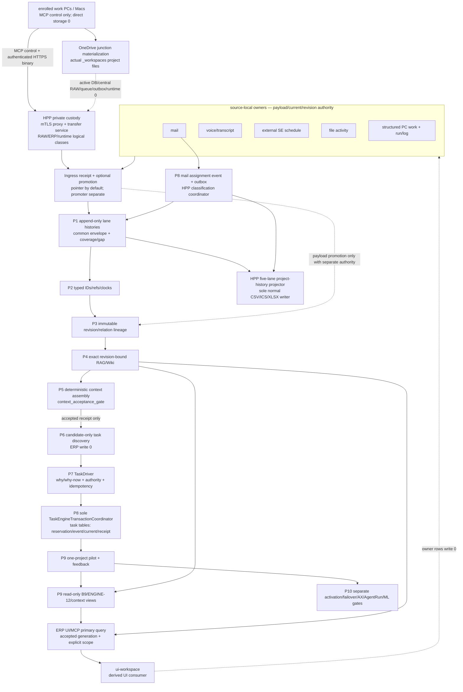

### 5.1 한 줄 owner 규칙

- 원천 내용은 원천 owner가 가진다. Soulforge는 승인된 revision/pointer만 연결한다.
- P1~P5가 accepted되기 전에는 task candidate/Driver/ERP schema work를 시작하지 않는다.
- TaskDriver ledger는 왜/누가/언제 적용을 허용했는지를 가진다. 공식 업무 상태는 갖지 않는다.
- `TaskEngineTransactionCoordinator` 하나만 TaskEngine의 Driver/task/current/receipt 테이블에 쓴다.
  candidate/decision/apply 명령은 서로 다른 logical authority attestation을 요구하지만 이 task-table
  writer/process는 늘 하나다.
- Coordinator는 apply 때 task ID 예약, Driver apply event, task event, current row, receipt를 한
  transaction으로 쓴다. 별도 물리 writer를 원하면 outbox protocol을 새로 설계해야 하므로 V0에는
  채택하지 않는다.
- Mail 분류는 HPP `mail_classification_coordinator` 하나만 mail identity/current/event/outbox 테이블에
  쓴다. 두 coordinator가 같은 dev-ERP SQLite를 쓰더라도 서로의 table write 권한은 없고, file
  projector는 DB task/mail current를 바꾸지 않는다.
- file reconciler와 TaskEngine coordinator는 별도 logical identity/authority다. 같은 물리 PC에 있어도 합치지 않는다.
- 프로젝트별 5개 사람용 이력 CSV/XLSX는 HPP의 `project_history_projector`만 정상 운영에서 쓴다.
  음성·파일·run 등 기술 원장은 기존 source owner가 계속 쓰며, projector는 accepted event/ref를 읽어
  derived view만 재생성한다. Mac을 포함한 다른 PC의 normal project-history write allowlist는 비어 있다.
- B9, ENGINE-12, RAG/Wiki graph, dashboard는 projection이다. 조회 요청으로 owner row를 바꾸지 않는다.
- feedback은 source별 handoff 후보와 knowledge 후보로 분리하며, 자동으로 source truth가 되지 않는다.
- `ingress_promoter` 후보는 source custody/storage binding/promotion receipt만 소유한다. source writer,
  mail classification coordinator, history projector, TaskEngine coordinator 권한을 빌리지 않는다.
- `personal_work_session_coordinator` 후보는 assignment binding/session event/ingest receipt/completion
  proposal link만 쓴다. closeout·proposal로 task current/event, project history, Wiki/RAG를 직접 쓰지 않는다.
- ERP UI/MCP query adapter는 accepted generation을 읽는 primary user surface일 뿐 owner가 아니다.
  모든 knowledge query는 explicit `project|common` scope를 요구하고 서로 fallback하지 않는다.
- HPP `transfer_service`는 quarantine/inbox binary의 유일 writer이고 HPP `promoter`는 project storage
  binding의 유일 writer다. Client·OneDrive sync·history projector는 이 두 권한을 갖지 않는다.
- 다른 PC의 direct HPP drive/UNC/SMB/SQLite/WAL/SHM/queue 접근 allowlist는 비어 있다. HPP outage 때는
  durable local outbox/HOLD 또는 last-accepted read-only만 허용하며 remote mount나 split writer로
  우회하지 않는다.
- AI delegation은 human grant, trusted device, agent policy, task/object/action의 교집합이며 가장 이른
  parent expiry를 적용하고 parent revoke가 child grant·ticket에 cascade한다.

### 5.2 물리 owner 선택

TaskIntent/TaskDriver/ApplicationReceipt의 권장 물리 owner는 **현재 dev-ERP SQLite DB 안의 새
append-only table**이다. 이유는 task ID 예약·공식 task event·`core_item` 갱신·receipt를 하나의
SQLite transaction으로 묶을 수 있기 때문이다. 별도 JSON 폴더나 두 번째 DB를 만들면 task truth와
복구 경계가 둘로 갈라진다.

이 선택은 owner 결정 D01이 필요하다. 승인 전에는 schema를 설치하지 않는다. project 원문,
RAG body, Wiki body는 dev-ERP DB에 넣지 않고 각각의 승인된 payload owner에 둔다.
이 logical DB 선택은 HPP의 exact physical drive/path를 공개하거나 OneDrive project workspace를 active
DB plane으로 만든다는 뜻이 아니다. HPP private binding과 backup owner는 `VERIFY_HP`다.

### 5.3 optional agent-client owner matrix

외부 agent 도구는 AX·TaskEngine과 같은 정본 계층이 아니라 Soulforge MCP 뒤의 선택적 client adapter다.
ERP/TaskEngine이 소유하는 진실은 **공식 task identity, assignment epoch, 업무 상태, apply receipt,
official completion**으로 한정한다. Source fact, payload/ArtifactRevision, accepted history/context,
Wiki/RAG knowledge와 mission/workflow/party는 기존 owner를 유지하며 MCP 자체도 이 진실을 소유하지 않는다.

| logical client role | 후보 구현 | 허용 책임 | client-local로만 남길 상태 | 금지 |
| --- | --- | --- | --- | --- |
| `TeamAgentGatewayAdapter` | Hermes형 persistent agent shell | 사람/Slack 등 channel session, Soulforge MCP의 최소 allowlist query, 알림·handoff·candidate 제출 | transcript, preference memory, local goal/Kanban/delegation 상태 | ERP task/current/done, accepted knowledge, `.mission/.workflow/.party` mutation |
| `EngineeringWorkbenchAdapter` | Orca형 multi-agent engineering workbench | 한 approved WorkSession 안에서 bounded subtask 분배, 격리 worktree, diff·artifact·validator candidate 수집 | native task/dispatch/decision gate/worker-finished/branch/PR 상태 | official completion, direct main/push/PR, live ERP/DB/RAG write, 다른 agent shell 실행 |
| direct worker client | Codex/승인된 MCP client | 작은 업무의 직접 query→work→checkpoint/proposal | local thread/tool state | TaskEngine coordinator 사칭, raw transcript 자동 수집 |

두 adapter는 sibling MCP client다. Hermes형 gateway가 Orca형 workbench를 실행하거나 그 반대가 되는
parent/child orchestration chain은 금지한다. 같은 `{assignment epoch,account}` WorkSession에는 write-capable
surface coordinator 하나만 존재하며 child agent는 MCP checkpoint·completion proposal을 직접 쓰지 않는다.
Surface를 바꾸려면 old delegation을 revoke하고 terminal handoff와 superseding binding을 먼저 기록한다.

Text/code는 isolated worktree candidate로 병렬화할 수 있다. Allegro/OrCAD, HWPX, Excel, PowerPoint,
CAD 등 merge가 안전하지 않은 binary engineering artifact는 여러 agent가 read/review할 수 있어도 실제
artifact revision writer는 하나뿐이다. Drag/drop/chat attachment는 project acceptance가 아니며 §3.5의
authenticated HTTPS custody→promotion→exact ArtifactRevision 경계를 그대로 따른다.

## 6. code·DB·API·ID·event 상세 설계

### 6.1 코드 delta와 caller/consumer

| 파일/module | symbol 또는 책임 | caller | consumer | 계획 |
| --- | --- | --- | --- | --- |
| `guild_hall/shared/temporal_identity.mjs` | `validateTypedRef`, canonical serialization, Source/Revision/RAG ID builder, collision guard | source/RAG/task adapters | ledger validators | candidate 구현을 C01A/P2에서 재검토해 `BUILD`; 기존 owner ID는 `preserveOwnerIssuedIdentity`로 유지 |
| `guild_hall/shared/temporal_relation.mjs`, proposed `temporal_owner_adapter.mjs` | relation validator와 기존 source-revision/knowledge-binding owner adapter; generic ledger writer 금지 | C06A/C09L | B9/RAG/ERP typed refs | C06A synthetic validator/adapter, C09L은 정본 경로의 approved private materialization만 |
| `ui-workspace/apps/dev-erp/src/task_driver.mjs` | `build/validateTaskIntent`, `build/validateTaskDriver`, policy/revocation, event, replay, follow-up candidate | intake adapters, API | persistence, tests, projections | candidate의 pure core를 최신 main에 bounded 재구현 |
| `ui-workspace/apps/dev-erp/src/task_driver_persistence.mjs` | install, immutable insert, replay, `applyTaskDriverDecisionSet` | server의 유일 apply route | dev-ERP DB | C02에서 synthetic DB 전용으로 먼저 구축; allocator/reservation과 typed task event를 보강 |
| `ui-workspace/apps/dev-erp/src/task_engine_runtime_binding.mjs`, `tools/task_engine_runtime_binding.mjs` | local binding fail-closed loader와 compare-and-swap atomic writer | server/coordinator/runtime audit | local operator | C08F/P8에서 public schema·synthetic/feature-OFF foundation 구축; C09D/C10/G00/G01은 같은 loader/writer만 사용 |
| `ui-workspace/apps/dev-erp/src/store.mjs` | `createItem`, `setItemStatus`, `appendEvent`, completion/reopen | server, schedule, intake, autosync | ERP UI, ledger | C03에서 내부 projection adapter로 제한; reopen `DELETE`를 reversal append로 교체 |
| `ui-workspace/apps/dev-erp/server.mjs` | auth, task routes, life-tree routes | HTTP client/ERP UI | store/Driver service | C03에서 Driver API와 projection GET을 분리; 직접 mutation route는 compatibility adapter로 계측 |
| `ui-workspace/apps/dev-erp/tools/auto_intake_cycle.mjs` | 자동 intake orchestration | bounded CLI/scheduler | mail task flow | C04A/P6에서 candidate-only 호출; auto-open 제거가 아니라 policy-gated compatibility로 전환 |
| `ui-workspace/apps/dev-erp/tools/mail_to_task_ledger.mjs` | mail candidate ledger | mail intake | task flow | C04A/P6에서 typed source revision과 Driver receipt 연결 |
| `ui-workspace/apps/dev-erp/tools/voice_to_task_candidates.mjs` | voice accepted-route candidate | voice delivery receipt | task flow | C04A/P6에서 TaskIntent adapter 추가; raw audio/transcript 비조회 유지 |
| `guild_hall/file_activity/file_activity.mjs` | file five-ID/revision/reconciler | node packet | file ledger | 기존 core `REUSE`; C04A/C04B/C07B에서 source/task relation·immutable transport만 추가 |
| `guild_hall/rag/project_rag_paths.mjs` | owner-aware resolver/containment/collision | all RAG writers/readers | project/common RAG | C05에서 candidate 구현을 재검토해 구축 |
| `guild_hall/rag/source_text_index.mjs` 등 기존 RAG consumer | 현재 common 기본 경로 | RAG CLI/automation/UI | index/work card/answer | C05에서 resolver를 주입; legacy default는 compatibility read만 유지 |
| `ui-workspace/apps/dev-erp/src/context_graph.mjs` | B9 projection | DB/relation adapters | B9 UI | C07B/P9에서 task event/relation adapter 추가; write API 금지 |
| `ui-workspace/apps/dev-erp/src/context_life_tree.mjs` | ENGINE-12 일일 projection | mail/ERP/SE/voice/Codex/file adapters | life-tree UI/API | C07A/P5에서 cutoff acceptance를 고정하고 C07B/P9에서 Driver/task event adapter 추가 |
| `ui-workspace/apps/dev-erp/src/file_activity_life_tree_projection.mjs` | file→life-tree strict projection | file ledger | ENGINE-12 | exact ID logic `REUSE`, typed relation만 `MODIFY` |
| `ui-workspace/apps/dev-erp/src/autosync.mjs`, `tools/task_ledger.mjs` | 외부 장부 호환 | store hook/CLI | legacy ledger reader | C03에서 one-way projection으로 제한하고 conflict report 추가 |
| `ui-workspace/apps/dev-erp/src/erp_mcp_service.mjs`, `ui-workspace/apps/dev-erp-mcp/src/tools.mjs` | CURRENT one-shot WorkSession, account-scoped query/upload; TARGET personal lifecycle/query facade | personal MCP | dev-ERP service | current 8 tools는 `REUSE`; AX01/Q8에서 start/bind/checkpoint/closeout/proposal receipt와 accepted query를 feature-OFF `MODIFY`. current record를 lifecycle event로 소급 재해석 금지 |
| `ui-workspace/apps/dev-erp-mcp/ingress_server.mjs`, `src/ingress_*`, `schema/ingress_*` | feature-OFF HPP evidence ingress source foundation; file/structured-PC-work/run receipt만 existing local outbox로 전달 | enrolled client 후보 | HPP ingress receiver 후보; ERP/promoter/history/TaskEngine owner 아님 | public synthetic + multi-process loopback E2E는 `BUILD`; private binding 기본 OFF. D27~D29 acceptance, malware scan/quota/TLS/mTLS, one-seat A8-CANARY와 team rollout은 계속 `VERIFY_HP/HOLD` |
| proposed `guild_hall/ingress/*` contract/helper (exact path D27) | storage binding, promotion decision/receipt validator; payload transport와 projector 금지 | source-specific approved adapter | project/artifact/knowledge owner 후보 | P2/P3 pure lineage 후 P8 feature-OFF contract만 `BUILD`; exact path·role은 owner packet 전 생성 금지 |
| proposed dev-ERP accepted-generation query adapter (exact path D29) | project history/context/knowledge result의 scope·ACL·generation·revision·claim ceiling | ERP UI/personal MCP | read models | Q4 schema 뒤 Q8 feature-OFF `BUILD`; implicit fallback·snapshot reverse import·read-side owner mutation 금지 |
| `ui-workspace/apps/dev-erp/tools/task_engine_inventory.mjs` | five-lane query-only inventory와 deterministic manifest | C00B/C09 operator | P0 receipt/review/pilot | public/synthetic formal C00Q receipt는 retained evidence다. 해당 execution approval은 만료됐고 live/private binding과 C00B strict PASS는 `HOLD` |
| `ui-workspace/apps/dev-erp/tools/a8_synth_secure_access.mjs` | 60-ID public/pathless/feature-OFF secure-access verifier와 deterministic receipt | A8-SYNTH review | D27~D29 security contract review | source foundation과 strict schema/focused adversarial test는 존재한다. public synthetic fixture의 PASS는 owner acceptance·`VERIFY_HP`·A8-CANARY·P0~P10·team/production을 unlock하지 않음 |
| `ui-workspace/apps/dev-erp/tools/task_engine_migration_dry_run.mjs`, `task_engine_schema_migration.mjs` | deterministic migration manifest, gated schema apply | C09/C09R/C10 operator | review/restore/pilot | C09A에서 synthetic-only로 구축; 세 prerequisite 없는 live apply는 fail-closed |

더 단순한 대안인 “각 intake가 `createItem()`을 계속 호출하되 event만 더 남기는 방식”은 채택하지
않는다. authority·idempotency·reservation·replay를 caller마다 중복 구현하게 되고, direct writer가
여러 개 남기 때문이다. 반대로 처음부터 AX Workspace와 AgentRun까지 한 service로 합치는 것도
채택하지 않는다. core safety를 불필요하게 늦춘다.

### 6.2 DB 목표 schema

새 table은 기존 `meta.schema_version` 체계와 별도 key
`task_driver_persistence_schema_version=soulforge.task_driver_persistence.v1`로 추적한다. C02에서는
temporary synthetic DB에만 설치한다. Live 설치는 accepted C00Q inventory guard, C09A migration 도구 검증, C09 inventory, C09R valid
restore receipt를 모두 통과한 뒤 C10에서 별도로 승인해야 한다.

아래 `valid_at`/`known_at` column은 owner-ratified clock crosswalk 전까지 provisional normalized
query-cutoff field다. Persisted source event의 owner-native 사실 시계
(`occurred_at`/`effective_from|to`/`project_applied_at`)와 인지 시계
(`recorded_at`/`ingested_at`)를 payload의 exact ref/field에서 보존하고, cutoff로 lossless하게
왕복됨을 P2 fixture가 증명해야 한다. Source-native clock을 cutoff로 덮어쓰거나 하나로 collapse하면
C02/P8 schema 구현을 시작하지 않는다.

| table | literal column/type | constraint | 성격 |
| --- | --- | --- | --- |
| `task_driver_candidate` | `candidate_id TEXT PRIMARY KEY`, `project_id TEXT NOT NULL`, `candidate_digest TEXT NOT NULL`, `payload_json TEXT NOT NULL` | `project_id REFERENCES core_project(id)`, `UNIQUE(candidate_digest)` | immutable candidate |
| `task_identity` | `task_id TEXT PRIMARY KEY`, `project_id TEXT NOT NULL`, `created_at TEXT NOT NULL`, `identity_digest TEXT NOT NULL`, `payload_json TEXT NOT NULL` | project FK, `UNIQUE(task_id,project_id)`, `UNIQUE(identity_digest)` | current row와 분리된 immutable task ID owner |
| `task_driver_intent` | `intent_id TEXT PRIMARY KEY`, `project_id TEXT NOT NULL`, `intent_kind TEXT NOT NULL`, `valid_at TEXT NOT NULL`, `known_at TEXT NOT NULL`, `intent_digest TEXT NOT NULL`, `payload_json TEXT NOT NULL` | project FK, `UNIQUE(intent_digest)` | immutable intent; 두 시간은 query cutoff이고 native clock ref는 payload에 보존 |
| `task_driver_record` | `driver_id TEXT PRIMARY KEY`, `project_id TEXT NOT NULL`, `target_intent_id TEXT NOT NULL`, `idempotency_key TEXT NOT NULL`, `driver_digest TEXT NOT NULL`, `payload_json TEXT NOT NULL` | project/intent FK, `UNIQUE(idempotency_key)`, `UNIQUE(driver_digest)` | immutable Driver |
| `task_driver_policy` | `policy_ref_key TEXT PRIMARY KEY`, `project_id TEXT NOT NULL`, `policy_digest TEXT NOT NULL`, `valid_from TEXT NOT NULL`, `valid_to TEXT`, `payload_json TEXT NOT NULL` | project FK, `UNIQUE(policy_digest)` | immutable policy revision |
| `task_driver_policy_revocation` | `revocation_ref_key TEXT PRIMARY KEY`, `policy_ref_key TEXT NOT NULL`, `revoked_at TEXT NOT NULL`, `known_at TEXT NOT NULL`, `revocation_digest TEXT NOT NULL`, `payload_json TEXT NOT NULL` | policy FK, `UNIQUE(revocation_digest)` | immutable revocation |
| `task_driver_event` | `event_id TEXT PRIMARY KEY`, `project_id TEXT NOT NULL`, `driver_id TEXT NOT NULL`, `event_sequence INTEGER NOT NULL`, `idempotency_key TEXT NOT NULL`, `event_kind TEXT NOT NULL`, `recorded_at TEXT NOT NULL`, `valid_at TEXT NOT NULL`, `event_digest TEXT NOT NULL`, `payload_json TEXT NOT NULL` | project/driver FK, `UNIQUE(idempotency_key)`, `UNIQUE(event_digest)`, `UNIQUE(project_id,event_sequence)` | append-only 판단/적용 event; `valid_at`은 provisional cutoff이고 native fact/knowledge clocks를 lossless 보존 |
| `task_driver_authority_attestation` | `event_id TEXT PRIMARY KEY`, `evidence_digest TEXT NOT NULL`, `payload_json TEXT NOT NULL` | event FK, `UNIQUE(evidence_digest)` | immutable authority 증명 포인터 |
| `task_driver_writer_attestation` | `evidence_digest TEXT PRIMARY KEY`, `project_id TEXT NOT NULL`, `driver_id TEXT NOT NULL`, `writer_role TEXT NOT NULL`, `valid_at TEXT NOT NULL`, `payload_json TEXT NOT NULL` | project/driver FK | immutable writer binding 증명 |
| `task_id_reservation` | `reservation_id TEXT PRIMARY KEY`, `project_id TEXT NOT NULL`, `driver_id TEXT NOT NULL`, `idempotency_key TEXT NOT NULL`, `task_id TEXT NOT NULL`, `allocated_at TEXT NOT NULL`, `finalized_event_id TEXT NOT NULL`, `payload_json TEXT NOT NULL` | project/driver/final Driver event FK, composite `(task_id,project_id)`→task_identity, `UNIQUE(driver_id,idempotency_key)`, `UNIQUE(task_id)` | apply transaction 안에서 발급·finalize되는 immutable reservation |
| `task_driver_task_baseline` | `task_id TEXT PRIMARY KEY`, `project_id TEXT NOT NULL`, `task_revision_ref_json TEXT`, `work_status TEXT NOT NULL`, `baseline_digest TEXT NOT NULL`, `payload_json TEXT NOT NULL` | composite `(task_id,project_id)`→task_identity, `UNIQUE(baseline_digest)` | immutable legacy crosswalk baseline |
| `task_event` | `task_event_id TEXT PRIMARY KEY`, `task_id TEXT NOT NULL`, `project_id TEXT NOT NULL`, `event_kind TEXT NOT NULL`, `from_status TEXT`, `to_status TEXT`, `valid_at TEXT NOT NULL`, `known_at TEXT NOT NULL`, `driver_event_id TEXT`, `reverses_task_event_id TEXT`, `event_digest TEXT NOT NULL`, `payload_json TEXT NOT NULL` | composite `(task_id,project_id)`→task_identity, optional Driver event/self-reversal FK, `UNIQUE(event_digest)` | 공식 append-only 업무 event; cutoff와 owner-native clocks의 ratified lossless crosswalk 전 schema 고정 금지 |
| `task_application_receipt` | `driver_event_id TEXT PRIMARY KEY`, `project_id TEXT NOT NULL`, `task_id TEXT NOT NULL`, `task_event_id TEXT NOT NULL`, `before_work_status TEXT`, `after_work_status TEXT`, `receipt_digest TEXT NOT NULL`, `payload_json TEXT NOT NULL` | Driver event/task event FK, composite `(task_id,project_id)`→task_identity, `UNIQUE(task_event_id)`, `UNIQUE(receipt_digest)` | immutable atomic apply 결과; creation reversal은 after status null 허용 |

P8 mail schema는 task table과 같은 writer 권한을 공유하지 않는다. 같은 물리 HPP에 있어도
`mail_classification_coordinator`와 `project_history_projector`는 별도 logical identity다. 권장 table은
다음과 같으며 D22 schema-v2/cutover 결정 전에는 synthetic DB에만 설치한다.

| mail table (`TARGET`) | 핵심 column/constraint | writer/transaction role |
| --- | --- | --- |
| `mail_occurrence_identity` | `mail_occurrence_id TEXT PRIMARY KEY`, `source_owner_ref_json TEXT NOT NULL`, `native_occurrence_digest TEXT NOT NULL UNIQUE`, `first_known_at TEXT NOT NULL`, `metadata_digest TEXT NOT NULL UNIQUE` | project와 독립된 immutable identity; source payload 저장 금지; UPDATE/DELETE reject |
| `mail_project_assignment_current` | `mail_occurrence_id TEXT PRIMARY KEY REFERENCES mail_occurrence_identity`, `project_code TEXT`, `assignment_revision INTEGER NOT NULL CHECK(assignment_revision>=1)`, `last_event_id TEXT NOT NULL REFERENCES mail_project_assignment_event(event_id) DEFERRABLE INITIALLY DEFERRED`, `operation_id TEXT NOT NULL`, `generation_id TEXT NOT NULL`, `classification_epoch INTEGER NOT NULL CHECK(classification_epoch>=1)`, `updated_at TEXT NOT NULL` | classification coordinator만 expected revision+active classification epoch CAS로 바꾸는 materialized current |
| `mail_project_assignment_event` | `event_id TEXT PRIMARY KEY`, `mail_occurrence_id TEXT NOT NULL REFERENCES mail_occurrence_identity`, `event_kind TEXT NOT NULL CHECK(event_kind IN ('classified','reclassified_out','reclassified_in','unclassified'))`, `from_project_code TEXT`, `to_project_code TEXT`, `operation_id TEXT NOT NULL`, `generation_id TEXT NOT NULL`, `classification_epoch INTEGER NOT NULL CHECK(classification_epoch>=1)`, `valid_at TEXT NOT NULL`, `known_at TEXT NOT NULL`, `recorded_at TEXT NOT NULL`, `metadata_digest TEXT NOT NULL UNIQUE` | append-only assignment/reclassification history; UPDATE/DELETE trigger reject |
| `mail_projection_outbox` | `outbox_id TEXT PRIMARY KEY`, `event_id TEXT NOT NULL REFERENCES mail_project_assignment_event(event_id)`, `project_code TEXT NOT NULL`, `projection_kind TEXT NOT NULL CHECK(projection_kind IN ('csv','ics','xlsx'))`, `generation_id TEXT NOT NULL`, `classification_epoch INTEGER NOT NULL CHECK(classification_epoch>=1)`, `status TEXT NOT NULL CHECK(status IN ('pending','claimed','published','failed'))`, `claimed_by TEXT`, `claimed_projector_epoch INTEGER`, `published_projector_epoch INTEGER`, `attempt_count INTEGER NOT NULL DEFAULT 0 CHECK(attempt_count>=0)`, `published_manifest_digest TEXT`, `committed_at TEXT NOT NULL`, `UNIQUE(event_id,project_code,projection_kind,generation_id)` | current+event와 같은 DB transaction에서 origin classification epoch로 enqueue; projector만 active projector epoch CAS로 claim/publish |

한 분류 operation은 `BEGIN IMMEDIATE` 안에서 occurrence identity 확인, current revision CAS,
append-only assignment event, 해당 project projection outbox를 함께 commit한다. A→B 재분류는 같은
`operation_id`, `generation_id`, `classification_epoch`로 A의 `reclassified_out`과 B의 `reclassified_in`을
append하고 A history를 삭제하지 않는다. Current의 `last_event_id`는 B의 `reclassified_in`을 가리키며,
unclassified 전환이면 `unclassified` event를 가리킨다. `reclassified_out`은 current 대표 event가 아니다.
Deferred FK를 commit 전에 검사해 current/event/outbox 원자성을 schema에서도 강제한다. File publish는 DB transaction 밖이므로 staged manifest와
atomic replace를 쓰되 outbox generation이 logical exactly-once 경계다.

Literal index는 다음 여섯 개를 최소값으로 둔다.

```sql
CREATE INDEX idx_task_identity_project
  ON task_identity(project_id, task_id);
CREATE INDEX idx_task_driver_intent_project_known
  ON task_driver_intent(project_id, known_at, intent_id);
CREATE INDEX idx_task_driver_record_project_driver
  ON task_driver_record(project_id, driver_id);
CREATE INDEX idx_task_driver_event_project_sequence
  ON task_driver_event(project_id, event_sequence);
CREATE INDEX idx_task_event_task_known
  ON task_event(task_id, known_at, task_event_id);
CREATE INDEX idx_task_event_project_valid
  ON task_event(project_id, valid_at, task_event_id);
```

Mail v2의 최소 index와 mutation guard는 별도다.

```sql
CREATE INDEX idx_mail_assignment_event_occurrence_known
  ON mail_project_assignment_event(mail_occurrence_id, known_at, event_id);
CREATE INDEX idx_mail_assignment_event_generation
  ON mail_project_assignment_event(generation_id, operation_id, event_id);
CREATE INDEX idx_mail_projection_outbox_claim
  ON mail_projection_outbox(status, committed_at, outbox_id);
CREATE INDEX idx_mail_projection_outbox_generation
  ON mail_projection_outbox(generation_id, project_code, projection_kind, outbox_id);
```

`mail_occurrence_identity`와 `mail_project_assignment_event`는 UPDATE/DELETE를 항상 거부한다.
`mail_project_assignment_current`는 coordinator의 같은 `BEGIN IMMEDIATE` transaction에서 expected
`assignment_revision`과 active `classification_epoch`가 모두 맞을 때만 CAS한다. Outbox의 identity/event/project/
generation/classification-epoch/kind column은 immutable이고, projector는 active `projector_epoch`를
`claimed_projector_epoch`와 `published_projector_epoch`에 기록하면서 `pending→claimed→published|failed`
상태와 attempt/manifest field만 CAS한다. Stale classification/projector epoch, missing event FK,
current `last_event_id` FK, generation mismatch는 transaction
전체를 rollback한다.

Append-only UPDATE/DELETE 거부 trigger 대상은 `task_driver_candidate`, `task_identity`, `task_driver_intent`,
`task_driver_record`, `task_driver_policy`, `task_driver_policy_revocation`, `task_driver_event`, 두
attestation table, `task_id_reservation`, `task_driver_task_baseline`, `task_event`,
`task_application_receipt`다. `core_item`만 event replay의 mutable current projection이다.
Reservation은 pending row를 UPDATE하지 않는다. Apply transaction 안에서 task ID를 발급하고
final Driver event까지 한 번에 기록하며, 실패 시 전체 rollback한다.

`task_event.event_kind`의 최소 allowlist는 `task_created`, `task_creation_reversed`, `status_changed`, `task_reopened`,
`task_reanchored`, `completion_recorded`, `completion_reversed`, `decision_recorded`,
`verification_recorded`, `outcome_recorded`, `task_archived`다. Completion/Decision/Verification/Outcome은
별도 mutable current table을 늘리기보다 해당 immutable event ID를 각각의 typed entity ID로 사용한다.
Artifact는 payload가 아니라 external `ArtifactRevision` typed ref만 event에 둔다. 이 방식이
completion/outcome별 두 번째 history store를 만드는 것보다 단순하다.

`task_identity`가 immutable task ID와 event FK를 소유하고 `core_item`은 current projection만
소유한다. 따라서 새 task rollback은 원 `task_created`를 가리키는 정확히 한
`task_creation_reversed.reverses_task_event_id`를 append한 뒤 같은 transaction에서 해당
`core_item` projection row를 제거할 수 있다. Identity와 두 event는 남는다. 기존 task rollback은
reversal event 뒤 baseline current row를 재구축한다. Replay는 create-reversal 쌍을 history에는
보존하되 current에는 내보내지 않으며, 이 규칙은 C01B pure test와 C02 FK/transaction test에서
고정한다.

Task DB 밖의 source revision과 knowledge binding 물리 owner는 새 generic ledger가 아니라 이미
`TEMPORAL_KNOWLEDGE_ONTOLOGY_V0.md`와 redesign storage contract가 고정한 다음 target shape를 재사용한다.

```text
_workmeta/<project_code>/
├─ knowledge/source_revision_records/<source_revision_id>.yaml
├─ knowledge/source_revision_events/<YYYY-MM>.jsonl
└─ ontology/knowledge_bindings/events/<YYYY-MM>.jsonl

_workmeta/system/
├─ knowledge/source_revision_records/<source_revision_id>.yaml
└─ knowledge/source_revision_events/<YYYY-MM>.jsonl
```

| record | 기존/목표 owner | 필수 metadata와 경계 |
| --- | --- | --- |
| SourceRevision | 위 `knowledge/source_revision_records` | schema, typed source ref, revision ID, digest, valid_at/known_at, pointer, supersedes; body/file 없음 |
| source revision state event | 위 월별 `knowledge/source_revision_events` | event ID, exact revision ref, state, clocks, supersedes; append-only JSONL |
| knowledge application/binding event | project 월별 `ontology/knowledge_bindings/events` | event 또는 binding ID, exact project/task/source/knowledge refs, predicate, clocks, supersedes; fuzzy text 없음 |
| mail/voice/PC/file/run occurrence | §3.4의 각 technical source owner | common envelope는 adapter output이며 두 번째 occurrence ledger를 만들지 않음 |
| NodeObservation | 기존 `reports/file_activity/**` | logical file/revision/observation/packet refs; generic temporal path로 복사하지 않음 |
| ArtifactRevision와 non-knowledge relation | `UNKNOWN/D06` | 기존 owner가 확인되기 전 materialize 금지; dev-ERP와 projection은 typed ref만 보유 |
| ProjectionReceipt | H06/P9의 owner-approved report/run evidence path | input cutoff/digest, output digest, gap, writer attestation; 별도 truth가 아님 |

SourceRevision은 revision별 immutable file, source 상태와 knowledge application은 월별 append-only event다.
Occurrence/file/run history는 기존 source-local owner를 유지한다. C06A adapter는 이 owner별 partition을
검증하고 exact typed ref만 내보내며, 모든 record를 한 `_workmeta/**/ledgers/temporal` tree로 복사하지
않는다. Knowledge 외 relation의 physical owner가 필요하면 D06에서 기존 계약과 crosswalk/migration을
먼저 승인해야 하며, owner 결정 전에는 synthetic validator만 허용한다.

#### 6.2A Ingress·personal WorkSession·accepted query logical records (`TARGET` only)

아래는 승인된 DDL/table/path가 아니라 D27~D29가 exact owner를 정할 때 사용할 최소 logical shape다.
현재 `erp_mcp_work_session`은 one-shot compatibility facade로 남기며 accepted start, ordered closeout,
missing-closeout 또는 completion proposal로 소급 해석하지 않는다.

| logical record | 최소 field | 유일 writer와 금지 |
| --- | --- | --- |
| `TaskAssignmentRef` | task/project/account, `assignment_epoch`, task revision, assignment event ref | ERP assignment owner; personal coordinator가 발급·수정 금지 |
| `ActorDelegationGrant` | user/device/agent/opaque-thread/task/project/artifact/revision/action, parent refs, issued/expiry/revoked refs | auth broker; human grant∩trusted device∩agent policy∩object/action, earliest expiry와 cascading revoke 강제 |
| `PersonalWorkSession` | session ID, assignment ref, actor account, producer node, start key/time/digest, nullable supersedes session | personal session coordinator; `{assignment epoch,account}` active primary 하나 기본 |
| `PersonalThreadBinding` | binding ID, session ID, thread namespace, **opaque thread-ref digest**, bound time, supersedes binding, binding digest | raw Codex thread ID 저장·응답 금지; handoff overwrite 금지 |
| `WorkSessionEvent` | event/session ID, global sequence, kind, previous/event digest, idempotency key, occurred/received clocks, bounded summary/output/verification/next/stop/artifact refs, nullable closeout kind | 한 actor+node chain; task current/event·Wiki/RAG write 금지 |
| `IngestReceipt` | receipt/session/event, `accepted|duplicate|held_gap|quarantined|rejected`, next expected sequence, received time, digest, conflict/quarantine ref | reconciler; same seq/same digest no-op, same seq/different digest quarantine, gap projection 0 |
| `CompletionProposalLink` | proposal/task/session/closeout refs, expected task revision, digest, `pending`, Driver candidate ref, created time | proposal writer; 공식 task 완료와 knowledge promotion 금지 |
| `StorageBindingPromotionReceipt` | promotion/operation ID, occurrence/revision/content/from/to binding/project refs, `reference|copy|move|derive`, authority/actor/writer, scan/retention/ACL refs, clocks, input/output digests, status, rollback/supersession ref | ingress promoter only; payload body/path는 receipt에 없음 |
| `BinaryTransferTicket` | opaque ticket, full actor/delegation chain, task/project/artifact/revision/action/method/audience, hash/size/media/expiry/revoke refs | HPP ticket verifier; URL-only authority·client destination path·cross-ticket field swap 금지 |
| `ArtifactRevision` | artifact/revision ID, immutable content hash/size/media, source/derived lineage, policy label, accepted receipt | exact revision owner; redacted derivative는 immutable new revision이고 raw fallback 금지 |
| `AcceptedGenerationManifest` | scope/project, lane or query kind, generation/cutoff/coverage/gaps, source revision set digest, API/CSV/XLSX result digests, accepted pointer revision | accepted-generation coordinator; unaccepted generation을 current로 노출 금지 |

Client-local outbox envelope는 session/node/sequence/previous digest/payload digest/idempotency key와
verified server receipt ID/digest/status를 가진다. Server는 local `pending_outbox`를 추정하지 않으며,
client는 durable ack 검증 전 compact하지 않는다. exact local writer/path, fsync 방식, 암호화, retention은
D28 `VERIFY_HP`이고 이 문서에서 생성하지 않는다.

Candidate branch의 `task_driver_apply_receipt` 명칭은 C02 설계 리뷰에서
`task_application_receipt`로 정규화할지 owner가 결정한다. 기존 `event_log`는 바로 삭제하지 않는다.
`task_event`를 공식 typed 원장으로 쓰고, 호환 기간 동안 같은 transaction에서 `event_log`에 한 번
mirror한다. 모든 consumer 전환과 replay parity 뒤에만 mirror 제거를 검토한다.

Append-only table에는 UPDATE/DELETE 거부 trigger를 둔다. 단, trigger DDL은 synthetic DB에서
up/down migration과 restore를 통과한 뒤에만 live 후보가 된다. migration 도구의 down은 table을
즉시 drop하는 방식이 아니라 target writer OFF→readback export digest→synthetic restore까지를
검증한다. Live commit 뒤 rollback은 §13.2의 reversal event+current rebuild를 사용하며,
pre-migration DB restore는 TaskEngine event가 아직 0인 배포 실패 또는 별도 event
export/re-import 검증을 마친 재난 복구에만 사용한다.

### 도식 5 — DB current row와 append-only event

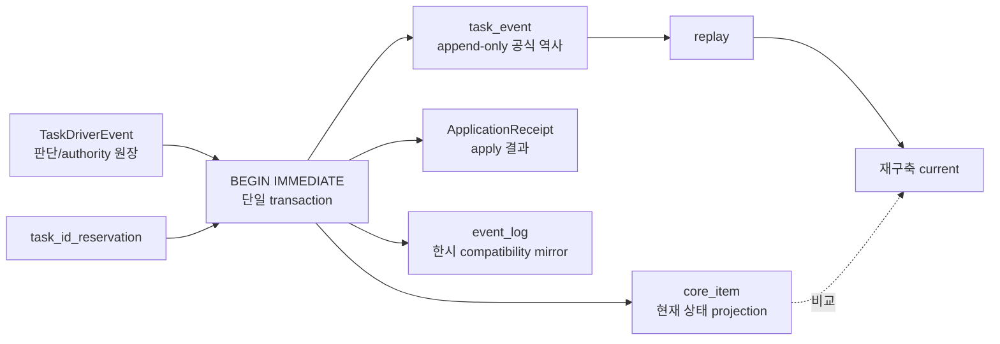

Transaction 불변식:

1. `BEGIN IMMEDIATE` 뒤 project, expected revision, authority, writer attestation을 다시 검사한다.
2. 같은 Driver/idempotency key가 이미 final receipt를 가지면 같은 receipt를 반환하고 no-op한다.
3. create이면 ERP allocator가 ID를 정하고 `task_identity`와 reservation을 만들거나 기존
   identity/reservation을 재사용한다.
4. Driver apply event, task event, `core_item` projection, compatibility event, receipt가 모두 성공해야 commit한다.
5. 하나라도 실패하면 rollback하고 `409 conflict`, `423 writer_not_primary` 또는 quarantine 결과만
   반환한다. 부분 적용은 없다.

### 6.3 ID·revision·relation graph

기존 owner-issued project/task/source ID는 바꾸지 않는다. 새 digest는 동일성 검증과 event/revision
식별에 쓰며, 기존 ID를 hash ID로 rekey하지 않는다.

### 도식 3 — ID·relation·revision graph

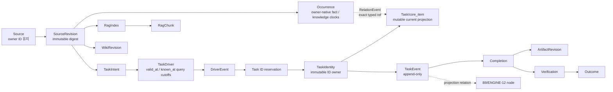

Typed ref wire shape는 다음처럼 고정한다.

```json
{"entity_type":"task","owner_surface":"dev_erp","entity_id":"<owner-issued-id>"}
```

- relation endpoint는 bare ID를 받지 않는다.
- digest basis는 canonical JSON, NFC text, sorted semantic set, full SHA-256를 사용한다.
- 짧은 표시 ID가 충돌하거나 같은 alias가 여러 full digest를 가리키면 write하지 않고 quarantine한다.
- `valid_at`/`known_at`은 point-in-time query cutoff다. Persisted source event는 owner-native
  `occurred_at`/`effective_from|to`/`project_applied_at`과 `recorded_at`/`ingested_at`을 보존하고,
  normalized cutoff field가 필요하면 P2 owner-approved crosswalk로 lossless하게 파생한다.
- correction은 과거 row를 수정하지 않고 supersede/reversal event를 추가한다.

### 6.4 두 상태축

### 도식 6 — 판단/적용 상태와 work status

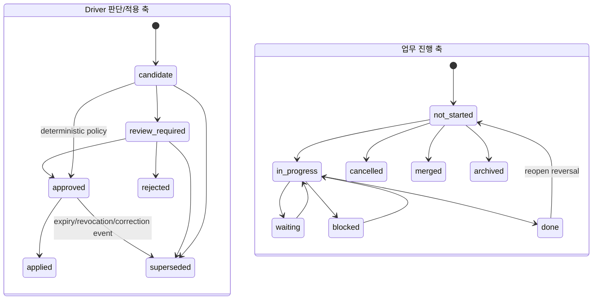

`approved`는 일이 완료됐다는 뜻이 아니고, `done`은 새 제안이 자동 승인됐다는 뜻이 아니다.
`decision_application_state`는 lifecycle 정본의
`candidate|review_required|approved|applied|rejected|superseded`만 쓴다. Expiry/revocation/block reason은
별도 authority event이며 임의 상태가 아니다. Work axis는
`not_started|in_progress|waiting|blocked|done|cancelled|merged|archived`를 쓴다. 현행
`unclassified|open|doing` 등은 D03 crosswalk 전까지 legacy projection에만 유지한다. 새 상태가 필요하면
C01B 전에 protected lifecycle contract의 별도 owner 승인과 same-slice sync가 필요하다.

### 6.5 제안 API와 CLI

다음은 C03 이후의 proposed surface다. route를 만들기 전 C01B/C02/C08F contract가 먼저 통과해야 한다.

| method/route 또는 command | golden wire schema ref | request/response | auth/write owner | idempotency·오류 |
| --- | --- | --- | --- | --- |
| `POST /api/task-engine/candidates` | `docs/contracts/task_engine_candidate_api.v1.schema.json` | typed source revision + candidate / candidate ref·digest | logical producer; SQLite write는 coordinator | duplicate=same result; invalid `400`; boundary `403/422` |
| `POST /api/task-engine/drivers` | `docs/contracts/task_engine_driver_api.v1.schema.json` | intent + Driver / Driver ref·digest | human/trusted producer attestation; coordinator writes | idempotency UNIQUE; collision `409 quarantine` |
| `POST /api/task-engine/drivers/:id/events` | `docs/contracts/task_engine_driver_event_api.v1.schema.json` | approve/reject/block/revoke / event ref·digest | human 또는 bounded policy authority; coordinator writes | expiry/revocation; stale `409`, forbidden `403` |
| `POST /api/task-engine/drivers/:id/apply` | `docs/contracts/task_engine_apply_api.v1.schema.json` | expected revision + apply event / ApplicationReceipt | apply authority를 검증한 **sole coordinator** | `Idempotency-Key` 필수; same receipt/no-op; wrong authority `423` |
| `GET /api/task-engine/drivers/:id` | `docs/contracts/task_engine_projection_api.v1.schema.json` | typed refs와 event/receipt projection | project read | DB 전후 count/digest 불변 |
| `GET /api/task-engine/replay` | `docs/contracts/task_engine_replay_api.v1.schema.json` | project ref + cutoff / projection digest·gap report | admin/project read, query-only | mutation `0`; bad cutoff `400` |
| `GET /api/context-life-tree` 기존 surface | 기존 ENGINE-12 response + replay `$defs` | daily projection | project read | new adapter도 owner mutation `0` |
| `POST /api/mail-history/occurrences/:id/classification` (`TARGET P8`) | proposed `docs/contracts/mail_history_classification.v2.schema.json` | expected assignment revision + `classification_epoch` + from/to project + operation/generation / assignment events+outbox refs | `mail_classification_coordinator`; ERP task authority 없음 | local lock+valid classification lease 필수; stale `409/423`, retry=same events |
| `node guild_hall/gateway/project_mail_history_projector.mjs --claim-generation <id>` (`TARGET P8`) | proposed generation manifest schema | outbox claim with active `projector_epoch`→staged CSV/ICS/XLSX→source-epoch digest parity→publish receipt | `project_history_projector` only | stale projector lease reject; same generation no-op |
| `node guild_hall/gateway/validate_project_mail_history_generation.mjs --generation <id>` (`TARGET P8`) | same manifest schema | DB event/outbox↔CSV/ICS/XLSX row count+digest parity | read-only validator | mutation `0`; mismatch nonzero/fail closed |
| `npm.cmd run validate:task-engine-core-v1` (`TARGET`; C01B가 root `package.json`에 등록) | not_applicable | pure contract/synthetic replay | local validator | registration 전 `not_run`; exit `0`가 C01B/P7 acceptance |
| `node tools/task_engine_inventory.mjs --query-only --json` (`FORMAL RECEIPT RETAINED`; current execution authority/live binding HOLD) | `docs/contracts/task_engine_inventory_manifest.v1.schema.json` | five-lane owner/root/writer/caller/consumer/source-availability + schema/count aggregate manifest | retained C00Q receipt 뒤 별도 current C00B owner authority의 read-only | source command는 존재하지만 live command가 아님; migration import/raw value 금지. descriptor/evidence authority가 하나라도 없거나 만료되면 BLOCKED; authority가 확인한 current 부재·gap은 inventory finding이며 H00 completeness PASS가 아님 |
| `node tools/task_engine_migration_dry_run.mjs --plan <opaque-ref>` | `docs/contracts/task_engine_migration_manifest.v1.schema.json` | no-write crosswalk/conflict manifest | approved operator | conflict exit nonzero, apply 없음 |
| `node tools/task_engine_schema_migration.mjs --dry-run` | migration manifest schema | DDL/collision/up-down plan | local synthetic by default | `--apply`는 approval+maintenance+backup receipt 모두 없으면 write 0 |
| `node tools/task_engine_replay.mjs --fixture <synthetic>` | replay API `$defs` | digest 2회 | test only | byte-identical digest 요구 |
| `node tools/task_engine_runtime_binding.mjs inspect --binding <local-binding> --json` | `docs/contracts/task_engine_runtime_binding.v1.schema.json` | current mode/digest/expiry/role aggregate | local read-only | raw path/secret 출력 0; invalid nonzero |
| `node tools/task_engine_runtime_binding.mjs plan --mode off\|pilot\|production ...` | same binding schema | canonical candidate + digest | owner-approved local operator | write 0; invalid scope/expiry nonzero |
| `node tools/task_engine_runtime_binding.mjs apply --candidate <candidate> --expected-current-digest <digest-or-null> --owner-approval-ref <opaque>` | same binding schema | atomic replace receipt | owner-approved local operator | explicit apply+CAS; conflict `409`, partial write 0 |

#### 6.5A Personal MCP lifecycle·query target surface (`TARGET`, feature OFF)

현재 구현된 personal MCP 8개 tool은 §3.2/`ERP-MCP-V0`의 CURRENT다. 아래 tool은 아직 구현되지
않았고 AX/Q side-card의 별도 승인 대상이다. `erp_publish_work_session`은 legacy one-shot facade로
보존하며 lifecycle start/closeout으로 조용히 바꾸지 않는다.

| proposed MCP tool | request/result 핵심 | auth·idempotency | 허용 mutation / 금지 |
| --- | --- | --- | --- |
| `erp_get_my_tasks` | account-scoped task assignments와 revision refs | brokered actor chain; cursor generation pin | business row `0`; current bearer agenda compatibility는 legacy facade로만 유지 |
| `erp_start_or_bind_work_session` | exact assignment revision+opaque thread-ref digest+node→session/start receipt | account+registered node+active assignment; `(assignment,actor,start_key)` same digest=same receipt, conflict/stale/cardinality=`409` | session+binding+receipt만; task/history/knowledge `0` |
| `erp_publish_work_checkpoint` | session sequence+previous digest+bounded result→ingest receipt | bound actor/node/current assignment; same seq/digest duplicate, different digest quarantine, gap held | session event/receipt만 |
| `erp_closeout_work_session` | terminal `completed_candidate|blocked|handoff|abandoned` event | checkpoint와 같은 chain; terminal retry idempotent | task status/event `0`; handoff는 old row overwrite 금지 |
| `erp_submit_completion_proposal` | accepted closeout+expected task revision→pending proposal/Driver candidate link | self/approved capability; same proposal digest no-op | proposal/link만; 공식 completion·knowledge promotion `0` |
| `erp_list_unclosed_work_sessions` | accepted start와 terminal closeout의 server-side gap candidate | self/admin explicit scope | local pending outbox 추정 금지; 조회 대상 owner row `0` |
| `erp_get_work_session_receipt` | receipt status/digest/next sequence | self/admin; foreign existence-safe deny | business row `0` |
| `erp_get_project_history` | accepted generation/cutoff/coverage/gaps+typed rows | explicit project ACL+generation-pinned cursor | projection/query owner row `0`; snapshot reverse import 금지 |
| versioned `erp_get_task_context` | accepted P5 context receipt, exact source/history/knowledge refs | task access+project ACL | legacy response 병행; unaccepted context를 accepted로 표시 금지 |
| `erp_search_knowledge` | explicit `scope=project|common`, exact source/Wiki revision+content+locator+claim ceiling | matching grant; scope 누락/implicit fallback reject | RAG/Wiki/canon/task mutation `0` |
| `erp_submit_knowledge_candidate` | exact evidence+weakest claim ceiling→candidate receipt | candidate capability; stronger promotion state `422` | candidate ledger 한 곳만 append; Wiki/RAG/canon/ontology/task `0` |
| `erp_prepare_binary_upload` | artifact/revision intent+declared hash/size/media→bounded HTTPS upload ticket | enrolled device+delegation intersection; URL alone invalid | HPP quarantine ticket만; destination path·project binding `0` |
| `erp_prepare_exact_revision_download` | exact artifact+revision+audience→bounded range-capable HTTPS download ticket | artifact/revision/action ACL, expiry/revoke recheck | exact accepted revision bytes only; latest/raw fallback·directory access `0` |

공통 TARGET 오류는 `401` invalid/revoked/expired, `403` capability/node/scope, foreign object에는
existence leak 없는 `404`, `409` stale/idempotency/sequence/generation, `422` shape/evidence/claim,
`423` feature/writer inactive, `429` rate limit이다. Read tool의 “zero mutation”은 보호 대상 task/history/
knowledge/business row delta `0`을 뜻한다. CURRENT 인증이 `erp_mcp_access_token.last_used_at`을 갱신할
수 있으므로 audit touch까지 DB byte-zero라고 주장하지 않으며, 향후 access event가 필요하면 별도
명시적 audit owner/contract로 분리한다.

§6.5의 TaskEngine/mail POST write route는 C08F/P8의 runtime binding loader를 공통 precondition으로 쓰고,
coordinator가 transaction 안에서 같은 binding digest를 다시 검증한다. C03 구현 시점에는 binding
instance가 없으므로 route는 항상 `423 binding_not_active`와 write `0`이다. C09D OFF, C10 pilot,
G01 production revision 외의 별도 env flag나 fallback grant는 없다.
§6.5A personal MCP route의 exact binding owner는 D28/AX-G1에서 별도로 정하며, 그 전에는 feature OFF다.

Golden JSON schema의 top-level field는 다음에서 늘리거나 이름을 바꾸려면 contract review가 필요하다.

| schema | request/query required fields | success response required fields |
| --- | --- | --- |
| candidate API | `schema_version`, `project_ref`, `source_revision_refs`, `candidate_spec`, `requested_at` | `schema_version`, `candidate_ref`, `candidate_digest`, `stored_status`, `duplicate`, `receipt_ref` |
| Driver API | `schema_version`, `intent`, `driver`, `requested_at` | `schema_version`, `intent_ref`, `driver_ref`, `driver_digest`, `decision_state`, `duplicate` |
| Driver event API | `schema_version`, `driver_ref`, `event`, `authority_attestation` | `schema_version`, `event_ref`, `event_digest`, `decision_state`, `duplicate` |
| apply API | `schema_version`, `driver_ref`, `apply_event`, `expected_task_revision_ref` | `schema_version`, `application_receipt`, `task_ref`, `task_event_ref`, `duplicate` |
| projection API | path `driver_id` | `schema_version`, `driver`, `events`, `application_receipt`, `projection_digest`, `gap_codes` |
| replay API | `project_ref`, `valid_at`, `known_at` | `schema_version`, `cutoff`, `task_projection_digest`, `life_tree_projection_digest`, `gap_codes` |
| inventory manifest | CLI flags `--query-only --json` | `schema_version`, `query_only`, `baseline_refs`, lane별 `physical_owner_ref/default_root_ref/writer_candidates/direct_caller_candidates/consumer_candidates/source_availability_summary`, `source_authority_refs`, `table_counts`, `index_names`, `trigger_names`, `enum_counts`, `unresolved_live_proofs`, `zero_mutation`, `manifest_digest`; `source_availability_summary`는 P0 inventory field이며 H00의 six-state coverage receipt가 아님 |
| migration manifest | `schema_version`, `mode`, `source_refs`, `target_schema_ref` | `crosswalk_counts`, `conflict_counts`, `orphan_counts`, `delete_count`, `prerequisite_receipts`, `manifest_digest` |
| runtime binding | §11.2A의 18개 canonical field 전체 | inspect/plan/apply receipt의 `schema_version`, `mode`, `binding_digest`, `previous_binding_digest`, `changed`, `error_code` |

모든 HTTP 오류 envelope는 `schema_version`, `error_code`, `retryable`, nullable `conflict_ref`, nullable
`quarantine_ref`만 public/log-safe field로 갖는다. Client가 writer attestation을 꾸며 보내지 못하게
coordinator identity와 writer attestation은 server-side binding에서 주입한다.

API request는 title/body 대신 source owner에서 승인된 최소 field만 받고, public log에는 typed ref,
digest, error code만 남긴다. LLM output은 candidate를 만들 수 있지만 approve/apply authority가 없다.

### 6.6 Mail history sole-writer, outbox, parity contract

`CURRENT` public code evidence:

- JS `guild_hall/gateway/project_mail_history_writer.mjs::upsertProjectMailHistory()`는 CSV→XLSX→ICS를
  순차 `writeFile`하고 `_workmeta` CSV/ICS와 `_workspaces` XLSX를 쓴다.
- Python `mail_fetch/collector/storage/project_mail_history.py::ProjectMailHistoryWriter`도 같은 logical
  경로를 쓰지만 별도 XLSX renderer/shape를 가진다.
- `outlook_mail_reconcile.mjs`는 project mail-history CSV를 직접 갱신하며 XLSX generation을 소유하지 않는다.
- dev-ERP `tools/scan_mail_ledger.mjs`는 기존 CSV를 `core_mail`로 ingest한다.
- 이 세 writer와 ERP assignment/event, file projections 사이에는 공통 process lock, role별 lease/
  classification·projector epoch, atomic outbox, same-generation parity/failback validator가 없다.

따라서 `TARGET` normal authority는 HPP의 두 logical identity로 제한한다. 이 절의 mail outbox는
`project_history_projector`가 담당하는 5개 lane 중 mail lane의 가장 강한 parity 경계다. Voice,
structured PC work, file, run/log lane은 각 기술 source owner를 보존한 채 H06에서 accepted된
event/ref와 projection manifest만 같은 projector에 입력한다.

| logical identity | normal rights | prohibited |
| --- | --- | --- |
| `mail_classification_coordinator` | source occurrence를 project-independent ID로 등록하고 DB assignment current+event+outbox를 한 transaction으로 commit | CSV/XLSX 직접 publish, ERP task write, raw body copy |
| `project_history_projector` | mail은 committed outbox, 나머지 4개 lane은 accepted event/ref manifest를 valid `projector_epoch`에서 claim해 프로젝트별 CSV/XLSX를 같은 generation으로 materialize; mail ICS도 함께 유지 | classification current/event 변경, task write, source truth 변경 |
| active voice writer identity | TARGET HPP 또는 accepted failover lease의 Mac이 voice source/runtime을 단독 생산; Mac은 mail/5-lane coverage monitor와 alert candidate 유지 | HPP와 Mac 동시 shared voice write 및 모든 project-history CSV/XLSX write allowlist는 empty |
| `project_history_emergency_fallback` | 평소 dormant; explicit failover에서만 five-lane projector lease를 받고, mail coordinator 권한은 coverage와 별도 승인이 있을 때만 받음 | 자동 승격·자동 failback·voice identity 권한 재사용·ERP task write |

P8의 cutover는 feature-OFF synthetic fixture에서 direct writer reject 규칙을 검증할 뿐 live writer를
전환하지 않는다. 별도 승인된 P9에서만 한 프로젝트의 HPP-primary bounded switch와 rollback을 하고,
P10에서만 production cutover·failover/failback을 허용한다. 기존 CSV/XLSX 경로와 consumer는 유지하되,
전환 대상 범위에서는 projector가 생성한 `projection_generation_id`와 manifest가 없는 direct write를
거부한다. `mail_occurrence_id`는 project를 포함하지 않으며 reclassification 전후 동일하다.

## 7. 전체 file/folder/repository/knowledge 저장 구조

### 도식 2 — source-local + public/project/common/system physical tree

```text
source-local owners                         # 원문/current/revision의 권위자
├─ mail / voice / SE schedule / files
└─ owner-approved revision pointer ───────────────┐
                                                  │
Soulforge public Git                              │
├─ .registry/                 # species/class canon
├─ .unit/                     # active subject owner
├─ .workflow/                 # orchestration canon
├─ .party/                    # reusable orchestration template
├─ .mission/                  # 승인된 mission plan만
├─ docs/architecture/         # root contracts
├─ guild_hall/                # public-safe engines/adapters
└─ ui-workspace/apps/dev-erp/ # derived UI consumer + ERP app code; canon owner 아님, raw payload 없음

owner-approved local/private planes
├─ _workspaces/<project_code>/                  # actual logical project worksite/body; actual project payload·artifact owner
│  ├─ ... source/artifact payload              # project payload
│  ├─ reference_payloads/rag/                  # project RAG target
│  └─ reports/{메일_이력,음성_이력,PC_업무_이력,파일_이력,실행_이력}/*.xlsx
│                                                # established OneDrive junction이 physical materialization/shared sync; narrow runtime exclusions below
├─ _workspaces/knowledge/rag/                  # truly common payload only
├─ _workspaces/system/rag/                     # metadata-only system output
├─ _workmeta/<project_code>/                   # project metadata/pointer/hash/receipt
│  ├─ reports/voice_source_events/**           # canonical technical voice events
│  ├─ reports/file_activity/**                 # canonical technical file observation/event/checkpoint
│  ├─ runs/<run_id>/**                         # canonical run/log metadata
│  ├─ reports/{메일_이력,음성_이력,PC_업무_이력,파일_이력,실행_이력}/*.csv
│  │                                            # proposed derived metadata views; mail path는 기존
│  ├─ knowledge/source_revision_records/**     # contract-defined immutable source revisions
│  ├─ knowledge/source_revision_events/**      # contract-defined monthly source events
│  └─ ontology/knowledge_bindings/events/**    # contract-defined monthly knowledge application events
├─ _workmeta/system/
│  ├─ knowledge/source_revision_records/**     # truly common exact source revisions
│  └─ knowledge/source_revision_events/**      # common monthly source events + system evidence
├─ HPP private central custody TARGET          # no live binding claim; exact physical binding/service health는 VERIFY_HP
│  ├─ active dev-ERP DB + WAL/SHM
│  ├─ RAW/quarantine/inbox
│  └─ queue/outbox/runtime/checkpoint
├─ guild_hall/state/                           # local runtime/checkpoint; public Git·OneDrive 제외
└─ private-state/                              # selected cross-project continuity metadata
```

| node | payload/metadata | reader | writer | tracking | migration source→target |
| --- | --- | --- | --- | --- | --- |
| source-local mail/voice/schedule/file | authoritative payload+revision | approved adapter | source owner | source revision/receipt | 복사하지 않고 pointer 또는 승인 materialization |
| ERP service ingress inboxes | chat/MCP upload로 중앙 service가 직접 수령한 bytes | item/task-scoped service | inbox service writer | opaque descriptor, size/hash, upload receipt | project/artifact owner로 자동 승격 금지; explicit promotion 전 service custody |
| HPP central runtime custody (`TARGET`) | active DB/WAL/SHM, accepted central RAW/quarantine, central queue/outbox/checkpoint logical classes | HPP loopback services through strict office-LAN MCP/API | class별 sole HPP writer | private binding/backup receipts | no live binding claim; exact physical path·network/cert/service health는 public 문서 밖 `VERIFY_HP`; cloud sync와 remote disk access `0` |
| logical ingress promotion plane | storage binding·promotion receipt; exact physical path는 D27 전 없음 | approved promoter/validator | `ingress_promoter` 후보 1개 | operation/digest/authority/policy refs | pointer 기본, approved copy/move/derive만; source/projector/task writer와 분리 |
| public Git roots | public-safe code/contract/example | all developers | designated public dev lane | public Git | candidate branch→latest main bounded patch |
| `_workspaces/<project>/...` | actual logical project body와 project payload/artifact, human-authored files·XLSX | approved project tools | work/tool PC task owner | public Git 제외; physical materialization/shared sync는 established OneDrive junction | active DB/WAL/SHM, accepted central ingress RAW/quarantine, central queue/outbox/checkpoint, active runtime truth 금지; source approved copy, no-delete |
| project RAG target | project source/index/chunk/answer/work-card | project-scoped RAG | project RAG writer | metadata receipt는 `_workmeta/<project>` | legacy common path→project path copy/readback |
| common RAG | common-only payload | common reader | common knowledge writer | `_workmeta/system` pointer | foreign project asset `0` 확인 |
| system RAG | metadata-only output | diagnostics | system metadata writer | local/private | body/chunk/answer 금지 |
| `_workmeta/<project>` | pointer/hash/run/review metadata | project owner agents | bounded task owner | private Git | raw payload 발견 시 worksite로 이동 계획 후 owner 승인 |
| `_workmeta/system` | common review/5-field/aggregate | system reviewer | authorized system metadata writer | private Git | project-specific payload 금지 |
| source revision/application metadata | contract-defined `knowledge/source_revision_*`와 project `ontology/knowledge_bindings/events` | temporal/context adapters | owner별 기존/승인 writer | private Git | generic temporal tree로 복사 금지; exact ref crosswalk만 |
| technical history owners | `voice_source_events`, `file_activity`, `runs`, source-local mail events | P1 adapters/context | 각 source owner의 기존 writer | private/local source contract | 다른 보고 폴더로 이동하지 않음 |
| five user history views | metadata CSV + human XLSX | owner/UI | HPP `project_history_projector` sole normal writer | CSV private Git, XLSX worksite | source truth 아님; exact refs로 rebuild; 다른 PC normal write `0` |
| accepted query generation | API/CSV/XLSX result digests와 accepted pointer | ERP UI/MCP/query adapter | accepted-generation coordinator | generation manifest/current-pointer event | API primary, files audit snapshot; reverse import·implicit fallback 금지 |
| dev-ERP DB | task/Driver/event/current/receipt + approved mail identity/assignment/outbox | ERP/projections | task tables=`TaskEngineTransactionCoordinator` 1개; mail tables=`mail_classification_coordinator` 1개; 상호 table write 금지 | local backup/metadata receipt | schema migration은 C09A→C09→C09R→C09D(feature OFF)→C10 gate |
| `guild_hall/state` | machine runtime/checkpoint | local operator | role-specific process | local only | 다른 PC로 통째 sync 금지 |
| `private-state` | selected continuity metadata | owner ops | designated always-on plane | private Git | secret/raw 업무 원문 금지 |

### 7.1 Reference/copy/move/derive와 두 종류의 “파일 저장”

Source payload storage와 프로젝트별 이력 file projection은 다른 흐름이다.

```text
source/work PC ── MCP control + authenticated HTTPS upload ──> HPP custody inbox/source owner
                                       └─ approved promoter ─> project storage binding/revision
accepted event/ref ── HPP projector ──> CSV/ICS/XLSX audit snapshot
accepted generation ── query adapter ─> ERP UI/MCP primary view
```

- 팀원 PC가 자기 이력 CSV를 만든 뒤 HPP가 Git으로 합치는 방식은 TARGET이 아니다. 팀원은 immutable
  session/file/run event 또는 upload receipt를 보내고 HPP는 accepted refs를 server-side로 취합한다.
- Git은 public code/contract 또는 private metadata history의 배포·감사 채널이지 live ingress/event bus가 아니다.
- OneDrive junction은 `_workspaces/<project>` actual logical project body의 physical materialization/shared-sync
  mechanism이지 HPP runtime transport나 reverse-copy channel이 아니다. Active DB/WAL/SHM, accepted central
  ingress RAW/quarantine, central queue/outbox/checkpoint와 active runtime truth는 그 sync 대상이 아니다.
- 프로젝트 분류 변경은 source occurrence ID를 바꾸지 않고 classification/promotion binding event를 append한
  뒤 새 accepted generation을 만든다. old binding·generation은 지우지 않는다.
- Projector는 derived history bytes를 쓸 수 있지만 source payload를 copy/promote하지 않는다. Promoter는
  storage binding을 만들 수 있지만 CSV/XLSX accepted generation을 publish하지 않는다.

HWP 원문은 직접 RAG 입력으로 읽지 않는다. project worksite에서 HWPX 파생본, normalization status,
hash pointer, receipt가 먼저 생긴 뒤 HWPX revision을 SourceRevision으로 연결한다.

## 8. 입력→TaskDriver→ERP closed loop

### 도식 4 — source에서 feedback까지

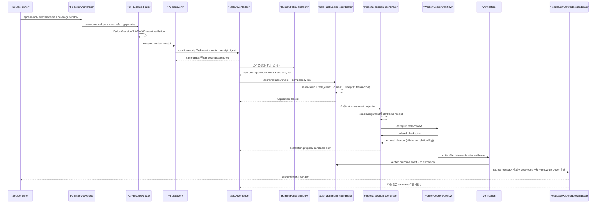

Closed-loop 규칙:

1. P1 adapter는 `source_ref`, `source_revision_ref`, project-independent `occurrence_ref`, clocks,
   coverage를 envelope로 내보낼 뿐 task 후보를 만들지 않는다.
2. P5 `context_acceptance_gate`가 exact refs, RAG/Wiki lineage와 gap semantics를 accepted receipt로
   닫기 전 P6 discovery는 시작하지 않는다.
3. P6 discovery는 accepted context에서 candidate-only TaskIntent를 만들며 ERP write는 0이다.
4. Driver는 cause, proposed patch, expected task revision, reason code, stop condition, authority
   requirement를 canonical digest에 포함한다.
5. human approval 또는 exact deterministic policy가 없으면 apply event를 만들 수 없다. policy는
   ref, scope, valid_from/to, expiry, revocation을 가져야 한다.
6. Sole coordinator는 task ID를 발급/예약하는 유일한 물리 DB writer다. 재시도는 같은 reservation/task/receipt를
   반환한다.
7. worker는 task를 수행하되 source truth나 Driver authority가 되지 않는다.
8. completion은 follow-up task를 직접 생성하지 않고 새 Driver candidate만 만든다.
9. verification 실패는 기존 완료를 삭제하지 않고 correction/reversal event를 추가한다.
10. feedback writer와 knowledge candidate writer는 TaskEngine coordinator와 분리한다.
11. Personal session은 exact assignment에 start/bind하고 여러 checkpoint를 받을 수 있다. 계획 기본값은
    `{assignment epoch,account}`당 active primary 하나이며 actor/node가 바뀌면 old binding을 덮지 않고
    terminal handoff+새 session supersession으로 연결한다.
12. closeout과 completion proposal은 task status/event/current를 바꾸지 않는다. 공식 완료는 별도
    ERP authority가 expected task revision과 verification을 확인해 append-only task event로 기록한다.
13. Client-local pending outbox와 server가 계산한 missing-closeout candidate는 다른 상태다. Accepted start
    없이 missing으로 부르지 않고, durable server ack 검증 전 local outbox를 지우지 않는다.
14. Source classification, upload receipt, history acceptance, payload promotion, `ArtifactRevision` acceptance,
    knowledge acceptance는 각각 다른 event/authority다. 앞의 하나로 뒤 상태를 자동 추론하지 않는다.

## 9. verification·feedback·RAG·Wiki·ontology·생명수

### 9.1 completion에서 지식까지

`done`은 끝이 아니라 검증 대기 또는 검증 완료 사실을 event로 연결하는 지점이다. fruit는 최소한
completion ref를 가지고, 가능한 경우 artifact revision, decision, verification, outcome ref를
각각 exact typed relation으로 갖는다. owner가 정하지 않은 canonical owner는 `UNKNOWN`으로 남기고
free-text를 임의 entity로 승격하지 않는다.

Feedback은 세 갈래다.

- source feedback candidate: 원천 시스템에 돌려줄 제안. source writer가 별도 승인·적용한다.
- knowledge candidate: exact source/evidence가 붙은 후보. Wiki/RAG writer의 검토 전에는 truth가 아니다.
- follow-up Driver candidate: 다음 할 일 제안. ERP에 직접 쓰지 않는다.

### 9.2 RAG·Wiki·ontology 구축 순서

1. 모든 legacy RAG asset과 reader/writer/CLI/UI consumer를 asset kind별로 inventory한다.
2. project/common/system owner resolver와 lexical/native containment, symlink/traversal, Windows sibling
   collision guard를 synthetic test로 고정한다.
3. Source→SourceRevision→ExtractionRun→EvidenceLocator→RagIndex→RagChunk의 6종 ID basis를 golden fixture로
   고정한다.
4. one-project dry-run에서 copy target과 conflict/orphan manifest만 만든다.
5. 승인 후 copy/rebuild하고 old/new reader 결과를 readback한다. source original과 legacy index는
   삭제하지 않는다.
6. WikiRevision writer는 source/claim exact ref와 project ACL을 통과한 body만 owner-approved path에
   쓴다. `_workmeta`와 system RAG에는 body를 쓰지 않는다.
7. RelationEvent가 B9d backlink와 knowledge graph를 투영한다. fuzzy match는 review-needed link일 뿐
   confirmed relation이 아니다.

### 9.3 팀 조회·RAG/Wiki 사용 계약

팀원은 project file tree 전체를 배포받아야만 지식을 쓰는 것이 아니다. TARGET의 기본 읽기 순서는
`ERP UI/MCP → accepted generation → project history/context/RAG/Wiki exact revision`이다. CSV/ICS/XLSX와
private metadata Git은 감사·오프라인 snapshot·복구 근거이며 live query나 자동 reverse import가 아니다.

| 요청 | 필수 scope/결과 | 금지 |
| --- | --- | --- |
| project history/context | explicit project grant, accepted generation/cutoff/coverage/gaps, exact typed refs | foreign-project 존재 leak, stale/unaccepted generation fallback |
| project knowledge | `scope=project`, exact source/Wiki revision+content+locator+weakest claim ceiling | common 자동 fallback, bare path/fuzzy hit의 accepted 승격 |
| common knowledge | `scope=common`과 별도 common grant | project body 혼입, project→common 암묵 전환 |
| team feedback | exact evidence를 가진 candidate receipt | Wiki/RAG index/canon/ontology/task 직접 write |

Authorization은 artifact/revision/action 단위이며 목록·detail·검색·download가 같은 existence-leak 정책을
쓴다. RAG는 ACL-aware pre-filter와 post-filter를 모두 적용하고 field/chunk visibility를 cache key에
결박한다. Revocation·policy revision 뒤 stale cache hit은 `0`이어야 한다. Sensitive Excel/PPT는 hidden
sheet/slide, formula, comment/note, embedded object까지 policy 대상으로 보고, 검증된 immutable redacted
derivative revision만 반환한다. Derivative는 exact raw/source revision lineage를 유지하되 raw fallback은
허용하지 않는다.

팀원이 WorkSession의 `knowledge` 문자열에 적은 메모는 current one-shot session field일 뿐 knowledge
candidate, Wiki revision 또는 canon entry가 아니다. 팀 submission은 candidate ledger가 허용하는 약한
claim ceiling만 append하며 `validated_private|canon_candidate|canon_entry` 같은 강한 상태를 요청하면
`422`로 거부한다. Reviewer/approver/writer가 sourcebound 검증과 ACL을 통과시킨 뒤에만 별도 promotion이
일어난다.

### 도식 7 — B9 장기 생명수와 ENGINE-12 일일 projection

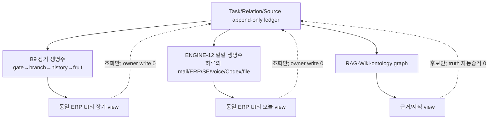

Primary tree parent는 하나만 둔다. 나머지 관계는 cross-link다. 같은 owner event를 B9와 일일
렌즈에 복제 저장하지 않고 projection ID가 원 event typed ref를 가리킨다. 동일
`valid_at/known_at` cutoff로 task/B9/daily replay를 두 번 실행했을 때 digest가 같아야 한다.

## 10. AX Workspace·personal Codex·AgentRun 후속 구축

이 절은 범위에는 포함하지만 core TaskDriver의 선행조건으로 두지 않는다. Core one-project pilot이
통과한 뒤 별도 owner 승인으로 시작한다.

### 10.1 AX Workspace

AX Workspace는 ERP 공식 할 일을 대체하는 두 번째 task app가 아니다. 개인이 한 프로젝트에서
Codex와 함께 “지금 무엇을 보고, 무엇을 시도하고, 어떤 근거를 만들었는지”를 관리하는 작업면이다.

`CURRENT`에는 이미 `src/erp_mcp_service.mjs`의 `erp_mcp_work_session` table,
`publishWorkSession()` idempotency/replay, server publish route와 tests가 있다. 따라서 WorkSession을
`concept only`로 재구축하지 않고 one-shot structured result facade로 REUSE/MODIFY한다. 하지만 현재
record는 unordered independent record이며 start, immutable assignment epoch, ordered sequence, thread
binding, closeout, durable client outbox/ack, handoff/supersession이 없다. 이를 closeout 또는 complete
session으로 소급 해석하지 않는다. dev-ERP 밖 structured capture owner와 project-exact source lineage도
gap이다. Codex 전체 대화, 화면, 키 입력, OS 활동의 상시 수집은 D19 승인 전 기본 `OFF/DEFER`다.

TARGET UX는 device마다 one-time human-approved enrollment를 하고 routine work에서는 OS-protected
broker가 silent token refresh/delegation을 수행한다. 매 tool call·chunk마다 사람에게 묻지 않는다.
Step-up은 new/recovered device, scope expansion, restricted reveal/download, promotion/move/delete,
official completion, knowledge promotion에만 요구한다. Audit actor chain은
`user_id+device_id+agent_id+opaque thread_ref+task_id+project_id+artifact_id+revision_id+action+expiry`를
분리 보존한다. Enrollment·refresh는 local outbox/ack와 unfinished-session recovery를 없애지 않는다.

권장 최소 entity:

| entity | 최소 field | 쓰기 owner | ERP와의 관계 |
| --- | --- | --- | --- |
| `CodexSeat` | seat ref, account/owner ref, allowed project scopes, capability policy ref | owner | task write 권한 자체가 아님 |
| `TaskAssignmentEpoch` | task/project/account, assignment epoch/revision/event ref | ERP assignment owner | personal session writer가 발급·수정 금지 |
| `PersonalWorkSession` | session ref, assignment ref, actor, node, started, start digest, supersedes ref | personal session coordinator | `{assignment epoch,account}` active primary 하나 기본; node/actor 변경은 handoff |
| `PersonalThreadBinding` | session, thread namespace, opaque thread-ref digest, binding/supersedes digest | personal session coordinator | raw thread ID와 전역 task↔thread 1:1 저장 금지 |
| `WorkSessionEvent` | append-only checkpoint/closeout, global sequence/digest chain, bounded result fields | personal session coordinator | 직접 task/history/knowledge mutation 금지 |
| `IngestReceipt` | accepted/duplicate/held-gap/quarantined/rejected, next sequence, digest | session reconciler | server가 local pending outbox를 추정하지 않음 |
| `WorkArtifactRef` | artifact revision typed ref, digest, access label | source/artifact owner | payload 복사 없이 pointer |
| `CompletionProposalLink` | session closeout↔Driver candidate/task expected revision | proposal writer | closeout·proposal은 official completion이 아님 |

세 상태축을 합치지 않는다.

| 축 | 예시 | authority |
| --- | --- | --- |
| ERP task | open/doing/blocked/done/reopened | sole TaskEngine/ERP coordinator |
| personal session | started/active/terminal closeout/handoff/superseded | personal session coordinator |
| local transport | pending/sent/acked/held/quarantined | 해당 node의 durable outbox + server receipt |

UI/MCP는 project 선택, accepted generation, 현재 session, 관련 ERP task/Driver, evidence, blocker, stop
condition, receipt를 보여준다. Project/common knowledge scope는 사용자가 명시하며 fallback하지 않는다.
“ERP에 적용”은 Driver apply API를 호출하되 현재 seat가 authority인지 서버가 다시 검사한다. MCP/개인
Codex는 candidate producer이자 primary query client일 수 있지만 TaskEngine coordinator나 두 번째
truth가 아니다.

### 10.2 AgentRun

`.mission`은 승인된 목표/계획, `.workflow`는 실행 절차, `.party`는 재사용 orchestration template다.
`AgentRun`은 이들을 실제로 한 번 실행한 runtime instance이므로 별도 ID와 receipt를 가져야 한다.

```text
MissionRef ─┐
WorkflowRef ├─> AgentRun ─> CapabilityUseEvent ─> AgentRunReceipt
PartyRef ───┘       │
                    └─> TaskDriverCandidateRef / EvidenceRef
```

AgentRun은 capability scope, input pointer, model/tool label, start/end, stop reason, deterministic
validator receipt를 기록하되 raw prompt/업무 payload를 public 또는 `_workmeta`에 복사하지 않는다.
AgentRun 성공은 task `done`이나 verification pass와 같지 않다.
AgentRun은 P1 run/log history prerequisite가 아니다. P1은 기존 run metadata와 structured receipts로
coverage를 닫고, AgentRun control plane은 P9 이후 별도 owner gate에서만 검토한다.

### 10.3 optional team gateway·engineering workbench와 anti-second-truth

복잡한 engineering task는 Soulforge가 official assignment/context를 제공한 뒤 한 WorkSession 안에서
여러 specialist candidate로 나눌 수 있다. 이때 외부 도구의 native task/session/memory/dispatch/`done`은
모두 client-local coordination evidence다. Orca형 workbench의 terminal idle·worker completion·decision
gate와 Hermes형 shell의 Kanban `done`·goal judge·memory는 ERP status, WorkSession closeout, AgentRun
success, verification pass, owner approval 또는 accepted knowledge로 직접 변환하지 않는다.

```text
ERP/TaskEngine official assignment
  -> Soulforge MCP accepted context/query
  -> one PersonalWorkSession + one writable surface coordinator
     -> direct Codex OR Orca-type engineering workbench OR Hermes-type team gateway/shell candidate path
  -> candidate diff/artifact + validator receipt
  -> WorkSession checkpoint/closeout + completion proposal
  -> separate TaskEngine authority가 official completion 판단
```

Default는 `direct_codex`이며 외부 adapter는 모두 `OFF/DEFER`다. Generic adapter contract와 negative
fixtures를 먼저 닫고, Orca형과 Hermes형 trial은 서로 독립된 P10 gate로 실행한다. 둘은 같은 task에서
중첩하거나 write-capable token을 공유하지 않는다. Hermes형 gateway는 worker/workbench를 spawn하지 않는다.
초기 Orca형 worker는 agent 자체 subagent/team spawn도 끄고, Orca coordinator가 직접 관리하는 2~3개
worker만 허용해 orchestration layer를 하나로 제한한다. AR-G1/G2 전 external run은 AgentRun이 아니며
bounded WorkSession evidence ref일 뿐이다.

### 10.4 후속 phase gate

| gate | 선행조건 | 산출물 | 금지 |
| --- | --- | --- | --- |
| AX-G1 | core C10 pilot pass, D01~D09+D12+D28+D29 결정 | lifecycle/query schema·UI design packet | ERP writer 복제 |
| AX-G2 | start/bind/sequence/outbox/ack/closeout/query synthetic tests | feature-OFF implementation | live MCP direct task/knowledge write |
| AX-G3 | AX-G2 pass, one-seat·one-project owner pilot 승인 | direct client candidate-only lifecycle+accepted query baseline | external tool 자동 포함·team rollout·official completion 자동화 |
| AR-G1 | AX-G2 또는 독립 필요성 증명 | AgentRun contract | mission/workflow/party 의미 변경 |
| AR-G2 | capability/adversarial tests | bounded run receipt | unattended privilege escalation |
| EXT-G0 | core C10 pilot pass, D30 generic boundary 결정 | direct Codex vs optional gateway/workbench authority·fit comparison, frozen engineering-task rubric | AX-G1~G3 차단, 설치·구독·live 연결·제품을 canon owner로 고정 |
| EXT-G1 | EXT-G0+AX-G2 pass, public-safe engineering task 승인 | generic adapter/non-nesting/receipt negative tests | AgentRun 필수화, vendor install·real payload·live endpoint |
| ORCA-T1 | AX-G3 direct baseline+EXT-G1 pass, D32와 별도 owner/Level 3 승인 | matched direct-Codex baseline이 있는 public-safe engineering task 1건 candidate-only trial | Hermes nesting, permission bypass, binary multi-writer, direct main/push/PR |
| ORCA-T2 | ORCA-T1 pass, 별도 owner/Level 3 승인 | 2주 또는 10건 확장 가치 시험 | T1 결과 없는 확대, production/team rollout |
| HERMES-T1 | AX-G3 direct baseline+EXT-G1 pass, D31와 별도 owner/Level 3 승인 | one-seat gateway/query/candidate-only trial | Orca nesting, worker/workbench spawn, Kanban/goal→ERP 완료, team rollout |

## 11. PC 역할·배포·alert·장애 복구

### 11.1 `HISTORICAL_REPORTED` runtime 기준선 — 이번 보정에서 fresh 재관찰하지 않음

| 관찰 | 결과 | 구축 의미 |
| --- | --- | --- |
| 계획/개발 checkout | 당시 clean main, origin과 동일 | 이전 snapshot일 뿐 현재 권위가 아님; 이번 계획 기준선은 §2.1의 `main@9df7e577...` |
| 운영 shell/attestation | `56b5b951` 계열로 서로 일치, origin/main보다 7 commit 뒤 | 운영을 최신 main과 동일하다고 말할 수 없음 |
| data backend binding | 운영 shell과 별도인 source/data checkout을 가리킴 | 현재 contract 의도에는 맞지만 release audit의 “두 checkout same SHA” 가정과 충돌 |
| health | loopback HTTP `200` | process 생존 증거일 뿐 release readiness가 아님 |
| core-only release audit | exit `1` | activation 불가 |
| audit blockers | Git status timeout 2건, snapshot 구조 invalid, DB backup stale, restore test invalid/unbound, payload backup generation stale | 원인 분리와 recovery evidence 필요 |
| restore evidence | 관찰된 report 19개 중 valid `0` | live schema/writer 전환 금지 |
| file activity runtime | scheduler/artifact/local state가 관찰 시 `0`; sole reconciler/operational primary 미지정 | live collector/reconciler activation 금지 |

Git timeout blocker는 audit의 고정 5초 한도보다 실제 status가 오래 걸린 정황이 있어 false blocker일 수
있다. 그러나 timeout을 고친 뒤에도 source/data checkout과 runtime shell에 같은 expected commit을
강제하는 현재 audit 계약 충돌이 남을 수 있다. 이 문제는 D16에서 다음 둘 중 하나를 owner가
결정해야 한다.

- A안: 운영용 pinned backend-code checkout과 project-data binding을 분리한다.
- B안: release audit에서 executable code source와 data root를 서로 다른 개념/attestation으로 검증한다.

개발 checkout을 운영 shell로 단순 복사하거나 project data truth를 runtime checkout에 합치는 해법은
금지한다.

### 도식 8 — PC role·packet·reconciler·ERP writer topology

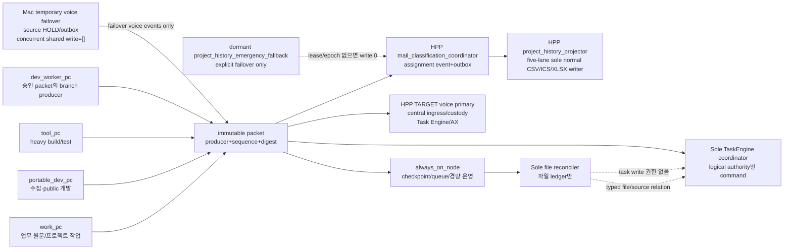

| logical role | primary 책임 | 허용 write | 기본 차단 |
| --- | --- | --- | --- |
| `work_pc` | 실제 업무·project worksite | 해당 task의 `_workspaces/<project>`, `_workmeta/<project>` | gateway/night watch/task auto-apply |
| `portable_dev_pc` | 이동 수집·public 개발 | public bounded branch, approved metadata | operational primary |
| `tool_pc` | heavy build/test/tool-bound work | approved project run과 public dev lane | always-on job 자동 승격 |
| `dev_worker_pc` | immutable task packet 수행 | 지정 branch/allowed paths | main merge, private 원문, 운영 writer |
| `always_on_node` | checkpoint, queue, healer, 경량 운영 | `guild_hall/state`, selected `private-state` | public auto commit/push, TaskEngine coordinator 자동 겸임 |
| sole file reconciler | file packet 정렬·중복/충돌 판정 | file activity ledger/projection | ERP task mutation |
| sole TaskEngine coordinator | candidate/decision/apply command의 유일한 SQLite write와 apply transaction | Driver ledger + task reservation/event/current/receipt | source payload/RAG truth/file ledger 수정 |
| Mac temporary voice failover | HPP unavailable/cutover 전 voice payload/session/source-event 생산; 이후 source HOLD/outbox·monitor | active failover lease의 voice owner surface, alert candidate | HPP와 동시 shared write, central custody, normal mail/project-history write |
| HPP TARGET `voice_operational_primary` | cutover 뒤 shared voice session/queue/library, ASR/context processing의 단일 normal writer | voice owner surface와 accepted HPP custody API | exact binding/receipt 전 activation, Mac과 동시 write, owner 승인 없는 NAS mutation |
| HPP `mail_classification_coordinator` | mail occurrence/assignment current+event+outbox atomic commit | dev-ERP mail coordination tables only | file projection, Driver/task/current/receipt tables, raw source write |
| HPP `project_history_projector` | mail outbox와 나머지 lane accepted manifest를 프로젝트별 CSV/XLSX로 sole normal publish; mail ICS 유지 | five project-history views | classification/event/task/source mutation |
| HPP `transfer_service` | authenticated HTTPS upload/download, quarantine/inbox acceptance, hash/readback/finalize | HPP quarantine/inbox binary only | project binding, client-supplied path, direct SMB, task/history mutation |
| HPP `promoter` | accepted artifact revision의 approved project storage binding과 rollback receipt | HPP project binding only | quarantine intake, projector/task/source mutation, delete without retention approval |
| dormant `project_history_emergency_fallback` | explicit failover lease에서만 five-lane projector; mail coordinator는 coverage+별도 승인 범위 | active epoch allowlist only | automatic promotion/failback, voice identity reuse, ERP task write |

위 역할은 `TARGET` logical identities다. Public 계약만으로 현재 live binding을 추론하지 않는다.
accepted C00Q tool 뒤 P0/C00B에서 local identity/lease owner를 opaque metadata로 확인하고 D21~D23 owner 결정이 없으면 모두
feature OFF다.

HPP outage 중 client는 durable local outbox를 `HOLD`로 유지하거나 last-accepted generation을 read-only로
본다. HPP drive/UNC/SMB mount, copied SQLite/WAL/SHM, alternate central queue 또는 split writer로 복구하지
않는다. Reconnect 뒤 ticket/grant/revision을 다시 검증하고 idempotent replay하며 ack 전 local state를
compact하지 않는다.

### 11.2 immutable packet

Packet 최소 field:

```yaml
packet_schema: soulforge.node_packet.v1
producer_node_ref: <opaque-logical-ref>
producer_account_ref: <opaque-account-ref-or-null>
producer_role: <allowed-role>
packet_kind: file_observation|work_session_event|run_receipt|other-approved-metadata
sequence: <monotonic-integer>
created_at: <strict-utc>
project_ref: <typed-ref>
task_assignment_ref: <typed-ref-or-null>
work_session_ref: <typed-ref-or-null>
source_revision_refs: []
intent_or_file_event_refs: []
payload_digest: sha256:<64hex>
previous_packet_digest: <digest-or-null>
signature_or_attestation_ref: <opaque-ref>
```

Reconciler는 `(producer,sequence,digest)` duplicate를 no-op, 같은 sequence의 다른 digest를 quarantine,
gap을 alert candidate로 만든다. Packet 도착은 source 승인, task 승인, writer 승격을 뜻하지 않는다.
Packet은 metadata ref만 운반한다. Payload upload transport, storage custody/promotion acknowledgement,
history projection receipt는 서로 다른 contract이며 packet receipt로 bytes 승격을 추론하지 않는다.

Personal outbox의 server receipt status는 `accepted|duplicate|held_gap|quarantined|rejected`다. Client는
event를 durable local outbox에 기록한 뒤 보낼 수 있고, server receipt ID/digest/status를 검증·durable
저장한 뒤에만 해당 entry를 compact한다. Server commit 뒤 client ack 전 crash/reboot는 같은
session/sequence/digest를 재전송해 `duplicate` receipt를 받아야 한다. Same sequence의 다른 digest와
gap은 projection을 전진시키지 않는다. Exact outbox path, encryption, fsync/retention과 stale/missing SLA는
D28 전 `VERIFY_HP`이고, Git·CSV/XLSX를 outbox나 live transport로 사용하지 않는다.

### 11.2A TaskEngine runtime binding control plane

Public contract는
`ui-workspace/apps/dev-erp/docs/contracts/task_engine_runtime_binding.v1.schema.json`, local instance는
`guild_hall/state/local/task_engine_runtime_binding.yaml`이다. Local 파일은 Git에 넣지 않고 secret,
raw root, hostname을 담지 않는다. 다음 field를 모두 schema가 검증한다.

```yaml
schema_version: soulforge.task_engine_runtime_binding.v1
binding_revision_id: <typed-revision-ref>
mode: off|pilot|production
node_identity_ref: <opaque-typed-ref>
runtime_commit: <40hex>
runtime_tree_digest: sha256:<64hex>
coordinator_identity_ref: <opaque-typed-ref-or-null-for-off>
logical_authority_refs: []
reconciler_identity_ref: <opaque-typed-ref-or-null-for-off>
project_allowlist: []
route_allowlist: []
not_before: <strict-utc>
expires_at: <strict-utc>
issued_at: <strict-utc>
owner_approval_ref: <opaque-ref>
previous_binding_digest: <sha256-or-null>
revokes_binding_digest: <sha256-or-null>
binding_digest: sha256:<64hex>
```

`mode=off`는 allowlist가 모두 비어야 한다. `pilot`은 project 한 개, 명시 route, owner가 정한 짧은
expiry가 필수다. `production`도 무기한 binding이 아니며 G01 owner approval과 lease expiry를 가진다.
Digest는 자기 자신을 제외한 canonical object로 계산한다. Missing, malformed, digest mismatch,
not-yet-valid, expired, revoked, runtime commit/tree mismatch, node/coordinator mismatch는 모두
default-deny다.

C08F/P8은 operational identity나 lease를 발급하지 않은 채 같은 parser를 사용하는 세 consumer를
public schema·synthetic fixture·feature-OFF 범위에서 먼저 만든다.

1. `tools/task_engine_runtime_binding.mjs`는 기본 dry-run이며 candidate를 schema 검증한 뒤
   `--apply --expected-current-digest <digest-or-null> --owner-approval-ref <opaque>`에서만 exact local
   path에 쓴다. Sibling temp write+flush+platform-tested atomic replace를 사용하고 CAS가 다르면 old
   file을 그대로 둔다.
2. `server.mjs`는 write request마다 binding을 새로 읽어 route/project/identity/expiry를 검사하고,
   `TaskEngineTransactionCoordinator`는 `BEGIN IMMEDIATE` 직후와 commit 직전에 같은 binding revision
   digest를 다시 검사한다. OFF replacement/revocation은 새 transaction을 막고, commit 전 mismatch는
   rollback한다. Binding을 process-lifetime cache하지 않으므로 update에 restart가 필요하지 않다.
3. `runtime_release_audit.mjs`는 `--task-engine-binding <path> --expected-task-engine-mode
   off|pilot|production`을 받아 같은 loader 결과, runtime commit/tree, role identity를 검증한다.

거부 envelope은 missing/off/expired/revoked `423 binding_not_active`, malformed/digest mismatch
`503 binding_invalid`, project/route mismatch `403 binding_scope_violation`, CAS 충돌
`409 binding_revision_conflict`로 고정한다. Loader/audit가 파일을 열 수 없을 때 fallback mode나 환경
변수 grant를 만들지 않는다. C09D는 OFF revision만, C10은 fresh owner-approved pilot revision과 종료
OFF revision만, G00/G01은 이후 별도 promotion revision만 이 writer로 만든다.

### 11.2B Project-history process lock, mail owner lease, fencing, failover/failback

**Claim ceiling — `TARGET`, plan-owned proposed contract.** 이 절의 `HPP`, 두 logical identity, lock
이름, durable lease/CAS owner, `classification_epoch`·`projector_epoch`, emergency fallback,
`E→E+1→E+2` failover/failback 절차는 현재 구현이나 기존 public canon을 기술하지 않는다. Public
source는 generic PC-role 분리, HPP target/Mac temporary-failover voice 범위, current multi-writer gap만 뒷받침한다.
`HPP`는 owner-designated high-performance-PC logical host candidate이며 live binding은
`UNKNOWN/VERIFY_HP`다. D21~D23 owner 결정, 관련 public contract sync, C08B/P10 Level 3 evidence
전에는 어느 PC에도 mail/project-history authority·lease·role switch·failover/failback을 부여하거나
완료로 주장하지 않는다.

Mail coordinator와 five-lane `project_history_projector`는 **role별 host-local lock**과
owner-controlled cross-node lease를 모두 요구한다. `mail_classification_coordinator.lock`은 DB command
process 하나, `project_history_projector.lock`은 다섯 lane 전체의 file projector process 하나만 잡는다.
Lane별 lock은 만들지 않으므로 한 PC 안에서도 두 projector가 서로 다른 lane을 핑계로 같은
project-history tree를 동시에 쓸 수 없다. Cross-node lease는 logical role마다 하나다. Classification
lease의 monotonic counter는 `classification_epoch=C_n`, projector lease의 counter는
`projector_epoch=P_n`이며 서로 독립이다. 한 운영 generation의 fence 상태를
`E_n=(C_n,P_n)` vector로 표기할 뿐 `C_n=P_n`을 요구하거나 두 값을 한 필드로 합치지 않는다.
Projector lease의 project/lane allowlist가 승인 범위를 좁힌다.

각 lease는 logical role, node identity, project scope, `not_before`, `expires_at`, role epoch,
previous/revoked digest, approver ref를 가진다. 환경변수나 hostname으로 role을 추정하지 않는다.
Assignment event/outbox의 origin `classification_epoch`는 projector가 바뀌어도 수정하지 않는다.
Projector는 claim/publish 때 자기 `projector_epoch`를 별도 column과 manifest에 기록한다. Mail manifest는
`accepted_event_cutoff`, `source_epoch_digest`, `max_classification_epoch`, `projector_epoch`, row count,
ordered digest를 가진다. C09/D21은 C10 전에 durable lease owner와 두 role의 exact CAS record/path를
결정해야 하며, placeholder 상태에서는 pilot도 시작하지 않는다.

다음 경계는 **모두** 자기 role의 current lease와 epoch를 재검증하고 stale epoch를 거부한다.

1. classification DB transaction 시작 직후와 commit 직전: active `classification_epoch`
2. outbox claim/reclaim/update: active `projector_epoch`와 immutable origin `classification_epoch`
3. CSV/ICS/XLSX staged-generation manifest 생성: active `projector_epoch`와 canonical `source_epoch_digest`
4. parity validator 직전과 final atomic publish 직전: 같은 projector epoch, cutoff, source-epoch digest
5. publish receipt와 mail outbox completion 또는 non-mail accepted-manifest completion 기록: active projector epoch

Recovery reclaim은 기존 `claimed_projector_epoch` lease가 revoked이고, row가 freeze checkpoint 이전에
commit됐으며, accepted publish receipt/manifest가 없을 때만 `claimed(P_old)→claimed(P_new)` CAS를 허용한다.
이미 `published`이고 manifest digest가 accepted receipt와 일치하면 새 publish 없이 same-generation no-op이다.
Digest가 다르거나 partial stage만 남았으면 quarantine 후 publish OFF로 멈춘다.

정상 HPP vector를 `E=(C_E,P_E)`라고 할 때 manual failover는 다음 순서만 허용한다.

```text
freeze HPP mail classification + five-lane projector
  -> checkpoint mail DB/outbox and all five view generations; prove parity at (C_E,P_E)
  -> revoke C_E and P_E leases
  -> fallback shadow catch-up/replay for approved lanes (publish OFF)
  -> issue durable E+1=(C_E+1,P_E+1) role records
  -> promote mail classification at C_E+1 only if D23 coverage+approval exists;
     otherwise keep C_E+1 disabled/revoked and record partial/not_collected gap
  -> parity/readback
  -> promote five-lane projector at P_E+1 with an exact lane allowlist
  -> recover an old C_E outbox only when it was committed at/before the freeze checkpoint and
     the lease carries recovery_from_classification_epoch=C_E; claim/publish records P_E+1
  -> prove stale C_E DB writes and stale P_E outbox/stage/final-publish rejection
```

Manual failback도 자동 승격이 아니라 새 vector `E+2=(C_E+2,P_E+2)`를 쓴다. C_E+1이 disabled였어도
그 durable fence record를 건너뛰거나 재사용하지 않는다.

```text
freeze fallback at (C_E+1,P_E+1)
  -> checkpoint/parity and revoke both role records
  -> HPP shadow catch-up/replay for all approved lanes (publish OFF)
  -> issue C_E+2 and P_E+2; promote HPP mail classification first at C_E+2
  -> parity/readback
  -> promote HPP five-lane projector second at P_E+2
  -> prove stale C_E/C_E+1 DB writes and P_E/P_E+1 outbox/all-lane publish rejection
```

자동 failover·자동 failback은 없다. Mac의 제한된 mail access는 `coverage.state=partial|not_collected`
gap을 낼 수 있을 뿐 전체 부재를 확정하거나 normal projector lease를 얻지 못한다. Emergency identity가
five-lane projector lease를 받더라도 voice identity가 승격되는 것이 아니고 ERP task write는 계속 0이다. RTO/RPO, lease
issuer/revoker, failover approver와 fallback coverage는 D21~D23이 결정한다.

### 11.3 배포·alert·복구

배포 순서:

1. clean main에서 code/tests/docs를 bounded slice로 publish한다.
2. feature OFF 상태로 synthetic schema/replay를 통과한다.
3. C09R backup 생성과 isolated restore drill이 valid여야 runtime 변경을 허용한다.
4. C09D에서 approved runtime artifact를 pinned revision으로 배포하고 source/data binding을 별도
   attest하되 모든 TaskEngine writer/route/job은 feature OFF로 둔다.
5. C09L contract-owned source/knowledge metadata receipt와 C09D feature-OFF deployment receipt 뒤 C10 one-project pilot에서
   coordinator를 짧게 켜고 즉시 OFF로
   되돌릴 수 있어야 한다.
6. G00에서 public contract와 local binding을 feature-OFF로 검증한다.
7. full validation과 별도 G01 owner 승인 뒤에만 operational-primary binding을 활성화한다.

Alert는 상태 변화가 있을 때만 후보를 만들고 cooldown, weekend, recovery clock을 가진다.
필수 alert code는 `writer_not_primary`, `packet_conflict`, `packet_gap`, `replay_mismatch`,
`backup_stale`, `restore_invalid`, `projection_mutation`, `cross_project_violation`이다. Alert channel과
실제 전송은 V14 전에는 OFF다.

Recovery 순서:

1. target writer/scanner/scheduler/alert OFF
2. queue intake freeze와 last good checkpoint 고정
3. DB/RAG/packet digest와 runtime/source/data attestation read-only 비교
4. valid backup을 별도 위치에 restore하고 schema/replay를 진단한다. Commit된 event가 있는 live DB를
   이 복구본으로 즉시 덮어쓰지 않는다.
5. 읽을 수 있는 live history가 있으면 reversal/current rebuild로 old reader를 복원한다. DB 재난이면
   current DB/WAL/SHM 격리와 event export→restore→re-import 검증을 먼저 완료한다.
6. event history 보존과 current parity 확인
7. owner가 operational-primary/failover를 명시적으로 재지정

Ingress/access rollback은 binding/writer OFF→queue freeze와 affected item quarantine→prior accepted pointer
유지 순서다. OneDrive workspace에서 HPP custody로 reverse-copy해 복구하지 않는다. 미래 binding switch도
copy+hash+readback을 먼저 완료하고 exact receipt가 accepted된 뒤에만 pointer를 전환한다. Retention/legal
hold owner approval 없는 delete는 rollback 단계에서도 금지한다.

Failover는 자동 승격하지 않는다. failover node가 같은 physical machine이어도 별도 identity, clean
operational clone, valid checkpoint, writer lease/attestation을 가져야 한다.

## 12. 구현 slice/WBS·dependency DAG·critical path

Full YAML packet만 별도 승인 가능한 최소 실행 단위다. Phase card는 순서와 미래 scope를 고정하는
비실행 route다. effort는 `S/M/L`, risk는 `low/medium/high`의 상대값이며 날짜 약속이 아니다.
`C`는 core, `G`는 activation gate, `AX/AR/IQ/ML`은 후속 phase다.

### 12.0 Authoritative P0~P10 phase override

이 표가 아래에 보존된 기존 C-card의 phase/depends-on보다 우선한다. 기존 mixed card는 **그대로
실행 가능한 task packet이 아니다**. 각 행에 지정된 sub-action만 해당 phase에서 허용하며, 같은
card 안의 later-phase DB/API/writer/runtime action은 그 phase acceptance receipt가 생길 때까지 write
allowlist에서 제외한다.

| phase | required acceptance | phase route / future slice action | explicitly blocked until later |
| --- | --- | --- | --- |
| P0 | baseline/source-owner inventory receipt | `C00A` public blocker preflight → `C00Q` public/synthetic query-tool foundation → `C00B` separately authorized query-only inventory | exact C00Q child packet 밖의 code, schema/DB/path materialization, task discovery 전부 |
| P1 | five-lane Shadow envelope+coverage+replay/export receipt; live binding·continuous collector `0` | `H00→H01/H02/H03/H04/H05→H06` contract/shadow only | typed business relation, live source connection, RAG, task candidate/Driver/ERP write |
| P2 | ID/ref/clock crosswalk/packet identity receipt | `C01A` typed identity only + `C08A` immutable packet identity only | SourceRevision materialization, Wiki, TaskDriver, runtime binding foundation/lease activation |
| P3 | immutable revision/relation lineage receipt | `C06A` source/file/artifact/relation only | RAG/Wiki indexing, context acceptance, discovery |
| P4 | exact revision-bound RAG/Wiki receipt | `C05` resolver + `C06B` Wiki/source lineage only | task discovery, Driver, ERP writer |
| P5 | deterministic `context_acceptance_gate` receipt | `C07A` context assembly/coverage validation only | P6 discovery until receipt accepted |
| P6 | candidate-only discovery acceptance | `C04A` source adapters→TaskIntent candidate, ERP write `0` | P7 TaskDriver until P6 receipt accepted |
| P7 | TaskDriver authority/idempotency acceptance | `C01B` pure TaskDriver contract | P8 schema/outbox/ERP writer until P7 receipt accepted |
| P8 | sole-writer/atomicity/mail-outbox/binding-foundation acceptance | parallel `C02` + `C08F`, then `C03→C04B`: feature-OFF binding loader, mail assignment/outbox, five-lane projector and ERP persistence | local pilot binding, live role/lease/failover, life-tree pilot |
| P9 | one-project, per-source bounded canary + rollback + read-only tree receipt | `C09A/C09/C09L/C09R/C09D/C10` + `C07B`; source별 canary는 독립 승인·판정 | multi-project/continuous role, 다른 source 자동 unlock, failover/AX/AgentRun/ML |
| P10 | source/capability별 별도 owner activation approval | 각 source마다 HPP sole writer, old-writer fence, rollback·manual failover/failback receipt를 갖춘 `C08B`/`G00/G01`; `C09S`, `AX01/AR01/IQ01/ML01`도 별도 | 묶음 activation, unfenced old writer, missing rollback/failback receipt, automatic failback |

#### 12.0A Ingress·query·personal lifecycle side-card DAG

아래 side-card의 **P0~P9** `Pn` 행은 core `Pn` acceptance 뒤, `P(n+1)` 전 실행할 수 있다는 뜻이다.
같은 core phase의 acceptance에 포함되거나 기존 P edge를 바꾸거나 `P(n+1)`을 unlock하지 않는다.
P10은 aggregate core acceptance나 P11이 없으므로 예외다. I10/Q10/W10은 accepted P9 뒤 각각 독립된
capability-specific owner approval·Level 3 gate로 실행하며 서로를 unlock하거나 하나의 P10 receipt로
합치지 않는다. `I`는 ingress/promotion, `Q`는 accepted query, `W`는 personal WorkSession이다.

| phase | ingress `I` side-card | query/knowledge `Q` side-card | WorkSession `W` side-card |
| --- | --- | --- | --- |
| P0 | I0 source-kind custody/staging/quarantine/promoter inventory | Q0 tool/route/ACL/generation/consumer inventory | W0 current one-shot writer/caller와 thread/node capability inventory |
| P1 | I1 H01 attachment와 H04 ERP/chat/MCP upload receipt가 payload promotion이 아님을 고정 | Q1 accepted-generation+audit snapshot schema | W1 H03는 current bounded one-shot occurrence만 수용; lifecycle completeness로 H03/H06을 막지 않음 |
| P2 | I2 storage-binding/operation/packet typed identity | Q2 actor/project/scope/generation/cursor typed identity | W2 node+account+assignment/session packet identity fixture; local outbox physical path 없음 |
| P3 | I3 source→binding→promotion/derived-revision lineage | Q3 exact revision/locator/claim response schema | W3 session evidence/artifact typed refs only |
| P4 | I4 promoted revision의 RAG/Wiki eligibility gate | Q4 project/common resolver+explicit ACL+no-fallback contract | W4 session query는 accepted exact knowledge ref만 사용 |
| P5 | I5 context는 accepted revision/promotion ref만 소비 | Q5 accepted task-context query receipt | W5 exact assignment/context binding design input |
| P6 | I6 classification/upload는 candidate-only, task row delta 0 | Q6 candidate-only team knowledge submission contract | W6 closeout/proposal도 candidate-only라는 pure fixture |
| P7 | I7 Driver provenance에 promotion receipt exact ref | Q7 Driver provenance read projection | W7 closeout→Driver candidate link contract, official completion 분리 |
| P8 | I8 feature-OFF promoter/receipt/authority-separation contract | Q8 feature-OFF ERP UI/MCP adapters+atomic accepted pointer/API-file parity | W8 schema/API fixture 설계만; core P8 acceptance나 writer 권한에 포함하지 않음 |
| P9 | I9 한 project promotion/copy/readback/rollback pilot | Q9 one-project ACL/parity/no-fallback pilot | W9 core C10 PASS 뒤 AX-G1 design review; 아직 live personal write 없음 |
| P10 | I10 scan/ACL/retention/backup·production promoter 별도 activation | Q10 UI query/MCP query/candidate submit을 capability별 별도 activation | W10 핵심 AX-G1→AX-G2→AX-G3 direct baseline과 선택 EXT-G0→EXT-G1→ORCA-T1/ORCA-T2·HERMES-T1 독립 trial→team rollout을 각각 별도 승인 |

I8/Q8은 feature-OFF synthetic contract일 뿐 exact physical path, service binding, live data, node lease를
만들지 않는다. W lifecycle은 P1 history나 core P8의 선행조건이 아니며 기존 AX gate를 앞당기지 않는다.

P10 external surface는 핵심 AX-G1~G3 경로를 차단하지 않는 선택형 sibling branch다. `EXT-G0` 비교와
`EXT-G1` generic negative contract 뒤 `ORCA-T1`과 `HERMES-T1`을 따로 심사하고, Orca 확대는 다시
`ORCA-T2`로 분리한다. 한 trial은 다른 trial, AR01, IQ/ML, production activation 또는 team rollout을
unlock하지 않는다. Tool-native completion은 candidate evidence이고 TaskEngine official completion은 별도다.

`A8-SYNTH`는 public/pathless/feature-OFF secure-access contract·fixture side-card다. D27~D29와 exact public
security child packet prerequisite가 accepted되면 core P8과 무관하게 독립 실행할 수 있다. One-time device
enrollment/mTLS verifier → OS-protected broker refresh → human/device/agent/task-object-action delegation
intersection → upload/download ticket verifier만 합성 검증하며 P1, TaskEngine, P8, P9 또는 I/Q/W live
binding을 unlock하지 않는다.

현재 source foundation은 `tools/a8_synth_secure_access.mjs`, strict packet/output schema와 focused test로
존재한다. 7종 source custody, transfer/finalize/range, WorkSession crash/ack/handoff, ACL/RAG/cache/redaction을
계산하는 60-ID public fixture receipt를 만들 수 있지만, fixture의 external binding은
`synthetic_fixture_only`, `owner_acceptance=false`다. 따라서 focused PASS는 implementation evidence일 뿐
D27~D29 owner acceptance나 formal A8-SYNTH acceptance가 아니다.

`A8-CANARY`는 첫 live implementation이다. `A8-SYNTH PASS` + accepted private `VERIFY_HP` exact binding
receipt + strict private office-LAN binding + explicit owner approval와 Level 3 live gate가 모두 있어야 한다.
그 뒤에도 one seat·one project·one small file에서
`enroll→prepare upload→HTTPS transfer→hash/readback→idempotent finalize receipt/revision→query→exact revision
download→optional validated redacted derivative/XLSX`만 수행한다. VPN/Tailscale/remote lane, mail/voice bulk,
team/production activation과 core phase unlock은 `0`이다.

#### 12.0.1 Packet executability claim ceiling

`READY_FOR_OWNER_REVIEW`는 아래 phase order와 첫 승인 선택을 검토할 준비가 됐다는 뜻이지, 모든 행이
구현 승인 가능한 packet이라는 뜻이 아니다.

| surface | 현재 packet 상태 | write 또는 ratification 전 필수 조건 |
| --- | --- | --- |
| `C00` parent | `routing_only_non_executable` | `C00A→C00Q→C00B` 외 action 상속 금지; P0 acceptance는 C00B PASS 하나뿐 |
| `C00A` | `historical_blocker_receipt_retained` | accepted `BLOCKED` receipt는 C00Q prerequisite evidence로 보존된다. 당시/current 실행 권한과 P1 unlock은 `false` |
| `C00Q` | `formal_receipt_retained_execution_authority_expired` | inventory CLI/schema/test의 public/synthetic formal receipt는 보존된다. 이 receipt는 live/private query·report write 권한이나 P0 effect를 부여하지 않는다 |
| `C00B` | `judge_foundation_exists_live_hold` | pure judge/receipt schema/test foundation은 존재한다. retained C00Q receipt와 별도로 §18.2 `C00B-HOLD-01..08`의 current authority/source/profile/output/expiry가 있어야 query-only live metadata를 읽음. P0 source-availability inventory만 소유하고 H00 six-state completeness는 사용하지 않음. 기존 doctor/workspace inventory는 C00-LIVE-01..04 대체 불가 |
| `H00` | exact pinned `canon_candidate`의 ratification-only gate | C00B PASS 뒤 현재 contract/helper/test를 그대로 ratify/hold. 파일 편집은 새 exact packet 필요 |
| `H01..H06` | `non_executable_phase_card` | literal existing/BUILD paths, symbols, exact validator commands, dependency/decision refs를 가진 full YAML child packet |
| `A8-SYNTH` | `source_foundation_exists_formal_acceptance_hold` | strict schema와 60-ID computed public/pathless/feature-OFF fixture source는 존재한다. D27~D29와 exact public security child packet prerequisite acceptance + fresh full B/V 전에는 formal acceptance가 아니며 P1/P8/P9/TaskEngine/live/A8-CANARY/team/production unlock `0` |
| `A8-CANARY` | `non_executable_live_hold` | `A8-SYNTH PASS` + accepted private `VERIFY_HP` exact binding receipt + strict office-LAN binding + explicit owner approval + Level 3 live gate. One seat/project/small file exact revision only; bulk/team/production/core unlock `0` |
| `C01/C04/C06/C07/C08` split rows | `non_executable_phase_card` | composite inheritance 금지. split별 full YAML child packet과 exact allowed-path allowlist |
| standalone full YAML cards (`C02`, `C03`, `C05`, `C08F` 등) | approval candidate after dependencies | 아직 없는 file/script는 해당 card의 `BUILD` output이다. owning card가 만든 뒤에만 downstream validator가 소비 |

Full child packet은 prompt §10의 모든 field를 채우고, generic `tests`, `README`, `package scripts`,
`<module>/**` 또는 “adapter/modules” 같은 category를 `allowed_write_paths`로 사용하지 않는다. 각
entry는 literal file path와 `existing MODIFY | proposed BUILD`를 구분하고, exact symbol·command,
approval-time baseline, dependency receipt, rollback, stop, owner gate를 함께 고정한다.

Split definitions:

- `C01A`: ID contract/shared temporal identity only; depends `H06`. `C01B`: TaskIntent/TaskDriver/
  authority/idempotency pure contract only; depends accepted `C04A/P6` receipt.
- `C04A`: candidate-only discovery adapter; depends accepted `C07A/P5` receipt. `C04B`: mail assignment/
  outbox and ERP apply adapters; depends accepted `C01B/P7`, `C02`, `C08F`, `C03` receipts in that order.
- `C06A`: immutable Source/File/Artifact revision and RelationEvent; depends P2. `C06B`: exact
  revision-bound Wiki/knowledge projection; depends `C06A` and C05.
- `C07A`: deterministic context assembly and acceptance receipt only. `C07B`: feedback and B9/ENGINE-12
  read-only pilot projection only after P8.
- `C08A`: public immutable packet/typed identity contract only. `C08F`: P8 public runtime-binding schema,
  fail-closed loader, CAS tool and audit integration with synthetic/feature-OFF fixtures only; local binding instance,
  role lease or process activation 없음. `C08B`: operational lease/fencing/failover/failback/alerts only at P10.

| split phase card (`non_executable`) | inputs → outputs | target surfaces (write allowlist 아님) | future child-packet validators | rollback / stop / owner gate |
| --- | --- | --- | --- | --- |
| `C01A/P2` | H06 receipt → typed ID/ref/clock contract | `docs/architecture/foundation/ID_CONTRACT_V1.md`, foundation/shared READMEs, `guild_hall/shared/temporal_identity.mjs`, `.test.mjs`, CHANGELOG | exact child packet은 `node --test guild_hall/shared/temporal_identity.test.mjs`; golden ID/collision, query-cutoff↔owner-native-clock lossless crosswalk including native clock ref/normalization policy/basis/precision and unchanged relative offsets, null/packet identity | revert / stop on rekey, ambiguous or lossy clock mapping / protected ID contract+clock crosswalk approval |
| `C08A/P2` | H06+C01A → immutable packet identity/chain schema | `guild_hall/file_activity/packet_transport*`, public schemas/tests/README/CHANGELOG | duplicate/conflict/gap/chain, no live binding | revert / stop on node inference or transport activation / packet contract approval |
| `C06A/P3` | P2 receipt → Source/File/Artifact revision + RelationEvent | shared temporal relation/writer modules/tests/README/CHANGELOG; typed party/account relation과 project assignment event/state/basis normalization 포함, shared semantic annotation 제외 | revision/content exactness, append/supersede, no fuzzy join, typed relation role, account-only identity gap, assignment basis/evidence/policy ref | reader OFF+revert / stop on physical owner, identity, relation-role, or assignment-basis ambiguity / D06 |
| `C05+C06B/P4` | P3 receipt → owner-aware RAG + exact WikiRevision | existing RAG resolver/writer/Wiki modules/tests/README/CHANGELOG | path isolation, source-revision locator, no-delete, ACL | target OFF+legacy reader / stop on owner/ACL gap / D07+D08 |
| `C07A/P5` | P4+H06 receipts → deterministic context + acceptance receipt | context assembly/validator modules/tests, proposed context schema, central semantic annotation schema/labeler, README/CHANGELOG | gaps, clocks, exact refs, replay 2회, `HP-LABEL-01..08`, source-native semantic ref 보존, raw mail/Slack body·transcript/audio·attachment/file/log bytes·secret-like key/value reject, source별 shared target vocabulary·authority 0, owner mutation 0 | context gate closed / stop on missing lane, fuzzy relation, policy-revision gap, label conflict, or raw/secret sentinel failure / P5 acceptance owner |
| `C04A/P6` | accepted P5 receipt → TaskIntent candidates | source-specific fact adapters+shared accepted annotation consumer/tests/README/CHANGELOG; ERP store/schema excluded | annotation→TaskIntent exact ref, candidate replay/idempotency, ERP row delta 0, direct writer 0 | discovery OFF+revert / stop on apply path or annotation-only authority escalation / P6 acceptance owner |
| `C01B/P7` | accepted P6 receipt → pure TaskDriver/authority/idempotency contract | `ui-workspace/apps/dev-erp/src/task_driver.mjs`, its tests/API schemas/README, root `package.json`, CHANGELOG; persistence/store excluded | exact child packet은 direct TaskDriver test 뒤 root `npm.cmd run validate:task-engine-core-v1`; why/why-now, expiry/revocation, same-key replay, no DB open | revert / stop on ERP schema/write / P7 acceptance owner |
| `C08F/P8` | accepted P7+C08A → public binding schema/loader/CAS/audit foundation | runtime-binding source/tool/schema/tests, runtime-audit tests, README/CHANGELOG; local binding/state/lease path 제외 | missing/malformed/off/expiry/revocation/scope/CAS/atomic-replace fixtures, no fallback, local instance 0 | revert / stop on role issue, local binding creation or process activation / foundation contract approval |
| `C02→C03→C04B/P8` | accepted P7+H06/MAIL + parallel C02/C08F receipts → C03 facade/binding integration → C04B mail assignment/event/outbox + five-lane projector feature-OFF | dev-ERP persistence/store/server/tests, gateway mail coordinator/history projector/validators, schemas/READMEs/CHANGELOG | V01~16 applicable + MAIL-01~12 synthetic + HP-HISTORY-10 cutover fixture, crash matrix, parity, stale epoch, cutover allowlist에서 non-HPP caller `0`; P8 live switch `0`, P9은 별도 승인된 one-project bounded switch만, production role switch는 P10까지 금지 | all writers OFF+old reader / stop on missing preceding receipt, direct writer or parity gap / D01~D05+D21~D24 |
| `C07B/P9` | accepted P8 + one-project allowlist → feedback/B9/ENGINE-12 read-only projection | context graph/life-tree/feedback modules/tests/README/CHANGELOG | owner mutation 0, cutoff/replay/tree parity | adapters OFF / stop on unrelated project or mutation / P9 pilot approval |
| `C08B/P10` | accepted P9+C08F + explicit capability approval → operational lease/fencing/manual failover or production-role policy | lease/fence/ops contracts and approved local binding/evidence paths only; C08F loader/CAS 재사용 | Level 3, role epoch vector `(C_E,P_E)→(C_E+1,P_E+1)→(C_E+2,P_E+2)`, stale writer reject, RTO/RPO | binding OFF+old primary / stop on auto failback or missing approver / D21~D23 + capability approval |

모든 split row는 routing card일 뿐 write authority가 아니다. Exact child packet은 해당 row의 scope만
복사하고 full field와 literal path를 새로 고정한다. Legacy card action을 자동 상속하지 않으며,
unambiguously assign할 수 없는 action은 `DEFER`다.

`validate:task-engine-core-v1`은 CURRENT script가 아니다. C01A는 위 direct identity test만 실행하고,
C01B child packet이 cross-root validator의 owner인 root `package.json`에 이 script를 처음 등록한다.
필요하면 dev-ERP package의 app-local subscript를 root가 호출할 수 있지만 root command가 canonical
entrypoint다. C01B registration과 direct test가 PASS하기 전 C02/C03/C04B는 이 command를 실행하거나
존재한다고 주장하지 않는다.

### 도식 9 — WBS dependency DAG와 critical path

```mermaid
flowchart LR
  P0["P0 C00A→C00Q→C00B<br/>public blocker→synthetic tool→approved query"] --> P1["P1 H00-H06 histories+coverage<br/>H01C sent/received observations"]
  P1 --> P2["P2 C01A/C08A IDs·refs·clocks"]
  P2 --> P3["P3 C06A immutable revisions"]
  P3 --> P4["P4 C05/C06B exact RAG·Wiki"]
  P1 --> H7A["H07A Slack source/binding contract"]
  P3 --> H7B["H07B Slack revision/context Shadow"]
  H7A --> H7B
  P4 --> P5["P5 C07A context_acceptance_gate"]
  H7B --> P5
  P5 -->|"accepted receipt"| P6["P6 C04A candidate-only discovery"]
  P6 -->|"accepted receipt"| P7["P7 C01B TaskDriver"]
  P7 -->|"accepted receipt"| P8["P8 C02+C08F→C03→C04B<br/>binding foundation+sole writers+outbox"]
  P8 --> P9["P9 C09*/C10/C07B one-project pilot"]
  P9 -->|"separate approval"| P10["P10 C08B/G*/AX/AR/IQ/ML activation"]
  A8S["A8-SYNTH independent<br/>public pathless fixtures"] -->|"private receipt + office LAN + owner + Level 3"| A8C["A8-CANARY<br/>one small file exact revision"]
```

Core critical path는 `C00A→C00Q→C00B→H00→applicable D19/D20/D26/D33 lane decisions→(H01A..H05 pure shadows+H01C)→D25→H01..H05 acceptance→D22 display-field subset/D24/H06→P2→P3→P4→P5→P6→P7→P8→P9`이며,
Slack extension은 `H00+D34→H07A`, `P3+H07A→H07B→P5`로 병렬 합류한다. H07은 H06/P2를
불필요하게 막지 않지만 적용된 Slack source의 미완료를 P5에서 숨길 수 없다.
P8 내부는 `C02`와 `C08F`를 병렬 검증한 뒤 `C03→C04B` 순서다.
P10은 하나의 묶음 승인이 아니라 capability별 별도 승인이다. AX/AgentRun과 Engineering IQ/ML은
P1~P9의 선행조건이 아니며, C09S도 한 프로젝트 pilot을 common/system owner로 자동 확장하지 않는다.
D21의 synthetic fence는 P8, durable owner/pilot은 P9, live role은 P10이며 D23 emergency fallback은
P10이다. D22의 DB/outbox는 P8, bounded cutover는 P9, operational policy는 P10 소유다. 모두 H01 pure
shadow의 선행조건이 아니며 D22 redacted view target만 H01 뒤 H06/P8에서 별도로 적용한다.

### C00 — P0 baseline/source-owner inventory closure와 tooling prerequisite 분리

`TEAX-C00`은 실행 packet이 아니라 아래 세 child의 순서를 고정하는 parent route다. 기존
`guild-hall:doctor --device-capabilities`는 advisory capability만 보고하고 live/readiness 검사를 하지
않으며, workspace-system inventory는 `_workspaces/system` 메타데이터와 선택적 private report를 위한
별도 surface다. 어느 것도 다섯 lane의 `C00-LIVE-01..04` authoritative evidence producer가 아니므로
대체재로 사용하지 않는다.

```yaml
slice_id: TEAX-C00
packet_kind: routing_only_non_executable
subpacket_order: [TEAX-C00A, TEAX-C00Q, TEAX-C00B]
p0_acceptance_rule: only accepted TEAX-C00B PASS unlocks TEAX-H00
inheritance_rule: no child inherits another child's read/write/authority allowlist
current_result: HOLD
```

| child | 현재 상태 | 허용 목표와 경계 | 다음 unlock |
| --- | --- | --- | --- |
| `TEAX-C00A` | `historical_blocker_receipt_retained` | §18.1의 public-only 실행에서 compact stdout blocker receipt를 만들었고 code/DB/private/live/report write `0`을 보존했다 | accepted `BLOCKED` receipt가 C00Q prerequisite history를 증명할 뿐 P1은 잠금 유지 |
| `TEAX-C00Q` | `formal_receipt_retained_execution_authority_expired` | `tools/task_engine_inventory.mjs`, 대응 test, manifest schema의 public/synthetic formal receipt `task_engine_c00q_formal_acceptance_pass_v1`을 보존한다. live/private input·report write·DB mutation `0` | receipt는 prerequisite evidence일 뿐 현재 실행 권한이나 P0 effect가 아니다. C00B는 별도 current authority와 strict PASS가 필요하다. |
| `TEAX-C00B` | `non_executable_hold` | C00Q 산출물을 변경하지 않고, 별도 승인된 profile·lane별 authority/source·metadata output·expiry에서 query-only aggregate만 생성. raw 값·업무 원문·source/tracked/runtime mutation `0`; stdout-only default, exact approved metadata output one-write만 예외 | `C00-LIVE-01..04`가 authority-backed inventory evidence로 모두 닫히고 zero-mutation receipt가 있을 때만 P0 PASS; 다음 gate는 H00 ratification뿐 |

C00Q는 evidence producer의 형식과 fail-closed guard만 만든다. C00B가 쓸 exact physical source와 authority를
발명하거나 live readiness를 증명하지 않는다. 필요한 lane descriptor/evidence authority가 하나라도 없거나
만료되면 C00B는 `BLOCKED`다. 반면 authority가 current owner/writer/consumer/source의 부재나 gap을
확인한 것은 유효한 inventory finding일 수 있지만 history completeness를 뜻하지 않는다. C00B는
`PROJECT_HISTORY_ENVELOPE_V0`의 six-state coverage receipt·gap vocabulary를 H00 ratification 전에 쓰지
않는다. C00Q acceptance 자체는 P1을 열지 않는다. C00Q는 P0 acceptance action이 아니라 별도 승인된
public/synthetic tooling prerequisite다. P0의 실제 evidence collection과 acceptance는 C00B까지 read-only이며,
C00Q의 public code delta를 DB·업무 데이터·runtime 변경 권한으로 확장하지 않는다.

### H00~H06 — P1 append-only history and coverage phase cards

공통 forbidden path는 raw mail/audio/transcript/file/run payload, live scheduler/network/alert,
TaskDriver/ERP task schema, source owner mutation, unrelated project, `_workmeta` body copy다.
아래 행은 dependency와 future target surface를 고정하는 `non_executable_phase_card`다. H00의
현재 exact candidate ratification을 제외하고, 행의 category/glob 표현은 write allowlist가 아니다.

| phase card | goal / depends_on | inputs → outputs | target surfaces (write allowlist 아님) | future child-packet validators | rollback / stop / owner gate |
| --- | --- | --- | --- | --- | --- |
| `H00` | common envelope+coverage contract ratification / accepted+unexpired `C00B PASS` | five owner maps는 sequencing/advisory evidence로만 사용 → existing candidate의 ratify 또는 HOLD receipt; live lane membership/existence 판정은 H01~H05 소유. Existing envelope의 source/occurrence/project ref, normalized clocks, revision만 보존하며 party·assignment quality·semantic annotation은 소유하지 않음. H00 `classified`는 §3.4.6의 `confirmed`를 뜻하지 않음 | `docs/architecture/workspace/PROJECT_HISTORY_ENVELOPE_V0.md`, `guild_hall/shared/project_history_envelope.mjs`, `guild_hall/shared/project_history_envelope.test.mjs`의 read-only pinned candidate; write `0` | approval-time three-blob match + exact `node --test guild_hall/shared/project_history_envelope.test.mjs` 20/20 + Level 2 receipt; envelope schema, existing normalized clock/null semantics, digest, raw sentinel, `HP-LABEL-01` project-identity subset과 `HP-LABEL-02` normalized clock/null subset만 | file delta 없음 / stop on precondition expiry, blob/test/review drift, owner or clock ambiguity / owner `RATIFY | HOLD` |
| `H01` | mail append-only occurrence/classification history shadow / `H00` + ratified D26-mail subset | exact legacy writer/caller/consumer map + synthetic metadata → H01A in-memory stable occurrence/event shadow; D25 policy 뒤 H01B contract/synthetic coverage receipt; D33 뒤 H01C logical occurrence+account/folder observation+sender/to/cc/bcc relation reconciliation; file/DB/live caller 연결 `0` | existing gateway mail writer/caller/reconcile/modules, tests와 dev-ERP scanner는 read-only evidence/unchanged; exact new BUILD schema/adapter/test path는 child packet에서 고정 | H01A=`MAIL-03` project-independent ID+append-only supersession subset, `MAIL-12`, `D26-FX-02/12/13/15/16`; H01B=D25-bound `MAIL-11`; H01C=`HP-COMM-01..06` synthetic. team sent source coverage는 `UNKNOWN/VERIFY_HP`. `MAIL-01/02`, full DB/FK/epoch `MAIL-03`, `MAIL-04..10`은 P8 이후 | new adapter OFF+scoped revert / stop on H00·D26-mail·D33 source/identity/role policy·exact BUILD path/symbol/command gap or raw need; D25/D33 전 H01 acceptance 금지. D21=P8/P9/P10, D22=H06/P8/P9/P10, D23=D25/P10이며 H01 권한 아님 |
| `H02` | voice history envelope / `H00` | voice source-event refs+delivery status → envelope/coverage adapter | voice capture adapter/tests, `VOICE_RECORDING_LIBRARY_V0.md` sync if contract changes, README, CHANGELOG | revision/ack/gap/supersession, raw transcript sentinel | adapter OFF+revert / stop on route/coverage ambiguity / voice owner; D26 exact voice mapping 전 adapter 금지, D25 voice coverage policy 전 lane acceptance 금지 |
| `H03` | structured PC work + external SE schedule history / `H00`; internal `H03A→H03B` | H03A current one-shot ERP MCP WorkSession/approved instruction fixtures + daily-ledger projection-only fixture + H03B owner-approved schedule current/revision/event fixture → combined structured history+gap receipt | `erp_mcp_service.mjs`, server/tests, daily-ledger modules/tests, proposed schedule contract, README, CHANGELOG | one-shot record idempotency, task-chat/full-conversation payload reject, daily-ledger non-occurrence/projection-only, schedule stale revision/current-event replay; start/closeout completeness는 범위 밖 | adapter OFF+revert / H03A alone cannot close H03; personal lifecycle을 P1 prerequisite로 만들지 않음; stop on surveillance or D20 exact owner/path/writer gap / D19+D20; D26 exact structured-work/schedule mapping 전 adapter 금지, D25 H03 coverage policy 전 lane acceptance 금지 |
| `H04` | file history envelope / `H00` | explicit immutable file event/checkpoint + bounded projection/coverage refs → common envelope adapter | `guild_hall/file_activity/**`, owner README, tests, CHANGELOG | existing file tests + complete_with_events/complete_no_events/not_collected/not_applicable + exact revision + bounded projection/truncation gap | adapter OFF+revert / stop on filesystem scan, live collector need, or complete-ledger overclaim / file owner; D26 exact file mapping 전 adapter 금지, D25 file coverage policy 전 lane acceptance 금지 |
| `H05` | run/log history envelope / `H00` | exact-schema report-authoring workflow receipt refs → run occurrence+coverage adapter; five-field는 identity/boundary 재계약 전 relation-only, `runs/**` recursion 없음 | existing run/five-field public workflow modules, tests, READMEs, CHANGELOG | missing/partial run, report-authoring schema+`job_id` uniqueness/immutability, current five-field same-ID collision reject, validator ref, H03/H05 lane uniqueness, raw/stage log exclusion; AgentRun not required | adapter OFF+revert / stop on unknown schema, unresolved five-field identity, directory scan, or raw artifact need / run owner; D26 exact run/log mapping 전 adapter 금지, D25 run/log coverage policy 전 lane acceptance 금지 |
| `H06` | five-lane replay/export acceptance / accepted `H01..H05` | accepted lane fixtures → cross-lane receipt, CSV/XLSX shadow projection manifest와 HPP sole-normal-writer target contract | shared history validator/exporter/tests, docs/contracts, package scripts, README, CHANGELOG | `HP-HISTORY-01..12`의 contract/shadow subset과 `HP-LABEL-01` project-identity subset/`HP-LABEL-02` existing normalized clock/null subset, replay 2회, source occurrence single-lane uniqueness, shadow export ordered-digest parity, complete legacy caller inventory, target allowlist exact, fuzzy join 0; native-clock policy/precision은 P2, party/assignment quality는 P3, shared annotation은 P5 전 주장 금지 | all new exporters OFF+revert / stop on unratified H00, unaccepted lane, hidden gap, unknown legacy caller/schema, or shadow parity mismatch / P1 acceptance+D22 display-field subset+D24~D26 |
| `H07A→H07B` | Slack communication-history extension / H07A=`H00+D34`; H07B=`H07A+P3` | H07A approved app/channel synthetic metadata → exact channel binding, retry/dedupe/backfill/coverage contract; H07B immutable message/edit/delete/thread revision fixture → project-context Shadow adapter. Source-native author/account role과 semantic refs만 보존하고 shared annotation은 만들지 않음 | proposed cross-project Slack source owner, project `협업_이력` derived view, adapter/schema/tests/docs; literal path·symbol·command는 exact child packet 전 write allowlist 아님 | `HP-COMM-07..12`, stable channel-ID binding, event retry replay, edit/delete supersession, thread inheritance, DM/common/unmapped HOLD, user mapping and attachment pointer boundary, duplicate/authority negative prerequisites. Full `HP-LABEL-01..08` acceptance는 P5 소유 | collector/exporter OFF+scoped revert / stop on D34 authority/scope/retention gap, raw/secret need, auto channel join/post, or P3 revision receipt absence; owner-approved Slack-app pilot and production activation은 각각 별도 |

각 H phase의 exact child packet은 full YAML field, literal file allowlist, new BUILD filename, symbol,
exact command, dependency receipt와 owner decision ref를 가져야 한다. H03은 H03A와 H03B 두 packet으로
분리하고 H03B는 D20 owner/current/revision/event/writer 결정 전 `HOLD`다. H01은 H01C를 포함하고,
H07A/H07B는 각각 별도 child packet이다. H01~H06 child packet이
각각 승인되기 전 adapter/exporter 구현을 시작하지 않는다. Accepted output만 다음 phase input receipt가
되며 H06 acceptance 전 C01A/P2는 시작하지 않는다. H07은 H06/P2를 막지 않고 병렬 설계할 수 있지만,
현재처럼 Slack project channel을 적용 source로 채택한 경우 H07B acceptance 전 P5 context acceptance는
Slack gap을 숨기거나 `not_applicable`로 바꿀 수 없다.

Phase ownership은 다음처럼 고정한다. H01~H05/H07은 source-native party/account role과 semantic ref를
보존하되 shared annotation을 만들지 않는다. C06A/P3 relation/event 단계가 typed party/account relation과
project assignment event/state/basis를 정규화한다. C07A/P5만 accepted context에서 full
`HP-LABEL-01..08` shared annotation을 만들고, C04A/P6는 accepted annotation을 TaskIntent candidate로
변환한다.

#### H01 exact child-packet readiness verdict — `HOLD / REVISE` (2026-07-15)

H01의 현재 legacy evidence는 충분히 식별됐지만 executable packet은 아니다. 아래 hold를 모두 닫은
별도 packet이 승인될 때까지 새 adapter/schema/test를 만들지 않는다.

| hold | 닫아야 할 exact 항목 | authority effect |
| --- | --- | --- |
| `H01-HOLD-01` | accepted+unexpired C00B PASS 뒤 exact H00 RATIFY receipt | H01 review만 가능; build 권한은 별도 |
| `H01-HOLD-02` | D26-mail exact `{entity_type, owner_surface, entity_id}` binding, project-independent opaque ID scope/canonicalization, event/revision relation, existence/conflict validator | H01A adapter input allowlist만 확정 |
| `H01-HOLD-03` | one pure adapter, one direct test, one mail shadow contract/schema의 literal BUILD path·exported symbol·schema owner | generic `gateway modules/tests`를 write allowlist로 사용 금지 |
| `H01-HOLD-04` | full child YAML, approval-time baseline, literal allowed/forbidden paths, exact direct test+`npm.cmd run validate:gateway`, output/receipt, rollback/stop gate | exit `0`만으로 H01 acceptance 금지 |
| `H01-HOLD-05` | D25 mail expected-source set, `known_at` window, freshness, gap vocabulary, applicability rule/ref | H01B coverage acceptance만 unlock |
| `H01-HOLD-06` | H01/P8/P9/P10 phase attribution receipt | H01 file/DB/caller mutation `0`; P8 synthetic writer, P9 one-project parity, P10 live failover/failback 권한과 분리 |
| `H01-HOLD-07` | D33 owner+team received/sent expected-source matrix, exact message occurrence vs mailbox observation identity, sender/to/cc/bcc semantics, thread relation, confidence ceiling과 unmatched-copy policy | H01C synthetic reconciliation만 unlock; team sent coverage, live collector, DB/backfill 권한은 생기지 않음 |

H01 packet의 literal read-only legacy evidence는
`guild_hall/gateway/project_mail_history_writer.mjs`, `guild_hall/dungeon_assignment/assignment.mjs`,
`guild_hall/gateway/cli.mjs`,
`guild_hall/gateway/mail_fetch/collector/storage/project_mail_history.py`,
`guild_hall/gateway/mail_fetch/collector/storage/mail_candidate_queue.py`,
`guild_hall/gateway/outlook_mail_reconcile.mjs`,
`ui-workspace/apps/dev-erp/tools/scan_mail_ledger.mjs`와 대응 test다. 이 중 scanner는 import-safe pure
surface가 아니므로 H01에서 실행·수정하지 않고 static consumer inventory로만 사용한다. Existing regression은
`npm.cmd run validate:gateway`가 소유하되, 아직 이름이 없는 H01 direct test를 이 명령의 대체재로
간주하지 않는다.

Future H01 child packet의 **추천 candidate**는 BUILD
`guild_hall/gateway/project_mail_history_shadow.mjs`,
`guild_hall/gateway/project_mail_history_shadow.test.mjs`,
`docs/architecture/workspace/PROJECT_MAIL_HISTORY_SHADOW_V0.md`, MODIFY
`guild_hall/gateway/README.md`, `CHANGELOG.md`다. Candidate symbol은
`validateMailHistoryNativeBinding`, `adaptMailHistoryEventToEnvelope`, D25 뒤의
`adaptMailHistoryCoverageReceipt`다. 이는 아직 approved allowlist/authority가 아니며, owner가 exact path·symbol·
schema owner와 direct test command를 승인한 뒤에만 `H01-HOLD-03/04`를 닫는다. Production caller/import
count는 H01 내내 `0`이어야 한다.

### C01 — legacy composite reference (직접 실행 금지; C01A/P2와 C01B/P7로 분리)

```yaml
slice_id: TEAX-C01_LEGACY_COMPOSITE
legacy_status: non_executable_reference
title: C01A typed identity와 C01B TaskDriver로 분리할 기존 composite source
goal: 이 block은 allowed paths/check 아이디어 보존용이며 하나의 packet으로 실행하지 않음
classification_mix: [BUILD, MODIFY, REMOVE]
depends_on: [TEAX-H06 for C01A, accepted P6 receipt for C01B]
current_evidence_refs:
  - public `main@9df7e577...`에는 TaskDriver module/script 없음
  - candidate@927b3fb0의 temporal_identity.mjs와 task_driver.mjs는 ref-only 입력
  - candidate의 immutable oracle 수정은 integration patch에서 REMOVE
allowed_write_paths:
  - docs/architecture/foundation/ID_CONTRACT_V1.md
  - docs/architecture/foundation/README.md
  - guild_hall/shared/temporal_identity.mjs
  - guild_hall/shared/temporal_identity.test.mjs
  - guild_hall/shared/README.md
  - ui-workspace/apps/dev-erp/src/task_driver.mjs
  - ui-workspace/apps/dev-erp/test/task_driver.test.mjs
  - ui-workspace/apps/dev-erp/package.json
  - ui-workspace/apps/dev-erp/README.md
  - package.json
  - CHANGELOG.md
forbidden_paths:
  - docs/architecture/workspace/PROJECT_TASK_ENGINE_LIFECYCLE_V0.md
  - ui-workspace/apps/dev-erp/docs/slices/ENGINE-12-CONTEXT-LIFE-TREE.md
  - ui-workspace/apps/dev-erp/docs/slices/ENGINE-13-TASK-DRIVER-CLOSED-LOOP.md
  - ui-workspace/apps/dev-erp/docs/task_engine_redesign/**
  - ui-workspace/apps/dev-erp/docs/AX_WORKSPACE_TASK_ENGINE_INTEGRATED_VALIDATION_PLAN_V0.md
  - ui-workspace/apps/dev-erp/src/store.mjs
  - ui-workspace/apps/dev-erp/server.mjs
  - _workspaces/**
  - _workmeta/**
  - private-state/**
inputs: [approved C01A/P2 identity packet, approved C01B/P7 Driver packet, clean latest main, candidate files read by ref]
outputs: [pure contract modules, golden/collision/replay tests, validate:task-engine-core-v1]
code_delta:
  - canonicalizeIdentityValue/validateTypedRef/preserveOwnerIssuedIdentity 구축
  - build/validate TaskIntent·TaskDriver·Policy·Revocation·DriverEvent 구축
  - replayTaskDriverContract, linked task-creation reversal semantics와 completion follow-up candidate 구축
  - task ID 발급·DB open·network caller는 포함하지 않음
db_delta: [none]
api_delta: [none]
folder_delta: [new top-level folder 없음]
docs_contract_changelog_delta:
  - ID contract와 shared/dev-ERP README를 같은 slice에 동기화
  - root CHANGELOG에 public 기능 추가 기록
owner_and_writers: [owner-approved public dev lane; runtime writer 없음]
acceptance_checks:
  - node --test guild_hall/shared/temporal_identity.test.mjs ui-workspace/apps/dev-erp/test/task_driver.test.mjs
  - npm run validate:task-engine-core-v1
  - canonical replay 2회 byte-identical
  - task_created→task_creation_reversed exact link는 current task 0, history event 2로 replay
  - owner ID rekey 0, short-ID collision write 0
regression_checks: [npm run ui:docs:check, npm run validate:path-policy, npm run ui:done:check, git diff --check]
migration_or_backfill: none
rollback: scoped commit revert; runtime/data 영향 없음
stop_conditions: [base drift, immutable oracle diff, live DB 필요, unknown field를 추정해야 함, allowed path 밖 변경]
owner_gate: non-executable legacy reference; C01A/P2와 C01B/P7 packet을 각각 승인
risk_and_effort: medium / M
next_slice: none; §12.0 override의 P2→P3→P4→P5→P6→P7 순서를 따름
```

### C02 — synthetic persistence·reservation·atomic transaction

```yaml
slice_id: TEAX-C02
title: TaskDriver persistence를 synthetic SQLite에서만 구축
goal: append-only ledger, task ID reservation, task_event/current/receipt atomicity를 live data 없이 증명
classification_mix: [BUILD]
depends_on: [accepted TEAX-C01B/P7 receipt]
current_evidence_refs:
  - candidate task_driver_persistence.mjs는 10개 ledger table과 BEGIN IMMEDIATE prototype 보유
  - current main/live에는 TaskDriver table 없음
  - candidate create apply는 외부 result_task_ref를 기대해 allocator gap 존재
allowed_write_paths:
  - ui-workspace/apps/dev-erp/src/task_driver_persistence.mjs
  - ui-workspace/apps/dev-erp/test/task_driver_persistence.test.mjs
  - ui-workspace/apps/dev-erp/tools/task_engine_replay.mjs
  - ui-workspace/apps/dev-erp/test/task_engine_replay.test.mjs
  - ui-workspace/apps/dev-erp/package.json
  - ui-workspace/apps/dev-erp/README.md
  - CHANGELOG.md
forbidden_paths:
  - runtime DB binding
  - ui-workspace/apps/dev-erp/src/store.mjs
  - ui-workspace/apps/dev-erp/server.mjs
  - immutable oracle 문서 전체
  - _workspaces/**
  - _workmeta/**
  - private-state/**
inputs: [accepted C01B/P7 contract, synthetic core_project/core_item fixture, approved target table names]
outputs: [explicit install function, up/down test harness, deterministic receipt/replay evidence]
code_delta:
  - candidate persistence를 최신 contract로 재작성
  - task_identity, task_id_reservation과 typed task_event/reversal link 추가
  - append-only trigger와 immutable insert conflict guard 추가
  - writer/authority resolver fail-closed 적용
db_delta:
  - candidate/task_identity/intent/record/policy/revocation/driver_event/attestation/reservation/baseline/task_event/receipt tables
  - schema version key, FK/UNIQUE/index/append-only triggers
  - synthetic DB에서만 install/up/down/readback
api_delta: [none]
folder_delta: [temporary test directory only; test 종료 후 cleanup]
docs_contract_changelog_delta: [dev-ERP README schema 표, root CHANGELOG, 별도 architecture 변경은 기존 contract 범위라 not_applicable]
owner_and_writers: [test process only; ERP/runtime writer 없음]
acceptance_checks:
  - duplicate apply returns same task/reservation/receipt
  - partial failure rolls back all ledger/current rows
  - UPDATE/DELETE trigger rejects ledger mutation
  - replay 2회 digest 동일, reopen reversal history 보존
  - new-task creation reversal은 task_identity/event 2개를 보존하고 core_item current row만 0
  - node --test ui-workspace/apps/dev-erp/test/task_driver_persistence.test.mjs ui-workspace/apps/dev-erp/test/task_engine_replay.test.mjs
regression_checks: [validate:task-engine-core-v1, dev-ERP focused tests, docs/path/done checks]
migration_or_backfill: synthetic-only DDL; live migration not_run
rollback: temporary DB 폐기 + scoped code revert
stop_conditions: [live DB path 필요, existing table collision, task allocator authority 미결정, restore test 없음]
owner_gate: D01 physical store, D02 event strategy, D05 allocator/reservation 승인
risk_and_effort: high / L
next_slice: [TEAX-C08F, TEAX-C03]
next_slice_condition: C08F may run in parallel; C03 requires both TEAX-C02 and TEAX-C08F PASS receipts
```

### C03 — ERP current/history compatibility adapter

```yaml
slice_id: TEAX-C03
title: 기존 ERP mutation을 한 compatibility 경계로 모으기
goal: core_item UI/ID를 보존하면서 모든 새 write가 Driver transaction을 통하게 하고 reopen 삭제를 제거
classification_mix: [MODIFY, BUILD]
depends_on: [TEAX-C02, TEAX-C08F]
current_evidence_refs:
  - store.mjs createItem@2402 setItemStatus@2519 appendEvent@1322
  - reopen은 completion_log 최신 row DELETE
  - event append와 current mutation이 분리됨
allowed_write_paths:
  - ui-workspace/apps/dev-erp/src/store.mjs
  - ui-workspace/apps/dev-erp/src/autosync.mjs
  - ui-workspace/apps/dev-erp/tools/task_ledger.mjs
  - ui-workspace/apps/dev-erp/server.mjs
  - ui-workspace/apps/dev-erp/test/task_driver_store_adapter.test.mjs
  - ui-workspace/apps/dev-erp/test/core.test.mjs
  - ui-workspace/apps/dev-erp/test/calendar.test.mjs
  - ui-workspace/apps/dev-erp/test/five_field_capture.test.mjs
  - ui-workspace/apps/dev-erp/test/erp_mcp_service.test.mjs
  - ui-workspace/apps/dev-erp/docs/contracts/task_engine_candidate_api.v1.schema.json
  - ui-workspace/apps/dev-erp/docs/contracts/task_engine_driver_api.v1.schema.json
  - ui-workspace/apps/dev-erp/docs/contracts/task_engine_driver_event_api.v1.schema.json
  - ui-workspace/apps/dev-erp/docs/contracts/task_engine_apply_api.v1.schema.json
  - ui-workspace/apps/dev-erp/docs/contracts/task_engine_projection_api.v1.schema.json
  - ui-workspace/apps/dev-erp/docs/contracts/task_engine_replay_api.v1.schema.json
  - ui-workspace/apps/dev-erp/README.md
  - CHANGELOG.md
forbidden_paths:
  - runtime DB 및 backup
  - immutable oracle 문서 전체
  - source/RAG payload
  - operational scheduler/task definitions
inputs: [C02 synthetic persistence, legacy status/route/caller inventory, D03 status crosswalk]
outputs: [internal Driver apply adapter, legacy caller telemetry, append-only reopen fixture, one-way ledger projection, golden API request/response/error schemas]
code_delta:
  - createItem/setItemStatus direct external use를 compatibility facade로 제한
  - Driver apply용 internal transaction entrypoint를 단 하나로 연결
  - completion DELETE를 completion_reversed/task_reopened event로 교체
  - autosync/task ledger를 projection으로 만들고 conflict report 추가
db_delta: [synthetic fixture에서 legacy crosswalk/readback만; live schema/install 없음]
api_delta:
  - 기존 route는 compatibility mode와 deprecation metric 유지
  - proposed Driver GET/POST route는 test server에서 feature OFF
folder_delta: [ui-workspace/apps/dev-erp/docs/contracts 생성; public JSON schema만]
docs_contract_changelog_delta: [dev-ERP README route/write-owner 표, root CHANGELOG]
owner_and_writers: [test SQLite coordinator 1개; live writer 변경 없음]
acceptance_checks:
  - create/done/reopen/re-done event-current parity
  - task ID 유지, completion old row 보존
  - legacy UI read result 회귀 없음
  - direct writer caller inventory가 허용목록과 일치
regression_checks: [full dev-ERP test, validate:task-engine-core-v1, docs/path/done]
migration_or_backfill: dry-run crosswalk only; changed primary task ID count 0
rollback: compatibility facade feature OFF + scoped commit revert
stop_conditions: [unknown direct writer, status 의미 미결정, live DB open 필요, ledger 양방향 sync 발견]
owner_gate: D03 status/reopen 의미와 compatibility 기간 승인
risk_and_effort: high / L
next_slice: TEAX-C04B
next_slice_condition: TEAX-C02+TEAX-C08F+TEAX-C03 PASS receipts required
```

### C04 — legacy composite reference (C04A/P6 discovery와 C04B/P8 apply/outbox로 분리)

```yaml
slice_id: TEAX-C04_LEGACY_COMPOSITE
legacy_status: non_executable_reference
title: 모든 intake를 candidate-only로 통일
goal: source adapter가 ERP task를 직접 쓰지 않고 typed revision을 가진 TaskIntent만 생성
classification_mix: [MODIFY, BUILD]
depends_on: [accepted P5 receipt for C04A, accepted P7 receipt for C04B]
current_evidence_refs:
  - auto_intake_cycle/mail ledger의 opt-in auto-open 경로
  - voice_to_task_candidates accepted-route consumer
  - Store.applyTemplate/setAnchor direct mutation
  - file activity five-ID/revision implementation
allowed_write_paths:
  - ui-workspace/apps/dev-erp/src/task_intake_adapters.mjs
  - ui-workspace/apps/dev-erp/test/task_intake_adapters.test.mjs
  - ui-workspace/apps/dev-erp/tools/auto_intake_cycle.mjs
  - ui-workspace/apps/dev-erp/tools/mail_to_task_ledger.mjs
  - ui-workspace/apps/dev-erp/tools/mail_to_task_pending.mjs
  - ui-workspace/apps/dev-erp/tools/voice_to_task_candidates.mjs
  - ui-workspace/apps/dev-erp/src/store.mjs
  - ui-workspace/apps/dev-erp/server.mjs
  - ui-workspace/apps/dev-erp/test/core.test.mjs
  - ui-workspace/apps/dev-erp/test/calendar.test.mjs
  - ui-workspace/apps/dev-erp/test/erp_mcp_service.test.mjs
  - guild_hall/file_activity/file_activity.mjs
  - guild_hall/file_activity/file_activity.test.mjs
  - guild_hall/file_activity/README.md
  - ui-workspace/apps/dev-erp/README.md
  - CHANGELOG.md
forbidden_paths:
  - raw mail/audio/transcript/project file payload
  - source owner databases
  - runtime scheduler/scanner/network bindings
  - immutable oracle 문서 전체
inputs:
  - C04A/P6: accepted C07A/P5 context receipt + source-specific revision fixtures; ERP/store/schema 제외
  - C04B/P8: accepted C01B/P7 + C02 + C08F + C03 receipts + synthetic mail/ERP/outbox/projector fixtures
outputs: [source-specific typed adapters, candidate/duplicate/quarantine receipts]
code_delta:
  - mail/voice/schedule/file/person/Codex mapper를 공통 TaskIntent builder에 연결
  - Store.applyTemplate/Store.setAnchor와 server의 schedule route 두 caller를 candidate-only facade로 변경
  - manual/person/Codex mutation route도 C03 coordinator facade 밖 direct createItem/setItemStatus 호출을 금지
  - low confidence/fuzzy match는 review-needed candidate로만 저장
  - deterministic auto-apply에는 authority ref/expiry/revocation을 요구
db_delta: [synthetic candidate ledger only]
api_delta: [source adapter 내부 contract; live endpoint activation 없음]
folder_delta: [none]
docs_contract_changelog_delta: [file activity/dev-ERP README, root CHANGELOG]
owner_and_writers: [source adapter logical producer; SQLite write 권한 없음]
acceptance_checks:
  - LLM output direct apply 0
  - source revision 없는 candidate reject
  - duplicate source revision no-op, collision quarantine
  - file activity existing 36 tests + new adapter tests
regression_checks: [mail/voice/SE/file focused tests, full dev-ERP, docs/path/done]
migration_or_backfill: no live backfill; legacy source rows read-only crosswalk fixture
rollback: adapter feature OFF, 기존 source reader 유지, scoped revert
stop_conditions: [source payload 조회 필요, auto-open authority 불명, fuzzy auto-binding, scanner 활성화 요구]
owner_gate: non-executable legacy reference; C04A/P6와 C04B/P8 packet을 각각 승인
risk_and_effort: high / L
next_slice: none; §12.0 override의 P6·P8 위치를 따름
```

### C05 — project/common/system RAG owner resolver

```yaml
slice_id: TEAX-C05
title: RAG 저장 owner와 모든 consumer를 project/common/system으로 분리
goal: payload 경계를 지키는 path resolver와 no-delete migration dry-run을 구축
classification_mix: [MODIFY, BUILD]
depends_on: [accepted TEAX-C06A/P3 receipt]
current_evidence_refs:
  - source_text_index/work_card/automation의 common default path
  - candidate project_rag_paths/writer/dry_run/pilot modules
  - `HISTORICAL_REPORTED`: 당시 validate:rag 28/28은 common RAG v0만 증명
allowed_write_paths:
  - guild_hall/rag/project_rag_paths.mjs
  - guild_hall/rag/project_rag_paths.test.mjs
  - guild_hall/rag/project_rag_migration_dry_run.mjs
  - guild_hall/rag/project_rag_migration_dry_run.test.mjs
  - guild_hall/rag/project_rag_writer.mjs
  - guild_hall/rag/project_rag_writer.test.mjs
  - guild_hall/rag/project_rag_pilot.mjs
  - guild_hall/rag/project_rag_pilot.test.mjs
  - guild_hall/rag/source_text_index.mjs
  - guild_hall/rag/work_card.mjs
  - guild_hall/rag/knowledge_pipeline_automation.mjs
  - guild_hall/rag/README.md
  - package.json
  - CHANGELOG.md
forbidden_paths:
  - _workspaces/** actual payload
  - _workmeta/**
  - legacy source original/index 삭제
  - immutable oracle 문서 전체
inputs: [C01A temporal ID, locked owner map, synthetic path/collision/symlink fixtures]
outputs: [owner resolver, containment guard, asset/consumer dry-run manifest, validate:task-engine-rag-v1]
code_delta:
  - project/common resolver와 all asset-kind target contract 구축
  - lexical/native containment, traversal/symlink/Windows collision reject
  - existing consumers에 resolver 주입; common legacy guard 유지
db_delta: [none]
api_delta: [none; CLI dry-run/pilot은 default no-write]
folder_delta: [contract상 project reference_payloads/rag target; 이 slice에서 실제 생성 없음]
docs_contract_changelog_delta: [guild_hall/rag README, root CHANGELOG; locked storage contract 의미 변경 없음]
owner_and_writers: [project/common RAG writer 분리; system path는 metadata-only]
acceptance_checks:
  - npm run validate:rag
  - npm run validate:task-engine-rag-v1
  - path traversal/symlink/collision/cross-project adversarial pass
  - dry-run에서 source delete 0, owner mismatch/conflict exact report
regression_checks: [root tests, docs/path/done]
migration_or_backfill: inventory/dry-run만; copy/rebuild/pilot not_run
rollback: resolver feature OFF + legacy reader 유지 + scoped revert
stop_conditions: [consumer inventory 누락, project/common 분류 불명, payload write 요구, foreign-project count 비영]
owner_gate: D07 RAG 분류와 pilot project 선택 전 dry-run까지만
risk_and_effort: high / L
next_slice: TEAX-C06B
```

### C06 — legacy composite reference (C06A/P3 revision과 C06B/P4 Wiki로 분리)

```yaml
slice_id: TEAX-C06_LEGACY_COMPOSITE
legacy_status: non_executable_reference
title: exact source/revision/relation과 source-bound Wiki writer 구축
goal: task/RAG/Wiki/B9가 같은 typed relation을 읽고 fuzzy binding을 confirmed로 승격하지 않게 함
classification_mix: [BUILD, MODIFY]
depends_on: [accepted P2 receipt for C06A, TEAX-C06A and TEAX-C05 for C06B]
current_evidence_refs:
  - temporal ontology/relation matrix 계약은 존재
  - SourceRevision과 knowledge-binding target path/partition은 기존 ontology/storage contract에 고정
  - contract target의 live writer migration과 non-knowledge relation owner, WikiRevision writer는 미완료
  - B9d knowledge backlink 미완료
allowed_write_paths:
  - guild_hall/shared/temporal_relation.mjs
  - guild_hall/shared/temporal_relation.test.mjs
  - guild_hall/shared/temporal_owner_adapter.mjs
  - guild_hall/shared/temporal_owner_adapter.test.mjs
  - guild_hall/shared/README.md
  - guild_hall/rag/wiki_revision_writer.mjs
  - guild_hall/rag/wiki_revision_writer.test.mjs
  - guild_hall/knowledge_access/knowledge_rag_candidate_ledger.mjs
  - guild_hall/knowledge_access/knowledge_rag_candidate_ledger.test.mjs
  - ui-workspace/apps/dev-erp/src/task_knowledge_relations.mjs
  - ui-workspace/apps/dev-erp/test/task_knowledge_relations.test.mjs
  - guild_hall/rag/README.md
  - CHANGELOG.md
forbidden_paths:
  - actual source/Wiki/RAG body
  - _workspaces/**
  - _workmeta/**
  - private-state/**
  - immutable oracle 문서 전체
inputs: [C01A typed identity, C05 owner resolver, ontology owner paths/relation allowlist]
outputs: [existing-owner SourceRevision/knowledge-binding adapters, non-knowledge owner gap receipt, WikiRevision contract and synthetic writer]
code_delta:
  - append/supersede relation validator와 primary-parent/cross-link guard 구축
  - existing `knowledge/source_revision_*`와 `ontology/knowledge_bindings/events` partition adapter를 구축; generic ledger/default root/live apply 없음
  - Wiki revision writer에 exact source/claim ref와 project ACL 요구
  - knowledge candidate와 truth promotion writer 분리
db_delta: [synthetic relation fixture only; existing private owner materialization은 C09L 승인 전 없음]
api_delta: [no live route; pure writer/service contract only]
folder_delta: [none; existing contract target paths를 재사용하고 actual materialization 없음]
docs_contract_changelog_delta: [shared/RAG README, root CHANGELOG; ontology 의미 변경 시 별도 protected-contract owner gate]
owner_and_writers: [SourceRevision/knowledge application은 기존 contract owner, non-knowledge relation은 D06 결정 전 writer 없음, Wiki writer 별도, TaskEngine DB write 권한 없음]
acceptance_checks:
  - valid_at/known_at regression·cutoff replay
  - bare/fuzzy join reject, project-qualified ref 요구
  - primary parent 1, cross-link 별도
  - `_workmeta/**/ledgers/temporal` 또는 다른 second-truth target 생성 0
  - public/_workmeta body sentinel 0
regression_checks: [RAG/knowledge tests, validate:task-engine-rag-v1, docs/path/done]
migration_or_backfill: synthetic legacy alias crosswalk only; owner ID rekey 0
rollback: feature OFF + old reader 유지 + scoped revert
stop_conditions: [non-knowledge physical owner 미결정, existing owner와 중복 path 필요, project ACL 증명 없음, body를 metadata plane에 써야 함, ambiguous alias]
owner_gate: non-executable legacy reference; C06A/P3와 C06B/P4 packet을 각각 승인
risk_and_effort: high / L
next_slice: none; §12.0 override의 P3→P4 순서를 따름
```

### C07 — legacy composite reference (C07A/P5 context gate와 C07B/P9 projection으로 분리)

```yaml
slice_id: TEAX-C07_LEGACY_COMPOSITE
legacy_status: non_executable_reference
title: 장기/일일 생명수와 feedback을 source-local histories의 exact-ref projection으로 연결
goal: 한 owner event가 B9와 ENGINE-12에 중복 저장되지 않고 verification 뒤 후보만 되돌아가게 함
classification_mix: [MODIFY, BUILD]
depends_on: [accepted P4 receipt for C07A, accepted P8 receipt for C07B]
current_evidence_refs:
  - B9a~c context graph 구현, B9d 미완료
  - `HISTORICAL_REPORTED`: ENGINE-12 adapter/UI 구현 관찰과 endpoint test 2건 server not ready
  - completion_log와 current reopen delete 경로
allowed_write_paths:
  - ui-workspace/apps/dev-erp/src/context_graph.mjs
  - ui-workspace/apps/dev-erp/src/context_life_tree.mjs
  - ui-workspace/apps/dev-erp/src/file_activity_life_tree_projection.mjs
  - ui-workspace/apps/dev-erp/src/task_feedback_router.mjs
  - ui-workspace/apps/dev-erp/test/context_life_tree.test.mjs
  - ui-workspace/apps/dev-erp/test/life_tree_ui.test.mjs
  - ui-workspace/apps/dev-erp/test/task_feedback_router.test.mjs
  - ui-workspace/apps/dev-erp/server.mjs
  - ui-workspace/apps/dev-erp/README.md
  - CHANGELOG.md
forbidden_paths:
  - source owner row/payload
  - runtime DB migration/apply
  - source feedback live writer
  - immutable oracle 문서 전체
inputs:
  - C07A/P5: H06 five-lane receipt + C06A/C05/C06B/P4 exact-ref fixtures
  - C07B/P9: accepted P8 task events + C06A owner refs + synthetic completion/verification/outcome events
outputs: [B9d backlink adapter, daily cutoff adapter, non-writing feedback candidates, gap report]
code_delta:
  - task/Driver/source/relation event를 B9/ENGINE-12 projection ID로 crosswalk
  - completion→artifact→decision→verification→outcome fruit relation 추가
  - source feedback/knowledge/follow-up Driver candidate router 분리
db_delta: [none; read-only adapters]
api_delta:
  - life-tree GET에 valid_at/known_at cutoff와 gap report 추가
  - projection route는 transaction/write hook 호출 금지
folder_delta: [none]
docs_contract_changelog_delta: [dev-ERP README projection/feedback owner 표, root CHANGELOG]
owner_and_writers: [projection writer only; owner row write 없음; feedback은 candidate writer]
acceptance_checks:
  - B9/daily/task replay 2회 digest 동일
  - query 전후 DB/ledger/context count·digest 불변
  - exact owner event 1개와 projection relation만 존재
  - server-not-ready 2건 원인 재현·수정 또는 exact BLOCKED
regression_checks: [context/life-tree/UI/security tests, full dev-ERP, docs/path/done]
migration_or_backfill: synthetic projection rebuild only
rollback: new adapters OFF + existing B9/ENGINE-12 readers 유지
stop_conditions: [projection mutation, fruit owner 불명인데 자동 entity 생성, endpoint failure 원인 UNKNOWN]
owner_gate: non-executable legacy reference; C07A/P5와 C07B/P9 packet을 각각 승인
risk_and_effort: high / L
next_slice: none; §12.0 override의 P5·P9 위치를 따름
```

### C08 — legacy composite reference (C08A/P2, C08F/P8, C08B/P10으로 분리)

```yaml
slice_id: TEAX-C08_LEGACY_COMPOSITE
legacy_status: non_executable_reference
title: PC 역할과 packet/recovery contract를 운영 OFF 상태에서 검증
goal: packet producer, sole file reconciler, sole SQLite coordinator, release/backup boundary를 명시적으로 분리
classification_mix: [MODIFY, BUILD]
depends_on: [TEAX-H06 for C08A, accepted P7+C08A for C08F, accepted P9+C08F and separate P10 approval for C08B]
current_evidence_refs:
  - `HISTORICAL_REPORTED`: 원본 correction의 tool_pc owner-with-state 관찰
  - 이전 runtime/development revision 불일치 보고는 `HISTORICAL_REPORTED`; current binding은 UNKNOWN
  - `HISTORICAL_REPORTED`: 당시 core-only release audit exit 1, restore valid 0/19
  - `HISTORICAL_REPORTED`: 당시 file scheduler/artifact/state 0, reconciler 미지정
allowed_write_paths:
  - guild_hall/file_activity/packet_transport.mjs
  - guild_hall/file_activity/packet_transport.test.mjs
  - guild_hall/file_activity/README.md
  - ui-workspace/apps/dev-erp/src/task_driver_packet_adapter.mjs
  - ui-workspace/apps/dev-erp/test/task_driver_packet_adapter.test.mjs
  - ui-workspace/apps/dev-erp/docs/contracts/task_engine_runtime_binding.v1.schema.json
  - ui-workspace/apps/dev-erp/src/task_engine_runtime_binding.mjs
  - ui-workspace/apps/dev-erp/tools/task_engine_runtime_binding.mjs
  - ui-workspace/apps/dev-erp/test/task_engine_runtime_binding.test.mjs
  - ui-workspace/apps/dev-erp/server.mjs
  - ui-workspace/apps/dev-erp/src/task_driver_persistence.mjs
  - ui-workspace/apps/dev-erp/tools/runtime_release_audit.mjs
  - ui-workspace/apps/dev-erp/test/runtime_release_audit_worker.test.mjs
  - ui-workspace/apps/dev-erp/tools/codex_payload_backup.mjs
  - ui-workspace/apps/dev-erp/test/codex_payload_backup.test.mjs
  - ui-workspace/apps/dev-erp/ops/dev-erp-watchdog.ps1
  - ui-workspace/apps/dev-erp/README.md
  - CHANGELOG.md
forbidden_paths:
  - node_identity.yaml
  - Scheduled Task/service definitions
  - live DB/backup/restore targets
  - network/Tailscale/alert credentials
  - guild_hall/state/**
  - private-state/**
inputs: [C08A packet contract, P7 receipt, D10/D16 role decisions where applicable, proposed default-OFF route contract fixtures, synthetic signed packets/bindings, fake slow Git/backup/restore fixtures]
outputs: [C08A immutable packet verifier, C08F public binding schema/loader/CAS/audit foundation, C08B operational lease/failover/alert contract]
code_delta:
  - C08A: producer/sequence/digest/signature duplicate/conflict/gap verifier
  - C08F: runtime binding schema, default-deny loader, atomic CAS writer, server/coordinator 이중 검증과 audit parser; local instance/lease 없음
  - C08B: file reconciler와 TaskEngine coordinator authority를 다른 typed identity로 강제하고 operational lease/fencing/failover contract 추가
  - C08F/C08B: runtime audit의 fixed timeout과 code-source/data-root attestation 분리
  - C08B: watchdog을 restart/reboot executor가 아닌 read-only probe/alert candidate로 분해
db_delta: [none]
api_delta: [C08F가 C03 write route에 binding gate 연결; missing/invalid/off는 write 0, 새 network listener 없음]
folder_delta: [public binding JSON schema 1개; local binding instance 생성 0]
docs_contract_changelog_delta: [file activity/dev-ERP README, root CHANGELOG; node binding 문서는 실제 선택 후 별도]
owner_and_writers: [test packet producer/reconciler only; operational primary 없음]
acceptance_checks:
  - duplicate no-op, same-sequence conflict quarantine, gap/recovery event
  - checkpoint+tail/full replay parity
  - missing/malformed/digest mismatch/off/not-before/expired/revoked/identity/project/route fixture 모두 write 0
  - CAS conflict가 old binding을 byte-identical로 보존하고 atomic replace 중 partial read 0
  - server request와 coordinator transaction의 binding digest/expiry 재검사, OFF 전환 뒤 새 transaction 0
  - runtime audit expected-mode/commit/tree/role fixture와 no-fallback test
  - timeout error detail 보존, null hash를 success로 해석하지 않음
  - alert state-change/cooldown/weekend/recovery synthetic clock
  - C08F와 C08B는 각각 fresh executor + separate verifier Level 3
regression_checks: [file activity 36+, runtime/backup tests, full dev-ERP, docs/path/done]
migration_or_backfill: none; runtime deployment/backup apply not_run
rollback: feature OFF + scoped code revert
stop_conditions: [C08F에서 local binding/lease/process가 생김, 실제 task/service/network 변경 필요, node role 추정, backup/restore contract를 synthetic으로 검증할 수 없음, restart/reboot 호출]
owner_gate: non-executable legacy reference; C08A/P2, C08F/P8, C08B/P10 packet을 각각 승인
risk_and_effort: high / L
next_slice: none; §12.0 override의 P2·P8·P10 위치를 따름
```

### C08F — P8 feature-OFF runtime-binding foundation

```yaml
slice_id: TEAX-C08F
title: Pilot보다 먼저 fail-closed binding schema/loader/CAS/audit foundation 구축
goal: C03/C09D/C10이 아직 없는 runtime-binding 도구를 가정하지 않게 하되 local identity, lease, process, route는 하나도 활성화하지 않음
classification_mix: [BUILD, MODIFY]
depends_on: [accepted TEAX-C01B/P7 receipt, TEAX-C08A packet-identity receipt]
current_evidence_refs: [C08 legacy reference의 proposed binding shape, "HISTORICAL_REPORTED: original correction release-audit gaps", main/candidate file inventory]
allowed_write_paths:
  - ui-workspace/apps/dev-erp/docs/contracts/task_engine_runtime_binding.v1.schema.json
  - ui-workspace/apps/dev-erp/src/task_engine_runtime_binding.mjs
  - ui-workspace/apps/dev-erp/tools/task_engine_runtime_binding.mjs
  - ui-workspace/apps/dev-erp/test/task_engine_runtime_binding.test.mjs
  - ui-workspace/apps/dev-erp/tools/runtime_release_audit.mjs
  - ui-workspace/apps/dev-erp/test/runtime_release_audit_worker.test.mjs
  - ui-workspace/apps/dev-erp/package.json
  - ui-workspace/apps/dev-erp/README.md
  - CHANGELOG.md
forbidden_paths:
  - guild_hall/state/**
  - node_identity.yaml
  - live DB/backup/restore targets
  - server route activation or operational process/service/task definitions
  - network/alert credentials and private-state/**
inputs: [P7 receipt, C08A typed packet identity, approved public binding field/error contract, synthetic binding/runtime fixtures]
outputs: [public JSON schema, pure default-deny loader, plan/apply CAS tool, release-audit adapter, deterministic receipts]
code_delta:
  - missing/malformed/digest/runtime/scope/expiry/revocation mismatch는 모두 fail closed
  - plan은 write 0, apply는 explicit approval ref+expected digest CAS와 atomic replace를 요구
  - audit와 later server/coordinator가 같은 loader/parser를 재사용
  - local binding instance, node role inference, lease issuance, process activation은 구현·실행하지 않음
db_delta: [none]
api_delta: [none; C03가 이 receipt 뒤 route precondition을 연결]
folder_delta: [public contract file only; local state file 0]
docs_contract_changelog_delta: [dev-ERP README command/guard 표, root CHANGELOG]
owner_and_writers: [synthetic test process only; local/runtime/DB writer 없음]
acceptance_checks:
  - missing/malformed/off/not-before/expired/revoked/runtime/project/route fixtures write 0
  - CAS conflict old binding byte-identical, partial read 0, no env/hostname fallback
  - runtime audit expected mode/commit/tree/role and slow-command structured error fixtures
  - `git status`에서 local binding/identity/lease artifact 0
  - fresh executor + separate verifier Level 3
regression_checks: [focused binding/audit tests, full dev-ERP, docs/path/done]
migration_or_backfill: none; local instance/deployment not_run
rollback: scoped code/doc revert; runtime/data delta 0
stop_conditions: [local state/lease/process 생성 필요, node identity 추정, live DB/path 필요, C03 route를 같은 slice에서 켜려 함]
owner_gate: C08F foundation contract approval only; C09D/C10/C08B/G00 authority를 만들지 않음
risk_and_effort: high / M
next_slice: TEAX-C03 after TEAX-C02 and TEAX-C08F PASS receipts
```

### C09A — migration·wire tooling과 frozen C00Q inventory consumer

```yaml
slice_id: TEAX-C09A
title: C00Q inventory를 재사용하고 실제 migration을 위한 fail-closed 도구 구축
goal: C09/C09R/C09D/C10이 accepted C00Q query-only tool/schema와 C09A의 dry-run·gated apply를 명시적으로 소비하게 함
classification_mix: [BUILD]
depends_on: [accepted P8 receipt, accepted TEAX-C00Q frozen tool/schema receipt, TEAX-C08A packet identity receipt, TEAX-C08F binding-foundation receipt]
current_evidence_refs:
  - task_engine_inventory.mjs와 task_engine_migration_dry_run.mjs는 main/candidate에 없음
  - current read-only probe는 one-off command이고 reusable receipt가 아님
allowed_write_paths:
  - ui-workspace/apps/dev-erp/tools/task_engine_migration_dry_run.mjs
  - ui-workspace/apps/dev-erp/test/task_engine_migration_dry_run.test.mjs
  - ui-workspace/apps/dev-erp/tools/task_engine_schema_migration.mjs
  - ui-workspace/apps/dev-erp/test/task_engine_schema_migration.test.mjs
  - ui-workspace/apps/dev-erp/docs/contracts/task_engine_migration_manifest.v1.schema.json
  - ui-workspace/apps/dev-erp/package.json
  - ui-workspace/apps/dev-erp/README.md
  - CHANGELOG.md
forbidden_paths:
  - live DB/schema/data
  - _workspaces/**
  - _workmeta/**
  - guild_hall/state/**
  - immutable oracle 문서 전체
inputs: [accepted C00Q frozen inventory CLI/schema/test receipt, C02 schema, C03 golden API schemas, C05 RAG resolver, C06A owner-adapter/record contracts, synthetic DB/path fixtures]
outputs: [no-write migration manifest CLI, default-dry-run schema tool, migration JSON schema, tests]
code_delta:
  - accepted C00Q inventory CLI/schema는 C09A write allowlist 밖이며 수정·재구축하지 않고 regression input으로만 사용
  - migration dry-run은 ID/status/RAG/source-revision/knowledge-binding crosswalk와 conflict/orphan/no-delete/no-second-truth manifest만 생성
  - schema migration CLI는 default dry-run; --apply에는 approval_receipt+maintenance_lock+backup_receipt 3개를 요구
  - structured error는 raw path/value 없이 code와 opaque ref만 반환
db_delta: [synthetic DB에서 up/down/collision/readback만]
api_delta: [CLI manifest는 두 JSON schema에 exact validate]
folder_delta: [docs/contracts에 두 public JSON schema 추가]
docs_contract_changelog_delta: [dev-ERP README command/guard 표, root CHANGELOG]
owner_and_writers: [synthetic test process only; live writer 없음]
acceptance_checks:
  - accepted C00Q query_only guard/schema/test drift 시 fail
  - title/body/path sentinel 출력 0
  - --apply 세 prerequisite 중 하나라도 없으면 write 0
  - dry-run manifest deterministic digest와 conflict exit code
  - migration executable에 대한 fresh executor + separate verifier Level 3
regression_checks: [full dev-ERP, C01A/C01B/C02/C03/C04A/C04B/C05/C06A/C06B/C07A/C08A/C08F validators, docs/path/done]
migration_or_backfill: synthetic-only; live apply not_run
rollback: scoped code revert; synthetic fixture 폐기
stop_conditions: [live path 필요, raw value 필요, maintenance/backup receipt를 optional로 만들려는 변경]
owner_gate: C09A tooling packet; live apply 권한을 만들지 않음
risk_and_effort: high / L
next_slice: TEAX-C09
```

### C09 — 승인된 private read-only inventory와 pilot packet

```yaml
slice_id: TEAX-C09
title: 실제 변경 전 query-only inventory와 rollback packet 확정
goal: one-project pilot에 필요한 schema/writer/storage/backup 증거를 mutation 0으로 모음
classification_mix: [REUSE, DEFER]
depends_on: [TEAX-C09A]
current_evidence_refs:
  - `HISTORICAL_REPORTED`: 원본 correction의 query-only schema/count 관찰
  - `HISTORICAL_REPORTED`: 당시 zero-mutation은 size/mtime만; hash는 lock으로 UNKNOWN
  - `HISTORICAL_REPORTED`: 당시 release audit/restore blockers 존재
allowed_write_paths:
  - _workmeta/system/reports/task_engine_inventory/<approved_run_id>/**
  - _workmeta/<owner_selected_project_code>/reports/task_engine_pilot/<approved_run_id>/**
forbidden_paths:
  - public Git 변경
  - raw source/task/project payload
  - live DB write/schema/migration
  - _workspaces/**
  - guild_hall/state/**
  - private-state/**
inputs: [owner-selected project code, accepted C00Q frozen query-only tool/schema, C09A migration tooling, accepted P1~P8 receipts와 C01A/C01B/C02/C03/C04A/C04B/C05/C06A/C06B/C07A/C08A/C08F validators, role decisions]
outputs: [metadata-only aggregate inventory, consumer/writer map, C09L ledger packet, C09R restore packet, C09D deploy packet, C10 draft packet]
code_delta: [none]
db_delta: [PRAGMA query_only schema/index/trigger/count/enum/digest aggregate only]
api_delta: [health/read-only projection only]
folder_delta: [metadata report directories only; project code를 agent가 만들지 않음]
docs_contract_changelog_delta: [not_applicable; 실행 evidence만]
owner_and_writers: [authorized inventory agent; DB/source writer 없음]
acceptance_checks:
  - query_only=1, before/after equivalent zero-mutation evidence
  - all task/source/RAG/file writer caller map
  - HP-STORAGE/ID/TREE inventory rows pass/blocked와 next proof
  - C09R에서 실행할 exact maintenance lock/backup/restore controller와 allowlist
regression_checks: [public HEAD/validators unchanged, companion repo scoped status]
migration_or_backfill: none
rollback: metadata report commit revert only; owner data 영향 없음
stop_conditions: [profile/ACL 없음, query-only guard 실패, raw value 노출, restore controller/binding을 안전하게 식별할 수 없음, unknown writer]
owner_gate: private inventory 권한, project code, C10 pilot 범위
risk_and_effort: medium / M
next_slice: [TEAX-C09L, TEAX-C09R]
```

### C09L — contract-owned source revision/knowledge-binding materialization pilot

```yaml
slice_id: TEAX-C09L
title: 승인된 한 프로젝트의 기존 source revision/knowledge-binding target을 metadata-only로 materialize
goal: C10이 요구하는 exact SourceRevision과 knowledge application ref를 정본 owner path에서 no-payload·no-second-truth로 증명
classification_mix: [BUILD]
depends_on: [TEAX-C09]
current_evidence_refs: [temporal ontology/storage contract target paths, C06A owner adapter, C09 inventory/owner-writer map]
allowed_write_paths:
  - _workmeta/<owner_selected_project_code>/knowledge/source_revision_records/*.yaml
  - _workmeta/<owner_selected_project_code>/knowledge/source_revision_events/*.jsonl
  - _workmeta/<owner_selected_project_code>/ontology/knowledge_bindings/events/*.jsonl
  - _workmeta/<owner_selected_project_code>/reports/task_engine_pilot/<approved_run_id>/**
forbidden_paths:
  - _workmeta/**/ledgers/temporal/**
  - _workmeta/system/knowledge/source_revision_records/**
  - _workmeta/system/knowledge/source_revision_events/**
  - unrelated project metadata
  - raw source/body/file/chunk
  - _workspaces/**
  - dev-ERP DB
  - public Git
inputs: [owner project code, C09 no-payload source-revision/knowledge-binding crosswalk manifest, exact existing-owner writer allowlist]
outputs: [immutable source revision records, monthly source/binding events, projection receipt, non-knowledge-owner gap, collision/orphan report]
code_delta: [none; C06A owner adapter와 C09에서 확인된 owner-specific writer만 사용, generic writer 없음]
db_delta: [none]
api_delta: [none]
folder_delta: [기존 contract-defined project target만; common/system materialization은 TEAX-C09S 별도 gate]
docs_contract_changelog_delta: [not_applicable; C06A/C06B에서 contract/docs 동기화 완료]
owner_and_writers: [approved project source-revision/knowledge-binding writer; occurrence/source/ERP writer 권한 없음]
acceptance_checks:
  - source revision ID path strictness, revision overwrite/update/delete 0, monthly event append-only
  - generic/parallel temporal tree와 duplicate logical record 0
  - raw payload sentinel 0, pointer/hash/typed ref only
  - valid_at/known_at and supersedes/reversal replay
  - private repo scoped diff와 fresh B/V review
regression_checks: [C06A tests, C09 manifest readback, public repo unchanged]
migration_or_backfill: approved source-revision/knowledge-binding crosswalk만 append; occurrence history 복사와 owner ID rekey 0
rollback: new reader OFF; correction/inactive event만 append하고 source revision/event original은 삭제하지 않음
stop_conditions: [project code/ACL 불명, owner-specific writer 미확인, body 필요, collision/orphan, generic ledger 또는 system fallback 시도]
owner_gate: explicit contract-owned metadata pilot approval
risk_and_effort: high / M
next_slice: TEAX-C10
```

### C09R — maintenance-locked isolated backup/restore drill

```yaml
slice_id: TEAX-C09R
title: Live 원본을 보존한 채 격리 복구본으로 backup/restore 증명
goal: C10 전에 WAL-safe DB와 coherent payload generation이 실제 복구 가능한지 Level 3 B/V로 검증
classification_mix: [MODIFY]
depends_on: [TEAX-C09]
current_evidence_refs: ["HISTORICAL_REPORTED: 원본 correction의 release audit exit 1, DB backup stale, payload generation stale, restore valid 0/19"]
allowed_write_paths:
  - owner-approved backup generation target
  - owner-approved isolated restore target
  - _workmeta/system/reports/task_engine_restore/<approved_run_id>/**
forbidden_paths:
  - live DB row/schema mutation
  - public Git
  - unrelated payload/backup generation
  - production writer activation
inputs: [C09 exact controller/binding map, maintenance window approval, pinned code/data refs, C09A manifest tool]
outputs: [backup receipt, isolated restore receipt, schema/integrity/replay readback, cleanup/retention decision]
code_delta: [none]
db_delta: [live DB는 maintenance lock 동안 SQLite backup API로 읽기; write는 isolated restore copy에만]
api_delta: [health OFF/maintenance evidence와 restored-copy query-only check]
folder_delta: [approved backup/isolated restore target only]
docs_contract_changelog_delta: [not_applicable; 도구/운영 contract gap 발견 시 중단 후 별도 public slice]
owner_and_writers: [maintenance controller 1개; live TaskEngine coordinator OFF]
acceptance_checks:
  - WAL-safe coherent generation digest와 exact release/source/data attestation
  - restored copy integrity/FK/schema/replay pass
  - live DB/WAL before/after mutation evidence와 writer OFF receipt
  - fresh executor + separate verifier Level 3 pass
regression_checks: [require-live audit on restored boundary, public/companion repo scoped status]
migration_or_backfill: none
rollback: maintenance lock 해제 전 live original untouched 확인; isolated copy는 owner retention policy 적용
stop_conditions: [maintenance lock 실패, live writer 존재, coherent generation 실패, restore mismatch, raw leak]
owner_gate: explicit maintenance/backup/restore approval; C09 승인이 이를 대신하지 않음
risk_and_effort: very-high / M
next_slice: TEAX-C09D
```

### C09D — pinned runtime feature-OFF deployment

```yaml
slice_id: TEAX-C09D
title: 승인 commit을 dedicated runtime checkout에 feature-OFF로 배포
goal: accepted C00Q, P1~P8 및 C09A의 검증된 코드와 route를 C10이 사용할 runtime에 놓되 DB schema와 TaskEngine writer/job은 아직 켜지 않음
classification_mix: [MODIFY]
depends_on: [TEAX-C09R]
current_evidence_refs: [C08F binding loader/CAS/audit tests, C09 exact runtime/service/binding inventory, C09R valid pre-deploy backup/restore receipt, D16 owner choice]
allowed_write_paths:
  - <owner_approved_runtime_code_checkout>/** tracked code at the exact approved commit
  - <runtime-root>/ui-workspace/apps/dev-erp/logs/maintenance.lock
  - guild_hall/state/local/task_engine_runtime_binding.yaml feature-OFF binding only
  - <owner_approved_pre_deploy_backup_target>/**
  - _workmeta/system/reports/task_engine_deploy/<approved_run_id>/** metadata only
forbidden_paths:
  - <runtime-root>/ui-workspace/apps/dev-erp/data/** except SQLite backup API read
  - <data-root>/** and project source/payload
  - live TaskEngine schema/row
  - scheduler/network/alert/operational-primary activation
  - development checkout mutation or unreviewed commit
inputs:
  - clean public main exact 40-char commit containing accepted C00Q, P1~P8 slices and C09A tooling
  - artifact manifest with commit, tree, package-lock and dev-ERP subtree digests plus validator receipts
  - C08F binding schema/loader/CAS writer and expected-mode audit receipts
  - C09 owner-approved <runtime-root>/<runtime_code_checkout>/<data-root> binding
  - C09R valid restore receipt and explicit maintenance/deployment approval
outputs:
  - deployed code commit/digest receipt
  - feature-OFF runtime binding receipt
  - old/new code and code-source/data-root attestations
  - health and zero-blocker require-live audit receipt
code_delta: [runtime checkout fast-forward/checkout to exact approved commit only; deploy 중 source edit 0]
db_delta: [none; writer stop 상태의 fresh WAL-safe pre-deploy backup만]
api_delta: [health/read-only audit only; TaskEngine write route grant 0]
folder_delta: [dedicated runtime code checkout and approved metadata/backup targets only]
docs_contract_changelog_delta: [not_applicable; runbook/tool gap이면 중단 후 별도 public slice]
owner_and_writers: [maintenance controller 1개; ERP와 Codex worker stop; TaskEngine coordinator OFF]
acceptance_checks:
  - maintenance marker 생성→dev-erp/worker stop→health down→DB writer/handle 0 순서 receipt
  - runtime HEAD=approved commit, clean tree, artifact manifest digest 일치
  - feature-OFF binding에서 coordinator/scanner/scheduler/network/alert write 0
  - maintenance traffic freeze는 pass 또는 rollback 완료 전 유지; legacy ERP mutation도 0
  - D17이 dedicated worker를 승인한 경우에만 worker 먼저, ERP 다음으로 1회 start; core-only 선택이면 worker OFF receipt 뒤 ERP만 start
  - 선택된 기동형에서 health와 require-live audit zero blocker
  - fresh executor + separate verifier Level 3 pass
regression_checks: [full dev-ERP/root/docs, runtime audit, C09R restore receipt 재검증]
migration_or_backfill: none
rollback: CAS writer로 binding OFF→services stop→runtime code만 old commit으로 복원→현재 DB/WAL/SHM은 그대로 유지→선택된 old service형 start→old health/audit; DB generation restore는 모든 legacy/TaskEngine writer가 계속 quiescent였고 before/after DB/WAL/SHM 동일성이 증명된 재난 때만 별도 승인, 아니면 event-preserving DR로 전환
stop_conditions: [remote/base drift, unclean runtime, service/DB writer quiescence 실패, manifest mismatch, feature가 켜짐, audit blocker, traffic freeze 중 legacy 또는 pilot mutation, DB 동일성 증명 없는 generation restore 요구]
owner_gate: explicit C09D deployment approval; C09R/C10 승인이 이를 대신하지 않음
risk_and_effort: very-high / M
next_slice: TEAX-C10
```

### C10 — one-project 1~3 task closed-loop pilot

```yaml
slice_id: TEAX-C10
title: 승인된 한 프로젝트에서 backup→pilot→rollback drill
goal: 1~3개 task로 candidate→approval→apply→work→verification→follow-up candidate와 복구를 증명
classification_mix: [MODIFY, BUILD]
depends_on: [TEAX-C09L, TEAX-C09D]
current_evidence_refs: [C09 inventory pass, C09L contract-owner metadata receipt, C09R valid restore receipt, C09D feature-OFF deployment receipt]
allowed_write_paths:
  - owner-selected dev-ERP runtime tables for the approved project only
  - <runtime-root>/ui-workspace/apps/dev-erp/logs/maintenance.lock
  - <owner_approved_pre_pilot_backup_target>/**
  - guild_hall/state/local/task_engine_runtime_binding.yaml bounded project/expiry grant only
  - guild_hall/state/local/task_engine/locks/mail_classification_coordinator.lock
  - guild_hall/state/local/task_engine/locks/project_history_projector.lock
  - <D21_resolved_durable_lease_owner>/mail_classification_coordinator/<lease_record> exact CAS record only
  - <D21_resolved_durable_lease_owner>/project_history_projector/<lease_record> exact CAS record only
  - _workspaces/<owner_selected_project_code>/reference_payloads/rag/** approved target only
  - _workspaces/<owner_selected_project_code>/reports/{메일_이력,음성_이력,PC_업무_이력,파일_이력,실행_이력}/*.xlsx approved derived views only
  - _workspaces/<owner_selected_project_code>/reports/{메일_이력,음성_이력,PC_업무_이력,파일_이력,실행_이력}/.<target_name>.<generation_id>.stage sibling temp only
  - _workmeta/<owner_selected_project_code>/knowledge/source_revision_records/*.yaml approved immutable records
  - _workmeta/<owner_selected_project_code>/knowledge/source_revision_events/*.jsonl approved source events
  - _workmeta/<owner_selected_project_code>/ontology/knowledge_bindings/events/*.jsonl approved knowledge application events
  - _workmeta/<owner_selected_project_code>/reports/{메일_이력,음성_이력,PC_업무_이력,파일_이력,실행_이력}/*.csv approved derived metadata views only
  - _workmeta/<owner_selected_project_code>/reports/메일_이력/*.ics approved mail calendar view only
  - _workmeta/<owner_selected_project_code>/reports/{메일_이력,음성_이력,PC_업무_이력,파일_이력,실행_이력}/.<target_name>.<generation_id>.stage sibling temp only
  - _workmeta/<owner_selected_project_code>/reports/task_engine_pilot/<approved_run_id>/** metadata only
  - _workmeta/<owner_selected_project_code>/reports/task_engine_pilot/<approved_run_id>/quarantine/** failed-stage metadata only
  - _workmeta/system/reports/task_engine_pilot/<approved_run_id>/** runtime receipts only
forbidden_paths:
  - unrelated project/common/system payload
  - source original/legacy index/old reader/event 삭제
  - public code/docs
  - production scheduler/network/alert/team writer
inputs: [H06/P8 accepted five-lane projector receipts, C08F binding schema/loader/CAS writer, C09R valid backup/restore, C09D pinned feature-OFF runtime, D21-resolved exact lease owner/CAS record and two local lock paths, exact project/task/history-view/staging/quarantine allowlist, fresh maintenance approval, pinned controller/writer identities]
outputs: [fresh lock/quiescence/backup/schema receipts, opaque pilot receipts, five-lane projection/parity receipt, replay/readback/non-destructive rollback evidence, pass/fail recommendation]
code_delta: [none during pilot]
db_delta: [approved schema apply, 1~3 task events, allowlisted project mail assignment/event/outbox and D21 lease CAS only; unrelated row 0]
api_delta: [approved local Driver routes only]
folder_delta: [approved project RAG copy/rebuild, two local lock files, exact lease records, sibling stage files and pilot metadata/quarantine only; no-delete]
docs_contract_changelog_delta: [not_applicable during run; code/doc gap 발견 시 pilot 중단 후 별도 slice]
owner_and_writers: [human authority, sole task-table SQLite coordinator, HPP mail_classification_coordinator sole mail-table writer, HPP project_history_projector sole normal CSV/ICS/XLSX writer, separate file reconciler, separate technical metadata/RAG writers]
acceptance_checks:
  - fresh maintenance marker→ERP/worker/writer stop→health down/DB handle 0→WAL-safe pre-pilot backup 순서
  - C09A apply가 approval+fresh lock+backup receipt를 검증하고 exact schema/index/trigger readback 뒤 lock 해제
  - C08F CAS writer가 exact project/routes/expiry pilot revision을 만들고 server/coordinator/audit가 같은 digest를 읽음
  - same Driver retry returns same task/receipt
  - role별 local lock second-holder reject, D21 classification/projector lease CAS와 각 stale role epoch reject, sibling stage cleanup/quarantine와 previous accepted generation 보존
  - mail DB current/event/outbox와 CSV/ICS/XLSX의 cutoff/generation/source_epoch_digest/projector_epoch parity; 나머지 lane source event/ref와 CSV/XLSX parity
  - HPP 외 normal project-history writer와 Mac write 0; stale projector epoch stage/final publish 0
  - work current=event replay, B9=daily cutoff replay 2회 digest 동일
  - source/file exact revision and fruit refs
  - rollback은 기존 task의 baseline current를 복원하고, 새 task는 linked creation reversal 뒤 current row 0·task_identity/event 2개를 보존
regression_checks: [V01~V16, HP rows, full dev-ERP/root/docs, fresh executor + separate verifier Level 3]
migration_or_backfill: fresh maintenance lock에서 C09A dry-run 재확인→fresh backup→schema apply/readback→services start→C08F CAS writer로 project/route/expiry 한정 pilot revision→1~3 task→OFF revision; source delete 0
rollback: 기존 task는 reversal+baseline current rebuild, 새 task는 linked task_creation_reversed+core_item projection 제거를 같은 coordinator transaction에서 수행→CAS binding OFF→old reader/RAG path 복원→identity와 pilot+reversal event replay parity 확인; append-only identity/event는 유지
stop_conditions: [D21 exact lease owner/CAS path 미결정, local lock·staging·quarantine path 누락, fresh lock/quiescence/backup 실패, writer identity drift, non-HPP project-history write, projection parity mismatch, non-allowlisted row/path, replay mismatch, reversal로 current를 복원할 수 없음, raw leak, alert side effect, event 보존 없는 pre-migration DB restore 요구]
owner_gate: 별도 explicit C10 activation approval + D24 directory/writer decision
risk_and_effort: very-high / L
next_slice: [TEAX-G00, TEAX-C09S, TEAX-AX01, TEAX-IQ01]
```

### C09S — common/system source-revision owner 별도 확장

```yaml
slice_id: TEAX-C09S
title: truly common source revision metadata만 기존 system owner에 materialize
goal: project pilot을 common/system으로 자동 확대하지 않고 owner가 공통성을 입증한 source revision record/event만 contract path에 추가
classification_mix: [BUILD]
depends_on: [TEAX-C10]
current_evidence_refs: [temporal ontology system source-revision paths, C06A owner adapter, C10 project pilot pass, common/system owner decision]
allowed_write_paths:
  - _workmeta/system/knowledge/source_revision_records/*.yaml
  - _workmeta/system/knowledge/source_revision_events/*.jsonl
  - _workmeta/system/reports/task_engine_common_ledger/<approved_run_id>/**
forbidden_paths:
  - _workmeta/**/ledgers/temporal/**
  - _workmeta/<project_code>/knowledge/source_revision_records/**
  - _workmeta/<project_code>/knowledge/source_revision_events/**
  - _workmeta/<project_code>/ontology/knowledge_bindings/events/**
  - _workspaces/** and raw body/file/chunk
  - dev-ERP DB and public Git
  - project record의 system fallback 또는 자동 복사
inputs: [owner-approved truly-common source allowlist, no-payload cross-project inventory, exact owner-specific writer, C10 replay evidence]
outputs: [immutable common source revision records, monthly source events, projection receipt, project-leak/collision/orphan report]
code_delta: [none; C06A owner adapter와 confirmed system source-revision writer만 사용]
db_delta: [none]
api_delta: [none]
folder_delta: [기존 `_workmeta/system/knowledge/source_revision_*` target only]
docs_contract_changelog_delta: [not_applicable; owner 경계 변경이 필요하면 중단 후 별도 public canon slice]
owner_and_writers: [system source-revision metadata writer 1개; project/knowledge-binding/source/ERP writer 권한 없음]
acceptance_checks: [truly-common evidence, project leakage 0, revision overwrite/update/delete 0, monthly event append-only, generic temporal tree 0, payload sentinel 0, replay digest, fresh B/V]
regression_checks: [C06A/C09L/C10 replay and owner-boundary tests, public/project repos unchanged]
migration_or_backfill: approved common source-revision crosswalk append only; project record/knowledge binding copy·rekey 0
rollback: reader OFF와 correction/inactive event만 append; revision/event record 삭제 0
stop_conditions: [common owner나 owner-specific writer 불명, project-specific ref, raw payload 필요, collision/orphan, generic ledger/fallback 시도]
owner_gate: explicit C09S common/system materialization approval; C10/G00 승인이 이를 대신하지 않음
risk_and_effort: high / M
next_slice: none
```

### G00 — activation-prep contract와 local binding

```yaml
slice_id: TEAX-G00
title: 운영 authority를 켜기 전 contract·identity·runbook을 feature-OFF로 고정
goal: G01이 암묵적인 activation-prep를 가정하지 않도록 public contract와 local binding receipt를 완성
classification_mix: [MODIFY]
depends_on: [TEAX-C10, accepted TEAX-C08B operational-contract receipt]
current_evidence_refs: [C08F binding schema/loader/audit pass, C08B operational contract pass, C10 Level 3 pass, D10/D11/D16/D17 owner decisions]
allowed_write_paths:
  - docs/architecture/workspace/MULTI_PC_DEVELOPMENT_V0.md
  - guild_hall/file_activity/README.md
  - ui-workspace/apps/dev-erp/README.md
  - CHANGELOG.md
  - guild_hall/state/local/node_identity.yaml
  - guild_hall/state/local/task_engine_runtime_binding.yaml
  - _workmeta/system/reports/task_engine_activation/<approved_run_id>/**
forbidden_paths:
  - live DB/task rows
  - scheduler/service/network/alert activation
  - secret/env contents
  - unrelated project/private-state
inputs: [C08F binding contract/CAS writer, C08B operational lease/failover contract, approved logical roles, sole coordinator/reconciler identities, failover, alert policy, pinned release refs]
outputs: [public promotion/operating policy, C08F writer로 만든 local-only feature-OFF revision, activation checklist/receipt]
code_delta: [none; C08F loader/writer/audit와 C08B operational contract 재사용]
db_delta: [none]
api_delta: [all new write routes remain OFF]
folder_delta: [C08F schema의 local runtime binding revision과 metadata-only activation report]
docs_contract_changelog_delta: [MULTI_PC contract, two owner READMEs, root CHANGELOG in same slice]
owner_and_writers: [owner-designated binding writer; operational jobs still OFF]
acceptance_checks:
  - protected contract path guard and fresh B/V Level 3
  - role/lease/failover/rollback refs exact, secret value 0
  - require-live audit can evaluate binding without enabling it
regression_checks: [multi-PC/file/runtime validators, docs/path/done]
migration_or_backfill: none
rollback: local binding remove/restore + public scoped commit revert; no jobs were active
stop_conditions: [role ambiguity, missing failover/rollback, secret required, any process becomes active]
owner_gate: explicit G00 authority-binding approval
risk_and_effort: very-high / M
next_slice: TEAX-G01
```

### G01 — core 운영 activation

```yaml
slice_id: TEAX-G01
title: Core TaskDriver 운영 활성화
goal: pilot과 rollback이 통과한 범위만 단계적으로 production authority에 연결
classification_mix: [DEFER]
depends_on: [TEAX-G00]
current_evidence_refs: ["HISTORICAL_REPORTED: 원본 correction의 release audit exit 1; fresh audit 전 실행 불가"]
allowed_write_paths: [guild_hall/state/local/task_engine_runtime_binding.yaml, _workmeta/system/reports/task_engine_activation/<approved_run_id>/**]
forbidden_paths: [public code hot edit, unrelated project, automatic role escalation, source originals]
inputs: [C08F binding loader/CAS writer, C08B/G00 operational binding receipt, zero-blocker release audit, valid restore, pilot pass, explicit owner activation]
outputs: [operational-primary/writer binding receipt, monitored rollout state]
code_delta: [none; C08F loader/writer와 C08B/G00 contract가 검증한 production revision만 사용]
db_delta: [none beyond approved live writer operations]
api_delta: [approved routes enabled]
folder_delta: [none]
docs_contract_changelog_delta: [G00에서 완료; G01 중 contract gap 발견 시 activation 중단]
owner_and_writers: [owner-designated always-on identity, sole file reconciler, sole SQLite coordinator with separate logical authorities]
acceptance_checks: [V14 alert clock, require-live audit zero blocker, failover manual drill, rollback readiness, fresh B/V Level 3]
regression_checks: [full validators and post-activation read-only audit]
migration_or_backfill: completed in C10; broad expansion은 별도 project gate
rollback: all target jobs OFF + old reader/controller restore + projection replay
stop_conditions: [any blocker, stale backup, ambiguous primary, uncontrolled notification/network]
owner_gate: explicit production activation approval; C10 승인이 이를 대신하지 않음
risk_and_effort: very-high / M
next_slice: per-project bounded expansion only
```

### 후속 phase cards

```yaml
slice_id: TEAX-AX01
packet_status: non_executable_phase_card
title: Personal Codex WorkSession/AX Workspace feature-OFF 구축
goal: ERP task를 복제하지 않는 assignment-bound personal lifecycle과 accepted-query 작업면 구축
classification_mix: [DEFER, BUILD]
depends_on: [TEAX-C10]
current_evidence_refs: [current erp_mcp_work_session one-shot facade, canonical AX schema/UI UNKNOWN]
allowed_write_paths: []
target_surfaces: [exact D28/D29 owner-approved AX child packet에서 literal path/symbol/command로 다시 고정]
forbidden_paths: [live TaskEngine coordinator, .mission/**, .workflow/**, .party/**, private payload]
inputs: [D12 AX canon decision, D28 lifecycle/outbox decision, D29 primary-query/ACL/generation decision, accepted C10 core receipt, core typed refs/receipts]
outputs: [CodexSeat/TaskAssignmentEpoch/PersonalWorkSession/ThreadBinding/Event/IngestReceipt/ArtifactRef/CompletionProposalLink schema, accepted-query schema, feature-OFF UI]
code_delta: [start/bind/checkpoint/closeout/proposal receipt and accepted-query MCP/sidecar adapters, project/common scope guard; current one-shot facade preserved]
db_delta: [separate session/proposal/generation records or store chosen by D12/D28/D29; core task/history/knowledge table 복제·직접 write 금지]
api_delta: [lifecycle receipt and candidate link, accepted project/context/knowledge query; closeout/proposal direct task write 0, implicit fallback 0]
folder_delta: [no new canonical top-level root]
docs_contract_changelog_delta: [dev-ERP README, relevant UI contract if meaning changes, root CHANGELOG]
owner_and_writers: [personal session coordinator; TaskEngine/history projector/ingress promoter/knowledge writers separate]
acceptance_checks: [HP18, HP-SESSION-01..12, HP-QUERY-01..11, one active primary per assignment epoch/account, closeout is not official completion, durable ack before compact, explicit scope/no fallback, cross-project isolation, direct task/history/knowledge writer trace 0]
regression_checks: [full dev-ERP/docs/path]
migration_or_backfill: none
rollback: feature flag OFF + session store removal on synthetic fixture
stop_conditions: [AX name/owner undecided, D28/D29 gap, task truth duplication, raw prompt/thread ID logging, local outbox path inference, implicit knowledge fallback]
owner_gate: separate AX-G1 design, AX-G2 feature-OFF, AX-G3 one-seat, team rollout approvals
risk_and_effort: high / L
next_slice: TEAX-AR01
---
slice_id: TEAX-AR01
title: AgentRun/capability/receipt control plane
goal: runtime instance를 mission/workflow/party 및 TaskDriver와 분리
classification_mix: [DEFER, BUILD]
depends_on: [TEAX-AX01]
current_evidence_refs: [integrated AgentRun control plane UNKNOWN]
allowed_write_paths: [.workflow/agent_run_control_plane_v0/workflow.yaml, .workflow/agent_run_control_plane_v0/README.md, guild_hall/workflow_runner/agent_run_store.mjs, guild_hall/workflow_runner/agent_run_store.test.mjs, ui-workspace/apps/dev-erp/src/agent_run_projection.mjs, ui-workspace/apps/dev-erp/test/agent_run_projection.test.mjs, CHANGELOG.md]
forbidden_paths: [.mission/** automatic approval, existing workflow/party meaning change without owner gate, live unattended capability]
inputs: [D13 AgentRun contract, approved workflow/party refs]
outputs: [AgentRun/CapabilityUseEvent/Receipt and TaskDriver candidate relation]
code_delta: [separate run ID/authority/receipt/replay]
db_delta: [feature-OFF append-only run store]
api_delta: [run projection and candidate receipt only]
folder_delta: [existing canonical owners only]
docs_contract_changelog_delta: [owner-local workflow README, architecture impact review, root CHANGELOG]
owner_and_writers: [AgentRun writer; mission/workflow/party owners unchanged]
acceptance_checks: [HP19, privilege/adversarial, replay, workflow validator, fresh executor + separate verifier Level 3]
regression_checks: [workflow validators, full dev-ERP/root]
migration_or_backfill: none
rollback: feature OFF + scoped revert
stop_conditions: [authority conflation, mission auto-approval, capability escalation, fresh B/V evidence 없음]
owner_gate: AgentRun schema/capability approval
risk_and_effort: high / L
next_slice: none required for core
---
slice_id: TEAX-EXT01
packet_status: non_executable_phase_card
title: Optional external agent-client adapter와 engineering-task trial foundation
goal: Soulforge MCP의 sibling client로서 direct/Hermes형/Orca형 실행면을 비교하되 native 상태를 정본으로 승격하지 않음
classification_mix: [DEFER, BUILD]
depends_on: [TEAX-AX01]
current_evidence_refs: [official product docs support candidate capabilities, local AX integration UNKNOWN]
allowed_write_paths: []
target_surfaces: [D30~D32 owner-approved child packets에서 exact tool/version/path/command/fixture로 다시 고정]
forbidden_paths: [live ERP/TaskEngine/history/Wiki/RAG/canon writer, .mission/**, .workflow/**, .party/**, private payload, direct main/push/PR, Hermes-Orca cross-adapter nesting]
inputs: [accepted AX-G2 receipt, D30 generic boundary, public-safe low-risk engineering task packet, exact latest-main base ref, optional AgentRunRef only when AR-G2 already accepted; otherwise bounded WorkSession evidence ref]
outputs: [external surface ref, subtask/dispatch refs, candidate diff/artifact refs, validator receipts, WorkSession coordinator receipt, comparative metrics]
code_delta: [EXT-G1 generic adapter/negative fixtures only; product adapter는 ORCA-T1/HERMES-T1 별도 approval 전 없음]
db_delta: [none; external native stores remain client-local and are not ERP/WorkSession/AgentRun truth]
api_delta: [synthetic/loopback MCP allowlist only; child direct checkpoint/completion write 0]
folder_delta: [no canonical top-level root; disposable external worktrees are runtime-local]
docs_contract_changelog_delta: [master plan, exact child packet, root CHANGELOG]
owner_and_writers: [one WorkSession surface coordinator; TaskEngine/history/knowledge/artifact/mission/workflow/party owners unchanged]
acceptance_checks: [HP-EXT-01..08, native done promotion 0, cross-adapter nesting 0, binary single writer]
regression_checks: [full dev-ERP/docs/path, current-main bounded reimplementation and validator rerun]
migration_or_backfill: none
rollback: [feature/tool OFF, delegation revoke, terminal handoff, runtime-local trial worktree/session cleanup after exact path confirmation]
stop_conditions: [permission bypass, secret/raw/private access, client-local truth promotion, direct main/push/PR, Hermes-Orca cross-adapter nesting, unapproved attachment/binary write, child direct MCP write]
owner_gate: EXT-G0, EXT-G1, ORCA-T1, ORCA-T2, HERMES-T1, external team rollout은 각각 별도 approval
risk_and_effort: very-high / M
next_slice: none required for core
---
slice_id: TEAX-IQ01
title: Engineering IQ trace projection
goal: requirement→function→interface→risk→decision→verification→outcome→correction exact trace 구축
classification_mix: [DEFER, BUILD]
depends_on: [TEAX-C10]
current_evidence_refs: [verified trace/label pool UNKNOWN]
allowed_write_paths: [guild_hall/engineering_iq/README.md, guild_hall/engineering_iq/trace.mjs, guild_hall/engineering_iq/trace.test.mjs, docs/architecture/workspace/ENGINEERING_IQ_TRACE_V0.md, CHANGELOG.md]
forbidden_paths: [raw project payload, automatic truth promotion, task writer]
inputs: [D14 trace entity/label decisions, verified core events]
outputs: [typed trace validator, gap/coverage projection, label audit]
code_delta: [projection and verifier only]
db_delta: [none initially; metadata relation owner after decision]
api_delta: [read-only trace query]
folder_delta: [new guild_hall owner only if architecture approval]
docs_contract_changelog_delta: [architecture contract, owner README, CHANGELOG together]
owner_and_writers: [trace relation writer; task/source owners unchanged]
acceptance_checks: [exact refs, correction append, projection mutation 0, label provenance]
regression_checks: [ontology/path/docs/root]
migration_or_backfill: verified event dry-run only
rollback: projection OFF + scoped revert
stop_conditions: [label definition/owner unknown, free-text auto-entity, private leak]
owner_gate: trace model and promotion authority
risk_and_effort: high / L
next_slice: TEAX-ML01
---
slice_id: TEAX-ML01
title: Verified-label 기반 ranking/ML shadow candidate
goal: 충분한 label이 있을 때만 비쓰기 추천 성능을 baseline과 비교
classification_mix: [DEFER]
depends_on: [TEAX-IQ01]
current_evidence_refs: [verified label volume/quality UNKNOWN]
allowed_write_paths: [guild_hall/engineering_iq/ranking_shadow.mjs, guild_hall/engineering_iq/ranking_shadow.test.mjs, _workmeta/system/reports/engineering_iq_ml/<approved_run_id>/**]
forbidden_paths: [ERP/source writer, auto-apply, production ranking, raw training export]
inputs: [D15 minimum label/quality/bias threshold, frozen train/eval split]
outputs: [shadow score, baseline comparison, error/bias/drift report]
code_delta: [only after owner approval]
db_delta: [none]
api_delta: [shadow read-only score]
folder_delta: [approved experiment workspace only]
docs_contract_changelog_delta: [model card/owner README/CHANGELOG if promoted]
owner_and_writers: [model evaluator; task writer 없음]
acceptance_checks: [holdout improvement, calibration, bias, reproducibility, no direct apply]
regression_checks: [core behavior unchanged]
migration_or_backfill: none
rollback: shadow scorer OFF/remove
stop_conditions: [label 부족/편향, baseline 미개선, provenance gap]
owner_gate: separate ML experiment and any promotion approval
risk_and_effort: high / L
next_slice: none
```

### 12.1 slice별 필수 review level

이 표는 각 YAML packet의 추가 의무 field다. 더 낮은 review로 대체할 수 없고, Level 3은 fresh
executor와 별도 verifier가 모두 있어야 한다. Review pass도 owner 승인이나 activation을 만들지 않는다.

| slice | minimum review | 이유 |
| --- | --- | --- |
| C00A | `inspector_and_judge` | public candidate map과 expected blocker receipt 판정 |
| C00Q | `full_b_v_gate` | future live evidence producer의 query-only/raw/zero-mutation guard를 synthetic로 구축 |
| C00B | `inspector_and_judge` | separately authorized source-availability inventory와 P0 closure/H00-entry 판정; completeness·H01 start 권한 없음 |
| H00,H02~H05 | `inspector_and_judge` | history envelope/adapter와 owner-boundary 변경 |
| H01,H06 | `full_b_v_gate` | 다중 mail writer 축소, coverage/parity acceptance authority |
| C01A | `full_b_v_gate` | protected foundation ID contract/canon candidate |
| C06A,C05,C06B,C07A,C04A,C01B | `inspector_and_judge` 이상 | P2~P7 각 acceptance gate; 다음 phase authority를 열기 전 독립 판정 |
| C02,C03,C04B | `full_b_v_gate` | P8 DB schema, sole ERP writer, mail event/outbox/parity/fencing |
| C07B | `inspector_and_judge` | P9 read-only feedback/life-tree projection |
| C08A | `inspector_and_judge` | immutable packet identity contract, live authority 없음 |
| C08F | `full_b_v_gate` | future write routes의 fail-closed binding loader/CAS/audit foundation; feature OFF·local instance 0 |
| C08B | `full_b_v_gate` | watchdog/operational lease/fencing/failover/failback authority |
| C09A | `full_b_v_gate` | live apply를 포함할 수 있는 migration executable 제작 |
| C09 | `inspector_and_judge` | private query-only inventory와 pilot decision |
| C09L | `full_b_v_gate` | private temporal metadata owner materialization |
| C09R | `full_b_v_gate` | maintenance lock과 live backup/isolated restore |
| C09D | `full_b_v_gate` | pinned runtime code 배포, service 전환과 old-code rollback |
| C10 | `full_b_v_gate` | live DB/RAG/metadata pilot mutation |
| C09S | `full_b_v_gate` | common/system private metadata owner materialization |
| G00/G01 | `full_b_v_gate` | operational identity, protected contract, production authority/activation |
| AX01 | `inspector_and_judge` | personal session store와 UI, feature OFF |
| AR01 | `full_b_v_gate` | new workflow와 capability authority |
| IQ01 | `full_b_v_gate` | 새 public guild_hall owner와 architecture canon, read-only trace/label adoption |
| ML01 | `full_b_v_gate` | model execution/promotion과 bias/privacy gate |

## 13. branch/schema/RAG/data migration·backfill·rollback

모든 migration은 같은 순서를 따른다. “dry-run 성공”은 apply 승인이 아니며, “apply 성공”은
activation 승인이 아니다.

### 도식 10 — migration과 rollback state machine

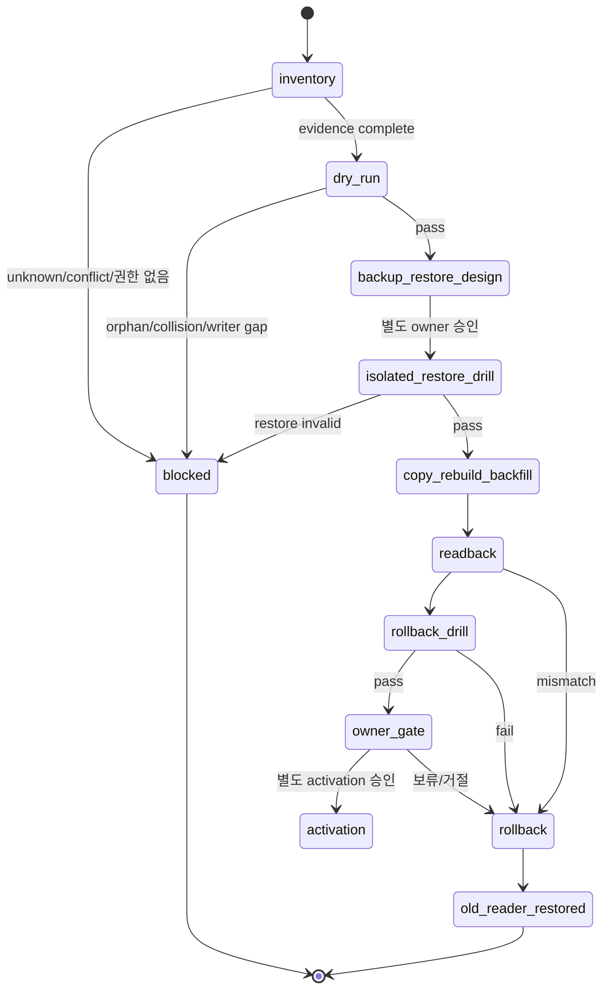

### 13.1 migration별 exact plan

| 대상 | inventory | dry-run | copy/rebuild/backfill | readback | rollback drill | activation |
| --- | --- | --- | --- | --- | --- | --- |
| candidate branch | exact refs, merge-base, file/symbol/oracle drift | latest-main patch preview와 allowed paths | C00Q, P1~P8 및 C09A에서 file-by-file 재구현; wholesale merge 금지 | focused+full tests, blob oracle | slice commit revert | code publish와 runtime deploy 분리 |
| TaskDriver schema | C09 live table/index/trigger query-only inventory | C02/C09A synthetic DDL collision/up/down | C09R valid restore와 C09D feature-OFF deploy 뒤 C10 fresh lock에서 approved DB에 new table; legacy row는 처음엔 안 옮김 | schema version/FK/index/trigger/receipt | coordinator OFF + reversal/current rebuild + old reader; committed event 없는 배포 실패만 verified DB restore | C10 뒤 G00/G01 |
| task event/current | 모든 mutation caller와 status count | legacy event/status crosswalk + creation-reversal FK fixture | one coordinator transaction; old history는 typed alias/backfill event로 연결 | current=replay aggregate/digest; reversed create는 identity/event 유지·current 없음 | old reader/facade restore; new event history 보존 | caller `0`/parity 뒤 compatibility 축소 |
| completion/reopen | delete caller와 completion aggregate | reopen/re-done synthetic | 과거 row 수정 없이 reversal event 추가; 필요한 legacy baseline만 | task ID/old completion/ref 보존 | compatibility view 재구축 | TREE04 pass |
| task ID | allocator/caller/duplicate inventory | reservation collision/retry fixture | 기존 ID 유지, 새 ID만 coordinator가 immutable reservation | same key→same task/receipt | 미commit transaction rollback; commit 뒤에는 reversal event/current rebuild | ID01~04 pass |
| mail history v2 | JS/Python/Outlook direct writers, scanner, CSV/ICS/XLSX shape와 coverage inventory | v1→v2 occurrence/assignment/outbox crosswalk, A→B event pair, generation manifest, role별 lease/epoch/failover dry-run | HPP coordinator/projector를 shadow로 replay; existing paths에 same-generation staged publish, source/event 삭제 0 | DB current+event+outbox↔CSV/ICS/XLSX ordered digest, partial Mac gap | P8/P9은 synthetic/normal-primary rollback만; 실제 epoch-vector failover/failback drill은 C08B/P10 별도 승인 | P8 acceptance 뒤 P9 one-project, production은 P10 별도 |
| voice/PC-work/file/run-log views | 각 technical owner/event/ref와 proposed CSV/XLSX shape·consumer inventory | accepted cutoff/gap/generation manifest와 HPP sole-writer dry-run | HPP projector가 shadow fixture로만 4개 derived view를 생성; technical owner/event 변경 0 | source event/ref+cutoff↔CSV/XLSX ordered digest, HPP 외 normal caller 0 | projector OFF, technical owner/reader 유지; generated view는 rebuild | H06/P8 acceptance 뒤 P9 one-project, production은 P10 별도 |
| source/relation ID | source별 owner ID/revision coverage | canonical basis/golden/collision/alias + existing owner-path crosswalk | C09L에 verified SourceRevision과 knowledge-binding event만 append; primary ID rekey·occurrence 복사 금지 | orphan/ambiguous/fuzzy join/duplicate-owner count | new reader OFF; original ID/event files 유지 | ID/TREE pass |
| contract-owned temporal metadata | C09 owner/ACL/pointer/writer inventory | C09A/C06A owner-adapter/no-second-truth manifest | C09L 한 project의 existing contract paths 뒤 별도 C09S에서 owner-approved common source revision만 materialize | projection receipt, replay digest, duplicate logical record 0 | reader OFF + correction/inactive event; record 삭제 없음 | C10 exact refs; C09S 별도 gate |
| project/common RAG | 모든 source/index/chunk/trace/answer/review/work-card consumer | owner target, conflict/orphan/no-delete manifest | 한 project만 copy/rebuild; original/legacy index 유지 | old/new query digest·coverage·ACL | target writer OFF, old reader restore | C10 별도 gate |
| Wiki/ontology | reader/writer/body owner/ACL inventory | revision/source/claim fixture | approved body owner에 new revision; metadata plane은 pointer만 | exact source/claim relation | new writer OFF, old reader 유지 | truth promotion 별도 gate |
| B9/ENGINE-12 | owner event↔projection ID coverage | synthetic rebuild/cutoff | adapter projection rebuild만 | task/B9/daily digest parity | old adapters restore | view별 zero-mutation pass |
| PC packet/reconciler | roles/bindings/checkpoint/tail/lease | duplicate/conflict/gap/failover fixture | signed packet queue와 state를 shadow로 구축 | full vs checkpoint+tail replay | all jobs OFF, last-good checkpoint | D10+V13/V14 별도 gate |
| runtime release | shell/source/data refs, audit blockers, backup/restore | pinned artifact/attestation preview | C09D maintenance window에 dedicated runtime checkout만 approved SHA로 feature-OFF deploy | require-live audit zero blocker + runtime binding receipt | C09D normal rollback은 binding OFF+old code, current DB 유지; C10 뒤에는 비파괴 reversal | G00 binding 뒤 G01 별도 승인 |
| AX Workspace | session/MCP/task-writer caller inventory | synthetic one-seat store | feature OFF, session data only | candidate/receipt link와 project ACL | feature OFF/session store restore | AX-G3 |
| HPP MCP custody/access | pathless logical-class/actor/grant/ticket inventory | `A8-SYNTH` public/pathless enrollment→mTLS→broker→delegation→ticket verifier adversarial fixtures; core dependency 없음 | `A8-SYNTH PASS`+accepted private `VERIFY_HP` exact binding receipt+strict office LAN+explicit owner+Level 3 뒤 `A8-CANARY` one seat/project/small file only | receipt/revision/ticket/audience/hash/size and optional redacted derivative lineage | binding/writer OFF, queue freeze/quarantine, prior accepted pointer; no OneDrive reverse-copy/delete | VPN/remote/bulk/team/production은 별도 future gate |

### 13.2 schema version과 down/rollback

- `meta.task_driver_persistence_schema_version`은 exact expected value와 다르면 startup/apply를 막는다.
- migration script는 `--dry-run`이 기본이고, `--apply`는 owner approval receipt, maintenance lock,
  valid backup/restore receipt 세 가지를 모두 요구한다.
- live down/rollback에서 append-only event를 삭제하지 않는다. Commit된 pilot event가 있으면 primary
  rollback은 같은 coordinator transaction의 reversal event+current rebuild, writer OFF, old reader 복원이다.
  Verified pre-migration DB 전체 복구는 C09D traffic freeze 동안 모든 legacy/TaskEngine writer가 0이고
  before/after DB/WAL/SHM 동일성이 증명된 재난에만 예외적으로 허용한다. 정상 C09D rollback은
  binding OFF+old code 전환이며 현재 DB를 유지한다.
  Commit 뒤 DB 재난 복구가 불가피하면 current DB/WAL/SHM을 먼저 격리 보존하고, 별도 승인된
  event export→restore→re-import→replay/readback 절차가 검증되기 전에는 성공 rollback으로 판정하지 않는다.
- backfill은 원문 재해석이 아니라 legacy owner ID/status/event를 typed alias/baseline으로 연결한다.
- conflict, orphan, unknown enum은 임의 보정하지 않고 quarantine manifest에 남긴다.
- Storage/promotion rollback은 prior accepted pointer를 유지한 채 target binding/writer를 OFF하고 queue를
  freeze/quarantine한다. 미래 switch는 copy+hash+readback 뒤에만 가능하며 OneDrive reverse-copy와
  retention approval 없는 delete는 금지한다.

### 13.3 branch integration 주의

Candidate의 유용한 pure code는 입력이지만, 다음은 그대로 통합하지 않는다.

- 오래된 merge-base에서 바뀐 README/package/CHANGELOG를 현재 파일 위에 덮어쓰기
- lifecycle/ENGINE-13/redesign oracle의 branch 변경
- result task ID가 이미 발급됐다고 가정하는 persistence 경로
- live DB에 install 함수를 자동 호출하는 startup 연결
- project RAG pilot을 실제 `_workspaces`에 바로 적용하는 경로

## 14. V-01~V-16·regression·security·replay 검증 계획

### 14.1 V-01~V-16

| ID | 검증 | 처음 필수인 slice | 합격 증거 |
| --- | --- | --- | --- |
| V-01 | TaskDriver schema, intent/driver digest, exact typed refs | C01B/C02 | schema snapshot + golden/collision tests |
| V-02 | 두 상태축 legality와 ERP crosswalk gap | C01B/C03 | 모든 legacy enum mapped/UNKNOWN report |
| V-03 | LLM output direct apply 불가 | C01B/C04A/C04B | authority 없는 apply reject |
| V-04 | deterministic policy authority/ref/expiry/revocation | C01B/C04A/C04B | valid/expired/revoked adversarial fixture |
| V-05 | completion은 follow-up Driver candidate만 emit | C01B/C07B | direct task row delta 0 |
| V-06 | same cause/digest idempotent, conflict quarantine | C01B/C02 | same receipt/no-op + conflicting digest reject |
| V-07 | task current와 life-tree replay parity | C02/C07B | current/B9/daily digest equal |
| V-08 | `valid_at/known_at` point-in-time replay | C01A/C07A/C07B | query cutoff↔owner-native fact/knowledge clock lossless crosswalk, cutoff fixture와 regression reject |
| V-09 | source/file exact revision join, fuzzy auto-binding 0 | C04A/C06A | exact coverage/gap report |
| V-10 | 모든 project RAG asset/consumer target | C05/C10 | owner map, orphan/foreign count 0 |
| V-11 | cross-project isolation, traversal/symlink reject | C05/C06B | adversarial path/ACL tests |
| V-12 | public/raw/private 경계와 `_workmeta` metadata-only | 매 slice/C09/C09L | payload sentinel 0, pointer/hash/receipt only |
| V-13 | sole reconciler, immutable packet duplicate/conflict | C08A/C08F | duplicate no-op/conflict quarantine/gap trace; binding OFF |
| V-14 | state-change/cooldown/weekend/recovery alert clock | C08B/G01 | synthetic clock; 실제 전송 전 pass |
| V-15 | projection call owner mutation 0 | C07B/C10 | before/after count/digest/mtime equivalent |
| V-16 | rollback reader/state 복원, event history 보존 | C02/C09R/C10 | restore/rebuild/readback receipt |

### 14.2 HP-STORAGE-01~10

| ID | 핵심 질문 | 합격/실행 위치 |
| --- | --- | --- |
| HP-STORAGE-01 | project payload와 common payload가 LOCKED owner map에 맞나 | C09 asset-kind owner-root/foreign-project aggregate |
| HP-STORAGE-02 | `_workmeta/<project>`와 system이 metadata-only이며 서로 침범하지 않나 | C09 inventory + C09L materialization sentinel 0 |
| HP-STORAGE-03 | index뿐 아니라 trace/answer/review/work-card consumer도 target을 읽나 | C05 dry-run + C10 readback, orphan 0 |
| HP-STORAGE-04 | TaskDriver가 임의 폴더/두 번째 task truth가 아닌가 | D01 gate; 같은 dev-ERP transaction owner 하나 |
| HP-STORAGE-05 | system RAG가 metadata-only인가 | C09 project/common body 0 |
| HP-STORAGE-06 | HWP 직접 parse가 없는가 | HWPX derivative/status/pointer receipt coverage |
| HP-STORAGE-07 | pilot이 source original/legacy index를 삭제하지 않는가 | C10 before/after inventory와 rollback dry-run |
| HP-STORAGE-08 | established logical `_workspaces/<project>` topology가 바뀌지 않았나 | HPP/work PCs/MacBook Air/Mac mini logical path set delta `0`; junction target은 pathless private evidence |
| HP-STORAGE-09 | active DB/WAL/SHM, RAW, queue/outbox/quarantine이 cloud sync에 들어갔나 | OneDrive/cloud-sync membership `0`, HPP private custody class receipt |
| HP-STORAGE-10 | non-HPP client가 HPP drive/UNC/SMB/SQLite를 직접 열었나 | direct path/mount/open/write `0`; MCP/API receipt만 존재 |

### 14.3 HP-ID-01~06

| ID | 핵심 질문 | 합격/실행 위치 |
| --- | --- | --- |
| HP-ID-01 | task ID를 sole coordinator만 발급하고 retry가 재사용하나 | C02 synthetic + C10 duplicate trace |
| HP-ID-02 | 기존 primary ID hash rekey가 0인가 | C03/C06A dry-run changed-ID count 0 |
| HP-ID-03 | source/RAG 6종 ID basis가 항상 같은가 | C01A/C05 golden full SHA-256 fixture |
| HP-ID-04 | short ID/alias collision이 격리되는가 | C01A adversarial write 0/quarantine |
| HP-ID-05 | ERP/source/B9/daily/Driver namespace가 exact crosswalk되나 | C07A/C07B orphan/ambiguous/bare join 0 |
| HP-ID-06 | gate/branch/task link가 project-qualified인가 | C06A stale/gate collision fixture |

### 14.4 HP-TREE-01~07

| ID | 핵심 질문 | 합격/실행 위치 |
| --- | --- | --- |
| HP-TREE-01 | gate→branch→event→task→fruit가 exact한가 | C07B/C10 coverage·gap, fuzzy confirmed 0 |
| HP-TREE-02 | primary parent가 하나이고 나머지가 cross-link인가 | C06A relation validator multi-parent 0 |
| HP-TREE-03 | Driver/task event가 B9/daily에 중복 없이 보이나 | C07B owner event 1 + projection relation |
| HP-TREE-04 | reanchor/reopen이 과거를 지우지 않나 | C03/C10 reversal append와 old completion 보존 |
| HP-TREE-05 | 동일 cutoff replay가 task/B9/daily에서 같은가 | C07B/C10 두 번 digest 동일 |
| HP-TREE-06 | 생명수 조회가 owner row를 바꾸지 않나 | C07B/C10 before/after invariant |
| HP-TREE-07 | fruit가 exact completion/artifact/decision/verification/outcome ref를 갖나 | C07B coverage; 미정 owner는 UNKNOWN |

### 14.5 MAIL-01~12 sole-writer/parity/fencing tests

| ID | 검증 | 합격 증거 |
| --- | --- | --- |
| MAIL-01 | JS/Python/Outlook/ERP scanner/projector caller graph과 sole normal caller | cutover allowlist에는 HPP coordinator/projector만; direct project-history writer `0` |
| MAIL-02 | same-node process lock | 두 번째 coordinator/projector가 lock 획득 실패, DB/file delta `0` |
| MAIL-03 | A→B reclassification identity | 같은 `mail_occurrence_id`, operation/generation/`classification_epoch`의 `reclassified_out/in`, current.last_event는 in-event FK, delete `0` |
| MAIL-04 | DB transaction crash points | identity/current/event/outbox의 before/after each failpoint에서 partial commit `0` |
| MAIL-05 | commit 뒤 stage/final-publish crash | committed outbox 유지, incomplete stage 무시, previous accepted generation 보존 |
| MAIL-06 | outbox replay logical exactly-once | N회 retry가 동일 generation/manifest를 반환하고 duplicate row/publish `0` |
| MAIL-07 | DB/CSV/ICS/XLSX generation parity | cutoff, generation, source_epoch_digest/max_classification_epoch, projector_epoch, row count, ordered digest가 모두 동일 |
| MAIL-08 | stale role epoch reject | DB transaction은 stale `classification_epoch`, outbox claim/stage/final publish는 stale `projector_epoch` write `0`; origin epoch는 불변 |
| MAIL-09 | failover state machine | P8은 synthetic `(C_E,P_E)` freeze/revoke→`(C_E+1,P_E+1)` classification-first→projector-second, pre-checkpoint old-outbox recovery allowlist와 stale-role reject; 실제 failover role switch는 C08B/P10 별도 승인 |
| MAIL-10 | failback state machine | P8은 synthetic `(C_E+1,P_E+1)` freeze/revoke→`(C_E+2,P_E+2)` HPP catch-up/promote와 자동 failback `0`; 실제 failback drill은 C08B/P10 별도 승인 |
| MAIL-11 | partial Mac coverage | `partial`은 exact count `>=0`+non-empty gap, `not_collected`는 null count+non-empty gap이며 전체 mail 부재로 해석되지 않음 |
| MAIL-12 | raw/private exclusion | body/html/recipient payload/attachment/path/secret가 DB event, outbox, manifest, CSV/XLSX에 `0` |

이 표의 최종 acceptance owner는 한 phase가 아니다. H01A는 `MAIL-03`의 project-independent identity와
append-only supersession 부분, shadow surface의 `MAIL-12`, `D26-FX-02/12/13/15/16`만 소유한다.
H01B는 ratified D25 mail policy 뒤 `MAIL-11` contract/synthetic fixture만 소유하고 실제 Mac/source
coverage receipt는 별도 authority 전 `UNKNOWN/VERIFY_HP`다. Current caller graph는 H01 read-only evidence지만
`MAIL-01` acceptance가 아니다. P8은 `MAIL-01/02`, full DB/FK/epoch `MAIL-03`, `MAIL-04..08`, synthetic-only
`MAIL-09/10`과 `MAIL-11/12` regression을 소유한다. P9은 한 프로젝트 DB↔CSV/ICS/XLSX parity와 bounded
switch/rollback을, P10은 실제 role/lease와 manual `MAIL-09/10` failover/failback 및 D23 emergency
fallback을 소유한다. 앞 phase의 합성 PASS를 뒤 phase의 live authority로 승격하지 않는다.

### 14.6 HP-HISTORY-01~12 five-lane acceptance

| ID | 검증 | 합격 증거 |
| --- | --- | --- |
| HP-HISTORY-01 | common envelope exact schema/digest | unknown field reject, canonical digest 2회 동일 |
| HP-HISTORY-02 | stable project-independent occurrence identity | project reclassification 전후 occurrence ID 불변 |
| HP-HISTORY-03 | owner-native fact/knowledge clocks와 normalized event/valid/observed/known/recorded crosswalk | lossless mapping, regression/unknown semantics와 cutoff fixture pass |
| HP-HISTORY-04 | coverage semantics | `complete_with_events>=1`, `complete_no_events=0`, `partial>=0+gap`, `failed/not_collected=null+gap`; `not_applicable`은 approved applicability ref 필수 |
| HP-HISTORY-05 | classification supersession | before/after/supersedes exact chain, 과거 event update/delete `0` |
| HP-HISTORY-06 | source/file/content revision exactness | orphan/ambiguous/bare ref `0`, content mismatch quarantine |
| HP-HISTORY-07 | no fuzzy joins | title/time/filename/LLM similarity는 confirmed relation `0` |
| HP-HISTORY-08 | five technical source owners and single-lane ownership preserved | §3.4.4의 모든 `TBD`가 owner-approved exact `{entity_type,owner_surface,entity_id}` allowlist로 해소되고 lane binding을 검증; second truth와 daily ledger/context projection event count `0`, 같은 physical source record의 cross-lane 중복 산입 `0` |
| HP-HISTORY-09 | five-lane replay | 같은 cutoffs로 두 번 replay한 envelope ordering/digest byte-identical |
| HP-HISTORY-10 | CSV/XLSX export parity와 sole normal writer | H06은 fixture/shadow generation·projector epoch·row count·digest와 target allowlist만; mail은 source_epoch_digest도 포함. P8 cutover fixture/P9 pilot에서 source cutoff exact 및 HPP projector 외 normal caller와 Mac write `0` |
| HP-HISTORY-11 | missing lane honesty | 누락 lane과 H03B schedule gap이 context acceptance를 block하고 빈 이력이나 H03A-only 합격으로 위장되지 않음 |
| HP-HISTORY-12 | common envelope/coverage receipt/adapter input raw exclusion | raw mail body/HTML/full recipient payload/attachment/path/secret, raw voice/file/run payload, run-directory recursion, stage log, whole task-chat·task-chat completion-hook/full-message summary·OS-surveillance field `0`; bounded WorkSession `summary`는 허용 schema로 별도 검증. 기존 v1 display metadata는 D22/D24 redacted allowlist 전 H06 source/acceptance 근거가 아님 |

#### 14.6A HP-COMM-01~12 sent-mail/Slack communication-history acceptance

| ID | 검증 | 합격 증거 |
| --- | --- | --- |
| HP-COMM-01 | account별 received/sent expected-source coverage | owner와 각 team account에 `received_source`, `sent_source`, applicability, window, freshness, gap이 명시되고 POP3 received-only를 sent complete로 계산 `0` |
| HP-COMM-02 | one message, many observations | exact native/RFC occurrence 하나에 sender/recipient mailbox observation N개; 동일 evidence-span/signal annotation duplicate `0`, 서로 다른 span/signal 보존 |
| HP-COMM-03 | exact identity ceiling | provider/RFC exact ref만 confirmed merge; EntryID/ConversationID/subject/time/size/LLM similarity만으로 confirmed merge `0` |
| HP-COMM-04 | participant semantics | sender/to/cc/bcc/unknown을 account-relative relation으로 보존; cc→assignee, bcc inference, multi-To→공식 task fan-out `0` |
| HP-COMM-05 | reply/forward/thread distinction | reply/forward는 새 occurrence이고 parent/thread relation만 공유; reply/ack를 official completion으로 승격 `0` |
| HP-COMM-06 | Outlook/POP3/SMTP source ceiling | owner Outlook local Sent, team POP3 received, Soulforge SMTP outbound의 실제 coverage만 주장하고 팀 전체 sent 완전성 과대 주장 `0` |
| HP-COMM-07 | Slack stable project binding | effective-dated `workspace_id+channel_id→project_code`; rename 후 동일 project, name-only/fuzzy binding `0` |
| HP-COMM-08 | Slack delivery replay | Events API outer `event_id` retry N회가 같은 delivery receipt; logical message duplicate/reordered event loss `0` |
| HP-COMM-09 | edit/delete revision lineage | same channel+message ref에 append-only edit supersession/delete tombstone; prior accepted revision overwrite/delete `0` |
| HP-COMM-10 | thread/project inheritance | root와 replies가 exact channel project를 상속하고 cross-project mention은 relation만 생성; 다른 project로 자동 재분류 `0` |
| HP-COMM-11 | scope/privacy/attachment boundary | allowlisted joined project channel만; DM/common/unmapped/Slack Connect는 rule 없으면 HOLD, raw body·token·secret·attachment byte의 public/`_workmeta` 유출과 자동 download/promotion `0` |
| HP-COMM-12 | task authority ceiling | request/commitment/decision은 candidate-only; message·reply·reaction·pin·delete·bot action으로 ERP official task create/complete, Wiki/RAG acceptance `0` |

#### 14.6B HP-LABEL-01~08 cross-input normalized label acceptance

| ID | 검증 | 합격 증거 |
| --- | --- | --- |
| HP-LABEL-01 | canonical project identity | 모든 lane/H07 adapter가 같은 typed `project_ref`를 사용하고 `project_code`는 owner-issued display projection만. P3/P5의 exact `project_assignment_basis={basis_kind,basis_ref}`와 evidence/policy ref 없이는 `confirmed` 금지; H00 `classified`→`confirmed`, bare/fuzzy/free-text project label `0` |
| HP-LABEL-02 | common clock semantics | source-native fact clock+native ref+basis+precision→`event_at`, 관측→`observed_at`, 인지→`known_at`, append→`recorded_at`, cutoff→`valid_at` lossless crosswalk. Offset 없는 PLAUD provider 절대시각의 owner-ratified UTC 해석만 허용하고 `start_seconds/end_seconds` 상대시간은 무변환 보존; host timezone 추정·single timestamp collapse `0` |
| HP-LABEL-03 | actor identity and roles | mail/voice/Slack/PC/file/run actor가 typed `party_ref`+typed `account_ref`+controlled role로 연결되고 typed human/rule/model/workflow `producer_ref`를 가짐. Display name/email alias/Slack name 자동 identity merge `0`; account만 확인되면 `party_ref:null`+identity gap |
| HP-LABEL-04 | shared semantic vocabulary and lossless crosswalk | 모든 semantic annotation이 exact `signal_type`/`semantic_facets`/`signal_state` enum, `source_semantic_refs`, exact span/evidence refs, crosswalk/policy revision, producer ref를 가짐. §3.4.6B voice candidate 8종+speech act 15종의 full crosswalk와 conditional reported-obligation rule을 검증하고 mail/Slack 독자 동의어·무기록 drop `0` |
| HP-LABEL-05 | confidence comparability ceiling | shared policy revision이 같은 `confidence_band`만 비교; model-local numeric score의 cross-source probability 비교·high→confirmed 자동 승격 `0` |
| HP-LABEL-06 | append-only correction | prior label overwrite/delete `0`; same-lineage 새 event만 exact predecessor를 supersede. Unique event/revision, same target+signal lineage, orphan/cycle/two-leaf/re-key reject와 deterministic current-projection replay를 검증 |
| HP-LABEL-07 | duplicate and cross-channel distinction | `(typed occurrence, source revision, exact evidence span, signal type, crosswalk revision, policy revision)` annotation key가 같을 때만 중복 제거. 한 occurrence의 여러 span·signal은 각각 보존하고 N mailbox observations만 중복 생성 `0`; 서로 다른 mail/voice/Slack occurrence는 자동 merge 없이 relation candidate만 |
| HP-LABEL-08 | authority, unknown, raw/secret honesty | `cc`, reaction, reply, acknowledgment, model confidence, `human_confirmed` annotation만으로 assignee·ERP task·official completion 생성 `0`; `unclassified|held_conflict|unknown`을 숨기지 않음. Raw mail/Slack body, transcript/audio, attachment/file/log bytes와 secret-like key/value negative fixture reject; false sentinel 자기선언만으로 PASS 금지 |

#### 14.6C HP-INGRESS·HP-SESSION·HP-QUERY acceptance

| ID | 검증 | 합격 증거 |
| --- | --- | --- |
| HP-INGRESS-01 | source subtype별 custody/staging/quarantine/promotion owner | exact owner/binding matrix unresolved `0`; D27 미결정 항목은 PASS 대신 HOLD |
| HP-INGRESS-02 | mail classification·`mail-candidate:promote`의 payload 권한 | attachment-byte delta `0` |
| HP-INGRESS-03 | upload receipt의 claim ceiling | project promotion/ArtifactRevision/Wiki/RAG/task mutation 자동 발생 `0` |
| HP-INGRESS-04 | reference/copy/move/derive decision matrix | durability·hash·size·ACL·retention proof; unauthorized copy/move/delete `0` |
| HP-INGRESS-05 | promotion idempotency/conflict | same operation+digest no-op, same operation+different digest quarantine |
| HP-INGRESS-06 | security gate | blocked type 또는 required scan missing/failed이면 promotion `0`; extension/hash를 malware scan으로 오인 `0` |
| HP-INGRESS-07 | authority separation | promoter/projector/source writer/mail classifier/TaskEngine cross-table·cross-file write `0` |
| HP-INGRESS-08 | raw boundary | public Git, `_workmeta`, envelope/receipt/projection/API에 body/path/secret/payload `0` |
| HP-INGRESS-09 | policy binding | source kind별 retention/ACL/scan/backup refs 없으면 live promotion `0` |
| HP-INGRESS-10 | rollback | source custody 보존, prior binding 복원, derived generation은 accepted parity가 맞을 때만 current |
| HP-INGRESS-11 | ticket actor/object binding | user/device/agent/thread/task/project/artifact/revision/action/method/audience/hash/size/expiry swap·omission `0` |
| HP-INGRESS-12 | replay·finalize·revoke race | ticket replay no-op/reject, finalize idempotent; revoke가 commit보다 먼저면 accepted mutation `0` |
| HP-INGRESS-13 | transport/path boundary | strict private office LAN+mTLS HTTPS only; VPN/Tailscale/remote/public ingress/port-forward/Funnel/direct SMB/client destination/path traversal `0` |
| HP-INGRESS-14 | content adversarial | archive bomb, hash/size/media mismatch, blocked type가 quarantine 밖으로 promotion `0` |
| HP-INGRESS-15 | exact revision download | ticket-bound exact revision과 bounded range resume의 reassembled hash 일치; latest/other revision/raw fallback `0` |
| HP-INGRESS-16 | sole binary/binding writers | HPP transfer service만 quarantine/inbox binary, HPP promoter만 project binding; client/projector cross-write `0` |
| HP-SESSION-01 | start+bind atomicity | orphan session/binding/receipt `0` |
| HP-SESSION-02 | cardinality | `{assignment epoch,account}` active primary 하나; second start는 same receipt 또는 `409` |
| HP-SESSION-03 | event idempotency/chain | same key/seq/digest same receipt; changed digest quarantine; gap projection `0` |
| HP-SESSION-04 | auth race | revoked/disabled/reassigned account 또는 spoofed node가 body 수신 중 바뀌어도 protected mutation `0` |
| HP-SESSION-05 | crash/reboot replay | send 전, server commit 뒤, local ack 전 crash와 reboot 뒤 동일 durable receipt 회수 |
| HP-SESSION-06 | local compact gate | verified server ack 전 local outbox compact `0` |
| HP-SESSION-07 | missing semantics | accepted start 없는 missing `0`; local pending과 server missing-closeout candidate 동일 취급 `0` |
| HP-SESSION-08 | handoff/supersession | old binding overwrite `0`, old terminal 후속 write reject, new session chain 보존 |
| HP-SESSION-09 | task separation | checkpoint/closeout/completion proposal 각각 task current/event/status delta `0` |
| HP-SESSION-10 | official completion | 별도 authorized coordinator가 expected revision에 exact task event 하나만 기록 |
| HP-SESSION-11 | proposal kind separation | task completion proposal과 current WorkSession knowledge memo/knowledge candidate 혼동 `0` |
| HP-SESSION-12 | private/existence boundary | raw transcript/thread ID/local path/secret 및 foreign task/session existence leak `0` |
| HP-SESSION-13 | actor chain completeness | distinct user/device/agent/opaque-thread/task/project/artifact/revision/action/expiry가 audit receipt에 결박 |
| HP-SESSION-14 | delegation ceiling | human grant∩trusted device∩agent policy∩task/object/action 밖 child grant·ticket `0`, earliest parent expiry 적용 |
| HP-SESSION-15 | device revoke cascade | device/parent revoke 뒤 refresh, child grant, upload/download ticket, pending protected mutation `0` |
| HP-SESSION-16 | routine UX | enrolled trusted device의 routine checkpoint/chunk는 broker silent refresh; 반복 human prompt `0` |
| HP-SESSION-17 | step-up boundary | recovery/new device, scope expansion, restricted reveal/download, promotion/move/delete, completion, knowledge promotion만 step-up |
| HP-SESSION-18 | outage/crash recovery | HPP outage는 local HOLD/last-accepted read-only, remote mount/split writer `0`; ack-before-crash replay가 same receipt |
| HP-QUERY-01 | explicit scope/ACL | scope 누락, item 없는 foreign project, unauthorized result/existence leak `0` |
| HP-QUERY-02 | no fallback | project→common, common→project, foreign-project implicit fallback `0` |
| HP-QUERY-03 | accepted generation | stale/unaccepted/mismatched generation 결과·pointer mutation `0`; 이전 accepted generation 유지 |
| HP-QUERY-04 | API/file parity | 같은 generation/cutoff/row count/ordered digest의 API↔CSV/XLSX 일치; reverse import `0` |
| HP-QUERY-05 | exact knowledge provenance | 모든 RAG/Wiki hit에 scope+exact revision/content/locator+weakest claim ceiling |
| HP-QUERY-06 | fuzzy/bare result | accepted context 승격 `0`; observed 또는 blocked gap만 |
| HP-QUERY-07 | read mutation ceiling | auth audit touch를 제외한 task/history/Wiki/RAG/business row before/after digest 불변 |
| HP-QUERY-08 | candidate-only team write | candidate ledger 한 곳만 append; Wiki/RAG/canon/ontology/task delta `0` |
| HP-QUERY-09 | overclaim reject | team lane의 `validated_private|canon_candidate|canon_entry` 요청 `422` |
| HP-QUERY-10 | stable pagination | generation-pinned cursor가 mid-query publish에도 중복·누락 `0` |
| HP-QUERY-11 | UI/MCP equivalence | 같은 actor/scope/generation의 typed result digest 동일 |
| HP-QUERY-12 | artifact/revision/action existence safety | list/detail/search/download가 같은 403/404 정책을 쓰고 unauthorized existence signal `0` |
| HP-QUERY-13 | ACL-aware RAG field/chunk | pre/post filter 모두 적용, unauthorized field/chunk hit `0`, locator도 같은 ACL |
| HP-QUERY-14 | cache revocation | ACL/policy/revision이 cache key에 결박되고 revoke 뒤 stale cached body/locator `0` |
| HP-QUERY-15 | redacted derivative lineage | sensitive Excel/PPT hidden/formula/comment/note/embed policy 적용, immutable derivative→exact source revision lineage, raw fallback `0` |
| HP-QUERY-16 | exact download parity | exact revision range resume의 final digest가 accepted manifest와 같고 audience/method/revision swap `0` |
| HP-EXT-01 | authority separation | external native task/session/memory/dispatch/done가 ERP task, WorkSession, AgentRun, accepted knowledge, canon을 mutate하거나 대체 `0` |
| HP-EXT-02 | one writable surface | `{assignment epoch,account}`에 WorkSession checkpoint/proposal writer 하나; child direct MCP write `0` |
| HP-EXT-03 | cross-adapter non-nesting | Hermes형 gateway와 Orca형 workbench가 서로 launch/call하거나 write token을 공유 `0`; Orca coordinator의 bounded direct worker는 HP-ORCA-05로만 제한 |
| HP-EXT-04 | handoff/revoke | surface 변경 전 old delegation revoke+terminal handoff+superseding binding; stale child completion accept `0` |
| HP-EXT-05 | receipt chain | official task/session/external run/subtask/base revision/candidate artifact/validator refs가 typed relation으로 보존되고 raw transcript 복사 `0` |
| HP-EXT-06 | completion ceiling | terminal idle, worker done, decision gate, Kanban done, goal judge가 official completion/verification/approval로 승격 `0` |
| HP-EXT-07 | binary boundary | non-mergeable engineering artifact actual writer 하나, authenticated HTTPS custody/promotion/exact revision 밖 drag/drop·첨부 write `0` |
| HP-EXT-08 | rollback | tool OFF·delegation revoke·prior direct client restore 뒤 task/history/knowledge/canon delta `0` |
| HP-ORCA-01 | pinned base/worktree | exact latest-main base, isolated worktree별 file ownership, hidden shared writable root `0` |
| HP-ORCA-02 | Manual permission | Codex/Claude/Antigravity 등 모든 launch의 bypass/yolo flag `0`; custom override까지 exact command 검증 |
| HP-ORCA-03 | host boundary | worktree를 sandbox로 과대 주장 `0`; secret/home/D:/OneDrive/private repo/network outside allowlist 접근 `0` |
| HP-ORCA-04 | candidate Git ceiling | Orca commit/push/PR/main merge `0`; Codex가 current main에서 bounded 재검토·재구현·validator rerun |
| HP-ORCA-05 | orchestration depth | Orca coordinator 하나와 2~3 disjoint worker; worker native subagent/team spawn과 Hermes launch `0` |
| HP-ORCA-06 | value rubric | ORCA-T1은 matched direct-Codex baseline과 public-safe task 1건 비교; ORCA-T2만 별도 승인 뒤 2주 또는 10건의 time/intervention/quality/rework/usage 비교 |
| HP-ORCA-07 | experimental-state honesty | task/dispatch/decision gate/worker_done를 local coordination evidence로만 기록하고 production readiness claim `0` |
| HP-ORCA-08 | integration receipt | candidate diff/artifact+validator receipt를 coordinator 하나가 ordered WorkSession checkpoint로 제출, child 제출 `0` |
| HP-HERMES-01 | human/channel mapping | platform user→ERP account/project grant exact mapping, shared/unknown identity write `0` |
| HP-HERMES-02 | MCP minimum allowlist | query/candidate tools만 explicit include, sampling·write-capable extra tool·catalog auto-install `0` |
| HP-HERMES-03 | transcript/memory custody | encryption/retention/delete/consent policy와 accepted knowledge 분리; memory→Wiki/RAG/canon 자동승격 `0` |
| HP-HERMES-04 | task-state ceiling | Kanban/goal/delegation done이 ERP task/current/completion을 mutate `0` |
| HP-HERMES-05 | attachment boundary | generated/received file은 ingress custody receipt로만 전달; ArtifactRevision/project acceptance 자동 생성 `0` |
| HP-HERMES-06 | delivery replay | at-least-once message/retry가 same idempotent receipt를 회수하고 duplicate WorkSession event `0` |
| HP-HERMES-07 | no Orca nesting | Hermes가 Orca/lane/MCP를 launch하거나 같은 WorkSession write token을 공유 `0` |
| HP-HERMES-08 | one-seat ceiling | one-seat candidate query/submission만; team rollout·scheduler·unattended production activation `0` |

#### 14.6D HP-LIVE-01~06 per-source operational acceptance

아래 gate는 받은메일, 보낸메일, PLAUD 음성, Slack, Codex 작업로그, 파일변경, PC업무에 **각각**
적용한다. 한 source의 PASS나 historical one-shot canary는 다른 source의 PASS, continuous binding 또는
formal H acceptance가 아니다. `N`은 owner-approved bounded observation-window 수이며 미정이면 HOLD다.

| ID | gate | source별 합격 증거 |
| --- | --- | --- |
| HP-LIVE-01 | exact authority/binding | source owner, credential/service authority, physical/logical binding, source identity와 applicable H slice가 exact receipt로 결박되고 private 값을 public 문서에 노출하지 않음 |
| HP-LIVE-02 | continuous operation | 연속 `N` windows에서 restart, cursor/checkpoint, replay/dedupe, gap, freshness threshold를 통과하고 one-shot 수집을 continuous로 계산하지 않음 |
| HP-LIVE-03 | project classification separation | live custody/collection과 새 normalized H→P5 project-classification writer·policy·acceptance를 분리하고 해당 path가 `OFF`여도 source receipt를 정직하게 보존. legacy source-local route는 별도 `VERIFY_HP` |
| HP-LIVE-04 | shared semantic-label gate | accepted P5 전 shared semantic annotation runtime·shared label writer `0`; source-native observation은 evidence ref에 머묾 |
| HP-LIVE-05 | TaskDriver mutation gate | accepted P7 전 TaskDriver/ERP create·assign·complete mutation `0`; live source event는 candidate authority도 자동 획득하지 않음 |
| HP-LIVE-06 | writer cutover/recovery | P10 source별 activation에 HPP sole writer, old-writer revoke/fence, rollback, manual failover와 failback receipt가 모두 있고 automatic failback `0` |

#### 14.6.1 D26 pre-approval synthetic fixture matrix

아래 fixture는 구현 승인이나 D26 ratification이 아니다. 각 H slice가 시작될 때 owner-approved exact typed
ref allowlist와 결합할 설계 목록이며, `TBD`를 fixture가 임의 값으로 채우거나 합격으로 바꾸지 않는다.

| ID | synthetic input | 합격 또는 보존해야 할 결과 | 반드시 reject/HOLD할 결과 | owner gate |
| --- | --- | --- | --- | --- |
| `D26-FX-01` | §3.4.4 각 subtype의 exact typed-ref triple과 `owner_surface: TBD` 반례 | ratified triple만 lane binding 후보 | `TBD`, unknown type/owner, bare ID는 envelope 생성 전 중단 | D26 |
| `D26-FX-02` | 같은 opaque mail occurrence의 project A→B 재분류와 project-bound legacy `이력키` | occurrence ID 불변, append-only out/in event와 supersession | legacy key를 identity로 채택, raw provider ID·thread·project를 identity에 포함 | H01/D26, D21~D23은 later writer gate |
| `D26-FX-03` | 한 `recording_id`의 여러 session/bundle ref와 transcript v1→v2 | recording occurrence 1개, grouping relation, approved retranscription supersession | session/bundle을 occurrence로 승격, H02 event/revision `TBD`를 자동 확정 | H02/D26 |
| `D26-FX-04` | WorkSession same-key replay, changed-payload conflict, bounded `summary`, 이를 요약한 daily ledger | same payload replay는 occurrence 1개; daily ledger가 source ref만 가리키고 event/count 증분 `0` | transcript/whole chat field, changed payload 재사용, daily ledger를 새 occurrence로 산입 | H03A/D19/D26 |
| `D26-FX-05` | explicit instruction packet과 같은 task의 whole task-chat/completion-hook summary | owner-approved packet만 occurrence 후보 | task-chat payload·hook summary·화면·키 입력·OS 감시 수용 | D19/D26 |
| `D26-FX-06` | stable external schedule row의 version v1→v2와 stale expected revision | current와 immutable version/event 분리, exact supersession replay | D20 owner/path/writer 없이 row ID 생성·task discovery·H03 acceptance | D20/H03B/D26 |
| `D26-FX-07` | 같은 logical file의 observation, reconciliation event, ERP upload event와 revision refs | owner-approved event subtype만 occurrence; logical/revision/observation 역할 보존 | `logical_file_id`, path, filename, mtime, hash 단독을 occurrence로 확정 | H04/D26 |
| `D26-FX-08` | exact `report_authoring_v0` receipt replay와 same `job_id` different digest, wrong workflow ID | canonical identical receipt replay와 validator ref 보존 | same-job conflicting receipt, non-report-authoring schema를 generic run으로 수용 | H05/D26 |
| `D26-FX-09` | current five-field 두 record가 같은 current `id`지만 omitted field가 다름 | 현행 record는 relation-only/ineligible 상태 유지 | full-record digest/conflict/boundary 없이 H05 occurrence나 completeness에 산입 | H05/D26 |
| `D26-FX-10` | 같은 physical source ref를 두 lane adapter에 동시에 제시 | owner-approved primary lane 1개와 cross-lane typed relation만 | 두 occurrence/event/count 생성, proximity/fuzzy dedupe | D26/H06 |
| `D26-FX-11` | daily ledger/context projection이 H01~H05 source refs를 요약, source ref 누락 반례 | 원 source event/count 그대로, projection count `0` | projection을 source truth로 승격하거나 D25 전 새 gap code 생성 | D25/D26 |
| `D26-FX-12` | mail/voice/file/run raw sentinel을 unknown key와 schema 허용 문자열 필드에 각각 삽입, task-chat payload, `runs/**` recursion, stage log | boundary 검사를 통과한 exact metadata ref와 bounded WorkSession `summary`만 통과; H04 source-owned relative locator는 source에 남고 envelope에는 typed ref만 전달 | body/transcript/absolute·UNC·workspace locator/raw log/secret·arbitrary manifest를 허용 필드에 숨겨 수용 | H01~H06 |
| `D26-FX-13` | §3.4.4 subtype 전체와 versioned exact typed triple allowlist | 모든 subtype이 owner-approved triple 하나에만 대응하고 누락·alias·중복 `0` | wildcard, `TBD`, owner alias 이중 binding, bare-ID 전역 dedupe | D26 + H01~H05 owner |
| `D26-FX-14` | source event→envelope→CSV/XLSX/daily/context projection→adapter 재입력 | projection echo를 source와 구분해 native occurrence/event/count 증가 `0` | HPP 산출물, daily ledger, context row를 source truth로 재수용 | D24~D26/H06 |
| `D26-FX-15` | canonical 동일 event replay와 같은 exact `event_ref`의 다른 full-record digest | 동일 replay는 no-op, conflict는 quarantine하고 source record 보존 | last-write-wins, 일부 필드 hash 일치만으로 duplicate 처리 | H00/D26 + lane owner |
| `D26-FX-16` | 서로 다른 provider/account scope에서 충돌하는 raw mail message/thread token과 project A→B 재분류 | owner-approved scope의 opaque occurrence는 서로 구분되고 project 재분류에는 ID 불변 | raw provider token 전역 collapse, provider/account/project 원문을 common ID에 복사, project별 새 occurrence 생성 | H01/D26 |
| `D26-FX-17` | voice recording, session/bundle, producer receipt, consumer ack, latest pointer와 ack stale 반례 | recording만 occurrence 후보; 나머지는 relation/control metadata로 count `0`, receipt 변경 뒤 stale ack 중단 | receipt·ack·latest pointer를 occurrence/event로 산입 | H02/D25/D26 |
| `D26-FX-18` | 같은 schedule row의 owner-approved canonical serialization, 의미 변경, stale revision, 다른 schedule의 같은 local token | canonical 동등 입력은 같은 content digest, 의미 변경은 새 immutable revision; row ID는 owner/schedule scope로 고정 | D20 정규화 규칙 없이 timezone/field-order 차이를 revision으로 발명하거나 다른 schedule token을 collapse | D20/H03B/D26 |
| `D26-FX-19` | WorkSession occurrence 1개와 report-authoring job occurrence 1개 및 둘의 typed relation | 두 native occurrence와 relation만 보존하고 projection 추가 occurrence `0` | 둘을 하나로 과잉 dedupe하거나 receipt를 H03에도 재산입 | D19/H03A/H05/D26/H06 |
| `D26-FX-20` | receipt와 envelope의 lane/source/project exact match, `known_at` half-open cutoff, 여섯 coverage state/count matrix | owner-approved window와 vocabulary에서만 exact count/digest receipt 생성 | mixed scope, cutoff 밖 event, reversed window, count mismatch, `HOLD`를 `complete_no_events`로 변환, D25 전 gap code 발명 | H00/D25/D26/H06 |

모든 항목은 pre-approval fixture이며 현재 acceptance 증거가 아니다. 특히 `TBD`, owner scope,
normalization 또는 gap vocabulary가 필요한 `D26-FX-01`, `03`, `05`~`07`, `09`, `13`, `16`~`20`은
해당 결정 전 expected `HOLD`다. H06은 이 HOLD를 빈 이력이나 `complete_no_events`로 바꾸지 않고
HP-HISTORY-08/11 blocker로 전달한다.

### 14.7 실행 순서와 adversarial set

1. C00A public blocker preflight → separately approved C00Q public/synthetic query-tool foundation → separately approved C00B P0 baseline/source-owner inventory
2. H00~H06 + H01C sent/received reconciliation + MAIL/HP-HISTORY/HP-COMM과 HP-INGRESS의 contract/shadow schema, custody, coverage, replay/export tests; live caller-zero/payload promotion/cutover/failover claim 없음
3. P2~P3 foundation acceptance, 병렬 H07A contract 뒤 H07B Slack immutable revision/project-context Shadow, P4~P5와 `context_acceptance_gate`; 적용 Slack gap을 `not_applicable`로 숨기지 않음
4. P6 candidate-only discovery와 P7 Driver acceptance
5. P8 core acceptance 뒤 별도 I8/Q8 approval에서 feature-OFF ingress receipt와 accepted-query pointer fixture를 검증한다. P8 core 자체는 same 입력 replay 2회 byte-identical digest, sole-writer/mail-outbox/cutover와 synthetic classification/projector epoch-vector tests를 소유한다. Personal lifecycle은 core P8 gate 아님
6. duplicate, conflicting digest, expired/revoked authority, stale expected revision, short-ID collision,
   path traversal, symlink escape, cross-project ACL, clock regression, packet gap adversarial tests
7. accepted C00Q tool을 재사용한 HP query-only inventory와 C09A migration dry-run
8. P9 core one-project HPP-primary/task pilot과 rollback drill을 먼저 닫는다. 그 PASS 뒤 별도 I9/Q9 approval에서만 one-project promotion/query pilot을 하고, AX-G1 review를 시작한다. 실제 failover/failback과 personal team rollout은 P10 별도 승인
9. HP-SESSION/HP-QUERY crash·ACL·generation·candidate-only synthetic set과 root/dev-ERP/docs regression
10. §12.1 slice별 minimum independent review. 공개 기준선 `main@310640b7a5692298227026b547a68bcb25d2b330`의
    plan-scope validation/review는 `PASS`이며, 그 뒤 문서 delta는 publish 전 같은 범위의 validator와
    independent review를 다시 통과해야 한다. authority/migration/live mutation/workflow slice는
    fresh executor + separate verifier Level 3

증거 packet은 commit/allowed paths, opaque refs, 각 검증의 pass/fail/blocked와 exit, before/after
aggregate/digest, public/private boundary verdict, rollback 결과 또는 `not_run` 이유, reviewer verdict를
가진다.

현재 plan publish validator는 다음을 사용한다.

```text
git diff --check
npm run ui:docs:check
npm run validate:path-policy
npm run ui:done:check
immutable oracle working-tree diff + before/after blob
AC-01~AC-26 completeness
fresh root validation/review (공개 기준선 `main@310640b7a5692298227026b547a68bcb25d2b330`까지 PASS;
후속 delta는 publish 전 재검증)
```

Implementation 단계의 최소 regression은 `validate:task-engine-core-v1`,
`validate:task-engine-rag-v1`, `validate:file-activity`, `validate:rag`, full dev-ERP tests, root tests를
포함한다. 실행하지 못한 항목은 성공으로 간주하지 않고 `not_run`과 blocker를 기록한다.

## 15. one-project pilot와 단계별 activation

Pilot project는 owner가 지정한다. agent는 project code를 만들거나 실제 이름을 public 문서에 쓰지
않는다. Task는 1~3개로 제한하고, unrelated row/path는 allowlist 밖이다.

| 단계 | 기본 상태 | 하는 일 | 통과 조건 | 실패 시 |
| --- | --- | --- | --- | --- |
| P0 baseline/inventory | OFF/read-only | C00A public blocker → C00Q synthetic tool → C00B approved source owner/writer/consumer/source-availability inventory | exact refs, raw leak 0, authority-attested current gap+next proof, C00B P0 receipt → H00 only | `BLOCKED`; H00 ratification 전 six-state completeness와 exact C00Q child packet 밖의 code·모든 DB/live write 시작 금지 |
| P1 histories/coverage | OFF/shadow only | H00~H06 mail·voice·structured PC work·file·run/log append-only envelope와 coverage; H01에는 sent/received mailbox observation reconciliation 포함. H07A Slack contract는 병렬 준비. live binding·continuous collector는 범위 밖 | MAIL/HP-HISTORY/HP-COMM, replay/export parity, gap honesty | adapters/exporters OFF, source owners 보존 |
| P2 IDs/refs/clocks | synthetic | C01A/C08A stable IDs, typed refs, owner-native clocks와 valid/known query-cutoff crosswalk | collision/orphan/bare join 0, lossless clock/packet receipt | scoped revert; P3 금지 |
| P3 immutable revisions | synthetic/shadow | C06A source/file/artifact revision, typed party/account relation, project assignment event/state/basis lineage; accepted H07A가 있으면 H07B Slack message/edit/delete revision Shadow를 병렬 검증 | append/supersede, exact content/revision, no rekey, account-only identity gap, assignment evidence/policy refs, HP-COMM-07~12; shared annotation 0 | reader/Slack collector OFF, original events 보존 |
| P4 exact RAG/Wiki | writer OFF | C05/C06B project/common resolver와 revision-bound RAG/Wiki | exact locator/source revision, isolation, no-delete | target reader/writer OFF, legacy 유지 |
| P5 validated context | read-only | C07A history+time+relation+RAG/Wiki+gap assembly; 적용된 Slack project channel은 accepted H07B source를 함께 읽고 중앙 context labeler가 §3.4.6B semantic annotation candidate만 생성 | deterministic `context_acceptance_gate` receipt, mapped channel project scope exact, `HP-LABEL-01..08`, source-native observation 보존, duplicate shared annotation 0 | P6 금지; Slack gap·unmapped channel·label conflict를 숨기지 않음, source별 shared target vocabulary·authority 금지 |
| P6 discovery | candidate-only | C04A가 accepted context와 evidence-bound semantic annotation에서 TaskIntent candidate 생성 | ERP/task row delta 0, candidate replay/idempotency, annotation→TaskIntent exact ref와 authority ceiling | discovery OFF; P7 금지, annotation만으로 official task/assignee/completion 생성 금지 |
| P7 TaskDriver | synthetic | C01B why/why-now, authority, expiry/revocation, idempotency | Driver acceptance receipt | P8 schema/writer 금지 |
| P8 sole writers/outbox | feature OFF/synthetic | parallel C02+C08F → C03 → C04B ERP atomic writer, mail current+event+outbox, five-lane HPP projector/parity/fencing | V01~16 applicable + MAIL-01~12 synthetic + HP-HISTORY-10 cutover fixture, direct/non-HPP writer 0; live role switch 0 | coordinator/projector OFF, old reader 유지 |
| P9 one-project pilot | per-source bounded ON then OFF | C09*/C10 1~3 task + owner-approved source별 bounded canary + one-project derived generation + C07B feedback/read-only life trees. 각 source는 독립 판정 | exact refs, unrelated delta 0, source별 `HP-LIVE` 적용분, source↔CSV/XLSX parity, replay/rollback, event 보존 | 해당 source target writer OFF + non-destructive rollback; 다른 source 상태 불변 |
| P10 separate activation | default OFF | source/capability별 C08B/G00/G01/C09S/AX/AR/IQ/ML 별도 승인; source마다 HPP sole writer, old-writer fence, manual failover/failback | source별 Level 3, lease/epoch, RTO/RPO, rollback·failback receipt | 보류가 기본; 묶음 활성화·automatic failback `0` |

P9 pilot approval은 P10, scheduler, network transport, team write, alert delivery, broader corpus,
failover/failback, AX/AgentRun/ML activation 승인이 아니다. 각 기능은 별도 gate를 갖는다.

## 16. Engineering IQ·ML 장기 확장선

Engineering IQ는 모델 점수보다 먼저 **검증 가능한 trace**를 만든다.

```text
RequirementRevision
  → FunctionRef
  → InterfaceRef
  → RiskRef
  → DecisionRef
  → VerificationRef
  → OutcomeRef
  → CorrectionRef
```

각 edge는 typed endpoint, valid_at/known_at, source/evidence ref, relation event, supersedes를 가진다.
Trace UI는 coverage, missing verification, stale decision, correction chain을 읽기 전용으로 보여준다.
프로젝트 원문을 central training store로 복사하지 않는다.

ML/ranking은 다음 조건을 모두 만족할 때만 shadow candidate가 된다.

- owner가 label 정의, minimum volume/quality, class balance, privacy boundary를 결정
- label마다 source/decision/verification/outcome provenance가 존재
- deterministic rule/baseline과 frozen holdout이 존재
- shadow score가 task/source를 직접 쓰지 않음
- calibration, false positive, subgroup bias, drift, rollback 기준을 통과

현재는 canonical trace와 verified label pool이 `UNKNOWN`이므로 IQ01과 ML01은 `DEFER`다. 이 범위를
core TaskDriver 일정에 끼워 넣지 않는다.

## 17. owner 결정표·UNKNOWN·VERIFY_HP

### 17.1 owner가 결정할 것

| ID | 결정 | 권장 안전 기본값 | 영향 slice | 결정 전 허용 / 금지 |
| --- | --- | --- | --- | --- |
| D01 | TaskDriver physical store와 task-table physical writer | dev-ERP SQLite same-transaction table + `TaskEngineTransactionCoordinator` 1개; logical authority만 분리. Mail table writer는 D21의 별도 identity | C02/C10 | pure/synthetic 허용 / live install 금지 |
| D02 | 공식 typed `task_event` 신설 vs `event_log` 확장 | 새 `task_event` + 한시 mirror | C02/C03 | fixture 허용 / legacy 제거 금지 |
| D03 | legacy `unclassified/open/doing`과 canonical work status/reopen 의미, `valid_at/known_at` query cutoff와 source-native clock crosswalk | lifecycle 정본의 두 축·값은 그대로 사용; legacy status는 explicit crosswalk, reopen은 same task reversal. `valid_at/known_at`은 query cutoff로 두고 persisted source event의 fact/knowledge clocks를 보존하는 lossless mapping을 owner가 ratify한다. ambiguous status 또는 lossy clock mapping은 DEFER | C01A/C01B/C03/C06A/C07A | synthetic status/clock crosswalk dry-run / 새 decision state·의미 자동 변환과 native clock collapse 금지 |
| D04 | human-only와 bounded auto-apply 범위 | 기본 human-only; policy는 opt-in+expiry+revocation | C04A/C04B/G01 | candidate 허용 / auto-open/apply 금지 |
| D05 | task ID allocator/reservation/retry authority | sole coordinator만 발급·재사용 | C02/C10 | synthetic reservation / 외부 caller ID 발급 금지 |
| D06 | SourceRevision와 relation/application exact physical owner/writer | SourceRevision은 기존 `_workmeta/<project|system>/knowledge/source_revision_records`+월별 events, knowledge application은 project `ontology/knowledge_bindings/events` 재사용; occurrence는 source-local 유지. Non-knowledge relation owner는 contract sync 전 UNKNOWN이며 generic ledger 금지 | C06A/C09L/C09S/C10 | owner adapter/validator / live materialization·parallel truth·fallback 금지 |
| D07 | legacy RAG project/common 분류와 pilot project | unresolved는 project/common 어느 쪽에도 자동 이동하지 않고 quarantine | C05/C10 | inventory/dry-run / copy·delete 금지 |
| D08 | WikiRevision·knowledge truth promotion authority | source-bound candidate와 owner promotion 분리 | C06B | reader/candidate / truth 자동승격 금지 |
| D09 | Verification/Outcome canonical owner와 fruit 최소 relation | completion ref 필수, 나머지 미정은 UNKNOWN; 자동 close 금지 | C07B/C10 | gap projection / 임의 entity 생성 금지 |
| D10 | operational-primary, failover, packet producer, sole reconciler, SQLite coordinator identity와 logical apply authority | identity/authority를 각각 명시; task-table 물리 writer는 하나 | C08A/C08F/C08B/C09D/G00/G01 | synthetic packet/binding / role 추정·승격 금지 |
| D11 | alert channel과 cooldown/weekend/recovery policy | 전송 OFF, state-only candidate 먼저 | C08B/G01 | synthetic clock / 실제 알림 금지 |
| D12 | AX Workspace canon 명칭·주 작업면·session store | ERP 공식 task 유지, AX는 personal sidecar | AX01 | design/synthetic / task truth 복제 금지 |
| D13 | AgentRun schema와 workflow/party 관계 | runtime instance와 receipt만 별도; canon 의미 유지 | AR01 | contract draft / unattended capability 금지 |
| D14 | Engineering IQ trace entity/label 정의 | exact verified trace 먼저 | IQ01 | read-only projection / score 자동판정 금지 |
| D15 | ML 최소 label/quality/bias threshold | 기준 결정 전 ML 없음 | ML01 | baseline 설계 / training·production 금지 |
| D16 | runtime code source와 data root 결합 해소 | pinned backend-code 분리 또는 audit의 code/data attestation 분리 | C08F/C08B/C09/C09R/C09D | read-only audit / 개발 checkout을 운영에 복사 금지 |
| D17 | core-only 유지 vs dedicated worker | 현재 unattested worker는 OFF 유지; 필요성과 복구 절차를 먼저 결정 | C08B/C09D/G01 | health/audit / worker 활성화 금지 |
| D18 | C09L ledger, C09R restore, C09D deploy, C10 pilot, C09S common/system, G00 binding, G01 production activation | 각 단계 별도 명시 승인 | C09L/C09R/C09D/C10/C09S/G00/G01 | plan/synthetic / live mutation·activation 금지 |
| D19 | Codex structured-capture boundary | 금지 경계는 whole conversation·screen·keystroke·OS surveillance 기본 OFF로 먼저 ratify한다. positive allowlist의 현재 eligible source는 bounded ERP MCP WorkSession뿐이다. explicit instruction packet과 execution/validator receipt는 exact owner/schema/ID/consent·retention 전 HOLD | H03/AX01 | existing WorkSession/negative-boundary fixture / broad capture와 owner 미정 source 수용 금지 |
| D20 | external SE master schedule revision/event owner·path·writer | owner-held current row + project metadata append-only exact revision/event; writer 1개, dev-ERP는 typed ref consumer. exact identity/path/writer가 아직 미정이므로 H03B HOLD | H03/C06A/C07A | synthetic fixture / owner 없는 live event·task discovery 금지 |
| D21 | mail lease/epoch durable owner·exact CAS record와 HPP logical identities | owner-controlled issuer/revoker, role별 local lock 1개, independent `classification_epoch`/`projector_epoch`; DB/outbox/manifest에는 두 역할을 분리 기록. Pure H01 shadow와 분리하며 P8 synthetic contract 뒤 exact durable owner/path는 P9 pilot 전에 확정한다. Live binding 추론 금지 | C04B/C08F/C08B/C09/C10/P8/P9/P10 | P8 synthetic lease/fencing / exact owner 없는 pilot·live claim·publish·role switch 금지 |
| D22 | mail schema v2, redacted projection-field allowlist, cutover, RTO/RPO, failover/failback approver | pure H01 envelope shadow와 분리한다. v1 paths 유지; owner-approved display-field allowlist는 H06/P8 projection 전에, mail-v2 DB/outbox는 P8에서, bounded cutover는 P9에서, RTO/RPO·approver는 P10에서 적용한다. no auto failback | H06/C04B/P8/P9/P10 | schema/dry-run / unapproved display field export, live cutover·role switch 금지 |
| D23 | Mac project-history emergency fallback과 mail coverage | H01 pure shadow의 선행조건이 아니다. Mac이 expected source라면 source coverage facts는 D25 policy input으로만 쓰고 normal project-history write allowlist는 empty다. 별도 dormant `project_history_emergency_fallback`은 explicit P10 approval에서만 five-lane projector를 맡고, mail coordinator는 coverage+별도 승인이 있을 때만 동작 | D25/C08B/P10 | monitor/alert candidate / normal·automatic write와 ERP task write 금지 |
| D24 | proposed `음성_이력/PC_업무_이력/파일_이력/실행_이력` directory names, five-lane view writer와 redacted projection-field allowlist | §3.4 names를 TARGET candidate로 유지; HPP projector만 sole normal writer, Mac/다른 PC allowlist empty; owner 확정 전 materialize하거나 v2/export acceptance를 주장하지 않음 | H06/P8/P9/P10 | schema/fixture / unapproved field export, private folder creation·non-HPP normal write 금지 |
| D25 | live five-lane completeness 기준 | C00B의 authority-backed source-availability inventory를 입력으로 받고 H00의 여섯 state와 count/null matrix는 재정의하지 않는다. 현재 `UNKNOWN/VERIFY_HP`; D25는 lane별 coverage expected source set, `known_at` window, freshness threshold, gap vocabulary, applicability rule/ref를 정함 | H01~H06 | public/synthetic / C00B에서 completeness PASS·새 state·임의 gap code 주장 금지 |
| D26 | source-to-lane exact typed identity, Codex 작업로그 H03A/H05 mapping, H05 run schema allowlist | §3.4.4의 candidate를 exact `{entity_type,owner_surface,entity_id}` allowlist로 owner ratify한다. Codex 작업로그는 exact source schema/authority/ID와 single-lane rule 전 H03A/H05 어느 쪽에도 산입하지 않는다. voice event/revision과 mail owner, D19 instruction owner, D20 schedule owner, H04 file event subtype은 아직 `TBD`; `logical_file_id`는 lineage ref다. daily ledger/context는 projection ref일 뿐 occurrence/event/count가 아니며 task-chat completion-hook/full-message summary는 coverage가 아니다. H05는 report-authoring exact schema부터 시작하고 current five-field `id`는 full-record digest/conflict/boundary 계약 전 ineligible, `runs/**` recursion 금지. screen/keystroke/whole-conversation/whole-OS surveillance는 `OFF` | H01~H06 | public/synthetic / Codex 작업로그 추정 mapping, ambient surveillance, `TBD`·unknown schema·projection 중복·cross-lane duplicate·private run scan 금지 |
| D27 | ingress custody·promoter·reference/copy/move/derive와 per-source security policy | plan default는 pointer/hash/reference이며 중앙 service가 직접 upload를 받으면 그 inbox가 custody를 가진다. exact mail raw/attachment owner tension, promoter identity/path, destination binding, retention/legal hold, ACL, required malware scan, backup/restore, deletion authority를 source kind별 결정한다. projector/task writer와 분리하고 move/delete 기본 금지 | I0~I10/H01/H04/P2/P3/P8/P9/P10 | public/synthetic matrix / physical folder 생성·payload read/copy/move/delete·scan enforcement·live promotion 금지 |
| D28 | personal WorkSession cardinality·thread/node binding·outbox/ack·missing SLA·completion approver | owner가 plan default로 `{assignment epoch,account}` active primary 하나와 multiple checkpoint, closeout≠official completion을 채택했다. exact opaque thread-ref capability, registered node, handoff/supersession, local outbox writer/path/fsync/encryption/retention, stale/missing SLA, official completion authority는 별도 확정 | W0~W10/AX01 | schema/synthetic fixture / current record 소급 해석·raw thread 저장·live team write·auto completion 금지 |
| D29 | ERP UI/MCP primary query·accepted generation·ACL/no-fallback·team knowledge candidate authority | owner가 ERP UI/MCP primary read, files=audit snapshot, explicit `project|common` scope/no implicit fallback, team candidate-only를 plan default로 채택했다. exact grant/admin existence-leak policy, manifest/current-pointer owner, cursor/retention, candidate reviewer/approver/writer와 project ID crosswalk는 확정 필요 | Q0~Q10/P4/P5/P8/P9/P10 | schema/read-only/synthetic / accepted pointer advance·live endpoint·implicit fallback·direct Wiki/RAG/canon/task write 금지 |
| D30 | generic external agent surface schema·truth ceiling·non-nesting | direct Codex가 기본이고 `TeamAgentGatewayAdapter`와 `EngineeringWorkbenchAdapter`는 sibling optional MCP client다. native task/session/memory/done은 client-local, WorkSession writer 하나, surface 변경은 revoke+handoff+supersession, official completion은 별도 TaskEngine authority | EXT-G0/EXT-G1 | official-doc/read-only comparison과 public synthetic negative fixture / AX-G1~G3 차단·install·live endpoint·cross-adapter nesting·native done promotion 금지 |
| D31 | Hermes형 gateway identity·MCP allowlist·transcript/memory retention·attachment·team consent | one-seat query/candidate-only, exact platform-user→ERP-account mapping, minimum tool include-list, memory/knowledge 분리, Kanban/goal/delegation non-authoritative, scheduler/team rollout OFF | HERMES-T1/P10 | contract/synthetic fixture / secret read·catalog auto-install·attachment direct promotion·ERP completion write 금지 |
| D32 | Orca형 workbench version·worktree·permission·credential·diff/artifact·Git policy | stable pinned version, Manual launch, one coordinator+disjoint workers, no native subteams, public-safe code task, direct main/push/PR 0, Codex current-main bounded reimplementation | ORCA-T1/ORCA-T2/P10 | frozen rubric/public synthetic fixture / permission bypass·host-secret access·Hermes nesting·binary multi-writer 금지 |
| D33 | owner·team received/sent mail source coverage와 occurrence/observation/participant identity | 한 logical mail occurrence에 account/folder별 mailbox observation을 append하고 sender/to/cc/bcc를 relation으로 분리한다. exact provider/RFC occurrence ref만 confirmed merge하며 POP3는 received-only다. owner Outlook Sent와 Soulforge SMTP outbound는 각자 관측 범위만 소유하고 팀 sent source는 capability inventory 뒤 archive/export/API, outbound journal, bounded client adapter 중 owner가 선택 | H01C/H06/P5/P8/P9/P10 | HP-COMM-01~06 / team sent source 추정, fuzzy merge, cc assignee, bcc inference, duplicate task candidate, credential/body 공개 금지 |
| D34 | Slack app/workspace/channel identity·project binding·history/revision/retention·user mapping·attachment boundary | stable `workspace_id+channel_id` effective-dated project binding, allowlisted joined project channels, outer event delivery dedupe와 logical message/thread/edit/delete revision 분리, HPP sole normal collector. project channel은 authoritative default project scope지만 task는 candidate-only. DM/common/unmapped/Slack Connect는 explicit rule 전 HOLD | H07A/H07B/P3/P5/P9/P10 | HP-COMM-07~12 / auto join/post, name/fuzzy project mapping, raw/secret/attachment copy, message/reaction completion promotion, live app·token·scheduler 활성화 금지 |

#### 17.1.1 첫 승인과 후속 ratification 입력

아래 표는 owner 결정을 대신하지 않고, `승인` 한 단어가 무엇을 포함해야 하는지 고정한다. 결정은
미리 기록할 수 있지만 선행 acceptance 순서를 건너뛰는 권한은 만들지 않는다.

| gate / earliest apply | owner가 exact하게 답할 것 | 답이 없을 때 안전 기본값 | 승인 전 허용 | 금지 | acceptance evidence / unlock |
| --- | --- | --- | --- | --- | --- |
| `C00A` / retained | historical accepted `BLOCKED` receipt | prerequisite evidence only, current execution authority `false`, P1 `BLOCKED` | retained public receipt ref | private/live query, report write, code mutation | C00Q prerequisite history만 보존, P1은 계속 잠금 |
| `C00Q` / retained | frozen inventory CLI/test/schema exact refs와 `task_engine_c00q_formal_acceptance_pass_v1` | formal receipt retained, execution approval expired | public/synthetic foundation과 retained receipt 검증 | live/private input, report write, DB/API/runtime mutation, P1 unlock | 새 실행은 새 authority가 필요하며 retained receipt는 P0 effect가 아님 |
| `C00B` / retained C00Q receipt 뒤 | `owner_authorized_query_only`; approval-time SHA, lane별 exact authority/source/profile, metadata output, approval ref·expiry | `non_executable_hold`, live facts `UNKNOWN/VERIFY_HP`, P1 `BLOCKED` | retained frozen C00Q tool receipt와 별도 승인된 metadata-only source | doctor/workspace inventory로 대체, raw/private payload, tool 변경, source/tracked/runtime mutation, exact one-path 밖 output write, H00 six-state completeness 선사용 | C00-LIVE-01..04 authority-backed inventory closure·zero-mutation receipt → C00B PASS는 H00 ratification review만 허용 |
| `H00` / accepted+unexpired C00B PASS 뒤 | `main@16190bff6c1dd9e101c11a078b97e84f1c1c43ea`의 세 exact blob과 independent event envelope+coverage receipt pair, literal `unknown`, `known_at` half-open window, six-state count/null/gap semantics를 각각 `RATIFY | HOLD`; content-addressed-until-revoked policy와 issued-at 승인 | `canon_candidate` HOLD | 세 pinned public file의 approval-time blob match, exact test 20/20 receipt, fresh Level 2 review | file edit, adapter, migration, live use, completeness claim, D19~D34 자동승인 | owner decision ref + bound blob/test/review receipts; overall RATIFY는 H01~H05 exact child-packet review만 열고 adapter/H06/writer 권한은 계속 false |
| `D19` / H03A 전 | negative boundary를 먼저 ratify; 신규 instruction/receipt source마다 exact owner surface, schema/version, ID allocator, consent·retention을 별도 명시 | existing bounded WorkSession만 후보; 나머지 HOLD, broad capture OFF | WorkSession과 negative fixture | whole task chat·hook full-message summary·screen·keystroke·OS capture, owner 미정 source | allowlist/negative test/direct-caller evidence → H03A input binding |
| `D20` / H03B 전 | schedule current owner/path, immutable revision/event owner/path, stable row-ID owner/schedule scope, canonicalization/timezone, sole writer | `HOLD` | synthetic stale-revision/canonicalization fixture | row ID 발명, live event, task discovery | current/revision/event replay와 stale expected-revision reject → H03B |
| `D24` / H06 target 확정 전 | 다섯 exact view name과 CSV/XLSX(메일은 ICS 포함) target, redacted projection-field allowlist, HPP sole-normal-projector, Mac/다른 PC normal allowlist empty를 logical TARGET으로 ratify | 이름은 candidate, materialization/export acceptance `OFF` | schema/path/field fixture | unapproved display field export, private folder 생성, non-HPP normal write | target path/field allowlist·shadow schema fixture → H06 target contract; 실제 생성은 P9 별도 |
| `D25` / lane coverage acceptance 전 | policy revision과 lane별 expected source set, `known_at` window, freshness, gap code, applicability rule/ref | `UNKNOWN/VERIFY_HP`, `HOLD` | H00 six-state synthetic matrix | state/count 재정의, gap 발명, live PASS | per-lane policy fixture 뒤 실제 receipt는 별도 authority → H01~H06 coverage acceptance |
| `D26` / lane adapter 전 | 모든 §3.4.4 subtype의 versioned exact typed triple, owner binding, ID grammar/schema, event/revision relation, existence/conflict validator; five-field ineligible 유지/해제 조건 | 모든 `TBD`와 unknown subtype `HOLD` | `D26-FX-01..20` | wildcard/alias/bare ID, cross-lane duplicate, projection 재입력 | 20 fixture + lane-owner binding/existence evidence → 해당 H01~H05 adapter와 최종 H06 |
| `D27` / I8·A8-SYNTH contract 전 | source-kind custody/staging/quarantine/promoter/destination, HPP logical RAW/ERP/runtime storage classes, transfer-service/promoter sole-writer split, control-vs-binary plane, upload/download ticket binding, operation allowlist, retention/legal hold/ACL/scan/archive-bomb/media/hash/size/backup/delete authority | HPP custody is `TARGET`; pointer/reference 기본, strict office-LAN authenticated HTTPS data plane, client destination path·remote D/UNC/SMB·VPN/Tailscale·move/delete·live promotion `OFF`; exact path/network/certs/service health `VERIFY_HP` | public custody/actor-ticket matrix, swap/replay/revoke-race/path-traversal/archive-bomb/hash/size/media mismatch, idempotent finalize와 exact-revision range fixture | path 생성/열거, payload read/copy/move/delete, cloud-synced DB/central RAW/queue, malware-scan overclaim | D27~D29+exact public security packet acceptance → independent A8-SYNTH; canary는 private receipt+owner+Level 3 별도 |
| `D28` / A8-SYNTH·AX-G1 전 | exact assignment epoch owner, `user/device/agent/opaque-thread/task/project/artifact/revision/action/expiry` actor chain, one-time enrollment/recovery, mTLS trust, OS broker refresh, delegation parent/child/revoke cascade, step-up action set, opaque thread-ref/node binding, local outbox writer/path/fsync/encryption/retention, missing SLA, official completion approver | human grant∩trusted device∩agent policy∩task/object/action, earliest expiry, routine silent refresh, one active primary, multiple checkpoints, closeout≠completion; exact binding은 `VERIFY_HP` | enrollment/broker/delegation ceiling+revoke cascade, routine no-repeat-prompt, pure lifecycle/outbox/crash/ack replay/adversarial fixture | current record 소급 migration, raw thread ID, ticket/child grant surviving revoke, per-chunk prompt, team activation | HP-SESSION synthetic → independent A8-SYNTH/AX-G2 feature-OFF; canary/one-seat/team은 각각 별도 |
| `D29` / Q8·A8-SYNTH adapter 전 | artifact/revision/action grant authority와 uniform existence policy, project/common grant, accepted-generation manifest/current-pointer/cursor owner, ACL-aware RAG field/chunk pre/post filter+cache key/revoke, exact revision range download, immutable redacted derivative lineage including hidden sheet/slide·formula·comment/note·embedded object, candidate reviewer/approver/writer | ERP UI/MCP primary query, files audit snapshot, explicit scope/no fallback, exact revision/action only, redacted derivative no raw fallback, team candidate-only | schema/ACL/existence/generation/API-file parity, field/chunk/cache revoke, derivative lineage, range resume/ticket audience fixture | live endpoint/pointer advance, implicit/latest/raw fallback, direct truth write, unauthorized existence/cache hit | HP-QUERY synthetic → independent A8-SYNTH/Q8 feature-OFF; canary exact revision은 private receipt+owner+Level 3 별도 |
| `D30` / EXT-G0·EXT-G1 전 | generic client identity, native state claim ceiling, one WorkSession writer, child write 금지, cross-adapter non-nesting, revoke/handoff/supersession, external receipt crosswalk | direct Codex default, external adapter OFF | official-doc comparison과 EXT-G0 design; EXT-G1에서 HP-EXT public synthetic | AX-G1~G3 차단, install, live MCP, task/knowledge/canon write, native done promotion | D30 결정→EXT-G0; EXT-G1 HP-EXT PASS는 product-specific trial review만 허용 |
| `D31` / HERMES-T1 전 | exact version/channel/account mapping, MCP include-list/sampling, transcript/memory encryption·retention·delete·consent, attachment custody, delivery idempotency | Hermes adapter OFF, one-seat only | HP-HERMES synthetic | secret read, team rollout, scheduler, Kanban/goal completion promotion, Orca launch | HP-HERMES PASS + owner + Level 3 → HERMES-T1만 허용 |
| `D32` / ORCA-T1 전 | exact stable version/hash, Manual command, OS/credential/network roots, base ref/worktree ownership, candidate artifact/validator/Git policy, frozen value rubric | Orca adapter OFF, direct Codex 유지 | HP-ORCA public-safe fixture | bypass/yolo, real payload, direct main/push/PR, Hermes launch, binary multi-writer | HP-ORCA PASS + owner + Level 3 → ORCA-T1만 허용 |
| `D33` / H01C 전 | account별 received/sent expected source와 applicability/window/freshness, exact native/RFC occurrence ID, mailbox observation ID, sender/to/cc/bcc relation, unmatched/fuzzy candidate policy, team sent acquisition choice | POP3=received-only, owner Outlook/Soulforge SMTP=각 관측 범위만, team sent=`UNKNOWN/HOLD` | synthetic one-message/multi-observation·thread·role fixture | team credential/raw body access, fuzzy confirmed merge, cc/bcc 추정, live source/backfill/DB write | HP-COMM-01~06 PASS는 H01C contract/shadow review만 허용; team sent live는 private binding+owner+Level 3 별도 |
| `D34` / H07A 전 | exact Slack app/workspace authority, channel-ID project binding+effective dates, minimal scopes, joined allowlist, Socket Mode/HTTPS choice, backfill/cursor/retry, retention/delete/legal hold, user→ERP mapping, Slack Connect/DM/common rule, attachment custody | Slack collector/projector OFF, channel name non-authoritative, unmapped scopes HOLD | public-safe synthetic Events/Web-API fixtures와 source-supported official-doc review | token/secret/raw payload, auto join/post, live app/event subscription, task/knowledge write | H07A HP-COMM-07~12 contract PASS 뒤 H07B는 P3 receipt 필요; one-channel canary와 production은 각각 owner+Level 3 별도 |

아래는 completed C00A/C00Q의 historical retained 상태를 요약한다. 현재 새로 요청할 수 있는 실행
shape는 §18.2의 current-authority C00B packet이며, 어떤 retained receipt도 C00B PASS를 대체하지 않는다.

```yaml
TEAX-C00A:
  historical_result: BLOCKED
  receipt_state: retained
  current_execution_authority: false
TEAX-C00Q:
  historical_result: FORMAL_RECEIPT_RETAINED
  receipt_ref: task_engine_c00q_formal_acceptance_pass_v1
  current_execution_authority: false
current_next_gate: TEAX-C00B
current_required_inputs: [baseline, authority, source, profile, output, expiry, judge_authority]
```

이 historical packet은 private/live query 권한을 만들지 않았고 DB/API query도 `0`이었다. CV-02가 남은
public-only run은 accepted blocker receipt로 닫혔지만 P1을 여는 PASS가 아니다. 이후 C00Q formal
receipt도 생성됐으나 execution approval은 만료됐다. 현재 C00B는 lane별
authority/source/profile/output/expiry를 새로 승인받아야 하며 retained receipt만으로 실행 가능하지 않다.

C00B가 실제 `PASS`한 뒤에만 다음 답변을 사용할 수 있다. Ratification 시점에는 C00B receipt가
accepted+unexpired이고, approval-time HEAD의 세 path가 아래 blob과 모두 같으며, 그 blob set을 대상으로
한 exact 20/20 validator receipt와 fresh Level 2 review receipt가 있어야 한다. 현재 plan validation이나
과거 test 기록으로 대체하지 않는다. 하나라도 어긋나면 H00는 `HOLD`다. 이 답변은 세 pinned file을
고치거나 adapter를 구현하는 권한이 아니다.

```yaml
TEAX-H00: RATIFY | HOLD
precondition_receipt: <accepted-TEAX-C00B-receipt-ref>
precondition_guard: accepted-and-unexpired-at-ratification
candidate_ref: main@16190bff6c1dd9e101c11a078b97e84f1c1c43ea
candidate_paths:
  - docs/architecture/workspace/PROJECT_HISTORY_ENVELOPE_V0.md
  - guild_hall/shared/project_history_envelope.mjs
  - guild_hall/shared/project_history_envelope.test.mjs
candidate_blobs:
  PROJECT_HISTORY_ENVELOPE_V0.md: 18f106b6b7f88f12ea0b345f2246c95bf1a2967f
  project_history_envelope.mjs: ea7c23659724b25c487ae0293f7c3c0999108be5
  project_history_envelope.test.mjs: f5edd6c15acdcf060988b005db7e13fec3832a2b
approval_time_head_ref: <exact-40hex>
candidate_blob_guard_receipt_ref: <head-origin-clean-no-lock-three-path-blob-match-receipt-ref>
validator: node --test guild_hall/shared/project_history_envelope.test.mjs
validator_receipt_ref: <exit-0-tests-20-pass-20-fail-0-receipt-ref>
validator_tested_candidate_blobs: candidate_blobs
validator_executed_at: <strict-utc>
review_level: inspector_and_judge
review_receipt_ref: <fresh-level-2-accept-receipt-ref>
review_inputs: [candidate_blobs, validator_receipt_ref]
ratify_items:
  independent_event_envelope_and_coverage_receipt_pair: RATIFY | HOLD
  literal_unknown_semantics: RATIFY | HOLD
  known_at_half_open_window: RATIFY | HOLD
  six_state_count_null_gap_matrix: RATIFY | HOLD
overall_rule: any HOLD means TEAX-H00 HOLD
output: owner-decision-ref-only
file_edit_adapter_migration_live_claim: 0
ratification_validity_policy: content-addressed-until-revoked
ratification_issued_at: <strict-utc>
ratification_expires_at: null
revocation_ref: null
approval_ref: <owner-decision-ref>
authority_effect:
  h00_ratified: true-only-if-all-ratify-and-all-guards-pass
  h01_h05_child_packet_review_unlocked: true-only-if-h00-ratified
  h01_h05_adapter_execution_unlocked: false
  h06_unlocked: false
  d19_to_d26_authority_created: false
  d27_to_d29_authority_created: false
  d25_live_completeness_authority_created: false
  file_edit_authority_created: false
  writer_migration_live_activation_authority_created: false
hold_effect: all-authority-effect-fields-false
```

### 17.2 남은 `UNKNOWN`과 next proof

| UNKNOWN | 왜 아직 모르는가 | classification | exact next proof |
| --- | --- | --- | --- |
| live 전체 task writer 수 | runtime revision과 main이 다르고 모든 caller를 live trace하지 않음 | `DEFER` | maintenance 전 query-only process/API/DB writer inventory |
| event 없는 mutation aggregate | generic event와 current mutation이 분리 | `DEFER` | task ID를 출력하지 않는 status/event parity aggregate |
| DB/WAL full hash 무변경 | live file lock으로 hash 실패 | `DEFER` | maintenance snapshot 또는 SQLite backup API의 read-only digest receipt |
| valid restore | `HISTORICAL_REPORTED`: 원본 correction 관찰 report 19개 중 valid 0 | `DEFER` | C09R maintenance-locked coherent DB/payload isolated restore drill |
| source별 exact revision coverage | mail/voice/schedule/file 전체를 live 집계하지 않음 | `DEFER` | source-kind별 missing/duplicate count와 opaque pointer coverage |
| five-lane live completeness | 이번 correction은 runtime/source window를 fresh 재관찰하지 않음 | `DEFER` | accepted C00Q tool의 C00B authority-backed source-availability inventory 뒤, H00 ratification+D25 policy를 적용한 H06 lane별 complete_with_events/complete_no_events/partial/failed/not_collected/not_applicable receipt |
| external SE schedule owner/path/writer | current mutation은 있으나 append-only master schedule contract가 없음 | `DEFER` | D20 + H03 current/event/revision/replay fixture |
| Codex capture boundary outside dev-ERP | WorkSession은 있으나 dev-ERP 밖 structured owner와 consent/coverage 미정 | `DEFER` | D19 + H03 direct-writer/coverage audit; whole conversation remains OFF |
| personal WorkSession lifecycle binding | current one-shot record에는 assignment epoch/start/thread/node/sequence/closeout/outbox ack가 없음 | `DEFER` | D28 + AX-G1 schema, opaque thread-ref capability probe, HP-SESSION synthetic; P9 core 뒤 feature-OFF |
| local outbox path/encryption/missing SLA | server tool만으로 client durable outbox를 증명할 수 없음 | `DEFER` | owner-approved node writer/path/fsync/encryption/retention와 crash/reboot pilot; 값 추정 금지 |
| run/log common source schema and lane assignment | `runs/**`는 위치 owner일 뿐 공통 manifest가 아니고 daily-ledger/context projection을 source truth로 오인하면 H03/H05 중복이 생긴다. current five-field `id`도 full-record identity가 아니다 | `DEFER` | D26 + H05 report-authoring exact-schema/`job_id` immutability fixture + five-field same-ID conflict/boundary redesign; projection event count와 directory recursion `0` |
| mail normal/fallback writer and epoch | 세 current file writer가 있고 live lease/fencing binding은 public evidence로 확인 불가 | `DEFER` | D21~D23 + P8 MAIL-01~12 synthetic + C08B/P10 manual classification/projector epoch-vector drill |
| mail raw/attachment physical custody와 project promotion | gateway state raw contract와 root approved-worksite payload 원칙 사이의 exact operational binding 미확정 | `DEFER` | D27 source-kind custody decision, read-only binding inventory, HP-INGRESS fixtures; 자동 이동 금지 |
| ingress promoter/security policy | 공통 promoter와 source-kind retention/ACL/malware-scan/backup/delete authority 없음 | `DEFER` | D27 exact role/policy refs 뒤 I8 feature-OFF receipt; extension/hash를 scan으로 대체 금지 |
| mail DB/CSV/ICS/XLSX parity | current writers가 generation/outbox를 공유하지 않음 | `DEFER` | H01/P8 synthetic manifest then P9 one-project parity |
| project/common RAG 전체 consumer | 공용 default가 여러 module에 남고 private materialization 미조사 | `DEFER` | C05 scanner + C09 owner-approved asset/consumer aggregate |
| Wiki writer와 project ACL | limited reader만 관찰 | `DEFER` | synthetic ACL test와 owner-approved query-only route inventory |
| ERP UI/MCP accepted query generation | current personal MCP에 project-history/RAG/Wiki accepted-generation query가 없음 | `DEFER` | D29 + Q0/Q4/Q8 feature-OFF, Q9 one-project UI/MCP parity/no-fallback pilot |
| ENGINE-12 endpoint 2건 실패 원인 | child server가 `server not ready`로 종료, stderr 없음 | `DEFER` | port/fixture/startup lifecycle을 deterministic capture해 재실행 |
| task ledger/autosync second-truth 위험 | schema/header/caller가 분산 | `DEFER` | read/write caller graph와 conflict fixture |
| always-on/reconciler/TaskEngine coordinator binding | runtime clone identity와 operational primary 미지정 | `DEFER` | owner D10 + C08F foundation + C08B/G00 identity/binding receipt |
| restore/audit Git blocker의 정확 원인 | audit가 5초 timeout detail을 버림 | `DEFER` | C08F slow-Git fixture와 structured error preservation |
| runtime code/data audit 계약 | 현재 두 checkout same-SHA 가정과 개발 전진이 충돌 | `DEFER` | D16 선택 뒤 C08F revised synthetic/live-dry audit과 C09D pinned deploy proof |
| workspace extra alias 5개 (`HISTORICAL_REPORTED`: 원본 correction audit) | report-only audit만 수행 | `DEFER` | 별도 owner-approved junction dry-run map; 이 계획에서 repair 금지 |
| conversation hardening 자동 close | installed skill과 두 Stop hook 부재 | `DEFER` | 별도 승인된 skill/hook install·doctor 재실행 |
| AX/AgentRun/IQ/ML canon | core보다 뒤의 owner 선택과 evidence가 없음 | `DEFER` | C10 뒤 D12~D15 design packets |

### 17.3 HP-01~HP-22 public/current-code 판정과 historical runtime 한계

Runtime/DB/profile 행은 이번 correction에서 fresh 재관찰하지 않았으며 `HISTORICAL_REPORTED` 또는
`UNKNOWN/VERIFY_HP`다.

| ID | 현재 | 다음 gate |
| --- | --- | --- |
| HP-01 | `HISTORICAL_REPORTED`: 계획 관찰 당시 main `9df7e577...`, candidate `927b3fb0...`, merge-base `15e988b4...`, count `25/2`; C00A/C00Q retained receipts는 각 accepted baseline에 묶임 | C00B 또는 C00A/C00Q 재실행 승인 시 exact ref 재-pin; 불일치 시 중단 |
| HP-02 | `PASS(pinned plan baseline)` / candidate oracle drift | integration patch에서 S24 제거, blob diff 0 재검증 |
| HP-03 | `HISTORICAL_REPORTED`: correction 시작 시 index lock 없음; target은 owner-designated untracked | C00B 또는 C00A/C00Q 재실행 승인 시 worktree/overlap 재검증 |
| HP-04 | `HISTORICAL_REPORTED/UNKNOWN`: 과거 plan/runtime revision 차이 | C00B + D16 + C09D pinned release/data attestation |
| HP-05 | `HISTORICAL_REPORTED`: 과거 query-only schema/table/count | accepted C00Q tool을 사용한 C00B/C09 fresh query-only receipt |
| HP-06 | `GATE`: sole writer 미증명 | C03 caller graph + C09 live inventory |
| HP-07 | count 관찰, 의미 적합성 `VERIFY_HP` | D03 crosswalk + invalid enum 0 |
| HP-08 | `UNKNOWN/DEFER` | event-current parity aggregate |
| HP-09 | `GATE`: auto-open caller 존재 | D04 policy/expiry/revocation |
| HP-10 | `VERIFY_HP` | source-kind revision coverage |
| HP-11 | `BUILD/VERIFY_HP` | C01A/C07A bitemporal replay |
| HP-12 | `VERIFY_HP` | C05/C09 RAG dry-run |
| HP-13 | 기존 pilot은 `REPORTED`; current main 재증명 안 됨 | C10 apply/readback/rollback/reapply |
| HP-14 | main에 `validate:task-engine-core-v1`·`validate:task-engine-rag-v1` script 없음 | C01B가 core, C05가 RAG command를 root `package.json`에 각각 등록한 뒤 exact exit 0 |
| HP-15 | `HISTORICAL_REPORTED/GATE`: 과거 valid restore 0 | C09R/P9 valid backup/restore |
| HP-16 | 별도 승인 필요 | C10 1~3 task |
| HP-17 | `GATE` | C07B/C10 replay parity |
| HP-18 | `DEFER` | AX01 writer trace |
| HP-19 | `DEFER` | AR01 separate IDs/authority/receipts |
| HP-20 | `GATE`: tool role만 관찰, reconciler 미지정 | D10+C08A/C08F/C08B+G00 |
| HP-20B | `GATE`: sole coordinator와 logical apply authority 미지정 | D05/D10+C02/C08F/C08B/G00 |
| HP-21 | 공개 `main@310640b7a5692298227026b547a68bcb25d2b330` plan-scope validation `PASS`; 구현 full regression 미실행 | 각 후속 문서 delta publish 전 재검증, 각 approved implementation slice는 별도 full regression |
| HP-22 | `GATE`: verified rollback 없음 | C09R/P5/G00/G01 |

## 18. 승인 뒤 첫 실행 slice와 exact task packet 초안

첫 post-plan slice였던 `TEAX-C00A/P0` public-only blocker preflight와 C00Q formal acceptance는
각각 retained receipt로 보존됐고 당시 execution authority는 만료됐다. 현재 다음 실행 후보는 별도
current authority가 있는 C00B query-only strict judge이며, 그 PASS 없이 H00/P1이나 C01A/P2를
시작하지 않는다. §18.1은 C00A historical candidate/receipt 경계를 설명한다.

| historical packet field | accepted-run value / boundary |
| --- | --- |
| `slice_id/title/goal` | `TEAX-C00A` / public baseline·source candidate inventory / exact blocker receipt |
| `classification_mix` | `[REUSE, DEFER]` |
| `depends_on` | `[]` |
| `plan_evidence_refs / execution_baseline_ref` | observation은 `main@9df7e577...`, candidate `927b3fb0...`, merge-base `15e988b4...`, CV-01~09; accepted run은 approval-time exact baseline에 pin됐고 retained receipt 밖으로 상속하지 않음 |
| `execution_mode / allowed_write_paths` | `public_only_stdout` / ephemeral·stdout only |
| `forbidden_paths` | public code/docs, DB/schema mutation, raw DB rows, `_workspaces/**`, raw/private payload, runtime state mutation, scheduler/network/alert |
| `inputs` | approved C00A packet, exact public refs, public contracts, public-only profile |
| `outputs` | five-lane public candidate writer/consumer map, live-completeness UNKNOWN, exact `BLOCKED` receipt; P1 unlock `false` |
| `code_delta` | `none` |
| `db_delta/api_delta/folder_delta` | 모두 `none/stdout-only` |
| `docs_contract_changelog_delta` | `not_applicable` |
| `owner_and_writers` | inventory agent only; source/DB/project-history/task writer 없음 |
| `acceptance_checks` | exact refs, raw sentinel 0, public writer/consumer candidate map, coverage UNKNOWN+fixed next proof, tracked zero-mutation |
| `minimum_review` | `inspector_and_judge` |
| `regression_checks` | scoped status/hash and public tree unchanged |
| `migration_or_backfill` | `none` |
| `rollback` | delta가 없어 `not_applicable` |
| `stop_conditions` | base drift, profile/ACL 없음, raw value 필요, writer ambiguity, any mutation |
| `owner_gate` | accepted historical C00A approval; expiry 뒤 재사용 금지 |
| `risk_and_effort` | `low / S` |
| `next_slice / next_gate` | retained C00A blocker와 C00Q formal receipt 뒤 현재 next gate는 별도 current-authority C00B; C00B PASS 전 H00 금지 |

### 18.1 C00A `public_only_stdout` exact preflight (historical accepted `BLOCKED` receipt)

이 historical packet은 public tracked source의 **known candidate**만 stdout으로 열거했다. live caller·default root·
consumer·coverage를 완결했다고 주장하지 않으며, CV-02가 남은 실행은 accepted blocker receipt로 끝났다.
`git status` 같은 root-wide pathname enumeration, candidate ref/content, `_workmeta`, `_workspaces`,
`private-state`, `guild_hall/state`, DB/API/runtime/network는 allowlist가 아니다.

| lane | literal public tracked read allowlist | exact symbol candidate pattern |
| --- | --- | --- |
| mail | `guild_hall/gateway/project_mail_history_writer.mjs`; `guild_hall/gateway/mail_fetch/collector/storage/project_mail_history.py`; `guild_hall/gateway/outlook_mail_reconcile.mjs`; `ui-workspace/apps/dev-erp/tools/scan_mail_ledger.mjs` | `upsertProjectMailHistory|ProjectMailHistoryWriter|runOutlookMailReconcile|applySentDeltas|scanLedger` |
| voice | `guild_hall/voice_capture/voice_capture.mjs`; `guild_hall/voice_capture/delivery_receipt.mjs`; `ui-workspace/apps/dev-erp/tools/voice_to_task_candidates.mjs` | `runCaptureSession|writeRecordingLibraryEntry|prepareDeliveryReceipt|acknowledgeDelivery|planVoiceTask|runVoiceToTaskCandidates` |
| structured PC work | `ui-workspace/apps/dev-erp/src/erp_mcp_service.mjs`; `guild_hall/daily_ledger/daily_ledger.mjs` | `erp_mcp_work_session|publishWorkSession|validateDailyLedgerObject|renderDailyWorklogDraft` |
| file | `guild_hall/file_activity/file_activity.mjs` | `scanWorkspace|reconcileObservationPackets|validateDurableReceiptArtifact|restoreRevisionStateCheckpoint` |
| run/log | `guild_hall/workflow_runner/report_authoring_handler.mjs`; `.workflow/report_authoring_v0/contracts/workflow_receipt.v1.schema.json`; `ui-workspace/apps/dev-erp/src/five_field.mjs` | `runReportAuthoringHandler|workflow_receipt|job_id|composeInputRefs|clampFiveFieldDigest` |

승인된 executor가 사용할 명령은 아래 블록뿐이다. `<owner-approved-40hex>`는 owner 답변의
`execution_baseline_ref`와 byte-identical해야 한다. `git grep` exit `1`은 해당 lane public candidate
누락으로 `BLOCKED`, `>1`은 command error로 exit `24`다. 출력 code line은 ephemeral이며 receipt에는
repo-relative `path:line#symbol`만 남긴다.

```powershell
$ApprovedSha = '<owner-approved-40hex>'
$ApprovalRef = '<owner-decision-ref>'
$ApprovalExpiresAt = '<strict-utc>'
function Stop-C00([int]$Code, [string]$Reason) {
  [ordered]@{
    schema_version = 'soulforge.task_engine_c00_public_stdout_receipt.v1'
    packet_id = 'TEAX-C00A'
    result = 'BLOCKED'
    reason_codes = @($Reason)
    p1_unlocked = $false
    exit_code = $Code
  } | ConvertTo-Json -Depth 6 -Compress | Write-Output
  exit $Code
}

function Get-C00Symbols([string[]]$Lines, [string]$Pattern) {
  $symbolRegex = [regex]$Pattern
  @($Lines | ForEach-Object {
    $match = $symbolRegex.Match($_)
    if ($match.Success) { $match.Value }
  } | Sort-Object -Unique)
}

function Get-C00EvidenceRefs([string[]]$Lines, [string]$Pattern) {
  $locationRegex = [regex]'^(?<path>[^:]+):(?<line>[0-9]+):'
  $symbolRegex = [regex]$Pattern
  @($Lines | ForEach-Object {
    $location = $locationRegex.Match($_)
    $symbol = $symbolRegex.Match($_)
    if ($location.Success -and $symbol.Success) {
      '{0}:{1}#{2}' -f $location.Groups['path'].Value, $location.Groups['line'].Value, $symbol.Value
    }
  } | Sort-Object -Unique)
}

if ($ApprovedSha -notmatch '^[0-9a-f]{40}$') { Stop-C00 20 'BASELINE_REF_INVALID' }
if ([string]::IsNullOrWhiteSpace($ApprovalRef) -or $ApprovalRef.StartsWith('<')) { Stop-C00 20 'APPROVAL_REF_INVALID' }
if ($ApprovalExpiresAt -notmatch '^[0-9]{4}-[0-9]{2}-[0-9]{2}T[0-9]{2}:[0-9]{2}:[0-9]{2}Z$') { Stop-C00 20 'APPROVAL_EXPIRY_INVALID' }
$ExpiryInstant = [DateTimeOffset]::Parse($ApprovalExpiresAt, [Globalization.CultureInfo]::InvariantCulture, [Globalization.DateTimeStyles]::AssumeUniversal)
if ($ExpiryInstant -le [DateTimeOffset]::UtcNow) { Stop-C00 20 'APPROVAL_EXPIRED' }
if (Test-Path -LiteralPath '.git/index.lock') { Stop-C00 22 'INDEX_LOCK_PRESENT' }

$HeadBefore = (git rev-parse HEAD).Trim()
$OriginBefore = (git rev-parse origin/main).Trim()
$TreeBefore = (git rev-parse 'HEAD^{tree}').Trim()
if ($LASTEXITCODE -ne 0 -or $HeadBefore -ne $ApprovedSha -or $OriginBefore -ne $ApprovedSha) { Stop-C00 20 'BASELINE_DRIFT' }
git diff --quiet --no-ext-diff
if ($LASTEXITCODE -ne 0) { Stop-C00 21 'TRACKED_WORKTREE_DIRTY' }
git diff --cached --quiet --no-ext-diff
if ($LASTEXITCODE -ne 0) { Stop-C00 21 'TRACKED_INDEX_DIRTY' }

$MailMatches = @(git grep -n -I -E 'upsertProjectMailHistory|ProjectMailHistoryWriter|runOutlookMailReconcile|applySentDeltas|scanLedger' -- guild_hall/gateway/project_mail_history_writer.mjs guild_hall/gateway/mail_fetch/collector/storage/project_mail_history.py guild_hall/gateway/outlook_mail_reconcile.mjs ui-workspace/apps/dev-erp/tools/scan_mail_ledger.mjs)
$MailExit = $LASTEXITCODE
$VoiceMatches = @(git grep -n -I -E 'runCaptureSession|writeRecordingLibraryEntry|prepareDeliveryReceipt|acknowledgeDelivery|planVoiceTask|runVoiceToTaskCandidates' -- guild_hall/voice_capture/voice_capture.mjs guild_hall/voice_capture/delivery_receipt.mjs ui-workspace/apps/dev-erp/tools/voice_to_task_candidates.mjs)
$VoiceExit = $LASTEXITCODE
$PcWorkMatches = @(git grep -n -I -E 'erp_mcp_work_session|publishWorkSession|validateDailyLedgerObject|renderDailyWorklogDraft' -- ui-workspace/apps/dev-erp/src/erp_mcp_service.mjs guild_hall/daily_ledger/daily_ledger.mjs)
$PcWorkExit = $LASTEXITCODE
$FileMatches = @(git grep -n -I -E 'scanWorkspace|reconcileObservationPackets|validateDurableReceiptArtifact|restoreRevisionStateCheckpoint' -- guild_hall/file_activity/file_activity.mjs)
$FileExit = $LASTEXITCODE
$RunLogMatches = @(git grep -n -I -E 'runReportAuthoringHandler|workflow_receipt|job_id|composeInputRefs|clampFiveFieldDigest' -- guild_hall/workflow_runner/report_authoring_handler.mjs .workflow/report_authoring_v0/contracts/workflow_receipt.v1.schema.json ui-workspace/apps/dev-erp/src/five_field.mjs)
$RunLogExit = $LASTEXITCODE
if ($MailExit -gt 1 -or $VoiceExit -gt 1 -or $PcWorkExit -gt 1 -or $FileExit -gt 1 -or $RunLogExit -gt 1) { Stop-C00 24 'PUBLIC_COMMAND_ERROR' }

$HeadAfter = (git rev-parse HEAD).Trim()
$OriginAfter = (git rev-parse origin/main).Trim()
$TreeAfter = (git rev-parse 'HEAD^{tree}').Trim()
git diff --quiet --no-ext-diff
$WorktreeDiffExit = $LASTEXITCODE
git diff --cached --quiet --no-ext-diff
$IndexDiffExit = $LASTEXITCODE
if ($HeadAfter -ne $HeadBefore -or $OriginAfter -ne $OriginBefore -or $TreeAfter -ne $TreeBefore -or $WorktreeDiffExit -ne 0 -or $IndexDiffExit -ne 0) { Stop-C00 21 'TRACKED_STATE_CHANGED' }

$LiveProofs = @('C00-LIVE-01', 'C00-LIVE-02', 'C00-LIVE-03', 'C00-LIVE-04')
$ReasonCodes = @('CV_02_LIVE_PROOF_UNAVAILABLE')
if ($MailExit -eq 1) { $ReasonCodes += 'PUBLIC_MAIL_CANDIDATE_MISSING' }
if ($VoiceExit -eq 1) { $ReasonCodes += 'PUBLIC_VOICE_CANDIDATE_MISSING' }
if ($PcWorkExit -eq 1) { $ReasonCodes += 'PUBLIC_PC_WORK_CANDIDATE_MISSING' }
if ($FileExit -eq 1) { $ReasonCodes += 'PUBLIC_FILE_CANDIDATE_MISSING' }
if ($RunLogExit -eq 1) { $ReasonCodes += 'PUBLIC_RUN_LOG_CANDIDATE_MISSING' }

$LaneManifest = [ordered]@{
  mail = [ordered]@{
    owner_refs = @('public_candidate:guild_hall/gateway/project_mail_history_writer.mjs', 'public_candidate:guild_hall/gateway/mail_fetch/collector/storage/project_mail_history.py', 'public_candidate:guild_hall/gateway/outlook_mail_reconcile.mjs')
    writer_symbols = @(Get-C00Symbols $MailMatches 'upsertProjectMailHistory|ProjectMailHistoryWriter|runOutlookMailReconcile|applySentDeltas')
    consumer_symbols = @(Get-C00Symbols $MailMatches 'scanLedger')
    public_evidence_refs = @(Get-C00EvidenceRefs $MailMatches 'upsertProjectMailHistory|ProjectMailHistoryWriter|runOutlookMailReconcile|applySentDeltas|scanLedger')
    coverage_state = 'UNKNOWN'
    next_proof = $LiveProofs
  }
  voice = [ordered]@{
    owner_refs = @('public_candidate:guild_hall/voice_capture/voice_capture.mjs', 'public_candidate:guild_hall/voice_capture/delivery_receipt.mjs')
    writer_symbols = @(Get-C00Symbols $VoiceMatches 'runCaptureSession|writeRecordingLibraryEntry|prepareDeliveryReceipt|acknowledgeDelivery')
    consumer_symbols = @(Get-C00Symbols $VoiceMatches 'planVoiceTask|runVoiceToTaskCandidates')
    public_evidence_refs = @(Get-C00EvidenceRefs $VoiceMatches 'runCaptureSession|writeRecordingLibraryEntry|prepareDeliveryReceipt|acknowledgeDelivery|planVoiceTask|runVoiceToTaskCandidates')
    coverage_state = 'UNKNOWN'
    next_proof = $LiveProofs
  }
  structured_pc_work = [ordered]@{
    owner_refs = @('public_candidate:ui-workspace/apps/dev-erp/src/erp_mcp_service.mjs')
    writer_symbols = @(Get-C00Symbols $PcWorkMatches 'erp_mcp_work_session|publishWorkSession')
    consumer_symbols = @(Get-C00Symbols $PcWorkMatches 'validateDailyLedgerObject|renderDailyWorklogDraft')
    public_evidence_refs = @(Get-C00EvidenceRefs $PcWorkMatches 'erp_mcp_work_session|publishWorkSession|validateDailyLedgerObject|renderDailyWorklogDraft')
    coverage_state = 'UNKNOWN'
    next_proof = $LiveProofs
  }
  file = [ordered]@{
    owner_refs = @('public_candidate:guild_hall/file_activity/file_activity.mjs')
    writer_symbols = @(Get-C00Symbols $FileMatches 'scanWorkspace|reconcileObservationPackets')
    consumer_symbols = @(Get-C00Symbols $FileMatches 'validateDurableReceiptArtifact|restoreRevisionStateCheckpoint')
    public_evidence_refs = @(Get-C00EvidenceRefs $FileMatches 'scanWorkspace|reconcileObservationPackets|validateDurableReceiptArtifact|restoreRevisionStateCheckpoint')
    coverage_state = 'UNKNOWN'
    next_proof = $LiveProofs
  }
  run_log = [ordered]@{
    owner_refs = @('public_candidate:guild_hall/workflow_runner/report_authoring_handler.mjs', 'public_candidate:.workflow/report_authoring_v0/contracts/workflow_receipt.v1.schema.json')
    writer_symbols = @(Get-C00Symbols $RunLogMatches 'runReportAuthoringHandler')
    consumer_symbols = @(Get-C00Symbols $RunLogMatches 'workflow_receipt|job_id|composeInputRefs|clampFiveFieldDigest')
    public_evidence_refs = @(Get-C00EvidenceRefs $RunLogMatches 'runReportAuthoringHandler|workflow_receipt|job_id|composeInputRefs|clampFiveFieldDigest')
    coverage_state = 'UNKNOWN'
    next_proof = $LiveProofs
  }
}

$Receipt = [ordered]@{
  schema_version = 'soulforge.task_engine_c00_public_stdout_receipt.v1'
  packet_id = 'TEAX-C00A'
  execution_mode = 'public_only_stdout'
  approval_ref = $ApprovalRef
  approval_expires_at = $ApprovalExpiresAt
  inventory_scope = 'literal-public-static-files-in-section-18.1'
  inventory_profile = 'public-only'
  approved_baseline_sha = $ApprovedSha
  observed = [ordered]@{
    head_before = $HeadBefore
    origin_main_before = $OriginBefore
    tree_before = $TreeBefore
    head_after = $HeadAfter
    origin_main_after = $OriginAfter
    tree_after = $TreeAfter
    worktree_diff_before = 'clean'
    index_diff_before = 'clean'
    worktree_diff_after = 'clean'
    index_diff_after = 'clean'
  }
  command_results = [ordered]@{ mail = $MailExit; voice = $VoiceExit; structured_pc_work = $PcWorkExit; file = $FileExit; run_log = $RunLogExit }
  lane_manifest = $LaneManifest
  required_live_proofs = $LiveProofs
  unresolved_live_proofs = $LiveProofs
  raw_sentinel_violations = @()
  raw_payload_copied = $false
  tracked_zero_mutation = $true
  result = 'BLOCKED'
  reason_codes = @($ReasonCodes | Sort-Object -Unique)
  p1_unlocked = $false
  exit_code = 3
}

$AllowedTopKeys = @('schema_version', 'packet_id', 'execution_mode', 'approval_ref', 'approval_expires_at', 'inventory_scope', 'inventory_profile', 'approved_baseline_sha', 'observed', 'command_results', 'lane_manifest', 'required_live_proofs', 'unresolved_live_proofs', 'raw_sentinel_violations', 'raw_payload_copied', 'tracked_zero_mutation', 'result', 'reason_codes', 'p1_unlocked', 'exit_code')
$AllowedLaneKeys = @('owner_refs', 'writer_symbols', 'consumer_symbols', 'public_evidence_refs', 'coverage_state', 'next_proof')
$UnknownKeys = @($Receipt.Keys | Where-Object { $_ -notin $AllowedTopKeys })
foreach ($Lane in $LaneManifest.Values) { $UnknownKeys += @($Lane.Keys | Where-Object { $_ -notin $AllowedLaneKeys }) }
if ($UnknownKeys.Count -gt 0) { Stop-C00 23 'UNKNOWN_RECEIPT_FIELD' }

$ForbiddenKeys = @('mail_body', 'mail_html', 'recipient_payload', 'attachment_payload', 'transcript_text', 'file_bytes', 'absolute_path', 'unc_path', 'raw_log', 'secret', 'token', 'password', 'cookie')
$ReceiptJson = $Receipt | ConvertTo-Json -Depth 12 -Compress
$RawViolations = @($ForbiddenKeys | Where-Object { $ReceiptJson -match ('\"' + [regex]::Escape($_) + '\"\s*:') })
if ($RawViolations.Count -gt 0) { Stop-C00 23 'RAW_SENTINEL_VIOLATION' }

$ReceiptJson | Write-Output
exit 3
```

명령은 아래 fixed live-proof ID를 삭제하거나 `resolved`로 추정하지 않는다.

| proof ID | 최종 C00B가 닫아야 할 live 사실 | C00A public-only 상태 / next proof |
| --- | --- | --- |
| `C00-LIVE-01` | lane별 current physical owner와 default root | `UNRESOLVED`; accepted C00Q tool 뒤 separately approved C00B owner/path inventory |
| `C00-LIVE-02` | lane별 current writer·direct caller 전체 집합 | `UNRESOLVED`; accepted C00Q tool 뒤 C00B read-only caller graph with authority |
| `C00-LIVE-03` | lane별 current consumer 전체 집합 | `UNRESOLVED`; accepted C00Q tool 뒤 C00B read-only consumer graph with authority |
| `C00-LIVE-04` | lane별 current source-native coverage capability/availability와 exact current gap reason; H00 six-state completeness receipt가 아님 | `UNRESOLVED`; accepted C00Q tool 뒤 C00B metadata-only source-availability aggregate with authority |

정상 경로의 exact block은 grep 원문을 밖으로 흘리지 않고 아래 YAML과 동형인 compact JSON 한 줄만
stdout에 낸 뒤 exit `3`한다. Hard-stop도 최소 JSON blocker receipt 한 줄만 낸다.
각 lane은 `owner_refs`, `writer_symbols`, `consumer_symbols`,
`public_evidence_refs`, `coverage_state`, `next_proof`를 모두 가진다. `mail_body`, `mail_html`,
`recipient_payload`, `attachment_payload`, `transcript_text`, `file_bytes`, `absolute_path`, `unc_path`,
`raw_log`, `secret`, `token`, `password`, `cookie` key 또는 unknown key는 exit `23`이다.

```yaml
schema_version: soulforge.task_engine_c00_public_stdout_receipt.v1
packet_id: TEAX-C00A
execution_mode: public_only_stdout
approval_ref: <owner-decision-ref>
approval_expires_at: <strict-utc>
inventory_scope: literal-public-static-files-in-section-18.1
inventory_profile: public-only
approved_baseline_sha: <40hex>
observed:
  head_before: <40hex>
  origin_main_before: <40hex>
  tree_before: <40hex>
  head_after: <40hex>
  origin_main_after: <40hex>
  tree_after: <40hex>
  worktree_diff_before: clean
  index_diff_before: clean
  worktree_diff_after: clean
  index_diff_after: clean
command_results: { mail: 0, voice: 0, structured_pc_work: 0, file: 0, run_log: 0 }
lane_manifest:
  mail: { owner_refs: [], writer_symbols: [], consumer_symbols: [], public_evidence_refs: [], coverage_state: UNKNOWN, next_proof: C00-LIVE-01..04 }
  voice: { owner_refs: [], writer_symbols: [], consumer_symbols: [], public_evidence_refs: [], coverage_state: UNKNOWN, next_proof: C00-LIVE-01..04 }
  structured_pc_work: { owner_refs: [], writer_symbols: [], consumer_symbols: [], public_evidence_refs: [], coverage_state: UNKNOWN, next_proof: C00-LIVE-01..04 }
  file: { owner_refs: [], writer_symbols: [], consumer_symbols: [], public_evidence_refs: [], coverage_state: UNKNOWN, next_proof: C00-LIVE-01..04 }
  run_log: { owner_refs: [], writer_symbols: [], consumer_symbols: [], public_evidence_refs: [], coverage_state: UNKNOWN, next_proof: C00-LIVE-01..04 }
required_live_proofs: [C00-LIVE-01, C00-LIVE-02, C00-LIVE-03, C00-LIVE-04]
unresolved_live_proofs: [C00-LIVE-01, C00-LIVE-02, C00-LIVE-03, C00-LIVE-04]
raw_sentinel_violations: []
raw_payload_copied: false
tracked_zero_mutation: true
result: BLOCKED
reason_codes: [CV_02_LIVE_PROOF_UNAVAILABLE]
p1_unlocked: false
exit_code: 3
```

이 C00A command의 정상 완료는 live proof를 추정하지 않으므로 exit `3`의 안전한 `BLOCKED`다.
P0 exit `0`은 accepted C00Q tool을 사용한 별도 C00B judge가 baseline·모든 required live proof·
authority·raw sentinel·zero-mutation을 전부 PASS했을 때만 쓴다. 여기서 proof
PASS는 source inventory의 증거가 닫혔다는 뜻이다. Authority-attested current 부재·gap은 later-lane
blocker를 보존한 채 inventory proof를 닫을 수 있지만, missing/expired authority는 C00B를 `BLOCKED`로
둔다. C00B judge receipt는 모호한 `p1_unlocked: true` 대신 `p0_accepted: true`,
`next_gate: TEAX-H00_RATIFICATION`, `h00_review_unlocked: true`,
`p1_adapter_execution_unlocked: false`, `h00_ratified: false`,
`d21_to_d26_authority_created: false`, `writer_or_activation_authority_created: false`를 exact field로
고정해야 한다. C00A blocker receipt의 `p1_unlocked`는 legacy fixed-false field로만 남고 `true`가 될 수
없으며 C00B manifest/receipt에는 나타나지 않는다. `20`은
`BASELINE_DRIFT`, `21`은 tracked dirty/mutation, `22`는 index lock, `23`은 raw/unknown receipt field,
`24`는 command/path allowlist 위반 또는 command error다. 현재 public-only fixture의 expected receipt는
`result: BLOCKED`, `reason_codes: [CV_02_LIVE_PROOF_UNAVAILABLE]`, `p1_unlocked: false`, `exit_code: 3`이다.
이 expected fixture는 이번 문서 보정에서 실행하지 않았다.

### 18.2 C00Q/C00B dependency break와 승인 경계

아래 C00Q 세 파일과 C00B pure judge foundation은 source로 존재한다. C09A/P9가 처음 만들도록 두는
과거 순환은 source 차원에서 제거됐다. 이후 exact refs와 fresh full B/V로
`task_engine_c00q_formal_acceptance_pass_v1` formal receipt가 생성됐고 그 prerequisite evidence는
보존한다. 다만 해당 execution approval은 `2026-07-19T06:00:00Z`에 만료됐으며 live binding과 C00B
strict PASS는 계속 `HOLD`다.

| current C00Q exact source | 상태와 경계 |
| --- | --- |
| `ui-workspace/apps/dev-erp/tools/task_engine_inventory.mjs` | `EXISTS`; default fail-closed query-only evidence producer, retained public/synthetic formal receipt 있음, live source binding 없음 |
| `ui-workspace/apps/dev-erp/test/task_engine_inventory.test.mjs` | `EXISTS`; synthetic DB/path/authority/source-availability fixtures만 사용 |
| `ui-workspace/apps/dev-erp/docs/contracts/task_engine_inventory_manifest.v1.schema.json` | `EXISTS`; five-lane C00-LIVE-01..04와 zero-mutation field 계약 |
| `ui-workspace/apps/dev-erp/README.md` | `EXISTS`; command·guard·schema owner와 C00Q/C00B authority ceiling 기록 |
| `CHANGELOG.md` | `EXISTS`; public tool/contract 변경과 live 실행 `0` 기록 |

현재 app `docs/contracts/`는 C00Q/C00B/A8-SYNTH strict schema를 소유하고 app-local `docs/README.md`와
CHANGELOG는 없다. schema directory의 책임은 가장 가까운 owner surface인 app `README.md`와 root
`CHANGELOG.md`에서 닫는다. Formal acceptance packet은 exact source path만 allowlist로 삼고
`package.json`/lockfile은 바꾸지 않는다. 별도
script 등록이나 Ajv dependency를 택하려면 exact package/lock path와 dependency owner를 새 packet에
추가 승인해야 하며, parent/root 설치에 암묵적으로 기대지 않는다.

#### 18.2.1 C00Q readiness verdict — `FORMAL RECEIPT RETAINED / EXECUTION AUTHORITY EXPIRED / LIVE BINDING HOLD`

| HOLD ID | 현재 closure 상태 | 안전 기본값 / 닫는 증거 |
| --- | --- | --- |
| `C00Q-HOLD-01` | accepted C00A blocker receipt와 C00Q approval-time SHA/ref/expiry는 accepted run에서 닫혔고 formal receipt는 보존됨; 현재 execution approval은 만료 | retained receipt를 current 승인으로 재사용하지 않음; 새 실행은 새 exact authority가 필요 |
| `C00Q-HOLD-02` | descriptor schema와 literal CLI grammar의 frozen receipt는 보존됨 | `--db`, `--source`, `--authority` 등을 추가 발명하지 않음; input-only locator와 output-safe opaque ref/digest 경계를 유지 |
| `C00Q-HOLD-03` | generic adapter/expected-source guard와 live instance 분리가 구현·시험됐으나 actual source/authority/profile binding은 없음 | actual expected source set·locator·authority grant·profile을 발명하지 않음. unknown adapter/authority/source는 exit `3 BLOCKED`; H00 six-state completeness 판정이나 선언값만으로 C00-LIVE-01..04 resolved 처리 금지 |
| `C00Q-HOLD-04` | canonicalization·digest domain·exit code의 accepted-run full B/V receipt는 보존됨 | retained exact blob/digest behavior를 유지하고 `0=review_ready`, `3=BLOCKED`, invalid/guard/raw code를 충돌 없이 검증 |
| `C00Q-HOLD-05` | acceptance 환경의 pinned dependency materialization과 direct command receipt는 보존됨 | root dependency는 accepted run에서만 임시 사용했고 package/lock 변경 `0`; 새 실행은 새 authority 필요 |
| `C00Q-HOLD-06` | C00Q formal receipt는 보존됐으나 authority ceiling과 별도 C00B judge 경계는 그대로 | C00Q exit `0`과 retained receipt는 P0 PASS가 아니며 output에 `p1_unlocked`/approval grant를 두지 않음; C00B separate judge만 P0 receipt를 판정 |

공개 재사용 근거는 `tools/team_preflight.mjs`의 `DatabaseSync(...,{readOnly:true})` 뒤 즉시
`PRAGMA query_only=ON`을 거는 이중 guard와 `test/team_preflight_read_only.test.mjs`의 synthetic write
reject·before/after SHA-256/size/mtime equality다. 반대로 `src/store.mjs#openStore`는 WAL·DDL·migration·
backfill을 수행하므로 C00Q가 호출하거나 import하지 않는다. C00Q synthetic validator는 이 패턴에 더해
`PRAGMA query_only` readback `1`, `total_changes()=0`, finally-close, deterministic digest,
missing authority/source `BLOCKED`, raw/title/body/path/secret sentinel `0`을 검증해야 한다. C00B는
accepted frozen tool/schema ref와 lane별 exact authority/source/profile/output/expiry를 별도 owner
approval로 받아야 하며, tool을 수정하거나 doctor/device/workspace-system 결과로 live proof를 대체하지 않는다.

retained C00Q receipt를 새 baseline에서 재검증해야 할 때의 canonical root-cwd validator는
`node --check ui-workspace/apps/dev-erp/tools/task_engine_inventory.mjs`와
`node --test ui-workspace/apps/dev-erp/test/task_engine_inventory.test.mjs`다. C00B의 canonical root-cwd
command 후보는 `node ui-workspace/apps/dev-erp/tools/task_engine_inventory.mjs --query-only --json`이지만,
accepted C00Q receipt와 C00B exact authority packet 전에는 실행하지 않는다.

#### 18.2.2 C00B readiness verdict — `PURE JUDGE FOUNDATION EXISTS / LIVE BINDING HOLD`

C00B pure judge/receipt schema/focused test는 source foundation으로 존재한다. 그러나 C00B는 C00Q 도구를
live source에 바인딩하는 실행과 그 manifest를 판정하는 separate judge를 함께 가리키며, 현재 exact
authority packet은 없다. 아래 항목을 전부 owner가 고정하기 전에는 live command
후보를 실행하거나 C00-LIVE-01..04를 닫았다고 주장하지 않는다.

2026-07-16 추가 binding-producer foundation은 owner-approved private binding input에서 private C00Q
descriptor, safe aggregate evidence, digest-bound C00B packet을 생성하도록 한 공개 도구·strict schema·
focused test 계약이다. 식별자는 `task_engine_inventory_c00b_binding_producer.mjs`,
`soulforge.task_engine_inventory_c00b_binding_input.v1`,
`soulforge.task_engine_inventory_safe_aggregate_evidence.v1`, `validate:task-engine-c00b-binding-v1`이며
frozen C00Q/C00B 파일은 변경하지 않는다. 현재 live-ready descriptor는 없고 private 면에는 5-lane
`attested_gap` proposal descriptor만 있으며 public 코드 default는 live binding이 아니다. Locator는
private input-only다. File mtime은 business freshness가 아니고 불완전한
grant는 fail closed한다. C00B PASS도 H00 review만 열며 P1·writer·activation을 열지 않는다.
Producer는 먼저 locator를 출력하지 않는 digest proposal만 만들고, 그 digest·source contract·descriptor·
safe aggregate evidence에 별도로 결합된 private authority input이 있어야 final packet을 만든다. Producer가
권한 digest를 스스로 채우는 것은 금지한다. Private control artifact write는 grant에 digest로 결합된 real
output root와 세 exact filename으로만 허용하며, 이는 C00B judge의 `stdout_only/durable_writes: 0` 업무
자료 출력 계약과 구분한다. Temp filename은 만들지 않고 failure cleanup도 output pathname을 삭제하지
않는다. 전체 packet이 proposal 상태여도 descriptor는 별도 `descriptor_binding_state: approved`와 두
artifact digest에 결합된 `descriptor_materialization_approved`가 있어야만 쓸 수 있다. 업무 freshness는
source-owned/authority-attested timestamp, 최대 stale 초,
source authority evidence ref 일치로 검증하고 file mtime으로 대체하지 않는다.
Proposal 단계의 source evidence authority는 aggregate carrier를 생략할 수 있지만, final packet은 source마다
safe aggregate evidence digest와 정확히 일치하는 `aggregate:<64hex>` ref 하나를
`source_evidence_authority.evidence_refs`에 포함해야 한다. Observation evidence refs에는 carrier를 두지 않으며
missing·wrong·duplicate·misplaced carrier는 모두 fail closed한다. Final packet은 write 전에 unchanged frozen
C00B judge preflight를 통과해야 하므로 digest-consistent nested manifest extra도 producer 경계에서 차단한다.

| HOLD ID | C00B current closure 상태 | 안전 기본값 / 닫는 증거 |
| --- | --- | --- |
| `C00B-HOLD-01` | C00A blocker와 frozen C00Q full-B/V receipt는 retained; current C00B approval-time `HEAD==origin/main`, exact root cwd·command/flags, commit/blob/digest refs, approval ref·expiry·revocation은 별도 필요 | current ref/expiry가 없거나 drift하면 query `0`; C00B는 frozen C00Q 파일을 고치지 않음 |
| `C00B-HOLD-02` | executor node identity와 exact bootstrap profile·inventory authority, issued-at와 effective expiry | profile을 폴더 존재나 doctor advisory로 승격하지 않음. private/local binding source가 필요하면 valid owner-approved `owner-with-state`와 inventory authority가 모두 있어야 하며, packet/source-authority expiry 중 가장 이른 값을 적용. 이것은 operational-primary/writer grant가 아님 |
| `C00B-HOLD-03` | lane별 P0 inventory expected source set, required/optional/not-applicable owner rule, input-only descriptor/locator, adapter ID/version, source-evidence authority scope와 freshness | execution authority·source evidence authority·P0 judge authority를 분리. authority-attested current 부재/gap은 inventory finding으로 보존할 수 있지만 missing/expired authority 또는 required source 누락은 `BLOCKED`; D25 history-completeness expected set과 구분 |
| `C00B-HOLD-04` | source별 literal read allowlist, query/PRAGMA allowlist digest, row/time bound와 concurrency/quiescence 조건 | root-wide enumeration·glob·raw row·migration/import 금지; descriptor locator는 입력에만 있고 output은 opaque ref/digest만 사용 |
| `C00B-HOLD-05` | metadata-only output field allowlist, output owner/destination, retention과 durable receipt ref | 현재 안전 기본값은 stdout-only·지속 write `0`; private metadata receipt가 필요하면 exact one-path write allowlist와 별도 승인을 받아 `source/tracked zero-mutation + approved output one-write`로 표현. public output에는 host path/account/file name/raw value를 두지 않음 |
| `C00B-HOLD-06` | source별 zero-mutation 증명법 | SQLite는 `readOnly:true`+`PRAGMA query_only=ON` readback `1`+`total_changes()=0`; main/WAL/SHM 또는 source-specific before/after SHA-256·size·mtime·existence equivalence를 고정. lock/concurrent drift에는 사전 승인된 equivalent digest/quiescent 방법만 쓰고 없으면 `BLOCKED`; size/mtime만으로 대체 금지 |
| `C00B-HOLD-07` | C00-LIVE-01..04 inventory closure와 H00/D25 coverage acceptance의 분리 | C00B의 `source_availability_summary`는 P0 availability/observability뿐. H00 ratification 전 six-state·`known_at` window·gap code·coverage receipt 생성 금지; C00B PASS는 history completeness가 아님 |
| `C00B-HOLD-08` | evidence producer와 inspector/judge의 별도 receipt 및 authority effect | tool exit `0`은 `review_ready_manifest`뿐. `inspector_and_judge`가 exact approvals와 네 proof를 검증한 뒤에만 TEAX-C00B P0 receipt를 만들며, exact effect는 `p0_accepted=true`, `next_gate=TEAX-H00_RATIFICATION`, H00 review만 unlock, adapter/H00 ratification/D21~D26/writer/activation authority는 모두 `false` |

Public 근거상 device capability probe는 advisory이며 readiness/live checks를 수행하지 않고,
workspace-system inventory는 `_workspaces/system` metadata와 선택적 private report를 위한 다른 owner다.
둘 다 C00B source authority나 C00-LIVE-01..04의 대체 증거가 아니다. 또한 H00 후보
`PROJECT_HISTORY_ENVELOPE_V0`는 ratification 전 completeness 판정을 금지하므로, C00B에서 그 six-state
matrix를 선사용하면 `C00B→H00` 순서가 순환한다. 위 source-availability 경계가 그 순환을 끊는다.

TEAX-C00A와 C00Q의 과거 accepted receipt는 보존됐지만 현재 실행 권한은 만료됐다. 다음 진행은
current-baseline C00B exact authority와 strict judge PASS가 필요하며, retained C00Q receipt만으로 이를
대체하지 않는다. 이 문서 publish 자체는 C00B 또는 H00 승인으로 간주하지 않는다. 승인 뒤에도 `.mission`이나 queue를 자동으로
만들거나 approved 상태로 올리지 않는다.

## 19. 승인 전 중단조건·publish·handoff

### 도식 11 — owner 결정과 activation gate

```mermaid
flowchart LR
  P["현재: C00A blocker + C00Q formal receipt retained<br/>execution authority expired"] --> OB{"Owner: C00B exact current query authority?"}
  OB -- "보류" --> STOP
  OB -- "별도 승인" --> B["C00B frozen tool + approved metadata sources"]
  B --> C0{"C00B receipt PASS?"}
  C0 -- "BLOCKED" --> STOP
  C0 -- "PASS" --> O1{"Owner: H00 exact candidate ratification?"}
  O1 -- "HOLD" --> STOP
  O1 -- "ratified" --> DI{"Applicable D19/D20/D26/D33 lane identity<br/>and owner decisions resolved?"}
  DI -- "HOLD/BLOCKED" --> STOP
  DI -- "yes" --> LP{"H01~H05 exact child packets<br/>lane owner gates approved?"}
  LP -- "no" --> STOP
  LP -- "yes" --> H["H01A~H05 pure contract shadows<br/>H01C observation reconciliation"]
  H --> DP{"D25 lane coverage policy resolved?"}
  DP -- "HOLD/BLOCKED" --> STOP
  DP -- "yes" --> HB["H01B + lane coverage receipt fixtures<br/>contract/synthetic only"]
  HB --> HG{"H01~H05 accepted?"}
  HG -- "HOLD/BLOCKED" --> STOP
  HG -- "yes" --> DV{"D22/D24 target view/field policy resolved?"}
  DV -- "HOLD/BLOCKED" --> STOP
  DV -- "yes" --> H6["H06 five-lane acceptance<br/>ratified D25 coverage policy applied"]
  H6 --> H6G{"H06 PASS?"}
  H6G -- "BLOCKED" --> STOP
  H6G -- "PASS" --> P2["P2 IDs/refs/clocks"] --> P3["P3 immutable revisions"] --> P4["P4 exact RAG/Wiki"]
  P3 --> H7{"Applied Slack source:<br/>D34 + H07A/H07B accepted?"}
  H7 -- "HOLD/BLOCKED" --> STOP
  H7 -- "PASS" --> P5["P5 context_acceptance_gate"]
  P4 --> P5
  P5 -->|"receipt accepted"| P6["P6 candidate-only discovery"]
  P6 -->|"receipt accepted"| P7["P7 TaskDriver"]
  P7 -->|"receipt accepted"| P8["P8 sole ERP writer + mail outbox"]
  P8 --> O9{"Owner: P9 one-project pilot?"}
  A8S["A8-SYNTH independent<br/>public pathless fixtures"] --> A8G{"private VERIFY_HP receipt +<br/>strict office LAN + owner + Level 3?"}
  A8G -- "yes" --> A8C["A8-CANARY<br/>one seat/project/small file"]
  A8G -- "no" --> STOP
  O9 -- "아니오" --> STOP
  O9 -- "예" --> P9["1~3 task + mail generation<br/>read-only trees + rollback"]
  P9 --> OIQ{"Owner: after-P9 I9/Q9 side-card?"}
  OIQ -- "보류" --> O10{"Owner: which P10 capability?"}
  OIQ -- "별도 승인" --> IQ["one-project payload promotion/query<br/>parity + rollback pilot"] --> O10
  O10 -- "mail failover/failback" --> MF["(C_E,P_E) role-epoch vector manual drill"]
  O10 -- "core production" --> G["G00/G01 bounded activation"]
  O10 -- "common/AX/AgentRun/IQ/ML" --> X["AX lifecycle/query/one-seat/team 등<br/>each separately approved"]
  O10 -- "보류" --> STOP
```

다음 중 하나면 현재 또는 미래 slice를 즉시 중단한다.

- approval-time에 pin한 실행 Git base가 움직였거나 dirty/divergent/detached/conflict/overlap/index lock 상태
- immutable oracle blob/diff가 변함
- allowed paths 밖 변경, private/raw/secret 노출, source owner 침범
- query-only guard 실패 또는 title/body/path 같은 raw value가 필요함
- sole coordinator/logical authority/project scope/ID meaning이 모호함
- P5 receipt 없이 P6, P6 acceptance 없이 P7, P7 acceptance 없이 P8을 시작하려 함
- five-lane coverage에서 `not_collected`를 0건/complete로 해석하거나, approved applicability ref 없이
  `not_applicable`로 숨기거나, fuzzy join을 confirmed로 승격함
- mail classification/projector lease·epoch 중 하나가 stale하거나 DB/outbox/CSV/ICS/XLSX generation parity가 불일치함
- POP3 received-only source를 team sent coverage로 계산하거나, exact provider/RFC occurrence ref 없이
  owner Sent·team Inbox·SMTP outbound copy를 confirmed merge하거나, `cc`를 assignee·`bcc`를 inferred recipient로 승격함
- 같은 logical mail의 account별 observation에서 중복 task candidate를 만들거나 reply/reaction을 official 완료로 간주함
- Slack channel name/fuzzy text로 project를 결합하거나 effective-dated `workspace_id+channel_id` binding 없이
  project scope를 확정하거나, retry event를 중복 message로 저장하거나 edit/delete가 과거 revision을 덮어씀
- allowlist 밖 Slack channel·DM·common·Slack Connect·attachment를 자동 ingest/promotion하거나 HPP 외 normal
  Slack collector가 쓰거나, message/reaction/pin을 ERP task·accepted Wiki/RAG에 직접 반영함
- 5개 project-history CSV/XLSX를 HPP projector 밖의 PC가 정상 운영에서 쓰거나, source event/ref와
  accepted cutoff/generation parity가 불일치함
- source custody, upload receipt, classification, promotion, ArtifactRevision/knowledge acceptance를 같은
  상태로 간주하거나 승인 없이 payload copy/move/delete·physical ingress folder 생성이 필요함
- personal WorkSession closeout/proposal을 ERP 공식 완료로 간주하거나, accepted server ack 전 local
  outbox를 지우거나, local pending과 server missing-closeout을 같은 상태로 해석함
- external client의 terminal idle·worker done·decision gate·Kanban done·goal judge를 WorkSession closeout,
  AgentRun success, verification pass, owner approval 또는 ERP official completion으로 승격함
- Hermes형 gateway와 Orca형 workbench가 서로를 launch/call하거나 같은 write-capable WorkSession token을
  공유하고, child agent가 checkpoint/completion proposal을 직접 씀
- external agent가 permission-bypass/yolo로 실행되거나 worktree를 host sandbox로 오인하고 secret/home/D:/
  OneDrive/private repo/network를 allowlist 밖에서 접근함
- Orca형 client가 main commit/push/PR을 직접 수행하거나 unapproved drag/drop/attachment와 binary artifact를
  multi-writer로 수정함
- query scope/ACL/generation/claim ceiling이 없거나 project/common implicit fallback, snapshot reverse import,
  team의 Wiki/RAG/canon/ontology/task 직접 쓰기가 필요함
- valid backup/restore가 없거나 replay/readback/rollback이 불일치
- owner-confirmed `_workspaces/<project>` topology를 rename/rematerialize/bootstrap/repair해야 하거나
  topology delta, OneDrive 내 DB/WAL/RAW/queue/outbox/quarantine, non-HPP의 D/UNC/SMB/SQLite 접근이 생김
- actor chain·delegation ceiling·earliest expiry·revoke cascade가 빠지거나 ticket field swap/replay/race,
  path traversal/archive bomb/hash/size/media mismatch, exact-revision download guard가 fail open함
- artifact/revision/action existence policy나 RAG field/chunk/cache filter가 불일치하거나 redacted derivative가
  hidden sheet/slide·formula·comment/note·embedded object lineage 없이 raw로 fallback함
- `A8-CANARY`가 `A8-SYNTH PASS`, accepted private `VERIFY_HP` exact binding receipt, strict office-LAN
  binding, explicit owner approval, Level 3 live gate 중 하나 없이 실행되거나 VPN/Tailscale/remote lane이 필요함
- scanner/scheduler/network/alert/operational-primary를 별도 승인 없이 켜야 함
- `UNKNOWN`을 추정해야 다음 단계로 갈 수 있음

이번 HPP addendum의 exact public draft scope는 다음 9개 changed path뿐이다:
`CHANGELOG.md`, `docs/architecture/workspace/MULTI_PC_DEVELOPMENT_V0.md`,
`docs/architecture/workspace/VOICE_CAPTURE_MVP_V0.md`,
`docs/architecture/workspace/WORKSPACE_INTAKE_INBOX_V0.md`,
`ui-workspace/apps/dev-erp/docs/AX_WORKSPACE_TASK_ENGINE_INTEGRATED_VALIDATION_PLAN_V0.md`,
`ui-workspace/apps/dev-erp/docs/CODEX_TEAM_WORKSPACE.md`, 이 master plan,
`ui-workspace/apps/dev-erp/docs/WINDOWS_LAN_DEPLOY.md`,
`ui-workspace/apps/dev-erp/docs/slices/ERP-MCP-V0.md`. Fresh Level 2 plan review는 accepted됐지만
owner approval·publish·implementation·live authority는 생기지 않는다.
이번 correction에서는 companion `_workmeta`
repo가 작업 시작 전부터 unrelated dirty/ahead 상태라 review/5-field packet을 쓰지 않았고 해당 repo를
변경하지 않았다. Public 계획 파일과 `CHANGELOG.md`만 publish한다.

### 계획 범위 최종 검증 receipt

아래 표는 최초 correction과 2026-07-15 후속 correction의 historical receipt다.
명령명이 같아도 이번에 다시 실행하지 않은 원본 결과는 `HISTORICAL_REPORTED`로만 읽는다. 이번
follow-up은 fresh inspector `REVISE→보정→ACCEPT`와 independent judge `REVISE→보정→ACCEPT`로 닫았다.
최종 delta commit은 self-reference를 피하기 위해 문서 밖 publish 보고에 남긴다.

2026-07-16 HPP MCP/storage/access addendum은 이 기존 receipt보다 뒤의 `source_supported` plan correction이다.
아래 과거 fresh-inspector/validator 문구를 새 addendum의 production/runtime 검증으로 재사용하지 않는다.
현재 exact nine-file delta는 fresh Level 2 inspector와 independent judge가 `ACCEPT_FOR_PLAN_SCOPE`로
판정했다. 이 판정은 plan scope에만 유효하며 implementation, private binding, P0~P10 acceptance,
owner approval, canary/runtime readiness evidence가 아니다.

| 검증 | 결과 |
| --- | --- |
| prior scoped `git diff --check` | `HISTORICAL_REPORTED`; 이전 follow-up 결과이며 현재 exact nine-file HPP addendum 검증 아님 |
| `npm.cmd --prefix ui-workspace run docs:check-links` | 후속 working delta `PASS` |
| `npm.cmd run validate:canon` | 후속 working delta `PASS`; checked 132, errors/warnings `0` |
| `node --test guild_hall/shared/project_history_envelope.test.mjs` | 후속 working delta `PASS`; 20/20 |
| `node guild_hall/validate/local_absolute_path_policy.mjs --scope changed` | 후속 전체 changed scope `NONZERO`; 이번 6개 문서 밖 기존 knowledge/ontology 2개 파일의 3 violation. 이번 6개 added-line scoped local-path scan은 `0` |
| `npm.cmd run validate:path-policy` | 후속 run은 124.6초 제한시간에 output 없이 `TIMEOUT`; 성공으로 간주하지 않음. 위 direct validator가 unrelated 3건을 별도 확인 |
| `npm.cmd run ui:done:check` | 후속 working delta `PASS`; 약 227초, validate/lint/docs/build/theme-pack 완료 |
| immutable oracle scoped diff | `PASS`; lifecycle, ENGINE-13, `task_engine_redesign/**` 변경 `0` |
| CV-01 tracked workspace check | `PASS`; `git ls-files -- '_workspaces/**'`는 boundary README 1개만 반환 |
| plan structural invariant check | 후속 delta `PASS`; D01~D32 32/32 unique, AC-01~24 24/24, CV-01~09 9/9, D26-FX-01~20 20, code fence 짝수, HP-INGRESS/SESSION/QUERY/EXT/ORCA/HERMES 존재 |
| C00A embedded packet static validation | `HISTORICAL_REPORTED`; 이번 follow-up에서 embedded packet을 변경하지 않았고 별도 재실행하지 않음 |
| fresh `fork_turns="none"` inspector/judge | 최초 correction evidence는 `HISTORICAL_REPORTED`. 이번 follow-up은 ingress, MCP/session, query/RAG inspector 3명이 모두 `REVISE`로 gap을 제시했고 root single writer가 통합. Final Level 2 inspector는 phase/AX/receipt/stale CURRENT/ingress evidence를 `REVISE`한 뒤 최신 diff `ACCEPT`; independent judge도 companion phase 문구 보정 뒤 `ACCEPT` |
| root `npm.cmd run done:check` | `HISTORICAL_REPORTED`: 원본 correction에서 계획과 무관한 기존 `device_capability_probe.test.mjs` 고정 10초 child timeout으로 nonzero; 같은 CLI는 약 11.3초 뒤 exit `0`. 계획 파일 관련 failure는 없음 |
| post-development review profile | Level 2 `inspector_and_judge` `accepted_for_plan_scope`; implementation/owner binding은 `owner_decision_required`. 권장 conservative `gpt-5.5/xhigh/auditor` runtime은 이 session에서 선택 불가해 high-confidence/production claim을 하지 않음. Applied private packet은 pre-existing dirty/ahead companion과 user의 scoped public publish 경계 때문에 쓰지 않음 |
| end-of-task knowledge trigger | `owner_decision_needed`; 기존 C00B/H00/D25/D26 gate와 D27 ingress binding/policy, D28 thread/node/outbox/SLA/completion authority, D29 ACL/generation/candidate authority, D30 generic external surface, D31 Hermes형 gateway, D32 Orca형 workbench owner 결정이 남음. Claim ceiling은 public `source_supported` plan correction, source truth·owner approval·canon promotion 주장 `0` |
| current HPP exact nine-file `git diff --check` | `PASS` |
| current HPP docs links | `PASS` |
| current HPP canon | `PASS`; checked `132`, errors `0`, warnings `0` |
| current HPP changed-path policy | `PASS`; changed paths `9`, violations `0` |
| current HPP structural checks | `PASS`; D/AC/CV uniqueness와 HP/A8 invariants |
| current HPP Level 2 final review | fresh inspector `ACCEPT`; independent judge `ACCEPT`; plan scope only |
| current applied private evidence | `OMITTED_BY_SCOPE`; private packet/five-field ledger writes were explicitly prohibited |
| current nine-file HPP addendum | `READY_FOR_OWNER_REVIEW`; claim ceiling `source_supported` plan only; implementation·private binding·live readiness·owner authority `0` |
| 2026-07-22 external agent-client addendum | fresh `gpt-5.6-sol/ultra` authority·fit review와 첫 exact-diff review `REVISE`; optional/core gate 분리, AgentRun 비필수화, bounded T1·별도 T2, gateway/workbench role, acceptance owner 분리로 보정. Frozen functional snapshot final re-review `ACCEPT`; plan scope only |
| current external exact two-file `git diff --check` | `PASS` |
| current external docs links | `PASS` |
| current external canon | `PASS`; checked `136`, errors/warnings `0` |
| current external changed-path policy | `PASS`; changed paths `2`, violations `0`; symlink fixture `1`은 Windows EPERM으로 skip |
| current external `npm.cmd run ui:done:check` | `PASS`; validate/lint/docs/build/theme-pack |
| current external structural checks | `PASS`; D01~D32 32/32, AC-01~24 24/24, CV-01~09 9/9, D26-FX-01~20 20, code fence even, HP-EXT/ORCA/HERMES 각 8 |
| 2026-07-23 communication addendum `git diff --check` | `PASS`; master plan과 root CHANGELOG만 변경 |
| current communication docs/canon/path | `PASS`; relative link check, canon checked `136` errors/warnings `0`, changed-path violations `0` |
| current communication `npm.cmd run ui:done:check` | `PASS`; validate/lint/docs/build/theme-pack |
| current communication structural checks | `PASS`; D01~D34 34/34 unique, AC-01~25 25/25 unique, HP-COMM-01~12 12/12 unique, code fence even, H01C/H07A/H07B 존재 |
| current communication review ceiling | plan-scope same-context Level 2 checklist `PASS`; exact conservative locked reviewer runtime은 unavailable이므로 high-confidence production claim `0`. D33 team sent source와 D34 Slack private/live binding은 `owner_decision_required`이고 collector·DB·app·token·scheduler activation `0` |
| current cross-input label validation | `PASS`; AC-01~26 26/26, HP-LABEL-01~08 8/8, HP-COMM-01~12 12/12, D01~D34 34/34 unique; voice candidate kind 8/8+speech act 15/15 exact crosswalk; relative links PASS; canon 136 errors/warnings 0; changed-path violations 0; history envelope 20/20; changed-scope secret-like value/diff check PASS |
| current cross-input broad UI suite | `BLOCKED/NOT_REQUIRED_FOR_PLAN_SCOPE`; isolated worktree에 `tsx` dependency가 없어 `ui:done:check`가 fixture validation 시작 시 중단. 변경은 master plan+CHANGELOG 문서 2개뿐이고 docs/canon/path/specialized checks는 PASS; UI·runtime production claim `0` |
| current cross-input Level 2 review | fresh Inspector initial `REVISE`→follow-up `ACCEPT`; independent Judge initial `REVISE`→final `ACCEPT`. 8+15 lossless crosswalk, multi-signal cardinality, typed refs/assignment matrix, PLAUD clocks, lineage/replay, raw/secret negative fixtures, H00/P2/P3/P5/P6 ownership 보정 확인. Implementation·live labeler claim `0` |
| 2026-07-23 all-source feature-OFF integrated suite | `PASS`; `npm.cmd run validate:task-engine-source-foundation-v1` exit `0`. gateway Node `58 passed, 1 skipped`, mail-fetch `138 passed, 3 skipped`, voice `124 passed`, H00/file/run/schedule/Slack/ERP MCP/WorkSession combined `78 passed` |
| current all-source docs/canon/path/diff | `PASS`; docs relative links, canon checked `136` errors/warnings `0`, tracked path-policy violations `0`, baseline→HEAD `git diff --check`, clean status와 index lock 부재 |
| current all-source Level 2 final review | fresh Inspector `ACCEPT`; independent Judge `ACCEPT`. Claim ceiling은 `source_supported`, scope는 `feature_off_foundation`; H00/H01~H07/P1 acceptance, private binding, common label runtime, DB migration, live collector·writer·service authority `0` |
| 2026-07-23 live-source interpretation correction | 기존 feature-OFF suite와 historical one-shot canary receipt를 그대로 인정하되 continuous connection으로 재해석하지 않는다. 이 plan-only 보정은 owner-stated `2 LIVE_UNACCEPTED / 5 UNCONNECTED`를 기록할 뿐 새 runtime 검증, private binding 확인, live activation 또는 formal H acceptance를 주장하지 않는다. |
| 2026-07-23 owner Outlook Sent query-only canary | `PASS` at `source_availability_metadata_only`: explicit bounded window, active-Outlook attach-only, Sent Items class/time aggregate, redacted stdout, repository metadata fingerprint 전후 동일. 실제 건수·시각은 private review evidence에만 두며, 보낸메일 continuous binding·writer·classification·H01C/HP-LIVE acceptance는 여전히 `OFF`다. |
| 2026-07-23 Slack query-only source canary | `PASS` at `source_availability_metadata_only`: authenticated-user visible-channel pagination과 한 프로젝트 채널의 bounded history scope를 connector read-only로 확인하고, exact-field sanitizer가 stable IDs를 fingerprint/count로만 반환한다. 실제 workspace/channel ID·사용자 주소·시각·건수는 public plan에 두지 않으며, Slack continuous binding·writer·classification·H07A/H07B/HP-LIVE acceptance는 여전히 `OFF`다. |
| 2026-07-23 owner Outlook Sent bounded raw-custody pilot | `PASS` at `actual_bounded_private_custody`: active Outlook 기본 Sent 24시간 격리 canary 최초 실행은 actual observation/raw object 2건, 즉시 forced-overlap replay는 event 2/duplicate 2/new 0/custody write 0/gap 0/truncation 0. 별도 KST schedule canary도 밤 slot 최초 2건 뒤 같은 slot 재호출 event/write `0`+`already_collected_in_slot` PASS. 최종 mail-fetch full suite는 `155 passed, 3 skipped`, focused Outlook/team suite는 `33/33`, Slack suite는 `25/25` PASS다. 실제 HPP continuous capsule은 mailboxes 6/6·mail error 0으로 owner Sent row를 수용하고 supervisor 1개가 실행 중이다. actual 식별자·내용·주소·경로·hash는 public plan에 두지 않는다. project classification·team sent coverage·H01C/HP-LIVE 전체 acceptance는 `OFF`다. |
| 2026-07-23 Slack feature-OFF continuous harness | `PASS` at `synthetic_private_custody_harness`: stable channel binding, binding digest, writer authority/epoch/lease, content-addressed raw custody, cursor/restart/dedupe, edit/delete/thread, scope/privacy/file HOLD 및 feature-ON/embedded-secret/live-transport reject를 포함해 Slack suite `25/25` PASS. 실제 private binding 9개도 schema/digest 검증을 통과했고 모두 feature OFF, token ref 없음, custody root 미생성이다. owner-managed Slack App/token/background transport가 없으므로 live collector·backfill·H07A/H07B/HP-LIVE acceptance는 `OFF`다. |
| 2026-07-23 local activity three-source query-only inventory | `PASS` at honest-source-state boundary: focused 21 tests 중 20 PASS/0 FAIL/Windows direct file-symlink privilege 1 SKIP, late sidecar regression과 WAL/SHM zero-read/hash guard PASS. Fresh verifier는 late-sidecar race를 최초 `REVISE`한 뒤 보정 재검토 `ACCEPT`. Actual HPP canary는 WorkSession `sqlite_wal_or_shm_present`, file activity `not_materialized`, run history `descriptor_missing`을 반환했고 승인된 source metadata 전후 fingerprint는 동일했다. 이 결과는 차단·미생성을 성공으로 둔 zero-mutation inventory이며 H03A/H04/H05/D19/D25/D26/HP-LIVE acceptance가 아니다. |

위 receipt는 public feature-OFF foundation 구현과 해당 plan-scope validator PASS만 증명한다.
Runtime/live readiness, private inventory, C00B/P0 acceptance는 증명하지 않는다. Final file hash와
commit은 self-reference를 피하기 위해 문서 밖 publish 보고에 남긴다.

### AC-01~AC-26 completeness — verified for plan scope

최초 correction과 2026-07-15 follow-up의 reviewer/validator 결과는 위 historical receipt 범위에서만
유효하다. 현재 exact nine-file HPP addendum도 fresh final inspector와 independent judge가 plan scope에서
accepted했으므로 HPP-specific AC 행을 `VERIFIED_FOR_PLAN_SCOPE`로 닫는다. 모든
`VERIFIED_FOR_PLAN_SCOPE`는 구현·C00B 승인·P0~P10 acceptance·private binding·owner
approval·canary/runtime readiness·live activation을 뜻하지 않는다. C00A/C00Q retained receipt와도
별개이며 current execution authority를 부여하지 않고, CV-02는 P0 acceptance를 계속 막는다.

| AC | 상태 | 이 문서의 증거 |
| --- | --- | --- |
| AC-01 | `VERIFIED_FOR_PLAN_SCOPE` | §0~1의 실제 구축 목적; comparison은 oracle로만 사용 |
| AC-02 | `VERIFIED_FOR_PLAN_SCOPE` | §2 current Git 기준선; immutable oracle scoped diff `0` |
| AC-03 | `VERIFIED_FOR_PLAN_SCOPE` | §2 historical runtime과 current public evidence를 분리, §3 inventory |
| AC-04 | `VERIFIED_FOR_PLAN_SCOPE` | §4 evidence/classification 분리, §17 UNKNOWN은 DEFER+next proof |
| AC-05 | `VERIFIED_FOR_PLAN_SCOPE` | §3, §5~11의 history→ID→revision→RAG/Wiki→context→discovery→Driver→ERP 전 범위 |
| AC-06 | `VERIFIED_FOR_PLAN_SCOPE` | §6.1 exact file/module/symbol/caller/consumer |
| AC-07 | `VERIFIED_FOR_PLAN_SCOPE` | §6.2 task+mail table/column/index/event/outbox/writer/transaction과 §13 rollback |
| AC-08 | `VERIFIED_FOR_PLAN_SCOPE` | §6.5~6.6 route/CLI/auth/idempotency/error/zero-mutation/parity |
| AC-09 | `VERIFIED_FOR_PLAN_SCOPE` | §3.4·§7 actual logical project body, established OneDrive-junction materialization, narrow runtime exclusions와 HPP TARGET custody 분리 |
| AC-10 | `VERIFIED_FOR_PLAN_SCOPE` | 도식 3·4와 §8 owner ID/revision/context-gated sequence |
| AC-11 | `VERIFIED_FOR_PLAN_SCOPE` | §12 C00A→C00Q→C00B/H00~H06, 병렬 H07A와 P3 뒤 H07B→P5 join, P0~P10 DAG, critical path, §18 first slice; P0가 C09A/P9 tool을 기다리는 순환 제거 |
| AC-12 | `VERIFIED_FOR_PLAN_SCOPE` | §12 full YAML cards와 non-executable phase-card claim ceiling을 분리. C00Q·C00B·H01~H07·split row는 literal path/symbol/command/full field child packet 전 write/query 승인 금지 |
| AC-13 | `VERIFIED_FOR_PLAN_SCOPE` | §13 branch/schema/RAG/mail/status/ID dry-run/no-delete/rollback |
| AC-14 | `VERIFIED_FOR_PLAN_SCOPE` | §3.4·§6.3·§8·§13 owner ID 유지·clocks·idempotency·replay |
| AC-15 | `VERIFIED_FOR_PLAN_SCOPE` | §9와 도식 7의 projection owner mutation `0` |
| AC-16 | `VERIFIED_FOR_PLAN_SCOPE` | §11 roles/packet/coordinator/projector/transfer/promoter/lease/fencing/manual failover 분리; HPP outage는 local HOLD/last-accepted read-only, remote mount `0` |
| AC-17 | `VERIFIED_FOR_PLAN_SCOPE` | §14 V/HP/MAIL/HP-HISTORY/HP-COMM/HP-LABEL, replay/adversarial/regression |
| AC-18 | `VERIFIED_FOR_PLAN_SCOPE` | §17 D01~D34, 도식 11 activation gates, 승인 전 중단 |
| AC-19 | `VERIFIED_FOR_PLAN_SCOPE` | §10·§16과 P10에서 core/AX/AgentRun/IQ/ML 독립 phase |
| AC-20 | `VERIFIED_FOR_PLAN_SCOPE` | root validators와 independent review 뒤 `READY_FOR_OWNER_REVIEW`로 전환; 구현 승인은 별도 |
| AC-21 | `VERIFIED_FOR_PLAN_SCOPE` | §2.6 CV-01~09 evidence-calibrated verdict와 §12 P5→P6→P7→P8 hard receipt ordering |
| AC-22 | `VERIFIED_FOR_PLAN_SCOPE` | §3.4 five histories와 HPP sole normal projector + HPP TARGET active custody/remote storage access `0` + §14 tests |
| AC-23 | `VERIFIED_FOR_PLAN_SCOPE` | §3.5/§6.2A/§7.1, §9.3, independent `A8-SYNTH`와 privately gated `A8-CANARY`, HP-INGRESS/SESSION/QUERY와 D27~D29; core unlock·bulk·team authority `0` |
| AC-24 | `VERIFIED_FOR_PLAN_SCOPE` | §5.3·§10.3~10.4·§12 `TEAX-EXT01`·§14 HP-EXT/ORCA/HERMES·§17 D30~D32; external native state는 client-local, 핵심 AX와 선택 경로 분리, AgentRun 비필수, one WorkSession writer, cross-adapter non-nesting, direct main/push/PR와 official completion promotion `0`; fresh Ultra final `ACCEPT` |
| AC-25 | `VERIFIED_FOR_PLAN_SCOPE` | §3.1·§3.4.5·§12 H01C/H07·§14 HP-COMM·§17 D33~D34에서 account별 received/sent coverage, logical mail occurrence와 mailbox observation 분리, sender/to/cc/bcc semantics, exact-ID-only merge, stable Slack channel-ID project binding, edit/delete revision, DM/common HOLD, candidate-only authority와 live activation `0`을 고정 |
| AC-26 | `VERIFIED_FOR_PLAN_SCOPE` | §3.4.6·§12 H00/H06/H07/C06A/C07A/C04A·§14 HP-LABEL에서 project/time/party/revision 사실 필드와 semantic annotation을 분리하고, typed project/party/account/producer ref·assignment basis·PLAUD 절대/상대 clock·voice 8+15 lossless crosswalk·다중 signal cardinality·policy-bound confidence·append-only lineage/replay·raw/secret negative sentinel·cross-channel non-merge·TaskDriver authority ceiling을 고정 |

Clean scoped commit+push, 이 문서의 결정표, validator/review evidence로 forward state가 모두
보존되면 `NIGHT_WORK_HANDOFF`를 만들지 않는다. 미해결 시도나 controller/PC 전환으로만 남는
forward state가 생길 때만 별도 handoff를 만든다.

### 이번 단계 최종 불변식

```text
invariant_scope: current_correction_delta_only_except_owner_stated_source_snapshot
document_state: SOURCE_FOUNDATION_EXISTS_ACCEPTANCE_HOLD
root_validation: prior_plan_scope_pass; current_hpp_plan_scope_validation_pass; current_communication_plan_validation_pass; current_all_source_feature_off_validation_pass
full_repo_done_check: nonzero_unrelated_fixed_10s_device_probe_timeout
prior_implementation_or_data_mutation: public_feature_off_foundation_only
current_correction_implementation_or_data_mutation: plan_docs_only
operational_activation_created_by_this_correction: false
branch_merge_or_checkout: isolated_integration_worktree_only; foreground_main_unchanged
schema_or_migration_apply_created_by_this_correction: false
source_or_project_payload_read_created_by_this_correction: false
history_projection_materialization_created_by_this_correction: false
mail_writer_or_failover_activation_created_by_this_correction: false
team_sent_mail_source_binding_or_backfill_created_by_this_correction: false
slack_app_token_channel_or_collector_activation_created_by_this_correction: false
payload_ingress_or_promotion_activation_created_by_this_correction: false
personal_work_session_lifecycle_activation_created_by_this_correction: false
accepted_query_pointer_or_team_knowledge_activation_created_by_this_correction: false
source_foundation_exists: true
source_foundation_acceptance: false
owner_stated_source_split: 2_live_unaccepted_5_unconnected
live_unaccepted_sources: [received_mail, plaud_voice]
unconnected_sources: [sent_mail, slack, codex_work_log, file_changes, pc_work]
continuous_connection_claim_created_by_this_correction: false
common_all_source_label_runtime: false
established_workspace_topology_delta: 0
onedrive_active_db_raw_queue_runtime_truth: false
hpp_private_custody_binding_disclosed_or_activated_by_this_correction: false
non_hpp_direct_drive_unc_smb_sqlite_access_created_by_this_correction: false
a8_synth_or_canary_implemented_by_this_correction: false
hpp_correction_review_state: READY_FOR_OWNER_REVIEW
P0_to_P10_acceptance: none_created_by_this_plan_correction
owner_approval_wait: live/private binding and pending D19/D27/D33/D34 decisions; D20/D25/D26 also remain unresolved
implementation_scope: public_feature_off_foundation
claim_ceiling: source_supported
```

## 근거 문서

- [`AGENT_EXECUTION_CONTRACT_V0.md`](../../../../docs/architecture/foundation/AGENT_EXECUTION_CONTRACT_V0.md)
- [`DEVELOPMENT_ROADMAP_V0.md`](../../../../docs/architecture/foundation/DEVELOPMENT_ROADMAP_V0.md)
- [`TASK_ENGINE_CONTEXT_FOUNDATION_CROSS_VALIDATION_V0.md`](TASK_ENGINE_CONTEXT_FOUNDATION_CROSS_VALIDATION_V0.md)
- [`MULTI_PC_DEVELOPMENT_V0.md`](../../../../docs/architecture/workspace/MULTI_PC_DEVELOPMENT_V0.md)
- [`WORKSPACE_INTAKE_INBOX_V0.md`](../../../../docs/architecture/workspace/WORKSPACE_INTAKE_INBOX_V0.md)
- [`VOICE_RECORDING_LIBRARY_V0.md`](../../../../docs/architecture/workspace/VOICE_RECORDING_LIBRARY_V0.md)
- [`PROJECT_FILE_ACTIVITY_REVISION_V0.md`](../../../../docs/architecture/workspace/PROJECT_FILE_ACTIVITY_REVISION_V0.md)
- [`DAILY_WORK_LEDGER_AUTOMATION_V0.md`](../../../../docs/architecture/workspace/DAILY_WORK_LEDGER_AUTOMATION_V0.md)
- [`PROJECT_TASK_ENGINE_LIFECYCLE_V0.md`](../../../../docs/architecture/workspace/PROJECT_TASK_ENGINE_LIFECYCLE_V0.md)
- [`TEMPORAL_KNOWLEDGE_ONTOLOGY_V0.md`](../../../../docs/architecture/foundation/TEMPORAL_KNOWLEDGE_ONTOLOGY_V0.md)
- [`ONTOLOGY_MODEL_V0.md`](../../../../docs/architecture/foundation/ONTOLOGY_MODEL_V0.md)
- [`ONTOLOGY_RELATION_MATRIX_V1.md`](../../../../docs/architecture/foundation/ONTOLOGY_RELATION_MATRIX_V1.md)
- [`PROJECT_KNOWLEDGE_EXTRACTION_STORAGE_V0.md`](../../../../docs/architecture/workspace/PROJECT_KNOWLEDGE_EXTRACTION_STORAGE_V0.md)
- [`PROJECT_CONTEXT_GRAPH_MODEL_V0.md`](../../../../docs/architecture/workspace/PROJECT_CONTEXT_GRAPH_MODEL_V0.md)
- [`SE_ASSISTANT_OPERATING_MODEL_V0.md`](../../../../docs/architecture/workspace/SE_ASSISTANT_OPERATING_MODEL_V0.md)
- [`AX_WORKSPACE_TASK_ENGINE_INTEGRATED_VALIDATION_PLAN_V0.md`](AX_WORKSPACE_TASK_ENGINE_INTEGRATED_VALIDATION_PLAN_V0.md)
- [`task_engine_redesign/README.md`](task_engine_redesign/README.md)
- [`ENGINE-12`](slices/ENGINE-12-CONTEXT-LIFE-TREE.md)
- [`ENGINE-13`](slices/ENGINE-13-TASK-DRIVER-CLOSED-LOOP.md)
- [`project_mail_history_writer.mjs`](../../../../guild_hall/gateway/project_mail_history_writer.mjs)
- [`project_mail_history.py`](../../../../guild_hall/gateway/mail_fetch/collector/storage/project_mail_history.py)
- [`outlook_mail_reconcile.mjs`](../../../../guild_hall/gateway/outlook_mail_reconcile.mjs)
- [`scan_mail_ledger.mjs`](../tools/scan_mail_ledger.mjs)
- [`erp_mcp_service.mjs`](../src/erp_mcp_service.mjs)
- [Hiworks official POP3/SMTP manual — POP3는 받은편지함만 연동](https://www.hiworks.com/manual/hiworks/3461/6868)
- [Slack Events API — delivery event ID, retry, Socket Mode/HTTPS](https://docs.slack.dev/apis/events-api/)
- [Slack message event — edits/deletes/replies](https://docs.slack.dev/reference/events/message/)
- [Slack conversations.history — token/channel membership and history scopes](https://docs.slack.dev/reference/methods/conversations.history/)
- [Slack channels:history scope](https://docs.slack.dev/reference/scopes/channels.history/)
- [Orca official docs](https://www.onorca.dev/docs)
- [Orca supported agents and permission defaults](https://www.onorca.dev/docs/agents/supported)
- [Orca structured orchestration](https://www.onorca.dev/docs/cli/orchestration)
- [Orca usage and rate-limit tracking](https://www.onorca.dev/docs/agents/usage-tracking)
- [Hermes Agent official docs](https://hermes-agent.nousresearch.com/docs)
- [Hermes MCP client](https://hermes-agent.nousresearch.com/docs/user-guide/features/mcp)
- [Hermes Codex app-server runtime](https://hermes-agent.nousresearch.com/docs/user-guide/features/codex-app-server-runtime)

결과: `READY_FOR_OWNER_REVIEW`
