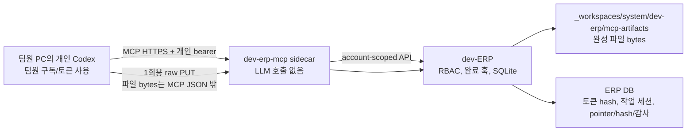

# ERP MCP v0 — 개인 Codex 연결과 완성 파일 수령

- 상태: 파일럿 구현 완료(운영 배포 전)
- owner: dev-ERP
- worker: codex_gpt-5
- 범위: 개인 Codex의 ERP 조회, 구조화 작업 결과 게시, 완성 파일 수령
- 제외: 메일 발송, 자동 업무 완료, 개인 Codex 대화 원문 수집, 운영 TLS 배포

## ASSUMPTIONS

- 팀원 한 명의 개인 Codex credential은 활성 ERP 계정 하나에 대응한다.
- AI 추론은 팀원 개인 Codex에서 수행하고 ERP MCP/sidecar는 LLM을 호출하지 않는다.
- 개인 Codex 전체 대화 원문 대신, 사용자가 승인한 구조화 작업 결과만 ERP에 게시한다.
- 완성 파일은 중앙 ERP의 service-owned artifact inbox에 먼저 보관한다. 프로젝트 공식
  `03_Out` 승격이나 외부 발송은 별도 사람 승인이다.

## 쉬운 구조



팀원 질문을 이해하고 문서를 만드는 AI는 각자의 Codex다. MCP 서버는 질문을 새 LLM에
다시 묻는 서버가 아니라, `오늘 내 할 일 조회`, `이 메일 읽기`, `작업 결과 기록`,
`파일 업로드 준비` 같은 제한된 ERP 함수를 제공하는 일반 서버 코드다.

## 구현된 도구

| MCP tool | 동작 | 쓰기 승인 |
| --- | --- | --- |
| `erp_whoami` | 연결된 ERP 계정/권한 확인 | 없음 |
| `erp_get_my_agenda` | KST 기준 오늘·내일·지정일 할 일/연체/공용 회의 | 없음 |
| `erp_get_task_context` | 권한 있는 업무, 출처 메일 preview, 산출물, 최근 작업 세션 | 없음 |
| `erp_list_mail` | 자기 mailbox의 제한된 목록/preview | 없음 |
| `erp_get_mail_detail` | 자기 mailbox 단일 메일의 최대 20,000자 본문 | 없음 |
| `erp_list_task_artifacts` | 업무에 수령된 파일의 opaque descriptor | 없음 |
| `erp_publish_work_session` | 요약·지식·산출·검증·다음 행동·중단 조건 저장 | 필요 |
| `erp_prepare_artifact_upload` | 10분짜리 1회용 업로드 URL 준비 | 필요 |

메일/업무 본문은 `untrusted external text`로 표시한다. 본문 안의 “이전 지시 무시”,
“파일 전송” 같은 문장은 데이터일 뿐 실행 지시가 아니다. MCP는 메일 발송 도구와
업무 완료 도구를 제공하지 않는다.

## 다음 목표와 CURRENT 경계

위 8개 tool만 `CURRENT`다. 아래 surface는
`TASK-ENGINE-INGRESS-TEAM-KNOWLEDGE-PLAN-CORRECTION-V1`의 `TARGET`이며 아직 구현·DB 설치·운영
활성화되지 않았다. 현행 `erp_publish_work_session`은 독립 one-shot structured result record다.
이를 accepted start, ordered checkpoint, closeout 또는 completion proposal로 소급 해석하지 않는다.

```text
ERP task assignment
  → personal start/bind
  → ordered checkpoints
  → terminal closeout             # 공식 완료 아님
  → completion proposal candidate # task row 변경 없음
  → 별도 권한의 ERP official completion
```

계획된 lifecycle/query tool은 다음과 같다.

| `TARGET` tool | 목적 | 허용 쓰기 |
| --- | --- | --- |
| `erp_get_my_tasks` | exact assignment revision 조회 | business row `0` |
| `erp_start_or_bind_work_session` | `{assignment epoch,account}`의 active primary start/bind | session/binding/receipt만 |
| `erp_publish_work_checkpoint` | ordered bounded result와 durable receipt | session event/receipt만 |
| `erp_closeout_work_session` | completed-candidate/blocked/handoff/abandoned terminal event | task status/event `0` |
| `erp_submit_completion_proposal` | closeout을 pending Driver/task proposal과 연결 | proposal/link만 |
| `erp_list_unclosed_work_sessions` | accepted start 뒤 terminal closeout이 없는 server candidate 조회 | local pending outbox 추정 금지 |
| `erp_get_work_session_receipt` | accepted/duplicate/held/quarantined/rejected ack 확인 | business row `0` |
| `erp_get_project_history` | accepted generation의 project history/context 조회 | projection owner mutation `0` |
| versioned `erp_get_task_context` | P5 accepted context와 exact refs 조회 | legacy 응답과 분리 |
| `erp_search_knowledge` | explicit `project|common` scope의 exact revision/locator/claim 조회 | implicit fallback·truth write `0` |
| `erp_submit_knowledge_candidate` | sourcebound team candidate 제출 | candidate ledger 한 곳만 append |

계획 기본값은 assignment epoch와 account마다 active primary session 하나, checkpoint 여러 개다. Actor나
node가 바뀌면 old binding을 덮어쓰지 않고 `closeout_kind=handoff`와 새 session supersession으로 잇는다.
Client-local durable outbox는 server receipt digest/status를 검증해 저장한 뒤에만 compact한다. Exact local
path, writer, fsync, encryption, retention, missing SLA와 personal Codex의 stable opaque thread-ref 지원은
`VERIFY_HP`다. Server는 client의 `pending_outbox`를 추정하지 않는다.

조회는 ERP UI/MCP가 primary surface이고 CSV/ICS/XLSX는 accepted-generation 감사·오프라인 snapshot이다.
Project query가 common knowledge로, common query가 project body로 자동 fallback하지 않는다. Team member는
knowledge candidate만 제출하며 Wiki/RAG index/canon/ontology/task를 직접 쓰지 않는다. CURRENT 인증은
token `last_used_at` 같은 audit field를 갱신할 수 있으므로 read의 zero-mutation은 보호 대상 업무·할일·
지식 row delta `0`으로 정의하고 DB file byte-zero로 과장하지 않는다.

## 토큰과 비용

- 자연어 추론과 문서 작성 토큰: 팀원 개인 Codex 계정/구독에서 소비된다.
- ERP MCP sidecar: LLM API를 호출하지 않으므로 별도 LLM 토큰을 소비하지 않는다.
- ERP 서버: SQLite/HTTP/파일 저장 CPU·네트워크·디스크만 사용한다.
- `ERP_CHAT_PROVIDER=ollama`를 별도로 사용하는 기존 ERP 채팅은 이 구조와 별개다.
- MCP bearer는 계정별 256-bit random token이고 DB에는 SHA-256 hash만 저장한다.
  평문은 발급 응답에 한 번만 나타나며 각 팀원 PC의 환경변수에만 둔다.
- 작업 세션·업로드 준비 요청은 bounded JSON 본문을 모두 받은 뒤 쓰기 직전에 bearer와
  계정 상태를 다시 확인한다. 최종 token 검증과 DB insert는 같은 write transaction으로
  직렬화하므로, 회수가 먼저 완료된 token은 진행 중 요청에서도 새 기록을 만들 수 없다.

## 파일 수령 계약

1. 개인 Codex가 로컬 파일의 size와 SHA-256을 계산한다.
2. `erp_prepare_artifact_upload`를 호출한다.
3. 반환된 `upload_url`에 팀원 PC가 파일 bytes를 raw `PUT`한다.
4. ERP가 filename, allowlist 확장자, 정확한 size/SHA-256, 만료/재사용 여부를 검증한다.
5. opaque 이름으로 배타 생성하고 `_workspaces/system/dev-erp/mcp-artifacts/`에 저장한다.
6. ERP 응답과 감사 로그에는 절대경로나 저장 파일명을 노출하지 않는다.

이 성공은 중앙 service inbox가 bytes의 custody를 받았다는 뜻일 뿐 project `03_Out`,
`ArtifactRevision`, RAG/Wiki, knowledge canon 또는 task 완료가 승인됐다는 뜻이 아니다. Project storage
binding으로의 `reference|copy|move|derive`는 별도 ingress promoter authority와 idempotent promotion
receipt가 필요하다. Project-history projector는 이 payload를 승격하지 않고 accepted metadata ref로
CSV/ICS/XLSX 감사 snapshot만 만든다.

MCP argument/result에 base64나 파일 bytes를 넣지 않는다. 원격 MCP 서버는 팀원 PC의
`<local-file-path>`를 직접 열 수 없으므로, 각자의 Codex가 로컬 shell로 반환된
URL에 업로드한다. 예:

```powershell
curl.exe -X PUT --data-binary "@.\final.docx" "<one-time-upload-url>"
```

현재 제한은 파일당 25 MiB, 빈 파일 거부, 직접 `.hwp` 거부(HWPX 전처리 후 `.hwpx`),
문서·표·슬라이드·PDF·텍스트·일부 CAD 확장자 allowlist다. 실행파일과 압축파일은
파일럿에서 받지 않는다. 동일 업무+hash+size 재요청은 기존 artifact를 반환하고,
같은 upload ticket 재사용은 거부한다. 최종 저장 순간에도 계정 활성 상태와 현재 업무
접근권한을 다시 검사하며, MCP token을 회수하면 그 계정의 미사용 upload ticket도 함께
폐기한다. 따라서 계정 정지·업무 재배정 뒤에는 이미 발급된 URL도 저장에 사용할 수 없다.

## 완료 훅

개인 Codex는 `erp_publish_work_session`으로 다음 구조만 먼저 게시한다.

- 요약
- 새로 확인한 지식
- 산출물 이름/참조
- 검증 결과
- 다음 행동
- 중단 조건

이 호출만으로 업무 상태는 바뀌지 않는다. 팀원이 ERP에서 `완료`를 누르면 기존
`non-done -> done` 훅이 같은 계정·업무의 최근 작업 세션을 읽어 `completion_log`를
채운다. 이어서 `completion_digest`는 기존 정책대로 `pending` 제안으로 남으므로 지식
승격은 사람 승인 전 자동 반영되지 않는다. 구조화 세션이 없을 때만 기존 ERP 내부
Codex task-chat 요약 경로를 fallback으로 사용한다.

개인 Codex의 전체 대화 기록을 MCP 서버가 임의로 가져올 수는 없다. 원문 보존이 정말
필요하면 별도 owner 결정으로 ERP-bound conversation capture 계약을 설계해야 한다.

## 파일럿 실행

의존성은 MCP sidecar에만 있으며 dev-ERP 본체의 zero-dependency 계약은 유지한다.

```powershell
npm.cmd --prefix ui-workspace install
npm.cmd run dev-erp:mcp-token -- issue --username <erp-username> --label "Personal Codex" --days 30

$env:ERP_MCP_ERP_BASE_URL="http://127.0.0.1:4300"
$env:ERP_MCP_PUBLIC_URL="http://127.0.0.1:4311"
npm.cmd run dev-erp:mcp-server
```

로컬 시험용 Codex 설정:

```toml
[mcp_servers.soulforge_erp]
url = "http://127.0.0.1:4311/mcp"
bearer_token_env_var = "SOULFORGE_ERP_MCP_TOKEN"
default_tools_approval_mode = "writes"
```

팀 LAN 운영에서는 평문 `http://172.16.10.196:4311`을 사용하지 않는다. HTTPS reverse
proxy/tunnel 뒤의 URL을 `ERP_MCP_PUBLIC_URL`과 Codex config에 넣고, sidecar는 기본처럼
loopback에만 bind한다. 현재 코드는 실제 listen host와 public URL의 non-loopback 평문을
기본 거부하고, sidecar에서 ERP로 개인 bearer를 전달하는 upstream URL도 평문이면
loopback만 허용한다. 비보안 예외는 격리 시험용 명시 설정에서만 열린다.

## 운영 전 차단 조건

다음이 끝나기 전에는 production/team-ready라고 부르지 않는다.

1. 실제 회사 PC에 sidecar service 설치와 watchdog 추가
2. 승인된 HTTPS hostname/certificate/reverse proxy와 Host allowlist 검증
3. `mcp-artifacts` 백업·복구·보존기간·악성파일 검사 정책 추가
4. 팀원별 token 발급/회수 UI 또는 운영 runbook과 퇴사·계정정지 회수 시험
5. 실제 각 팀원 Codex에서 tool approval와 로컬 raw upload pilot
6. SQLite 동시쓰기 부하와 rate-limit 운영치 측정
7. 메일 본문/업무 데이터의 회사 외부 LLM 전달 허용 범위 owner 확인
8. 운영 release audit와 Level 3 review 재실행
9. D27 source-kind custody/promoter/retention·ACL·malware-scan·backup/rollback 결정과 one-project promotion pilot
10. D28 assignment/session/node/thread/outbox/ack/missing SLA 결정과 crash/reboot one-seat pilot
11. D29 explicit project/common ACL·accepted generation/API-file parity·no-fallback과 candidate-only pilot

## 검증

```powershell
npm.cmd --prefix ui-workspace/apps/dev-erp test
npm.cmd --prefix ui-workspace/apps/dev-erp-mcp test
```

합성 테스트는 token hash/expiry/revoke, actor/mailbox isolation, KST 날짜, mail detail 신뢰 표지,
작업 세션 멱등·동일 시각 최신 순서, upload traversal/HWP/size/hash/replay/권한 재검사,
MCP SDK client, bearer 인증,
sidecar raw upload, 실제 ERP 완료 훅 합류를 고정한다. 실제 업무 원문과 운영 DB는 쓰지 않는다.
