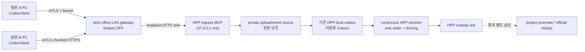

# HPP evidence ingress MCP v1 — 파일·PC 업무·실행 이력 접수

- 상태: public 구현 + 합성 multi-tenant E2E 검증, 운영 feature OFF
- owner: HPP ingress receiver 후보; project promoter·ERP·TaskEngine owner가 아님
- worker: codex_gpt-5
- 범위: 팀원 PC의 파일, bounded structured PC work, bounded run receipt
- 제외: 메일 credential/수집, 음성 source writer, ERP DB, 프로젝트 승격, 공식 이력·업무 완료, 실제 LAN/TLS 운영

## 왜 별도 MCP인가

기존 ERP MCP는 ERP DB와 ERP artifact inbox에 쓰므로 “먼저 RAW/증거를 HPP에 안전하게 모은다”는
현재 단계의 유일한 수신 경로로 직접 재사용할 수 없다. 대신 검증된 bearer hash, 만료·폐기,
size/hash-bound upload, idempotency, loopback 기본값을 재사용해 별도 ingress MCP를 만들었다.



## 구현된 도구와 결과

| MCP tool | 기능 | 쓰기 범위 |
| --- | --- | --- |
| `ingress_whoami` | account/device/agent, project scope, capability 조회 | 없음 |
| `ingress_prepare_file_upload` | idempotent ticket와 chunk URL 준비 | private pending ticket/source |
| `ingress_get_upload_status` | 재개 offset 조회 | 없음 |
| `ingress_publish_work_event` | bounded PC work checkpoint 접수 | `structured_pc_work` local outbox |
| `ingress_publish_run_receipt` | bounded 실행·검증 receipt 접수 | `run_logs` local outbox |
| `ingress_get_submission_status` | HPP ack 전/후 확인 | 없음 |

파일은 `team_files` local outbox로 들어간다. 확장자, 파일명, 최대 크기, exact byte count와 SHA-256을
검사한다. 같은 credential+idempotency는 재시작 뒤에도 같은 ticket/submission으로 복구된다. chunk
offset 충돌은 현재 server offset을 반환하므로 client가 source를 다시 지우거나 처음부터 복사하지 않고
재개할 수 있다. source와 outbox 사본은 삭제·덮어쓰지 않는다.

## 권한과 정보 경계

credential은 `{credential_id, account_id, device_id, agent_id}`를 분리하고 exact project scope와 다음
capability 중 필요한 것만 가진다.

- `upload:team_files`
- `publish:structured_pc_work`
- `publish:run_logs`
- `receipt:read`

token 평문은 발급 시 한 번만 반환하고 private registry에는 SHA-256만 둔다. 만료·폐기·credential
rotation은 다음 요청부터 즉시 실패한다. submission은 같은 account이면서 현재 project scope에도 포함된
경우에만 보이며, 다른 account에는 존재 여부를 숨긴 `404`를 반환한다. ticket 문자열만으로는 권한이
아니며 모든 chunk/status/finalize 요청에 같은 bearer가 필요하다.

bounded event는 summary, outputs, verification, next actions, stop conditions만 허용한다. 다음 값은 항상
`false`이며 true이거나 알 수 없는 필드가 들어오면 거부한다.

- 공식 업무 완료
- 전체 Codex 대화/전사
- 화면 캡처
- 키 입력 수집
- OS 감시

## ack 의미

```text
클라이언트 전송 완료
  └─ pending_server_ack       # local outbox 접수만 됨
       └─ verified_server_ack # HPP ack의 occurrence/hash/size 일치
            └─ 아직 아님: 프로젝트 승격 / ERP DB / accepted history / Task 완료
```

## 합성 검증 범위

합성 테스트는 실제 HTTP/MCP 서버 하나와 서로 격리된 가상 작업 PC 프로세스 세 개를 동시에 실행한다.
가상 팀원은 서로 다른 account/device/agent/project credential로 모든 6개 MCP tool과 chunk/finalize
data plane을 사용한다. 다음을 검증한다.

- 동시 파일·PC work·run receipt 전송과 lane별 3개 payload
- 프로젝트 범위 거부, 다른 account의 object 존재 은닉, 같은 account의 승인된 두 번째 device 조회
- token 만료·폐기, 중복 hash, unknown field, traversal/위험 확장자, hash/ack 변조 거부
- upload 중단 offset, client/server 재시작, idempotent replay, source 무변경
- HPP ack 전 `pending`, digest/size 일치 ack 후 `verified`
- non-loopback 직접 bind와 config feature-OFF 실행 거부
- 합성 RFC1918 endpoint의 TLS 1.3/mTLS, server pin, exact Host와 certificate↔bearer↔account/device/agent 결합
- 미등록·폐기 client certificate, 다른 사람 token 조합, 공인/VPN endpoint, oversized body와 rate 초과 거부
- credential별 open upload·pending byte·retained byte quota, quota lock과 idempotent replay

이 검증은 실제 팀원 등록이나 사내망 운영 acceptance가 아니다.

## 운영 전 중단 조건

아래는 별도 owner 승인 전 계속 OFF다.

1. 실제 팀원 credential·client certificate/private key 발급·전달과 다른 PC 설치
2. HPP의 실제 사내 LAN listener, CA trust, firewall 변경
3. malware scan/quarantine, backup/restore/retention 운영치와 quota 운영값 승인
4. project promoter와 accepted history projector 연결
5. ERP/TaskEngine WorkSession·공식 완료 연결
6. mail credential과 collector 연결
7. one-seat/one-project canary 뒤 team rollout 및 Level 3 운영 재검토

현재 구현은 D27~D29와 P0~P10을 자동 승인하거나 `A8-CANARY/team-ready/production-ready`를 주장하지
않는다. private HPP loopback pilot과 feature-OFF 배치는 운영 공개 없이 별도 검증한다.

strict gateway source, client/admin/preflight와 합성 adversarial E2E는 구현됐지만, 합성 endpoint는 물리
팀원 PC가 아니다. 실제 1-seat 전환은 [`INGRESS-MTLS-CANARY-V1.md`](INGRESS-MTLS-CANARY-V1.md)의
외부 조정 중단선을 별도 승인한 뒤 진행한다.
