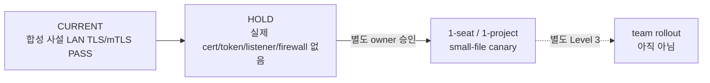

# HPP ingress mTLS one-seat canary v1

- 상태: public source + synthetic adversarial E2E PASS, 실제 PC 연결 전 HOLD
- 대상: 사내 RFC1918 LAN의 물리 작업 PC 한 대와 HPP 한 대
- 목적: 파일·bounded PC 업무·실행 receipt가 HPP custody까지 안전하게 도착하는지 확인
- 비목적: 프로젝트 승격, accepted history, ERP/TaskEngine 완료, 메일·음성 collector 활성화

## 현재와 다음 단계



현재 구현은 다음을 제공한다.

- gateway는 exact RFC1918 IPv4와 port 하나에만 bind하고, 별도의 exact RFC1918 client IPv4만
  application layer에서 허용하며 backend는 loopback만 사용한다.
- TLS 1.3, client certificate CA 검증, server certificate pin, exact Host를 검사한다.
- certificate 등록의 credential/account/device/allowed agent와 bearer identity가 모두 맞아야 한다.
- 미등록·만료·폐기 certificate와 token, 다른 사람/PC/AI 조합을 즉시 거부한다.
- credential별 요청률, 동시 요청, open upload, pending bytes, retained bytes를 제한한다.
- client preflight는 public certificate와 파일 존재·유효기간만 확인하며 key/token 값을 출력하지 않는다.
- read-only probe는 `whoami` 결과가 client binding의 expected identity와 exact match하는지만 확인한다.

## 물리 한 자리 패킷

owner가 실제 외부 조정을 승인한 뒤 HPP 관리자가 자리마다 아래 항목을 별도로 만든다.

| 항목 | 저장/전달 원칙 |
| --- | --- |
| CA certificate | public trust material; 승인된 사내 전달면 |
| client certificate | 한 사람·한 PC용 public certificate |
| client private key | 해당 PC의 OS-protected private 영역; Git/채팅/명령행 금지 |
| personal bearer | 한 credential용 값; admin CLI가 operator 준비 OS-protected directory의 새 파일에만 쓰고 stdout에는 출력하지 않음 |
| gateway binding JSON | exact HPP listen IP와 그 주소와 다른 exact `allowed_client_ipv4`; enabled일 때 null 금지 |
| client binding JSON | exact HPP private IP, CA/cert/key pointer, server cert SHA-256 pin, expected account/device/agent |
| project scope | canary 프로젝트 하나만 exact allowlist |

사람과 AI는 합치지 않는다. bearer credential은
`{credential_id, account_id, device_id, agent_id}`를 갖고, client certificate 등록은 같은
`{credential_id, account_id, device_id}`와 허용 agent 목록을 갖는다. 둘 중 하나라도 다르면 `403`이다.

## 승인 뒤 실행 순서

1. HPP에서 gateway와 loopback ingress의 private binding, quota, backup/retention 값을 검토한다.
2. HPP server certificate와 자리별 client certificate를 승인된 CA로 만든다.
3. public client certificate만 HPP private device registry에 등록한다. private key는 HPP registry로 복사하지 않는다.
4. 자리별 bearer를 새 OS-protected token 파일로 발급하고, 팀원 PC의 OS-protected environment에
   사용자가 직접 넣는다. CLI stdout, Git, 채팅에는 값을 남기지 않는다.
5. 팀원 PC에서 쓰기 없는 preflight와 identity probe를 먼저 실행한다.

```powershell
$env:SOULFORGE_INGRESS_MTLS_BINDING="<private-absolute-client-binding-path>"
npm.cmd run ingress:mtls-canary -- preflight --binding $env:SOULFORGE_INGRESS_MTLS_BINDING

$env:SOULFORGE_INGRESS_TOKEN="<OS-protected-personal-token>"
npm.cmd run ingress:mtls-canary -- probe --binding $env:SOULFORGE_INGRESS_MTLS_BINDING
```

6. read-only probe가 exact identity를 반환한 뒤에만 작은 synthetic 파일 하나, bounded work event 하나,
   run receipt 하나를 canary project로 보낸다.
7. client의 source 무변경, HPP outbox payload/hash, `pending_server_ack`와 receiver 뒤
   `verified_server_ack`를 대조한다.
8. certificate와 token을 폐기한 뒤 다음 요청이 실패하는지 확인하고 rollback/재발급 절차를 기록한다.

## 합격·중단 조건

one-seat canary 합격에는 다음이 모두 필요하다.

- 물리 작업 PC의 normalized source IPv4가 gateway allowlist와 exact match하고 public/VPN/Tailscale 우회가 없다.
- client certificate, bearer, account/device/agent, project scope가 exact match한다.
- 파일 bytes와 SHA-256이 일치하고 source는 삭제·변경되지 않는다.
- HPP custody ack 전/후 상태가 정확하며 project promotion/ERP/Task 완료는 계속 false다.
- token 또는 certificate 폐기 즉시 다음 요청이 거부된다.
- gateway/ingress/receiver 중지와 firewall rule 제거로 rollback할 수 있다.

다음이면 즉시 중단한다.

- 실제 key/token이 stdout, Git, 문서, 로그, 채팅에 노출됨
- HPP actual LAN IP drift, 예상하지 않은 listener, public/VPN route 또는 direct SMB/UNC가 발견됨
- source 삭제·덮어쓰기, DB/ERP/project history mutation, 다른 프로젝트 접근이 발생함
- malware/backup/retention 또는 quota 운영값이 승인되지 않은 채 실제 업무 파일을 보내야 함
- 합성 테스트를 물리 canary나 team-ready 증거로 대체하려 함

source IPv4 검사는 TLS handshake 뒤 HTTP handler에서 certificate registry와 bearer auth보다 먼저 수행하는
추가 fail-closed guard이며, 좁은 OS firewall source rule을 대신하지 않는다.

## 현재 정확한 중단점

실제 HPP LAN listener·firewall rule, 실제 CA/server/client material, 개인 bearer, 다른 PC 설치·probe는
아직 만들거나 활성화하지 않는다. 이것들이 필요한 바로 직전이 owner 승인 경계다.
