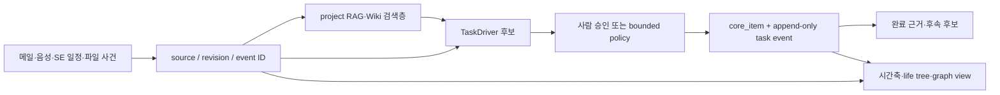

# 11. 구현 상태와 RAG 재개 관문

- 상태: `canon_candidate`; public synthetic 구현 완료, project-local RAG 단일 pilot 검증 완료
- claim ceiling: `pilot_accepted`는 RAG V1 경로에만 적용한다. TaskDriver live DB와 운영 자동화는 미활성이다.
- owner: ENGINE-13 실행 상태와 다음 PC handoff
- stop: `operational-primary` writer attestation 없이 dev-ERP 실 DB를 변경하지 않는다.

## CURRENT / TARGET / VERIFY_HP

| 영역 | CURRENT | TARGET | VERIFY_HP |
| --- | --- | --- | --- |
| 메일 | `core_mail`과 source-local 수집/이력 surface가 있고 causal ref는 분산됨 | exact message occurrence와 source revision에서 Driver 후보 생성 | 실제 mailbox coverage, 누락 구간, auto-open caller |
| 음성 | capture/transcript provenance와 수락 후보 surface가 있음 | recording과 transcript revision을 `derived_from`으로 잇고 후보만 생성 | 운영 primary, speaker/project binding, coverage |
| SE 일정 | 일정·gate·규칙 계약은 있으나 통합 task causal loop가 없음 | exact rule/event revision을 `why-now` 근거로 사용 | 실제 일정 owner와 rule revision coverage |
| 파일 이력 | logical file/revision/content 분리 계약과 observation surface가 있음 | sole reconciler가 여러 PC 관측을 한 revision chain으로 조정 | exact workspace binding, reconciler, deletion authority |
| 시간축 | ENGINE-12 life tree는 source-local ledger의 read-only projection | `valid_at`/`known_at` cut으로 task와 근거를 결정적으로 재생 | 실제 ledger gap, clock regression, source caps |
| RAG/Wiki | common-root legacy asset이 있고 project-local V1 writer/pilot이 추가됨 | project payload와 common payload를 owner root로 완전 분리 | project별 approved root, consumer parity, ACL |
| ID 관계 | `ID_CONTRACT_V1`과 공통 생성 helper가 구현됨 | source→revision→locator/chunk→Driver→task를 exact typed ref로 연결 | legacy occurrence와 기존 ERP ID crosswalk |
| TaskDriver | validator/replay와 opt-in SQLite persistence adapter가 합성 검증됨 | sole writer가 append-only ledger와 `core_item` projection을 한 transaction으로 적용 | 운영 DB 백업, schema 충돌, writer identity, 1~3 task pilot |
| PC 역할 | 현재 구현은 `tool_pc`에서 수행 가능, live DB writer는 켜지 않음 | tool/voice/portable/always-on 역할을 logical identity로 분리 | 어느 `always_on_node`가 현재 operational primary인지 |

## 작은 전체 도식



RAG와 view는 검색·표시층이다. source truth, task truth, 승인 authority를 대신하지 않는다.

## ID와 파일 구조

```text
project_ref: {entity_type: project, owner_surface: project_registry, entity_id: Pxx-xxx}
  └─ source_id: src_<digest>
      └─ source_revision_id: sr_<digest> + content_id: sha256:<full>
          ├─ extraction_run_id: exr_<digest>
          ├─ evidence_locator_id: loc_<digest>
          └─ rag_index_id: ridx_<digest>
              └─ rag_chunk_id: rch_<digest>

trigger/event + exact revision
  └─ driver_id + target_intent_ref
      └─ existing core_item.id                 # 새 task truth를 만들지 않음
```

```text
_workspaces/<project_code>/
└─ reference_payloads/
   ├─ knowledge_extract/<batch>/               # 원문 파생 payload owner
   └─ rag/
      ├─ indexes_local/
      ├─ traceability_sidecars/
      ├─ answer_runs/
      ├─ source_text_quality_reviews/
      ├─ source_text_work_cards/
      └─ operational_routes/

_workmeta/<project_code>/                       # metadata·pointer·hash·receipt만
├─ knowledge/source_revision_records/
├─ ontology/
└─ reports/

ui-workspace/apps/dev-erp/
├─ src/task_driver.mjs                          # 순수 계약·replay
└─ src/task_driver_persistence.mjs              # 명시 설치형 SQLite adapter
```

## 구현된 public surface

| 파일 | 책임 |
| --- | --- |
| `docs/architecture/foundation/ID_CONTRACT_V1.md` | source/RAG/task ID 생성·충돌 계약 |
| `guild_hall/shared/temporal_identity.mjs` | canonical JSON, typed ref, exact ID builder |
| `guild_hall/rag/project_rag_paths.mjs` | owner root와 traversal/junction/collision guard |
| `guild_hall/rag/project_rag_migration_dry_run.mjs` | legacy asset 분류·이동 map·hold 판정 |
| `guild_hall/rag/project_rag_pilot.mjs` | metadata-only V1 index/lineage/answer/rollback bundle |
| `guild_hall/rag/project_rag_writer.mjs` | owner 승인, exclusive create, readback, rollback |
| `ui-workspace/apps/dev-erp/src/task_driver.mjs` | intent/Driver/event/policy/two-axis/replay |
| `ui-workspace/apps/dev-erp/src/task_driver_persistence.mjs` | append-only ledger와 `core_item`의 원자적 적용 |

`task_driver_persistence.mjs`는 `openStore`나 server 시작 경로에 자동 연결하지 않았다.
`installTaskDriverPersistence(db)`를 명시적으로 호출하기 전에는 runtime DB를 바꾸지 않는다.

## 프로젝트별 RAG를 다시 시작할 수 있는 시점

TaskDriver live DB를 기다릴 필요는 없다. 각 프로젝트가 아래 관문을 독립적으로 통과하면 그
프로젝트의 RAG 색인을 재개할 수 있다.

1. `project_ref`, `source_id`, exact `source_revision_id`, `content_id`가 확정됨
2. source card와 ready manifest의 byte hash·length·project permission이 일치함
3. legacy asset/consumer dry-run이 `READY`이며 unresolved/collision/path escape가 없음
4. `_workspaces/<project_code>/reference_payloads/rag`의 exact owner binding이 승인됨
5. V1 bundle build 후 exclusive apply와 readback digest가 통과함
6. rollback drill과 같은 bundle 재적용 no-op가 통과함

단일 project pilot에서는 위 순서를 실제로 통과했다. 실제 project ref와 output refs는 public
문서가 아니라 해당 `_workmeta/<project_code>/reports/**` evidence에만 둔다. 다른 프로젝트는
같은 ID를 복사하지 않고 자기 source revision과 owner decision으로 1~6을 다시 통과해야 한다.

## 다음 실제 작업

### RAG 프로젝트 추가

```text
source register -> ready manifest -> dry-run READY
  -> owner-root bootstrap -> bundle build -> apply/readback
  -> rollback drill -> reapply/no-op -> project reader 전환 결정
```

legacy index는 pilot 중 삭제하지 않는다. reader 전환과 legacy 신규 write 금지는 별도 activation
결정이다.

### TaskDriver live DB pilot

다음 단계는 `operational-primary`로 확인된 PC에서만 한다.

1. DB backup과 read-only schema/status/auto-open crosswalk
2. exact writer attestation과 allowed project/task scope 고정
3. 별도 runtime checkout에서 persistence schema 명시 설치
4. owner-approved task 1~3건으로 candidate→approve→apply→done→follow-up-candidate 검증
5. replay/current row/event log parity와 DB restore drill
6. 독립 리뷰 뒤 writer 확대 여부를 별도 결정

scanner, scheduler, Tailscale, Telegram, broad corpus migration은 이 단계에도 포함하지 않는다.

## 검증 상태

| 검증군 | 상태 |
| --- | --- |
| ID/canonicalization/path/dry-run | synthetic `PASS` |
| RAG bundle/writer/readback/rollback | synthetic `PASS`, single-project pilot `PASS` |
| TaskDriver/two-axis/authority/replay | synthetic `PASS` |
| SQLite append-only/atomic apply/idempotency | synthetic `PASS` |
| dev-ERP live DB apply/restore | `VERIFY_HP` / 미실행 |
| live multi-PC packet, alert clock | `GATE` / 미활성 |

전체 claim은 계속 `canon_candidate`다. RAG 단일 pilot 통과를 TaskDriver 운영 활성화나 전체
corpus production-ready로 확대 해석하지 않는다.

## 2026-07-14 independent-review hardening

- migration dry-run v2 now records exact nested target refs and optional rebuilt target
  digests, so an old ref cannot be mapped only to an asset-kind directory.
- project pilot refs now bind to the exact project owner slot; a foreign root carrying
  the requested token in a later filename is rejected.
- project RAG apply and rollback persist local transaction plans and completion receipts.
  Retrying the same call recovers a partial local operation. Target parents must be
  prepared plain directories; the writer does not create them recursively.
- TaskDriver rejects future-cutoff apply persistence, advancing-cutoff replay no longer
  changes immutable authority evidence, and current `core_item` drift blocks a stale
  projection.
- Remaining stop: no live DB install, reader switch, scheduler, external upload, broad
  corpus expansion, or adversarial concurrent junction-swap safety claim on this PC.
