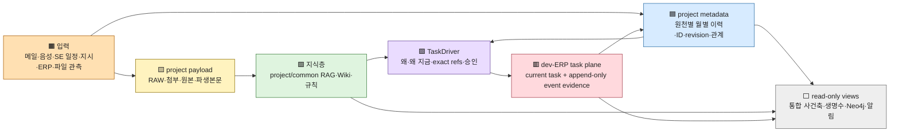

# dev-ERP 할일 엔진 재설계 패키지

- 상태: `canon_candidate`; 문서/합성 검증용, runtime 구현·운영 활성화 아님
- owner: dev-ERP task engine design; 상위 task lifecycle owner는
  [`PROJECT_TASK_ENGINE_LIFECYCLE_V0.md`](../../../../../docs/architecture/workspace/PROJECT_TASK_ENGINE_LIFECYCLE_V0.md)
- authority: 이 패키지는 cold-start 계획·migration gate를 소유하며 source truth, owner 승인,
  live writer authority를 만들지 않는다.
- 중단선: 실제 project payload/private binding/secret이 필요하거나 대상 PC 역할·writer가
  불명확하면 읽기·설계까지만 하고 멈춘다.

## 한 장 master flow



색은 저장/authority 층을 뜻한다. 화살표는 복사를 뜻하지 않으며, RAW 본문은 metadata나
공개 문서로 이동하지 않는다. 통합 사건축·생명수·Neo4j는 세 owner 층을 읽는 view다.

```text
source-local current records + append-only event/revision ledgers
  -> exact event/source/file revisions + valid_at/known_at
  -> TaskDriver candidate (why / why-now / exact refs)
  -> explicit approval or bounded deterministic policy
  -> core_item + append-only task events
  -> work execution + completion evidence
  -> knowledge candidate + follow-up TaskDriver candidate
  -> read-only event axis / life tree / alerts
```

RAG·Wiki·Neo4j·life tree·notification은 위 흐름을 찾고 보여주는 projection이다. 어느 것도
task/source/canon truth를 대신하지 않는다.

## 정확한 읽기 순서

1. root `AGENTS.md`
2. [`AGENT_EXECUTION_CONTRACT_V0.md`](../../../../../docs/architecture/foundation/AGENT_EXECUTION_CONTRACT_V0.md)
3. [`DEVELOPMENT_ROADMAP_V0.md`](../../../../../docs/architecture/foundation/DEVELOPMENT_ROADMAP_V0.md)
4. [`PROJECT_TASK_ENGINE_LIFECYCLE_V0.md`](../../../../../docs/architecture/workspace/PROJECT_TASK_ENGINE_LIFECYCLE_V0.md)
5. 이 `README.md`
6. [`01_VISION_AND_SCOPE.md`](01_VISION_AND_SCOPE.md)부터
   [`09_VALIDATION_AND_ACCEPTANCE.md`](09_VALIDATION_AND_ACCEPTANCE.md)까지 번호순
7. 실제 고성능 PC에서는 마지막에만
   [`10_HIGH_PERFORMANCE_PC_PLAN_MODE_RUNBOOK.md`](10_HIGH_PERFORMANCE_PC_PLAN_MODE_RUNBOOK.md)
8. 구현·pilot 이후 현재 상태와 RAG 재개선은
   [`11_IMPLEMENTATION_STATUS_AND_RESUME_GATE.md`](11_IMPLEMENTATION_STATUS_AND_RESUME_GATE.md)
9. 실행 slice는 [`ENGINE-13`](../slices/ENGINE-13-TASK-DRIVER-CLOSED-LOOP.md)

## 잠긴 owner 결정

- project raw/derived text/Wiki/project RAG payload는 `_workspaces/<project_code>/**`에 둔다.
- project metadata/ontology는 `_workmeta/<project_code>/**`에 둔다.
- `_workspaces/knowledge/**`는 cross-project common knowledge 전용이다.
- project RAG target은 `_workspaces/<project_code>/reference_payloads/rag/**`다.
- source-local ledgers를 유지하고 통합 사건축/생명수는 read-only projection으로 만든다.
- 장기 과제는 논리적으로 한 이력이어도 물리적으로는 월별 append-only 사건 파일과
  revision별 record/checkpoint로 나눈다. 하나의 거대 파일을 계속 키우지 않는다.
- `valid_at`과 `known_at`, source/file revision identity를 분리한다.
- LLM은 후보만 만든다. 완료는 후속 Driver 후보를 만들 수 있지만 조용히 auto-open하지 않는다.
- Mac mini는 voice primary/watchdog 목표, 고성능 PC는 ERP/context/RAG/life-tree engine 목표다.
  exact node binding과 sole reconciler 지정은 검증 전 확정하지 않는다.

## 열린 결정과 verification gate

- TaskDriver physical table/ledger의 synthetic shape는 구현됐고, live DB 설치·기존 할일
  migration 방식은 operational-primary 검증 대기
- 허용 `driver_kind`, auto-apply policy scope, revocation/expiry의 owner 승인
- `cancelled`/`merged`와 현행 `archived`의 UI·migration 의미
- 고성능 PC가 `tool_pc`와 `always_on_node`를 겸하는지, sole reconciler가 어느 node인지
- 실제 pilot project, approved source roots, hash/path display ACL
- Tailscale transport와 Telegram cooldown 수치의 운영 승인

## 상태 범례

| 표식 | 뜻 |
| --- | --- |
| `LOCKED` | 이 작업에서 받은 owner 결정; 구현 여부와 별개 |
| `CURRENT` | public tracked 문서/코드에서 관찰한 현행 |
| `TARGET` | migration 후 목표 계약; 현재 지원 주장 아님 |
| `DEFAULT` | 합성 설계 기본값; 운영 전 owner 검토 가능 |
| `VERIFY_HP` | 고성능 PC의 실제 metadata/read-only inventory로 확인 필요 |
| `GATE` | 닫히기 전 writer·scanner·scheduler·network activation 금지 |

## 용어

- **TaskDriver**: 할일/전이의 `왜`와 `왜 지금`을 exact refs로 설명하는 causal record.
- **source revision**: 논리 source의 정확한 판/개정/스냅샷.
- **decision/application state**: 후보가 승인·적용됐는지 나타내는 축.
- **work status**: 적용된 할일이 실제로 어디까지 진행됐는지 나타내는 별도 축.
- **source-local ledger**: 각 입력 owner가 보존하는 원천 이력.
- **unified event projection**: 원장을 합치지 않고 읽기 시점에 만드는 사건 view.
- **sole reconciler**: node packet을 검증해 canonical projection을 쓰는 단 하나의 writer.

## no-raw / public boundary

이 패키지와 ENGINE-13에는 실제 project code/name, raw file/body/transcript/chunk, hostname,
절대경로, account ID, private binding, secret을 기록하지 않는다. 예시는 `EXAMPLE` 같은
합성 식별자와 opaque refs만 쓴다. 고성능 PC의 실제 inventory·crosswalk·pilot evidence는
올바른 private owner에 metadata-only로 남기며 public 문서에는 안정된 추상만 반영한다.
