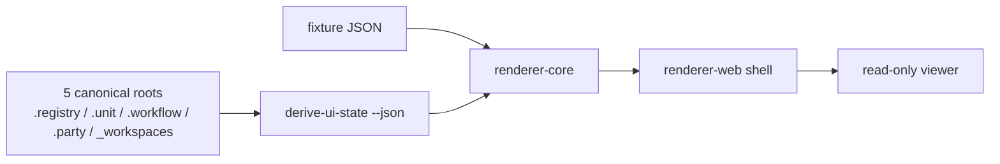

# UI Renderer Model

## 목적

- Soulforge UI renderer v1 을 "정본 구조를 직접 읽지 않는, 이식 가능한 read-only consumer" 로 고정한다.
- 구조 개발과 UI 개발이 병렬로 진행되도록 renderer 의 책임을 source-of-truth 바깥에 둔다.

## renderer 가 하는 일

- `derive-ui-state --json` 또는 fixture JSON 을 읽는다.
- normalized UI state contract 를 기준으로 overview, body, class, workspaces, diagnostics surface 를 렌더링한다.
- producer 가 5 canonical root 에서 풀어낸 6 consumer axis projection metadata 를 함께 읽을 수 있다.
- local selection state 를 통해 탭 전환, item focus, catalog preview, info dock context 를 관리한다.

## non-goals

- `.registry`, `.unit`, `.workflow`, `.party`, `_workspaces` 정본 파일 직접 읽기
- canonical YAML 저장, patch, write-back, mutation
- workflow 실행, runtime control-plane, team-agent orchestration
- selection persistence, host-local session restore

## read-only boundary

- canonical source scan/resolve/validate/derive 는 producer concern 이다.
- producer 는 5 canonical root 를 6 consumer axis 와 renderer surface 입력으로 정리한다.
- renderer-core 는 producer output 을 normalize 하고 view-model 로 변환하는 consumer concern 이다.
- renderer-web 는 shell, theme, interaction surface 만 가진다.

## portability 목표

- renderer-core 는 가능한 한 framework-neutral TypeScript package 로 유지한다.
- renderer-react 는 presentational layer 로 유지하고 host shell 과 분리한다.
- renderer-web 는 브라우저 shell 이며, 향후 다른 host app 이나 다른 저장소로 교체 가능해야 한다.
- schema 와 fixture 는 package 밖 `ui-workspace/` 경계에 두어 repo-level 계약과 package-level 구현을 분리한다.

## mode 분리

### fixture mode

- full v1 contract fixture 를 직접 읽는다.
- generator 부재나 partial generator 상태에서도 UI 개발을 계속할 수 있다.
- visual/theme/interaction 작업의 기본 모드다.

### provider mode

- renderer-web 기본 shell 은 provider 구현을 내장하지 않는다.
- 필요 시 별도 provider 또는 tool 이 payload 를 제공하고, renderer-core 는 그 payload 를 v1 contract 로 normalize 한다.
- fixture-first 개발 흐름은 provider 유무와 무관하게 유지된다.

## local selection vs persistence

- local selection:
  - active tab
  - selected item
  - opened catalog row
  - candidate preview target
  - info dock focus
- persistence:
  - canonical selection write
  - body/class/workspace binding 저장
  - editor draft restore
  - host-local remembered view state

v1 은 local selection 만 가진다.

## package split 이유

1. contract normalization 과 view-model 계산은 다른 host app 에도 재사용 가능해야 한다.
2. React surface 는 renderer-core 와 분리해 다른 framework shell 이 생겨도 core 를 재사용할 수 있어야 한다.
3. Adventurer's Desk skin 은 theme package 로 분리해 다른 skin 을 얹기 쉽게 해야 한다.
4. schema/fixture 검증은 app shell 과 독립적으로 돌아야 한다.
5. 이후 Electron, Tauri, web component host 로 이동하더라도 core 와 contract 를 다시 쓸 수 있다.

## 구조 병행 개발이 가능한 이유

- `.registry`, `.unit`, `.workflow`, `.party`, `_workspaces` 구조는 계속 자랄 수 있다.
- producer 는 canonical source 를 scan/resolve/derive 하며 6 consumer axis projection 을 만든다.
- renderer 는 normalized contract 만 신뢰한다.
- 따라서 canonical 구조 변경은 producer/fixture 갱신으로 흡수하고, renderer surface 자체는 느슨하게 유지할 수 있다.

## v1 output surface

- 상단 탭 4개 고정: `종합 / 본체 / 직업 / 워크스페이스`
- 왼쪽 body/character panel
- 오른쪽 main surface
- 하단 info dock
- diagnostics summary area 통합

## optional viewer 와의 관계

- `apps/renderer-web/` 는 fixture-first portable renderer v1 shell 이다.
